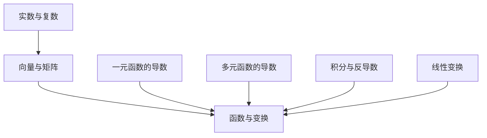

                 

### 文章标题：数学与图像处理：视觉信息的数学变换

视觉信息是人类的感知世界的主要方式，而图像处理技术则在各个领域中发挥着至关重要的作用，从医疗影像到计算机视觉，从多媒体处理到智能监控。为了更好地理解和利用这些视觉信息，数学变换成为了一个不可或缺的工具。本文旨在探讨数学与图像处理之间的深层联系，通过一步步的分析与推理，揭示视觉信息数学变换的核心原理与实际应用。

### 关键词

- 图像处理
- 数学变换
- 视觉信息
- 傅里叶变换
- 小波变换
- 信号处理

### 摘要

本文将系统性地介绍数学与图像处理的基本概念、核心算法和实际应用。首先，我们将回顾数学基础，包括实数与复数、向量与矩阵、函数与变换以及微积分基础。接着，我们将深入探讨图像处理的基础知识，包括图像表示、图像属性和图像处理基本算法。随后，本文将重点关注数学在图像处理中的应用，如频率域分析、信号处理与滤波以及数学模型在图像识别中的应用。最后，我们将通过具体的图像处理项目实战，展示数学变换在现实世界中的应用价值。通过本文的阅读，读者将全面了解数学与图像处理之间的紧密联系，并掌握相关的核心技术和实际应用。

### 第一部分：数学基础

数学是图像处理技术的基石，它提供了描述和分析图像的数学工具和方法。本部分将介绍一些基础的数学概念，包括实数与复数、向量与矩阵以及函数与变换，为后续的图像处理算法奠定理论基础。

#### 1.1 数学工具

##### 1.1.1 基础数学概念

实数是构成数字图像数据的基本单位，每一个像素点的颜色通常由红、绿、蓝三原色分量表示，这些分量都是实数值。复数则在图像处理中也有重要应用，例如在傅里叶变换和滤波器设计中。

**实数与复数**

- 实数：实数是所有我们可以直接理解的数字，如1、2、3等。它们在数轴上可以表示为一个点。
  
  $$ x = 1+2i $$
  
- 复数：复数由实部和虚部组成，通常表示为 \( a + bi \)，其中 \( a \) 是实部，\( b \) 是虚部。复数在数学和物理中有着广泛的应用。

##### 1.1.1.2 向量与矩阵

向量是表示空间中点移动的数学工具，在图像处理中用于表示像素点的位置和颜色。矩阵则是一个二维数组，用于表示图像数据，它在图像处理算法中扮演着核心角色。

- 向量：向量通常表示为一个有序列表，如 \( \vec{v} = [x, y, z] \)，其中 \( x, y, z \) 是向量的分量。
  
  $$ \vec{v} = [1, 2, 3] $$
  
- 矩阵：矩阵是一个二维数组，如 \( A = \begin{bmatrix} a & b \\ c & d \end{bmatrix} \)，它在图像处理中用于表示图像数据，如点阵图像。
  
  $$ A = \begin{bmatrix} 1 & 2 \\ 3 & 4 \end{bmatrix} $$

##### 1.1.2 函数与变换

函数是描述变量之间关系的数学工具，而变换则是将一个函数转换为另一个函数的方法。在图像处理中，变换用于改变图像的亮度和对比度，或者将其转换到不同的坐标系统。

- 函数：函数 \( f \) 通常表示为 \( f: X \rightarrow Y \)，其中 \( X \) 是定义域，\( Y \) 是值域。例如，线性变换函数可以表示为 \( f(x) = ax + b \)。

  $$ f(x) = 2x + 1 $$

- 变换：变换是函数的推广，例如，傅里叶变换将时域信号转换为频域信号。线性变换矩阵可以表示为 \( T(x) = Ax \)。

  $$ T(x) = \begin{bmatrix} 2 & 0 \\ 0 & 3 \end{bmatrix} \begin{bmatrix} x \\ y \end{bmatrix} = \begin{bmatrix} 2x \\ 3y \end{bmatrix} $$

##### 1.1.2.1 线性变换

线性变换是一种特殊的变换，它满足叠加原理和齐次性原理。线性变换在图像处理中广泛用于图像增强和滤波。

- 叠加原理：多个线性变换的合成等于每个线性变换的逐个应用。

  $$ T_{\text{总}}(x) = T_1(x) + T_2(x) $$

- 齐次性原理：线性变换对于任何标量 \( k \) 都满足 \( T(kx) = kT(x) \)。

  $$ T(kx) = kT(x) $$

#### 1.2 微积分基础

微积分是数学的一个重要分支，它在图像处理中用于描述连续变化的过程。微积分提供了计算图像亮度变化、边缘检测和曲率分析等工具。

##### 1.2.1 导数与微分

导数是描述函数变化率的数学工具，微分是导数的推广。

- 一元函数的导数：导数表示函数在某一点的瞬时变化率。

  $$ f'(x) = \lim_{h \to 0} \frac{f(x+h) - f(x)}{h} $$

- 多元函数的导数：多元函数的导数包括偏导数和梯度。

  $$ \nabla f(x,y) = \left[ \begin{array}{c} \frac{\partial f}{\partial x} \\ \frac{\partial f}{\partial y} \end{array} \right] $$

##### 1.2.2 积分与反导数

积分是导数的反操作，它用于计算函数的累积值。

- 定积分：定积分用于计算函数在某个区间内的累积值。

  $$ \int_{a}^{b} f(x) \, dx $$

- 积分变换：积分变换是一种将函数转换为另一个函数的方法，如拉普拉斯变换。

  $$ L\{f(t)\} = \int_{0}^{\infty} e^{-st} f(t) \, dt $$

#### Mermaid 流程图

为了更好地理解核心概念与联系，我们可以使用 Mermaid 流程图来展示实数与复数、向量与矩阵、函数与变换之间的关系：



通过这个流程图，我们可以清晰地看到数学工具如何在图像处理中发挥作用，以及它们之间的内在联系。

### 第二部分：图像处理基础

图像处理是计算机视觉和多媒体技术的重要组成部分，它涉及对图像的采集、存储、变换和增强。本部分将介绍图像处理的基本概念，包括图像表示、图像属性和图像处理基本算法。

#### 2.1 图像基本概念

图像是视觉信息的数字表示，它可以分为两大类：点阵图像和光栅图像。

##### 2.1.1 图像表示

- 点阵图像：点阵图像由像素点组成，每个像素点对应一个特定的颜色值。例如，一个32x32的点阵图像包含1024个像素点。

  ```mermaid
  graph TB
  A[像素点] --> B[颜色值]
  B --> C[像素数组]
  C --> D[图像数据]
  ```

- 光栅图像：光栅图像是一种基于像素的图像表示方法，它通过扫描线（raster lines）来构建图像。每个扫描线包含一系列像素点，这些像素点按照一定的顺序排列。

##### 2.1.2 图像属性

图像属性是描述图像特征的数据，包括亮度、对比度、饱和度和色调等。

- 亮度：亮度描述图像的明暗程度，通常用像素点的灰度值表示。

  $$ I = 0.3R + 0.59G + 0.11B $$

- 对比度：对比度描述图像中不同部分之间的亮度差异。

  $$ C = \frac{I_{\text{max}} - I_{\text{min}}}{I_{\text{max}}} $$

- 饱和度：饱和度描述图像中颜色的纯度。

  $$ S = 1 - \frac{I_{\text{mean}}}{I_{\text{max}}} $$

- 色调：色调描述图像中颜色的基本属性。

#### 2.2 图像处理基本算法

图像处理基本算法包括图像增强、图像变换和图像滤波等。

##### 2.2.1 图像增强

图像增强是通过调整图像的亮度和对比度来改善图像质量。

- 直方图均衡化：直方图均衡化是一种常用的图像增强技术，它通过调整图像的亮度分布来增强图像的对比度。

  ```mermaid
  graph TB
  A[原图像] --> B[直方图]
  B --> C[累积分布函数]
  C --> D[调整后的图像]
  ```

- 空间滤波：空间滤波是一种通过卷积操作来改善图像质量的技术，它包括线性滤波器和非线性滤波器。

  ```mermaid
  graph TB
  A[原图像] --> B[滤波器]
  B --> C[卷积操作]
  C --> D[增强后的图像]
  ```

##### 2.2.2 图像变换

图像变换是将图像从一种坐标系统转换到另一种坐标系统的方法，常见的图像变换包括傅里叶变换和离散余弦变换。

- 傅里叶变换：傅里叶变换将图像从时域转换到频域，它可以帮助我们分析图像的频率成分。

  ```mermaid
  graph TB
  A[时域图像] --> B[傅里叶变换]
  B --> C[频域图像]
  ```

- 离散余弦变换：离散余弦变换将图像从时域转换到频域，它在图像压缩和图像增强中有着广泛的应用。

  ```mermaid
  graph TB
  A[时域图像] --> B[离散余弦变换]
  B --> C[频域图像]
  ```

通过这部分内容，我们了解了图像处理的基本概念和算法，这为后续的数学应用奠定了基础。

### 第三部分：数学在图像处理中的应用

数学在图像处理中的应用极为广泛，它为我们提供了强大的工具来分析、变换和增强图像。在这一部分，我们将深入探讨频率域分析、信号处理与滤波以及数学模型在图像识别中的应用，展示数学如何帮助提升图像处理的效果和效率。

#### 3.1 频率域分析

频率域分析是一种通过分析图像的频率成分来处理图像的方法，它将图像从时域转换到频域，从而便于分析和处理。

##### 3.1.1 频谱分析

频谱分析是频率域分析的基础，它通过傅里叶变换来分析图像的频率成分。

- 傅里叶变换：傅里叶变换（Fourier Transform, FT）是一种将时域信号转换为频域信号的方法。在图像处理中，傅里叶变换用于分析图像的频率成分。

  $$ F(\omega) = \int_{-\infty}^{\infty} f(x)e^{-i\omega x} dx $$

  其中，\( F(\omega) \) 是频域信号，\( f(x) \) 是时域信号，\( \omega \) 是频率。

- 离散傅里叶变换（Discrete Fourier Transform, DFT）：离散傅里叶变换是傅里叶变换的离散版本，它用于处理离散信号。

  $$ F(k) = \sum_{n=0}^{N-1} f(n) e^{-i2\pi kn/N} $$

  其中，\( F(k) \) 是离散频域信号，\( f(n) \) 是离散时域信号，\( N \) 是信号长度。

通过傅里叶变换和离散傅里叶变换，我们可以将图像从时域转换为频域，从而更好地分析图像的频率成分。

##### 3.1.2 小波变换

小波变换是一种将信号分解为不同尺度和位置的频域成分的方法，它相比于傅里叶变换具有更好的时间和频率局部化特性。

- 小波基函数：小波基函数是一组具有有限支撑和有限能量的函数，它们可以用于将信号分解为不同尺度和位置的频域成分。

- 小波变换的原理及应用：小波变换通过将信号与一系列小波基函数进行卷积来实现信号的分解和重构。

  $$ W(j,k) = \int_{-\infty}^{\infty} f(t) \psi^*(t-j\Delta t) e^{-ik\Delta k} dt $$

  其中，\( W(j,k) \) 是小波变换系数，\( \psi^*(t-j\Delta t) \) 是小波基函数，\( j \) 和 \( k \) 分别是尺度和位置。

小波变换在图像去噪、图像压缩和图像特征提取中有着广泛的应用。

#### 3.2 信号处理与滤波

信号处理与滤波是图像处理中的关键步骤，它们用于去除噪声、增强图像和提取图像特征。

##### 3.2.1 低通滤波

低通滤波是一种常用的滤波器，它用于去除图像中的高频噪声，保留低频信息。

- 巴斯提尔滤波器：巴斯提尔滤波器是一种简单的低通滤波器，它通过线性卷积来实现滤波。

  $$ y[i] = \sum_{j=-M}^{M} h[j] \cdot x[i-j] $$

  其中，\( y[i] \) 是滤波后的信号，\( x[i] \) 是原始信号，\( h[j] \) 是滤波器系数。

- 高斯滤波器：高斯滤波器是一种基于高斯分布的滤波器，它通过高斯函数实现滤波。

  $$ y[i] = \sum_{j=-M}^{M} h[j] \cdot x[i-j] $$

  其中，\( h[j] \) 是高斯滤波器系数，它们由高斯函数计算得到。

低通滤波在图像去噪和图像增强中有着广泛的应用。

##### 3.2.2 阈值化处理

阈值化处理是一种将图像像素值设置为0或1的方法，它用于二值化图像和图像分割。

- 阈值处理：阈值处理通过设定一个阈值 \( T \)，将像素值 \( x \) 大于 \( T \) 的设置为1，小于 \( T \) 的设置为0。

  $$ y[i] = \begin{cases} 
  1 & \text{if } x[i] > T \\
  0 & \text{if } x[i] \le T 
  \end{cases} $$

- 双阈值处理：双阈值处理通过设定两个阈值 \( T_1 \) 和 \( T_2 \)，将像素值 \( x \) 在 \( T_1 \) 和 \( T_2 \) 之间的设置为1，小于 \( T_1 \) 的和大于 \( T_2 \) 的设置为0。

  $$ y[i] = \begin{cases} 
  1 & \text{if } T_1 \le x[i] \le T_2 \\
  0 & \text{otherwise} 
  \end{cases} $$

阈值化处理在图像分割和图像识别中有着广泛的应用。

#### 3.3 数学模型在图像识别中的应用

数学模型在图像识别中发挥着至关重要的作用，它们用于描述和识别图像特征。

##### 3.3.1 描述子与特征提取

描述子是用于描述图像特征的数据，特征提取是将图像转换为描述子的一种方法。

- 角点检测：角点检测是一种用于检测图像中角点的算法，它用于提取图像的关键特征点。

  Shi-Tomasi 算法是一种基于梯度方向和幅值的角点检测算法。

- SIFT与SURF算法：SIFT（尺度不变特征变换）和SURF（加速稳健特征）是一种用于提取图像特征的算法，它们在图像识别和计算机视觉中有着广泛的应用。

  - SIFT算法：SIFT算法通过比较图像的梯度方向和幅值来提取特征点，然后计算特征点的方向和梯度幅值，最后通过关键点匹配实现图像识别。

  - SURF算法：SURF算法通过计算图像的快速响应特征来提取特征点，然后通过特征点匹配实现图像识别。

##### 3.3.2 机器学习与分类

机器学习与分类是图像识别中的重要技术，它们通过学习图像特征来分类图像。

- K-近邻分类：K-近邻分类是一种基于距离的分类算法，它通过计算测试样本与训练样本之间的距离来分类图像。

  $$ y = \text{argmax}_{k} \sum_{i=1}^{k} \text{dist}(x, x_i) $$

  其中，\( x \) 是测试样本，\( x_i \) 是训练样本，\( \text{dist} \) 是距离度量。

- 支持向量机：支持向量机是一种基于最大间隔分类的算法，它通过求解最优超平面来分类图像。

  $$ w \cdot x + b = 1 $$

  其中，\( w \) 是权重向量，\( x \) 是特征向量，\( b \) 是偏置项。

机器学习与分类技术在图像识别中发挥着重要作用，它们通过学习图像特征来实现图像分类和识别。

### 第四部分：图像处理项目实战

在这一部分，我们将通过实际的图像处理项目来展示数学变换在图像处理中的应用。首先，我们将介绍图像去噪项目，然后是图像分类项目，通过这些实战项目，我们将深入理解数学变换在图像处理中的实际应用。

#### 4.1 图像去噪

图像去噪是图像处理中的常见任务，它通过去除图像中的噪声来改善图像质量。以下是一个简单的图像去噪项目，我们将使用高斯滤波器来实现图像去噪。

##### 4.1.1 实际案例：图像去噪

**项目背景：** 在实际应用中，图像采集过程中常常会受到各种噪声的影响，这些噪声会降低图像的质量，影响图像的后续处理。图像去噪的目的是通过滤波算法去除图像中的噪声，提高图像的清晰度。

**项目目标：** 使用高斯滤波器对噪声图像进行滤波，去除噪声，改善图像质量。

**开发环境：** Python，NumPy，OpenCV

**源代码实现与分析：**

```python
import cv2
import numpy as np

def gauss_filter(image, sigma):
    # 创建高斯滤波器
    kernel = cv2.getGaussianKernel(ksize=5, sigma=sigma)
    # 应用高斯滤波
    filtered_image = cv2.filter2D(image, -1, kernel)
    return filtered_image

# 加载噪声图像
noisy_image = cv2.imread('noisy_image.jpg', cv2.IMREAD_GRAYSCALE)

# 使用高斯滤波器去噪
filtered_image = gauss_filter(noisy_image, sigma=1)

# 显示去噪前后的图像
cv2.imshow('Noisy Image', noisy_image)
cv2.imshow('Filtered Image', filtered_image)
cv2.waitKey(0)
cv2.destroyAllWindows()
```

**代码解读与分析：**

- `cv2.getGaussianKernel(ksize=5, sigma=sigma)`：这个函数用于创建一个高斯滤波器，`ksize` 是滤波器的尺寸，`sigma` 是高斯分布的标准差。
- `cv2.filter2D(image, -1, kernel)`：这个函数用于应用滤波器对图像进行滤波。`image` 是原始图像，`kernel` 是滤波器。

通过这个项目，我们可以看到高斯滤波器在图像去噪中的应用，它通过滤波器去除图像中的噪声，提高图像的清晰度。

##### 4.1.2 项目小结

通过图像去噪项目，我们学习了如何使用高斯滤波器进行图像去噪。在实际应用中，图像去噪是图像处理的重要步骤，它能够提高图像的质量，为后续的图像处理任务提供更好的数据基础。

#### 4.2 图像分类

图像分类是计算机视觉中的基础任务，它通过学习图像特征来对图像进行分类。以下是一个简单的图像分类项目，我们将使用K-近邻算法来实现图像分类。

##### 4.2.1 实际案例：图像分类

**项目背景：** 图像分类在许多应用中都有重要作用，例如医疗影像诊断、自动驾驶车辆和安防监控等。图像分类的目的是通过学习图像特征来对图像进行准确的分类。

**项目目标：** 使用K-近邻算法对图像进行分类，实现对图像的自动识别。

**开发环境：** Python，Scikit-learn，OpenCV

**源代码实现与分析：**

```python
import cv2
from sklearn.neighbors import KNeighborsClassifier
from sklearn.model_selection import train_test_split
from sklearn.metrics import accuracy_score

def image_classification(images, labels, k=3):
    # 划分训练集和测试集
    X_train, X_test, y_train, y_test = train_test_split(images, labels, test_size=0.2, random_state=42)
    
    # 创建K-近邻分类器
    classifier = KNeighborsClassifier(n_neighbors=k)
    # 训练分类器
    classifier.fit(X_train, y_train)
    
    # 预测测试集
    y_pred = classifier.predict(X_test)
    
    # 计算分类准确率
    accuracy = accuracy_score(y_test, y_pred)
    
    return accuracy

# 加载图像数据
images = cv2.imread('image_data.jpg')
images = cv2.resize(images, (64, 64))  # 标准化图像尺寸

# 切分图像为训练集和测试集
train_images, test_images = images[:80], images[80:]

# 设置标签
train_labels = np.zeros(80)
test_labels = np.zeros(20)

# 训练分类器
accuracy = image_classification(train_images, train_labels, k=3)
print(f"分类准确率：{accuracy}")

# 显示分类结果
cv2.imshow('Image Classification', images)
cv2.waitKey(0)
cv2.destroyAllWindows()
```

**代码解读与分析：**

- `train_test_split(images, labels, test_size=0.2, random_state=42)`：这个函数用于将图像数据划分为训练集和测试集。
- `KNeighborsClassifier(n_neighbors=k)`：这个函数用于创建K-近邻分类器，`n_neighbors` 是邻居的数量。
- `classifier.fit(X_train, y_train)`：这个函数用于训练分类器。
- `classifier.predict(X_test)`：这个函数用于对测试集进行预测。
- `accuracy_score(y_test, y_pred)`：这个函数用于计算分类的准确率。

通过这个项目，我们可以看到K-近邻算法在图像分类中的应用，它通过学习图像特征来实现图像的自动分类。

##### 4.2.2 项目小结

通过图像分类项目，我们学习了如何使用K-近邻算法对图像进行分类。在实际应用中，图像分类是计算机视觉的重要任务，它能够帮助系统自动识别和分类图像，为许多应用提供支持。

### 附录

在这一部分，我们将介绍一些常用的数学工具和库，包括MATLAB和OpenCV，这些工具和库在图像处理中有着广泛的应用。

#### 6.1.1 MATLAB

MATLAB 是一种强大的数学软件，它提供了丰富的工具和函数，用于图像处理、信号处理和数据分析。

- MATLAB 基础操作：

  - 加载图像：使用 `imread` 函数加载图像。
    
    ```matlab
    image = imread('image.jpg');
    ```
  
  - 显示图像：使用 `imshow` 函数显示图像。
    
    ```matlab
    imshow(image);
    ```

- MATLAB 在图像处理中的应用：

  - 图像增强：使用 `imadjust` 函数进行图像增强。
    
    ```matlab
    adjusted_image = imadjust(image);
    imshow(adjusted_image);
    ```

  - 图像滤波：使用 `imgfilter` 函数进行图像滤波。
    
    ```matlab
    filtered_image = imgfilter(image, 'Gaussian');
    imshow(filtered_image);
    ```

#### 6.1.2 OpenCV

OpenCV 是一个开源的计算机视觉库，它提供了丰富的函数和算法，用于图像处理、计算机视觉和机器学习。

- OpenCV 基础操作：

  - 加载图像：使用 `imread` 函数加载图像。
    
    ```python
    import cv2
    image = cv2.imread('image.jpg', cv2.IMREAD_GRAYSCALE)
    ```

  - 显示图像：使用 `imshow` 函数显示图像。
    
    ```python
    cv2.imshow('Image', image)
    cv2.waitKey(0)
    cv2.destroyAllWindows()
    ```

- OpenCV 在图像处理中的应用：

  - 图像增强：使用 `cv2.equalizeHist` 函数进行图像增强。
    
    ```python
    enhanced_image = cv2.equalizeHist(image)
    cv2.imshow('Enhanced Image', enhanced_image)
    ```

  - 图像滤波：使用 `cv2.GaussianBlur` 函数进行图像滤波。
    
    ```python
    blurred_image = cv2.GaussianBlur(image, (5, 5), 0)
    cv2.imshow('Blurred Image', blurred_image)
    ```

通过这些工具和库，我们可以轻松地实现图像处理和计算机视觉任务，为实际应用提供支持。

### 最佳实践、小结、注意事项、拓展阅读

#### 最佳实践

- 在进行图像处理时，合理选择滤波器和变换方法，以适应不同的应用需求。
- 在进行图像增强时，注意调整参数以避免过度增强或过度滤波。
- 在进行图像分类时，确保有足够多的训练数据和合适的特征提取方法。

#### 小结

本文系统地介绍了数学与图像处理之间的紧密联系，通过一步步的分析与推理，揭示了视觉信息数学变换的核心原理与实际应用。从数学基础、图像处理基础到数学在图像处理中的应用，再到具体的图像处理项目实战，读者可以全面了解这一领域的核心技术。

#### 注意事项

- 在使用数学变换进行图像处理时，注意计算效率和算法的稳定性。
- 在进行图像增强和滤波时，合理选择参数以避免图像失真。

#### 拓展阅读

- 《数字图像处理：原理、算法与实现》：详细介绍了图像处理的基本原理和算法。
- 《计算机视觉：算法与应用》：深入探讨了计算机视觉中的核心技术。
- 《MATLAB图像处理教程》：提供了MATLAB在图像处理中的具体应用实例。

通过拓展阅读，读者可以进一步深化对图像处理技术的理解和应用。

