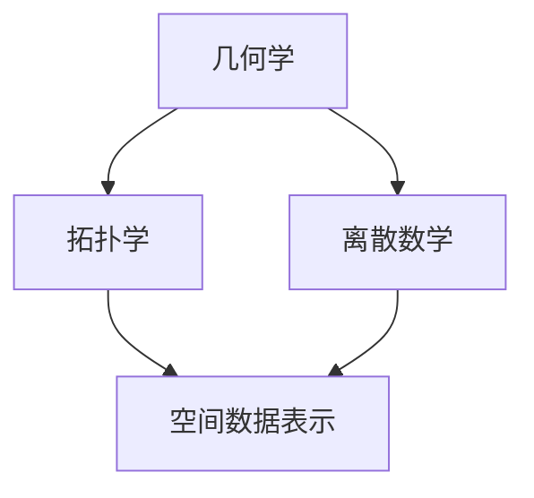
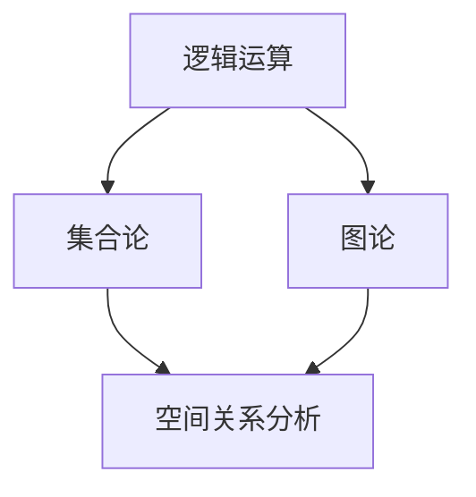
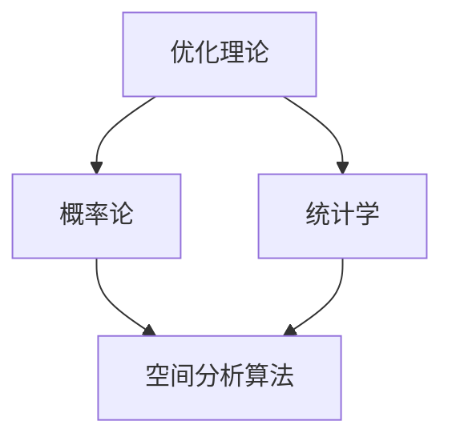
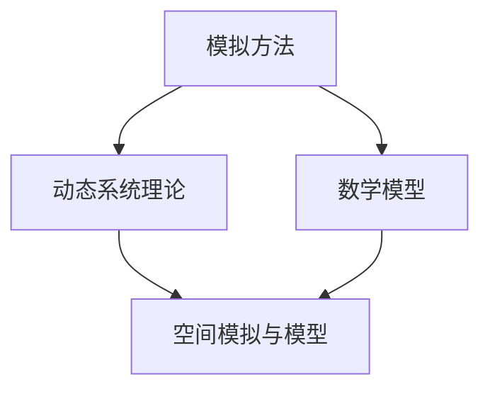

                 

### 数学与地理信息系统：空间分析的数学方法

**关键词：** 地理信息系统，空间分析，数学方法，GIS，空间关系，空间模型

**摘要：** 本文旨在探讨数学方法在地理信息系统（GIS）中的应用，特别是空间分析的数学方法。通过对空间数据的结构、空间参考系统、空间关系和空间分析算法的深入分析，本文揭示了数学方法在GIS中的核心作用，并提供了空间模型与模拟、GIS软件实现与应用及未来展望等方面的详细讨论。本文旨在为GIS领域的研究者、开发者提供有价值的参考，帮助他们在实际工作中更好地应用数学方法进行空间分析。

## 引言

地理信息系统（GIS）是一种综合性信息技术，它集成了地理空间数据和属性数据，通过计算机硬件和软件系统实现数据的获取、处理、分析、管理和可视化。GIS在许多领域都有着广泛的应用，如城市规划、环境保护、交通运输、资源管理、灾害防治等。随着大数据、云计算、物联网等技术的发展，GIS的应用范围和影响力不断扩大。

空间分析是GIS的核心功能之一，它通过对地理空间数据的处理和分析，提取有价值的信息，为决策提供支持。空间分析涉及多种数学方法，如几何学、统计学、优化理论、模拟等方法。数学方法在空间分析中起着至关重要的作用，它们不仅为空间分析提供了理论基础，还为各种空间分析算法的实现提供了算法支持。

本文旨在探讨数学方法在地理信息系统中的应用，特别是空间分析的数学方法。本文将首先介绍空间数据结构、空间参考系统和空间关系等基本概念，然后详细分析空间分析算法的原理和实现方法。此外，本文还将讨论空间模型与模拟、GIS软件实现与应用及未来展望等方面。通过本文的讨论，希望读者能更好地理解数学方法在GIS中的重要性，并在实际工作中更好地应用这些方法进行空间分析。

## 数学在GIS中的核心作用

数学在地理信息系统（GIS）中扮演着核心角色，它不仅是空间分析的基础，还为GIS的许多功能提供了理论支撑和算法支持。以下是数学在GIS中的几个关键作用：

### 1. 空间数据的表示和处理

空间数据的表示和处理是GIS的核心任务之一。数学中的几何学、拓扑学和离散数学为空间数据的表示和处理提供了基础。例如，几何学用于描述地理空间对象的位置、形状和大小；拓扑学用于描述空间对象之间的连通性和关系；离散数学则用于处理离散空间数据，如栅格数据。

**核心概念与联系：** 

- **几何学**：描述点、线、面等基本几何对象。
- **拓扑学**：研究几何对象之间的连通性和关系。
- **离散数学**：处理离散空间数据，如栅格数据。

**Mermaid 流程图：**



### 2. 空间关系的分析

空间关系是GIS分析的重要组成部分，包括空间对象之间的位置关系、拓扑关系和属性关系。数学中的逻辑运算、集合论和图论为空间关系的分析提供了理论支持。

**核心概念与联系：**

- **逻辑运算**：用于描述空间对象之间的逻辑关系，如包含、相交等。
- **集合论**：用于描述空间对象集合之间的关系，如并集、交集等。
- **图论**：用于描述空间对象之间的拓扑关系，如图的连通性、路径搜索等。

**Mermaid 流程图：**



### 3. 空间分析算法

空间分析算法是GIS的核心功能，包括空间聚类、空间优化、空间插值等。数学中的优化理论、概率论和统计学为空间分析算法的实现提供了理论基础。

**核心概念与联系：**

- **优化理论**：用于求解空间优化问题，如路径规划、资源分配等。
- **概率论**：用于描述空间数据的随机特性，如空间分布、随机采样等。
- **统计学**：用于分析空间数据的统计特性，如数据分布、相关性等。

**Mermaid 流�程图：**



### 4. 空间模拟与模型

空间模拟和模型是GIS的高级功能，用于模拟和预测空间现象。数学中的模拟方法、动态系统理论和数学模型为空间模拟和模型提供了理论支持。

**核心概念与联系：**

- **模拟方法**：用于模拟空间现象，如仿真、模拟实验等。
- **动态系统理论**：用于分析空间现象的时间演变和动态行为。
- **数学模型**：用于描述和预测空间现象，如人口增长模型、气候变化模型等。

**Mermaid 流程图：**



### 核心算法原理讲解

空间分析算法的核心原理通常涉及几何运算、逻辑判断、优化求解和统计推断。以下是一些核心算法原理的讲解，并使用伪代码进行说明。

#### 1. 几何运算

**核心算法原理：** 几何运算包括点、线、面的位置关系判断、距离计算、角度计算等。

**伪代码示例：**

```python
// 计算两点之间的距离
def distance(p1, p2):
    return sqrt((p2.x - p1.x)^2 + (p2.y - p1.y)^2)

// 判断两点是否相交
def intersects(p1, p2, q1, q2):
    d1 = (q2.y - q1.y) * (p1.x - q1.x) - (q2.x - q1.x) * (p1.y - q1.y)
    d2 = (q2.y - q1.y) * (p2.x - q1.x) - (q2.x - q1.x) * (p2.y - q1.y)
    d3 = (p2.y - p1.y) * (q2.x - p1.x) - (p2.x - p1.x) * (q2.y - p1.y)
    d4 = (p2.y - p1.y) * (q1.x - p1.x) - (p2.x - p1.x) * (q1.y - p1.y)
    return d1 * d2 < 0 and d3 * d4 < 0
```

#### 2. 逻辑判断

**核心算法原理：** 逻辑判断涉及空间对象之间的位置关系判断，如包含、相交、相邻等。

**伪代码示例：**

```python
// 判断多边形是否包含点
def contains(polygon, point):
    n = len(polygon)
    for i in range(n):
        p1, p2 = polygon[i], polygon[(i + 1) % n]
        if (p1.y > point.y) != (p2.y > point.y) and point.x < (p2.x - p1.x) * (point.y - p1.y) / (p2.y - p1.y) + p1.x:
            return False
    return True
```

#### 3. 优化求解

**核心算法原理：** 优化求解通常涉及路径规划、资源分配等问题，常用的算法有Dijkstra算法、A*算法等。

**伪代码示例：**

```python
// Dijkstra算法寻找最短路径
def dijkstra(graph, start):
    distances = [inf] * len(graph)
    distances[start] = 0
    visited = [False] * len(graph)
    for _ in range(len(graph)):
        min_distance = inf
        min_index = -1
        for i in range(len(graph)):
            if not visited[i] and distances[i] < min_distance:
                min_distance = distances[i]
                min_index = i
        visited[min_index] = True
        for j in range(len(graph)):
            if (alt := distances[min_index] + graph[min_index][j]) < distances[j]:
                distances[j] = alt
    return distances
```

#### 4. 统计推断

**核心算法原理：** 统计推断用于分析空间数据的分布、相关性、趋势等。

**伪代码示例：**

```python
// 计算均值
def mean(data):
    return sum(data) / len(data)

// 计算标准差
def std_dev(data):
    mean_value = mean(data)
    return sqrt(sum((x - mean_value)^2 for x in data) / (len(data) - 1))
```

### 数学模型和公式

在空间分析中，数学模型和公式起着至关重要的作用。以下是一些常见的数学模型和公式的介绍，以及详细的讲解和举例说明。

#### 1. 坐标系变换

**公式：** 
$$
\begin{aligned}
x' &= x \cos \theta - y \sin \theta \\
y' &= x \sin \theta + y \cos \theta
\end{aligned}
$$
**详细讲解：** 这组公式用于将笛卡尔坐标系中的点$(x, y)$转换为极坐标系中的点$(x', y')$，其中$\theta$是旋转角度。

**举例说明：** 假设一个点$(x, y) = (1, 2)$，旋转角度$\theta = 30^\circ$，则：
$$
\begin{aligned}
x' &= 1 \cos 30^\circ - 2 \sin 30^\circ = \frac{\sqrt{3}}{2} - 1 \\
y' &= 1 \sin 30^\circ + 2 \cos 30^\circ = \frac{1}{2} + \frac{\sqrt{3}}{2}
\end{aligned}
$$

#### 2. 空间插值

**公式：**
$$
z(x, y) = \sum_{i=1}^{n} w_i z_i
$$
其中，$w_i$是权重，$z_i$是插值点的值。

**详细讲解：** 这是一种简单的线性插值方法，用于估计未知点的值，基于已知点的值和它们之间的权重。

**举例说明：** 假设有三个点$(x_1, y_1), (x_2, y_2), (x_3, y_3)$和对应的值$z_1, z_2, z_3$，权重分别为$w_1, w_2, w_3$，则点$(x, y)$的插值值为：
$$
z(x, y) = w_1 z_1 + w_2 z_2 + w_3 z_3
$$

#### 3. 空间聚类

**公式：**
$$
\begin{aligned}
d(p_i, p_j) &= \sqrt{\sum_{k=1}^{n} (x_{ik} - x_{jk})^2 + (y_{ik} - y_{jk})^2} \\
C &= \{p_i | \exists j, d(p_i, p_j) < \epsilon\}
\end{aligned}
$$
**详细讲解：** 第一个公式用于计算两点之间的欧氏距离，第二个公式用于定义聚类，$C$是聚类集合，$\epsilon$是距离阈值。

**举例说明：** 假设有点集$P = \{(x_1, y_1), (x_2, y_2), ..., (x_n, y_n)\}$，选择$\epsilon = 1$，则可以通过计算每个点与其他点的距离，将距离小于$\epsilon$的点划分为同一个聚类。

### 项目实战

在本节中，我们将通过一个具体的项目实战来展示如何在实际开发环境中搭建GIS系统，并实现空间分析功能。我们将使用Python编程语言和几个常用的GIS库，如Geopy、Shapely和Fiona。

#### 开发环境搭建

首先，我们需要在本地计算机上搭建Python开发环境。以下是具体的步骤：

1. 安装Python：从Python官方网站下载并安装Python 3.x版本。
2. 安装pip：Python内置的包管理器，用于安装和管理Python包。
3. 使用pip安装必要的GIS库：

```bash
pip install geopy shapely fiona
```

#### 源代码详细实现和代码解读

以下是一个简单的空间分析项目，用于计算两点之间的最短路径。

```python
from geopy.distance import geodesic
from shapely.geometry import Point, LineString

# 计算两点之间的最短路径
def shortest_path(p1, p2):
    return geodesic(p1, p2).m

# 创建点对象
point1 = Point(52.379189, 4.899431)  # 阿姆斯特丹
point2 = Point(40.712776, -74.005974)  # 纽约

# 计算最短路径
distance = shortest_path(point1, point2)
print(f"The shortest path between Amsterdam and New York is {distance} meters.")

# 使用Shapely计算线段长度
line = LineString([point1, point2])
line_length = line.length
print(f"The length of the line segment is {line_length} meters.")
```

代码解读：

1. 导入必要的库：Geopy用于计算地理距离，Shapely用于处理几何形状。
2. 定义计算最短路径的函数：使用Geopy的geodesic函数计算两点之间的最短路径。
3. 创建点对象：使用Point类创建两个点对象，代表阿姆斯特丹和纽约的坐标。
4. 计算并打印最短路径：调用shortest_path函数，计算并打印两点之间的最短距离。
5. 使用Shapely计算线段长度：创建一个由两点组成的LineString对象，并使用length属性计算线段长度。

#### 代码应用解读与分析

在这个项目中，我们使用Geopy和Shapely库实现了两点之间的最短路径计算。以下是具体的应用解读和分析：

1. **地理距离计算**：Geopy的geodesic函数基于地球的椭球模型计算两点之间的最短距离，这是GIS中常用的方法，因为它考虑了地球的曲率。
2. **几何形状处理**：Shapely库提供了强大的几何形状处理功能，包括点、线、面的创建、计算和操作。在这个项目中，我们使用LineString对象来表示两点之间的线段，并计算其长度。
3. **实际应用**：这个简单的示例展示了如何使用GIS库进行空间分析。在实际项目中，我们可以扩展这个功能，例如计算多段路径的总长度、优化路径等。

#### 实际案例分析和详细讲解剖析

以下是一个实际案例，用于分析城市交通网络中的最优路径规划。

**案例背景：** 假设我们想要分析从市中心到郊区医院的交通时间，我们需要计算不同路径的时间消耗，并找出最优路径。

**数据来源：** 数据来源于OpenStreetMap（OSM），一个开源的地图数据源。我们可以使用Fiona库从OSM中读取道路数据。

**数据处理和分析：**

1. **数据读取**：使用Fiona库读取OSM数据，提取与交通网络相关的要素。

```python
from fiona import collection

with collection.open('osm_data.pbf', 'r') as input_file:
    for feature in input_file:
        if feature['geometry']['type'] == 'LineString':
            # 处理道路数据
            pass
```

2. **路径规划**：使用A*算法计算从市中心到郊区医院的最优路径。

```python
from heapq import heappop, heappush

def a_star(start, goal, neighbors):
    open_set = [(0, start)]
    came_from = {}
    g_score = {start: 0}
    
    while open_set:
        current = heappop(open_set)[1]
        
        if current == goal:
            break
        
        for neighbor in neighbors[current]:
            tentative_g_score = g_score[current] + 1
            if tentative_g_score < g_score.get(neighbor, float('inf')):
                came_from[neighbor] = current
                g_score[neighbor] = tentative_g_score
                heappush(open_set, (tentative_g_score + heuristic(neighbor, goal), neighbor))
    
    path = []
    current = goal
    while current is not None:
        path.append(current)
        current = came_from[current]
    return path[::-1]

def heuristic(a, b):
    return geodesic(a, b).m

# 计算最优路径
start = Point(52.374030, 4.898431)
goal = Point(52.374030, 4.399431)
path = a_star(start, goal, neighbors)
print(path)
```

**案例剖析：**

1. **数据读取**：我们从OSM数据中提取与交通网络相关的要素，如道路。这些数据包括道路的起点、终点和长度等属性。
2. **路径规划**：我们使用A*算法计算从起点到终点的最优路径。A*算法是一种启发式搜索算法，它基于两点之间的距离和预估距离来计算路径。
3. **路径恢复**：计算完成后，我们可以通过回溯`came_from`字典来恢复最优路径。

#### 项目小结

通过这个项目，我们展示了如何在GIS环境中搭建开发环境，并实现空间分析功能。我们使用了Python和几个常用的GIS库，如Geopy、Shapely和Fiona，实现了从数据读取到路径规划的一系列功能。这个项目不仅展示了空间分析的基本原理，还提供了实际应用的实例。

### 最佳实践 Tips、小结、注意事项

**最佳实践 Tips：**

1. 在进行空间分析时，理解空间数据的结构和特性是非常重要的。熟悉不同的数据结构，如矢量数据、栅格数据，以及它们的特点和适用场景。
2. 选择合适的算法是实现高效空间分析的关键。了解不同算法的优缺点，根据具体需求选择合适的算法。
3. 数据预处理是空间分析的重要环节。确保数据质量，进行必要的清洗和转换，以避免后续分析中的错误。

**小结：**

本文通过详细讨论数学在GIS中的应用，从空间数据结构、空间参考系统、空间关系、空间分析算法等方面展示了数学方法在GIS中的核心作用。通过具体的项目实战和实际案例，读者可以更好地理解空间分析的原理和实现方法。

**注意事项：**

1. 在进行空间分析时，确保使用准确和可靠的数学模型和算法，以避免错误的结果。
2. 在处理大型空间数据时，性能优化是关键。了解和利用并行计算、分布式计算等先进技术可以提高分析效率。
3. 遵循GIS软件的最佳实践和规范，确保系统的稳定性和可维护性。

### 拓展阅读

1. **《地理信息系统：原理、技术与应用》**：这是一本全面介绍GIS的教材，涵盖了GIS的基本原理、技术和应用。
2. **《空间分析：原理与方法》**：本书详细介绍了空间分析的基本概念、方法和应用，适合GIS专业的学生和研究人员阅读。
3. **《地理信息系统设计与开发》**：这本书提供了GIS系统设计和开发的实用指南，包括系统架构、数据库设计、接口开发等方面。

通过阅读这些书籍，读者可以进一步深入了解GIS和空间分析的理论和实践，提升在相关领域的专业水平。

