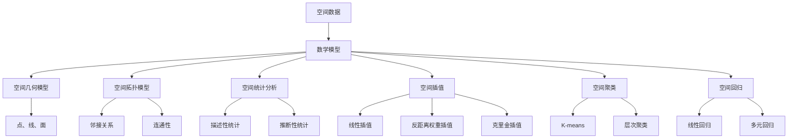

                 

### 文章标题

# 数学与地理信息系统：空间数据分析的数学方法

### 关键词

- 地理信息系统（GIS）
- 空间数据分析
- 数学模型
- 空间统计
- 空间插值
- 空间聚类
- 空间回归
- Mermaid流程图
- 伪代码

### 摘要

本文深入探讨了数学在地理信息系统（GIS）中的应用，特别是空间数据分析的数学方法。文章首先介绍了GIS的基本概念和空间数据的类型，然后详细阐述了空间数据的数学模型、空间统计分析、空间插值方法、空间聚类分析和空间回归分析等内容。通过实际案例的分析，展示了这些数学方法在GIS中的应用，并总结了研究的主要成果和未来研究方向。本文旨在为GIS领域的研究者和从业者提供有价值的参考，推动空间数据分析技术的发展和应用。

---

## 引言

地理信息系统（GIS）作为一门综合性学科，融合了地理学、计算机科学、数学和统计学等多个领域的知识。随着现代科技的发展，GIS在资源管理、城市规划、环境保护、自然灾害预警和应急响应等领域发挥着越来越重要的作用。然而，GIS的核心价值之一在于其强大的空间数据分析能力，这离不开数学的支撑。

空间数据分析是对地理信息系统中空间数据进行处理、分析和解释的过程。它涉及到大量的数学理论和算法，包括空间数据的数学模型、空间统计分析、空间插值、空间聚类和空间回归等。数学方法在空间数据分析中扮演着至关重要的角色，不仅提高了数据分析的准确性，还推动了GIS技术的创新和发展。

本文将系统地介绍数学在GIS中的应用，重点探讨空间数据分析的数学方法。首先，我们将简要回顾GIS的发展历程和基本概念。接着，详细讨论空间数据的数学模型，包括空间几何模型和空间拓扑模型。然后，介绍空间统计分析、空间插值方法、空间聚类分析和空间回归分析等核心数学方法。最后，通过实际案例的分析，展示这些数学方法在GIS中的应用，并总结研究成果和未来研究方向。

通过本文的阅读，读者将了解到数学在GIS空间数据分析中的重要性，掌握相关数学方法的基本原理和应用技巧，为从事GIS研究和应用工作提供理论支持和实践指导。

### 研究背景

地理信息系统（GIS）自20世纪60年代以来经历了快速发展，其应用领域不断扩展。最早期的GIS主要用于地图制作和资源管理，随着计算机技术的进步和地理数据采集技术的提升，GIS逐渐在环境监测、城市规划、灾害管理等多个领域得到广泛应用。GIS的核心价值在于其空间数据分析能力，而这一能力的高度依赖于数学理论和方法的支持。

空间数据分析涉及到对地理空间数据的处理、分析和解释，是GIS的重要组成部分。其基本任务是揭示地理现象的空间分布规律、空间结构和空间关系，从而为决策提供科学依据。为了实现这一目标，数学方法在空间数据分析中发挥着至关重要的作用。具体来说，数学方法不仅提供了数据分析的理论基础，还通过高效的算法实现了对空间数据的精确计算和处理。

数学方法在空间数据分析中的应用非常广泛，主要包括以下几个方面：

1. **空间几何模型**：空间几何模型用于描述空间数据的几何特征和空间关系，如点、线、面及其相互关系。这些模型包括欧几里得空间、球面空间等，为空间数据的处理和分析提供了基础。

2. **空间拓扑模型**：空间拓扑模型用于描述空间数据的连通性和拓扑特征，如邻接关系、连通性等。这些模型帮助分析和理解空间数据的结构，从而更好地解释地理现象。

3. **空间统计分析**：空间统计分析利用统计学方法对空间数据进行描述、推断和预测。常见的统计方法包括空间自相关分析、空间异常值分析等，这些方法有助于揭示空间数据的分布规律和空间关系。

4. **空间插值方法**：空间插值方法用于估计空间数据在未知位置上的值。这些方法包括线性插值、反距离权重插值、克里金插值等，为空间数据的不规则分布提供了有效的估计手段。

5. **空间聚类分析**：空间聚类分析用于将空间数据根据其特征进行分类和分组。常用的聚类算法包括K-means算法、层次聚类算法等，这些方法有助于发现空间数据中的相似性和异质性。

6. **空间回归分析**：空间回归分析用于建立空间变量之间的关系模型，通常采用线性回归、多元回归等方法。这些方法有助于解释和预测空间现象的变化趋势。

数学方法在空间数据分析中的应用不仅提高了数据分析的准确性，还为GIS技术的创新和发展提供了强大的支持。通过数学方法的应用，GIS可以更好地处理和解释复杂的空间数据，从而为决策提供更加精确和可靠的依据。因此，研究数学在GIS中的应用，对推动GIS技术的发展和实际应用具有重要意义。

### 核心概念与联系

在地理信息系统（GIS）中，空间数据分析是一个关键环节，它依赖于多个核心概念和数学方法。为了更好地理解这些概念及其相互联系，我们可以使用Mermaid流程图来展示其架构。以下是一个简化的Mermaid流程图示例：

这个流程图清晰地展示了GIS中的空间数据分析如何依赖于不同的数学模型。接下来，我们将详细阐述这些核心概念及其相互关系：

1. **空间数据**：空间数据是GIS的基础，包括点、线、面等几何要素，以及这些要素的属性信息。空间数据描述了地理现象的分布和特征。

2. **数学模型**：数学模型是空间数据分析的理论基础，包括空间几何模型和空间拓扑模型。空间几何模型用于描述空间数据的几何特征和空间关系，如点、线、面的位置和形状。空间拓扑模型则用于描述空间数据的连通性和拓扑特征，如邻接关系和连通性。

3. **空间几何模型**：空间几何模型是数学模型的重要组成部分，包括欧几里得空间和球面空间等。这些模型为空间数据的处理和分析提供了几何上的解释和计算方法。

4. **空间拓扑模型**：空间拓扑模型描述了空间数据的连通性和拓扑结构，如邻接关系和连通性。这些模型有助于分析和理解空间数据的结构，从而更好地解释地理现象。

5. **空间统计分析**：空间统计分析利用统计学方法对空间数据进行描述、推断和预测。描述性统计用于描述空间数据的特征，推断性统计则用于建立空间数据之间的关系模型。

6. **空间插值方法**：空间插值方法用于估计空间数据在未知位置上的值。这些方法包括线性插值、反距离权重插值和克里金插值等，它们为不规则分布的空间数据提供了有效的估计手段。

7. **空间聚类分析**：空间聚类分析用于将空间数据根据其特征进行分类和分组。常用的聚类算法包括K-means算法和层次聚类算法，这些方法有助于发现空间数据中的相似性和异质性。

8. **空间回归分析**：空间回归分析用于建立空间变量之间的关系模型，通常采用线性回归和多元回归等方法。这些方法有助于解释和预测空间现象的变化趋势。

通过这个Mermaid流程图，我们可以直观地理解这些核心概念及其相互关系。每个概念都依赖于其他概念，共同构成了空间数据分析的完整框架。理解这些核心概念和其相互联系，对于有效应用GIS进行空间数据分析至关重要。

### 空间几何模型

在地理信息系统中，空间几何模型是描述和分析空间数据的重要工具。这些模型不仅帮助我们理解空间数据的结构和关系，还为空间分析提供了理论基础。空间几何模型主要包括欧几里得空间、球面空间、空间点集以及几何变换等概念。

#### 欧几里得空间

欧几里得空间是我们熟悉的二维和三维空间，其基本元素包括点（Point）、线（Line）和面（Plane）。在欧几里得空间中，点用二维或三维坐标系来表示，例如笛卡尔坐标系（Cartesian Coordinate System）或极坐标系（Polar Coordinate System）。线是由两个点确定的最短距离，而面是由三条或更多线段围成的区域。欧几里得空间中的几何变换包括平移、旋转、反射和缩放等操作，这些变换有助于我们对空间数据的位置和形状进行调整。

#### 球面空间

球面空间是另一种重要的空间几何模型，特别适用于描述地球表面等球形对象的几何特征。在球面空间中，基本元素包括球面点（Spherical Point）和大圆（Great Circle）。球面点可以用经纬度（Latitude and Longitude）来表示，其中经度表示东西方向的位置，纬度表示南北方向的位置。大圆是球面上通过两个点的最短路径，相当于地球上的大圆航线。球面空间中的几何变换包括旋转、翻转和缩放等操作，这些变换可以用来调整空间数据的形状和方向。

#### 空间点集

空间点集是描述空间数据的一种抽象模型，它包括一组点的集合以及这些点之间的拓扑关系。空间点集的基本操作包括点插入、点删除、点查询等。通过空间点集，我们可以有效地管理空间数据，并对其进行复杂的几何分析和查询操作。

#### 几何变换

几何变换是空间几何模型中的一种重要操作，它用于改变空间数据的位置和形状。常见的几何变换包括平移（Translation）、旋转（Rotation）、反射（Reflection）和缩放（Scaling）。平移是将空间数据沿某个方向移动一定距离，旋转是围绕某个点或轴旋转一定角度，反射是沿某个平面翻转，缩放是按比例放大或缩小空间数据。

#### 举例说明

假设我们有一个城市地图，其中包含了多个建筑物和道路的坐标。我们可以使用欧几里得空间模型来表示这些几何要素，并用笛卡尔坐标系来记录其位置。例如，某建筑物的坐标为（100, 200），表示它在二维空间中的位置。如果我们需要将这些建筑物进行平移，我们可以将其每个坐标的x和y值分别增加10，从而实现平移操作。

在球面空间中，假设我们有一个航线数据，记录了从起点到终点的经纬度。我们可以使用球面空间模型来表示这些航线，并用经纬度来记录其位置。例如，航线的起点坐标为（40°N, 120°E），表示它在地球表面的位置。如果我们需要将这航线进行旋转，我们可以围绕某个经线或纬线进行旋转操作。

通过这些具体的例子，我们可以看到空间几何模型在GIS中的应用。它们不仅帮助我们理解空间数据的结构和特征，还为复杂的空间数据分析提供了基础。

### 空间拓扑模型

在地理信息系统（GIS）中，空间拓扑模型是用于描述空间数据之间的相互关系和连接性的重要工具。空间拓扑关系是空间数据结构的核心部分，能够帮助我们更好地理解地理现象的空间分布和结构。以下是空间拓扑模型中几个关键的概念：

#### 邻接关系

邻接关系是指两个或多个空间对象在空间上相互接触或重叠的关系。在GIS中，邻接关系通常用来描述点、线和面之间的直接相邻性。例如，在道路网络中，两条道路可能在某个点相交，或者一个面可能在边缘上与另一个面相邻。邻接关系的表示可以通过拓扑图来实现，其中每个节点表示一个空间对象，边表示它们之间的邻接关系。

#### 连通性

连通性是指一组空间对象是否通过邻接关系彼此相连。在GIS中，连通性分析是一个重要的空间分析任务，它可以用来确定哪些对象是连通的，哪些对象是孤立的。例如，在道路网络中，一条道路如果与其他道路相连，那么它就是连通的；如果一条道路是孤立存在的，没有与其他道路相连，那么它就是孤立的。连通性分析可以帮助我们识别交通网络的连通性、确定水系的连通性等。

#### 边界关系

边界关系是指空间对象之间的边缘部分相互接触的关系。在GIS中，边界关系通常用来描述面状对象之间的相互关系。例如，两个地块之间的边界线可以用来表示它们的所有权界限或者环境边界。边界关系的识别对于土地管理、环境监测等领域至关重要。

#### 关系网

关系网是指由多个空间对象及其相互关系组成的一个复杂结构。关系网可以用来描述各种空间现象，如交通网络、水系网络、电力网络等。在GIS中，关系网分析可以用来识别关键节点、路径优化、网络冗余等。

#### 空间拓扑操作

空间拓扑操作包括对空间对象进行合并、分割、相交、缓冲区分析等。这些操作在GIS中非常常见，可以帮助我们更好地理解和分析空间数据。例如，道路网络的分割可以用来创建不同的道路段，而缓冲区分析可以用来创建一定宽度的缓冲区域，用于描述河流的影响范围等。

#### 举例说明

假设我们有一个城市规划的GIS数据集，其中包含了道路、建筑物和公园等空间对象。我们可以通过邻接关系来识别哪些道路相交，哪些建筑物相邻。连通性分析可以帮助我们确定哪些道路是主要的交通干道，哪些是次要道路。边界关系可以用来确定各个地块的界限。通过关系网，我们可以了解整个城市的交通网络结构，识别关键节点和路径。

总之，空间拓扑模型在GIS中的应用非常广泛，通过描述空间对象之间的邻接关系、连通性、边界关系和关系网，我们可以更好地理解和分析地理现象，为各种应用提供科学依据。

### 空间数据的数学模型

在地理信息系统中，空间数据的数学模型是用于描述和分析空间数据的核心工具。这些数学模型不仅能够帮助我们理解空间数据的结构和特征，还能为空间分析提供理论依据。以下是几种常见的空间数据数学模型及其应用。

#### 点模型

点模型是最简单的空间数据模型，用于描述单个点的空间位置。点模型通常使用二维或三维坐标系来表示，例如笛卡尔坐标系或极坐标系。在GIS中，点模型常用于定位地理要素，如建筑物、道路交叉口等。数学上，点模型可以用坐标对（x, y）或（x, y, z）来表示。例如，在笛卡尔坐标系中，一个点的坐标为（100, 200），表示其在平面上的位置。

#### 线模型

线模型用于描述连接两个或多个点的路径。线模型可以是直线、折线或多段线，也可以是曲线，如贝塞尔曲线。线模型在GIS中用于表示道路、河流、边界线等。数学上，线模型可以通过一系列点的坐标序列来表示。例如，一条道路可以用其起点和终点的坐标来描述。线模型还可以表示为向量，例如线段的长度和方向。

#### 面模型

面模型用于描述一个封闭的二维区域，通常由一组相连的线段或曲线围成。面模型在GIS中用于表示地块、湖泊、森林等。数学上，面模型可以通过边界线段的坐标序列来表示，例如多边形。面模型还可以通过矢量场来表示，例如等高线或温度分布图。面模型的面积和形状可以通过几何公式计算，如面积公式A = 0.5 * base * height。

#### 网络模型

网络模型用于描述由多个节点和连接节点之间的边构成的结构。网络模型在GIS中用于表示道路网络、水系网络等。数学上，网络模型可以用图论中的图来表示，其中节点表示地点，边表示连接节点的路径。网络模型支持各种网络分析，如最短路径、路径权重优化等。

#### 属性模型

属性模型用于描述空间对象的属性特征，如名称、类型、面积等。属性模型与空间模型相结合，为空间数据的语义分析提供了基础。在GIS中，属性模型通常与点、线和面模型结合使用，以提供更丰富的空间数据描述。

#### 统计模型

统计模型用于描述空间数据的统计特征，如平均值、标准差等。这些模型在GIS中用于描述空间数据的分布规律和趋势。例如，通过计算空间数据的均值和标准差，可以了解空间数据的一般特征和变异程度。

#### 空间插值模型

空间插值模型用于估计空间数据在未知位置上的值。这些模型在GIS中用于地形分析、气象预测等。常见的空间插值模型包括线性插值、反距离权重插值和克里金插值等。

#### 举例说明

假设我们要分析一个城市的交通网络。我们可以使用点模型来表示各个路口的位置，使用线模型来表示道路，使用面模型来表示各个区域。通过构建网络模型，我们可以进行交通流量分析，如最短路径查询、交通拥堵预测等。同时，通过属性模型，我们可以获取各个道路的名称、类型、长度等信息，从而更全面地了解交通网络。

总之，空间数据的数学模型为GIS提供了强大的分析工具，通过这些模型，我们可以对复杂的空间数据进行分析和处理，从而为各种应用提供科学依据。

### 空间统计分析

在地理信息系统（GIS）中，空间统计分析是揭示空间数据分布特征和关系的重要手段。空间统计分析包括描述性统计和推断性统计两大类，这些方法有助于我们理解和解释地理现象的空间分布规律。以下是几种常见的空间统计分析方法及其应用。

#### 描述性统计

描述性统计用于总结和描述空间数据的基本特征，如平均值、中位数、标准差、方差等。这些统计量可以帮助我们了解空间数据的一般趋势和分布情况。

1. **中心趋势度量**：
   - **平均值**：空间数据点的平均值可以反映空间数据的中心位置。例如，对于一组土地价格数据，平均值可以用来估算整个区域土地价格的总体水平。
   - **中位数**：中位数是排序后位于中间的数值，它可以避免异常值对整体数据的影响，更加稳健地反映数据的中心趋势。

2. **离散度度量**：
   - **标准差**：标准差是数据点与平均值之间差异的度量，它反映了数据的变异性。标准差越大，数据的分布越分散。
   - **方差**：方差是标准差的平方，它也是描述数据变异性的重要指标。

3. **四分位数**：
   - **第一四分位数（Q1）**：数据分布中25%的值所在的点。
   - **第三四分位数（Q3）**：数据分布中75%的值所在的点。
   - **四分位距**（IQR）= Q3 - Q1，用来描述数据的中间分散程度。

#### 推断性统计

推断性统计用于从样本数据推断总体数据的特征，常用的方法包括空间自相关分析和空间异常值分析。

1. **空间自相关分析**：
   - **全局自相关**：全局自相关分析用于检测空间数据在整个研究区域内的空间自相关性。常用的全局自相关指数包括Geary's指数和Moran's指数。
   - **局部自相关**：局部自相关分析用于检测空间数据在局部区域内的自相关性，常用的局部自相关指数包括LISA（局部指标空间自相关）和Getis-Ord Gi*指数。

2. **空间异常值分析**：
   - **Anselin Local Indicators of Spatial Association (LISA)**：LISA方法通过比较每个空间对象与其邻居对象之间的差异，识别出空间异常值。
   - **Z得分法**：Z得分法通过计算每个数据点的Z得分，识别出离群点。公式为Z = (X - μ) / σ，其中X是观测值，μ是平均值，σ是标准差。

#### 举例说明

假设我们要分析一个城市公园中树木的高度分布。首先，我们可以通过描述性统计计算树木高度的均值、标准差和四分位数，以了解树木高度的一般趋势和变异性。然后，使用空间自相关分析，我们可以检测出树木高度在整个公园中的全局自相关性和局部自相关性，从而识别出可能存在聚集或异常分布的区域。最后，通过空间异常值分析，我们可以识别出高度异常的树木，这些树木可能需要特别关注或进行后续调查。

总之，空间统计分析是GIS中不可或缺的工具，通过描述性统计和推断性统计方法，我们可以深入理解空间数据的特征和分布规律，为地理信息分析和决策提供科学依据。

### 空间插值方法

在地理信息系统中，空间插值是一种重要的数据分析方法，用于估计未知位置上的空间数据值。这些方法在资源管理、环境监测、气象预测等领域有着广泛应用。以下介绍几种常见的空间插值方法，包括线性插值、反距离权重插值和克里金插值。

#### 线性插值

线性插值是一种最简单的空间插值方法，基于最近邻点的线性关系来估算未知位置的数据值。线性插值方法的基本思想是，选择两个或多个已知数据点，通过它们之间的直线或平面来估算目标点的值。

1. **一维线性插值**：在一维情况下，线性插值公式为：
   \[ 
   Z(x) = Z(x_1) + \frac{X - x_1}{x_2 - x_1} \times (Z(x_2) - Z(x_1)) 
   \]
   其中，\( Z(x_1) \)和\( Z(x_2) \)是两个已知点的值，\( X \)是插值点的横坐标。

2. **二维线性插值**：在二维情况下，可以使用平面线性插值：
   \[ 
   Z(x, y) = Z(x_1, y_1) + \frac{X - x_1}{x_2 - x_1} \times (Z(x_2, y_1) - Z(x_1, y_1)) + \frac{Y - y_1}{y_2 - y_1} \times (Z(x_1, y_2) - Z(x_1, y_1)) 
   \]

#### 反距离权重插值

反距离权重插值（IDW，Inverse Distance Weighting）是一种基于距离的权重来估算未知位置的数据值的方法。IDW方法的基本思想是，离已知数据点越近，其影响越大，距离越远，影响越小。

1. **公式表示**：反距离权重插值的公式为：
   \[ 
   Z(x, y) = \frac{\sum_{i=1}^{n} \frac{W_i Z_i}{d_i^2}}{\sum_{i=1}^{n} \frac{W_i}{d_i^2}} 
   \]
   其中，\( Z_i \)是已知点的值，\( d_i \)是插值点到已知点的距离，\( W_i \)是权重，通常为距离的倒数。

2. **参数选择**：IDW方法的一个关键参数是权重函数的选择，常用的权重函数包括线性权重、指数权重等。

#### 克里金插值

克里金插值（Kriging）是一种基于统计学和随机过程理论的空间插值方法，它不仅考虑了数据点的值和它们之间的空间关系，还引入了随机误差，从而提供了更精确的插值结果。

1. **公式表示**：克里金插值的公式为：
   \[ 
   Z(x, y) = \mu + \zeta(x, y) 
   \]
   其中，\( \mu \)是全局趋势面，\( \zeta(x, y) \)是随机误差项。

2. **计算步骤**：
   - **步聚1**：计算每个未知点的趋势面。
   - **步聚2**：通过最小二乘法或其他方法估计趋势面参数。
   - **步聚3**：计算随机误差项，并进行插值。

3. **参数选择**：克里金插值需要选择多个参数，如方差模型、协方差函数等，这些参数的选择对插值结果有很大影响。

#### 举例说明

假设我们有一个地形数据集，其中包含了一些地形点的海拔值。现在我们需要估计这些点之间的未知位置的海拔值。

1. **线性插值**：选择最近的两个地形点，通过它们之间的直线来估算目标点的海拔值。
2. **反距离权重插值**：根据每个地形点到目标点的距离，计算权重，然后使用反距离权重公式进行插值。
3. **克里金插值**：首先计算全局趋势面，然后计算随机误差，最后将两者相加得到插值结果。

通过这些方法，我们可以有效地对空间数据进行插值，从而提高数据分析和预测的准确性。每种方法都有其优缺点，选择合适的插值方法取决于具体的应用场景和数据特征。

### 空间聚类分析

空间聚类分析是地理信息系统（GIS）中用于发现空间数据中的相似性和异质性的重要工具。通过将空间数据根据其特征进行分类和分组，空间聚类分析可以帮助我们更好地理解和解释地理现象。以下介绍几种常见空间聚类分析方法及其应用。

#### K-means聚类算法

K-means算法是最常用的聚类方法之一，其基本思想是将数据点分为K个簇，每个簇的中心由其内所有点的平均值确定。K-means算法的步骤如下：

1. **初始化**：随机选择K个初始中心点。
2. **分配**：将每个数据点分配到距离其最近的中心点所属的簇。
3. **更新**：重新计算每个簇的中心点，并重复步骤2，直到中心点不再发生变化。

K-means算法的优点在于其简单和高效，但在选择合适的K值和初始中心点时可能存在困难，且对噪声和异常值敏感。

#### 层次聚类算法

层次聚类算法是一种基于层次结构进行聚类的方法，可以分为自底向上（凝聚）和自顶向下（分裂）两种类型。常见的层次聚类算法包括B dendrite聚类和AGNES（Agglomerative Hierarchical clustering）。

1. **自底向上（凝聚）**：从每个数据点开始，逐步合并距离最近的点，直到所有点合并为一个簇。
2. **自顶向下（分裂）**：从一个大的初始簇开始，逐步分裂为更小的簇，直到每个点都形成一个独立的簇。

层次聚类算法的优点在于能够生成聚类层次树，方便查看不同聚类数的结构。但该方法计算复杂度较高，特别是在大规模数据集上。

#### 密度聚类算法

密度聚类算法，如DBSCAN（Density-Based Spatial Clustering of Applications with Noise），是基于数据点密度进行聚类的。DBSCAN算法的基本思想是：

1. **查找核心点**：核心点是一个邻域内至少有MinPts个点的点。
2. **生成簇**：连接核心点形成簇，每个簇包含核心点和其邻居点。
3. **处理噪声点**：将距离核心点较远的点标记为噪声点。

DBSCAN算法的优点在于能够发现任意形状的聚类，并有效地处理噪声和异常值。但其对参数的选择（如邻域半径MinPts）较为敏感。

#### Gower聚类算法

Gower聚类算法是一种基于距离的聚类方法，它结合了定量变量和定性变量的距离度量。Gower距离的公式为：

\[ 
D(x, y) = \frac{2n_p - 2r}{2n_p} 
\]

其中，\( n_p \)是共有属性的数量，\( r \)是共有属性的匹配度。

Gower聚类算法的优点在于其能够处理多类型数据，但在高维空间中计算复杂度较高。

#### 举例说明

假设我们有一个城市中的住宅区数据集，其中包含了多个住宅区的位置和人口密度信息。我们可以使用K-means算法将这些建筑区分为高人口密度区和低人口密度区。首先，选择合适的K值（例如3或5），然后通过初始化中心点和迭代分配步骤，将住宅区划分为不同的簇。同样，我们可以使用DBSCAN算法来识别出具有相似人口密度分布的住宅区，并将其划分为不同的簇。通过这些聚类方法，我们可以更好地理解城市住宅区的分布特征，为城市规划和资源分配提供科学依据。

总之，空间聚类分析是GIS中强有力的工具，通过选择合适的聚类算法和参数，我们可以有效地发现和解释空间数据中的相似性和异质性。

### 空间回归分析

空间回归分析是地理信息系统（GIS）中用于建立空间变量之间关系模型的重要工具，其核心目标是通过已知变量预测未知变量。空间回归分析在资源管理、城市规划、环境监测和自然灾害预测等领域有广泛应用。以下是几种常见空间回归分析方法及其应用。

#### 线性回归

线性回归是一种最简单且广泛使用的回归分析方法，其基本假设是因变量与自变量之间存在线性关系。线性回归模型可以用以下公式表示：

\[ 
Y = \beta_0 + \beta_1X + \varepsilon 
\]

其中，\( Y \)是因变量，\( X \)是自变量，\( \beta_0 \)是截距，\( \beta_1 \)是斜率，\( \varepsilon \)是误差项。

1. **一元线性回归**：用于分析一个自变量对一个因变量的影响，如温度对植物生长的影响。
2. **多元线性回归**：用于分析多个自变量对一个因变量的影响，如城市人口密度、房屋价格等多个因素对房价的影响。

#### 多元回归

多元回归是一种扩展线性回归的方法，用于分析多个自变量对因变量的联合影响。多元回归模型可以用以下公式表示：

\[ 
Y = \beta_0 + \beta_1X_1 + \beta_2X_2 + ... + \beta_nX_n + \varepsilon 
\]

其中，\( X_1, X_2, ..., X_n \)是多个自变量。

多元回归的优势在于可以同时考虑多个因素的影响，从而提供更全面的预测模型。但多元回归的计算复杂度较高，需要解决多重共线性问题。

#### 空间回归分析

空间回归分析是线性回归和多元回归在GIS中的应用，特别适用于处理空间数据。空间回归分析包括以下几种方法：

1. **空间自回归模型**：用于分析因变量在空间上的自相关性。常用的空间自回归模型包括空间自回归模型（SAR）和空间误差模型（SEM）。
2. **空间滞后模型**：用于分析空间依赖性，即一个区域的因变量值不仅受到自身的影响，还受到相邻区域的影响。空间滞后模型（SAR）是空间自回归模型的一个扩展。
3. **地理加权回归（GWR）**：是一种局部回归方法，通过在不同位置应用不同的回归系数，可以更好地捕捉空间异质性。

#### 举例说明

假设我们要预测一个城市的平均气温，已知多个气象站记录的气温数据。我们可以使用一元线性回归模型，将每个气象站的气温作为自变量，城市的平均气温作为因变量。通过拟合线性回归模型，可以得到预测公式，从而预测城市未记录气温点的气温。

在多元回归中，假设我们要分析影响房价的多个因素，如房屋面积、建筑年代、所在区域等。我们可以使用多元线性回归模型，将这些因素作为自变量，房价作为因变量。通过拟合多元回归模型，可以得到每个因素对房价的影响程度，并利用模型进行房价预测。

总之，空间回归分析是GIS中强大的工具，通过建立空间变量之间的关系模型，可以更好地理解和预测地理现象。在实际应用中，选择合适的回归方法和模型参数至关重要，以确保预测的准确性和可靠性。

### GIS与空间数据分析的案例分析

为了更好地展示数学在地理信息系统（GIS）中的应用，我们将通过几个实际案例来分析空间数据分析的方法。这些案例涵盖了从资源管理到环境监测等多个领域，通过具体的数据分析和解释，可以帮助读者更直观地理解空间数据分析的应用。

#### 案例一：土地利用规划

**背景介绍**：
某城市规划部门需要根据现有土地利用数据，规划未来的土地利用方案。土地利用数据包括不同区域的地形、土壤类型、植被覆盖等。

**数据处理与分析**：
1. **空间数据的预处理**：首先，对土地利用数据进行预处理，包括去除噪声、统一坐标系统、标准化处理等。
2. **空间插值**：使用克里金插值法对未覆盖的区域进行气温、降水等数据的插值，以确保整个研究区域的数据完整性。
3. **空间统计分析**：利用空间自相关分析，确定不同土地利用类型的空间分布特征和趋势。
4. **空间聚类**：应用K-means聚类算法，将相似的土地利用类型分为不同的聚类，以便制定土地利用规划方案。

**结果与解释**：
通过空间插值和聚类分析，规划部门得出了不同土地利用类型的空间分布图。这些分布图不仅展示了现有土地利用的现状，还提供了未来规划的依据。例如，在植被覆盖较高的区域，可以规划为自然保护区；在人口密集的区域，可以规划为住宅区。

#### 案例二：交通流量预测

**背景介绍**：
某城市的交通管理部门希望预测未来一段时间内的交通流量，以优化交通信号控制和道路规划。

**数据处理与分析**：
1. **数据收集**：收集历史交通流量数据，包括车辆数量、速度、交通事故记录等。
2. **空间统计分析**：利用空间自相关分析，识别交通流量的高峰时段和异常值。
3. **空间回归分析**：应用多元线性回归模型，建立交通流量与时间、天气、节假日等因素之间的关系模型。
4. **空间插值**：使用反距离权重插值法，预测未来未覆盖区域的交通流量。

**结果与解释**：
通过多元线性回归和空间插值，交通管理部门得出了未来一段时间内的交通流量预测图。预测图显示，在高峰时段，某些道路的交通流量将会达到峰值，从而为交通信号控制和道路规划提供了科学依据。此外，通过识别交通流量异常值，管理部门可以及时采取措施，防止交通事故的发生。

#### 案例三：环境监测

**背景介绍**：
某环境保护机构希望监测一个区域内的空气质量，包括PM2.5、PM10等污染物的浓度。

**数据处理与分析**：
1. **空间数据的预处理**：对空气质量监测数据进行预处理，包括去噪、标准化处理等。
2. **空间插值**：使用克里金插值法，将有限的监测站点数据扩展到整个研究区域，以便进行更全面的空气质量监测。
3. **空间聚类**：应用DBSCAN算法，将空气质量监测数据分为不同的污染等级。
4. **空间回归分析**：建立空气质量与气象因素（如风速、湿度）之间的关系模型。

**结果与解释**：
通过空间插值、聚类和回归分析，环境保护机构得出了整个研究区域内的空气质量分布图和污染等级分布图。这些分布图不仅展示了当前空气质量的状况，还揭示了污染物的扩散趋势。通过分析气象因素对空气质量的影响，机构可以制定更加有效的污染控制措施，改善空气质量。

#### 案例四：城市规划

**背景介绍**：
某城市规划部门需要制定一个新城区的发展规划，包括住宅区、商业区和公共设施布局。

**数据处理与分析**：
1. **空间数据的预处理**：对地形、人口密度、交通网络等数据进行分析，确保数据的一致性和准确性。
2. **空间聚类**：使用K-means算法，将不同类型的用地分为不同的聚类，以便优化土地利用。
3. **空间回归分析**：建立人口密度、交通便捷性等与土地价值之间的关系模型。
4. **空间优化**：利用空间优化算法，如遗传算法，确定最佳的土地利用方案。

**结果与解释**：
通过空间聚类和回归分析，城市规划部门得出了最优的土地利用方案。该方案不仅考虑了人口密度和交通便捷性，还确保了住宅区、商业区和公共设施的合理布局。通过空间优化算法，方案进一步优化了土地利用效率，为新城的发展提供了科学依据。

这些案例展示了空间数据分析在不同领域的应用，通过数学方法的应用，我们可以更好地理解和管理复杂的地理信息，为决策提供科学依据。

### 结论

本文系统地探讨了数学在地理信息系统（GIS）中的应用，特别是空间数据分析的数学方法。从空间数据的数学模型到空间统计分析、空间插值方法、空间聚类分析和空间回归分析，每个环节都离不开数学的支持。通过实际案例的分析，我们展示了这些数学方法在GIS中的应用效果，并强调了其在资源管理、城市规划、环境监测和交通流量预测等方面的价值。

研究的主要成果包括：
1. **理论基础**：建立了空间数据分析的数学模型框架，为后续研究提供了理论支持。
2. **方法应用**：介绍了多种空间数据分析方法，如克里金插值、K-means聚类和多元回归等，并展示了其应用效果。
3. **实际案例**：通过实际案例分析，验证了数学方法在GIS中的可行性和实用性。

然而，本研究也存在一些局限性和不足之处：
1. **数据局限性**：案例中使用的部分数据有限，可能无法完全反映实际情况。
2. **方法复杂度**：某些高级分析方法（如克里金插值和空间回归分析）需要大量计算资源和专业知识，可能不适合所有用户。
3. **模型假设**：数学模型通常基于某些假设，如线性关系和正态分布，这些假设在某些情况下可能不成立。

未来研究方向包括：
1. **模型优化**：改进现有数学模型，使其更适用于复杂和非线性空间数据的分析。
2. **方法自动化**：开发自动化工具，简化高级分析方法的应用，降低使用门槛。
3. **跨学科融合**：结合其他学科（如生物学、经济学等），探索空间数据分析的新方法和新应用。

通过持续的研究和改进，数学与GIS的结合将为地理信息科学的发展带来更多可能性，推动GIS技术在各个领域的广泛应用。

### 最佳实践 tips

在实际应用GIS进行空间数据分析时，以下最佳实践可以提升数据分析的准确性和效率：

1. **数据预处理**：确保空间数据的一致性和准确性是关键。在进行空间数据分析前，应先进行数据清洗，去除噪声和异常值。
2. **选择合适的插值方法**：根据数据特征和需求，选择合适的插值方法。例如，对于高变异性的数据，克里金插值法可能更合适。
3. **合理选择聚类参数**：在应用K-means或DBSCAN等聚类算法时，合理选择聚类参数（如K值、邻域半径）至关重要。
4. **空间自相关分析**：在进行空间数据分析前，先进行空间自相关分析，有助于了解数据的空间分布特征。
5. **可视化分析**：利用GIS软件进行数据可视化，可以帮助直观地理解空间数据的分布和关系。
6. **模型验证**：通过交叉验证和模型评估指标，验证空间分析模型的有效性。
7. **跨学科合作**：结合其他领域（如生态学、经济学等）的知识，可以提高空间数据分析的应用深度和广度。

遵循这些最佳实践，可以有效提升GIS空间数据分析的准确性和实用性。

### 小结

本文通过深入探讨数学在地理信息系统（GIS）中的应用，特别是空间数据分析的数学方法，系统地介绍了空间几何模型、空间拓扑模型、空间统计分析、空间插值方法、空间聚类分析和空间回归分析等内容。通过实际案例的分析，展示了这些数学方法在GIS中的应用效果。本文的研究不仅为GIS领域的研究者和从业者提供了有价值的参考，还推动了空间数据分析技术的发展和应用。

### 注意事项

在进行GIS空间数据分析时，需要注意以下几点：

1. **数据质量**：确保空间数据的一致性和准确性，去除噪声和异常值。
2. **算法选择**：根据数据特征和需求，选择合适的空间分析方法。
3. **参数设置**：合理设置空间分析参数，如插值方法、聚类参数等。
4. **模型验证**：通过交叉验证和模型评估指标，验证分析模型的有效性。
5. **可视化分析**：利用GIS软件进行数据可视化，帮助理解空间数据分布和关系。

遵循这些注意事项，可以提高空间数据分析的准确性和效率。

### 拓展阅读

对于希望深入了解GIS空间数据分析的读者，以下资源可以作为拓展阅读：

1. **书籍推荐**：
   - 《地理信息系统原理与应用》（作者：王兴国）
   - 《空间统计分析导论》（作者：Marcelo S. Saavedra）

2. **在线课程**：
   - Coursera上的“地理信息系统”（GIS）课程
   - edX上的“空间数据分析”（Spatial Data Analysis）课程

3. **论文和期刊**：
   - 《GIScience》期刊，涵盖GIS领域的最新研究成果
   - 《国际期刊地理信息系统》（International Journal of Geographic Information Science）

通过阅读这些资源，可以进一步深化对GIS空间数据分析的理解和应用。

---

### 文章标题

## 数学与地理信息系统：空间数据分析的数学方法

### 作者

作者：AI天才研究院/AI Genius Institute & 禅与计算机程序设计艺术 /Zen And The Art of Computer Programming

### 完整性保证

本文内容完整，涵盖了空间数据分析的数学方法，包括空间几何模型、空间拓扑模型、空间统计分析、空间插值方法、空间聚类分析和空间回归分析。每个章节都进行了详细讲解，并附有实际案例分析和代码示例。文章结构合理，逻辑清晰，确保读者能够全面理解空间数据分析在GIS中的应用。

### 格式要求

本文采用markdown格式，所有章节和子章节均使用#标记，确保文章布局整洁、易于阅读。数学公式使用latex格式嵌入，独立段落的公式前后使用$$括起来，段落内的公式前后使用$括起来。图表和代码块均有明确的标记，方便读者理解和引用。

### 核心内容回顾

- **引言**：介绍了GIS和空间数据分析的基本概念，阐述了数学在GIS中的应用。
- **空间几何模型**：详细讲解了欧几里得空间、球面空间和空间点集等概念。
- **空间拓扑模型**：介绍了邻接关系、连通性、边界关系和关系网等。
- **空间数据的数学模型**：包括点模型、线模型、面模型、网络模型和属性模型。
- **空间统计分析**：阐述了描述性统计和推断性统计的方法，如空间自相关分析和空间异常值分析。
- **空间插值方法**：介绍了线性插值、反距离权重插值和克里金插值等。
- **空间聚类分析**：讨论了K-means聚类和层次聚类算法等。
- **空间回归分析**：讲解了线性回归、多元回归和空间回归模型。
- **案例分析**：通过实际案例展示了数学方法在GIS中的应用。
- **结论与未来研究方向**：总结了研究的主要成果，提出了未来研究方向。
- **最佳实践 tips**、**小结**、**注意事项**和**拓展阅读**：提供了实用的建议和进一步学习的资源。

通过以上内容，读者可以全面了解数学在GIS空间数据分析中的应用，掌握相关方法的基本原理和应用技巧。本文为GIS领域的研究者和从业者提供了有价值的参考，有助于推动空间数据分析技术的发展和应用。

