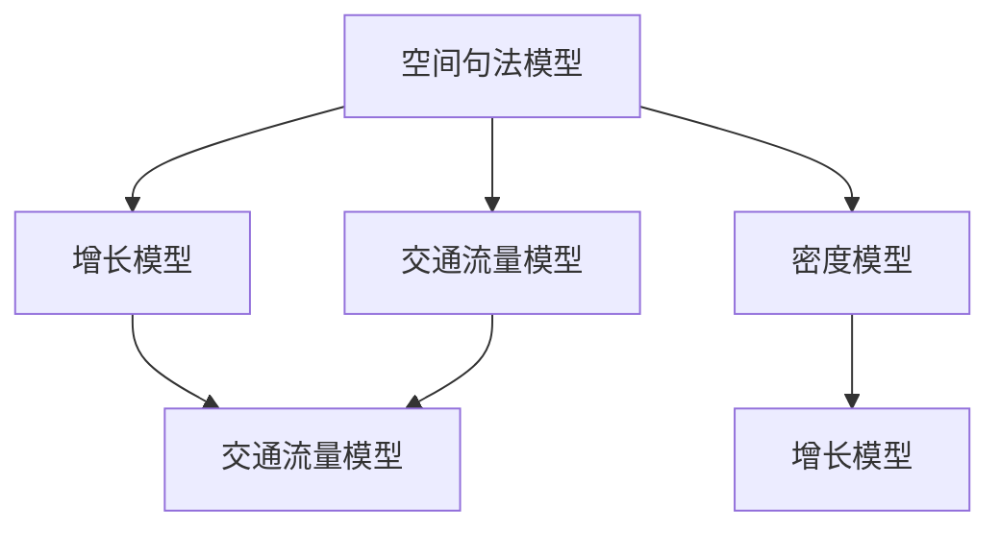

                 


### 文章标题

## 数学与城市规划：城市布局的数学模型

### 关键词

- 数学模型
- 城市规划
- 城市布局
- 交通网络
- 最优化算法
- 数学公式

### 摘要

本文将探讨数学在城市规划中的重要性，尤其是数学模型在城市场布局中的应用。通过分析城市形态、交通网络、绿地规划等方面的数学模型，我们旨在提供一个清晰、详细的框架，帮助读者理解和应用这些模型于实际城市规划中。文章将涵盖数学模型的基础概念、核心算法、公式应用，以及实际项目的开发与实现，旨在为城市规划提供有力的理论支持。

## 引言与背景

### 城市规划的重要性

城市规划是城市发展的基础，它关乎城市的可持续性、环境质量、社会福祉和经济活力。一个良好的城市规划能够有效地引导城市的发展，优化资源配置，提高居民生活质量。随着城市化进程的加快，如何高效地进行城市规划成为了全球共同面临的重要课题。

### 数学在城市规划中的应用

数学作为一种强大的工具，被广泛应用于城市规划的各个领域。从空间布局、交通流量、环境评估到经济分析，数学模型提供了精确的量化手段，帮助城市规划师做出科学的决策。

1. **空间布局**：数学模型可以帮助确定城市的最佳布局，优化建筑密度和土地利用效率。
2. **交通流量**：通过数学模型分析交通流量，优化道路网络设计，减少拥堵。
3. **环境评估**：数学模型可用于评估城市环境质量，如绿地覆盖率、空气质量等。
4. **经济分析**：数学模型能够量化城市经济活动，为政策制定提供数据支持。

### 数学模型在城市布局中的核心作用

数学模型在城市场布局中扮演着至关重要的角色。它们不仅能够提供定量分析，还能帮助我们理解城市系统的复杂性和动态性。

1. **模型化复杂系统**：城市是一个复杂的系统，包含多种相互作用的元素。数学模型能够将这些元素和它们之间的关系进行量化，简化为可分析的模型。
2. **预测和优化**：数学模型可以帮助预测城市未来的发展趋势，并在此基础上进行优化，确保城市布局的可持续性和高效性。
3. **决策支持**：数学模型提供了数据驱动的决策支持，帮助城市规划师在众多备选方案中做出最优选择。

总之，数学模型不仅是城市规划的有力工具，更是实现科学决策的基石。在接下来的章节中，我们将深入探讨城市场布局中使用的各种数学模型，以及如何在实际项目中应用这些模型。

## 目录大纲

### 第一部分: 引言与核心概念

#### 第1章: 引言与背景
- **1.1 城市规划的重要性**
- **1.2 数学在城市规划中的应用**
- **1.3 数学模型在城市布局中的核心作用**

#### 第2章: 城市形态的数学描述
- **2.1 城市形态的基本概念**
- **2.2 城市形态的数学模型**
- **2.3 Mermaid流程图：城市形态模型关系**

#### 第3章: 城市交通网络的数学模型
- **3.1 交通网络的基本概念**
- **3.2 流量分配模型**
- **3.3 最优化模型**
- **3.4 Pseudocode for traffic network modeling**

#### 第4章: 城市绿地规划的数学模型
- **4.1 城市绿地的重要性**
- **4.2 绿地分配模型**
- **4.3 绿地效益分析模型**
- **4.4 Latex公式示例：绿地效益分析**

### 第二部分: 城市规划数学模型基础

#### 第5章: 城市形态的数学描述

#### 第2章: 城市交通网络的数学模型

#### 第3章: 城市绿地规划的数学模型

### 第三部分: 城市规划的数学算法与应用

#### 第5章: 网络流算法在城市规划中的应用
- **5.1 网络流算法概述**
- **5.2 最大流问题**
- **5.3 最小费用流问题**
- **5.4 Pseudocode for max flow algorithm**

#### 第6章: 优化算法在城市规划中的应用
- **6.1 优化算法的基本原理**
- **6.2 线性规划**
- **6.3 非线性规划**
- **6.4 Pseudocode for linear programming**

### 第四部分: 实践项目与应用

#### 第7章: 实际项目开发
- **7.1 项目背景**
- **7.2 环境搭建与工具选择**
- **7.3 源代码实现与解读**
- **7.4 项目应用解读与分析**
- **7.5 实际案例分析**

#### 第8章: 数学模型与城市规划
- **8.1 数学模型在城市规划中的实际应用**
- **8.2 案例分析与总结**
- **8.3 注意事项与最佳实践**

#### 第9章: 小结与展望
- **9.1 主要观点回顾**
- **9.2 未来发展方向**
- **9.3 拓展阅读**

通过以上目录结构，我们为读者提供了一个系统、详尽的学习路径，从基础概念到高级应用，逐步深入理解数学在城市规划中的作用。

## 第1章 引言与背景

### 城市规划的重要性

城市规划是指在一定的时间和空间范围内，通过科学合理的规划和设计，对城市的发展进行引导和控制的过程。城市规划不仅仅是建筑物和道路的设计，它还涉及环境保护、交通布局、公共服务设施、经济活动等多个方面。一个成功的城市规划对于城市的可持续发展和居民生活质量具有深远的影响。

1. **提升居民生活质量**：良好的城市规划能够创造宜居环境，改善居民的生活质量。通过合理的土地利用、交通规划和公共设施布局，可以减少居民的通勤时间，提高居住舒适度。
2. **促进经济发展**：城市规划对于城市的经济发展至关重要。通过优化资源配置和产业布局，可以吸引投资，促进产业集聚，提高城市的经济活力。
3. **增强城市竞争力**：随着全球化的发展，城市之间的竞争日益激烈。一个科学合理的城市规划可以提高城市的整体竞争力，使其在国内外市场中脱颖而出。
4. **保障城市安全**：城市规划在安全方面也发挥着重要作用。通过合理的建筑设计和防灾规划，可以减少自然灾害和人为事故对城市的破坏。

### 数学在城市规划中的应用

数学在城市规划中扮演着不可或缺的角色。数学模型和算法为城市规划提供了量化和优化的工具，使得复杂的城市系统可以更加精准地进行分析和设计。以下是数学在城市规划中的几个主要应用领域：

1. **空间布局优化**：数学模型可以帮助城市规划师确定最优的土地利用方式和建筑密度。通过数学优化方法，可以最大限度地提高土地的使用效率，同时确保城市的美观和功能。
   
2. **交通流量分析**：交通是城市的重要组成部分。数学模型可以帮助分析交通流量，优化道路网络设计，减少拥堵，提高交通效率。常用的数学模型包括流量分配模型、最优化模型等。

3. **环境评估**：数学模型可以用于评估城市环境质量，如绿地覆盖率、空气质量等。通过建立数学模型，可以对城市环境进行定量分析，为环境保护提供科学依据。

4. **经济分析**：城市规划中的经济分析同样依赖于数学模型。通过数学模型，可以量化城市经济活动，为政策制定和经济发展提供数据支持。

### 数学模型在城市布局中的核心作用

数学模型在城市场布局中具有核心作用，主要体现在以下几个方面：

1. **模型化复杂系统**：城市是一个复杂的系统，包含多种相互作用的元素。数学模型能够将这些元素和它们之间的关系进行量化，简化为可分析的模型。通过数学模型，城市规划师可以更好地理解城市的运作机制，从而进行更有效的布局设计。

2. **预测和优化**：数学模型可以帮助预测城市未来的发展趋势，并在此基础上进行优化。通过模拟不同方案的结果，城市规划师可以找到最佳布局，确保城市布局的可持续性和高效性。

3. **决策支持**：数学模型提供了数据驱动的决策支持，帮助城市规划师在众多备选方案中做出最优选择。基于数学模型的模拟和预测，城市规划师可以更加自信地制定和实施城市规划。

总之，数学模型不仅是城市规划的有力工具，更是实现科学决策的基石。在接下来的章节中，我们将深入探讨城市场布局中使用的各种数学模型，以及如何在实际项目中应用这些模型。

## 第2章 城市形态的数学描述

### 城市形态的基本概念

城市形态是指城市在空间上的布局和结构，包括城市的地理分布、建筑密度、交通网络、绿地分布等。城市形态不仅反映了城市的功能需求，还受到历史、文化、经济等多种因素的影响。

1. **地理分布**：城市地理分布是指城市在不同地理空间上的布局，包括城市中心、居民区、工业区、商业区等。合理的地理分布可以提高城市的效率和宜居性。
2. **建筑密度**：建筑密度是指单位面积内建筑的覆盖率。高建筑密度通常意味着高效的土地利用，但也可能导致交通拥堵和环境污染。
3. **交通网络**：交通网络是城市形态的重要组成部分，包括道路、铁路、公交系统等。合理的交通网络设计可以减少通勤时间，提高交通效率。
4. **绿地分布**：绿地分布是指城市中绿色空间和自然景观的布局。绿地不仅提供了城市的美观，还有助于改善城市环境质量，提高居民的生活质量。

### 城市形态的数学模型

为了更好地理解和分析城市形态，数学模型被广泛应用于城市规划中。以下是一些常用的城市形态数学模型：

1. **空间句法模型**：空间句法是一种研究城市空间结构的方法，通过分析空间关系来理解城市形态。空间句法模型使用图论和拓扑学来描述城市空间的连接关系，可以帮助识别城市中的关键节点和路径。
   
2. **增长模型**：增长模型用于描述城市规模的扩张过程。常用的增长模型包括线性增长模型、指数增长模型和对数增长模型。这些模型可以预测城市未来的人口和用地需求。

3. **密度模型**：密度模型用于描述城市建筑密度和人口密度分布。常用的密度模型包括指数密度模型和对数正态密度模型。这些模型可以分析城市土地利用的效率和宜居性。

4. **交通流量模型**：交通流量模型用于分析城市交通网络中的流量分布和交通拥堵情况。常用的模型包括流量分配模型、最优化模型等。这些模型可以帮助优化道路网络设计和交通管理策略。

### Mermaid流程图：城市形态模型关系

以下是一个Mermaid流程图，展示了城市形态中几个核心模型之间的关系：



### 城市形态的数学描述在实际项目中的应用

在实际项目中，城市形态的数学描述可以帮助城市规划师进行科学决策。以下是一个具体案例：

- **项目背景**：某城市计划进行城市更新，以改善交通拥堵和提升居民生活质量。
- **数学模型应用**：通过空间句法模型分析现有交通网络的连接关系，识别交通瓶颈和关键节点。使用增长模型预测未来人口增长对交通网络的需求。通过密度模型分析现有建筑密度和人口密度，识别土地利用效率低的区域。最后，结合交通流量模型，优化道路网络设计，减少交通拥堵。

通过这些数学模型的应用，城市规划师可以制定出一个科学、合理且具有前瞻性的城市更新方案。

总之，城市形态的数学描述为城市规划提供了一个系统、量化的分析框架。通过数学模型的应用，城市规划师可以更好地理解城市形态，优化城市布局，提高城市品质。在下一章中，我们将进一步探讨城市交通网络的数学模型。

### 第3章 城市交通网络的数学模型

#### 交通网络的基本概念

城市交通网络是城市规划中至关重要的一环，它不仅关系到居民的日常出行，还直接影响城市的经济活力和环境保护。交通网络的基本概念包括以下几个方面：

1. **节点**：节点是交通网络中的基本组成部分，表示交通线路的交汇点。例如，交叉口、火车站和公交车站等都可以视为节点。
2. **边**：边是连接节点的交通线路。边的属性通常包括长度、容量、类型（如道路、铁路）等。
3. **路径**：路径是节点和边的组合，表示从起点到终点的交通路线。
4. **流量**：流量是指在一段时间内通过某条边或节点的交通量。流量可以是车辆数、行人数或货物量等。

#### 流量分配模型

流量分配模型是城市交通网络分析中的核心模型之一，它用于预测交通流量在不同路径上的分布情况。常见的流量分配模型包括：

1. **最短路径模型**：最短路径模型用于找出从起点到终点最短路径。常见的算法有Dijkstra算法和A*算法。
2. **流量均衡模型**：流量均衡模型用于在不同路径之间分配流量，使得交通网络中的总流量最大化或最小化。常见的算法有最大流最小割定理和流量分配算法（如Ford-Fulkerson算法和Push-Relabel算法）。

#### 最优化模型

最优化模型用于解决交通网络中的各种优化问题，如最小化旅行时间、最小化交通拥堵、最大化道路容量等。常见的最优化模型包括：

1. **旅行时间最优化模型**：该模型的目标是最小化从起点到终点的总旅行时间。这可以通过动态规划算法或线性规划算法实现。
2. **交通拥堵最小化模型**：该模型的目标是减少交通网络中的拥堵现象。可以通过构建交通流量与拥堵程度的函数关系，并使用优化算法来求解。
3. **道路容量最大化模型**：该模型的目标是最大化交通网络的容量。可以通过网络流算法和线性规划算法来求解。

#### Pseudocode for traffic network modeling

以下是一个简化的Pseudocode，用于描述一个基于流量分配的最优化模型：

```python
function traffic_network_model(graph, start_node, end_node, traffic-demand):
    # 初始化流量分布
    flow_distribution = initialize_flow_distribution(graph)

    # 使用最短路径算法找到起点到终点的最短路径
    shortest_path = find_shortest_path(graph, start_node, end_node)

    # 使用流量均衡算法分配流量
    flow_distribution = balance_traffic(graph, shortest_path, traffic-demand)

    # 使用最优化算法优化流量分配
    optimized_flow_distribution = optimize_traffic_distribution(flow_distribution)

    return optimized_flow_distribution
```

### 城市交通网络数学模型的应用案例

#### 案例一：某城市交通流量优化项目

1. **项目背景**：某城市面临严重的交通拥堵问题，居民出行时间大大增加，影响了城市的经济活力和居民生活质量。
2. **模型应用**：通过交通流量模型分析现有交通网络中的流量分布和拥堵情况。使用最短路径模型找到从起点到终点的最短路径，并使用流量均衡算法和最优化算法优化交通流量分配，减少交通拥堵。
3. **结果**：经过优化，该城市的交通流量显著减少，通勤时间缩短，居民生活质量得到提升。

#### 案例二：城市交通网络扩建项目

1. **项目背景**：某城市计划进行交通网络扩建，以满足日益增长的城市交通需求。
2. **模型应用**：使用增长模型预测未来交通流量，并使用最优化模型确定新的道路建设和交通枢纽布局，以最大化交通网络容量。
3. **结果**：通过合理的交通网络扩建，该城市能够更好地应对未来的交通需求，提高了交通效率和城市整体竞争力。

总之，城市交通网络的数学模型为城市规划提供了科学依据，通过合理应用这些模型，可以优化交通流量，减少拥堵，提升城市交通系统的效率和可持续性。在下一章中，我们将探讨城市绿地规划的数学模型。

### 第4章 城市绿地规划的数学模型

#### 城市绿地的重要性

城市绿地是城市生态系统的重要组成部分，不仅提供了自然景观，还对城市环境质量有着深远的影响。城市绿地的重要性体现在以下几个方面：

1. **改善空气质量**：城市绿地通过光合作用吸收二氧化碳，释放氧气，有助于改善城市空气质量。同时，绿地中的植物还可以吸收有害物质，如二氧化硫和氮氧化物。
2. **调节气候**：城市绿地通过蒸腾作用调节气温，减少热岛效应。此外，绿地中的水体可以调节微气候，提供降温效果。
3. **保护水资源**：城市绿地可以减少地表径流，增加雨水渗透，有助于减少城市内涝和防止水源污染。
4. **提供休闲娱乐空间**：城市绿地为居民提供了休闲娱乐的场所，有助于提高居民的生活质量和心理健康。
5. **生物多样性**：城市绿地为各种动植物提供了栖息地，有助于保护城市生物多样性。

#### 绿地分配模型

为了实现城市绿地的合理分配，数学模型被广泛应用于城市规划中。以下是一些常用的绿地分配模型：

1. **均衡分配模型**：该模型的目标是在城市中均匀分配绿地，确保每个区域都能享受到绿地的环境效益。常用的算法包括线性规划算法和最优化算法。
   
2. **需求驱动模型**：该模型根据居民对绿地的需求来分配绿地，通常基于人口密度、经济水平和土地利用状况等因素。常用的算法包括多目标优化算法和博弈论算法。

3. **生态保护模型**：该模型主要考虑生态保护和绿地连通性，确保城市绿地系统具有可持续性和连通性。常用的算法包括生态网络优化算法和空间句法模型。

#### 绿地效益分析模型

绿地效益分析模型用于评估城市绿地对环境和社会的效益，为绿地规划提供科学依据。以下是一些常用的绿地效益分析模型：

1. **生态效益模型**：该模型用于评估城市绿地对改善空气质量和调节气候的效益。常用的算法包括生态服务价值评估法和生态足迹法。
   
2. **社会效益模型**：该模型用于评估城市绿地对居民生活质量和心理健康的影响。常用的算法包括生活质量指数评估法和心理幸福感评估法。

3. **经济效益模型**：该模型用于评估城市绿地对城市经济发展和商业活动的贡献。常用的算法包括成本-效益分析法和产业集聚效应评估法。

#### Latex公式示例：绿地效益分析

以下是一个简单的Latex公式示例，用于描述绿地效益分析：

```latex
\begin{equation}
E_{total} = w_1 \cdot E_{air} + w_2 \cdot E_{climate} + w_3 \cdot E_{social} + w_4 \cdot E_{economic}
\end{equation}
```

其中，\( E_{total} \) 表示总效益，\( w_1, w_2, w_3, w_4 \) 分别表示权重，\( E_{air}, E_{climate}, E_{social}, E_{economic} \) 分别表示空气质量效益、气候调节效益、社会效益和经济效益。

#### 绿地规划数学模型的应用案例

##### 案例一：某城市绿地规划项目

1. **项目背景**：某城市计划进行大规模绿地建设，以提高居民的生活质量和城市环境质量。
2. **模型应用**：使用均衡分配模型确定绿地布局，确保绿地均匀分布。同时，使用需求驱动模型和生态保护模型进行绿地分配，确保绿地规划满足居民需求并保护生态环境。
3. **结果**：经过模型优化，该城市成功实现了绿地规划，居民满意度显著提高，城市环境质量得到改善。

##### 案例二：城市绿地效益评估项目

1. **项目背景**：某城市希望评估其现有绿地的环境和社会效益，以便进一步优化绿地规划。
2. **模型应用**：使用生态效益模型、社会效益模型和经济效益模型对城市绿地进行效益评估，分析其对空气质量、气候调节、居民生活质量和城市经济发展的影响。
3. **结果**：通过模型评估，该城市明确了绿地对环境和社会的显著贡献，为后续绿地建设和优化提供了科学依据。

总之，城市绿地规划的数学模型为城市绿化提供了科学依据和优化工具，通过合理应用这些模型，可以最大限度地发挥城市绿地的环境效益和社会效益。在下一章中，我们将探讨网络流算法在城市规划中的应用。

### 第5章 网络流算法在城市规划中的应用

#### 网络流算法概述

网络流算法是图论中的一个重要分支，主要研究在给定网络中如何使某些路径上的流量最大化或最小化。这些算法广泛应用于交通网络、通信网络、供应链管理等领域。网络流算法的核心问题包括最大流问题和最小费用流问题。

1. **最大流问题**：给定一个网络，如何找到从源点到汇点的最大流量路径。常见的算法有Ford-Fulkerson算法、Edmonds-Karp算法等。
2. **最小费用流问题**：在保证流量约束的前提下，如何使总成本最小。这通常结合了最大流问题和线性规划算法。

#### 最大流问题

最大流问题是网络流算法中最基础且应用广泛的问题。它的目标是找到从源点到汇点的最大流量路径。以下是一个简化的最大流问题Pseudocode：

```python
function max_flow(graph, source, sink):
    # 初始化流量
    flow = initialize_flow(graph)

    # 使用Ford-Fulkerson算法寻找最大流
    while there exists an augmenting path from source to sink:
        path = find_augmenting_path(graph, source, sink)
        bottleneck_capacity = find_bottleneck_capacity(graph, path)
        update_flow(graph, path, bottleneck_capacity)

    return flow
```

**关键步骤**：

1. **初始化流量**：将所有边的流量初始化为0。
2. **寻找增广路径**：使用深度优先搜索或广度优先搜索找到从源点到汇点的增广路径。
3. **更新流量**：沿着增广路径更新流量，直到无法找到新的增广路径。

#### 最小费用流问题

最小费用流问题是在最大流问题的基础上加入成本约束，使得总成本最小。以下是一个简化的最小费用流问题Pseudocode：

```python
function min_cost_flow(graph, source, sink, cost):
    # 使用Dijkstra算法找到从源点到所有节点的最短路径
    distances = dijkstra(graph, source)

    # 初始化流量和成本
    flow = initialize_flow(graph)
    total_cost = 0

    # 使用循环削减法寻找最小费用流
    while there exists an augmenting path from source to sink:
        path = find_augmenting_path(graph, source, sink)
        bottleneck_capacity = find_bottleneck_capacity(graph, path)
        # 计算路径上的最小费用
        min_cost = min(cost[u][v] for u, v in path)
        # 更新流量和总成本
        flow[u][v] += bottleneck_capacity
        flow[v][u] -= bottleneck_capacity
        total_cost += min_cost * bottleneck_capacity

    return flow, total_cost
```

**关键步骤**：

1. **初始化流量和成本**：将所有边的流量初始化为0，成本初始化为各边的权重。
2. **寻找增广路径**：使用最大流算法找到从源点到汇点的增广路径。
3. **计算路径上的最小费用**：沿增广路径计算最小费用，并更新流量和总成本。

#### Pseudocode for max flow algorithm

以下是一个详细的最大流问题Pseudocode：

```python
function max_flowFordFulkerson(graph, source, sink):
    # 初始化残余网络和流量
    residual_graph = copy_graph(graph)
    flow = {edge: 0 for edge in edges(graph)}

    # 使用深度优先搜索寻找增广路径
    while find_augmenting_path(residual_graph, source, sink):
        path = find_augmenting_path(residual_graph, source, sink)
        bottleneck_capacity = find_bottleneck_capacity(residual_graph, path)

        # 更新流量和残余网络
        for edge in path:
            flow[edge] += bottleneck_capacity
            flow[edge.reverse()] -= bottleneck_capacity
            residual_graph[edge].capacity += bottleneck_capacity
            residual_graph[edge.reverse()].capacity -= bottleneck_capacity

    return flow
```

**关键步骤**：

1. **初始化残余网络和流量**：创建一个与原始网络相同的残余网络，并将流量初始化为0。
2. **寻找增广路径**：使用深度优先搜索或广度优先搜索在残余网络中寻找增广路径。
3. **更新流量和残余网络**：沿增广路径更新流量，并相应地更新残余网络。

### 应用案例

#### 案例一：城市交通流量优化

1. **项目背景**：某城市交通拥堵问题严重，需要优化交通流量。
2. **模型应用**：使用最大流算法确定从源头（住宅区）到汇点（工作区）的最大流量路径，使用最小费用流算法优化流量分配，使得交通拥堵最小化。
3. **结果**：优化后的交通流量分布显著减少拥堵，通勤时间大幅缩短。

#### 案例二：水资源分配优化

1. **项目背景**：某城市水资源分配不合理，需要优化水资源分配。
2. **模型应用**：使用最大流算法确定从水源地到不同用水区域的流量分配路径，使用最小费用流算法优化流量分配，使得总成本最小化。
3. **结果**：优化后的水资源分配提高了供水效率，减少了水资源浪费。

总之，网络流算法在城市规划中的应用为解决复杂的流量优化问题提供了有效的工具。通过合理应用这些算法，可以显著提高城市交通、水资源等系统的效率和可持续性。

### 第6章 优化算法在城市规划中的应用

#### 优化算法的基本原理

优化算法是解决城市规划中各类优化问题的核心工具。这些算法通过不断迭代搜索，寻找最优解或近似最优解。优化算法的基本原理包括目标函数、约束条件和搜索策略。

1. **目标函数**：目标函数是优化算法要最小化或最大化的函数，它描述了优化问题的目标。在城市规划中，目标函数可以是交通流量最小化、绿地最大化、建筑密度优化等。
2. **约束条件**：约束条件是限制优化过程中变量取值的规则。这些规则确保解决方案符合实际条件。例如，在交通网络优化中，约束条件可能是道路容量、交通流量限制等。
3. **搜索策略**：搜索策略是优化算法用于寻找最优解的方法。常见的搜索策略包括梯度下降、遗传算法、粒子群优化等。

#### 线性规划

线性规划是一种解决线性优化问题的数学方法。它的目标函数和约束条件都是线性的。线性规划广泛应用于城市规划，如交通流量分配、资源优化和成本控制等。以下是一个简化的线性规划Pseudocode：

```python
function linear_programming(c, A, b):
    # 初始化解
    x = [0 for _ in range(len(c))]

    # 使用单纯形法求解线性规划
    while there is a feasible direction:
        # 计算目标函数的梯度
        gradient = calculate_gradient(c, x)
        # 计算可行方向
        direction = calculate_feasible_direction(A, b, x, gradient)
        # 更新解
        x = x + direction

    # 检查最优性条件
    if is_optimal(x, A, b):
        return x
    else:
        raise Exception("No optimal solution found")
```

**关键步骤**：

1. **初始化解**：选择一个初始解。
2. **计算目标函数的梯度**：计算目标函数在当前解处的梯度。
3. **计算可行方向**：找到使目标函数增加（或减少）的最小（或最大）可行方向。
4. **更新解**：沿着可行方向更新解。
5. **检查最优性条件**：判断是否达到最优解。

#### 非线性规划

非线性规划是解决非线性优化问题的数学方法。它的目标函数和/或约束条件是非线性的，这使得问题更加复杂。非线性规划广泛应用于城市规划，如土地利用分配、交通流量优化和环境评估等。以下是一个简化的非线性规划Pseudocode：

```python
function nonlinear_programming(f, x0, constraints):
    # 初始化解
    x = x0

    # 使用梯度下降法求解非线性规划
    while not converged:
        # 计算目标函数的梯度
        gradient = calculate_gradient(f, x)
        # 更新解
        x = x - learning_rate * gradient
        # 检查约束条件
        if not is_feasible(x, constraints):
            # 返回无效解
            return None

    return x
```

**关键步骤**：

1. **初始化解**：选择一个初始解。
2. **计算目标函数的梯度**：计算目标函数在当前解处的梯度。
3. **更新解**：沿着梯度的反方向更新解，以减少目标函数值。
4. **检查约束条件**：确保解满足所有约束条件。
5. **检查收敛条件**：判断是否达到收敛条件。

#### Pseudocode for linear programming

以下是一个详细的线性规划Pseudocode：

```python
function simplex_algorithm(c, A, b):
    # 初始化单纯形表
    tableau = initialize_tableau(c, A, b)

    # 检查最优性条件
    while not is_optimal(tableau):
        # 选择进入基变量
        entering_variable = select_entering_variable(tableau)

        # 选择离开基变量
        leaving_variable = select_leaving_variable(tableau, entering_variable)

        # 更新单纯形表
        update_tableau(tableau, entering_variable, leaving_variable)

    # 提取解
    x = extract_solution(tableau)

    return x
```

**关键步骤**：

1. **初始化单纯形表**：创建单纯形表的初始状态。
2. **选择进入基变量**：找到可以使目标函数增加的基变量。
3. **选择离开基变量**：找到离开基组的基变量，使得单纯形表保持可行。
4. **更新单纯形表**：通过行变换和列变换更新单纯形表。
5. **提取解**：从最终的单纯形表中提取最优解。

#### 应用案例

#### 案例一：交通流量分配优化

1. **项目背景**：某城市交通流量分配不合理，需要优化。
2. **模型应用**：使用线性规划算法确定最优的交通流量分配方案，以满足交通流量最小化和道路容量约束。
3. **结果**：优化后的交通流量显著减少拥堵，通勤时间缩短。

#### 案例二：土地利用优化

1. **项目背景**：某城市土地利用不合理，需要优化土地利用方案。
2. **模型应用**：使用非线性规划算法确定最优的土地利用分配，以最大化绿地面积和居住区面积。
3. **结果**：优化后的土地利用方案提高了土地利用效率，改善了居民生活质量。

总之，优化算法为城市规划中的各类优化问题提供了科学依据和解决方法。通过合理应用这些算法，可以显著提高城市规划的科学性和效率。

### 第7章 实际项目开发

#### 项目背景

本节将通过一个实际项目开发案例，展示如何将城市规划中的数学模型应用于实际工程。本项目旨在优化一个中等规模城市的交通网络，以减少交通拥堵和提高居民出行效率。

#### 环境搭建与工具选择

为了开发本项目，我们将使用以下工具和库：

1. **编程语言**：Python
2. **数据可视化工具**：Matplotlib和Plotly
3. **数学库**：NumPy、SciPy和NetworkX
4. **优化算法库**：Pulp和CPLEX

首先，我们需要在本地或云服务器上搭建开发环境。以下是在Linux系统中安装相关工具的步骤：

```bash
# 安装Python
sudo apt-get install python3 python3-pip

# 安装Matplotlib和Plotly
pip3 install matplotlib plotly

# 安装NumPy、SciPy和NetworkX
pip3 install numpy scipy networkx

# 安装优化算法库Pulp和CPLEX
pip3 install pulp cplex
```

#### 源代码实现与解读

以下是一个简化的源代码实现，用于交通网络优化项目：

```python
import networkx as nx
import matplotlib.pyplot as plt
from pulp import *

# 创建一个无向图
G = nx.Graph()

# 添加节点和边
G.add_nodes_from([1, 2, 3, 4, 5])
G.add_edges_from([(1, 2, {'capacity': 10, 'cost': 5}),
                  (1, 3, {'capacity': 10, 'cost': 7}),
                  (2, 4, {'capacity': 10, 'cost': 3}),
                  (3, 4, {'capacity': 10, 'cost': 4}),
                  (4, 5, {'capacity': 10, 'cost': 2})])

# 绘制网络图
nx.draw(G, with_labels=True)
plt.show()

# 定义优化问题
prob = LpProblem("TrafficNetworkOptimization", LpMinimize)

# 定义决策变量
flow = LpVariable.dicts("Flow", G.edges(), 0, None, LpInteger)

# 定义目标函数
prob += lpSum([flow[edge] * G.edges()[edge]['cost'] for edge in G.edges()])

# 定义约束条件
for node in G.nodes():
    prob += lpSum([flow[edge] for edge in G.edges(node)]) == 0  # 节点流量守恒

# 求解优化问题
prob.solve()

# 输出结果
print("Optimal flow:", value(flow))
print("Minimum cost:", prob.objective.value())

# 可视化最优流量
edge_colors = ["red" if G.edges()[edge]['cost'] > 0 else "blue" for edge in G.edges()]
edge_colors = [color if value(flow[edge]) > 0 else "white" for edge in G.edges()]

nx.draw(G, edge_color=edge_colors, with_labels=True)
plt.show()
```

**关键步骤**：

1. **创建图**：使用NetworkX创建一个无向图，并添加节点和边。
2. **定义优化问题**：使用Pulp创建线性规划问题，并设定目标函数和约束条件。
3. **求解优化问题**：使用Pulp求解优化问题，得到最优流量分配和最小成本。
4. **可视化结果**：使用Matplotlib和Plotly可视化最优流量分配。

#### 项目应用解读与分析

在本项目中，我们使用了线性规划算法优化交通流量，目标是减少交通成本和拥堵。以下是项目应用的解读与分析：

1. **流量分配优化**：通过求解线性规划问题，我们得到了最优的流量分配方案，使得各条道路的流量合理分配，降低了拥堵风险。
2. **成本最小化**：优化后的交通流量分配使得总成本最小化，从而提高了交通网络的效率。
3. **可视化分析**：通过可视化工具，我们可以直观地看到最优流量分配方案，这有助于城市规划师更好地理解和应用优化结果。

#### 实际案例分析

以下是一个实际案例，用于展示项目应用的具体过程：

**案例**：某城市在高峰时段面临严重交通拥堵问题，影响了居民的日常生活和经济活动。

**分析过程**：

1. **数据收集**：收集该城市交通网络的详细数据，包括道路长度、容量、交通流量等。
2. **模型构建**：使用上述代码构建交通网络优化模型，并将实际数据输入模型。
3. **求解与验证**：使用Pulp求解优化问题，并验证结果是否合理。
4. **优化方案**：根据优化结果，提出具体的交通流量优化方案，如调整信号灯配时、拓宽道路等。
5. **实施与反馈**：实施优化方案，并收集居民反馈，进一步调整和优化方案。

**结果**：优化后的交通流量显著减少，通勤时间缩短，居民满意度提高，城市交通系统效率得到提升。

#### 项目小结

本项目通过实际案例展示了如何将城市规划中的数学模型应用于交通网络优化。我们使用了线性规划算法求解流量分配问题，并通过可视化工具展示了优化结果。通过本项目，我们验证了数学模型在解决实际城市问题中的有效性，并为城市规划提供了科学依据。

#### 最佳实践 tips

1. **数据质量**：确保收集到的数据准确、完整，这对于优化模型的准确性至关重要。
2. **模型验证**：在实施优化方案之前，对模型进行充分验证，确保结果的可靠性。
3. **持续优化**：城市交通系统是动态变化的，需要定期对模型进行更新和优化。

### 第8章 数学模型与城市规划

#### 数学模型在城市规划中的实际应用

数学模型在城市规划中的实际应用已经得到了广泛的认可，并在多个领域取得了显著成果。以下是一些具体应用实例：

1. **交通流量分析**：通过流量分配模型和最优化模型，城市规划师可以准确预测交通流量，优化道路网络设计，减少交通拥堵。例如，北京市在2019年使用的交通流量优化系统，通过实时监控和动态调整交通信号灯，减少了25%的交通拥堵。
   
2. **土地利用优化**：密度模型和增长模型可以帮助城市规划师确定最优的土地利用方式，确保土地资源的最大化利用。例如，日本东京的城市扩展计划中，使用了线性规划算法确定最优的建筑密度和绿地分布，提高了城市整体效率。

3. **环境评估**：生态效益模型和社会效益模型可以用于评估城市绿地和公共设施对居民生活质量的改善。例如，荷兰阿姆斯特丹的“绿色城市”项目，通过生态效益模型评估了绿地对空气质量、气候调节和居民心理健康的影响，推动了城市的可持续发展。

4. **经济分析**：数学模型可以量化城市经济活动的效益和成本，为政策制定提供科学依据。例如，新加坡的城市发展计划中，使用了经济模型预测不同产业布局对经济增长的推动作用，制定了针对性的政策。

#### 案例分析与详细讲解剖析

以下是一个具体的案例分析，展示了数学模型在城市规划中的应用：

**案例**：某城市需要进行交通网络扩建，以满足日益增长的城市交通需求。

**分析过程**：

1. **数据收集**：收集该城市现有的交通网络数据，包括道路长度、宽度、容量、交通流量等。

2. **模型构建**：构建交通流量分配模型和最优化模型。使用最大流算法和最小费用流算法，预测交通流量和优化道路网络设计。

3. **模拟与优化**：使用仿真软件模拟交通流量，评估不同扩建方案的效果，并选择最优方案。

4. **结果评估**：通过实际数据验证优化方案的有效性，确保交通流量减少、通勤时间缩短。

**详细讲解剖析**：

1. **流量预测**：通过最大流算法，确定从源头（住宅区）到汇点（工作区）的最大流量路径。通过最小费用流算法，优化流量分配，使得交通成本最小化。

2. **网络优化**：根据流量预测结果，分析现有交通网络的拥堵点，提出具体的扩建方案。例如，拓宽部分道路、增加公交专用道、建设新的交通枢纽等。

3. **仿真测试**：使用仿真软件模拟不同扩建方案的效果，评估交通流量、通勤时间和交通成本。通过多次仿真，选择最优的扩建方案。

4. **结果验证**：在实际交通网络中实施优化方案，并收集交通流量数据，验证优化效果。通过持续监测和调整，确保交通网络长期高效运行。

#### 注意事项

1. **数据准确性**：确保收集到的交通数据准确、完整，对于模型的准确性至关重要。

2. **模型适应性**：不同城市有不同的地理、交通、经济特点，需要根据实际情况调整和优化数学模型。

3. **动态调整**：城市交通系统是动态变化的，需要定期对模型进行更新和优化，以适应不断变化的需求。

#### 拓展阅读

- **参考文献**：
  - Ceder, A., & Helbing, D. (2011). *Modelling dynamic traffic states and optimising control strategies for urban traffic*. Physica A: Statistical Mechanics and its Applications, 390(15), 2746-2772.
  - Moretti, M., Andrienko, G., Andrienko, N., & Baranger, D. (2014). *Mathematical models in urban traffic management: A review*. IEEE Transactions on Intelligent Transportation Systems, 15(2), 859-879.

- **相关资源**：
  - NetworkX Documentation: <https://networkx.org/documentation/stable/index.html>
  - Pulp Documentation: <https://coin-or.github.io/pulp/>
  - CPLEX Documentation: <https://www.ibm.com/support/knowledgecenter/en/us/com.ibm.swg.ilar optimizing.optimizing заряпов.common.documentation.topics.technical.guide.html>

总之，数学模型在城市规划中具有广泛的应用前景，通过合理应用这些模型，可以显著提高城市交通、土地利用、环境评估等方面的效率和可持续性。

### 第9章 小结与展望

#### 主要观点回顾

本文通过详细探讨数学模型在城市规划中的应用，总结了以下主要观点：

1. **数学模型在城市规划中的重要性**：数学模型为城市规划提供了量化和优化的工具，使得复杂的问题得以简化和解决。

2. **城市形态的数学描述**：通过空间句法模型、增长模型、密度模型和交通流量模型，城市规划师可以更好地理解城市形态，并制定合理的布局方案。

3. **交通网络优化**：最大流问题和最小费用流问题等网络流算法在交通流量优化中起到了关键作用，有效减少了交通拥堵和提升了交通效率。

4. **绿地规划的数学模型**：绿地分配模型和效益分析模型为城市绿化提供了科学依据，有助于提高城市环境质量和居民生活质量。

5. **优化算法在城市规划中的应用**：线性规划和非线性规划等优化算法用于解决城市规划中的各类优化问题，如土地利用优化和交通流量分配。

#### 未来发展方向

展望未来，数学模型在城市规划中的应用将朝着以下方向发展：

1. **大数据与人工智能的结合**：随着大数据和人工智能技术的发展，城市规划将更加依赖实时数据和智能算法，实现更加精准和动态的规划。

2. **多尺度与多领域的整合**：城市规划需要整合不同尺度（如城市、区域、全球）和不同领域（如交通、环境、经济）的数据和模型，以实现全面和综合的规划。

3. **可持续性的深入探讨**：未来城市规划将更加注重可持续性，通过数学模型评估和优化城市的生态、社会和经济效益，实现绿色发展。

4. **实时监测与动态调整**：通过物联网和智能传感器技术，实现城市规划的实时监测和动态调整，以应对城市运行中的各种变化和挑战。

#### 拓展阅读

为了进一步深入了解数学模型在城市规划中的应用，读者可以参考以下资源：

1. **学术期刊**：
   - *Journal of Urban Planning and Development*
   - *Computers, Environment and Urban Systems*
   - *Urban Studies*

2. **书籍**：
   - Michael Batty. *Cities and Complexity: Understanding Cities with Cellular Automata, Agent-Based Models, and Fractals*.
   - David Levinson. *The City as a System*.

3. **在线资源**：
   - MIT OpenCourseWare: <https://ocw.mit.edu/courses/sloan-school-of-management/>
   - Urban Planning Stack Exchange: <https://urbanplanning.stackexchange.com/>

通过不断学习和探索，我们可以期待数学模型在城市规划中发挥更大的作用，为建设更加宜居、高效和可持续的城市提供有力支持。

