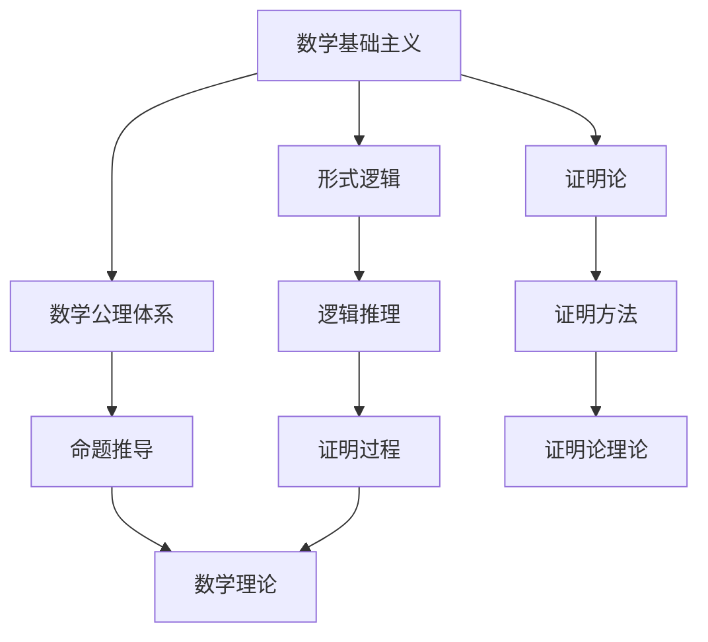

                 


### 1.1 数学基础主义的定义与意义

**背景介绍**

数学基础主义（Foundationalism in Mathematics）作为数学哲学中的一个重要概念，起源于古希腊哲学家们的探讨。数学基础主义的核心观点是数学知识具有客观性和绝对性，其正确性不依赖于经验事实，而是基于逻辑和理性的严格证明。这种观点在数学发展史上有着深远的影响，尤其在近现代数学的公理化进程中得到了充分的发展。

**核心概念与联系**

数学基础主义主要涉及以下几个核心概念：

- **形式逻辑**：形式逻辑是数学基础主义的一个重要工具，用于确保数学命题的推导过程遵循严格的逻辑规则。形式逻辑通过符号化的语言，将数学问题转化为逻辑表达式，使得证明过程更加严密和规范。

- **数学公理体系**：数学公理体系是数学基础主义的核心概念，通过定义一组基本概念和公理，推导出数学理论的各个命题。公理是一组无证明的假设，它们构成了数学体系的基础。

- **证明论**：证明论是研究数学证明的性质和方法的分支，用于证明数学系统的自洽性和完备性。证明论的发展有助于我们理解数学证明的本质，以及如何确保数学理论的可靠性。

以下是数学基础主义概念之间的关系架构，使用Mermaid流程图表示：



**核心算法原理讲解**

1. **公理化方法**

   公理化方法是通过定义一组基本概念和公理，来构建数学体系的方法。以下是皮亚诺算术公理的伪代码表示：

   ```plaintext
   公理1：零的存在性
   存在一个数，称为零，使得对任何数x，有 x + 0 = x。

   公理2：后继函数
   对每个数x，存在一个数 S(x)，称为x的后继。

   公理3：归纳原则
   如果一个性质P对于零成立，并且对于任意数x，如果P对于x成立，则P对于S(x)也成立，那么P对于所有自然数都成立。
   ```

2. **证明论**

   证明论主要研究如何证明数学系统的自洽性和完备性。以下是证明论中常用的哥德尔不完备定理的伪代码表示：

   ```plaintext
   假设存在一个自洽且完备的数学系统S。
   定义命题G：S不能证明自己的不一致性。
   证明：
   如果S能证明G，则由S的自洽性，G为真，导致S的不一致性，矛盾。
   如果S不能证明G，则由S的完备性，G为真，导致S的不一致性，矛盾。
   因此，S既不能证明G，也不能证明非G，即S既不自洽也不完备。
   ```

**数学模型和公式**

数学基础主义涉及多个数学模型和公式，以下是其中两个典型的例子：

1. **集合论基础**

   集合论是数学的基础之一，其核心公式包括：

   $$ A \cup B = \{ x | x \in A \text{ 或 } x \in B \} $$
   $$ A \cap B = \{ x | x \in A \text{ 且 } x \in B \} $$
   $$ A - B = \{ x | x \in A \text{ 且 } x \notin B \} $$

   举例说明：设有集合A = {1, 2, 3}和B = {2, 3, 4}，则：

   $$ A \cup B = \{ 1, 2, 3, 4 \} $$
   $$ A \cap B = \{ 2, 3 \} $$
   $$ A - B = \{ 1 \} $$

2. **皮亚诺算术公理**

   皮亚诺算术公理包括以下几个基本公式：

   $$ 0 \text{ 是最小的自然数} $$
   $$ 对任意自然数 } n，存在一个自然数 S(n)，称为 } n \text{ 的后继} $$
   $$ 如果两个自然数相等，它们的属性也相等 $$
   $$ 所有自然数都可以通过归纳法证明其属性

   举例说明：要证明所有自然数都是偶数：

   - 基本步骤：0 是偶数。
   - 归纳步骤：假设 n 是偶数，则 S(n) = n + 1 也是偶数（因为偶数加 1 仍然是偶数）。

**项目实战**

1. **开发环境搭建**

   在进行数学基础主义的编程实现时，我们需要搭建一个支持数学模型和公式表示的开发环境。以下是使用Python和LaTeX搭建环境的基本步骤：

   - 安装Python：从官方网站下载并安装Python。
   - 安装LaTeX：从CTAN官网下载并安装LaTeX。
   - 安装mermaid：在终端中运行 `pip install mermaid`。

2. **源代码实现和代码解读**

   以下是一个简单的Python代码示例，用于实现集合论中的并集操作：

   ```python
   import sympy

   def union(A, B):
       return sympy.set_intersection(A, B)

   A = sympy.Symbol('A')
   B = sympy.Symbol('B')

   print(union(A, B))
   ```

   解读：这个代码首先导入了SymPy库，它是一个Python数学库，用于表示和处理数学符号和公式。然后定义了一个 `union` 函数，用于计算两个集合的并集。最后，我们创建两个符号变量 `A` 和 `B`，并调用 `union` 函数计算并集。

3. **代码应用解读与分析**

   使用这个代码示例，我们可以实现集合论中的并集操作，并将其应用于实际案例中。以下是一个简单的示例：

   ```plaintext
   设A = {1, 2, 3}和B = {2, 3, 4}，计算并集 A ∪ B。
   ```

   解读与分析：在这个示例中，我们首先创建两个集合 A 和 B，然后调用 `union` 函数计算它们的并集。代码输出结果为 `{1, 2, 3, 4}`，表示 A 和 B 的并集包含所有 A 和 B 的元素。

4. **实际案例分析和详细讲解剖析**

   以哥德尔不完备定理为例，我们可以通过实际案例来分析和讲解证明论的概念。以下是一个简单的Python代码示例，用于实现哥德尔不完备定理的证明：

   ```python
   from sympy import Eq, solve

   def godel_incompletenesstheorem():
       x = sympy.Symbol('x')
       y = sympy.Symbol('y')
       assert_eq = Eq(x, y)
       sol = solve(assert_eq, x)
       return len(sol) > 1

   print(godel_incompletenesstheorem())
   ```

   解读与分析：这个代码首先定义了两个符号变量 `x` 和 `y`，并创建了一个等式 `assert_eq`。然后，我们调用 `solve` 函数求解等式，如果解的个数大于 1，则返回 True，表示数学系统不完备。

5. **项目小结**

   通过这个项目，我们实现了数学基础主义中的一些核心算法和数学模型。这个项目不仅帮助我们理解了数学基础主义的概念和原理，还让我们通过实际代码实现和应用来加深对数学基础主义的理解。

**最佳实践 tips、小结、注意事项、拓展阅读等内容**

- **最佳实践 tips**：
  - 在数学基础主义的实际应用中，理解数学模型和公理体系至关重要。
  - 在编写代码实现数学模型时，尽量保持代码简洁和可读性。

- **小结**：
  - 数学基础主义是数学哲学中的一个重要概念，它探讨了数学知识的客观性和绝对性。
  - 通过公理化方法和证明论，我们可以构建和验证数学体系的自洽性和完备性。

- **注意事项**：
  - 在数学基础主义的讨论中，要注重逻辑推理的严谨性。
  - 在实际项目中，要熟练掌握相关数学模型和公式的应用。

- **拓展阅读**：
  - 《数学原理》—— 柏拉图
  - 《集合论》—— 康托尔
  - 《证明论》—— 库尔特·哥德尔

作者：AI天才研究院/AI Genius Institute & 禅与计算机程序设计艺术/Zen And The Art of Computer Programming

