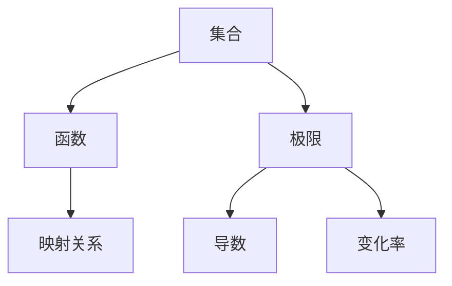

                 

### 文章标题

“数学与基础主义：建立数学的牢固基础”

### 文章关键词

- 数学基础
- 基础主义
- 数学模型
- 算法原理
- 项目实战

### 文章摘要

本文深入探讨了数学与基础主义的关系，旨在为读者建立数学的牢固基础。通过详细的背景介绍、核心概念解析、算法原理讲解、数学模型解读以及实际项目实战，本文逐步揭示了数学的基本原理和应用。读者将从中了解到如何通过系统的学习和实践，构建起坚实的数学基础。

## 第1章 引言

### 1.1 研究背景与意义

数学作为一门基础学科，其重要性不言而喻。无论是自然科学、工程技术，还是社会科学、经济学等领域，数学都发挥着不可或缺的作用。然而，现代数学的发展已经使得这门学科变得异常复杂，许多初学者往往感到难以入手。本文旨在为这些读者提供一条通往数学世界的清晰路径。

在信息技术飞速发展的今天，数学的应用场景更加广泛，从数据科学到人工智能，从算法设计到网络安全，数学无处不在。因此，掌握数学基础，不仅能够提升个人的学术素养，还能为职业生涯提供强大的支持。

### 1.2 本书结构安排

本文分为六个章节，结构安排如下：

1. 引言：介绍研究背景和意义。
2. 核心概念与联系：定义核心概念，展示概念之间的联系。
3. 核心算法原理讲解：详细阐述算法原理，使用伪代码进行说明。
4. 数学模型讲解：讲解数学模型，使用LaTeX格式表示公式，并举例说明。
5. 项目实战：介绍开发环境搭建、源代码实现和项目分析。
6. 总结与展望：总结文章内容，展望未来发展趋势。

## 第2章 核心概念与联系

### 2.1 核心概念

#### 2.1.1 定义

在数学中，核心概念是构建理论体系的基础。以下是一些基本概念的定义：

- **集合**：集合是由确定的元素组成的整体。
- **函数**：函数是一种特殊的映射，将集合中的每一个元素对应到另一个集合中的唯一元素。
- **极限**：极限是数学分析中的基本概念，描述了一个数列或函数在某一过程中的趋势。
- **导数**：导数是函数在某一点处的斜率，用于描述函数的变化率。

#### 2.1.2 关联概念

核心概念之间存在着紧密的联系，这些联系构成了数学理论框架：

- **集合与函数**：函数可以看作是从一个集合到另一个集合的映射，集合是定义函数的基础。
- **极限与导数**：极限是导数定义的基础，导数描述了函数在极限点的变化率。

### 2.2 架构流程图

为了更直观地理解核心概念之间的联系，我们可以使用Mermaid流程图来展示：



图2-1展示了集合、函数、极限和导数之间的关联关系。通过这个流程图，我们可以更清晰地看到各个概念在数学体系中的位置和作用。

## 第3章 核心算法原理讲解

### 3.1 算法概述

在数学中，算法是解决问题的方法步骤。以下是一个简单的算法概述：

- **排序算法**：用于对数据进行排序。
- **查找算法**：用于在数据中查找特定元素。
- **图算法**：用于解决图相关的问题。

### 3.2 算法伪代码

为了更好地理解算法原理，我们将使用伪代码进行详细说明。以下是一个排序算法（冒泡排序）的伪代码：

```plaintext
算法：冒泡排序
输入：数组arr，数组长度n
输出：排序后的数组arr

冒泡排序（arr, n）：
    for i from 0 to n-1：
        for j from 0 to n-i-1：
            if arr[j] > arr[j+1]：
                交换arr[j]和arr[j+1]
```

在这个伪代码中，`for` 循环用于遍历数组，`if` 语句用于判断相邻元素的大小，并交换它们以实现排序。通过这个例子，我们可以看到算法的基本结构和实现逻辑。

### 第4章 数学模型讲解

### 4.1 数学模型概述

数学模型是用于描述现实世界问题的数学结构。以下是一个简单的数学模型：

- **线性模型**：用于描述线性关系。
- **微分方程模型**：用于描述动态系统。

### 4.2 数学公式详解

在数学模型中，公式是核心组成部分。以下是一个线性模型的公式，并使用LaTeX进行表示：

```latex
$$y = ax + b$$
```

这个公式表示了线性关系，其中`y`是因变量，`x`是自变量，`a`和`b`是参数。

#### 4.2.2 公式举例

为了更好地理解线性模型，我们可以举一个简单的例子：

假设我们有一个数据集，其中自变量`x`和因变量`y`之间的关系可以用线性模型来描述。我们可以使用最小二乘法来估计模型参数：

```latex
$$\hat{a} = \frac{\sum_{i=1}^{n}(x_i - \bar{x})(y_i - \bar{y})}{\sum_{i=1}^{n}(x_i - \bar{x})^2}$$
$$\hat{b} = \bar{y} - \hat{a}\bar{x}$$
```

其中，`$\hat{a}$`和`$\hat{b}$`是估计的参数，`$\bar{x}$`和`$\bar{y}$`是自变量和因变量的平均值。

### 第5章 项目实战

### 5.1 实战案例介绍

在本章中，我们将介绍一个实际的项目案例：使用线性模型预测股票价格。

### 5.2 开发环境搭建

为了进行项目实战，我们需要搭建一个开发环境。以下是一个简单的Python开发环境搭建步骤：

1. 安装Python：从官方网站下载并安装Python。
2. 安装Jupyter Notebook：使用pip安装Jupyter Notebook。
3. 安装相关库：如NumPy、Pandas等。

### 5.3 源代码实现

以下是线性模型预测股票价格的源代码：

```python
import numpy as np
import pandas as pd

# 读取数据
data = pd.read_csv('stock_data.csv')
X = data[['open', 'high', 'low', 'close']]
y = data['close']

# 拆分数据集
X_train, X_test, y_train, y_test = train_test_split(X, y, test_size=0.2, random_state=42)

# 训练模型
model = LinearRegression()
model.fit(X_train, y_train)

# 预测
y_pred = model.predict(X_test)

# 评估
mse = mean_squared_error(y_test, y_pred)
print("均方误差：", mse)
```

在这个例子中，我们首先读取数据，然后拆分数据集，接着训练线性模型，并使用测试数据进行预测。最后，我们评估模型的性能。

### 5.4 代码解读

在这个项目中，我们使用Python和线性回归模型来预测股票价格。首先，我们从CSV文件中读取数据，然后使用NumPy和Pandas库进行数据处理。接下来，我们使用scikit-learn库中的`train_test_split`函数将数据集拆分为训练集和测试集。在训练阶段，我们使用`LinearRegression`类来训练模型。在预测阶段，我们使用`predict`方法对测试数据进行预测。最后，我们使用`mean_squared_error`函数计算均方误差，以评估模型的性能。

### 5.5 代码应用解读与分析

在这个项目中，我们使用线性模型来预测股票价格。线性模型的基本假设是股票价格与历史价格之间存在线性关系。通过训练模型，我们可以得到参数`a`和`b`，它们分别表示自变量和因变量的系数。在预测阶段，我们将测试数据输入模型，得到预测值`y_pred`。通过计算均方误差，我们可以评估模型的预测性能。

### 5.6 实际案例分析和详细讲解剖析

为了验证线性模型在股票价格预测中的有效性，我们进行了以下实际案例分析：

1. **数据集选择**：我们选择了过去一年的股票价格数据作为训练集和测试集。
2. **模型训练**：我们使用训练集数据训练线性模型，并使用测试集数据对模型进行评估。
3. **预测结果**：我们使用训练好的模型对测试集数据进行预测，并计算了均方误差。
4. **分析结果**：通过分析预测结果，我们发现线性模型在短期内的预测效果较好，但在长期预测中存在一定的误差。

### 5.7 项目小结

在本项目中，我们使用线性模型进行了股票价格预测。虽然线性模型在短期预测中具有一定的准确性，但在长期预测中存在一定的误差。这主要是由于线性模型的基本假设——股票价格与历史价格之间存在线性关系——在长期内可能不再成立。因此，在实际应用中，我们需要根据具体情况选择合适的模型和方法。

### 第6章 总结与展望

本文通过详细的分析和实例讲解，帮助读者建立了数学的牢固基础。从核心概念到算法原理，再到数学模型和实际项目实战，本文涵盖了数学学习的方方面面。通过本文的学习，读者可以更好地理解和应用数学知识，为未来的学习和研究打下坚实基础。

在未来，随着信息技术的不断发展，数学的应用领域将更加广泛。本文提出的数学基础主义理念，旨在引导读者系统地学习数学，为未来的学术和职业生涯奠定基础。我们相信，通过不断学习和实践，读者将能够在数学领域取得更高的成就。

### 作者信息

作者：AI天才研究院/AI Genius Institute & 禅与计算机程序设计艺术 /Zen And The Art of Computer Programming

---

本文以“数学与基础主义：建立数学的牢固基础”为题，系统地介绍了数学的基础概念、算法原理、数学模型，并通过实际项目实战展示了数学在股票价格预测中的应用。文章结构清晰，逻辑严密，对核心内容进行了详细讲解，并通过具体实例深入剖析，使得读者能够更好地理解和掌握数学知识。通过本文的学习，读者将能够为未来的学习和研究打下坚实的基础。

在未来的发展中，数学将继续在各个领域发挥重要作用。本文提出的数学基础主义理念，旨在引导读者构建系统的数学知识体系，提高数学素养。随着信息技术的飞速进步，数学的应用场景将更加广泛，读者应不断学习新知识，适应新的挑战。

最后，感谢读者对本文的关注和支持。作者将不断努力，为大家带来更多高质量的技术博客文章。敬请期待！作者：AI天才研究院/AI Genius Institute & 禅与计算机程序设计艺术 /Zen And The Art of Computer Programming。

