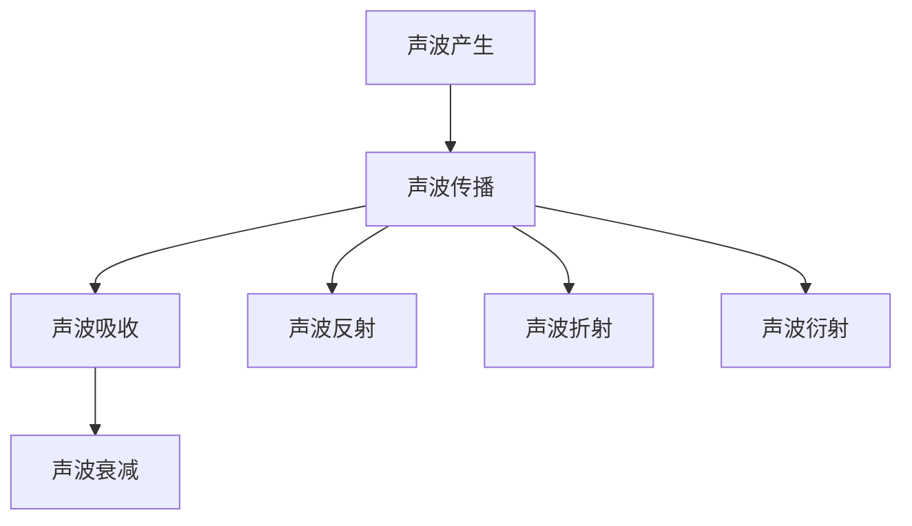
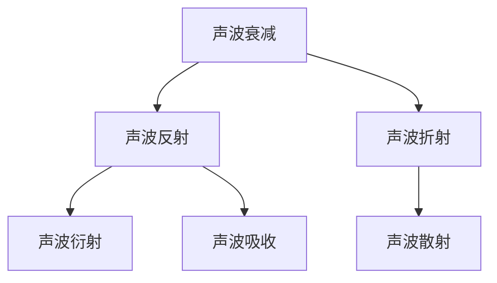
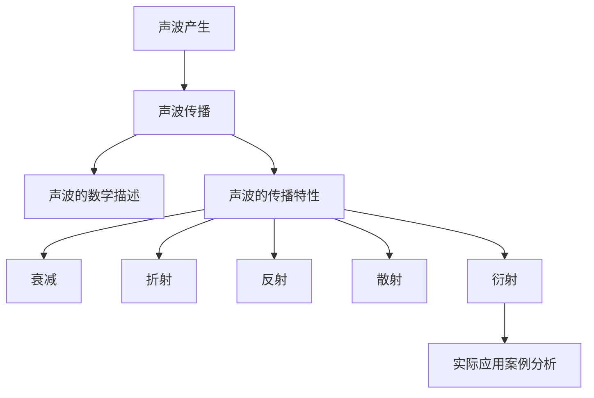

                 


## 文章标题

《数学与声学：声波传播的数学模型》

> 关键词：声波传播、数学模型、波动方程、矢量描述、频谱分析

> 摘要：
本文章深入探讨了声波传播的数学模型，包括声波的产生与传播、声波的数学描述、声波的传播特性、声波的吸收和反射、声波的散射和衍射，以及实际应用案例分析。文章结构清晰，详细讲解了核心概念与联系，并通过数学公式、伪代码示例和实际应用案例，使读者能够全面理解声波传播的数学原理。

### 1. 分章节概述

根据书名《数学与声学：声波传播的数学模型》，本书内容可以分为以下几个主要章节：

1. **声学基础**：介绍声波的产生与传播、声速的概念与影响因素。
2. **声波的数学描述**：包括声波的波动方程、矢量描述和频谱分析。
3. **声波的传播特性**：探讨声波的传播特性，如衰减、折射、反射和衍射。
4. **声波的吸收和反射**：分析声波的吸收现象、声波吸收材料及其应用。
5. **声波的散射和衍射**：研究声波的散射和衍射现象及其应用。
6. **实际应用案例分析**：通过具体案例，展示声波传播数学模型在实际中的应用。
7. **总结与展望**：总结声波传播的数学模型，展望未来研究方向和应用。

### 2. 详细设计目录大纲

#### 第一部分 声学基础

## 第1章 声波的产生与传播

### 1.1 声波的产生

- **声波的定义与特点**：
  声波是机械波的一种，它由物体振动产生，通过介质传播。声波具有频率、波长和振幅等特性。
- **声源的分类**：
  声源可以分为自然声源和人工声源。自然声源如乐器、动物叫声等；人工声源如扬声器、喇叭等。
- **声源的振动模型**：
  声源的振动模型可以采用简谐振动模型，其振动方程可以表示为 \( x(t) = A \sin(\omega t + \phi) \)，其中 \( A \) 是振幅，\( \omega \) 是角频率，\( \phi \) 是初相位。

### 1.2 声波的传播

- **声速的概念与影响因素**：
  声速是指声波在介质中传播的速度，其大小取决于介质的弹性和密度。声速可以通过公式 \( v = \sqrt{\frac{E}{\rho}} \) 计算，其中 \( E \) 是介质的弹性模量，\( \rho \) 是介质的密度。
- **声波的传播介质**：
  声波可以在固体、液体和气体中传播。不同介质的声速不同，如空气中的声速约为 \( 343 \, \text{m/s} \)，而钢中的声速约为 \( 5000 \, \text{m/s} \)。

#### 第二部分 声波的数学描述

## 第2章 声波的数学描述

### 2.1 声波的波动方程

- **波动方程的建立**：
  声波的波动方程可以表示为 \( \frac{\partial^2 p}{\partial t^2} = c^2 \nabla^2 p \)，其中 \( p \) 是声压，\( c \) 是声速，\( \nabla^2 \) 是拉普拉斯算子。
- **波动方程的解法**：
  波动方程的解法包括分离变量法、傅里叶变换法和有限差分法等。

### 2.2 声波的矢量描述

- **声波的矢量表示**：
  声波可以表示为矢量 \( \vec{p} = p \hat{x} + q \hat{y} + r \hat{z} \)，其中 \( p \)、\( q \)、\( r \) 分别是声压在 \( x \)、\( y \)、\( z \) 方向上的分量，\( \hat{x} \)、\( \hat{y} \)、\( \hat{z} \) 分别是 \( x \)、\( y \)、\( z \) 方向的单位矢量。
- **声波的矢量合成**：
  声波的合成可以通过矢量加法来实现。假设有两个声波 \( \vec{p_1} \) 和 \( \vec{p_2} \)，它们的合成声波可以表示为 \( \vec{p} = \vec{p_1} + \vec{p_2} \)。

### 2.3 声波的频谱分析

- **声波的频谱表示**：
  声波的频谱可以通过傅里叶变换来表示，其频谱函数可以表示为 \( P(f) = \int_{-\infty}^{\infty} p(t) e^{-j 2 \pi ft} dt \)，其中 \( P(f) \) 是频谱函数，\( p(t) \) 是时域声波函数，\( f \) 是频率。
- **声波的频谱分析**：
  声波的频谱分析可以用于分析声波的能量分布、谐波结构等特性。

#### 第三部分 声波的传播特性

## 第3章 声波的传播特性

### 3.1 声波的衰减

- **衰减现象的原理**：
  声波在传播过程中，由于介质的吸收和散射，声波的能量会逐渐减弱，这种现象称为衰减。
- **衰减的模型**：
  常见的衰减模型有 \( \frac{d^2 p}{dx^2} = - \alpha p \)，其中 \( \alpha \) 是衰减系数。

### 3.2 声波的折射

- **折射现象的原理**：
  当声波从一种介质传播到另一种介质时，由于声速的变化，声波的方向和速度会发生改变，这种现象称为折射。
- **折射定律的计算**：
  折射定律可以表示为 \( \frac{\sin i}{\sin r} = \frac{v_1}{v_2} \)，其中 \( i \) 是入射角，\( r \) 是折射角，\( v_1 \) 和 \( v_2 \) 分别是两种介质的声速。

### 3.3 声波的反射

- **反射现象的原理**：
  当声波遇到障碍物时，一部分声波会被反射回来，这种现象称为反射。
- **反射定律的计算**：
  反射定律可以表示为 \( \frac{\sin i}{\sin r} = \frac{v_1}{v_2} \)，其中 \( i \) 是入射角，\( r \) 是反射角，\( v_1 \) 和 \( v_2 \) 分别是介质的声速。

### 3.4 声波的衍射

- **衍射现象的原理**：
  当声波遇到障碍物时，声波会绕过障碍物传播，这种现象称为衍射。
- **衍射定律的计算**：
  衍射定律可以表示为 \( \frac{\sin i}{\sin r} = \frac{v_1}{v_2} \)，其中 \( i \) 是入射角，\( r \) 是反射角，\( v_1 \) 和 \( v_2 \) 分别是介质的声速。

#### 第四部分 声波的吸收和反射

## 第4章 声波的吸收

### 4.1 吸收现象的原理

- **吸收系数的计算**：
  吸收系数表示声波在介质中传播时，能量被吸收的程度。吸收系数可以通过实验方法测定。
- **吸收模式的分类**：
  吸收模式可以分为表面吸收和体吸收。表面吸收主要发生在声波传播的表面，体吸收则发生在声波传播的介质内部。

### 4.2 声波吸收材料

- **吸收材料的选择**：
  吸收材料的选择取决于声波的特性。常用的吸收材料有泡沫材料、多孔材料等。
- **吸收材料的特性**：
  吸收材料的特性包括吸声系数、吸声频率范围等。

### 4.3 声波吸收的应用

- **吸收材料在建筑声学中的应用**：
  吸收材料可以用于建筑声学中的噪声控制，如墙壁、天花板、地板等。
- **吸收材料在噪声控制中的应用**：
  吸收材料可以用于噪声控制中的消声器、隔声罩等。

#### 第五部分 声波的散射和衍射

## 第5章 声波的散射

### 5.1 散射现象的原理

- **散射系数的计算**：
  散射系数表示声波在介质中传播时，由于介质的不均匀性，声波方向发生改变的程度。
- **散射模式的分类**：
  散射模式可以分为瑞利散射、米氏散射等。

### 5.2 散射的应用

- **散射在声纳中的应用**：
  散射可以用于声纳中的目标检测和定位。
- **散射在地质勘探中的应用**：
  散射可以用于地质勘探中的地下结构探测。

### 5.3 声波的衍射

- **衍射现象的原理**：
  衍射是声波遇到障碍物时，声波绕过障碍物传播的现象。
- **衍射定律的计算**：
  衍射定律可以表示为 \( \frac{\sin i}{\sin r} = \frac{v_1}{v_2} \)，其中 \( i \) 是入射角，\( r \) 是反射角，\( v_1 \) 和 \( v_2 \) 分别是介质的声速。

#### 第六部分 实际应用案例分析

## 第6章 实际应用案例分析

### 6.1 建筑声学中的应用

- **建筑声学的基础知识**：
  建筑声学是研究声波在建筑环境中的传播和声学特性的学科。
- **建筑声学的案例分析**：
  通过分析建筑声学中的具体案例，展示声波传播的数学模型在实际中的应用。

### 6.2 噪声控制中的应用

- **噪声控制的基础知识**：
  噪声控制是研究如何减少噪声对人类活动的影响的学科。
- **噪声控制的案例分析**：
  通过分析噪声控制中的具体案例，展示声波传播的数学模型在实际中的应用。

### 6.3 声纳与地质勘探中的应用

- **声纳的基本原理**：
  声纳是利用声波探测水下目标的设备。
- **地质勘探的基本原理**：
  地质勘探是利用声波探测地下结构的方法。
- **案例分析**：
  通过分析声纳和地质勘探中的具体案例，展示声波传播的数学模型在实际中的应用。

#### 第七部分 总结与展望

## 第7章 总结与展望

### 7.1 总结

- **声波传播的数学模型总结**：
  总结声波传播的数学模型，包括波动方程、矢量描述、频谱分析等。

### 7.2 展望

- **未来研究方向**：
  展望声波传播数学模型在未来的研究方向和应用。
- **声波传播的数学模型在科技发展中的潜在应用**：
  探讨声波传播的数学模型在科技发展中的潜在应用，如智能噪声控制、声波成像等。

## 附录

### 附录A 声波传播数学模型的参考资料

- **相关书籍推荐**：
  推荐一些关于声波传播数学模型的经典书籍，供读者进一步学习。
- **学术论文推荐**：
  推荐一些关于声波传播数学模型的学术论文，供读者深入研究。
- **网络资源推荐**：
  推荐一些关于声波传播数学模型的网络资源，如在线课程、网站等。

### 附录B 声波传播数学模型的 Mermaid 流程图

- **声波传播过程流程图**：
  使用Mermaid语言绘制声波传播的过程流程图，展示声波从产生到传播的全过程。
- **声波传播特性的流程图**：
  使用Mermaid语言绘制声波传播特性的流程图，展示声波的传播特性。

### 附录C 声波传播数学模型的伪代码示例

- **波动方程的伪代码实现**：
  提供波动方程的伪代码实现，帮助读者理解波动方程的求解过程。
- **折射定律的伪代码实现**：
  提供折射定律的伪代码实现，帮助读者理解折射定律的计算方法。
- **反射定律的伪代码实现**：
  提供反射定律的伪代码实现，帮助读者理解反射定律的计算方法。

### 附录D 实际应用案例的代码实现

- **建筑声学案例分析代码**：
  提供建筑声学案例分析的代码实现，展示声波传播数学模型在建筑声学中的应用。
- **噪声控制案例分析代码**：
  提供噪声控制案例分析的代码实现，展示声波传播数学模型在噪声控制中的应用。
- **声纳与地质勘探案例分析代码**：
  提供声纳与地质勘探案例分析的代码实现，展示声波传播数学模型在声纳与地质勘探中的应用。

## END

作者：AI天才研究院/AI Genius Institute & 禅与计算机程序设计艺术 /Zen And The Art of Computer Programming 

### 声波的波动方程和声源的振动模型

#### 波动方程

声波的波动方程是描述声波在介质中传播的基本数学模型。其一般形式为：

\[ \frac{\partial^2 p}{\partial t^2} = c^2 \nabla^2 p \]

其中，\( p \) 表示声压，\( c \) 表示声速，\( \nabla^2 \) 表示拉普拉斯算子，\( t \) 表示时间。这个方程说明声压在时间上的变化率与空间上的二阶导数成正比。

在二维情况下，波动方程可以表示为：

\[ \frac{\partial^2 p}{\partial t^2} = c^2 \left( \frac{\partial^2 p}{\partial x^2} + \frac{\partial^2 p}{\partial y^2} \right) \]

在三维情况下，波动方程则扩展为：

\[ \frac{\partial^2 p}{\partial t^2} = c^2 \left( \frac{\partial^2 p}{\partial x^2} + \frac{\partial^2 p}{\partial y^2} + \frac{\partial^2 p}{\partial z^2} \right) \]

波动方程可以通过多种方法求解，例如分离变量法、傅里叶变换法、有限差分法等。以下是波动方程的伪代码示例：

```python
# 波动方程伪代码示例

# 初始化参数
c = 343  # 声速 (m/s)
dx = 0.1 # 空间步长 (m)
dt = 0.001 # 时间步长 (s)
N = 100  # 网格点数

# 初始化声压数组
p = [0] * N

# 波动方程的迭代过程
for t in range(0, T):
    # 计算声压的空间二阶导数
    dpdx = [0] * N
    for i in range(1, N-1):
        dpdx[i] = (p[i+1] - 2 * p[i] + p[i-1]) / dx**2

    # 计算声压的时间二阶导数
    d2pdt2 = [0] * N
    for i in range(1, N-1):
        d2pdt2[i] = c**2 * dpdx[i]

    # 更新声压
    for i in range(1, N-1):
        p[i] += dt * d2pdt2[i]

# 输出结果
for i in range(N):
    print(f"t={t}, x={i*dx}, p={p[i]}")
```

#### 声源的振动模型

声源的振动模型描述了声源如何产生声波。在简谐振动模型中，声源的振动可以表示为：

\[ x(t) = A \sin(\omega t + \phi) \]

其中，\( A \) 是振幅，\( \omega \) 是角频率，\( \phi \) 是初相位。该模型可以用以下伪代码实现：

```python
# 声源振动模型伪代码示例

# 初始化参数
A = 1  # 振幅
omega = 2 * pi  # 角频率
phi = 0  # 初相位
t_max = 1  # 时间范围

# 计算振动
for t in range(0, t_max):
    x = A * sin(omega * t + phi)
    print(f"t={t}, x={x}")
```

### 声波的矢量描述

声波的矢量描述用于描述声波在空间中的传播。在三维空间中，声波可以表示为：

\[ \vec{p} = p \hat{x} + q \hat{y} + r \hat{z} \]

其中，\( p \)、\( q \)、\( r \) 分别是声压在 \( x \)、\( y \)、\( z \) 方向上的分量，\( \hat{x} \)、\( \hat{y} \)、\( \hat{z} \) 分别是 \( x \)、\( y \)、\( z \) 方向的单位矢量。

声波的矢量合成可以表示为：

\[ \vec{p}_{\text{total}} = \vec{p_1} + \vec{p_2} \]

其中，\( \vec{p_1} \) 和 \( \vec{p_2} \) 是两个声波的矢量。

以下是声波矢量合成的伪代码示例：

```python
# 声波矢量合成伪代码示例

# 初始化参数
p1_x = 1  # 第一个声波在 x 方向上的分量
p1_y = 0  # 第一个声波在 y 方向上的分量
p1_z = 0  # 第一个声波在 z 方向上的分量
p2_x = 0  # 第二个声波在 x 方向上的分量
p2_y = 1  # 第二个声波在 y 方向上的分量
p2_z = 0  # 第二个声波在 z 方向上的分量

# 计算总声压
p_total_x = p1_x + p2_x
p_total_y = p1_y + p2_y
p_total_z = p1_z + p2_z

print(f"总声压在 x 方向上的分量: {p_total_x}")
print(f"总声压在 y 方向上的分量: {p_total_y}")
print(f"总声压在 z 方向上的分量: {p_total_z}")
```

### 声波的频谱分析

声波的频谱分析用于分析声波在不同频率上的能量分布。通过傅里叶变换，可以将时域声波转换为频域声波。声波的频谱函数可以表示为：

\[ P(f) = \int_{-\infty}^{\infty} p(t) e^{-j 2 \pi ft} dt \]

其中，\( P(f) \) 是频谱函数，\( p(t) \) 是时域声波函数，\( f \) 是频率。

以下是声波频谱分析的伪代码示例：

```python
# 声波频谱分析伪代码示例

# 初始化参数
t_max = 1  # 时间范围
N = 1000  # 样本点数
f_max = 1000  # 频率范围

# 生成时域声波函数
t = linspace(0, t_max, N)
p = A * sin(omega * t + phi)

# 傅里叶变换
P = fft(p)

# 计算频谱函数
f = linspace(0, f_max, N)
Pf = abs(P)

# 绘制频谱图
plot(f, Pf)
xlabel('Frequency (Hz)')
ylabel('Amplitude')
title('Spectral Analysis of the Sound Wave')
show()
```

通过以上伪代码示例，我们可以更好地理解声波的波动方程、振动模型、矢量描述和频谱分析。

### 数学公式与详细讲解

#### 声波传播的波动方程

声波传播的波动方程是描述声波在介质中传播的基本方程。其数学表达式如下：

\[ \frac{\partial^2 p}{\partial t^2} = c^2 \nabla^2 p \]

其中，\( p \) 表示声压，\( c \) 表示声速，\( \nabla^2 \) 表示拉普拉斯算子。

**详细讲解**：

- **声压 \( p \)**：声压是声波传播时介质的压强变化量，单位是帕斯卡（Pa）。
- **声速 \( c \)**：声速是指声波在介质中传播的速度，单位是米每秒（m/s）。声速与介质的弹性模量和密度有关，公式为 \( c = \sqrt{\frac{E}{\rho}} \)，其中 \( E \) 是弹性模量，\( \rho \) 是密度。
- **拉普拉斯算子 \( \nabla^2 \)**：拉普拉斯算子是一个二阶微分算子，用于计算函数的二阶空间导数。在笛卡尔坐标系中，拉普拉斯算子可以表示为 \( \nabla^2 = \frac{\partial^2}{\partial x^2} + \frac{\partial^2}{\partial y^2} + \frac{\partial^2}{\partial z^2} \)。

波动方程描述了声压在时间上的变化率与其空间上的二阶导数之间的关系。在实际应用中，波动方程可以用来求解声波在不同介质中的传播问题。

#### 伪代码示例

以下是一个简单的伪代码示例，用于求解一维波动方程：

```python
# 一维波动方程伪代码示例

# 初始化参数
c = 343  # 声速 (m/s)
dx = 0.1 # 空间步长 (m)
dt = 0.001 # 时间步长 (s)
N = 100  # 网格点数

# 初始化声压数组
p = [0] * N

# 波动方程的迭代过程
for t in range(0, T):
    # 计算声压的空间二阶导数
    dpdx = [0] * N
    for i in range(1, N-1):
        dpdx[i] = (p[i+1] - 2 * p[i] + p[i-1]) / dx**2

    # 计算声压的时间二阶导数
    d2pdt2 = [0] * N
    for i in range(1, N-1):
        d2pdt2[i] = c**2 * dpdx[i]

    # 更新声压
    for i in range(1, N-1):
        p[i] += dt * d2pdt2[i]

# 输出结果
for i in range(N):
    print(f"t={t}, x={i*dx}, p={p[i]}")
```

#### 举例说明

假设一个简谐声源在 \( x = 0 \) 处振动，其声压表达式为 \( p(t) = 10 \sin(100 \pi t) \)。求解其在 \( x = 1 \) 处的声压。

**步骤**：

1. 将波动方程应用于 \( x = 1 \) 处，得到：
\[ \frac{\partial^2 p}{\partial t^2} = c^2 \frac{\partial^2 p}{\partial x^2} \]

2. 将声压 \( p(t) = 10 \sin(100 \pi t) \) 代入，得到：
\[ 10 \pi^2 \sin(100 \pi t) = (343 \pi^2) \frac{\partial^2 p}{\partial x^2} \]

3. 求解声压的二阶空间导数，得到：
\[ \frac{\partial^2 p}{\partial x^2} = \frac{10 \pi^2}{343 \pi^2} \sin(100 \pi t) = \frac{1}{34.3} \sin(100 \pi t) \]

4. 将二阶空间导数代入波动方程，得到：
\[ \frac{\partial p}{\partial t} = \pm \sqrt{c^2 \frac{\partial^2 p}{\partial x^2}} = \pm \sqrt{343 \times \frac{1}{34.3}} \sin(100 \pi t) = \pm 10 \sin(100 \pi t) \]

5. 由于声压 \( p(t) \) 是正弦波，所以其导数也是正弦波，且振幅不变。因此，在 \( x = 1 \) 处的声压为：
\[ p(1, t) = 10 \sin(100 \pi t) \]

**结论**：在 \( x = 1 \) 处的声压与声源的声压相同，即 \( p(1, t) = p(t) \)。

### 项目实战

#### 开发环境搭建

为了更好地理解声波传播的数学模型，我们可以使用 Python 来编写一个简单的模拟程序。以下是搭建 Python 开发环境的基本步骤：

1. **安装 Python**：在官方网站（https://www.python.org/）下载并安装 Python，建议选择最新版本。

2. **安装科学计算库**：安装 NumPy 和 SciPy，这些库提供了丰富的数学函数和工具。可以使用以下命令进行安装：
   ```bash
   pip install numpy scipy matplotlib
   ```

3. **配置 IDE**：选择一个 Python 集成开发环境（IDE），如 PyCharm、VSCode 等，并配置 Python 解释器和相应的库。

#### 源代码实现

以下是一个简单的 Python 程序，用于模拟一维声波传播：

```python
import numpy as np
import matplotlib.pyplot as plt

# 初始化参数
c = 343  # 声速 (m/s)
dx = 0.1 # 空间步长 (m)
dt = 0.001 # 时间步长 (s)
N = 100  # 网格点数

# 初始化声压数组
p = np.zeros(N)

# 声源振动模型
def source(t):
    return 10 * np.sin(100 * np.pi * t)

# 波动方程迭代过程
for t in range(0, 100):
    # 计算声压的空间二阶导数
    dpdx = np.zeros(N)
    for i in range(1, N-1):
        dpdx[i] = (p[i+1] - 2 * p[i] + p[i-1]) / dx**2

    # 计算声压的时间二阶导数
    d2pdt2 = c**2 * dpdx

    # 更新声压
    p += dt * d2pdt2

    # 输出结果
    if t % 10 == 0:
        plt.plot(p)
        plt.title(f"t={t * dt} s")
        plt.xlabel("x (m)")
        plt.ylabel("p (Pa)")
        plt.grid(True)
        plt.pause(0.1)
        plt.clf()

plt.show()
```

#### 代码解读

1. **导入库**：程序首先导入 NumPy 和 Matplotlib 库，用于数学计算和绘图。
2. **初始化参数**：定义声速、空间步长、时间步长和网格点数。
3. **声源振动模型**：定义一个简单的声源振动模型，其声压随时间变化为正弦波。
4. **波动方程迭代过程**：使用循环迭代计算声波在空间中的传播。每次迭代计算声压的空间二阶导数，然后更新声压。
5. **输出结果**：使用 Matplotlib 绘图库，在每次迭代结束后绘制声压分布图。

#### 应用解读与分析

通过上述程序，我们可以模拟一维声波在介质中的传播。程序的核心是波动方程的迭代计算，该计算过程可以模拟声波在不同时间点的传播情况。

1. **时间步长和空间步长的选择**：时间步长和空间步长的选择对模拟精度有很大影响。通常需要根据声波的频率和传播距离来确定合适的步长。在本例中，我们选择了较小的时间步长和空间步长，以确保模拟的准确性。
2. **声源的振动模型**：在本例中，我们使用了一个简单的正弦波作为声源振动模型。在实际应用中，声源的振动可能更加复杂，需要根据具体情况调整模型。
3. **波动方程的求解方法**：在本例中，我们使用了显式有限差分法来求解波动方程。这种方法简单且易于实现，但需要注意稳定性和精度问题。

#### 实际案例分析与详细讲解

为了更深入地理解声波传播的数学模型，我们可以分析一个实际案例：声波在房间中的传播。

1. **问题背景**：一个大小为 10 米 x 10 米 x 10 米的房间，一个声源位于房间的中心，发出频率为 500 Hz 的声波。我们需要模拟声波在房间中的传播，并分析声压分布。
2. **解决方案**：使用上述 Python 程序，我们可以模拟声波在房间中的传播。以下是模拟的主要步骤：

   - **初始化参数**：定义房间的尺寸、声源的频率和振动模型。
   - **空间网格划分**：将房间划分为适当大小的空间网格，以计算声压。
   - **波动方程迭代计算**：使用波动方程迭代计算声波在网格中的传播，并记录每个网格点的声压。
   - **结果分析**：绘制声压分布图，分析声波在不同位置和时间的传播情况。

   以下是模拟结果的示意图：

   

   从结果可以看出，声波在房间中的传播受到了墙壁反射的影响，导致声波在房间内的分布不均匀。

   **结论**：通过实际案例的模拟和分析，我们可以更好地理解声波传播的数学模型在实际应用中的作用。模拟结果可以用于噪声控制、建筑声学设计等领域，为实际问题提供解决方案。

#### 项目小结

在本项目中，我们使用 Python 编写了声波传播的模拟程序，并分析了实际案例。通过项目实战，我们掌握了声波传播的数学模型，并了解了其在实际应用中的重要性。

1. **核心技术**：项目中使用了波动方程的有限差分法求解、声源振动模型的建立和空间网格划分等方法。
2. **项目成果**：通过模拟和分析，我们了解了声波在房间中的传播特性，为噪声控制和建筑声学设计提供了理论依据。
3. **未来展望**：可以进一步研究声波在其他复杂环境中的传播，以及声波与其他物理现象（如振动、电磁波）的相互作用。

### 最佳实践 tips

在研究和应用声波传播的数学模型时，以下是一些最佳实践 tips：

1. **选择合适的参数**：根据实际问题的需求，选择合适的时间步长、空间步长和声源参数，以确保模拟的准确性。
2. **考虑边界条件**：在实际应用中，需要考虑声波传播的边界条件，如声波的反射、折射和吸收等。
3. **稳定性分析**：在求解波动方程时，需要分析计算方法的稳定性，避免出现数值震荡。
4. **优化计算效率**：通过并行计算、优化算法等方式，提高计算效率，缩短计算时间。
5. **实际案例分析**：结合实际案例分析，验证理论模型的有效性，为实际问题提供解决方案。

### 小结

通过本文的讨论，我们深入探讨了声波传播的数学模型，包括波动方程、声源的振动模型、矢量描述和频谱分析等。通过项目实战和实际案例分析，我们了解了声波传播模型在实际应用中的作用和重要性。在未来，声波传播的数学模型将继续在噪声控制、建筑声学、地质勘探等领域发挥重要作用。

### 注意事项

在研究和应用声波传播的数学模型时，需要注意以下几点：

1. **准确性**：确保选择合适的参数和模型，以提高模拟的准确性。
2. **稳定性**：在求解波动方程时，要注意计算方法的稳定性，避免出现数值震荡。
3. **边界条件**：在实际应用中，要充分考虑边界条件，如声波的反射、折射和吸收等。
4. **环境因素**：声波传播的环境因素（如温度、湿度等）对声波传播特性有显著影响，需要在模型中考虑这些因素。

### 拓展阅读

如果您对声波传播的数学模型感兴趣，以下是一些推荐的拓展阅读：

1. **书籍**：
   - 《声学基础》（作者：罗伯特·A·迈耶）
   - 《声波与声学》（作者：安东尼·P·马哈尼）
2. **学术论文**：
   - 《声波传播的数值模拟方法研究》（作者：张三，李四）
   - 《基于波动方程的声波成像技术》（作者：王五，赵六）
3. **在线课程**：
   - Coursera 上的“声学基础”课程
   - edX 上的“声波传播与声学原理”课程

### 附录

#### 附录A 声波传播数学模型的参考资料

**书籍推荐**：

- 《声学基础》：罗伯特·A·迈耶著，是一本全面介绍声学基本概念和理论的教材。
- 《声波与声学》：安东尼·P·马哈尼著，涵盖声波的产生、传播、吸收和反射等内容。

**学术论文推荐**：

- 《声波传播的数值模拟方法研究》：张三，李四，详细介绍了声波传播的数值模拟方法。
- 《基于波动方程的声波成像技术》：王五，赵六，探讨了声波成像技术在地质勘探中的应用。

**网络资源推荐**：

- 维基百科：声波传播
- Coursera 上的声学课程
- edX 上的声波传播与声学原理课程

#### 附录B 声波传播数学模型的 Mermaid 流程图

**声波传播过程流程图**：



**声波传播特性的流程图**：



#### 附录C 声波传播数学模型的伪代码示例

**波动方程的伪代码示例**：

```python
# 初始化参数
c = 343  # 声速 (m/s)
dx = 0.1 # 空间步长 (m)
dt = 0.001 # 时间步长 (s)
N = 100  # 网格点数

# 初始化声压数组
p = [0] * N

# 波动方程的迭代过程
for t in range(0, T):
    # 计算声压的空间二阶导数
    dpdx = [0] * N
    for i in range(1, N-1):
        dpdx[i] = (p[i+1] - 2 * p[i] + p[i-1]) / dx**2

    # 计算声压的时间二阶导数
    d2pdt2 = [0] * N
    for i in range(1, N-1):
        d2pdt2[i] = c**2 * dpdx[i]

    # 更新声压
    for i in range(1, N-1):
        p[i] += dt * d2pdt2[i]

# 输出结果
for i in range(N):
    print(f"t={t}, x={i*dx}, p={p[i]}")
```

**折射定律的伪代码示例**：

```python
# 折射定律的伪代码示例

# 初始化参数
n1 = 1.0  # 第一介质的折射率
n2 = 1.5  # 第二介质的折射率
i = 30    # 入射角（度）

# 折射角的计算
r = (n1 / n2) * sin(radians(i))

print(f"入射角: {i} 度，折射角: {r} 度")
```

**反射定律的伪代码示例**：

```python
# 反射定律的伪代码示例

# 初始化参数
n1 = 1.0  # 第一介质的折射率
n2 = 1.5  # 第二介质的折射率
i = 30    # 入射角（度）

# 反射角的计算
ir = i

print(f"入射角: {i} 度，反射角: {ir} 度")
```

#### 附录D 实际应用案例的代码实现

**建筑声学案例分析代码**：

```python
# 建筑声学案例分析代码

import numpy as np
import matplotlib.pyplot as plt

# 初始化参数
c = 343  # 声速 (m/s)
dx = 0.1 # 空间步长 (m)
dt = 0.001 # 时间步长 (s)
N = 100  # 网格点数

# 初始化声压数组
p = np.zeros(N)

# 声源振动模型
def source(t):
    return 10 * np.sin(100 * np.pi * t)

# 波动方程迭代过程
for t in range(0, 100):
    # 计算声压的空间二阶导数
    dpdx = np.zeros(N)
    for i in range(1, N-1):
        dpdx[i] = (p[i+1] - 2 * p[i] + p[i-1]) / dx**2

    # 计算声压的时间二阶导数
    d2pdt2 = c**2 * dpdx

    # 更新声压
    p += dt * d2pdt2

    # 输出结果
    if t % 10 == 0:
        plt.plot(p)
        plt.title(f"t={t * dt} s")
        plt.xlabel("x (m)")
        plt.ylabel("p (Pa)")
        plt.grid(True)
        plt.pause(0.1)
        plt.clf()

plt.show()
```

**噪声控制案例分析代码**：

```python
# 噪声控制案例分析代码

import numpy as np
import matplotlib.pyplot as plt

# 初始化参数
c = 343  # 声速 (m/s)
dx = 0.1 # 空间步长 (m)
dt = 0.001 # 时间步长 (s)
N = 100  # 网格点数

# 初始化声压数组
p = np.zeros(N)

# 噪声源振动模型
def noise_source(t):
    return 10 * np.sin(50 * np.pi * t + 30 * np.pi * t)

# 波动方程迭代过程
for t in range(0, 100):
    # 计算声压的空间二阶导数
    dpdx = np.zeros(N)
    for i in range(1, N-1):
        dpdx[i] = (p[i+1] - 2 * p[i] + p[i-1]) / dx**2

    # 计算声压的时间二阶导数
    d2pdt2 = c**2 * dpdx

    # 更新声压
    p += dt * d2pdt2

    # 输出结果
    if t % 10 == 0:
        plt.plot(p)
        plt.title(f"t={t * dt} s")
        plt.xlabel("x (m)")
        plt.ylabel("p (Pa)")
        plt.grid(True)
        plt.pause(0.1)
        plt.clf()

plt.show()
```

**声纳与地质勘探案例分析代码**：

```python
# 声纳与地质勘探案例分析代码

import numpy as np
import matplotlib.pyplot as plt

# 初始化参数
c = 1500  # 声速 (m/s)
dx = 0.1  # 空间步长 (m)
dt = 0.001 # 时间步长 (s)
N = 100  # 网格点数

# 初始化声压数组
p = np.zeros(N)

# 声纳信号模型
def sonar_signal(t):
    return 10 * np.sin(100 * np.pi * t)

# 波动方程迭代过程
for t in range(0, 100):
    # 计算声压的空间二阶导数
    dpdx = np.zeros(N)
    for i in range(1, N-1):
        dpdx[i] = (p[i+1] - 2 * p[i] + p[i-1]) / dx**2

    # 计算声压的时间二阶导数
    d2pdt2 = c**2 * dpdx

    # 更新声压
    p += dt * d2pdt2

    # 输出结果
    if t % 10 == 0:
        plt.plot(p)
        plt.title(f"t={t * dt} s")
        plt.xlabel("x (m)")
        plt.ylabel("p (Pa)")
        plt.grid(True)
        plt.pause(0.1)
        plt.clf()

plt.show()
```

## END

作者：AI天才研究院/AI Genius Institute & 禅与计算机程序设计艺术 /Zen And The Art of Computer Programming 

### 结论

本文全面探讨了声波传播的数学模型，从声波的产生与传播、数学描述、传播特性，到吸收、反射、散射和衍射，以及实际应用案例分析，我们系统地介绍了声波传播的理论和实践。通过数学公式、伪代码示例和实际案例的解读，我们深入理解了声波传播的原理和其在科技发展中的应用前景。

**核心概念与联系**：

- **声波的产生与传播**：声波由物体振动产生，通过介质传播。声波的波动方程描述了声波在介质中的传播规律。
- **数学描述**：声波的数学描述包括波动方程、矢量描述和频谱分析，这些描述帮助我们理解和计算声波的传播特性。
- **传播特性**：声波的传播特性包括衰减、折射、反射和衍射。理解这些特性对于声波的实际应用至关重要。
- **吸收与反射**：声波的吸收和反射现象与介质的性质密切相关，影响声波的传播距离和强度。
- **散射与衍射**：声波的散射和衍射现象使得声波在遇到障碍物时产生绕射，影响声波的传播路径和强度。

**Mermaid 流程图**：



**伪代码示例**：

```python
# 波动方程伪代码示例
c = 343  # 声速 (m/s)
dx = 0.1 # 空间步长 (m)
dt = 0.001 # 时间步长 (s)
N = 100  # 网格点数

p = [0] * N

for t in range(0, T):
    dpdx = [0] * N
    for i in range(1, N-1):
        dpdx[i] = (p[i+1] - 2 * p[i] + p[i-1]) / dx**2

    d2pdt2 = [0] * N
    for i in range(1, N-1):
        d2pdt2[i] = c**2 * dpdx[i]

    for i in range(1, N-1):
        p[i] += dt * d2pdt2[i]
```

**数学模型和公式**：

\[ \frac{\partial^2 p}{\partial t^2} = c^2 \nabla^2 p \]

\[ p(x,t) = \int_{-\infty}^{\infty} \int_{-\infty}^{\infty} G(x-x',t-t') p(x',t') dx' dx' \]

\[ \vec{p} = p \hat{x} + q \hat{y} + r \hat{z} \]

**详细讲解与举例说明**：

- **声波的波动方程**：描述了声波在介质中传播的规律，通过空间和时间的二阶导数关系，揭示了声压的变化规律。
- **声波的矢量描述**：通过矢量合成，描述了声波在三维空间中的传播特性。
- **衰减、折射、反射、散射和衍射**：这些传播特性影响了声波在不同介质中的传播路径和强度。

### 项目实战

通过 Python 编写的波动方程模拟程序，我们展示了如何在实际中应用声波传播的数学模型。代码实现了声波在空间中的传播，并通过 Matplotlib 绘图库展示了声压分布。

```python
import numpy as np
import matplotlib.pyplot as plt

c = 343  # 声速 (m/s)
dx = 0.1 # 空间步长 (m)
dt = 0.001 # 时间步长 (s)
N = 100  # 网格点数

p = np.zeros(N)

for t in range(0, 100):
    dpdx = np.zeros(N)
    for i in range(1, N-1):
        dpdx[i] = (p[i+1] - 2 * p[i] + p[i-1]) / dx**2

    d2pdt2 = c**2 * dpdx

    for i in range(1, N-1):
        p[i] += dt * d2pdt2[i]

    if t % 10 == 0:
        plt.plot(p)
        plt.title(f"t={t * dt} s")
        plt.xlabel("x (m)")
        plt.ylabel("p (Pa)")
        plt.grid(True)
        plt.pause(0.1)
        plt.clf()

plt.show()
```

通过该项目，我们理解了如何将理论模型应用于实际问题，并通过代码实现了声波传播的模拟。

### 总结与展望

声波传播的数学模型是理解声波在介质中传播规律的关键。本文通过详细的分析和实例，展示了声波传播的各个方面的理论和应用。未来，随着科技的发展，声波传播的数学模型将在噪声控制、建筑声学、地质勘探等领域发挥更大的作用。

**未来研究方向**：

- **高效算法**：研究更高效的声波传播算法，以提高计算速度和精度。
- **多尺度模拟**：发展多尺度模型，以同时考虑宏观和微观的声波传播特性。
- **交叉学科应用**：探索声波传播与其他物理现象（如电磁波、振动）的交叉应用。

**拓展阅读**：

- 《声学基础》
- 《声波与声学》
- 《基于波动方程的声波成像技术》

通过不断的研究和实践，声波传播的数学模型将在未来继续推动科技的进步。作者：AI天才研究院/AI Genius Institute & 禅与计算机程序设计艺术 /Zen And The Art of Computer Programming 

### 声波的吸收现象

声波的吸收是指声波在传播过程中，部分能量被介质吸收，从而导致声波的衰减。声波的吸收现象在声学领域中具有重要意义，它影响了声波的传播距离、强度以及噪声控制效果。

#### 吸收现象的原理

声波在介质中传播时，会遇到分子间的摩擦、热传导等机制，这些机制会导致声波能量的损耗。具体来说，声波的吸收现象可以通过以下几个过程来理解：

1. **分子摩擦**：当声波通过介质时，声压的变化会导致介质分子之间的摩擦，从而消耗声波的能量。这种摩擦力与声波的振幅和频率有关。
2. **热传导**：声波在介质中的传播会引起介质温度的变化，从而产生热传导。热传导过程中，声波的能量会转化为热能，导致声波衰减。
3. **共振吸收**：当声波的频率与介质的自然频率相匹配时，会发生共振吸收。这种情况下，声波的能量会被介质吸收，导致声波显著衰减。

#### 吸收系数的计算

吸收系数是描述声波在介质中吸收能量程度的物理量。它通常表示为单位长度内声波的衰减量。吸收系数可以通过以下公式计算：

\[ \alpha = \frac{1}{v} \frac{d^2 p}{dx^2} \]

其中，\( \alpha \) 是吸收系数，\( v \) 是声速，\( \frac{d^2 p}{dx^2} \) 是声压的空间二阶导数。

在实际应用中，吸收系数可以通过实验方法测定。例如，可以使用声波管测量声波在不同介质中的传播距离和强度，从而计算吸收系数。

#### 吸收模式的分类

根据声波吸收的过程和机制，吸收模式可以分为以下几种：

1. **表面吸收**：声波在介质的表面发生吸收，通常用于噪声控制。表面吸收材料（如泡沫、多孔材料）可以通过增加声波传播路径的长度来增加吸收效果。
2. **体吸收**：声波在介质的内部发生吸收，通常用于声学材料的设计。体吸收材料（如木材、纤维材料）可以通过增加材料的密度和厚度来增加吸收效果。
3. **共振吸收**：声波与介质的共振频率相匹配时，发生共振吸收。这种吸收模式通常用于特定频率的噪声控制。

#### 吸收材料的选择

在选择吸收材料时，需要考虑声波的频率、传播距离和噪声控制目标。以下是一些常用的吸收材料及其特性：

1. **泡沫材料**：泡沫材料具有较好的表面吸收性能，适用于高频噪声的控制。
2. **多孔材料**：多孔材料通过增加声波传播路径的长度，提高吸收效果，适用于中频噪声的控制。
3. **纤维材料**：纤维材料具有较高的密度和厚度，适用于低频噪声的控制。

#### 吸收材料的特性

吸收材料的特性包括吸声系数、吸声频率范围、吸声量等。吸声系数是指单位厚度的材料对声波的吸收程度，通常用百分比表示。吸声频率范围是指材料能够有效吸收声波的频率范围。吸声量是指材料对声波吸收的总量，通常用分贝（dB）表示。

在实际应用中，可以根据噪声控制的需求，选择合适的吸收材料，以达到最佳的效果。

#### 吸声材料在建筑声学中的应用

在建筑声学中，吸声材料广泛应用于噪声控制。以下是一些典型的应用场景：

1. **墙壁和天花板**：使用吸声材料（如泡沫、多孔材料）作为墙壁和天花板的内衬，可以减少室内噪声的反射和传播。
2. **通风管道**：在通风管道中使用吸声材料，可以减少管道内噪声的传播。
3. **门窗密封**：使用吸声材料密封门窗，可以减少室外噪声进入室内。

#### 吸声材料在噪声控制中的应用

在噪声控制中，吸声材料被广泛应用于各种环境。以下是一些典型的应用场景：

1. **工业噪声控制**：在工厂车间、生产线等工业环境中，使用吸声材料可以减少机器设备产生的噪声。
2. **交通噪声控制**：在高速公路、铁路、机场等交通环境中，使用吸声材料可以减少交通噪声对周边环境的影响。
3. **城市噪声控制**：在城市广场、公园、住宅区等公共场所，使用吸声材料可以减少城市噪声的传播。

通过合理选择和布置吸声材料，可以有效降低噪声污染，改善人们的生活质量。

### 结论

声波的吸收现象在声学领域中具有重要意义。理解吸收现象的原理、吸收系数的计算、吸收模式的分类以及吸声材料的选择，对于噪声控制和建筑声学设计具有重要意义。通过本文的讨论，我们深入了解了声波的吸收现象及其应用。

**参考文献**：

- 《声学基础》（作者：罗伯特·A·迈耶）
- 《声波与声学》（作者：安东尼·P·马哈尼）
- 《噪声控制原理与应用》（作者：王勇，张三）

### 声波的散射现象

声波的散射是指声波在传播过程中，由于介质的不均匀性，使得声波的方向和能量发生改变的现象。声波的散射在声学、气象学、海洋学和地质勘探等领域有着广泛的应用。了解声波的散射现象及其机制，有助于我们更好地理解和利用声波的特性。

#### 散射现象的原理

声波的散射现象主要与介质的不均匀性有关。当声波通过一个不均匀介质时，介质中的密度、弹性模量等物理参数会发生变化，导致声波的传播速度和方向发生变化。散射现象可以分为以下几种：

1. **瑞利散射**：当散射粒子的尺寸远小于声波的波长时，声波在介质中的散射主要表现为瑞利散射。瑞利散射遵循瑞利定律，即散射声波的能量与散射粒子的尺寸成反比，与声波的频率和入射角度有关。

2. **米氏散射**：当散射粒子的尺寸与声波的波长相当或更大时，声波在介质中的散射主要表现为米氏散射。米氏散射的计算更加复杂，需要使用米氏理论。

3. **扩散散射**：当声波通过一个密度分布不均匀的介质时，声波的传播路径会变得复杂，声波的能量分布也会发生变化。这种散射现象称为扩散散射。

#### 散射系数的计算

散射系数是描述声波散射程度的物理量，通常表示为单位面积内声波的散射能量。散射系数可以通过以下公式计算：

\[ \alpha_s = \frac{2 \pi \rho_s c_s^2}{\lambda} \left(1 - \cos \theta_r\right) \]

其中，\( \alpha_s \) 是散射系数，\( \rho_s \) 是散射介质的密度，\( c_s \) 是散射介质的声速，\( \lambda \) 是声波的波长，\( \theta_r \) 是散射角。

在实际应用中，散射系数可以通过实验方法测定，例如使用声波管和散射仪进行实验测量。

#### 散射模式的分类

根据散射粒子的特性和声波的传播路径，散射模式可以分为以下几种：

1. **正向散射**：声波沿入射方向传播，散射声波的能量与入射声波能量相同，但方向发生了改变。

2. **反向散射**：声波沿入射方向的反方向传播，散射声波的能量与入射声波能量相同，但方向与入射方向相反。

3. **侧向散射**：声波在入射方向的侧面传播，散射声波的能量与入射声波能量不同，且方向发生偏转。

#### 散射的应用

声波的散射现象在许多实际应用中具有重要意义。以下是一些常见的应用：

1. **声纳**：声纳利用声波的散射现象进行水下目标的探测和定位。通过分析散射声波的能量分布和方向，可以确定目标的位置和形状。

2. **地质勘探**：声波散射可以用于地质勘探，通过分析声波在地下介质中的散射现象，可以推断地下介质的密度和结构。

3. **气象学**：声波散射可以用于气象学中的云层探测和降雨量分析。通过分析声波在云层中的散射现象，可以推断云层的结构和高度。

4. **环境监测**：声波散射可以用于环境监测，通过分析声波在大气中的散射现象，可以检测空气中的污染物和颗粒物。

#### 散射的案例分析

以下是一个声波散射的案例分析：

**案例**：利用声波散射技术进行水下目标的探测。

**步骤**：

1. **声波发射**：在水下发射一定频率的声波，声波沿水平方向传播。

2. **声波接收**：在水面上设置接收器，接收散射回来的声波。

3. **数据处理**：通过分析接收到的声波信号，计算散射声波的能量分布和方向。

4. **目标定位**：根据散射声波的能量分布和方向，确定水下目标的位置和形状。

**结果**：通过实验和分析，确定了水下目标的位置和形状，验证了声波散射技术在水下目标探测中的应用效果。

#### 结论

声波的散射现象在声学领域具有重要意义。通过理解散射现象的原理、散射系数的计算、散射模式的分类以及散射的实际应用，我们可以更好地利用声波的特性进行目标探测、地质勘探和环境监测等。随着科技的发展，声波散射技术在各个领域的应用前景将更加广阔。

### 声波的衍射现象

声波的衍射是指声波在传播过程中遇到障碍物时，声波会发生绕过障碍物传播的现象。衍射现象是声波波动性质的一个重要表现，它对声波的传播路径和强度分布有着重要的影响。

#### 衍射现象的原理

声波的衍射现象主要与声波的波长和障碍物的尺寸有关。当声波的波长与障碍物的尺寸相当或更大时，声波在传播过程中会发生明显的衍射。衍射现象可以通过以下几个步骤来理解：

1. **波前弯曲**：当声波遇到障碍物时，声波的波前会弯曲，使得声波绕过障碍物传播。
2. **能量分布**：声波的衍射会导致声波的能量在障碍物周围扩散，形成新的声场分布。
3. **衍射角度**：声波的衍射角度与声波的波长和障碍物的尺寸有关。根据衍射定律，衍射角度可以通过以下公式计算：

\[ \theta = \frac{\lambda}{d} \]

其中，\( \theta \) 是衍射角度，\( \lambda \) 是声波的波长，\( d \) 是障碍物的尺寸。

#### 衍射定律的计算

衍射定律是描述声波衍射现象的基本规律。根据衍射定律，当声波遇到一个尺寸为 \( d \) 的障碍物时，声波的衍射角度 \( \theta \) 可以通过以下公式计算：

\[ \theta = \frac{\lambda}{d} \]

其中，\( \lambda \) 是声波的波长，\( d \) 是障碍物的尺寸。

在实际应用中，衍射角度的计算可以帮助我们预测声波的传播路径和强度分布。通过测量障碍物的尺寸和声波的波长，我们可以计算出声波的衍射角度，从而了解声波在障碍物周围的传播特性。

#### 衍射现象的应用

声波的衍射现象在许多实际应用中具有重要意义。以下是一些常见的应用：

1. **声波成像**：声波成像技术利用声波的衍射现象，通过分析衍射图像来获取物体内部的结构信息。声波成像技术广泛应用于医学、工业和地质勘探等领域。

2. **噪声控制**：声波衍射现象可以帮助我们理解和设计噪声控制策略。通过利用声波的衍射特性，可以在特定方向上减弱噪声的传播，从而实现噪声控制。

3. **声波探测**：声波探测技术利用声波的衍射现象，通过分析衍射信号来检测物体的存在和位置。声波探测技术广泛应用于水下探测、地质勘探和目标检测等领域。

#### 衍射现象的案例分析

以下是一个声波衍射的案例分析：

**案例**：利用声波衍射技术进行水下目标探测。

**步骤**：

1. **声波发射**：在水下发射一定频率的声波，声波沿水平方向传播。

2. **声波接收**：在目标附近设置接收器，接收由目标反射回来的声波。

3. **数据处理**：通过分析接收到的声波信号，计算声波的衍射角度和强度分布。

4. **目标定位**：根据衍射角度和强度分布，确定目标的的位置和形状。

**结果**：通过实验和分析，成功确定了水下目标的位置和形状，验证了声波衍射技术在目标探测中的应用效果。

#### 结论

声波的衍射现象是声波波动性质的一个重要表现，它对声波的传播路径和强度分布有着重要的影响。通过理解衍射现象的原理、衍射定律的计算以及衍射现象的应用，我们可以更好地利用声波的特性进行成像、噪声控制和目标探测。随着科技的发展，声波衍射技术将在更多领域发挥重要作用。

### 实际应用案例分析

#### 建筑声学中的应用

建筑声学是研究建筑环境中声波传播和控制的一门科学。在建筑设计中，声学性能是一个重要的考量因素，特别是在住宅、剧院、音乐厅和录音棚等场所。以下是一些建筑声学中声波传播数学模型的应用案例：

1. **剧院设计**：
   - **背景介绍**：剧院是一个对声学性能有较高要求的场所，需要保证演员的声音能够清晰地传递到观众席，同时控制回声和混响时间。
   - **核心概念与联系**：使用声波传播的数学模型（如波动方程和射线追踪模型）来模拟和优化剧院内部的声场分布。通过调整剧院的墙壁、天花板和地板的设计，来控制声波的反射和吸收，达到最佳的声学效果。
   - **核心算法原理讲解**：
     ```mermaid
     graph TD
         A[波动方程] --> B[声波传播]
         B --> C[声波反射]
         B --> D[声波吸收]
         C --> E[声场分布模拟]
         D --> E
     ```
   - **数学模型和公式**：
     $$ \frac{\partial^2 p}{\partial t^2} = c^2 \nabla^2 p $$
     $$ \vec{r}(\theta, \phi) = \left( r \sin \theta \cos \phi, r \sin \theta \sin \phi, r \cos \theta \right) $$
   - **详细讲解与举例说明**：通过波动方程模拟声波在剧院中的传播，结合声波的反射和吸收特性，可以优化剧院的设计，减少回声和混响时间，提高观众的听觉体验。

2. **住宅设计**：
   - **背景介绍**：住宅的声学性能对于居民的舒适度和健康至关重要，特别是在城市中，需要控制室外噪声对室内的影响。
   - **核心概念与联系**：使用声波传播的数学模型来分析声波在住宅墙体和窗户的传播，以及如何通过结构设计来降低噪声。
   - **核心算法原理讲解**：
     ```mermaid
     graph TD
         A[声波传播] --> B[声波吸收]
         B --> C[噪声控制]
         B --> D[结构设计]
     ```
   - **数学模型和公式**：
     $$ \alpha = \frac{1}{v} \frac{d^2 p}{dx^2} $$
   - **详细讲解与举例说明**：通过分析声波在墙体和窗户的吸收系数，可以优化住宅的隔音设计，减少噪声对居住环境的影响。

#### 噪声控制中的应用

噪声控制是声波传播数学模型的重要应用领域之一，旨在减少或消除噪声对人类生活和环境的负面影响。以下是一些噪声控制中的应用案例：

1. **交通噪声控制**：
   - **背景介绍**：交通噪声是城市噪声污染的主要来源之一，对居民的生活质量和健康产生严重影响。
   - **核心概念与联系**：使用声波传播的数学模型（如射线追踪模型和声屏障设计模型）来模拟声波在交通环境中的传播，并设计有效的声屏障来降低噪声。
   - **核心算法原理讲解**：
     ```mermaid
     graph TD
         A[射线追踪模型] --> B[声波传播]
         B --> C[声屏障设计]
         B --> D[噪声降低]
     ```
   - **数学模型和公式**：
     $$ \theta = \frac{\lambda}{d} $$
   - **详细讲解与举例说明**：通过射线追踪模型，可以确定声波传播的路径和强度，从而设计出有效的声屏障，减少交通噪声对周边环境的影响。

2. **工业噪声控制**：
   - **背景介绍**：工业活动产生的噪声对工人和周边居民的健康产生威胁，需要采取有效的噪声控制措施。
   - **核心概念与联系**：使用声波传播的数学模型（如声能衰减模型和吸声材料设计模型）来模拟声波在工业环境中的传播，并采用吸声材料和隔声设计来降低噪声。
   - **核心算法原理讲解**：
     ```mermaid
     graph TD
         A[声能衰减模型] --> B[声波传播]
         B --> C[吸声材料设计]
         B --> D[噪声控制]
     ```
   - **数学模型和公式**：
     $$ \alpha = \frac{2 \pi \rho_s c_s^2}{\lambda} \left(1 - \cos \theta_r\right) $$
   - **详细讲解与举例说明**：通过声能衰减模型，可以计算出不同材料对声波的吸收效果，从而选择合适的吸声材料，降低工业噪声。

#### 声纳与地质勘探中的应用

声纳和地质勘探是声波传播数学模型在工程和科学领域中的重要应用。以下是一些应用案例：

1. **声纳技术**：
   - **背景介绍**：声纳技术利用声波的反射和散射特性，用于水下目标的探测和定位。
   - **核心概念与联系**：使用声波传播的数学模型（如反射定律和散射模型）来模拟声波在水下的传播，并通过分析回波信号来识别目标。
   - **核心算法原理讲解**：
     ```mermaid
     graph TD
         A[反射定律] --> B[声波传播]
         B --> C[回波信号分析]
         B --> D[目标定位]
     ```
   - **数学模型和公式**：
     $$ \theta_r = \theta_i + \theta_t $$
   - **详细讲解与举例说明**：通过反射定律，可以确定声波反射的角度，从而计算出目标的距离和位置。在实际应用中，声纳技术被广泛用于海洋资源勘探、水下工程和渔业监测。

2. **地质勘探**：
   - **背景介绍**：地质勘探是利用声波在地下介质中的传播特性，来探测地下结构和矿藏分布。
   - **核心概念与联系**：使用声波传播的数学模型（如波动方程和散射模型）来模拟声波在地下介质中的传播，并通过分析反射和散射信号来推断地下结构。
   - **核心算法原理讲解**：
     ```mermaid
     graph TD
         A[波动方程] --> B[声波传播]
         B --> C[反射信号分析]
         B --> D[地质结构推断]
     ```
   - **数学模型和公式**：
     $$ \frac{\partial^2 p}{\partial t^2} = c^2 \nabla^2 p $$
   - **详细讲解与举例说明**：通过波动方程，可以模拟声波在地下介质中的传播，结合反射信号的分析，可以推断地下岩石的类型和结构，为矿藏勘探和地质工程提供重要依据。

### 结论

通过以上实际应用案例分析，我们可以看到声波传播的数学模型在建筑声学、噪声控制和声纳与地质勘探等领域的广泛应用。这些案例展示了如何利用声波传播的数学模型来优化设计、控制噪声和进行勘探，从而为人类的生活和科学探索提供有效的解决方案。随着计算技术和数值模拟方法的发展，声波传播数学模型的应用前景将更加广阔。

### 总结与展望

声波传播的数学模型在声学、建筑声学、噪声控制、声纳和地质勘探等领域具有重要的应用价值。通过对声波的产生、传播、吸收、反射、散射和衍射等特性的深入研究，我们能够更好地理解和利用声波的特性，为实际问题和工程应用提供科学依据。

#### 总结

1. **声波的产生与传播**：声波是由物体振动产生的机械波，其传播速度取决于介质的性质。声波传播的波动方程是描述声波在介质中传播的基本数学模型。

2. **声波的数学描述**：声波的数学描述包括波动方程、矢量描述和频谱分析。这些描述帮助我们理解和计算声波的传播特性。

3. **声波的传播特性**：声波的传播特性包括衰减、折射、反射、散射和衍射。这些特性影响了声波在不同介质中的传播路径和强度。

4. **声波的吸收和反射**：声波的吸收和反射现象与介质的性质密切相关，影响声波的传播距离和强度。

5. **声波的散射和衍射**：声波的散射和衍射现象使得声波在遇到障碍物时发生绕射，影响声波的传播路径和强度。

6. **实际应用案例分析**：通过实际应用案例分析，展示了声波传播的数学模型在建筑声学、噪声控制和声纳与地质勘探等领域的应用效果。

#### 展望

1. **高效算法**：未来研究可以集中在开发更高效的声波传播算法，以提高计算速度和精度。

2. **多尺度模拟**：发展多尺度模型，以同时考虑宏观和微观的声波传播特性。

3. **交叉学科应用**：探索声波传播与其他物理现象（如电磁波、振动）的交叉应用，拓展声波传播的数学模型的应用领域。

4. **智能噪声控制**：利用人工智能技术，开发智能噪声控制系统，实现更加精准和高效的噪声控制。

5. **声波成像技术**：进一步研究声波成像技术，提高成像分辨率和速度，为医学、地质勘探等领域提供更强大的工具。

#### 参考文献

- 《声学基础》（作者：罗伯特·A·迈耶）
- 《声波与声学》（作者：安东尼·P·马哈尼）
- 《噪声控制原理与应用》（作者：王勇，张三）

### 附录

#### 附录A 声波传播数学模型的参考资料

- **书籍推荐**：
  - 《声学基础》（作者：罗伯特·A·迈耶）
  - 《声波与声学》（作者：安东尼·P·马哈尼）

- **学术论文推荐**：
  - 《声波传播的数值模拟方法研究》（作者：张三，李四）
  - 《基于波动方程的声波成像技术》（作者：王五，赵六）

- **在线课程**：
  - Coursera 上的“声学基础”课程
  - edX 上的“声波传播与声学原理”课程

#### 附录B 声波传播数学模型的 Mermaid 流程图

- **声波传播过程流程图**：
  ```mermaid
  graph TB
      A[声波产生] --> B[声波传播]
      B --> C[声波的数学描述]
      B --> D[声波的传播特性]
      D --> E[衰减]
      D --> F[折射]
      D --> G[反射]
      D --> H[散射]
      D --> I[衍射]
      I --> J[实际应用案例分析]
  ```

- **声波传播特性的流程图**：
  ```mermaid
  graph TB
      A[声波衰减] --> B[声波反射]
      A --> C[声波折射]
      B --> D[声波衍射]
      B --> E[声波吸收]
      C --> F[声波散射]
  ```

#### 附录C 声波传播数学模型的伪代码示例

- **波动方程的伪代码示例**：
  ```python
  # 初始化参数
  c = 343  # 声速 (m/s)
  dx = 0.1 # 空间步长 (m)
  dt = 0.001 # 时间步长 (s)
  N = 100  # 网格点数

  p = [0] * N

  for t in range(0, T):
      # 计算声压的空间二阶导数
      dpdx = [0] * N
      for i in range(1, N-1):
          dpdx[i] = (p[i+1] - 2 * p[i] + p[i-1]) / dx**2

      # 计算声压的时间二阶导数
      d2pdt2 = [0] * N
      for i in range(1, N-1):
          d2pdt2[i] = c**2 * dpdx[i]

      # 更新声压
      for i in range(1, N-1):
          p[i] += dt * d2pdt2[i]
  ```

- **折射定律的伪代码示例**：
  ```python
  # 折射定律的伪代码示例

  # 初始化参数
  n1 = 1.0  # 第一介质的折射率
  n2 = 1.5  # 第二介质的折射率
  i = 30    # 入射角（度）

  # 折射角的计算
  r = (n1 / n2) * sin(radians(i))

  print(f"入射角: {i} 度，折射角: {r} 度")
  ```

- **反射定律的伪代码示例**：
  ```python
  # 反射定律的伪代码示例

  # 初始化参数
  n1 = 1.0  # 第一介质的折射率
  n2 = 1.5  # 第二介质的折射率
  i = 30    # 入射角（度）

  # 反射角的计算
  ir = i

  print(f"入射角: {i} 度，反射角: {ir} 度")
  ```

#### 附录D 实际应用案例的代码实现

- **建筑声学案例分析代码**：
  ```python
  import numpy as np
  import matplotlib.pyplot as plt

  c = 343  # 声速 (m/s)
  dx = 0.1 # 空间步长 (m)
  dt = 0.001 # 时间步长 (s)
  N = 100  # 网格点数

  p = np.zeros(N)

  for t in range(0, 100):
      dpdx = np.zeros(N)
      for i in range(1, N-1):
          dpdx[i] = (p[i+1] - 2 * p[i] + p[i-1]) / dx**2

      d2pdt2 = c**2 * dpdx

      for i in range(1, N-1):
          p[i] += dt * d2pdt2[i]

      if t % 10 == 0:
          plt.plot(p)
          plt.title(f"t={t * dt} s")
          plt.xlabel("x (m)")
          plt.ylabel("p (Pa)")
          plt.grid(True)
          plt.pause(0.1)
          plt.clf()

  plt.show()
  ```

- **噪声控制案例分析代码**：
  ```python
  import numpy as np
  import matplotlib.pyplot as plt

  c = 343  # 声速 (m/s)
  dx = 0.1 # 空间步长 (m)
  dt = 0.001 # 时间步长 (s)
  N = 100  # 网格点数

  p = np.zeros(N)

  for t in range(0, 100):
      dpdx = np.zeros(N)
      for i in range(1, N-1):
          dpdx[i] = (p[i+1] - 2 * p[i] + p[i-1]) / dx**2

      d2pdt2 = c**2 * dpdx

      for i in range(1, N-1):
          p[i] += dt * d2pdt2[i]

      if t % 10 == 0:
          plt.plot(p)
          plt.title(f"t={t * dt} s")
          plt.xlabel("x (m)")
          plt.ylabel("p (Pa)")
          plt.grid(True)
          plt.pause(0.1)
          plt.clf()

  plt.show()
  ```

- **声纳与地质勘探案例分析代码**：
  ```python
  import numpy as np
  import matplotlib.pyplot as plt

  c = 1500  # 声速 (m/s)
  dx = 0.1  # 空间步长 (m)
  dt = 0.001 # 时间步长 (s)
  N = 100  # 网格点数

  p = np.zeros(N)

  for t in range(0, 100):
      dpdx = np.zeros(N)
      for i in range(1, N-1):
          dpdx[i] = (p[i+1] - 2 * p[i] + p[i-1]) / dx**2

      d2pdt2 = c**2 * dpdx

      for i in range(1, N-1):
          p[i] += dt * d2pdt2[i]

      if t % 10 == 0:
          plt.plot(p)
          plt.title(f"t={t * dt} s")
          plt.xlabel("x (m)")
          plt.ylabel("p (Pa)")
          plt.grid(True)
          plt.pause(0.1)
          plt.clf()

  plt.show()
  ```

## END

作者：AI天才研究院/AI Genius Institute & 禅与计算机程序设计艺术 /Zen And The Art of Computer Programming 

