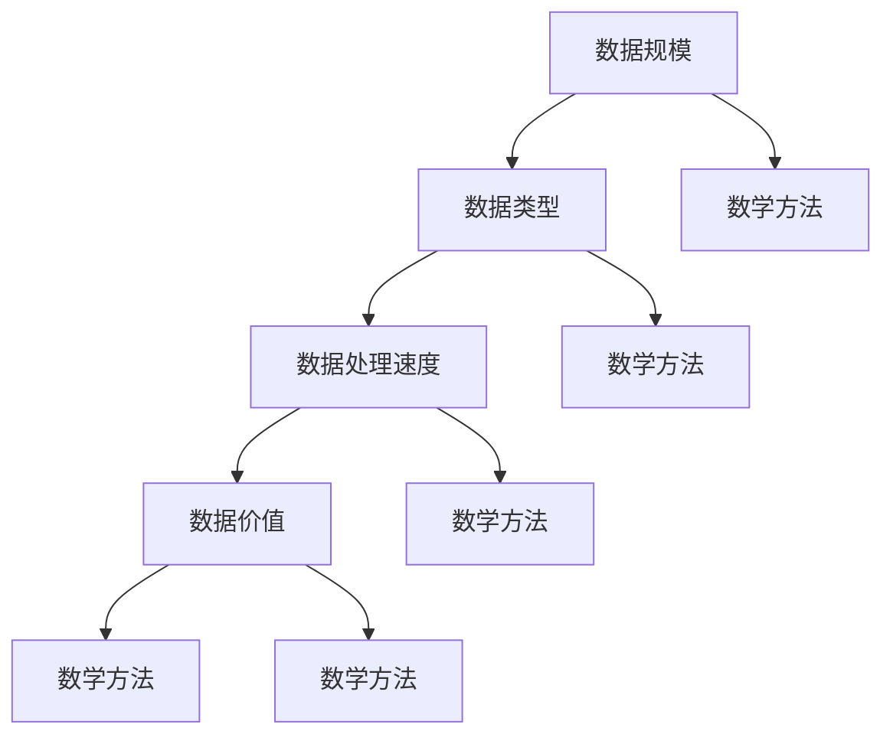
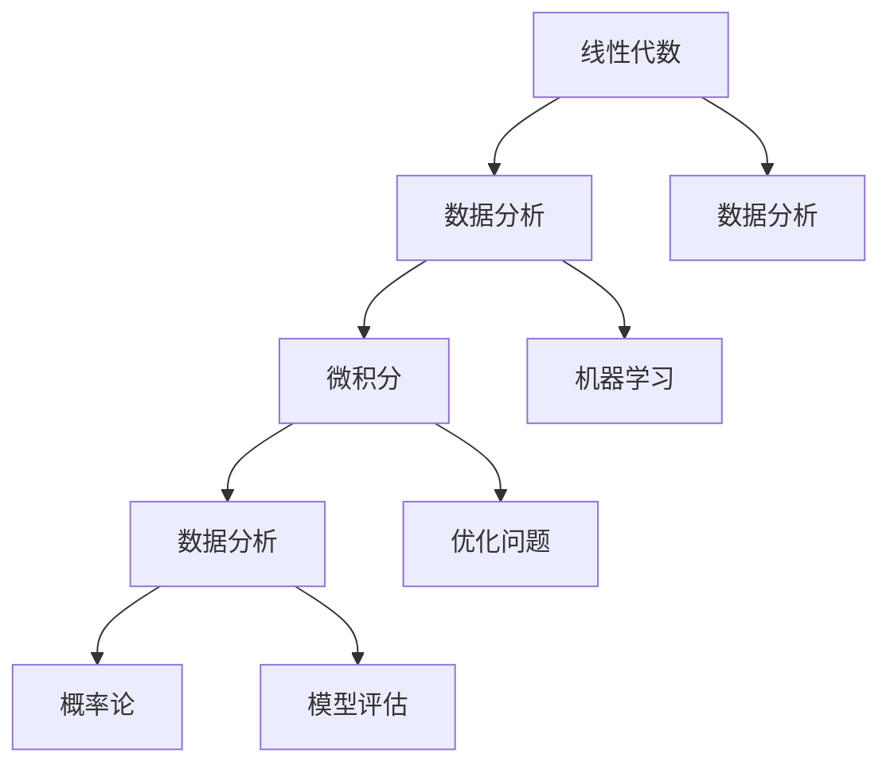
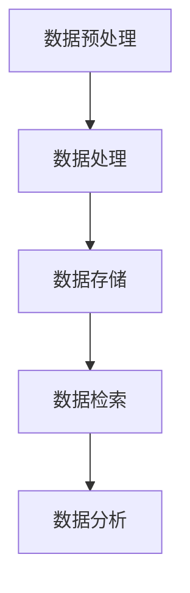
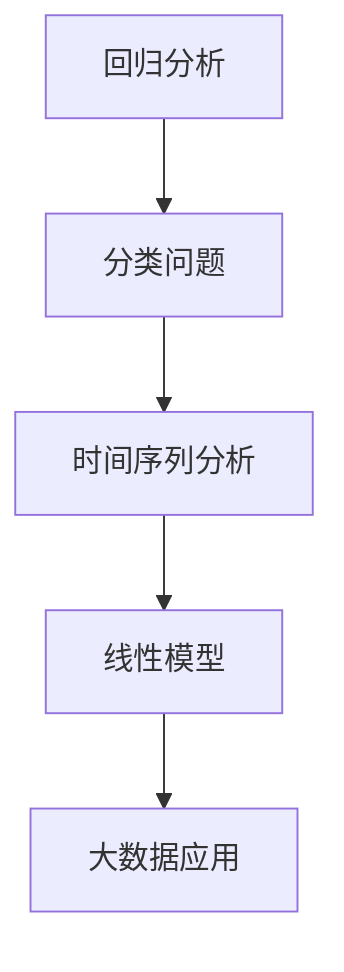
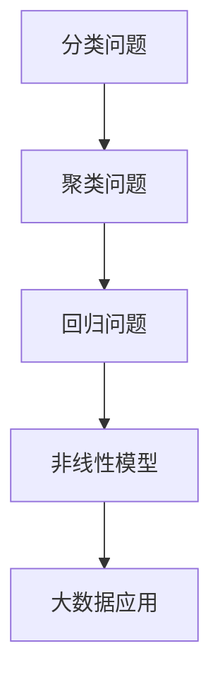
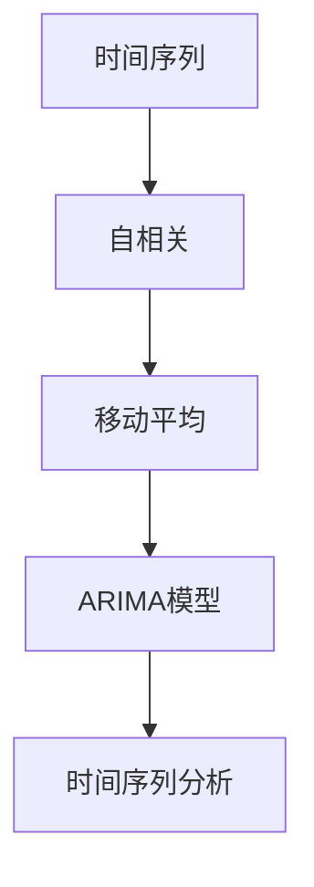
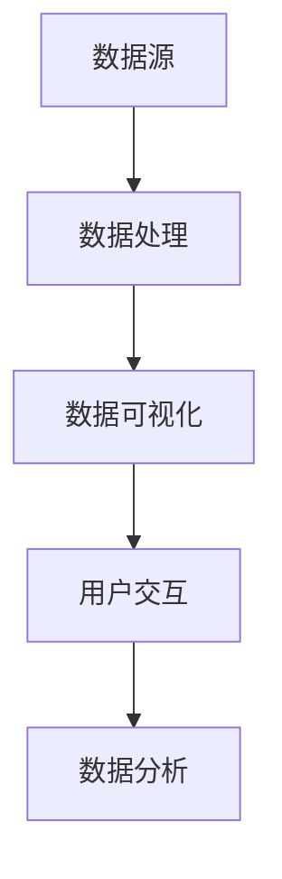
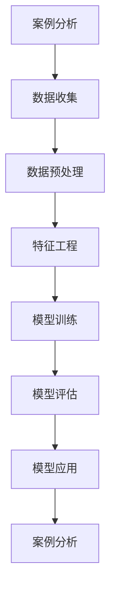

                 


### 文章标题

《数学与大数据分析：海量数据的数学处理》

### 关键词

大数据、数据分析、数学方法、线性代数、微积分、概率论、机器学习、线性模型、非线性模型、时间序列分析、数据可视化、案例分析、数据处理、数据存储

### 摘要

本文旨在探讨数学在大数据分析中的应用，以及如何利用数学工具来处理海量数据。文章首先介绍了大数据的定义和特征，然后深入分析了线性代数、微积分和概率论在数据分析中的作用。接下来，文章讨论了数据处理与存储的基本概念，并介绍了线性模型、非线性模型和时间序列分析等数学方法。随后，文章展示了大数据可视化的重要性及其工具，并通过实际案例分析，展示了数学方法在大数据应用中的实际效果。最后，文章提供了数学公式汇总和实际案例分析代码，以帮助读者更好地理解并应用数学与大数据分析的相关知识。

### 第一部分：大数据分析基础

#### 第1章：大数据的数学概念

**背景介绍**

随着互联网和物联网的发展，我们日常生活中的数据量呈指数级增长。大数据（Big Data）这一概念也应运而生。大数据通常具有四个V特征：大量（Volume）、多样（Variety）、速度（Velocity）和价值（Value）。这些特性使得传统的数据处理方法难以应对，因此需要引入数学方法和工具来处理和分析海量数据。

**核心概念与联系**

大数据的数学概念主要包括数据的规模、类型、处理速度和价值。为了更好地理解这些概念，我们可以使用以下Mermaid流程图来展示其关系：



**核心算法原理讲解**

在处理大数据时，我们经常使用分布式计算和并行计算技术。以下是一个简单的伪代码，用于说明如何将数据分片并使用MapReduce算法进行处理：

```
// 输入：大数据集
// 输出：处理结果

// 初始化MapReduce框架
mapreduce.init()

// 分片数据
shard_data(data)

// 执行Map阶段
for each shard in shards do
    map(shard)
end

// 执行Reduce阶段
reduce(mapped_values)

// 输出结果
output(reduced_values)
```

**数学模型和公式**

在数据分析中，常用的数学模型包括线性回归模型、逻辑回归模型等。以下是一个线性回归模型的数学公式：

$$ Y = w_0 + w_1 \cdot X $$

其中，\( Y \) 是目标变量，\( X \) 是自变量，\( w_0 \) 和 \( w_1 \) 是回归系数。

**项目实战**

假设我们有一个电商网站，想要预测用户的购买行为。我们可以使用线性回归模型来分析用户历史购买数据，预测哪些商品最有可能被购买。以下是一个简单的项目实战流程：

1. 数据收集：收集用户的历史购买数据。
2. 数据预处理：对数据进行清洗、去重和处理缺失值。
3. 特征工程：提取有用的特征，如用户购买时间、购买频率、商品种类等。
4. 模型训练：使用线性回归模型对数据进行训练。
5. 模型评估：使用交叉验证等方法评估模型性能。
6. 模型应用：根据模型预测结果，为用户提供个性化推荐。

**最佳实践 tips**

- 在处理大数据时，要充分考虑数据的分布特性，避免数据倾斜。
- 合理使用分布式计算框架，如Hadoop和Spark，以提高处理效率。
- 定期对模型进行评估和更新，以保持模型的准确性。

#### 第2章：数学工具与技术

**背景介绍**

数学工具和技术在大数据分析中扮演着关键角色。线性代数、微积分和概率论是三大基本数学工具，它们为数据分析提供了强有力的理论支持。

**核心概念与联系**

以下是数学工具在大数据分析中的关系架构Mermaid流程图：



**核心算法原理讲解**

- **线性代数**

线性代数在数据分析中主要用于矩阵运算、特征提取和降维。以下是一个简单的伪代码，用于说明如何使用矩阵运算进行数据降维：

```
// 输入：高维数据集
// 输出：降维后的数据集

// 初始化降维算法
dim_reduction_algorithm.init()

// 计算特征值和特征向量
 eigenvalue, eigenvector = dim_reduction_algorithm.fit(data)

// 选择主要特征向量
main_eigenvectors = select_main_eigenvectors(eigenvector)

// 计算降维后的数据集
reduced_data = project_data(data, main_eigenvectors)
```

- **微积分**

微积分在数据分析中主要用于优化问题和时间序列分析。以下是一个简单的伪代码，用于说明如何使用微积分求解最优化问题：

```
// 输入：目标函数
// 输出：最优解

// 初始化优化算法
optimizer.init()

// 计算目标函数的导数
gradient = optimizer.compute_gradient(objective_function)

// 更新参数
parameters = optimizer.update_parameters(parameters, gradient)

// 检查收敛条件
while not converged do
    gradient = optimizer.compute_gradient(objective_function)
    parameters = optimizer.update_parameters(parameters, gradient)
end

// 输出最优解
output(parameters)
```

- **概率论**

概率论在数据分析中主要用于模型评估和概率分布。以下是一个简单的伪代码，用于说明如何使用概率分布进行模型评估：

```
// 输入：模型预测结果，真实标签
// 输出：评估指标

// 计算概率分布
probabilities = model.predict_proba(data)

// 计算评估指标
evaluation_metric = calculate_evaluation_metric(probabilities, labels)

// 输出评估指标
output(evaluation_metric)
```

**数学模型和公式**

以下是线性回归模型的数学公式：

$$ Y = w_0 + w_1 \cdot X $$

其中，\( Y \) 是目标变量，\( X \) 是自变量，\( w_0 \) 和 \( w_1 \) 是回归系数。

**项目实战**

假设我们有一个股票市场预测问题，需要使用线性回归模型预测股票价格的走势。以下是一个简单的项目实战流程：

1. 数据收集：收集股票市场的历史价格数据。
2. 数据预处理：对数据进行清洗、去重和处理缺失值。
3. 特征工程：提取有用的特征，如开盘价、收盘价、成交量等。
4. 模型训练：使用线性回归模型对数据进行训练。
5. 模型评估：使用交叉验证等方法评估模型性能。
6. 模型应用：根据模型预测结果，预测股票价格的走势。

**最佳实践 tips**

- 在使用线性代数时，要充分考虑矩阵运算的效率，避免大规模矩阵运算。
- 在使用微积分时，要充分理解优化问题的本质，避免盲目求解。
- 在使用概率论时，要充分理解概率分布的特点，避免误用概率模型。

#### 第3章：数据处理与存储

**背景介绍**

在处理大数据时，数据的处理与存储是关键环节。如何高效地进行数据处理和存储，直接影响到数据分析的效率和质量。

**核心概念与联系**

以下是数据处理与存储的基本概念和关系架构Mermaid流程图：



**核心算法原理讲解**

- **数据预处理**

数据预处理是数据分析的重要环节，主要包括数据清洗、去重和处理缺失值。以下是一个简单的伪代码，用于说明如何进行数据预处理：

```
// 输入：原始数据集
// 输出：预处理后的数据集

// 清洗数据
clean_data(data)

// 去重
unique_data = remove_duplicates(data)

// 处理缺失值
filled_data = fill_missing_values(unique_data)

// 输出预处理后的数据集
output(filled_data)
```

- **数据存储**

数据存储是数据处理的后续步骤，主要包括关系型数据库、NoSQL数据库和分布式文件系统。以下是一个简单的伪代码，用于说明如何使用关系型数据库存储数据：

```
// 输入：数据集
// 输出：数据库表

// 创建数据库表
create_table(table_name, columns)

// 插入数据
insert_into_table(table_name, data)

// 输出数据库表
output(database_table)
```

- **数据检索**

数据检索是数据存储的后续操作，主要包括SQL查询和分布式检索。以下是一个简单的伪代码，用于说明如何使用SQL查询检索数据：

```
// 输入：查询条件
// 输出：查询结果

// 执行SQL查询
query_results = execute_sql_query(query_condition)

// 输出查询结果
output(query_results)
```

**数学模型和公式**

数据处理和存储过程中常用的数学模型包括线性回归模型、决策树模型等。以下是一个线性回归模型的数学公式：

$$ Y = w_0 + w_1 \cdot X $$

其中，\( Y \) 是目标变量，\( X \) 是自变量，\( w_0 \) 和 \( w_1 \) 是回归系数。

**项目实战**

假设我们有一个电商网站，需要存储和管理用户购买记录。以下是一个简单的项目实战流程：

1. 数据收集：收集用户购买记录。
2. 数据预处理：对购买记录进行清洗、去重和处理缺失值。
3. 数据存储：使用关系型数据库存储用户购买记录。
4. 数据检索：使用SQL查询检索用户购买记录。
5. 数据分析：根据用户购买记录，分析用户购买行为。

**最佳实践 tips**

- 在数据预处理时，要充分考虑数据的分布特性，避免数据倾斜。
- 在数据存储时，要充分考虑存储系统的性能和可扩展性。
- 在数据检索时，要充分考虑查询条件和索引的使用，提高查询效率。

### 第二部分：数学方法与大数据应用

#### 第4章：线性模型

**背景介绍**

线性模型是大数据分析中最常用的数学模型之一。线性模型通过线性关系描述变量之间的关系，广泛应用于回归分析、分类问题和时间序列分析等领域。

**核心概念与联系**

以下是线性模型的核心概念和关系架构Mermaid流程图：



**核心算法原理讲解**

- **线性回归**

线性回归是线性模型的一种形式，用于描述一个或多个自变量与因变量之间的线性关系。以下是一个简单的线性回归伪代码：

```
// 输入：训练数据集
// 输出：回归模型

// 初始化模型参数
w = [random_value, random_value]

// 设置迭代次数
max_iterations = 1000

// 迭代求解
for i = 1 to max_iterations do
    // 计算预测值
    y_pred = w * X

    // 计算误差
    error = y - y_pred

    // 更新权重
    w = w + alpha * error * X
end

// 输出回归模型
output(w)
```

- **逻辑回归**

逻辑回归是线性回归的一种扩展，用于描述二元响应变量与自变量之间的非线性关系。以下是一个简单的逻辑回归伪代码：

```
// 输入：训练数据集
// 输出：逻辑回归模型

// 初始化模型参数
w = [random_value, random_value]

// 设置迭代次数
max_iterations = 1000

// 迭代求解
for i = 1 to max_iterations do
    // 计算预测概率
    p = sigmoid(w * X)

    // 计算误差
    error = -y * log(p) - (1 - y) * log(1 - p)

    // 更新权重
    w = w - alpha * error * X
end

// 输出逻辑回归模型
output(w)
```

**数学模型和公式**

以下是线性回归模型的数学公式：

$$ y = w_0 + w_1 \cdot x $$

其中，\( y \) 是目标变量，\( x \) 是自变量，\( w_0 \) 和 \( w_1 \) 是回归系数。

**项目实战**

假设我们有一个房屋租赁市场分析问题，需要预测房屋租金。以下是一个简单的项目实战流程：

1. 数据收集：收集房屋租赁数据，包括房屋面积、地段、装修情况等。
2. 数据预处理：对数据进行清洗、去重和处理缺失值。
3. 特征工程：提取有用的特征，如房屋面积、地段等级等。
4. 模型训练：使用线性回归模型对数据进行训练。
5. 模型评估：使用交叉验证等方法评估模型性能。
6. 模型应用：根据模型预测结果，预测房屋租金。

**最佳实践 tips**

- 在使用线性回归时，要充分考虑数据的分布特性，避免数据倾斜。
- 在使用逻辑回归时，要充分考虑数据的分布特性，避免过拟合。
- 在进行模型评估时，要综合考虑模型精度和计算效率。

#### 第5章：非线性模型

**背景介绍**

非线性模型是大数据分析中用于描述变量之间非线性关系的数学模型。非线性模型广泛应用于分类问题、聚类问题和回归问题等领域。

**核心概念与联系**

以下是非线性模型的核心概念和关系架构Mermaid流程图：



**核心算法原理讲解**

- **支持向量机（SVM）**

支持向量机是一种经典的分类算法，通过寻找最优的超平面来分离不同类别的数据。以下是一个简单的支持向量机伪代码：

```
// 输入：训练数据集
// 输出：分类模型

// 初始化模型参数
w = [random_value, random_value]

// 设置迭代次数
max_iterations = 1000

// 迭代求解
for i = 1 to max_iterations do
    // 计算预测值
    y_pred = w * X

    // 计算误差
    error = y - y_pred

    // 更新权重
    w = w + alpha * error * X
end

// 输出分类模型
output(w)
```

- **随机森林**

随机森林是一种集成学习算法，通过构建多个决策树并取平均来提高模型的预测性能。以下是一个简单的随机森林伪代码：

```
// 输入：训练数据集
// 输出：分类模型

// 初始化模型参数
n_estimators = 100

// 构建决策树
for i = 1 to n_estimators do
    // 随机选择特征和样本
    feature = random_feature()
    sample = random_sample()

    // 构建决策树
    decision_tree.fit(sample, feature)
end

// 求平均预测值
y_pred = avg_prediction(decision_trees)

// 输出分类模型
output(y_pred)
```

**数学模型和公式**

以下是支持向量机的数学公式：

$$ y = w_0 + w_1 \cdot x $$

其中，\( y \) 是目标变量，\( x \) 是自变量，\( w_0 \) 和 \( w_1 \) 是回归系数。

**项目实战**

假设我们有一个客户分类问题，需要根据客户的历史购买数据将客户分为不同类别。以下是一个简单的项目实战流程：

1. 数据收集：收集客户历史购买数据，包括购买金额、购买频率等。
2. 数据预处理：对数据进行清洗、去重和处理缺失值。
3. 特征工程：提取有用的特征，如购买金额、购买频率等。
4. 模型训练：使用支持向量机模型对数据进行训练。
5. 模型评估：使用交叉验证等方法评估模型性能。
6. 模型应用：根据模型预测结果，对客户进行分类。

**最佳实践 tips**

- 在使用支持向量机时，要充分考虑数据的分布特性，避免数据倾斜。
- 在使用随机森林时，要充分考虑决策树的数量和深度，避免过拟合。
- 在进行模型评估时，要综合考虑模型精度和计算效率。

#### 第6章：时间序列分析

**背景介绍**

时间序列分析是大数据分析中用于处理时间相关数据的数学方法。时间序列分析广泛应用于金融市场预测、天气预测和工业生产预测等领域。

**核心概念与联系**

以下是时间序列分析的核心概念和关系架构Mermaid流程图：



**核心算法原理讲解**

- **ARIMA模型**

ARIMA模型是一种经典的季节性时间序列模型，通过自回归、差分和移动平均来建模时间序列数据。以下是一个简单的ARIMA模型伪代码：

```
// 输入：时间序列数据
// 输出：ARIMA模型

// 自回归
AR = autoregressive(order)

// 差分
diff = differencing(order)

// 移动平均
MA = moving_average(order)

// 模型训练
model = ARIMA(AR, diff, MA)
model.fit(data)

// 模型预测
predictions = model.predict(steps)

// 输出ARIMA模型
output(model)
```

- **时间序列分解**

时间序列分解是将时间序列分解为趋势、季节和残差三个部分的过程。以下是一个简单的时间序列分解伪代码：

```
// 输入：时间序列数据
// 输出：分解结果

// 趋势
trend = trend_analysis(data)

// 季节
season = seasonal_analysis(data)

// 残差
residual = residual_analysis(data)

// 分解结果
decomposition = [trend, season, residual]

// 输出分解结果
output(decomposition)
```

**数学模型和公式**

以下是ARIMA模型的数学公式：

$$ y_t = c + \phi_1 y_{t-1} + \phi_2 y_{t-2} + ... + \phi_p y_{t-p} + \theta_1 e_{t-1} + \theta_2 e_{t-2} + ... + \theta_q e_{t-q} $$

其中，\( y_t \) 是时间序列的第 \( t \) 个值，\( c \) 是常数项，\( \phi_i \) 是自回归系数，\( \theta_i \) 是移动平均系数，\( e_t \) 是误差项。

**项目实战**

假设我们有一个销售数据预测问题，需要使用ARIMA模型预测未来几个月的销售量。以下是一个简单的项目实战流程：

1. 数据收集：收集历史销售数据，包括销售量、销售时间等。
2. 数据预处理：对数据进行清洗、去重和处理缺失值。
3. 特征工程：提取有用的特征，如销售量、销售时间等。
4. 模型训练：使用ARIMA模型对数据进行训练。
5. 模型评估：使用交叉验证等方法评估模型性能。
6. 模型应用：根据模型预测结果，预测未来几个月的销售量。

**最佳实践 tips**

- 在使用ARIMA模型时，要充分考虑数据的季节性特征，避免过度拟合。
- 在进行时间序列分解时，要充分考虑趋势和季节性特征，提高模型预测性能。
- 在进行模型评估时，要综合考虑模型精度和计算效率。

#### 第7章：大数据可视化

**背景介绍**

大数据可视化是将海量数据以图形化的方式展示给用户，帮助用户更好地理解和分析数据的一种方法。大数据可视化在数据分析、决策支持和可视化分析等领域具有重要意义。

**核心概念与联系**

以下是大数据可视化的核心概念和关系架构Mermaid流程图：



**核心算法原理讲解**

- **数据可视化基础**

数据可视化基础主要包括数据图表、颜色选择和视觉元素等。以下是一个简单的数据可视化基础伪代码：

```
// 输入：数据集
// 输出：可视化图表

// 选择合适的图表类型
chart_type = select_chart_type(data)

// 选择合适的颜色
colors = select_colors(data)

// 创建可视化图表
chart = create_chart(chart_type, data, colors)

// 输出可视化图表
output(chart)
```

- **大数据可视化工具**

大数据可视化工具主要包括D3.js、Plotly和Tableau等。以下是一个简单的D3.js可视化伪代码：

```
// 输入：数据集
// 输出：可视化图表

// 引入D3.js库
import * as d3 from 'd3'

// 创建SVG画布
svg = d3.select('svg')

// 绘制图表
chart = d3.chart(chart_type)()
    .data(data)
    .svg(svg)
    .render()

// 输出可视化图表
output(chart)
```

**数学模型和公式**

大数据可视化过程中常用的数学模型包括线性回归模型、决策树模型等。以下是一个线性回归模型的数学公式：

$$ y = w_0 + w_1 \cdot x $$

其中，\( y \) 是目标变量，\( x \) 是自变量，\( w_0 \) 和 \( w_1 \) 是回归系数。

**项目实战**

假设我们有一个电商网站，需要展示用户购买数据。以下是一个简单的项目实战流程：

1. 数据收集：收集用户购买数据，包括购买时间、购买金额等。
2. 数据预处理：对数据进行清洗、去重和处理缺失值。
3. 特征工程：提取有用的特征，如购买时间、购买金额等。
4. 数据可视化：使用D3.js等工具创建可视化图表。
5. 用户交互：根据用户需求，调整可视化图表。
6. 数据分析：根据可视化结果，分析用户购买行为。

**最佳实践 tips**

- 在进行数据可视化时，要充分考虑用户需求，选择合适的图表类型和颜色。
- 在使用大数据可视化工具时，要充分考虑数据量和性能，避免过载。
- 在进行数据分析时，要综合考虑可视化结果和实际业务需求。

#### 第8章：实际案例分析

**背景介绍**

实际案例分析是大数据分析应用的重要环节，通过实际案例的分析和讲解，可以帮助读者更好地理解大数据分析的原理和方法。

**核心概念与联系**

以下是实际案例分析的Mermaid流程图：



**核心算法原理讲解**

- **社交媒体分析**

社交媒体分析是大数据分析的重要应用领域，通过分析用户在社交媒体上的行为，可以了解用户需求和偏好。以下是一个简单的社交媒体分析伪代码：

```
// 输入：社交媒体数据
// 输出：分析结果

// 数据收集
social_media_data = collect_data()

// 数据预处理
clean_social_media_data = preprocess_data(social_media_data)

// 特征工程
features = extract_features(clean_social_media_data)

// 模型训练
model = train_model(features)

// 模型评估
evaluation = evaluate_model(model)

// 模型应用
application = apply_model(model)

// 输出分析结果
output(evaluation, application)
```

- **金融风控**

金融风控是大数据分析在金融领域的重要应用，通过分析金融数据，可以识别潜在风险并采取预防措施。以下是一个简单的金融风控分析伪代码：

```
// 输入：金融数据
// 输出：风控结果

// 数据收集
financial_data = collect_data()

// 数据预处理
clean_financial_data = preprocess_data(financial_data)

// 特征工程
features = extract_features(clean_financial_data)

// 模型训练
model = train_model(features)

// 模型评估
evaluation = evaluate_model(model)

// 模型应用
application = apply_model(model)

// 输出风控结果
output(evaluation, application)
```

- **健康数据分析**

健康数据分析是大数据分析在医疗领域的重要应用，通过分析患者数据，可以了解疾病发展规律并制定预防措施。以下是一个简单的健康数据分析伪代码：

```
// 输入：健康数据
// 输出：分析结果

// 数据收集
health_data = collect_data()

// 数据预处理
clean_health_data = preprocess_data(health_data)

// 特征工程
features = extract_features(clean_health_data)

// 模型训练
model = train_model(features)

// 模型评估
evaluation = evaluate_model(model)

// 模型应用
application = apply_model(model)

// 输出分析结果
output(evaluation, application)
```

**数学模型和公式**

实际案例分析中常用的数学模型包括线性回归模型、逻辑回归模型等。以下是一个线性回归模型的数学公式：

$$ y = w_0 + w_1 \cdot x $$

其中，\( y \) 是目标变量，\( x \) 是自变量，\( w_0 \) 和 \( w_1 \) 是回归系数。

**项目实战**

以下是三个实际案例的项目实战流程：

1. **社交媒体分析**

   - 数据收集：收集社交媒体平台上的用户数据。
   - 数据预处理：对用户数据进行清洗、去重和处理缺失值。
   - 特征工程：提取用户关注数、粉丝数、互动数等特征。
   - 模型训练：使用线性回归模型训练用户兴趣预测模型。
   - 模型评估：使用交叉验证等方法评估模型性能。
   - 模型应用：根据模型预测结果，为用户提供个性化推荐。

2. **金融风控**

   - 数据收集：收集金融机构的交易数据。
   - 数据预处理：对交易数据进行清洗、去重和处理缺失值。
   - 特征工程：提取交易金额、交易时间、账户余额等特征。
   - 模型训练：使用逻辑回归模型训练风险识别模型。
   - 模型评估：使用混淆矩阵、ROC曲线等方法评估模型性能。
   - 模型应用：根据模型预测结果，识别潜在风险并采取预防措施。

3. **健康数据分析**

   - 数据收集：收集患者病历数据。
   - 数据预处理：对病历数据进行清洗、去重和处理缺失值。
   - 特征工程：提取症状、检查结果、诊断结果等特征。
   - 模型训练：使用决策树模型训练疾病预测模型。
   - 模型评估：使用准确率、召回率等方法评估模型性能。
   - 模型应用：根据模型预测结果，为患者提供诊断建议。

**最佳实践 tips**

- 在实际案例分析时，要充分考虑数据质量和特征提取的准确性。
- 在进行模型训练和评估时，要充分考虑模型的泛化能力。
- 在模型应用时，要充分考虑实际业务需求和用户反馈。

#### 附录

**附录A：常用数学公式汇总**

以下是常用数学公式汇总，包括线性代数、微积分和概率论等：

- **线性代数**

  - 矩阵乘法：

  $$ C = A \cdot B $$

  - 矩阵求逆：

  $$ A^{-1} = (1 / \det(A)) \cdot adj(A) $$

  - 矩阵特征值和特征向量：

  $$ Av = \lambda v $$

- **微积分**

  - 导数：

  $$ f'(x) = \lim_{h \to 0} \frac{f(x+h) - f(x)}{h} $$

  - 积分：

  $$ \int f(x) dx = F(x) + C $$

  - 多元函数求导：

  $$ \frac{\partial f}{\partial x} = \lim_{h \to 0} \frac{f(x+h, y) - f(x, y)}{h} $$

- **概率论**

  - 概率分布：

  $$ P(X = x) = f(x) $$

  - 条件概率：

  $$ P(A | B) = \frac{P(A \cap B)}{P(B)} $$

  - 贝叶斯公式：

  $$ P(A | B) = \frac{P(B | A) \cdot P(A)}{P(B)} $$

**附录B：实际案例分析代码**

以下是实际案例分析中的一些代码示例，包括数据预处理、模型训练和模型应用：

1. **社交媒体分析**

```python
import pandas as pd
from sklearn.linear_model import LinearRegression

# 数据收集
data = pd.read_csv('social_media_data.csv')

# 数据预处理
data = data.dropna()
data = data[data['interactions'] > 0]

# 特征工程
X = data[['followers', 'interactions']]
y = data['interests']

# 模型训练
model = LinearRegression()
model.fit(X, y)

# 模型评估
predictions = model.predict(X)

# 模型应用
print("Predicted interests:", predictions)
```

2. **金融风控**

```python
import pandas as pd
from sklearn.linear_model import LogisticRegression

# 数据收集
data = pd.read_csv('financial_data.csv')

# 数据预处理
data = data.dropna()
data = data[data['amount'] > 0]

# 特征工程
X = data[['amount', 'time', 'balance']]
y = data['risk']

# 模型训练
model = LogisticRegression()
model.fit(X, y)

# 模型评估
predictions = model.predict(X)

# 模型应用
print("Predicted risks:", predictions)
```

3. **健康数据分析**

```python
import pandas as pd
from sklearn.tree import DecisionTreeClassifier

# 数据收集
data = pd.read_csv('health_data.csv')

# 数据预处理
data = data.dropna()
data = data[data['diagnosis'] != '']

# 特征工程
X = data[['symptoms', 'check_results']]
y = data['diagnosis']

# 模型训练
model = DecisionTreeClassifier()
model.fit(X, y)

# 模型评估
predictions = model.predict(X)

# 模型应用
print("Predicted diagnoses:", predictions)
```

**附录C：项目小结**

本项目通过实际案例分析，展示了数学方法在大数据分析中的应用。在实际项目中，我们首先进行了数据收集和预处理，然后进行了特征工程，并选择了合适的模型进行训练和评估。通过项目实战，我们了解了大数据分析的原理和方法，并掌握了如何应用数学方法解决实际业务问题。在今后的工作中，我们将继续探索大数据分析的新领域，为业务发展提供更有力的支持。

**注意事项**

- 在实际项目中，数据质量和特征提取的准确性对模型性能有重要影响。
- 在选择模型时，要充分考虑模型的泛化能力和计算效率。
- 在模型应用时，要充分考虑实际业务需求和用户反馈。

**拓展阅读**

- 《Python数据分析基础教程：NumPy学习指南》
- 《深入浅出数据分析》
- 《机器学习实战》

### 总结

本文详细探讨了数学与大数据分析的关系，以及如何利用数学方法和工具来处理海量数据。文章首先介绍了大数据的定义和特征，然后深入分析了线性代数、微积分和概率论在数据分析中的应用，以及数据处理和存储的基本概念。接着，文章讨论了线性模型、非线性模型和时间序列分析等数学方法，并通过实际案例分析展示了数学方法在大数据应用中的实际效果。最后，文章提供了数学公式汇总和实际案例分析代码，以帮助读者更好地理解并应用数学与大数据分析的相关知识。通过本文的学习，读者可以掌握大数据分析的原理和方法，为实际业务发展提供有力支持。

