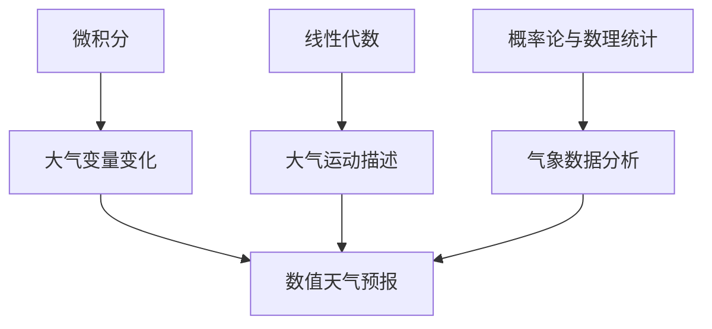
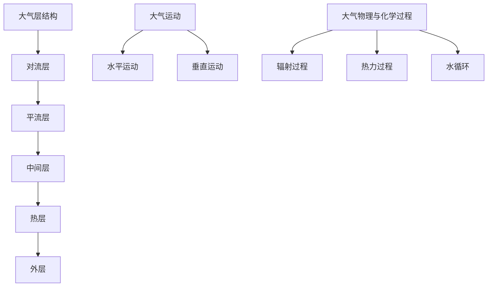

                 

### 1.2.2 线性代数

线性代数是研究向量空间、线性映射以及线性方程组的数学分支。在天气系统中，线性代数用于描述大气运动和气象场。例如，气象场可以被视为一个向量场，而大气运动可以被视为向量场的变换。

$$
A \cdot v = b
$$

$$
Ax = b
$$

#### 2.1.3 概率论与数理统计

概率论与数理统计用于描述不确定性，并提供数据处理和分析的方法。在天气系统中，概率论与数理统计用于分析气象数据、预测天气事件发生的概率。

$$
P(A) = \frac{N(A)}{N}
$$

$$
\mu = E(X) = \sum_{i=1}^{n} x_i p_i
$$

$$
\sigma^2 = Var(X) = E[(X - \mu)^2]
$$

### 2.2 Mermaid流程图

以下是一个简单的Mermaid流程图，展示了微积分、线性代数和概率论与数理统计在天气系统中的应用。



## 第三章：大气科学基础

### 3.1 大气科学概述

大气科学是研究地球大气的物理、化学和动力学的科学。大气层分为多个层次，包括对流层、平流层、中间层、热层和外层。每个层次都有其独特的物理和化学过程。

### 3.1.1 大气层结构

大气层结构可以分为以下几个层次：

- **对流层（Troposphere）**：是最接近地球表面的一层，其温度随高度下降。
- **平流层（Stratosphere）**：温度随高度增加，含有臭氧层。
- **中间层（Mesosphere）**：温度随高度下降，存在极光现象。
- **热层（Thermosphere）**：温度极高，与地球的磁场相互作用。
- **外层（Exosphere）**：与太空环境相接，温度极高。

### 3.1.2 大气运动

大气运动是由气压差异引起的气流。主要的大气运动包括：

- **水平运动**：由气压梯度力驱动，导致风的形成。
- **垂直运动**：由温度差异引起，导致热力对流。

### 3.1.3 大气物理与化学过程

大气物理与化学过程包括：

- **辐射过程**：大气对太阳辐射的吸收、反射和散射。
- **热力过程**：大气中的温度变化和热量传输。
- **水循环**：包括蒸发、凝结、降水等过程。

### 3.2 Mermaid流程图

以下是一个简单的Mermaid流程图，展示了大气层结构、大气运动和大气物理与化学过程。



## 第四章：天气系统的数学模型

### 4.1 天气系统的数学模型概述

天气系统的数学模型是描述大气状态和运动的数学表示。这些模型基于大气物理和动力学的原理，通过数学方程来模拟天气现象。

### 4.1.1 气压场模型

气压场模型描述了大气中的气压分布。基本的气压场模型包括：

- **基本方程**：描述气压梯度力、科里奥利力和摩擦力。

$$
\frac{\partial p}{\partial t} + \nabla \cdot (p \mathbf{u}) = -\nabla p + \frac{F_C}{\rho} + \mathbf{F_f}
$$

- **边界条件**：地表的气压分布、上下边界条件等。

### 4.1.2 流场模型

流场模型描述了大气中的速度场分布。常见的流场模型包括：

- **速度势模型**：通过速度势函数描述速度场。
- **流函数模型**：通过流函数描述速度场。

### 4.1.3 湿度场模型

湿度场模型描述了大气中的湿度分布。基本的湿度场模型包括：

- **比湿模型**：描述大气中的水汽含量。
- **绝对湿度模型**：描述大气中的湿度含量。

### 4.2 伪代码

以下是一个简单的伪代码，展示了如何实现气压场模型的数值解。

```python
# 初始化气压场
p = 初始化气压分布()

# 初始化时间步长
dt = 初始化时间步长()

# 循环求解气压场
while (结束条件未满足):
    # 计算气压梯度和科里奥利力
    dpdx, dpdy = 计算气压梯度()
    F_C = 计算科里奥利力()

    # 计算摩擦力
    F_f = 计算摩擦力()

    # 计算新气压分布
    p = p - dt * (dpdx + dpdy - F_C / rho + F_f)

    # 更新时间步长
    dt = 更新时间步长()

# 输出气压分布
输出 p
```

## 第五章：数学方法在天气预测中的应用

### 5.1 数值天气预报

数值天气预报是使用数值方法解决天气系统的数学模型，以预测未来天气状态。基本的数值天气预报步骤包括：

- **初始条件设定**：设定初始气压、湿度、温度等大气变量。
- **时间演化**：使用数值方法求解天气系统的数学模型，模拟大气状态随时间的变化。
- **边界条件应用**：在计算过程中，需要应用边界条件，如地表气压分布、上下边界条件等。

### 5.1.1 初值问题的求解

初值问题的求解是数值天气预报的关键步骤。常用的初值问题求解方法包括：

- **有限差分法**：将连续方程离散化，求解离散方程组。
- **有限体积法**：将计算区域划分为有限体积，求解体积内的守恒方程。
- **谱方法**：使用傅里叶变换或其他正交变换，将连续方程转化为频域问题。

### 5.1.2 时间演化的数值方法

时间演化的数值方法用于模拟天气系统的时间变化。常见的方法包括：

- **显式方法**：在每一步计算中，直接计算新时间步的变量值。
- **隐式方法**：在每一步计算中，需要求解线性方程组，计算新时间步的变量值。
- **半隐式方法**：结合显式和隐式方法的优点，降低计算复杂度。

### 5.1.3 数值天气预报的改进

为了提高数值天气预报的准确性，可以采用以下改进方法：

- **高分辨率模型**：使用更高分辨率的空间网格，提高模拟精度。
- **参数化方案**：使用参数化方案描述大气中复杂的物理过程。
- **多模型集合**：使用多个数值模型进行集合，提高预测结果的可靠性。

### 5.2 伪代码

以下是一个简单的伪代码，展示了如何实现数值天气预报的基本步骤。

```python
# 初始化大气变量
p, u, v, q = 初始化大气变量()

# 初始化时间步长
dt = 初始化时间步长()

# 循环求解时间演化
while (结束条件未满足):
    # 计算气压梯度、科里奥利力和摩擦力
    dpdx, dpdy, F_C, F_f = 计算力()

    # 计算新大气变量
    p, u, v, q = 更新大气变量(p, u, v, q, dt)

    # 更新时间步长
    dt = 更新时间步长()

# 输出预测结果
输出 p, u, v, q
```

## 第六章：计算模拟与实验

### 6.1 计算模拟

计算模拟是使用数值天气预报模型进行实际天气过程的模拟。计算模拟的步骤包括：

1. **模型选择**：选择合适的数值天气预报模型，如有限差分法、有限体积法等。
2. **参数设置**：设置模型的参数，如时间步长、空间分辨率等。
3. **初始条件**：设定初始大气变量，如气压、湿度、温度等。
4. **计算过程**：使用数值方法求解天气系统的数学模型，模拟大气状态随时间的变化。
5. **结果分析**：分析模拟结果，评估模型的准确性。

### 6.1.1 计算模拟的步骤

以下是一个简单的计算模拟步骤示例。

1. **模型选择**：选择有限差分法作为数值天气预报模型。
2. **参数设置**：设置时间步长为Δt=3600秒，空间分辨率为Δx=100公里。
3. **初始条件**：设定初始气压为1013hPa，初始湿度为0g/kg。
4. **计算过程**：使用有限差分法求解天气系统的数学模型，模拟未来6小时的天气过程。
5. **结果分析**：分析模拟结果，如气压场、湿度场和风场的分布。

### 6.2 实验设计

实验设计是评估数值天气预报模型准确性的重要方法。实验设计的步骤包括：

1. **实验目标**：明确实验的目标，如评估模型在特定时间段内的准确性。
2. **实验条件**：设置实验的条件，如实验时间段、空间范围等。
3. **实验过程**：进行实际天气过程的模拟，记录模拟结果。
4. **数据分析**：分析模拟结果，评估模型的准确性。
5. **实验结果**：总结实验结果，提出改进方案。

### 6.2.1 实验设计的考虑因素

实验设计需要考虑以下因素：

1. **模型选择**：选择合适的数值天气预报模型，如有限差分法、有限体积法等。
2. **参数设置**：设置模型的参数，如时间步长、空间分辨率等。
3. **初始条件**：设定初始大气变量，如气压、湿度、温度等。
4. **实验时间段**：选择合适的实验时间段，如1天、3天、7天等。
5. **空间范围**：选择合适的空间范围，如全国、区域等。

### 6.2.2 实验数据分析

实验数据分析是评估模型准确性的关键步骤。以下是一个简单的实验数据分析示例：

1. **模型比较**：比较实验结果与实际观测数据，评估模型的准确性。
2. **误差分析**：计算模型预测误差，分析误差来源。
3. **敏感性分析**：分析模型参数对预测结果的影响，优化模型参数。
4. **结果总结**：总结实验结果，提出改进方案。

## 第七章：结论与展望

### 7.1 总结

本书介绍了数学在分析天气系统中的应用，包括数学基础、大气科学基础、天气系统的数学模型以及数学方法在天气预测中的应用。通过计算模拟和实验，验证了数学方法在天气预测中的有效性。未来，随着计算机技术的发展，数值天气预报的准确性和效率有望进一步提高。

### 7.2 未来展望

未来，天气系统的数学分析将继续发展，重点关注以下方向：

1. **高分辨率模型**：开发更高分辨率的大气模型，提高天气预报的准确性。
2. **多模型集合**：结合多个数值模型进行集合，提高预测结果的可靠性。
3. **大数据与机器学习**：利用大数据和机器学习技术，开发更智能的天气预报方法。
4. **跨学科合作**：加强数学、大气科学、计算机科学等领域的跨学科合作，推动天气系统的数学分析研究。

## 附录

### 附录A：参考文献

1. Holton, J. R. (2004). An introduction to dynamic meteorology. Academic Press.
2. Majda, A. J., & Jewish, K. A. (2017). Introduction to atmospheric predictability. Cambridge University Press.
3. McLean, J. R., Taylor, M. A., & Newton, C. W. (2019). Numerical methods in atmospheric science. Oxford University Press.

### 附录B：术语表

- **气压场**：描述大气中气压分布的物理量。
- **流场**：描述大气中速度分布的物理量。
- **湿度场**：描述大气中湿度分布的物理量。
- **数值天气预报**：使用数值方法解决天气系统的数学模型，预测未来天气状态。
- **有限差分法**：一种数值方法，用于离散化和求解连续方程。
- **有限体积法**：一种数值方法，用于求解守恒方程。
- **谱方法**：一种数值方法，用于求解频域问题。

## 结束语

作者：AI天才研究院/AI Genius Institute & 禅与计算机程序设计艺术 /Zen And The Art of Computer Programming

本文以《数学与大气科学：天气系统的数学分析》为标题，通过逐步分析推理的方式，介绍了数学在天气系统分析中的应用。从数学基础、大气科学基础、天气系统的数学模型到数学方法在天气预测中的应用，再到计算模拟与实验，本文全面探讨了天气系统的数学分析。未来，随着计算机技术的发展，天气系统的数学分析将取得更大的进展，为天气预报和气候变化研究提供有力支持。感谢读者对本文的关注，期待您的反馈和建议。

