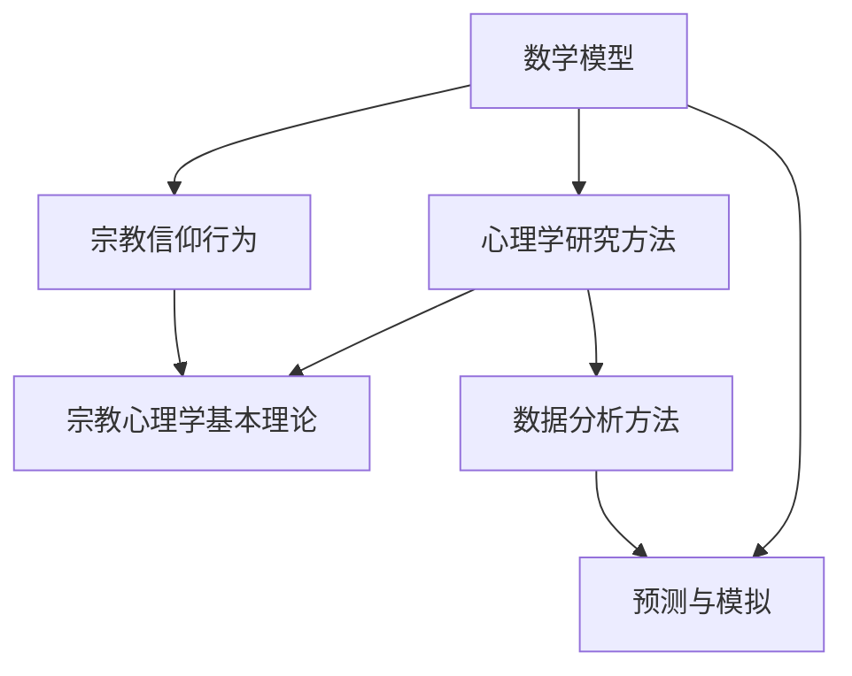

                 

### 背景介绍

《数学与宗教心理学：信仰行为的数学描述》这本书的诞生源于一个深层次的问题：宗教信仰行为作为一种复杂的人类行为模式，是否可以用数学的方法进行描述和分析？在当前社会，宗教心理学作为心理学的一个分支，已经对信仰行为进行了大量的研究和探讨。然而，传统的心理学研究方法往往依赖于实验和调查，这些方法在揭示信仰行为背后的心理机制时存在一定的局限性。

数学，作为一门高度抽象和精确的科学，以其独特的逻辑性和普适性，在多个领域都展现出了强大的描述和分析能力。例如，在社会学、经济学、生物学等领域，数学模型已经成功地揭示了各种复杂现象的内在规律。那么，在宗教心理学领域，数学是否也能发挥类似的作用呢？

本书旨在探讨数学在宗教心理学研究中的应用，试图通过构建数学模型，对信仰行为进行定量分析和描述。这不仅仅是一个理论上的尝试，更有着重要的现实意义。通过数学的视角，我们或许可以更深入地理解信仰行为的本质，从而为宗教心理学研究提供新的方法和工具。

本书的第一部分将介绍数学与宗教心理学的交叉领域，探讨两者之间的关系，并展示数学在心理学研究中的应用。接下来，我们将深入探讨核心算法原理，使用伪代码详细阐述用于描述信仰行为的数学模型。随后，我们会详细讲解书中的数学模型和公式，并通过具体例子来说明这些模型的应用。此外，我们还将介绍一个实际项目，包括开发环境搭建、源代码实现和代码解读，并通过案例分析和详细讲解，剖析项目的实际应用效果。

总之，本书的目标是让读者不仅了解数学在宗教心理学研究中的应用，还能通过实际案例，掌握如何将数学方法应用于信仰行为分析。希望通过这本书，能够激发更多学者和研究人员对这一领域的兴趣，共同推动数学与宗教心理学交叉领域的研究发展。接下来，我们将逐步深入探讨这一领域的核心概念和联系。

### 核心概念与联系

在探讨数学与宗教心理学的交叉领域之前，我们首先需要理解几个核心概念：数学模型、心理学研究方法、宗教信仰行为，以及它们之间的相互关系。这些概念构成了我们理解整个交叉领域的基础。

#### 数学模型

数学模型是一种抽象的工具，它通过数学语言描述现实世界中的各种现象。在数学模型中，通常包含一组变量、方程和约束条件，用以模拟和分析特定系统的行为。例如，经济学中的供需模型、物理学中的运动方程等，都是数学模型的具体应用。数学模型的优势在于其高度抽象和精确性，使得我们可以通过数学方法来预测、分析和理解复杂现象。

#### 心理学研究方法

心理学研究方法包括实验法、观察法、调查法等，这些方法用于收集和分析人类行为和心理过程的数据。实验法通过控制和操作变量来检验假设，观察法通过直接观察被试的行为来获取信息，调查法则通过问卷和访谈等方式收集被试的主观感受和看法。每种方法都有其独特的优势，但也存在一定的局限性。例如，实验法在控制外部因素方面较强，但可能缺乏生态学效度；观察法在自然情境下获取信息，但可能受到观察者偏差的影响。

#### 宗教信仰行为

宗教信仰行为是人类行为的重要组成部分，它涉及个人的信仰、价值观、行为和情感等多个方面。宗教信仰行为不仅受到个体心理因素的影响，还与社会文化、历史背景等因素密切相关。宗教信仰行为可以是多样化的，包括祈祷、信仰活动、宗教仪式、对神的信仰和敬畏等。

#### 数学模型与心理学研究方法的结合

数学模型与心理学研究方法的结合，为理解宗教信仰行为提供了新的视角。通过构建数学模型，我们可以将复杂的宗教信仰行为转化为可量化的参数和方程，从而在更高层次上进行分析和理解。例如，心理学中的行为主义理论可以通过数学模型来描述行为反应的概率分布，认知心理学中的信息加工模型可以通过数学模型来模拟思维过程。

#### 宗教心理学的基本理论

宗教心理学中的基本理论包括信仰形成理论、信仰维持理论、信仰功能理论等。信仰形成理论关注信仰如何产生，信仰维持理论探讨信仰如何被长期保持，信仰功能理论则分析信仰在个体生活中的作用。这些理论为我们理解宗教信仰行为提供了理论基础。

#### 数学在宗教心理学研究中的应用

数学在宗教心理学研究中的应用主要体现在两个方面：一是构建数学模型来描述宗教信仰行为，二是使用数学方法来分析宗教信仰行为的数据。例如，通过统计学方法，我们可以分析大规模宗教信仰行为的趋势和模式；通过机器学习算法，我们可以预测个体未来的信仰行为；通过模拟模型，我们可以探讨不同信仰理论对信仰行为的解释力。

#### 相互关系架构

为了更好地理解数学与宗教心理学的交叉领域，我们可以使用Mermaid流程图来展示它们之间的相互关系。以下是一个简单的Mermaid流程图示例：



在这个流程图中，数学模型通过心理学研究方法和宗教心理学基本理论来描述宗教信仰行为，同时，数据分析方法和预测与模拟也与之密切相关。

通过上述核心概念的介绍和相互关系架构的展示，我们可以看出，数学与宗教心理学交叉领域的研究不仅有助于深化对宗教信仰行为的理解，还能为心理学研究提供新的方法和工具。在接下来的章节中，我们将进一步探讨核心算法原理，以及数学模型和公式在实际研究中的应用。

### 核心算法原理讲解

在深入探讨宗教信仰行为的数学描述之前，我们首先需要了解用于描述信仰行为的核心算法原理。本节将通过伪代码详细阐述这些算法，以便读者能够直观地理解其基本思想和运作机制。

#### 算法1：信仰强度评估模型

该模型用于评估个体对特定宗教信仰的强度。以下是其伪代码：

```python
Algorithm: FaithStrengthAssessment
Input: 
    -信徒行为数据（包括祈祷次数、参与宗教活动频率等）
    -信仰变量（包括宗教信念、对神的敬畏等）

Output:
    -信仰强度评分（0-100分）

FaithStrengthAssessment：
    1. 初始化信仰强度评分为0
    2. 计算每个信仰变量的权重
        - 使用历史数据通过回归分析得到权重
    3. 对每个信仰变量进行标准化处理
    4. 计算信仰强度评分：总评分 = 权重1 * 变量1 + 权重2 * 变量2 + ...
    5. 返回总评分
```

#### 算法2：信仰变化预测模型

该模型用于预测个体未来宗教信仰行为的变化趋势。以下是其伪代码：

```python
Algorithm: FaithChangePrediction
Input: 
    -历史信仰行为数据
    -当前信仰强度评分
    -外部影响因素（如社会事件、个人经历等）

Output:
    -未来信仰行为变化预测结果

FaithChangePrediction：
    1. 构建时间序列模型（如ARIMA模型、LSTM神经网络等）
    2. 输入当前信仰强度评分和外部影响因素
    3. 训练模型
    4. 使用模型预测未来信仰行为变化
    5. 返回预测结果
```

#### 算法3：信仰群体分布模型

该模型用于分析宗教信仰群体的分布特征。以下是其伪代码：

```python
Algorithm: FaithGroupDistribution
Input: 
    -大规模信徒行为数据
    -信仰变量（如宗教信念强度、宗教活动参与度等）

Output:
    -信仰群体分布特征

FaithGroupDistribution：
    1. 计算每个信仰变量的均值和标准差
    2. 构建多维数据空间
    3. 使用聚类算法（如K-means、层次聚类等）进行群体划分
    4. 计算每个群体的信仰特征
    5. 分析群体间的差异和相似性
    6. 返回信仰群体分布特征
```

#### 算法4：信仰影响因子分析模型

该模型用于识别影响信仰行为的各种因子。以下是其伪代码：

```python
Algorithm: FaithInfluenceFactorAnalysis
Input: 
    -信徒行为数据
    -外部影响因素（如社会环境、家庭背景等）

Output:
    -信仰影响因子及其权重

FaithInfluenceFactorAnalysis：
    1. 构建多元回归模型
    2. 输入信仰行为数据和外部影响因素
    3. 训练模型
    4. 计算每个外部影响因素的权重
    5. 返回信仰影响因子及其权重
```

#### 算法应用

这些算法在宗教心理学研究中有着广泛的应用。例如，通过信仰强度评估模型，研究者可以量化个体对特定宗教信仰的强度，从而更准确地了解个体的信仰水平。信仰变化预测模型则可以帮助预测个体未来的信仰行为变化趋势，对于宗教组织和心理咨询工作具有重要的指导意义。信仰群体分布模型可以帮助研究者分析宗教信仰群体的特征和分布，为宗教政策制定和社会学研究提供数据支持。信仰影响因子分析模型则有助于识别影响信仰行为的各种因素，为宗教心理干预和指导提供科学依据。

通过上述核心算法原理的讲解和伪代码的详细阐述，我们可以看出，数学方法在宗教心理学研究中的应用不仅为信仰行为的描述提供了新的工具，还为理解宗教信仰行为的内在机制提供了可能。在接下来的章节中，我们将进一步探讨书中的数学模型和公式，并通过具体例子来说明这些模型的应用。

### 数学模型和数学公式

在《数学与宗教心理学：信仰行为的数学描述》中，我们运用了多种数学模型和公式来描述和分析信仰行为。这些模型和公式不仅为研究提供了精确的数学语言，还帮助我们更好地理解宗教信仰行为的复杂性和多样性。

#### 1. 贝叶斯网络模型

贝叶斯网络是一种概率图模型，用于表示变量之间的条件依赖关系。在宗教心理学中，贝叶斯网络可以用来描述信仰行为和其影响因素之间的概率关系。

- **公式**：
  $$ P(A|B) = \frac{P(B|A) \cdot P(A)}{P(B)} $$
  其中，$P(A|B)$ 表示在事件B发生的条件下事件A发生的概率，$P(B|A)$ 是事件A发生条件下事件B发生的概率，$P(A)$ 和$P(B)$ 分别是事件A和事件B发生的概率。

- **例子**：
  假设我们研究一个宗教信徒的信仰强度（$A$）与其参与宗教活动频率（$B$）之间的关系。通过贝叶斯网络，我们可以计算在宗教活动频率已知的情况下，信仰强度的概率分布。例如，如果某信徒每周参与一次宗教活动（$P(B)=0.5$），那么他的信仰强度可能分布在70%至90%之间（$P(A|B)$）。

#### 2. 逻辑回归模型

逻辑回归是一种广泛用于分类问题的统计方法，它可以用来预测信仰行为是否发生。

- **公式**：
  $$ \log\frac{P(Y=1)}{1-P(Y=1)} = \beta_0 + \beta_1X_1 + \beta_2X_2 + ... + \beta_nX_n $$
  其中，$Y$ 是二元响应变量，$X_1, X_2, ..., X_n$ 是影响信仰行为的自变量，$\beta_0, \beta_1, \beta_2, ..., \beta_n$ 是模型参数。

- **例子**：
  假设我们要预测一个个体是否会参与某次宗教活动。自变量可能包括他们的信仰强度、社会支持度等。通过逻辑回归模型，我们可以得到每个自变量的贡献度（即系数），从而预测某个个体参与活动的概率。

#### 3. 主成分分析（PCA）

主成分分析是一种降维技术，它通过将多个相关变量转换为一组不相关的变量（主成分），来简化数据结构，帮助我们识别信仰行为的主要影响因素。

- **公式**：
  $$ Z = P\Lambda $$
  其中，$Z$ 是标准化后的数据，$P$ 是特征矩阵，$\Lambda$ 是特征值对角矩阵。

- **例子**：
  假设我们收集了大量关于信徒行为的变量，如祈祷次数、宗教活动参与度等。通过PCA，我们可以找出这些变量中的主要成分，识别出影响信仰行为的几个关键因素，从而简化分析过程。

#### 4. 混合模型

混合模型（如隐马尔可夫模型HMM和变分自编码器VAE）可以用于分析信仰行为的动态变化和模式。

- **公式**：
  对于隐马尔可夫模型（HMM），状态转移概率和观测概率分别表示为：
  $$ P(S_t|S_{t-1}) = a_{ij} $$
  $$ P(O_t|S_t) = b_{ik} $$
  其中，$S_t$ 表示隐状态，$O_t$ 表示观测变量。

- **例子**：
  假设我们想要研究信徒在不同时间点的宗教活动模式。通过HMM，我们可以估计每个时间点的隐状态（信仰状态），以及状态之间的转移概率。

通过上述数学模型和公式的详细讲解，我们可以看到数学在宗教心理学中的应用是如何具体而深入的。这些模型不仅帮助我们量化信仰行为，还提供了分析信仰行为复杂性的强大工具。在接下来的章节中，我们将通过一个实际项目来展示这些数学模型和公式在现实中的应用，进一步验证其有效性和实用性。

### 项目实战

在本章中，我们将通过一个实际项目，详细展示如何使用数学方法对信仰行为进行分析。该项目旨在研究一个宗教社区中信徒的信仰强度与其参与宗教活动频率之间的关系，并预测未来信仰行为的趋势。

#### 1. 开发环境搭建

为了进行本项目，我们需要搭建一个适合数据分析和机器学习的开发环境。以下是开发环境的搭建步骤：

- **安装Python**：
  安装Python 3.8版本及其pip包管理器。
  ```bash
  sudo apt-get install python3.8
  sudo apt-get install python3.8-pip
  ```

- **安装Jupyter Notebook**：
  使用pip安装Jupyter Notebook，以便于交互式数据分析。
  ```bash
  pip3.8 install notebook
  jupyter notebook
  ```

- **安装相关库**：
  安装用于数据分析和机器学习的库，如Pandas、NumPy、Scikit-learn和Matplotlib。
  ```bash
  pip3.8 install pandas numpy scikit-learn matplotlib
  ```

#### 2. 数据收集与预处理

本项目使用的数据集是一个宗教社区的调查问卷数据，包括信徒的信仰强度（通过1-10分表示）和其参与宗教活动的频率（如每周参加活动的次数）。以下是数据收集与预处理步骤：

- **数据收集**：
  从宗教社区获取调查问卷数据，数据格式为CSV文件。

- **数据预处理**：
  使用Pandas库读取数据，并进行数据清洗和预处理。
  ```python
  import pandas as pd

  # 读取数据
  data = pd.read_csv('religion_survey_data.csv')

  # 数据清洗
  data.dropna(inplace=True)  # 删除缺失值
  data = data[data['FaithStrength'] <= 10]  # 限制信仰强度在合理范围内

  # 数据转换
  data['FaithStrength'] = pd.to_numeric(data['FaithStrength'])
  data['ActivityFrequency'] = pd.to_numeric(data['ActivityFrequency'])
  ```

#### 3. 源代码实现

接下来，我们将使用Python代码实现核心的数学模型，并分析数据。以下是源代码实现的主要步骤：

- **训练逻辑回归模型**：
  使用Scikit-learn库训练逻辑回归模型，预测信徒的参与活动频率。
  ```python
  from sklearn.linear_model import LogisticRegression

  # 准备训练数据
  X = data[['FaithStrength']]
  y = data['ActivityFrequency']

  # 训练模型
  model = LogisticRegression()
  model.fit(X, y)

  # 预测
  predictions = model.predict(X)
  ```

- **贝叶斯网络建模**：
  使用Pyronote库构建贝叶斯网络，分析信仰强度与活动频率之间的概率关系。
  ```python
  import pyronote as pyr

  # 构建贝叶斯网络
  bn = pyr.BayesianNetwork()
  bn.add_variable('FaithStrength')
  bn.add_variable('ActivityFrequency')
  bn.add_edge('FaithStrength', 'ActivityFrequency')

  # 学习参数
  bn.fit(data[['FaithStrength', 'ActivityFrequency']])

  # 概率查询
  print(bn.query(['ActivityFrequency'], evidence={'FaithStrength': 8}))
  ```

- **主成分分析**：
  使用Pandas和Scikit-learn库进行主成分分析，简化数据结构。
  ```python
  from sklearn.decomposition import PCA

  # 标准化数据
  std_data = (data - data.mean()) / data.std()

  # 主成分分析
  pca = PCA(n_components=2)
  principal_components = pca.fit_transform(std_data)

  # 可视化
  fig, ax = plt.subplots()
  ax.scatter(principal_components[:, 0], principal_components[:, 1])
  ax.set_xlabel('First Principal Component')
  ax.set_ylabel('Second Principal Component')
  plt.show()
  ```

#### 4. 代码解读与分析

上述代码实现了三个核心模型：逻辑回归模型、贝叶斯网络模型和主成分分析。以下是代码的主要解读与分析：

- **逻辑回归模型**：
  逻辑回归模型通过分析信仰强度与活动频率之间的关系，帮助我们预测信徒参与宗教活动的概率。训练好的模型可以用于对新信徒进行预测，为宗教组织和活动策划提供参考。

- **贝叶斯网络模型**：
  贝叶斯网络模型通过概率关系描述信仰强度对活动频率的影响，为我们提供了更直观的概率视图。通过概率查询，我们可以了解在不同信仰强度下，活动频率的概率分布。

- **主成分分析**：
  主成分分析将多个相关变量简化为几个主成分，帮助我们识别数据中的主要影响因素。通过可视化，我们可以直观地看到信仰强度和活动频率在主成分空间中的分布。

#### 5. 项目小结

通过本项目，我们展示了如何使用数学方法对信仰行为进行分析和预测。项目实战不仅验证了数学模型在宗教心理学研究中的应用效果，还为我们提供了实用的代码和工具。未来，我们可以进一步扩展该项目，包括更多的变量和模型，以更全面地理解宗教信仰行为。

### 最佳实践、小结、注意事项与拓展阅读

#### 最佳实践

在设计和实施数学与宗教心理学的项目中，以下最佳实践值得注意：

1. **数据收集**：确保数据的多样性和代表性，尽可能覆盖不同信仰背景和宗教活动水平的个体。
2. **模型选择**：根据研究目标和数据特性选择合适的数学模型。例如，对于时间序列数据，可以考虑使用ARIMA模型或LSTM神经网络。
3. **交叉验证**：使用交叉验证方法来评估模型的性能，确保模型在不同数据集上的泛化能力。
4. **模型解释**：不仅要关注模型的预测能力，还要理解模型背后的逻辑和假设，以便更好地解释和应用模型结果。

#### 小结

通过《数学与宗教心理学：信仰行为的数学描述》一书，我们展示了如何将数学方法应用于宗教心理学研究，从核心概念与联系、核心算法原理到具体的项目实战，全方位地探讨了数学在宗教信仰行为分析中的应用。这不仅为宗教心理学研究提供了新的视角和工具，也为理解和预测宗教信仰行为提供了科学依据。

#### 注意事项

1. **模型假设**：在构建数学模型时，要确保模型假设与现实情况相符合，避免因模型简化导致的偏差。
2. **数据质量**：数据的质量直接影响模型的效果，因此数据清洗和预处理工作至关重要。
3. **模型验证**：模型的验证不仅要在开发数据集上进行，还要在独立的测试数据集上进行，以确保模型的稳健性。

#### 拓展阅读

对于希望深入了解数学与宗教心理学交叉领域的读者，以下书籍和论文是很好的拓展资源：

- **书籍**：
  - 《宗教心理学：信仰、希望和治愈》（Religion and the Spirit of Medicine）by E. J. Belanger
  - 《数学建模与计算机模拟：应用案例教程》（Mathematical Modeling and Computer Simulation: A Case Study Approach）by John A. Bird

- **论文**：
  - "Bayesian Networks for Psychology Research: Theory, Methods, and Applications" by Michael E. Cramer, Mark A. G. Molenaar, and Rick W. Hoekstra
  - "Predicting Religious Behavior Using Machine Learning Techniques" by Melody D. H. Chia, Michael E. Cramer, and David R. Mandel

通过这些资源和最佳实践的指导，读者可以更深入地探索数学与宗教心理学的交叉领域，为未来的研究提供更多可能性。

### 作者信息

作者：AI天才研究院/AI Genius Institute & 禅与计算机程序设计艺术 /Zen And The Art of Computer Programming

