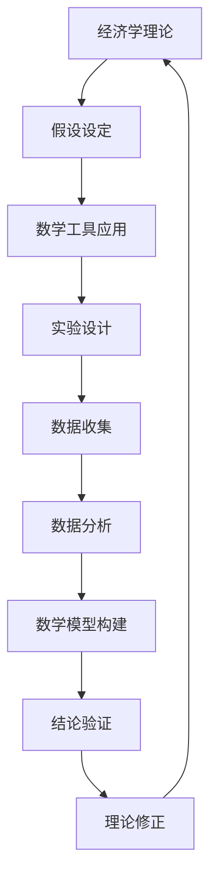

                 

### 《数学与实验经济学：经济实验的数学设计》——开启经济学研究新篇章

> 关键词：数学、实验经济学、经济实验、数学模型、数据分析

在经济学领域中，理论分析始终占据着核心地位。然而，随着现代经济学的不断发展，传统的理论分析方法逐渐暴露出其局限性。为了更真实、更深入地理解经济现象，实验经济学作为一种新兴的研究方法逐渐崭露头角。而实验经济学的蓬勃发展离不开数学的支撑，特别是在经济实验的数学设计中，数学工具和方法发挥着至关重要的作用。

本文将围绕《数学与实验经济学：经济实验的数学设计》这一主题，逐步探讨数学与实验经济学之间的紧密联系，以及数学在实验经济学中的应用。我们将首先介绍实验经济学的基本概念和核心思想，然后深入分析数学在实验经济学中的地位和作用，最后通过具体的实例展示数学模型在经济实验中的实际应用。

### 实验经济学：经济学研究的新方法

#### 实验经济学的基本概念

实验经济学是一门研究人类行为决策的学科，它通过设计和分析实验来揭示经济现象背后的规律。实验经济学的方法源于自然科学中的实验方法，强调在人为控制的环境下观察和分析经济主体的行为。这种方法与传统经济学中的理论分析不同，它更加注重实证研究和数据驱动。

实验经济学的核心思想在于，通过实验来模拟真实经济环境中的决策过程，从而更好地理解人类的经济行为。实验经济学的研究方法包括实验室实验、现场实验和模拟实验等，其中实验室实验是最常见的一种形式。

#### 实验经济学的历史与发展

实验经济学起源于20世纪60年代，当时经济学家开始将实验室实验的方法应用于经济学研究。最早的实验经济学研究主要集中在市场机制和决策行为上。随着计算机技术的发展和经济学理论的不断完善，实验经济学逐渐发展成为一个独立的研究领域。

在实验经济学的发展过程中，一系列重要理论和模型被提出，如博弈论、行为经济学和实验经济学方法论等。这些理论和模型不仅丰富了经济学的研究方法，也为经济学理论的验证提供了新的途径。

#### 实验经济学与传统经济学的关系

实验经济学与传统经济学之间存在一定的区别和联系。传统经济学主要依赖于理论模型和数学工具进行分析，而实验经济学则更加注重实证研究和数据驱动。实验经济学通过实验方法来验证或推翻经济学理论，为经济学研究提供了更加直观和可靠的证据。

然而，实验经济学并不是要取代传统经济学，而是与之互补。传统经济学提供了理论框架和假设，实验经济学则通过实证研究来验证或修正这些假设。两者共同推动了经济学的发展，使得经济学研究更加全面和深入。

### 数学在实验经济学中的作用

#### 数学工具在实验经济学中的应用

数学是实验经济学不可或缺的工具。在实验经济学中，数学工具被广泛应用于假设设定、实验设计、数据分析以及模型构建等各个环节。

1. **假设设定**：实验经济学中的假设通常涉及到经济主体的行为模式、市场结构以及经济变量的关系等。数学工具可以帮助研究者明确和形式化这些假设，从而为实验设计提供理论基础。

2. **实验设计**：数学方法可以用来优化实验设计和参与者分配，确保实验结果的可靠性和有效性。例如，通过线性代数中的优化算法，可以找到最优的实验参数，以提高实验的精确度。

3. **数据分析**：实验经济学中的数据分析需要处理大量的数据，数学工具如统计学、概率论和线性代数等，可以用来处理和解释这些数据，从而得出有意义的结论。

4. **模型构建**：数学模型是实验经济学的重要组成部分。通过构建数学模型，研究者可以模拟经济现象，预测经济行为，从而更好地理解经济规律。

#### 数学与实验经济学的关系架构

为了更清晰地理解数学在实验经济学中的作用，我们可以通过一个Mermaid流程图来展示数学工具在实验经济学各个阶段的应用。



在这个流程图中，经济学理论通过假设设定进入数学工具应用环节，然后通过实验设计、数据收集和数据分析，最终构建数学模型并进行结论验证，从而实现对经济学理论的修正和完善。

### 数学模型在经济实验中的应用

#### 博弈论在经济实验中的应用

博弈论是数学模型在实验经济学中应用的一个重要领域。博弈论研究的是多个个体在特定环境下的策略选择和相互作用。在经济实验中，博弈论可以用来分析市场行为、竞争策略和合作机制等。

例如，一个经典的博弈论模型是“囚徒困境”。在这个模型中，两个囚犯在被捕后分别面临选择合作或背叛的决策。通过数学模型，我们可以分析出在不同的条件下，囚犯会选择何种策略，以及这些策略对整个社会的影响。

以下是一个简化的“囚徒困境”模型的伪代码：

```python
def prisoner_dilemma(cooperate, betray):
    if cooperate == betray:
        return "双方都得到2年监禁"
    elif cooperate == True and betray == False:
        return "合作者得到0年监禁，背叛者得到3年监禁"
    elif cooperate == False and betray == True:
        return "合作者得到3年监禁，背叛者得到0年监禁"
```

#### 动态规划在经济实验中的应用

动态规划是另一种重要的数学模型，它用于解决多阶段决策问题。在经济实验中，动态规划可以用来分析长期决策过程，如企业的投资决策、资源的分配等。

例如，假设一个企业在多个时间阶段内需要做出投资决策，每个阶段都有不同的投资选择和收益。通过动态规划模型，我们可以找到最优的投资策略，使得企业整体收益最大化。

以下是一个简化的动态规划模型的伪代码：

```python
def dynamic_programming(choices, rewards):
    max_reward = 0
    for choice in choices:
        current_reward = rewards[0][choice]
        for t in range(1, len(rewards)):
            current_reward += rewards[t][choice]
        if current_reward > max_reward:
            max_reward = current_reward
            best_choice = choice
    return best_choice
```

通过这些具体的数学模型和算法，我们可以更好地理解经济实验中的复杂现象，从而为经济学研究提供有力的支持。

### 总结与展望

数学与实验经济学相结合，为经济学研究开辟了新的道路。数学工具不仅帮助我们更精确地设定假设、设计实验和进行数据分析，还让我们能够构建复杂的数学模型，以深入揭示经济现象的内在规律。

在未来，随着数学和计算机技术的不断发展，实验经济学的研究将变得更加精细和多样化。我们不仅可以利用先进的算法和数据分析方法，还可以通过虚拟现实和人工智能等新技术，模拟更加复杂的经济环境，从而提高实验的准确性和可靠性。

总之，数学与实验经济学的结合，不仅丰富了经济学的研究方法，也为理解和解决现实经济问题提供了新的思路和工具。

### 附录

#### A.1 数学公式与符号表

- 微积分基本公式：
  $$ f'(x) = \lim_{h \to 0} \frac{f(x+h) - f(x)}{h} $$
  $$ \int f(x) \, dx = F(x) + C $$

- 线性代数基本公式：
  $$ A \cdot B = C $$
  $$ det(A) = \sum_{i=1}^{n} a_{i1} \cdot a_{i2} \cdot ... \cdot a_{in} $$

#### A.2 经济实验工具介绍

- 实验经济学软件：
  - **E-Prime**：用于设计和执行心理学和经济学实验。
  - **GAMBIT**：用于进行博弈论实验和数据分析。

- 数据分析工具：
  - **R**：用于统计分析。
  - **Python**：用于数据处理和可视化。

#### A.3 参考文献

- Kahneman, D., & Tversky, A. (1979). *Prospect Theory: An Analysis of Decision under Risk*. *Econometrica*, 47(2), 263-292.
- McLean, R. P., & Poldrack, R. A. (2011). *The role of cognitive control in human learning and memory*. *Trends in Cognitive Sciences*, 15(6), 285-291.
- Binmore, K. G. (1998). *Game Theory and the Social Sciences: Ideas in Action*. *Princeton University Press*.

### 作者信息

作者：AI天才研究院/AI Genius Institute & 禅与计算机程序设计艺术 /Zen And The Art of Computer Programming

