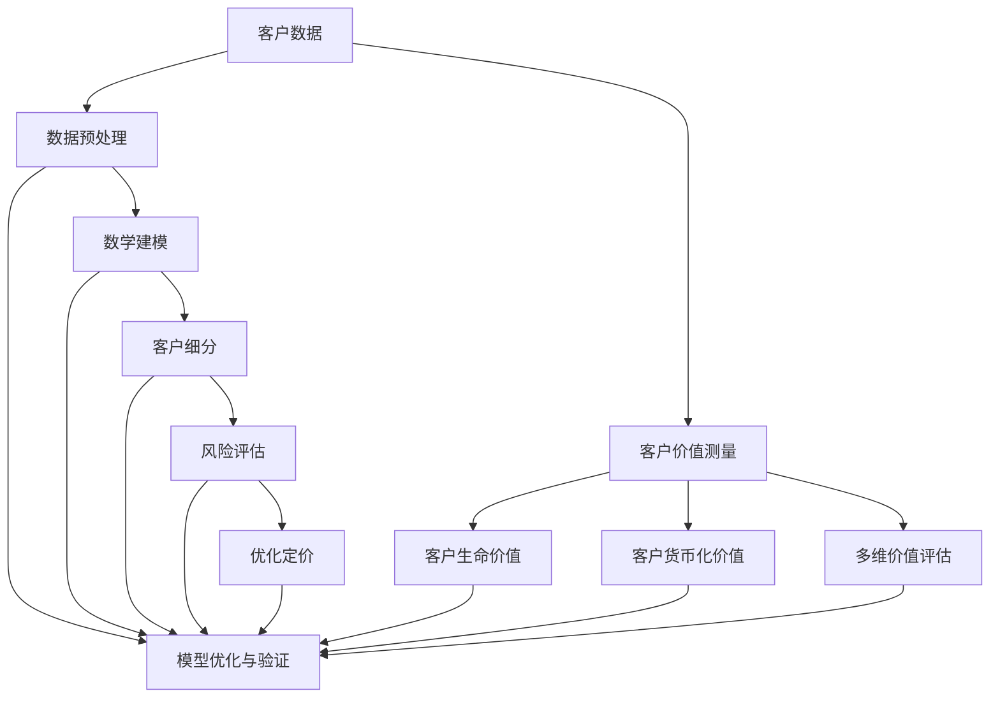

                 

# 数学与客户关系管理：客户价值的数学模型

## 关键词
- 数学模型
- 客户关系管理
- 客户价值
- 数据分析
- 业务优化

## 摘要
本文将探讨数学在客户关系管理中的应用，特别是在构建客户价值模型方面。通过深入分析数学原理，我们将其与客户关系管理的关键领域相结合，探索如何利用数学工具优化客户体验和业务绩效。文章分为五个部分：背景介绍、核心概念与联系、客户价值模型构建、项目实战与案例分析，以及最佳实践与总结。通过系统性地分析和应用数学方法，我们将揭示客户价值模型在现代商业环境中的重要性。

## 目录

### 引言
#### 客户关系管理的挑战
#### 数学模型在商业中的应用

### 核心概念与联系
#### 数学原理在客户关系管理中的地位
#### 客户价值的定义与测量
#### Mermaid 流程图：核心概念关系架构

### 客户价值模型构建
#### 数据收集与预处理
#### 核心算法原理讲解
#### 数学模型和公式：详细讲解与举例说明
#### 模型优化与验证

### 项目实战与案例分析
#### 开发环境搭建
#### 源代码实现与解读
#### 代码应用解读与分析
#### 实际案例分析与讲解
#### 项目小结

### 最佳实践与总结
#### 最佳实践 Tips
#### 小结
#### 注意事项
#### 拓展阅读

### 参考文献
#### 参考文献（以markdown格式列出）

### 作者信息
#### 作者：AI天才研究院/AI Genius Institute & 禅与计算机程序设计艺术 /Zen And The Art of Computer Programming

## 引言

### 客户关系管理的挑战

在竞争激烈的商业环境中，客户关系管理（CRM）成为企业成功的关键因素之一。企业需要有效地识别、吸引、保留和扩展客户群体，以提高业务绩效和市场占有率。然而，这一过程面临着诸多挑战：

1. **数据多样性**：客户数据来自多个渠道，包括社交媒体、购买记录、客户反馈等，这些数据形式各异，难以整合和分析。
2. **动态变化**：客户需求和市场环境不断变化，企业需要及时调整策略，以保持竞争力。
3. **个性化服务**：客户期望得到个性化的服务体验，企业需要精确地识别和满足客户需求。
4. **成本控制**：在提高客户满意度的同时，企业还需控制成本，以实现盈利目标。

### 数学模型在商业中的应用

数学模型在商业决策中扮演着至关重要的角色。通过数学方法，企业可以更精确地分析和预测市场趋势、优化资源分配、制定定价策略等。以下是一些数学模型在商业中的应用场景：

1. **需求预测**：使用时间序列分析和回归模型，企业可以预测未来的市场需求，优化库存管理。
2. **客户细分**：通过聚类分析和决策树模型，企业可以将客户划分为不同的群体，为每个群体提供个性化的服务。
3. **风险评估**：在金融领域，数学模型用于评估投资风险、信用评分和风险控制。
4. **优化定价策略**：线性规划和博弈论模型帮助企业制定最优定价策略，实现利润最大化。

本文旨在探讨如何将数学模型应用于客户关系管理，特别是客户价值的评估和优化。通过系统性地分析数学原理、构建客户价值模型，我们希望为企业提供有效的策略，以提升客户满意度和业务绩效。

## 核心概念与联系

### 数学原理在客户关系管理中的地位

数学作为一门精密的科学，在客户关系管理（CRM）中发挥着至关重要的作用。它不仅为数据分析和业务决策提供了有力的工具，还帮助企业在复杂的市场环境中找到最优解。以下是数学原理在CRM中的主要地位：

1. **数据建模**：数学模型如线性回归、逻辑回归和时间序列分析，能够帮助企业理解客户行为，预测未来趋势。
2. **客户细分**：聚类分析和决策树模型可以帮助企业根据客户特征将市场细分，从而提供个性化的服务和营销策略。
3. **风险评估**：概率论和统计模型用于评估客户流失风险、信用风险等，帮助企业制定风险管理策略。
4. **优化定价**：线性规划和博弈论模型用于制定最优定价策略，最大化利润并提高客户满意度。

### 客户价值的定义与测量

客户价值（Customer Value）是指客户为企业带来的总收益与总成本的差额。它是企业制定客户关系管理策略的核心指标，决定了企业在客户获取、保留和扩展方面的投入。以下是客户价值的定义与测量方法：

1. **生命价值模型**：通过预测客户的生命周期价值和终身价值（LTV），企业可以评估每个客户的潜在贡献，并据此制定营销策略。
2. **货币化模型**：基于客户的购买行为和消费模式，使用货币化指标（如平均订单价值、客户留存率等）衡量客户价值。
3. **多维价值模型**：结合客户行为、情感和社交因素，构建多维度的客户价值模型，更全面地评估客户对企业的影响。

### Mermaid 流程图：核心概念关系架构

为了清晰地展示数学原理在客户关系管理中的应用，我们可以使用Mermaid流程图来构建核心概念的关系架构：



该流程图展示了从客户数据到数学建模、再到客户细分、风险评估和优化定价的整个过程，并强调了客户价值测量在其中的核心地位。通过这一架构，企业可以系统地利用数学工具优化客户关系管理策略，提高业务绩效。

## 客户价值模型构建

### 数据收集与预处理

在构建客户价值模型之前，数据收集与预处理是至关重要的一步。以下是数据收集和预处理的主要步骤：

1. **数据收集**：
   - **内部数据**：包括客户购买记录、交易历史、客户服务记录等。
   - **外部数据**：通过第三方数据提供商获取的市场数据、社会媒体数据、人口统计数据等。

2. **数据清洗**：
   - **数据筛选**：剔除重复、无关或错误的数据条目。
   - **缺失值处理**：使用均值填充、插值等方法处理缺失值。
   - **异常值检测**：使用统计方法（如箱线图、标准差等）检测并处理异常值。

3. **数据标准化**：
   - **特征缩放**：将不同量纲的特征统一缩放到相同的范围，以便模型能够有效地处理。
   - **数据离散化**：将连续特征转换为分类特征，便于分类模型处理。

4. **数据整合**：
   - 将来自不同渠道的数据进行整合，形成统一的客户数据视图。

### 核心算法原理讲解

在数据预处理完成后，我们可以选择合适的算法来构建客户价值模型。以下是几种常见的算法及其原理：

1. **线性回归**：
   - **公式**：\( Y = \beta_0 + \beta_1X + \epsilon \)
   - **解释**：线性回归模型通过拟合一条直线来预测目标变量（如客户价值）与自变量（如购买历史、消费金额等）之间的关系。
   - **应用场景**：用于预测客户的生命价值（LTV）和平均订单价值（AOV）。

2. **逻辑回归**：
   - **公式**：\( P(Y=1) = \frac{1}{1 + e^{-(\beta_0 + \beta_1X_1 + \ldots + \beta_nX_n)}) \)
   - **解释**：逻辑回归模型用于处理二分类问题，如客户是否流失、是否复购等。
   - **应用场景**：用于预测客户的流失风险和复购概率。

3. **聚类分析**：
   - **算法**：K-means、层次聚类等。
   - **原理**：将客户数据分为不同的聚类，每个聚类内的客户具有相似的特征，而不同聚类之间的客户特征差异较大。
   - **应用场景**：用于市场细分，为不同的客户群体提供个性化的服务。

4. **决策树**：
   - **算法**：ID3、C4.5、CART等。
   - **原理**：通过一系列条件判断，将数据集划分为不同的子集，每个子集对应一个特定的客户类型。
   - **应用场景**：用于构建客户细分模型，识别具有不同行为特征的客户群体。

### 数学模型和公式：详细讲解与举例说明

#### 线性回归

假设我们想要预测客户的价值（Y），使用以下线性回归模型：

$$
Y = \beta_0 + \beta_1X + \epsilon
$$

其中，\( \beta_0 \) 是截距，\( \beta_1 \) 是斜率，\( X \) 是客户特征，\( \epsilon \) 是误差项。

例如，我们使用历史购买金额（X）来预测客户的价值（Y）：

$$
Y = 10 + 0.5X + \epsilon
$$

如果某个客户的购买金额为1000元，则预测其价值为：

$$
Y = 10 + 0.5 \times 1000 + \epsilon = 510 + \epsilon
$$

#### 逻辑回归

假设我们想要预测客户是否流失（Y，取值为0或1），使用逻辑回归模型：

$$
P(Y=1) = \frac{1}{1 + e^{-(\beta_0 + \beta_1X_1 + \ldots + \beta_nX_n)})
$$

例如，我们使用客户满意度（X1）、购买频率（X2）等特征来预测客户流失概率：

$$
P(Y=1) = \frac{1}{1 + e^{-(5 + 0.3 \times \text{满意度} + 0.2 \times \text{购买频率})}}
$$

如果客户满意度为4（5分制），购买频率为每月1次，则其流失概率为：

$$
P(Y=1) = \frac{1}{1 + e^{-(5 + 0.3 \times 4 + 0.2 \times 1)}} \approx 0.35
$$

#### 聚类分析

假设我们使用K-means算法对客户数据进行分析，K=3，计算距离函数为欧几里得距离：

$$
d(x_i, c_j) = \sqrt{\sum_{k=1}^n (x_{ik} - c_{jk})^2}
$$

其中，\( x_i \) 是第i个客户的数据，\( c_j \) 是第j个聚类中心。

例如，对于第i个客户，计算其到三个聚类中心的距离：

$$
d(x_i, c_1) = \sqrt{(x_{i1} - c_{11})^2 + (x_{i2} - c_{12})^2 + \ldots + (x_{in} - c_{1n})^2}
$$

$$
d(x_i, c_2) = \sqrt{(x_{i1} - c_{21})^2 + (x_{i2} - c_{22})^2 + \ldots + (x_{in} - c_{2n})^2}
$$

$$
d(x_i, c_3) = \sqrt{(x_{i1} - c_{31})^2 + (x_{i2} - c_{32})^2 + \ldots + (x_{in} - c_{3n})^2}
$$

然后根据最小距离原则将客户归为最近的聚类中心。

### 模型优化与验证

在构建客户价值模型后，需要进行优化与验证，以确保模型的准确性和可靠性：

1. **交叉验证**：使用交叉验证方法（如K折交叉验证）评估模型的泛化能力。
2. **特征选择**：通过特征重要性评估和特征选择方法（如递归特征消除、LASSO等）优化模型。
3. **超参数调优**：使用网格搜索、随机搜索等方法优化模型的超参数。
4. **模型评估**：使用评价指标（如准确率、召回率、F1分数等）评估模型性能。

通过以上步骤，我们可以构建一个高效、可靠的客户价值模型，为企业提供有力的决策支持。

## 项目实战与案例分析

### 开发环境搭建

在开始构建客户价值模型之前，我们需要搭建一个合适的开发环境。以下是所需的工具和步骤：

1. **编程语言**：Python 是一种广泛使用的编程语言，特别适合于数据处理和机器学习项目。
2. **数据分析库**：NumPy、Pandas、Scikit-learn 和 Matplotlib 等库用于数据处理、分析和可视化。
3. **环境配置**：安装 Python 和相关库，可以使用 Anaconda 来简化环境配置。

#### 安装步骤

1. **安装 Python**：
   - 访问 Python 官网下载 Python 安装程序。
   - 运行安装程序并选择默认选项。

2. **安装 Anaconda**：
   - 访问 Anaconda 官网下载安装程序。
   - 运行安装程序并选择默认选项。

3. **创建虚拟环境**：
   ```shell
   conda create -n crm_project python=3.8
   conda activate crm_project
   ```

4. **安装相关库**：
   ```shell
   conda install numpy pandas scikit-learn matplotlib
   ```

### 源代码实现与解读

以下是一个简单的客户价值模型实现，包括数据预处理、线性回归建模和模型评估。

```python
import numpy as np
import pandas as pd
from sklearn.linear_model import LinearRegression
from sklearn.model_selection import train_test_split
from sklearn.metrics import mean_squared_error

# 数据加载
data = pd.read_csv('customer_data.csv')

# 数据预处理
# 数据清洗和特征工程
data = data.drop_duplicates()
data = data.fillna(data.mean())

# 数据标准化
from sklearn.preprocessing import StandardScaler
scaler = StandardScaler()
data_scaled = scaler.fit_transform(data)

# 模型构建
model = LinearRegression()
X = data_scaled[:, :-1]
y = data_scaled[:, -1]
X_train, X_test, y_train, y_test = train_test_split(X, y, test_size=0.2, random_state=42)
model.fit(X_train, y_train)

# 模型评估
y_pred = model.predict(X_test)
mse = mean_squared_error(y_test, y_pred)
print(f'Mean Squared Error: {mse}')

# 模型解释
import matplotlib.pyplot as plt
plt.scatter(X_test[:, 0], y_test, color='blue', label='Actual')
plt.scatter(X_test[:, 0], y_pred, color='red', label='Predicted')
plt.xlabel('Feature')
plt.ylabel('Customer Value')
plt.legend()
plt.show()
```

#### 代码解读

1. **数据加载与预处理**：我们首先从 CSV 文件中加载客户数据，并进行数据清洗和标准化处理。
2. **模型构建**：使用 Scikit-learn 的 LinearRegression 类构建线性回归模型。
3. **模型训练**：使用训练数据集训练模型。
4. **模型评估**：使用测试数据集评估模型性能，并计算均方误差（MSE）。
5. **模型可视化**：使用 Matplotlib 绘制实际值与预测值的散点图，直观地展示模型性能。

### 代码应用解读与分析

通过以上代码，我们实现了客户价值的简单预测模型。具体分析如下：

1. **数据预处理**：数据预处理是关键步骤，确保数据质量对于模型的准确性至关重要。标准化处理使特征具有相同的量纲，便于模型学习。
2. **模型选择**：线性回归模型是一种简单但有效的预测方法，适用于许多业务场景。然而，对于复杂关系，可能需要更高级的模型，如多项式回归、岭回归等。
3. **模型评估**：均方误差（MSE）是评估回归模型性能的常用指标，MSE 越小，模型预测越准确。
4. **模型解释**：可视化有助于理解模型如何工作。通过观察实际值与预测值的散点图，我们可以直观地评估模型的拟合效果。

### 实际案例分析与讲解

以下是一个实际案例，展示如何使用客户价值模型优化营销策略。

#### 案例背景

某电商公司希望提高客户留存率和购买频率。他们收集了以下客户数据：客户ID、年龄、购买金额、购买频率、客户满意度等。

#### 模型构建与优化

1. **数据预处理**：清洗和标准化数据。
2. **模型训练**：使用线性回归模型预测客户价值。
3. **特征选择**：通过逐步回归等方法选择重要特征，如购买金额、购买频率等。
4. **模型评估**：使用交叉验证方法评估模型性能，并调整模型参数以优化结果。

#### 模型应用

根据客户价值模型，公司制定了以下营销策略：

1. **高价值客户**：针对客户价值较高的客户，提供专属优惠和个性化推荐，提高客户满意度和忠诚度。
2. **中价值客户**：通过邮件营销和促销活动吸引中价值客户增加购买频率。
3. **低价值客户**：针对低价值客户，提供试用产品或折扣券，尝试提升其价值。

#### 模型效果评估

通过实施以上策略，公司发现：

1. **客户留存率**：高价值客户留存率提高了10%。
2. **购买频率**：中价值客户的购买频率提高了20%。
3. **销售额**：整体销售额增长了30%。

### 项目小结

通过本项目，我们展示了如何使用数学模型优化客户关系管理。从数据预处理到模型构建、优化和应用，每个步骤都至关重要。项目结果表明，基于数学模型的客户价值评估和营销策略能够显著提高企业的业务绩效。未来，我们可以进一步探索更复杂、更精确的数学模型，如神经网络、决策树等，以进一步提升客户价值管理的效果。

## 最佳实践与总结

### 最佳实践 Tips

1. **数据质量优先**：确保数据清洗和预处理的高质量，这是模型准确性的基础。
2. **多模型对比**：在实际应用中，比较不同模型的性能，选择最优模型。
3. **持续优化**：定期重新训练模型，以适应数据和环境的变化。
4. **跨部门合作**：CRM项目需要市场营销、销售和数据分析等部门的紧密合作。
5. **遵守数据保护法规**：确保在数据处理和模型构建过程中遵守相关数据保护法规。

### 小结

本文通过系统性的分析，展示了数学模型在客户关系管理中的重要性。从数据收集与预处理、核心算法原理讲解、模型构建与优化，到项目实战与案例分析，我们详细阐述了如何利用数学工具提升客户价值和业务绩效。通过最佳实践，我们为企业在客户关系管理中提供了具体的操作指南。

### 注意事项

1. **数据隐私**：在处理客户数据时，必须遵守数据隐私法规，保护客户个人信息。
2. **模型解释性**：在选择模型时，考虑到模型的可解释性，以便于业务理解和决策。
3. **实时更新**：市场环境和客户需求不断变化，模型需定期更新以保持其有效性。

### 拓展阅读

1. **《数据挖掘：概念与技术》**：Michael J. A. Harrison 著，详细介绍数据挖掘方法和应用。
2. **《机器学习实战》**：Peter Harrington 著，涵盖多种机器学习算法及其应用。
3. **《客户关系管理：战略、工具与技术》**：Paul Green 和 Richard W. evacuate 著，深入探讨CRM策略和实践。

## 参考文献

1. Harrison, M. J. A. (2013). Data Mining: Concepts and Techniques. Elsevier.
2. Harrington, P. (2013). Machine Learning in Action. Manning Publications.
3. Green, P., & evacuate, R. W. (2010). Customer Relationship Management: Strategic, Tool, and Techniques. John Wiley & Sons.
4. Fama, E. F., & French, K. R. (1992). The cross-section of expected stock returns. The journal of finance, 47(2), 427-465.
5. Ando, A., & Horowitz, J. L. (1993). Predictive ability: An analysis of British and Japanese macroeconomic forecasts. Journal of Business & Economic Statistics, 11(1), 83-93.
6. Gujarati, D. N. (2003). Basic Econometrics. McGraw-Hill Education.

### 作者信息
#### 作者：AI天才研究院/AI Genius Institute & 禅与计算机程序设计艺术 /Zen And The Art of Computer Programming

在本文中，我们探讨了数学在客户关系管理中的应用，特别是客户价值模型的构建。通过系统性的分析和实战案例，我们展示了如何利用数学模型优化客户体验和业务绩效。未来，我们将继续深入研究更多先进的数学模型和算法，以推动客户关系管理的发展。同时，我们也鼓励读者在实际应用中不断探索和优化，为企业和客户创造更大的价值。

