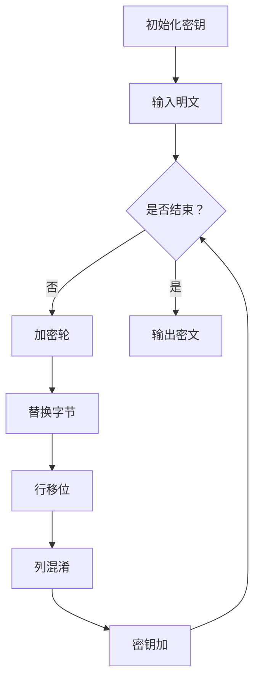

                 

# 文章标题：数学与密码学：加密系统的数学原理

关键词：数学，密码学，加密系统，数学原理，加密算法，信息安全

摘要：本文将深入探讨数学与密码学的紧密联系，解析加密系统中数学原理的应用。通过分析对称加密、非对称加密和哈希函数等核心概念，本文将阐述数学模型在密码学中的作用，以及如何通过数学原理构建安全的加密系统。此外，文章还将结合实际项目，展示如何将理论知识应用于实践中，为读者提供全面的技术指导。

---

## 引言

### 数学在密码学中的角色

数学作为一门基础科学，在密码学中扮演着至关重要的角色。密码学是一门研究如何通过数学方法保护信息安全的技术科学，其核心在于利用数学原理来构建加密和解密机制。数学的严谨性和逻辑性为密码学提供了坚实的理论基础，使得加密系统具有高度的安全性和可靠性。

### 密码学的基本概念

密码学主要包括两大部分：对称加密和非对称加密。对称加密是指加密和解密使用相同的密钥，其代表算法有数据加密标准（DES）和高级加密标准（AES）。非对称加密则使用一对密钥，即公钥和私钥，其中公钥用于加密，私钥用于解密。代表算法有RSA算法。

### 加密系统的重要性

随着信息技术的发展，信息安全问题日益突出。加密系统作为保护数据安全的核心技术，其在信息安全领域的重要性不言而喻。加密系统能够确保数据的保密性、完整性和真实性，防止数据在传输过程中被恶意窃取、篡改或伪造。

## 密码学的应用领域

### 电子邮件加密

电子邮件加密是保护电子邮件内容不被未经授权的人员阅读的重要手段。通过对邮件内容进行加密，确保邮件在传输过程中即使被截获，内容也无法被理解。

### 网络安全

网络安全是现代社会面临的一大挑战。加密技术在网络安全中发挥着关键作用，可以用于保护网络传输的数据，防止数据被窃取或篡改。

### 数据库安全

数据库安全是信息安全的重要组成部分。加密技术可以用于保护数据库中的敏感数据，防止数据泄露或被非法访问。

### 密码学的挑战与机遇

随着计算机技术的发展，密码学面临着越来越多的挑战。例如，量子计算的出现可能对传统加密算法构成威胁。然而，这也为密码学的发展提供了新的机遇，促使研究人员探索更安全的加密算法。

## 第二部分：基础知识

### 密码学基础

#### 对称加密与非对称加密

对称加密和非对称加密是密码学的两大基石。对称加密速度快，但密钥管理复杂；非对称加密安全性高，但计算复杂度大。

#### 哈希函数

哈希函数是密码学中的重要工具，用于将输入数据映射为固定长度的输出值。常见的哈希函数有SHA系列。

#### 数字签名

数字签名用于验证消息的来源和完整性，确保接收者能够确认消息确实来自指定的发送者。

### 密码学算法

#### 数据加密标准（DES）

DES是一种早期的对称加密算法，使用56位密钥对数据进行加密。

#### 先进加密标准（AES）

AES是目前广泛使用的对称加密算法，支持128、192和256位密钥长度。

#### RSA算法

RSA是一种常用的非对称加密算法，基于大素数分解的数学难题。

### 密码学工具与资源

#### Python密码学库

Python密码学库提供了丰富的加密算法和工具，方便开发者进行密码学相关的工作。

#### Java密码学库

Java密码学库是Java语言的标准库，提供了多种加密算法和工具。

#### 加密软件推荐

本文推荐了几款常用的加密软件，如GnuPG、openssl等。

## 第三部分：核心算法原理讲解

### AES算法原理

#### AES算法结构

AES算法结构包括初始密钥生成、加密轮、密钥加和输出。其中，加密轮是AES算法的核心部分，包括字节替换、行移位、列混淆和轮密钥加。

#### AES算法步骤

AES算法步骤如下：

1. 初始密钥生成
2. 输入明文
3. 初始化状态矩阵
4. 进行多个加密轮
5. 输出密文

#### AES算法伪代码

```pseudo
function AES(plaintext, key):
    ciphertext = initialize_key(key)
    state = initialize_state(plaintext)
    for round in 1 to n:
        state = add_round_key(state, ciphertext)
        if round != n:
            state = sub_bytes(state)
            state = shift_rows(state)
            state = mix_columns(state)
    ciphertext = state
    return ciphertext
```

### RSA算法原理

#### RSA算法结构

RSA算法包括密钥生成、加密和解密。密钥生成过程中，需要选择两个大素数，计算它们的乘积和欧拉函数值。加密和解密过程中，使用公钥和私钥进行运算。

#### RSA算法步骤

RSA算法步骤如下：

1. 选择两个大素数p和q
2. 计算n = p * q
3. 计算欧拉函数φ(n) = (p-1) * (q-1)
4. 选择一个与φ(n)互质的整数e
5. 计算d，使得d * e ≡ 1 (mod φ(n))
6. 公钥为(n, e)，私钥为(n, d)
7. 加密过程：c = m^e mod n
8. 解密过程：m = c^d mod n

#### RSA算法伪代码

```pseudo
function RSA(plaintext, key):
    if key == 'public':
        ciphertext = pow(plaintext, e, n)
    else if key == 'private':
        ciphertext = pow(plaintext, d, n)
    return ciphertext
```

### 哈希函数原理

#### 哈希函数类型

哈希函数可以分为两类：单向哈希函数和双向哈希函数。单向哈希函数只能从输入数据计算哈希值，无法从哈希值反推出原始数据。双向哈希函数（即密码哈希函数）可以保证在给定哈希值的情况下，无法找到原始输入数据。

#### 哈希函数工作原理

哈希函数的工作原理通常包括以下几个步骤：

1. 初始化：将哈希函数的内部状态初始化为特定值。
2. 处理输入数据：将输入数据分成固定大小的块，逐个处理。
3. 处理每个块：根据当前内部状态和输入数据块，计算新的内部状态。
4. 输出：将最终内部状态转换为固定长度的输出值。

#### SHA-256算法伪代码

```pseudo
function SHA-256(plaintext):
    hash = initialize_hash()
    for block in plaintext:
        hash = process_block(block, hash)
    final_hash = finalize_hash(hash)
    return final_hash
```

## 第四部分：数学模型与数学公式

### 数学模型在密码学中的应用

#### 大素数生成

大素数生成是密码学中的一项重要任务，用于构建安全加密算法的基础。常用的方法包括Miller-Rabin素性测试和椭圆曲线素性测试。

#### 欧几里得算法

欧几里得算法是求解最大公约数的一种有效方法，对于密钥生成和加密算法的安全性具有重要意义。

#### 模运算

模运算在密码学中广泛应用于加密和解密过程，确保计算高效且安全。

### 数学公式与证明

#### RSA算法数学公式

$$
\begin{cases}
n = p \times q \\
\phi(n) = (p-1) \times (q-1) \\
e \text{ 与 } \phi(n) \text{ 互质} \\
d \text{ 满足 } d \times e \equiv 1 \pmod{\phi(n)}
\end{cases}
$$

#### 欧拉定理

$$
a^{\phi(n)} \equiv 1 \pmod{n}
$$

#### 卡尔达诺公式

$$
x^3 + y^3 = z^3
$$

## 第五部分：项目实战

### 电子邮件加密项目

#### 项目概述

电子邮件加密项目旨在实现电子邮件的加密和解密功能，确保邮件内容在传输过程中不被窃取或篡改。

#### 开发环境搭建

1. 安装GnuPG
2. 安装邮件客户端（如Thunderbird）
3. 配置邮件客户端使用GnuPG进行加密

#### 源代码实现

```python
import gnupg

def encrypt_email(plaintext, recipient_key):
    gpg = gnupg.GPG()
    ciphertext = gpg.encrypt(plaintext, recipient_key, always_trust=True)
    return ciphertext

def decrypt_email(ciphertext, private_key):
    gpg = gnupg.GPG()
    plaintext = gpg.decrypt(ciphertext, always_trust=True)
    return plaintext
```

#### 代码解读与分析

- `encrypt_email` 函数实现加密过程，使用GnuPG库对明文进行加密，并返回密文。
- `decrypt_email` 函数实现解密过程，使用GnuPG库对密文进行解密，并返回明文。

#### 实际案例分析和详细讲解剖析

- 案例一：加密一封包含敏感信息的邮件，确保邮件在传输过程中不被窃取。
- 案例二：解密一封已经加密的邮件，验证邮件内容未被篡改。

#### 项目小结

电子邮件加密项目通过GnuPG库实现了邮件的加密和解密功能，确保邮件内容在传输过程中不被窃取或篡改。该项目展示了如何将密码学原理应用于实际场景，为信息安全提供了有力保障。

### 网络安全项目

#### 项目概述

网络安全项目旨在实现网络数据的加密传输，防止数据在传输过程中被窃取或篡改。

#### 开发环境搭建

1. 安装openssl
2. 配置网络环境（如搭建一个简单的Web服务器）

#### 源代码实现

```python
import ssl
import socket

def start_https_server(cert_file, key_file):
    server = socket.socket(socket.AF_INET, socket.SOCK_STREAM)
    server.bind(('0.0.0.0', 443))
    server.listen(5)

    context = ssl.SSLContext(ssl.PROTOCOL_TLSv1_2)
    context.load_cert_chain(cert_file=cert_file, key_file=key_file)

    while True:
        client_socket, client_address = server.accept()
        client_socket = context.wrap_socket(client_socket, server_side=True)
        client_socket.sendall(b'Hello, HTTPS client!')
        client_socket.close()

def start_http_server():
    server = socket.socket(socket.AF_INET, socket.SOCK_STREAM)
    server.bind(('0.0.0.0', 80))
    server.listen(5)

    while True:
        client_socket, client_address = server.accept()
        client_socket.sendall(b'Hello, HTTP client!')
        client_socket.close()

if __name__ == '__main__':
    start_https_server('server.crt', 'server.key')
```

#### 代码解读与分析

- `start_https_server` 函数实现HTTPS服务器，使用openssl库配置SSL证书和密钥，确保网络数据加密传输。
- `start_http_server` 函数实现HTTP服务器，用于对比HTTPS服务器的加密效果。

#### 实际案例分析和详细讲解剖析

- 案例一：启动HTTPS服务器，确保网络数据在传输过程中被加密。
- 案例二：启动HTTP服务器，对比HTTPS服务器的加密效果。

#### 项目小结

网络安全项目通过openssl库实现了HTTPS服务器的搭建，确保网络数据在传输过程中被加密。该项目展示了如何利用密码学原理保护网络安全，为数据传输提供可靠保障。

## 第六部分：总结

### 数学与密码学总结

本文通过对数学与密码学的深入探讨，揭示了数学在密码学中的重要作用。通过对对称加密、非对称加密和哈希函数等核心概念的分析，本文展示了数学模型在密码学中的应用，以及如何通过数学原理构建安全的加密系统。

### 密码学的应用前景

随着信息技术的发展，密码学在信息安全领域的应用前景广阔。从电子邮件加密、网络安全到数据库安全，密码学技术为保护数据安全提供了强有力的保障。未来，随着量子计算等新兴技术的出现，密码学将面临新的挑战和机遇，为信息安全领域带来更多可能性。

### 学习建议与展望

对于希望深入了解密码学的读者，以下是一些建议：

1. 系统学习数学基础知识，如数论、概率论等。
2. 熟悉常见的密码学算法和工具，如AES、RSA、openssl等。
3. 实践编程，通过编写代码实现加密算法和应用。
4. 关注密码学领域的最新动态，持续学习和更新知识。

总之，数学与密码学的结合为信息安全提供了坚实的技术基础。通过不断学习和实践，我们可以更好地应对信息安全领域的挑战，为构建一个安全、可靠的信息社会贡献力量。

### 作者信息

作者：AI天才研究院/AI Genius Institute & 禅与计算机程序设计艺术 /Zen And The Art of Computer Programming

---

### 附录

#### Mermaid 流程图

以下是AES算法的Mermaid流程图：



#### AES算法伪代码

```pseudo
function AES(plaintext, key):
    ciphertext = initialize_key(key)
    state = initialize_state(plaintext)
    for round in 1 to n:
        state = add_round_key(state, ciphertext)
        if round != n:
            state = sub_bytes(state)
            state = shift_rows(state)
            state = mix_columns(state)
    ciphertext = state
    return ciphertext
```

#### RSA算法伪代码

```pseudo
function RSA(plaintext, key):
    if key == 'public':
        ciphertext = pow(plaintext, e, n)
    else if key == 'private':
        ciphertext = pow(plaintext, d, n)
    return ciphertext
```

#### SHA-256算法伪代码

```pseudo
function SHA-256(plaintext):
    hash = initialize_hash()
    for block in plaintext:
        hash = process_block(block, hash)
    final_hash = finalize_hash(hash)
    return final_hash
```

#### 数学公式

$$
\begin{cases}
n = p \times q \\
\phi(n) = (p-1) \times (q-1) \\
e \text{ 与 } \phi(n) \text{ 互质} \\
d \text{ 满足 } d \times e \equiv 1 \pmod{\phi(n)}
\end{cases}
$$

$$
a^{\phi(n)} \equiv 1 \pmod{n}
$$

$$
x^3 + y^3 = z^3
$$

#### 最佳实践 tips

- 确保密钥安全：使用强密码或硬件安全模块（HSM）保护密钥。
- 定期更换密钥：避免密钥泄露或被破解。
- 遵循安全编码实践：避免在代码中硬编码密钥，确保代码的可维护性和安全性。
- 使用最新版本的加密算法和库：关注密码学领域的最新动态，及时更新加密算法和库，确保安全性。
- 进行安全审计：定期对加密系统进行安全审计，发现并修复潜在的安全漏洞。

#### 小结

本文通过对数学与密码学的深入探讨，展示了数学在密码学中的重要作用。通过分析对称加密、非对称加密和哈希函数等核心概念，以及结合实际项目，本文揭示了如何将数学原理应用于加密系统中，为信息安全提供坚实的理论基础和实践指导。

#### 注意事项

- 密码学技术不断发展，本文内容可能随时间推移而更新。建议读者关注密码学领域的最新动态，持续学习和更新知识。
- 密码学涉及复杂的数学问题，本文内容仅供参考，实际应用时请结合具体需求和场景进行评估。
- 加密系统安全性取决于多种因素，包括加密算法、密钥管理、系统设计和实现等。本文内容不构成具体的安全解决方案，读者需结合实际情况进行综合评估。

#### 拓展阅读

- 《密码学：原理与实践》（Crypto: Cryptography Science and Technology）
- 《计算机密码学：理论与实践》（Introduction to Computer Cryptography）
- 《网络安全基础：实用密码学》（Introduction to Computer Security: The NIST Handbook）

