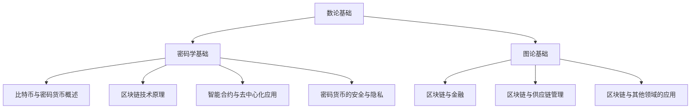

                 

### 文章标题

《数学与密码货币：区块链技术的数学原理》

### 关键词

数学、密码货币、区块链、数字货币、加密技术、密码学、共识算法、智能合约、图论

### 摘要

本文深入探讨了数学在密码货币和区块链技术中的关键作用。通过解析数论、密码学、图论等数学基础，我们揭示了这些原理如何构建起密码货币和区块链技术的核心。文章首先介绍了数学与密码货币的关系和区块链技术的重要性，接着详细解释了数论、密码学和图论的基本概念与联系，并通过具体的算法原理讲解和实际案例研究，展示了数学在密码货币和区块链中的应用。最后，本文总结了数学在区块链领域的重要作用，并提供了未来研究的方向和拓展阅读资源。

---

## 引言

数学，作为一门精确的科学，不仅在传统领域中扮演着重要角色，还在现代科技发展中展现出了前所未有的力量。随着互联网和计算机技术的飞速发展，密码货币和区块链技术逐渐崭露头角，成为金融、供应链管理、物联网等多个领域的重要创新。而这一切，离不开数学的深厚支撑。

### 数学与密码货币的关系

数学在密码货币的发展中起到了至关重要的作用。密码货币，如比特币，是基于加密技术的去中心化数字货币，其安全性和可靠性依赖于强大的数学算法。例如，比特币采用的SHA-256哈希算法，通过数学原理确保了交易记录的唯一性和不可篡改性。数论中的大素数定理和非对称加密算法的结合，为密码货币的安全性提供了坚实的理论基础。

### 区块链技术在现代金融中的地位

区块链技术作为密码货币的底层技术，已经不仅仅局限于金融领域。它通过分布式账本和智能合约技术，为金融交易、供应链管理、身份验证等多个领域提供了高效、透明、安全的解决方案。数学原理在这些应用中起到了关键作用，如共识算法、图论中的网络拓扑结构等，为区块链技术的稳定性和效率提供了保障。

### 数学原理在区块链中的应用

数学原理在区块链技术中无处不在。从基础的哈希函数、公钥加密，到复杂的共识算法和图论模型，每一个环节都离不开数学的支持。本文将逐步深入这些数学原理，并通过实际案例，展示其在区块链技术中的应用和重要性。

## 第1部分：数学基础

### 第1章：数论基础

数论是数学的一个分支，研究整数及其性质。在密码货币和区块链技术中，数论的应用尤为广泛。

#### 1.1 数论基本概念

数论中的基本概念包括素数、合数、质数、合数、互质、同余等。这些概念构成了数论的理论基础。

#### 1.2 大素数定理

大素数定理是数论中的一个重要结论，表明存在无穷多个大素数。这一定理对于密码货币的安全性具有重要意义。

$$
p(n) \approx \frac{n}{\log n}
$$

#### 1.3 同余与模运算

同余是数论中的一个重要概念，表示两个整数除以同一个正整数后的余数相等。模运算则是同余运算的一种实现方式。

### 第2章：密码学基础

密码学是研究如何保护信息传输安全的学科。在密码货币和区块链技术中，密码学发挥着至关重要的作用。

#### 2.1 密码学基本概念

密码学的基本概念包括加密、解密、密钥、加密算法等。加密是将明文转换为密文的过程，解密则是将密文还原为明文。

#### 2.2 对称加密与非对称加密

对称加密和非对称加密是密码学的两种基本加密方式。对称加密使用相同的密钥进行加密和解密，而非对称加密则使用一对密钥，一个用于加密，另一个用于解密。

#### 2.3 哈希函数与数字签名

哈希函数是将任意长度的输入数据映射为固定长度的输出数据的函数。数字签名则是一种利用密码学原理验证数据真实性和完整性的技术。

### 第3章：图论基础

图论是研究图形结构的数学分支，在区块链技术中有着广泛的应用。

#### 3.1 图的基本概念

图的基本概念包括顶点、边、路径、连通性等。图论中的基本概念是理解区块链网络结构的基础。

#### 3.2 树与网络

树和网络是图论中的重要概念。树是一种特殊的图，具有层级结构，而网络则表示多个节点之间的相互连接。

#### 3.3 最短路径算法

最短路径算法是图论中的一个重要算法，用于寻找图中两点之间的最短路径。在区块链网络中，最短路径算法有助于优化网络传输效率和数据可靠性。

---

## 第2部分：密码货币与区块链技术

### 第4章：比特币与密码货币概述

比特币是第一个实现去中心化数字货币的密码货币，其诞生标志着数字货币时代的到来。

#### 4.1 比特币的产生背景

比特币的诞生源于对传统金融体系的质疑和对去中心化、安全、匿名性的追求。

#### 4.2 比特币的运行机制

比特币的运行机制基于区块链技术，包括挖矿、交易、共识算法等核心组成部分。

#### 4.3 其他知名密码货币介绍

除了比特币，还有许多其他知名的密码货币，如以太坊、莱特币、瑞波币等，它们在技术和应用上也各有特点。

### 第5章：区块链技术原理

区块链技术是密码货币的核心技术，其原理和结构决定了密码货币的安全性、透明性和去中心化。

#### 5.1 区块链的基本概念

区块链是一种分布式账本技术，通过密码学和共识算法实现数据的存储和传输。

#### 5.2 区块链的运行机制

区块链的运行机制包括区块、链、节点、挖矿、共识算法等核心组成部分。

#### 5.3 共识算法

共识算法是区块链技术的核心，决定了区块链网络中的数据一致性和安全性。

### 第6章：智能合约与去中心化应用

智能合约是区块链技术的一个重要应用，它通过编程实现了去中心化的自动化交易和合约执行。

#### 6.1 智能合约的定义

智能合约是一种基于区块链技术的计算机程序，能够在满足特定条件时自动执行合约条款。

#### 6.2 智能合约的实现

智能合约的实现涉及到编程语言、区块链平台和开发工具等多个方面。

#### 6.3 去中心化应用的案例研究

去中心化应用（DApp）是智能合约的具体应用场景，包括金融、游戏、社交等多个领域。

### 第7章：密码货币的安全与隐私

密码货币的安全性和隐私性是用户最为关注的两个方面。

#### 7.1 密码货币面临的安全挑战

密码货币面临的安全挑战包括黑客攻击、双花攻击、隐私泄露等。

#### 7.2 安全防护措施

为了提高密码货币的安全性，采取了一系列防护措施，如多重签名、冷存储、网络隔离等。

#### 7.3 隐私保护技术

隐私保护技术包括匿名交易、混合交易、零知识证明等，用于保护用户的隐私。

---

## 第3部分：数学在区块链应用中的案例研究

### 第8章：区块链与金融

区块链技术在金融领域的应用正日益扩大，从支付系统到证券交易，区块链为金融行业带来了革命性的改变。

#### 8.1 区块链在金融领域的应用

区块链在金融领域的应用包括跨境支付、供应链金融、数字身份认证等。

#### 8.2 金融交易中的数学原理

金融交易中的数学原理包括风险管理、市场预测、数据加密等。

#### 8.3 案例分析

以比特币期货交易为例，分析区块链技术在金融交易中的应用和数学原理。

### 第9章：区块链与供应链管理

区块链技术在供应链管理中具有巨大的潜力，通过透明、可追溯的分布式账本，提高了供应链的效率和透明度。

#### 9.1 区块链在供应链管理中的作用

区块链在供应链管理中的作用包括产品溯源、订单管理、物流跟踪等。

#### 9.2 供应链中的数学原理

供应链中的数学原理包括优化算法、网络拓扑结构、数据加密等。

#### 9.3 案例分析

以某全球知名零售商的供应链管理为例，分析区块链技术在供应链中的应用和数学原理。

### 第10章：区块链与其他领域的应用

区块链技术不仅仅局限于金融和供应链管理，还在许多其他领域展现出了巨大的应用潜力。

#### 10.1 区块链在其他领域的应用

区块链在其他领域的应用包括物联网、医疗健康、艺术品交易等。

#### 10.2 区块链与物联网

区块链与物联网的结合，为物联网设备的数据管理和安全提供了新的解决方案。

#### 10.3 案例分析

以某智能城市项目为例，分析区块链技术在物联网中的应用和数学原理。

---

## 附录

### 附录A：相关数学公式和算法

附录A中列出了本文中涉及的相关数学公式和算法，包括数论公式、密码学算法、共识算法等。

### 附录B：推荐阅读和资源

附录B提供了更多的阅读材料和资源，包括书籍、论文、在线课程等，供读者进一步学习和研究。

## Mermaid 流程图

### 作者

作者：AI天才研究院/AI Genius Institute & 禅与计算机程序设计艺术 /Zen And The Art of Computer Programming

---

本文从数学与密码货币的关系、数学基础、密码货币与区块链技术、数学在区块链应用中的案例研究等方面，深入探讨了数学在密码货币和区块链技术中的重要性。通过详细的讲解和实际案例分析，展示了数学原理在区块链技术中的关键作用。未来，随着区块链技术的不断发展，数学在其中的应用将更加广泛，为区块链技术提供更强大的理论支持和实践指导。

