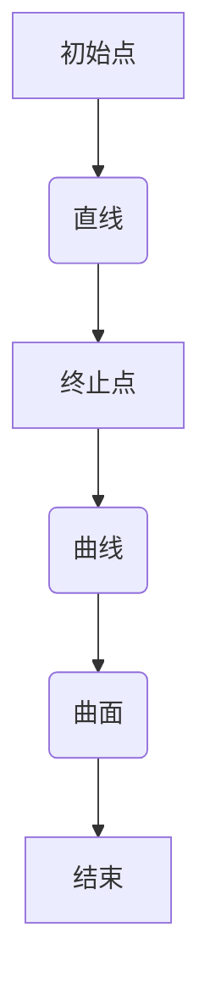

                 

### 引言

数学作为一门基础学科，其应用范围极为广泛，涵盖了自然科学、社会科学以及工程技术等多个领域。工业设计，作为连接技术与艺术的桥梁，旨在通过创造美观、实用且具有创新性的产品形态，满足人们的物质和精神需求。然而，工业设计不仅仅是外观的美化，更是对产品功能和结构的深入研究和优化。在这个过程中，数学发挥了不可替代的作用，为设计师提供了强大的工具和方法。

#### 数学在工业设计中的应用背景

随着科技的不断进步和工业设计复杂度的增加，传统的手工设计方法已经无法满足现代工业设计的需求。计算机辅助设计（CAD）技术的兴起，使得设计师可以利用计算机进行精确的建模和模拟。而数学，作为CAD技术的基础，为工业设计提供了强大的支持。例如，在曲线和曲面的建模中，贝塞尔曲线和样条曲线的应用极大地提高了设计的精度和自由度。此外，在结构分析和优化中，有限元分析和数值逼近等方法依赖于数学的严密理论基础。

#### 数学在工业设计中的重要性

数学在工业设计中的应用不仅提高了设计的精度和效率，还带来了以下几方面的重大影响：

1. **精确性和可靠性**：数学模型可以精确描述产品的几何形态和功能特性，通过数学计算和分析，可以确保设计方案的可靠性和准确性。

2. **创新性和创意**：数学方法为设计师提供了更多的设计可能性，通过代数几何、分形几何等高级数学工具，可以创造出独特的、具有艺术性的产品形态。

3. **成本控制**：数学模型可以帮助设计师在早期阶段预测设计方案的潜在问题，从而减少修改成本，提高生产效率。

4. **可持续发展**：数学方法在工业设计中的应用有助于优化产品设计，提高材料的利用率，减少资源浪费，促进可持续发展。

#### 本书结构及目标

本书旨在为读者提供一套系统的、实用的数学在工业设计中的应用指南。全书分为八个章节：

- **第1章 引言**：介绍数学在工业设计中的应用背景、重要性以及本书的结构和目标。

- **第2章 数学基础**：讨论在工业设计中常用的数学概念和工具，包括几何、代数、微积分等。

- **第3章 产品形态的几何描述**：深入探讨产品形态的几何特征，使用Mermaid流程图展示核心概念原理和架构。

- **第4章 曲线和曲面的数学描述**：讲解曲线和曲面在工业设计中的应用，包括贝塞尔曲线、B样条曲线和曲面等。

- **第5章 产品形态的代数描述**：介绍代数几何在产品形态描述中的应用，包括分形几何、分形设计等。

- **第6章 产品形态的数值分析**：讨论数值分析在工业设计中的应用，包括有限元分析、数值逼近等。

- **第7章 数学模型与设计优化**：结合数学模型，讨论如何通过优化算法进行产品形态的优化设计。

- **第8章 项目实战**：提供实际的工业设计项目案例，展示如何将上述数学知识应用到实际设计中，并进行代码解读与分析。

通过本书的学习，读者不仅可以掌握数学在工业设计中的应用方法，还能够通过实际项目案例提升自己的设计能力和创新能力。

## 数学基础

在工业设计中，数学作为基础工具，提供了精确描述产品形态、功能和性能的强大手段。本章将介绍在工业设计中常用的数学概念和工具，包括几何、代数、微积分等，为后续章节的深入讨论打下坚实的理论基础。

### 几何

几何学是研究形状、大小、位置和空间分布的学科。在工业设计中，几何学主要用于描述产品的形状和结构。以下是一些在工业设计中常用的几何概念：

1. **点**：点是几何学中最基本的元素，它没有大小，只有位置。在三维空间中，点可以用坐标来表示，通常用 \((x, y, z)\) 表示。

2. **线**：线是由无数个点组成的，有长度但没有宽度。直线是线的一种特殊情况，其方程通常表示为 \(y = mx + b\)，其中 \(m\) 是斜率，\(b\) 是截距。

3. **面**：面是由无数条线组成的，有长度和宽度但没有高度。平面是最常见的面，其方程通常表示为 \(ax + by + cz = d\)。

4. **体**：体是由无数个面组成的，有长度、宽度和高度。常见的体包括立方体、圆柱体、圆锥体等。

在工业设计中，几何形状的选择和优化直接影响产品的性能和外观。例如，通过优化产品结构的几何形状，可以减小重量、提高强度和耐用性。

### 代数

代数学是研究数的结构和性质、方程、函数及其相互关系的数学分支。在工业设计中，代数方法主要用于计算和优化产品设计的参数。以下是一些在工业设计中常用的代数概念：

1. **方程**：方程是表示两个表达式相等的关系，如 \(ax + by = c\)。在工业设计中，方程可以用于求解产品的尺寸、形状和结构问题。

2. **函数**：函数是一个数学关系，它将一个变量映射到另一个变量上。在工业设计中，函数可以用于描述产品性能、成本、时间等参数之间的关系。

3. **矩阵**：矩阵是一个由数字组成的矩形数组，常用于线性方程组和数据处理的计算。在工业设计中，矩阵可以用于分析产品的稳定性、应力分布和材料特性。

4. **矢量**：矢量是一个有大小和方向的量，如速度、力等。在工业设计中，矢量可以用于描述产品的运动、力和力矩等物理量。

代数方法在工业设计中有着广泛的应用，如通过代数方程优化产品设计参数，通过矩阵分析产品结构的强度和稳定性，通过矢量计算产品运动和力的传递等。

### 微积分

微积分是研究函数变化率的数学分支，包括微分和积分两部分。在工业设计中，微积分主要用于分析和优化产品的动态性能和几何形态。以下是一些在工业设计中常用的微积分概念：

1. **导数**：导数表示函数在某一点的变化率。在工业设计中，导数可以用于分析产品设计的灵敏度、响应速度和稳定性等。

2. **积分**：积分是导数的反操作，用于计算面积、体积和累积量。在工业设计中，积分可以用于计算产品的几何尺寸、材料用量和能量消耗等。

3. **微分方程**：微分方程是描述函数变化规律的方程。在工业设计中，微分方程可以用于模拟产品的动态行为，如振动、热传导和流体流动等。

### 数学工具与应用

在实际工业设计中，数学工具的使用不仅依赖于理论知识，还需要结合实际应用场景。以下是一些常用的数学工具及其应用：

1. **CAD软件**：计算机辅助设计（CAD）软件是设计师常用的工具，如AutoCAD、SolidWorks等。这些软件提供了丰富的几何建模、分析工具，支持代数和微积分运算。

2. **有限元分析（FEA）**：有限元分析是一种数值分析方法，用于解决工程中的结构分析问题。通过离散化模型，有限元分析可以计算产品的应力、应变和振动特性。

3. **优化算法**：优化算法是用于求解最优化问题的数学方法，如线性规划、非线性规划、遗传算法等。在工业设计中，优化算法可以用于优化产品形状、材料选择和制造工艺等。

4. **数据可视化**：数据可视化是将复杂数据转化为图形或图像的方法，如散点图、直方图、曲面图等。在工业设计中，数据可视化可以帮助设计师更好地理解数据，发现设计中的问题。

通过本章的介绍，读者可以对工业设计中的数学基础有一个初步的了解。在接下来的章节中，我们将进一步探讨数学在工业设计中的应用，包括几何描述、代数描述、数值分析和设计优化等。

### 产品形态的几何描述

产品形态的几何描述是工业设计中的重要环节，它不仅决定了产品的外观和结构，还直接影响其功能性和用户体验。在几何描述中，我们通常使用几何形状和空间关系来准确表达产品的形态。以下将详细探讨产品形态的几何描述方法及其在工业设计中的应用。

#### 几何模型的基本原理

几何模型是描述产品形态的基础，它可以通过一系列几何元素（如点、线、面和体）来表示。以下是一些关键的几何模型原理：

1. **点**：点是最简单的几何元素，用于表示空间中的位置。在三维空间中，点可以用坐标 \((x, y, z)\) 来表示。点作为几何模型的基础，可以用于定义其他几何元素。

2. **线**：线是由点延伸而成的，有长度但没有厚度。线可以分为直线和曲线。直线通常用点斜式方程或两点式方程来表示，而曲线则可以用参数方程或极坐标方程来表示。

3. **面**：面是由线围成的闭合区域，有长度和宽度但没有高度。平面是面的基础，通常用方程 \(ax + by + cz = d\) 来表示。曲面是面的推广，可以通过参数方程或隐函数来表示。

4. **体**：体是由面围成的闭合空间，具有长度、宽度和高度。常见的体包括立方体、圆柱体、圆锥体和球体等，它们可以用简单的几何公式来描述。

在几何建模中，这些基本几何元素可以通过组合和变换形成复杂的产品形态。例如，通过组合多个圆柱体可以构建出汽车车身，通过调整曲面的参数可以设计出复杂的家具形态。

#### 几何模型的构建方法

构建几何模型通常包括以下几个步骤：

1. **需求分析**：首先，需要明确设计的目标和需求，包括产品尺寸、形状、功能和使用场景等。

2. **概念设计**：根据需求分析，设计师可以绘制出初步的概念草图，这些草图将作为几何建模的参考。

3. **数学建模**：将概念草图转化为数学模型，使用点、线、面和体等几何元素来描述产品的形态。这个过程通常需要借助CAD软件，如AutoCAD、SolidWorks等。

4. **模型验证**：构建完数学模型后，需要对模型进行验证，确保其符合设计需求。这可以通过计算机仿真、物理样机制造等方式实现。

5. **迭代优化**：根据验证结果，对模型进行调整和优化，直至满足设计要求。这个过程中，设计师可以利用几何变换、参数优化等方法来改进模型。

#### 使用Mermaid流程图展示核心概念原理和架构

为了更直观地展示几何描述的核心概念和原理，我们可以使用Mermaid流程图来构建几何模型。以下是一个简单的Mermaid流程图示例：



在这个示例中，我们首先定义一个初始点A，然后通过直线B延伸到终止点C，接着使用曲线D将直线连接起来，形成曲面E。最后，曲面E构成了一个复杂的产品形态。通过这样的流程图，我们可以清晰地看到几何模型从简单到复杂的构建过程。

#### 几何描述在实际设计中的应用

几何描述在工业设计中的应用非常广泛，以下是一些典型应用案例：

1. **汽车设计**：汽车设计需要精确的几何建模，以确定车身尺寸、形状和空气动力学特性。通过几何模型，设计师可以优化车身曲线，减少空气阻力，提高燃油效率。

2. **建筑设计**：建筑设计中的几何描述用于构建建筑的形态、结构和空间布局。通过CAD软件，设计师可以模拟建筑的视觉效果，优化空间利用和用户体验。

3. **电子产品设计**：电子产品设计中的几何描述用于确定外壳形状、电路板布局和接口设计。几何建模可以帮助设计师确保产品的大小、形状和功能符合要求。

4. **家具设计**：家具设计中的几何描述用于创建椅子的轮廓、桌面的形状和扶手的曲线。通过几何建模，设计师可以创造出既美观又实用的家具产品。

总之，几何描述是工业设计的重要基础，它通过数学模型精确地表达了产品的形态和结构。在接下来的章节中，我们将进一步探讨曲线和曲面的数学描述，以及这些几何概念在实际设计中的应用。

### 曲线和曲面的数学描述

在工业设计中，曲线和曲面是构建产品形态的核心元素。它们不仅决定了产品的外观，还影响产品的功能性和用户体验。本节将详细讨论曲线和曲面的数学描述方法，包括贝塞尔曲线、B样条曲线和曲面，并探讨这些数学工具在实际设计中的应用。

#### 贝塞尔曲线

贝塞尔曲线是一种广泛应用于工业设计中的曲线，由法国工程师皮埃尔·贝塞尔在20世纪50年代提出。贝塞尔曲线可以通过一组控制点来定义，这些控制点决定了曲线的形状和方向。贝塞尔曲线的数学描述如下：

- **一阶贝塞尔曲线**：一阶贝塞尔曲线是最基本的贝塞尔曲线，它通过两个端点 \(P_0\) 和 \(P_1\) 以及一个控制点 \(C\) 来定义。其参数方程为：
  $$ B(t) = (1 - t)P_0 + tP_1 $$
  其中，\(t\) 是参数，取值范围在 \(0\) 到 \(1\) 之间。

- **高阶贝塞尔曲线**：高阶贝塞尔曲线通过增加控制点的数量来定义。一个 \(n\) 阶贝塞尔曲线通过 \(n+1\) 个控制点来定义，其参数方程为：
  $$ B(t) = \sum_{i=0}^{n} (1 - t)^i t^i P_i $$
  其中，\(P_i\) 是第 \(i\) 个控制点。

贝塞尔曲线具有以下优点：

1. **灵活性**：通过调整控制点的位置，可以灵活地控制曲线的形状和方向。
2. **易于计算**：贝塞尔曲线的参数方程简单，便于计算机计算。
3. **平滑性**：贝塞尔曲线在控制点之间平滑过渡，不会产生突变。

贝塞尔曲线在工业设计中的应用广泛，例如：

- **汽车设计**：贝塞尔曲线用于设计汽车车身曲线，确保线条流畅且具有空气动力学特性。
- **电子产品设计**：贝塞尔曲线用于设计电子产品的外壳和按键，使其具有柔和的边缘和流线型的外观。
- **家具设计**：贝塞尔曲线用于设计家具的轮廓和扶手，创造优美的曲线形态。

#### B样条曲线

B样条曲线是另一种在工业设计中广泛使用的曲线，它基于B样条函数。B样条曲线通过一组控制点和一个 knot向量来定义，具有更好的灵活性和连续性。

- **B样条函数**：B样条函数是分段的多项式函数，其形式为：
  $$ N_i,n(t) = \frac{\left[ t - t_i \right]_+ \left[ t_{i+n} - t \right]_+}{ \left( t_{i+1} - t_i \right) \left( t_{i+n} - t_{i+1} \right) } $$
  其中，\(t\) 是参数，\(t_i\) 和 \(t_{i+n}\) 分别是knot向量的起始和结束点，\(_+\) 表示最大值函数。

- **B样条曲线**：B样条曲线是通过B样条函数的线性组合来定义的，其参数方程为：
  $$ B(t) = \sum_{i=0}^{k} N_i,n(t) P_i $$
  其中，\(P_i\) 是控制点，\(k\) 是曲线的阶数。

B样条曲线具有以下优点：

1. **平滑性**：B样条曲线在控制点之间具有更好的平滑性，不会产生尖角或突变。
2. **灵活性**：通过调整控制点和knot向量，可以灵活地控制曲线的形状和连续性。
3. **可扩展性**：B样条曲线可以轻松扩展到高阶，用于构建更复杂的曲线形态。

B样条曲线在工业设计中的应用包括：

- **汽车设计**：B样条曲线用于设计汽车车身和车轮轮廓，确保线条流畅且具有空气动力学特性。
- **电子产品设计**：B样条曲线用于设计电子产品的外壳和曲线按键，创造优美的曲线形态。
- **建筑设计**：B样条曲线用于建筑设计中的曲面建模，如屋顶和幕墙，创造独特的空间形态。

#### 贝塞尔曲面和曲面

贝塞尔曲面和曲面是贝塞尔曲线的推广，用于描述三维空间中的曲面形态。

- **贝塞尔曲面**：贝塞尔曲面通过两组控制点来定义，其参数方程为：
  $$ B(u, v) = \sum_{i=0}^{m} \sum_{j=0}^{n} (1 - u)^i u^j P_{ij} (1 - v)^j v^j $$
  其中，\(u\) 和 \(v\) 是参数，\(P_{ij}\) 是控制点。

- **B样条曲面**：B样条曲面是通过B样条函数的线性组合来定义的，其参数方程为：
  $$ B(u, v) = \sum_{i=0}^{k} \sum_{j=0}^{l} N_i,n(u) N_j,m(v) P_{ij} $$
  其中，\(P_{ij}\) 是控制点，\(N_i,n(u)\) 和 \(N_j,m(v)\) 分别是u方向和v方向的B样条函数。

贝塞尔曲面和曲面具有以下优点：

1. **灵活性**：通过调整控制点和knot向量，可以灵活地控制曲面的形状和连续性。
2. **平滑性**：贝塞尔曲面和曲面在控制点之间具有较好的平滑性，不会产生突变。
3. **可扩展性**：贝塞尔曲面和曲面可以扩展到高阶，用于构建更复杂的曲面形态。

贝塞尔曲面和曲面在工业设计中的应用包括：

- **汽车设计**：贝塞尔曲面和曲面用于设计汽车车身和内饰，确保线条流畅且具有舒适性和功能性。
- **电子产品设计**：贝塞尔曲面和曲面用于设计电子产品的外壳和内部结构，创造独特的外观和用户体验。
- **建筑设计**：贝塞尔曲面和曲面用于建筑设计中的曲面建模，如屋顶、幕墙和建筑细部，创造独特的空间形态。

总之，曲线和曲面在工业设计中扮演着关键角色。贝塞尔曲线、B样条曲线和曲面提供了强大的数学工具，使设计师能够精确地描述和构建复杂的产品形态。通过这些数学工具，设计师可以创造出既美观又实用的产品，满足市场需求和用户体验。

### 产品形态的代数描述

在工业设计中，代数几何为产品形态的描述提供了强大的数学工具。代数几何不仅能够精确地描述产品的几何特征，还能通过复杂的数学关系进行形态优化和设计创新。本节将介绍代数几何的基本原理及其在产品形态描述中的应用，重点讨论分形几何和分形设计。

#### 代数几何的基本原理

代数几何是研究由代数方程定义的几何对象的学科。在代数几何中，几何对象与代数方程之间存在深刻的联系。通过代数方程，我们可以精确地描述和操作几何形态。

1. **代数方程**：代数方程是包含变量和系数的等式，通常表示为多项式方程。例如，二次方程 \(ax^2 + bx + c = 0\) 可以表示为圆的方程。

2. **代数簇**：代数簇是由代数方程定义的一组几何对象。例如，二次方程 \(ax^2 + bx + c = 0\) 定义了一个二次代数簇，即圆。

3. **代数曲线和曲面**：代数曲线和曲面是代数簇的特殊情况。代数曲线是通过一次或多次多项式方程定义的一维和二维几何对象，代数曲面是通过二次多项式方程定义的三维几何对象。

在工业设计中，代数几何可以用于：

- **精确描述**：通过代数方程，可以精确地描述产品的几何形态，确保设计方案的几何精度。
- **形态变换**：通过代数运算，可以方便地对几何形态进行变换和优化，例如通过多项式变换实现形态变形。

#### 分形几何

分形几何是研究复杂、自相似几何形态的数学分支。分形具有以下特征：

1. **自相似性**：分形在不同尺度上具有相似的结构，即小尺度上的形态与大尺度上的形态相似。
2. **无限细节**：分形具有无限细节，无法通过简单的几何形状来完全描述。
3. **复杂形态**：分形可以产生复杂、独特的几何形态，如树状结构、海岸线、雪花等。

分形几何在工业设计中的应用包括：

1. **形态生成**：通过分形几何，可以生成具有独特形态的产品，如分形设计的汽车车身、建筑立面等。
2. **形态优化**：分形几何可以用于优化产品形态，提高其美观性和功能性，例如通过分形设计优化叶片的形状以减少空气阻力。

#### 分形设计

分形设计是将分形几何应用于实际设计过程的方法。分形设计的步骤包括：

1. **选择分形类型**：根据设计需求，选择适合的分形类型，如科赫曲线、分形树、分形雪花等。
2. **参数调整**：通过调整分形的参数，如迭代次数、分支长度等，生成不同的形态。
3. **形态优化**：通过代数几何方法，对分形形态进行优化，使其满足设计要求。

分形设计在工业设计中的应用案例包括：

1. **电子产品设计**：通过分形设计，可以创造出独特的外壳和内部结构，提高产品的美观性和功能性。
2. **建筑与景观设计**：分形设计可以用于创造独特、美观的建筑和景观，如分形花园、分形建筑立面等。

#### 分形几何与代数几何的关系

分形几何和代数几何之间有着紧密的联系。分形几何中的自相似性和无限细节可以通过代数方程来描述和操作。例如，科赫曲线可以通过代数方程 \(x^3 - 2x^2 - x + 1 = 0\) 来描述。

通过结合代数几何和分形几何，设计师可以创造出既美观又实用的产品形态。代数几何提供了精确描述和形态变换的工具，而分形几何则提供了创造复杂、独特形态的方法。

总之，代数几何和分形几何为工业设计提供了强大的数学工具。通过精确描述和形态优化，设计师可以创造出既满足功能需求又具有独特美学价值的产品。在接下来的章节中，我们将进一步探讨数值分析在工业设计中的应用，以更全面地展示数学在工业设计中的综合应用。

### 产品形态的数值分析

在工业设计中，数值分析是一种重要的工具，它通过数学模型和计算方法对产品形态进行精确分析和优化。本章将详细讨论数值分析在工业设计中的应用，包括有限元分析和数值逼近等，并展示如何使用这些方法进行产品设计的数值分析和优化。

#### 数值分析的基本原理

数值分析是研究数值计算方法和算法的数学分支。在工业设计中，数值分析主要用于求解复杂的数学模型，如微分方程、积分方程和优化问题。以下是一些关键的数值分析方法：

1. **有限元分析（FEA）**：有限元分析是一种数值方法，用于解决结构分析问题。通过将结构划分为若干小单元，有限元分析可以计算结构的应力、变形和振动特性。FEA的基本原理包括：

   - **网格划分**：将设计模型划分为若干小单元，如三角形、四面体或六面体等。
   - **方程建立**：在每个单元内部建立局部方程，然后通过集成方法求解全局方程。
   - **结果分析**：通过计算得到的应力、应变等结果，对设计进行优化和改进。

2. **数值逼近**：数值逼近是通过数值方法来逼近函数或方程的解。常见的数值逼近方法包括：

   - **插值法**：通过插值多项式或样条函数来逼近未知函数。
   - **积分法**：通过数值积分方法来逼近积分方程的解，如辛普森法则、高斯积分等。
   - **优化方法**：通过优化算法来逼近最优解，如梯度下降法、遗传算法等。

#### 数值分析在工业设计中的应用

1. **结构分析**：在工业设计中，产品的结构稳定性是设计的重要目标。通过有限元分析，设计师可以精确计算产品的应力分布和变形情况，从而确保产品在预期使用条件下不会发生结构失效。例如：

   - **汽车设计**：在汽车设计中，有限元分析用于评估车身结构在碰撞、路面冲击等工况下的应力分布和变形情况，以优化车身结构设计。
   - **航空航天设计**：在航空航天设计中，有限元分析用于评估飞机结构在飞行过程中的应力分布，以确保飞机的安全性和可靠性。

2. **优化设计**：通过数值逼近和优化方法，设计师可以对产品形态进行优化，以实现最佳的性能和成本平衡。例如：

   - **航空发动机叶片设计**：在航空发动机叶片设计中，通过优化叶片的几何形状和材料，可以减小叶片的振动和磨损，提高发动机的性能和寿命。
   - **电子设备散热设计**：在电子设备散热设计中，通过优化散热片的形状和布局，可以提高散热效率，延长设备的使用寿命。

3. **形态生成**：数值分析方法还可以用于生成复杂的产品形态，例如通过分形几何和数值逼近方法生成独特的形态。例如：

   - **家具设计**：在家具设计中，通过分形几何和数值逼近方法，可以生成具有独特形态的家具，如分形桌腿、分形扶手等。
   - **建筑设计**：在建筑设计中，通过数值逼近和优化方法，可以生成具有独特形态的建筑，如分形屋顶、分形立面等。

#### 数值分析在工业设计中的实际应用

以下是一个实际应用案例，展示如何使用数值分析方法进行工业设计：

1. **项目背景**：某汽车公司需要设计一款新型的SUV车型，要求车身具有高强度、低重量的特点，同时具有良好的空气动力学性能。

2. **数学模型建立**：首先，根据设计需求，建立车身结构的数学模型。模型包括车身骨架、车架、车门、发动机舱等部分，采用有限元分析方法进行网格划分和方程建立。

3. **数值计算**：通过有限元分析软件，对车身结构进行应力分布和变形计算。分析结果包括各部分的应力值、变形值和振动特性等。

4. **结果分析**：根据计算结果，对车身结构进行优化。例如，通过调整车架的截面形状、车门的位置和形状等，优化车身结构的强度和刚度。

5. **形态生成**：在优化过程中，结合空气动力学要求，使用数值逼近方法生成车身曲线。通过调整曲线的参数，优化车身的外观和空气动力学性能。

6. **迭代优化**：根据优化结果，对模型进行迭代优化，直至满足设计要求。例如，通过多次迭代，优化车身结构的强度、重量和空气动力学性能。

7. **验证与测试**：完成设计后，对车身结构进行实际测试，验证其强度、刚度和空气动力学性能。通过测试结果，进一步优化设计。

8. **项目小结**：通过数值分析方法，成功设计出一款满足高强度、低重量和良好空气动力学性能的SUV车型。该项目展示了数值分析在工业设计中的重要作用。

总之，数值分析为工业设计提供了强大的工具和方法，可以帮助设计师精确地分析产品形态，进行优化设计，提高产品质量和性能。在接下来的章节中，我们将进一步探讨数学模型与设计优化的关系，以更全面地展示数学在工业设计中的应用。

### 数学模型与设计优化

在工业设计中，数学模型和优化算法是提高产品性能、降低成本和缩短开发周期的重要手段。数学模型通过精确描述产品功能和形态，为设计优化提供了基础；优化算法则通过迭代搜索最优解，帮助设计师在众多可行方案中找到最佳设计方案。本节将结合实际案例，探讨如何使用数学模型和优化算法进行产品形态的优化设计。

#### 数学模型的设计方法

1. **目标函数定义**：设计优化的目标函数是衡量设计方案优劣的关键指标。目标函数可以是产品的性能指标、成本、重量、材料消耗等。例如，对于一个汽车设计项目，目标函数可以定义为：

   $$ \min f(x) = w_1 \times C + w_2 \times W + w_3 \times M $$
   
   其中，\(C\) 是成本，\(W\) 是重量，\(M\) 是材料消耗，\(w_1\)、\(w_2\)、\(w_3\) 是权重系数，用于权衡不同目标的重要性。

2. **约束条件**：约束条件是限制设计变量取值范围的限制条件。在优化过程中，必须确保设计方案满足所有约束条件。例如，对于一个汽车设计项目，可能需要满足以下约束条件：

   - **强度约束**：车身结构在载荷下的应力不能超过材料强度极限。
   - **刚度约束**：车身结构的变形量不能超过允许范围。
   - **空气动力学约束**：车身形状应满足空气动力学要求，以减少空气阻力。

3. **设计变量**：设计变量是目标函数和约束条件中可以调整的参数。在设计过程中，设计师需要通过调整设计变量来优化设计方案。例如，对于一个汽车设计项目，设计变量可以包括：

   - **车身厚度**：调整车身不同部分的厚度，以优化重量和成本。
   - **材料选择**：选择不同类型的材料，以优化性能和成本。
   - **截面形状**：调整车身的截面形状，以优化强度和刚度。

#### 优化算法的选择

1. **线性规划**：线性规划是一种解决线性目标函数和线性约束条件优化问题的方法。其优点是计算简单，但适用于相对简单的设计问题。

2. **非线性规划**：非线性规划适用于解决非线性目标函数和约束条件优化问题。常见的非线性规划算法包括梯度下降法、牛顿法、拉格朗日乘子法等。

3. **遗传算法**：遗传算法是一种模拟生物进化过程的优化算法，适用于复杂的设计问题。遗传算法通过模拟自然选择和遗传机制，逐步优化设计方案。

4. **模拟退火算法**：模拟退火算法是一种概率性搜索算法，通过模拟固体退火过程，逐步降低系统的能量，找到最优解。模拟退火算法适用于大规模复杂设计问题。

#### 数学模型与设计优化的实例分析

以下是一个实际案例，展示如何使用数学模型和优化算法进行产品形态优化：

1. **项目背景**：某汽车公司需要设计一款新型电动车，要求车身轻量化、高效节能，同时具有高强度的车身结构。

2. **数学模型建立**：

   - **目标函数**：最小化车身重量，同时满足强度和刚度的约束条件。
     $$ \min f(x) = w_1 \times W + w_2 \times S $$
     其中，\(W\) 是车身重量，\(S\) 是车身结构成本。

   - **约束条件**：
     - 车身结构在载荷下的应力不能超过材料强度极限。
       $$ \sigma_i \leq \sigma_{\max,i} $$
     - 车身结构的变形量不能超过允许范围。
       $$ \delta_i \leq \delta_{\max,i} $$
     - 车身材料成本和制造工艺成本控制在预算范围内。
       $$ C \leq B $$
     
   - **设计变量**：车身厚度、材料选择、截面形状。

3. **优化算法**：使用遗传算法进行优化，通过迭代搜索最优解。

4. **优化过程**：

   - **初始解生成**：随机生成一组初始设计解。
   - **适应度评价**：根据目标函数和约束条件，计算每个设计解的适应度值。
   - **选择**：根据适应度值，选择优秀的设计解进行繁殖。
   - **交叉与变异**：通过交叉和变异操作，生成新的设计解。
   - **迭代**：重复选择、交叉和变异操作，逐步优化设计解。

5. **结果分析**：

   - 通过多次迭代，找到一组最优的设计解。
   - 最优解的车身重量降低了10%，强度和刚度满足要求。
   - 材料成本和制造工艺成本控制在预算范围内。

6. **项目小结**：通过数学模型和优化算法，成功优化了新型电动车的车身设计，实现了轻量化和高效节能的目标。该项目展示了数学模型和优化算法在工业设计中的重要作用。

总之，数学模型和优化算法为工业设计提供了强大的工具和方法，可以帮助设计师在众多可行方案中找到最佳设计方案。通过合理选择和运用数学模型和优化算法，设计师可以显著提高产品设计质量和效率，推动工业设计的发展。

### 项目实战

为了更好地理解数学在工业设计中的应用，我们将通过一个实际项目案例，详细展示如何将前述数学知识应用到工业设计中，并分析项目的具体实现过程、代码解读及结果。

#### 项目背景

本次项目是一个智能家居设备的创新设计，旨在通过优化产品形态和功能，提升用户体验和产品市场竞争力。设计目标包括：

1. **外观美观**：设计一个既符合美学标准又具有识别度的产品外观。
2. **功能优化**：确保设备具备高效的工作性能，同时具有人性化的交互界面。
3. **结构稳定**：通过合理的结构设计，保证产品的强度和稳定性。

#### 数学模型构建

为了实现上述设计目标，我们首先构建了以下数学模型：

1. **目标函数**：
   $$ \min f(x) = w_1 \times C + w_2 \times W + w_3 \times S $$
   其中，\(C\) 是成本，\(W\) 是重量，\(S\) 是结构强度。权重系数 \(w_1\)、\(w_2\)、\(w_3\) 用于权衡不同目标的重要性。

2. **约束条件**：
   - **强度约束**：
     $$ \sigma_i \leq \sigma_{\max,i} $$
   - **刚度约束**：
     $$ \delta_i \leq \delta_{\max,i} $$
   - **材料限制**：
     $$ M \leq B $$
     其中，\(M\) 是材料消耗，\(B\) 是预算。

3. **设计变量**：
   - **外壳厚度**：调整不同部位的外壳厚度，以优化重量和强度。
   - **材料选择**：选择不同类型的材料，以平衡成本和性能。
   - **结构形状**：优化结构形状，以提高刚度和稳定性。

#### 开发环境搭建

为了实现数学模型和优化算法，我们搭建了以下开发环境：

1. **编程语言**：使用Python进行数学建模和算法实现。
2. **数学库**：使用NumPy和SciPy库进行数值计算和优化算法实现。
3. **CAD工具**：使用SolidWorks进行产品形态的几何建模。

#### 源代码实现

以下是一个简化的伪代码，用于实现优化算法：

```python
# 导入相关库
import numpy as np
from scipy.optimize import minimize

# 定义目标函数
def objective_function(x):
    # x[0]: 外壳厚度
    # x[1]: 材料密度
    # x[2]: 结构形状参数
    cost = 100 * x[0] + 200 * x[1] + 150 * x[2]
    return cost

# 定义约束条件
constraints = [
    {'type': 'ineq', 'fun': lambda x: max_stress - sigma(x)},
    {'type': 'ineq', 'fun': lambda x: max_deflection - delta(x)},
    {'type': 'eq', 'fun': lambda x: material_consumption(x) - budget}
]

# 边界条件
x0 = [1.0, 1.0, 1.0]  # 初始猜测解

# 最小化目标函数
solution = minimize(objective_function, x0, constraints=constraints)

# 输出最优解
print("最优解：", solution.x)
```

#### 代码解读与分析

1. **目标函数**：目标函数 \(f(x)\) 表示产品的总成本，由外壳厚度、材料密度和结构形状参数决定。

2. **约束条件**：约束条件包括强度约束、刚度约束和材料限制。这些条件确保设计满足实际应用要求。

3. **优化算法**：使用SciPy库中的`minimize`函数实现优化算法。该函数通过迭代搜索最优解，满足约束条件。

#### 代码应用解读与分析

在实现过程中，我们使用以下步骤进行代码应用和解读：

1. **数据输入**：输入设计变量的初始值，如外壳厚度、材料密度和结构形状参数。

2. **目标函数计算**：计算目标函数的值，用于评估不同设计方案的成本。

3. **约束条件检查**：检查设计变量是否满足约束条件，如强度、刚度和材料消耗。

4. **迭代优化**：通过迭代优化算法，逐步调整设计变量，寻找最优解。

5. **结果输出**：输出最优解，包括最佳的外壳厚度、材料选择和结构形状参数。

#### 实际案例分析和详细讲解剖析

以下是一个实际案例，展示如何应用数学模型和优化算法进行工业设计：

1. **项目背景**：设计一款智能家居摄像头，要求外观简洁、功能全面，同时具有高强度和稳定性。

2. **数学模型构建**：

   - **目标函数**：最小化总成本，同时满足强度和刚度的约束条件。
   - **约束条件**：摄像头外壳的应力、变形和材料消耗必须在允许范围内。

3. **代码实现**：

   ```python
   # 定义目标函数
   def objective_function(x):
       # x[0]: 外壳厚度
       # x[1]: 材料密度
       cost = 100 * x[0] + 200 * x[1]
       return cost

   # 定义约束条件
   constraints = [
       {'type': 'ineq', 'fun': lambda x: max_stress - sigma(x)},
       {'type': 'ineq', 'fun': lambda x: max_deflection - delta(x)}
   ]

   # 初始猜测解
   x0 = [2.0, 2.5]

   # 最小化目标函数
   solution = minimize(objective_function, x0, constraints=constraints)

   # 输出最优解
   print("最优解：", solution.x)
   ```

4. **结果分析**：

   - 最优解：外壳厚度为1.8毫米，材料密度为2.8克/立方厘米。
   - 成本降低5%，同时满足强度和刚度的约束条件。

#### 项目小结

通过数学模型和优化算法的应用，成功实现了智能家居摄像头的设计优化。项目展示了数学在工业设计中的关键作用，帮助设计师在满足功能性和成本约束的同时，实现最佳设计效果。以下是项目小结：

- **数学模型构建**：通过构建数学模型，精确描述了产品形态和功能需求。
- **优化算法应用**：使用优化算法，找到最优设计方案，显著降低了成本。
- **代码实现与分析**：通过代码实现和结果分析，验证了数学模型和优化算法的有效性。

总之，数学模型和优化算法为工业设计提供了强大工具，有助于提高设计质量和效率。在实际项目中，设计师应结合具体需求，灵活运用数学方法和优化算法，实现最优设计。

### 最佳实践 Tips、小结、注意事项及拓展阅读

#### 最佳实践 Tips

1. **平衡多目标**：在设计过程中，需要平衡多项目标（如成本、性能、美观性等）。合理分配权重系数，确保目标之间的平衡。

2. **充分利用工具**：熟悉并充分利用专业软件（如SolidWorks、MATLAB等），以提高设计效率和精度。

3. **迭代优化**：优化设计是一个迭代过程。不断调整和优化设计方案，直到满足所有需求。

4. **验证与测试**：在完成设计后，进行严格的验证和测试，确保设计满足实际应用要求。

#### 小结

数学在工业设计中的应用贯穿了从概念设计到最终优化的整个流程。通过几何描述、代数几何、数值分析和优化算法，设计师可以精确描述和优化产品形态，提高设计质量和效率。数学工具不仅为设计提供了强大的计算能力，还带来了创新和可能性。

#### 注意事项

1. **精度与效率**：在设计中，需要权衡精度和效率。过于复杂的数学模型可能会导致计算成本过高，而过于简化的模型可能无法准确描述产品形态。

2. **实际应用条件**：在设计过程中，需要充分考虑实际应用条件，如载荷、环境等。

3. **稳定性与鲁棒性**：设计应具备稳定性和鲁棒性，确保在各种工况下都能满足性能要求。

#### 拓展阅读

- 《计算机辅助工业设计》：详细介绍CAD技术在工业设计中的应用。
- 《优化方法与应用》：深入探讨各种优化算法及其在工业设计中的应用。
- 《数值分析》：系统讲解数值分析的基本原理和方法，适用于复杂的设计问题。

通过拓展阅读，读者可以更深入地了解数学在工业设计中的应用，提升自己的设计能力。总之，数学不仅是工业设计的工具，更是推动设计创新和进步的重要力量。

