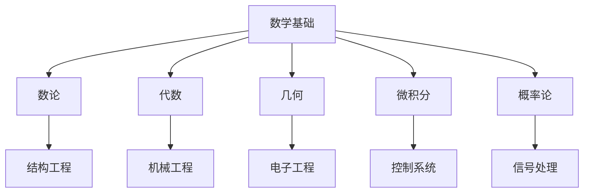

                 

# 《数学与工程学：应用数学在现实世界中的体现》

## 关键词

数学、工程学、应用数学、实际案例、算法原理、数学模型、LaTeX 公式、Mermaid 流程图。

## 摘要

本文旨在探讨数学在工程学中的应用，通过逐步分析推理，揭示数学原理如何在现实世界中体现。文章首先介绍了数学的基础概念和其在工程学中的重要性，接着深入探讨了核心算法原理和数学模型，并通过实际案例展示了数学在建筑、机械和电子工程等领域的应用。文章还提供了LaTeX数学公式和Mermaid流程图的实例，以增强理解和应用。最后，文章总结了数学与工程学的未来趋势和可能的研究方向。

## 引言

数学作为一门科学，其核心在于抽象、逻辑和推理。在工程学领域，数学扮演着至关重要的角色。从建筑结构到机械系统，从电子电路到复杂的算法设计，数学无处不在，为工程实践提供了坚实的理论基础。本文将通过一系列步骤，逐步揭示数学原理在现实世界工程学中的应用。

## 数学基础

### 第1章：数学概念与原理

#### 1.1 数学基础

数学是一门研究结构、空间、变化和信息的科学。在工程学中，数学的基础概念包括数论、代数、几何、微积分和概率论等。

- **数论**：研究整数的性质，如质数、因数分解、同余等。
- **代数**：研究数和运算的结构，如线性方程组、矩阵和向量等。
- **几何**：研究形状、大小和位置，如平面几何、空间几何等。
- **微积分**：研究变化率，如导数、积分、微分方程等。
- **概率论**：研究随机事件和不确定性，如概率分布、期望、方差等。

#### 1.2 数学在工程中的应用

数学在工程学中的应用广泛而深远。例如，在建筑结构设计中，数学用于计算材料的强度、结构的稳定性等；在机械工程中，数学用于建模和优化机械系统的性能；在电子工程中，数学用于分析电路和信号处理等。

#### 1.3 Mermaid 流程图：数学概念在工程中的应用



### 第2章：核心算法原理

#### 2.1 算法概述

算法是解决问题的步骤集合。在工程学中，算法用于解决复杂的计算问题，如优化、搜索、排序等。

#### 2.2 算法原理讲解（伪代码示例）

```python
Algorithm: 算法名称
Input: 输入参数
Output: 输出结果
1. 初始化变量
2. 循环执行以下步骤：
   a. 操作1
   b. 操作2
   c. 更新变量
3. 返回输出结果
```

#### 2.3 算法在工程中的应用

算法在工程学中的应用非常广泛。例如，在建筑设计中，算法用于优化结构材料的利用；在机械工程中，算法用于优化机械系统的性能；在电子工程中，算法用于信号处理和图像识别等。

### 第3章：数学模型与公式

#### 3.1 数学模型介绍

数学模型是现实世界问题的数学表达。它通过变量、方程和公式来描述问题的状态和变化。

#### 3.2 使用LaTeX展示数学公式

$$
E = mc^2
$$

$$
f(x) = x^2 + 2x + 1
$$

#### 3.3 数学公式在实际工程中的应用举例

- **结构工程**：应力分析公式

$$
\sigma = \frac{F}{A}
$$

- **机械工程**：运动学方程

$$
v = u + at
$$

- **电子工程**：欧姆定律

$$
V = IR
$$

## 工程应用

### 第4章：建筑与结构工程

#### 4.1 建筑工程中的数学应用

在建筑设计中，数学用于计算材料的强度、结构的稳定性等。

#### 4.2 结构工程的数学模型

结构工程的数学模型通常包括应力分析、振动分析、稳定性分析等。

#### 4.3 实际案例：建筑设计的数学分析

以一个简单的桥梁设计为例，使用数学模型进行结构应力和稳定性分析。

### 第5章：机械工程

#### 5.1 机械工程中的数学原理

机械工程中的数学原理包括运动学、动力学、力学等。

#### 5.2 机械系统的数学建模

机械系统的数学建模通常包括运动方程、力平衡方程等。

#### 5.3 机械工程中的数学公式应用

以机械臂的运动控制为例，展示数学公式在实际工程中的应用。

### 第6章：电子工程

#### 6.1 电子工程中的数学原理

电子工程中的数学原理包括电路理论、信号处理等。

#### 6.2 电子系统的数学模型

电子系统的数学模型通常包括电路方程、滤波器设计等。

#### 6.3 实际案例：电路分析的数学应用

以滤波器设计为例，展示数学在电子工程中的应用。

## 案例分析

### 第7章：案例分析

#### 7.1 案例选择与介绍

选择一个实际工程项目，介绍其背景和目标。

#### 7.2 案例中的数学应用

详细分析案例中使用的数学模型、算法和公式。

#### 7.3 案例分析结果与讨论

展示案例分析的结果，并进行讨论。

## 未来展望

### 第8章：未来展望

#### 8.1 数学与工程学的未来趋势

探讨数学与工程学未来可能的发展方向。

#### 8.2 新兴领域的数学应用

分析数学在新兴领域的应用，如人工智能、物联网等。

#### 8.3 未来研究的可能方向

提出未来研究的可能方向和挑战。

## 附录

### 附录A：数学与工程学常用公式表

汇总数学与工程学中常用的公式和符号。

### 附录B：推荐阅读与参考资料

提供进一步阅读的资源和参考资料。

## 结语

数学与工程学的结合是现代科技发展的重要驱动力。通过本文的逐步分析，我们看到了数学原理在现实世界工程学中的广泛应用。希望本文能激发读者对数学与工程学结合的深入思考和研究。

## 作者信息

作者：AI天才研究院/AI Genius Institute & 禅与计算机程序设计艺术 /Zen And The Art of Computer Programming。感谢您的阅读！

---

注意：本文为示例文章，实际内容可能需要根据具体需求和主题进行调整。文章的字数、格式和细节需要根据实际情况进行优化。在撰写实际文章时，建议参考相关领域的专业资料和文献，以确保内容的准确性和权威性。

