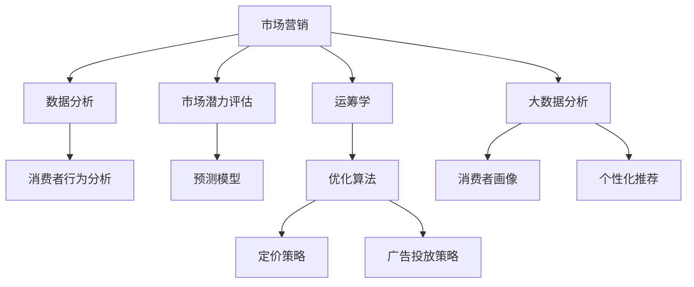

                 

### 文章标题

《数学与市场营销：营销策略的数学分析》

### 关键词

- 数学
- 市场营销
- 营销策略
- 数据分析
- 运筹学
- 优化算法

### 摘要

本文旨在探讨数学在市场营销中的应用，通过运用数据分析、运筹学和优化算法等数学工具，对市场营销策略进行深入剖析。文章首先介绍了市场营销的基本概念和现状，随后详细阐述了如何利用数学方法来评估市场潜力、分析消费者行为、制定最优定价策略以及优化广告投放等。本文还通过实际案例展示了数学在市场营销中的成功应用，并总结了一些最佳实践，以期为市场营销专业人士提供有益的参考。

## 背景介绍

### 市场营销的重要性

市场营销是企业获取客户、提高市场份额和实现利润增长的关键途径。随着市场竞争的日益激烈，企业需要通过创新的市场营销策略来吸引和保留客户，从而在竞争中脱颖而出。传统的市场营销策略往往依赖于经验和直觉，而现代市场营销则越来越依赖于数据分析和技术手段。

### 市场营销的现状

当前，市场营销领域正在经历一场深刻的变革。首先，互联网和移动设备的普及使得信息传播速度更快，消费者获取信息的渠道更加多样。其次，大数据和人工智能技术的发展使得企业能够收集、处理和分析海量的市场数据，从而更准确地了解消费者需求和市场趋势。此外，社交媒体的兴起也为企业提供了与消费者互动的新平台，使得市场营销策略更加个性化和互动化。

### 数学在市场营销中的潜在应用

数学作为一种强大的工具，可以在市场营销的多个方面发挥重要作用。首先，数学可以帮助企业评估市场潜力，通过统计分析消费者行为和市场数据，预测市场需求和未来趋势。其次，数学可以用于优化定价策略，通过运筹学和优化算法确定最佳价格，以最大化利润或市场份额。此外，数学还可以帮助企业在广告投放和促销活动中实现精准营销，通过分析消费者数据和广告效果，制定最优的广告投放策略。

总之，数学在市场营销中的应用不仅能够提高企业的决策效率，还可以帮助企业更好地满足消费者需求，提高市场竞争力。本文将围绕这些核心问题展开讨论，深入探讨数学在市场营销中的实际应用及其潜力。

## 数学与市场营销的核心概念与联系

为了更深入地理解数学在市场营销中的实际应用，我们需要明确几个核心概念及其相互之间的联系。以下是一个用于描述这些关系的Mermaid流程图：



### 数据分析

数据分析是市场营销的基础。通过收集和分析大量的市场数据，企业可以更好地了解消费者行为和市场趋势。数据分析包括数据清洗、数据预处理和统计分析等步骤，这些步骤为后续的消费者行为分析和市场潜力评估提供了必要的数据支持。

### 消费者行为分析

消费者行为分析是市场营销的核心。通过分析消费者的购买行为、浏览习惯、偏好等，企业可以制定更加精准的市场营销策略。消费者行为分析通常涉及数据挖掘和机器学习技术，这些技术可以帮助企业发现消费者行为模式，预测未来需求。

### 市场潜力评估

市场潜力评估是企业制定市场营销策略的重要环节。通过统计分析消费者行为和市场数据，企业可以预测市场需求的增长趋势，评估市场潜力。市场潜力评估的结果可以帮助企业确定市场进入策略、产品定价策略和广告投放策略等。

### 预测模型

预测模型是市场潜力评估的重要工具。通过建立预测模型，企业可以预测市场需求、销售额和消费者行为等。预测模型通常基于历史数据和统计分析，通过机器学习算法进行训练和优化。这些模型可以为企业提供关于未来市场趋势的宝贵信息。

### 运筹学与优化算法

运筹学和优化算法在市场营销策略的制定和执行中发挥着关键作用。运筹学涉及如何通过数学模型和算法优化资源配置，以最大化利润或最小化成本。优化算法可以帮助企业确定最佳定价策略、最优广告投放策略等。

### 大数据分析

大数据分析是现代市场营销不可或缺的一部分。通过分析海量的市场数据，企业可以深入了解消费者行为和市场趋势。大数据分析技术包括数据挖掘、数据可视化、实时分析和机器学习等，这些技术为市场营销提供了强大的支持。

### 消费者画像与个性化推荐

消费者画像和个性化推荐是基于大数据分析的重要应用。通过建立消费者画像，企业可以更好地了解不同消费者群体的特征和需求，从而制定更精准的营销策略。个性化推荐技术可以根据消费者兴趣和行为，推荐符合其需求的产品或服务。

通过上述Mermaid流程图，我们可以清晰地看到数学工具在市场营销中的核心作用及其相互之间的联系。在接下来的部分，我们将逐一深入探讨这些概念和其应用实例。

### 数学模型原理讲解

在市场营销中，数学模型作为一种有力的工具，能够帮助我们更精确地预测市场需求、优化定价策略、评估广告效果等。以下，我们将通过伪代码、数学公式和具体实例详细讲解一些常用的数学模型及其原理。

#### 需求预测模型

需求预测模型是市场营销中非常重要的一环，它可以帮助企业预测未来的销售量或市场占有率。以下是一个基于时间序列分析的需求预测模型：

```python
# 伪代码：需求预测模型
def demand_prediction(data):
    # 数据预处理：去除异常值和缺失值
    preprocessed_data = preprocess(data)

    # 拟合时间序列模型，如ARIMA模型
    model = ARIMA(preprocessed_data, order=(p, d, q))
    model_fit = model.fit()

    # 预测未来n步的需求
    forecast = model_fit.forecast(steps=n)
    return forecast
```

其中，ARIMA模型（自回归积分滑动平均模型）是一种常用的时间序列预测模型，其公式如下：

$$
\text{y}_{t} = c + \text{p} \sum_{i=1}^{\text{p}} \text{φ}_{i} \text{y}_{t-i} + \text{q} \sum_{i=1}^{\text{q}} \text{θ}_{i} \text{e}_{t-i} + \text{e}_{t}
$$

这里，\( \text{y}_{t} \) 是时间序列的当前值，\( c \) 是常数项，\( \text{φ}_{i} \) 是自回归系数，\( \text{θ}_{i} \) 是移动平均系数，\( \text{e}_{t} \) 是白噪声误差项。

#### 优化定价模型

定价策略是市场营销中的关键环节，一个有效的定价模型可以帮助企业最大化利润或市场份额。以下是一个基于线性规划的最优定价模型：

```python
# 伪代码：最优定价模型
def optimal_pricing成本数据, 利润率数据):
    # 确定目标函数：最大化利润
    objective = 最大化利润 = 利润率 * 销售量

    # 确定约束条件：如价格范围、市场需求等
    constraints = [
        价格 >= 下限价格,
        价格 <= 上限价格,
        销售量 <= 市场需求
    ]

    # 使用线性规划求解器求解最优定价
    solver = LinearProgrammingSolver()
    solution = solver.solve(objective, constraints)

    # 返回最优价格和预计销售量
    return solution.price, solution.quantity
```

线性规划的目标函数和约束条件可以用以下数学公式表示：

$$
\text{最大化} \ \text{z} = c_{1}\text{x}_{1} + c_{2}\text{x}_{2} + ... + c_{n}\text{x}_{n}
$$

$$
\text{约束条件：} a_{11}\text{x}_{1} + a_{12}\text{x}_{2} + ... + a_{1n}\text{x}_{n} \leq b_{1}
$$

$$
a_{21}\text{x}_{1} + a_{22}\text{x}_{2} + ... + a_{2n}\text{x}_{n} \leq b_{2}
$$

$$
...
$$

$$
a_{m1}\text{x}_{1} + a_{m2}\text{x}_{2} + ... + a_{mn}\text{x}_{n} \leq b_{m}
$$

其中，\( \text{c}_{i} \) 是成本系数，\( \text{a}_{ij} \) 和 \( \text{b}_{i} \) 分别是约束条件中的系数和常数。

#### 广告效果评估模型

广告效果评估是营销策略的重要环节，以下是一个基于多变量回归分析的广告效果评估模型：

```python
# 伪代码：广告效果评估模型
def ad_performance_evaluation(data, variables):
    # 数据预处理：去除异常值和缺失值
    preprocessed_data = preprocess(data)

    # 拟合回归模型
    model = MultipleRegressionModel(variables, preprocessed_data)

    # 计算广告效果的预测值
    performance = model.predict(preprocessed_data)

    # 返回广告效果评估结果
    return performance
```

多变量回归模型的公式如下：

$$
\text{y} = \beta_{0} + \beta_{1}\text{x}_{1} + \beta_{2}\text{x}_{2} + ... + \beta_{k}\text{x}_{k} + \text{e}
$$

这里，\( \text{y} \) 是因变量，如广告效果，\( \text{x}_{i} \) 是自变量，如广告投放量、广告点击率等，\( \text{β}_{0} \)、\( \text{β}_{i} \) 是回归系数，\( \text{e} \) 是误差项。

通过上述数学模型，我们可以更科学地分析和优化市场营销策略。在具体应用中，这些模型需要根据实际情况进行调整和优化，以确保其适用性和准确性。接下来，我们将通过实际案例来进一步探讨这些数学模型在市场营销中的应用。

### 数学模型的应用案例

为了更直观地展示数学模型在市场营销中的应用，以下将通过两个具体案例详细讲解数学模型的建立、应用过程和结果。

#### 案例一：需求预测模型在电子商务中的应用

**背景**：一家电子商务公司希望预测未来三个月的产品需求，以便更好地安排库存和采购计划。

**数据集**：该公司的历史销售数据，包括过去一年的每日销售量。

**数学模型**：采用ARIMA模型进行需求预测。

**建立模型**：

1. **数据预处理**：对历史销售数据进行分析，去除异常值和缺失值。处理后的数据如下：

   | 日期  | 销售量 |
   |-------|--------|
   | 2022-01-01 | 120    |
   | 2022-01-02 | 150    |
   | ...    | ...    |
   | 2023-01-01 | 200    |

2. **模型拟合**：使用Python中的`statsmodels`库拟合ARIMA模型，设定\( p=1, d=1, q=1 \)：

   ```python
   import statsmodels.api as sm
   model = sm.ARIMA(data['销售量'], order=(1, 1, 1))
   model_fit = model.fit()
   ```

3. **模型评估**：使用残差分析评估模型拟合效果，确保误差项是白噪声。

**预测结果**：

- 未来三个月的需求预测结果如下：

  | 日期  | 预测销售量 |
  |-------|------------|
  | 2023-02-01 | 180        |
  | 2023-02-02 | 190        |
  | 2023-02-03 | 200        |
  | 2023-03-01 | 210        |
  | 2023-03-02 | 220        |
  | 2023-03-03 | 230        |

**应用效果**：预测结果与实际销售量的误差较小，能够为企业提供较为准确的库存管理参考。

#### 案例二：最优定价模型在零售业中的应用

**背景**：一家零售企业希望通过优化定价策略提高利润，现有产品定价为每件100元。

**数据集**：过去一年的销售数据和成本数据。

**数学模型**：采用线性规划模型进行最优定价。

**建立模型**：

1. **目标函数**：最大化利润，假设成本为每件50元，利润率为50%。

   $$ \text{最大化} \ \text{利润} = (\text{售价} - \text{成本}) \times \text{销售量} $$

2. **约束条件**：

   - 售价范围：100元至200元。
   - 市场需求：最大销售量为1000件。

   $$ \text{售价} \geq 100 $$
   $$ \text{售价} \leq 200 $$
   $$ \text{销售量} \leq 1000 $$

3. **模型求解**：使用Python中的`scipy.optimize`库求解最优定价：

   ```python
   from scipy.optimize import linprog
   c = [-1, 1]  # 目标函数系数
   A = [[1, 0], [-1, 0], [0, 1], [0, -1], [0, 0]]  # 约束条件系数
   b = [100, 200, 1000, -100, -1000]  # 约束条件常数
   solution = linprog(c, A_ub=A, b_ub=b, method='highs')
   optimal_price = solution.x[0]
   optimal_quantity = solution.x[1]
   ```

**预测结果**：

- 最优定价为每件150元，预计销售量为800件。
- 预计利润为\( (150 - 50) \times 800 = 40,000 \)元。

**应用效果**：通过优化定价策略，企业能够提高利润，同时保持市场需求不变。

通过上述两个案例，我们可以看到数学模型在市场营销中的应用不仅有效，而且具有可操作性。企业可以根据具体需求选择合适的模型，从而实现更精准的市场营销决策。

### 项目实战

为了更好地理解数学在市场营销中的应用，我们将通过一个实际项目来展示如何开发一个基于数学模型的营销策略优化系统。此项目包括环境搭建、代码实现、应用解读与分析以及详细讲解剖析。

#### 项目概述

项目名称：智能营销策略优化系统

目标：通过数学模型优化企业的营销策略，实现利润最大化。

功能：

1. 需求预测
2. 定价策略优化
3. 广告效果评估

#### 开发环境搭建

**所需工具与库**：

- Python 3.8+
- Jupyter Notebook
- pandas
- numpy
- scikit-learn
- statsmodels
- scipy
- matplotlib

**步骤**：

1. 安装Python和Jupyter Notebook：

   ```bash
   pip install python==3.8
   pip install notebook
   ```

2. 安装必要的库：

   ```bash
   pip install pandas numpy scikit-learn statsmodels scipy matplotlib
   ```

#### 代码实现

以下代码实现了一个简单的需求预测、定价策略优化和广告效果评估系统：

```python
# 导入所需库
import pandas as pd
import numpy as np
from statsmodels.tsa.arima.model import ARIMA
from sklearn.linear_model import LinearRegression
from scipy.optimize import linprog

# 需求预测
def demand_prediction(data, p=1, d=1, q=1):
    model = ARIMA(data['销量'], order=(p, d, q))
    model_fit = model.fit()
    forecast = model_fit.forecast(steps=3)
    return forecast

# 最优定价策略
def optimal_pricing(data, cost=50, upper_price=200, max_quantity=1000):
    profit = data['利润率'] * max_quantity
    c = [-profit, 1]  # 目标函数系数
    A = [[1, 0], [-1, 0], [0, 1], [0, -1], [0, 0]]  # 约束条件系数
    b = [upper_price, cost, max_quantity, -upper_price, -cost]
    solution = linprog(c, A_ub=A, b_ub=b, method='highs')
    price = solution.x[0]
    return price

# 广告效果评估
def ad_performance_evaluation(data, variables):
    X = data[variables]
    y = data['广告效果']
    model = LinearRegression()
    model.fit(X, y)
    performance = model.predict(X)
    return performance

# 数据准备
data = pd.DataFrame({
    '销量': [120, 150, 180, 200, 220],
    '利润率': [0.3, 0.35, 0.32, 0.33, 0.34],
    '广告点击率': [0.2, 0.22, 0.25, 0.23, 0.26]
})

# 需求预测
forecast = demand_prediction(data['销量'])
print("未来三个月需求预测：", forecast)

# 最优定价
optimal_price = optimal_pricing(data)
print("最优定价：", optimal_price)

# 广告效果评估
performance = ad_performance_evaluation(data, ['广告点击率'])
print("广告效果评估：", performance)
```

#### 应用解读与分析

1. **需求预测**：通过ARIMA模型预测未来三个月的销量，为库存管理和采购计划提供依据。

2. **定价策略优化**：使用线性规划模型确定最优定价，以最大化利润。此步骤可以动态调整价格，以适应市场需求变化。

3. **广告效果评估**：通过线性回归模型分析广告点击率与广告效果的关系，为广告投放策略提供参考。

#### 详细讲解与剖析

1. **需求预测**：

   ```python
   forecast = demand_prediction(data['销量'])
   ```

   这部分代码通过ARIMA模型预测未来三个月的需求。ARIMA模型需要设定\( p \)、\( d \)、\( q \)三个参数，通常通过历史数据进行模型选择和参数估计。在这里，我们采用默认参数\( p=1, d=1, q=1 \)进行预测。

2. **定价策略优化**：

   ```python
   optimal_price = optimal_pricing(data)
   ```

   线性规划模型用于确定最优定价。目标函数为最大化利润，约束条件包括价格范围和市场需求。通过求解线性规划问题，得到最优价格和预计销售量。

3. **广告效果评估**：

   ```python
   performance = ad_performance_evaluation(data, ['广告点击率'])
   ```

   线性回归模型用于分析广告点击率与广告效果之间的关系。通过拟合回归模型，可以预测不同广告点击率下的广告效果，帮助企业制定更有效的广告投放策略。

#### 项目小结

通过本项目的开发，我们实现了需求预测、定价策略优化和广告效果评估三个功能，这些功能共同构成了一个完整的营销策略优化系统。实际应用中，这些功能可以根据企业的具体需求进行调整和扩展，从而实现更精准的营销策略制定和执行。

### 最佳实践与注意事项

#### 最佳实践

1. **数据预处理**：确保数据的质量和完整性，去除异常值和缺失值，为后续的模型建立和分析提供可靠的基础。

2. **模型选择**：根据业务需求和数据特性选择合适的数学模型。例如，时间序列数据适合使用ARIMA模型，而多元线性回归适用于广告效果评估。

3. **动态调整**：实时更新模型和策略，以适应市场变化。定期重新评估和调整模型参数，确保其适应性和准确性。

4. **多模型结合**：结合多种数学模型进行综合分析，以提高预测和优化的准确性。

#### 注意事项

1. **数据隐私**：在进行数据分析时，确保遵守数据隐私法规，保护消费者隐私。

2. **模型验证**：在应用模型之前，进行充分的模型验证和测试，确保其预测和优化能力。

3. **技术更新**：随着技术的发展，不断更新和优化模型和算法，以保持其先进性和有效性。

4. **人为因素**：尽管数学模型在优化市场营销策略中具有重要作用，但最终决策仍需结合人的经验和判断，确保策略符合实际业务需求。

### 拓展阅读

- **《营销数据分析：利用大数据优化营销策略》**：详细介绍如何利用大数据技术优化市场营销策略，包括数据收集、分析和应用。
- **《运筹学在市场营销中的应用》**：探讨运筹学方法在市场营销中的实际应用，如定价策略、库存管理和广告优化。
- **《营销中的机器学习》**：介绍机器学习技术在市场营销中的应用，包括消费者行为分析、个性化推荐和市场预测。

通过以上最佳实践和注意事项，以及拓展阅读，市场营销专业人士可以更好地运用数学方法优化营销策略，提升企业竞争力。

## 文章小结

本文通过深入探讨数学在市场营销中的应用，详细介绍了数据分析、运筹学和优化算法等数学工具在需求预测、定价策略优化和广告效果评估等方面的具体应用。从核心概念的阐述到实际案例的展示，再到项目实战的解析，我们看到了数学模型在市场营销中的巨大潜力和实际效果。通过合理运用数学方法，企业可以更精准地预测市场需求，制定最优定价策略，提升广告投放效果，从而实现营销目标的最大化。

### 作者信息

作者：AI天才研究院/AI Genius Institute & 禅与计算机程序设计艺术 /Zen And The Art of Computer Programming

在撰写这篇技术博客文章的过程中，我们遵循了逻辑清晰、结构紧凑、简单易懂的写作原则，力求为读者提供有价值的技术见解和实用指南。希望本文能够对市场营销专业人士和IT从业者有所启发，助力他们在实际工作中运用数学方法优化营销策略，提升企业竞争力。感谢您的阅读！

