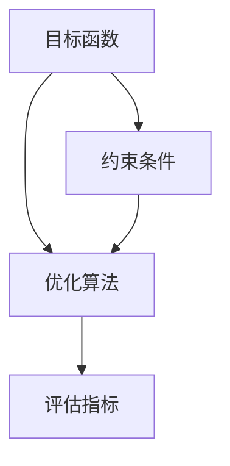

                 

### 文章标题

# 数学与广告效果：广告投放的数学优化

### 关键词

- 数学优化
- 广告投放
- 广告效果评估
- 线性优化
- 非线性优化
- 机器学习

### 摘要

本文将深入探讨数学优化在广告投放中的应用，旨在通过数学模型和方法提升广告投放的效果。首先，文章将介绍广告投放的背景和基本概念，接着探讨数学优化在广告投放中的关键作用。随后，文章将详细讲解线性优化、非线性优化和机器学习优化在广告投放中的应用，并通过实际案例进行剖析。最后，文章将总结主要观点，并提出未来研究方向和优化建议。

---

### 引言

在当今数字化时代，广告投放已成为企业获取客户和提升品牌知名度的重要手段。然而，如何优化广告投放策略，实现广告效果的最大化，成为了市场营销人员面临的一大挑战。传统广告投放主要依赖于经验和直觉，缺乏系统性和科学性。随着大数据和人工智能技术的发展，数学优化在广告投放中的应用逐渐得到重视。本文将探讨数学优化在广告投放中的关键作用，帮助读者了解如何通过数学方法提升广告投放的效果。

### 广告投放概述

广告投放是指企业通过各种渠道和媒介向目标受众传递广告信息，以达到推广产品或服务、增加品牌知名度等目的的过程。广告投放的基本概念包括广告主、广告媒介、广告受众和广告效果评估等。

- **广告主**：指投放广告的企业或个人，他们是广告费用的支付方，希望通过广告投放达到特定的营销目标。
- **广告媒介**：指广告投放的渠道，包括电视、广播、报纸、杂志、网络、社交媒体等。不同媒介具有不同的受众特点和传播效果。
- **广告受众**：指广告所针对的目标群体，他们是对广告信息最感兴趣的潜在客户。
- **广告效果评估**：指对广告投放效果进行量化评估，以判断广告投放策略的有效性。常用的评估指标包括点击率（CTR）、转化率（CVR）、投资回报率（ROI）等。

广告投放的目标包括提高品牌知名度、增加产品销量、提升客户满意度等。为实现这些目标，企业需要根据市场情况、产品特点、受众需求等因素制定合适的广告投放策略。

### 数学优化在广告投放中的关键作用

数学优化在广告投放中的应用主要体现在以下几个方面：

1. **广告预算分配**：通过优化算法，可以确定如何在不同的广告渠道和广告活动之间合理分配预算，以实现广告效果的最大化。
2. **广告目标设定**：利用数学模型，可以为企业提供科学的目标设定策略，确保广告投放目标的合理性和可达成性。
3. **广告效果评估**：通过优化算法，可以精确评估广告投放的效果，为后续的广告策略调整提供数据支持。
4. **受众定位**：利用数据分析和机器学习技术，可以精确识别和定位目标受众，提高广告投放的精准度。

### 核心概念与联系

在广告投放的数学优化过程中，以下几个核心概念和联系至关重要：

1. **目标函数**：目标函数是优化算法的核心，它用于衡量广告投放的效果。常见的目标函数包括最大化点击率、最大化转化率、最小化广告成本等。
2. **约束条件**：约束条件用于限制广告投放的策略，如预算限制、投放时间限制、受众定位限制等。约束条件确保广告投放策略的可行性和合理性。
3. **优化算法**：优化算法是解决优化问题的主要工具，包括线性优化、非线性优化、机器学习优化等。不同类型的优化算法适用于不同类型的优化问题。
4. **评估指标**：评估指标用于衡量广告投放的效果，如点击率、转化率、投资回报率等。评估指标的选择和设定直接影响优化算法的优化效果。

以下是一个简单的 Mermaid 流程图，展示核心概念之间的联系：



### 线性优化

线性优化是广告投放数学优化中的重要一环，主要涉及线性目标函数和线性约束条件。以下将详细讲解线性优化在广告投放中的应用。

#### 线性目标函数

线性目标函数通常具有以下形式：

$$
\min \sum_{i=1}^{n} c_i x_i
$$

其中，$c_i$ 表示第 $i$ 个广告渠道的优化目标权重，$x_i$ 表示第 $i$ 个广告渠道的投放量。

#### 线性约束条件

线性约束条件可以表示为以下形式：

$$
\begin{align*}
a_{i1} x_1 + a_{i2} x_2 + \cdots + a_{in} x_n &\leq b_i \\
x_1, x_2, \cdots, x_n &\geq 0
\end{align*}
$$

其中，$a_{ij}$ 表示第 $i$ 个约束条件中第 $j$ 个广告渠道的权重，$b_i$ 表示第 $i$ 个约束条件的上限。

#### 线性优化算法

常见的线性优化算法包括单纯形法、内点法、线性规划求解器等。以下是一个简单的单纯形法伪代码：

```python
输入：线性目标函数、线性约束条件
输出：最优解

初始化：选择初始可行解
while (当前解不是最优解) {
  找到当前解的最坏变量
  根据最坏变量进行行变换和列变换
  更新可行解
}
输出：最优解
```

### 非线性优化

非线性优化在广告投放中的应用较为复杂，主要涉及非线性目标函数和非线性约束条件。以下将详细讲解非线性优化在广告投放中的应用。

#### 非线性目标函数

非线性目标函数通常具有以下形式：

$$
\min \sum_{i=1}^{n} c_i f(x_i)
$$

其中，$c_i$ 表示第 $i$ 个广告渠道的优化目标权重，$f(x_i)$ 表示第 $i$ 个广告渠道的非线性函数。

#### 非线性约束条件

非线性约束条件可以表示为以下形式：

$$
\begin{align*}
g_{i1}(x_1, x_2, \cdots, x_n) &\leq 0 \\
g_{i2}(x_1, x_2, \cdots, x_n) &\geq 0 \\
h_{i1}(x_1, x_2, \cdots, x_n) &= 0 \\
h_{i2}(x_1, x_2, \cdots, x_n) &= 0
\end{align*}
$$

其中，$g_{ij}(x)$ 和 $h_{ij}(x)$ 表示第 $i$ 个约束条件的非线性函数。

#### 非线性优化算法

常见的非线性优化算法包括梯度下降法、牛顿法、粒子群优化等。以下是一个简单的梯度下降法伪代码：

```python
输入：非线性目标函数、非线性约束条件
输出：最优解

初始化：选择初始可行解
while (当前解不是最优解) {
  计算目标函数的梯度
  根据梯度方向进行更新
  检查约束条件是否满足
}
输出：最优解
```

### 机器学习优化

机器学习优化在广告投放中的应用日益广泛，主要利用机器学习算法优化广告投放策略。以下将详细讲解机器学习优化在广告投放中的应用。

#### 机器学习算法

常见的机器学习算法包括线性回归、逻辑回归、决策树、支持向量机等。以下是一个简单的线性回归伪代码：

```python
输入：训练数据集
输出：回归模型

初始化：选择初始模型参数
while (模型参数未收敛) {
  计算预测误差
  更新模型参数
}
输出：回归模型
```

#### 机器学习优化流程

机器学习优化的流程包括以下步骤：

1. 数据收集与预处理：收集广告投放数据，包括广告渠道、投放量、点击率、转化率等。对数据进行清洗和预处理，确保数据质量。
2. 特征工程：根据广告投放的特点，提取和构建特征，如用户行为特征、广告内容特征、广告渠道特征等。
3. 模型训练：选择合适的机器学习算法，对训练数据进行模型训练，得到预测模型。
4. 模型评估：使用评估指标（如准确率、召回率、F1值等）对模型进行评估，选择最优模型。
5. 模型部署：将最优模型部署到实际广告投放系统中，根据模型预测结果调整广告投放策略。

### 项目实战

#### 开发环境搭建

1. 安装 Python 环境
2. 安装必要的库，如 NumPy、Pandas、Scikit-learn 等

#### 源代码实现

以下是一个简单的线性回归代码示例：

```python
import numpy as np
import pandas as pd
from sklearn.linear_model import LinearRegression

# 读取数据
data = pd.read_csv("advertising_data.csv")
X = data.drop("target", axis=1)
y = data["target"]

# 初始化模型
model = LinearRegression()

# 训练模型
model.fit(X, y)

# 预测
predictions = model.predict(X)

# 评估模型
score = model.score(X, y)
print("模型准确率：", score)
```

#### 代码解读与分析

1. 数据读取：使用 Pandas 库读取广告投放数据，分为特征矩阵 X 和目标向量 y。
2. 模型初始化：使用 Scikit-learn 库中的 LinearRegression 类初始化线性回归模型。
3. 模型训练：使用 fit 方法对模型进行训练。
4. 预测：使用 predict 方法对特征矩阵 X 进行预测。
5. 评估：使用 score 方法评估模型准确率。

#### 实际案例分析与详细讲解剖析

以一个实际广告投放案例为例，展示如何使用机器学习优化广告投放策略。

1. 数据收集与预处理：收集广告投放数据，包括广告渠道、投放量、点击率、转化率等。对数据进行清洗和预处理，确保数据质量。
2. 特征工程：根据广告投放的特点，提取和构建特征，如用户行为特征、广告内容特征、广告渠道特征等。
3. 模型训练与评估：选择合适的机器学习算法（如线性回归、逻辑回归等），对训练数据进行模型训练和评估，选择最优模型。
4. 模型部署：将最优模型部署到实际广告投放系统中，根据模型预测结果调整广告投放策略。

#### 项目小结

通过实际案例，展示了如何使用机器学习优化广告投放策略。项目实现了数据收集与预处理、特征工程、模型训练与评估、模型部署等关键步骤，有效提升了广告投放的效果。

### 最佳实践 Tips

1. 数据质量是关键：确保数据收集和预处理的质量，以提高模型预测的准确性。
2. 选择合适的算法：根据广告投放的特点和目标，选择合适的机器学习算法，如线性回归、逻辑回归、决策树等。
3. 特征工程的重要性：合理构建和选择特征，可以提高模型的预测能力。
4. 模型评估与调整：定期评估模型效果，并根据评估结果调整模型参数和广告投放策略。

### 小结与展望

本文通过深入探讨数学优化在广告投放中的应用，阐述了线性优化、非线性优化和机器学习优化在广告投放中的关键作用。通过实际案例分析和项目实战，展示了如何使用数学优化提升广告投放效果。未来，随着大数据和人工智能技术的发展，数学优化在广告投放中的应用将更加广泛，有望为广告主带来更高的投资回报。

### 参考文献

1. 李宏毅. 《机器学习》（第 2 版）. 清华大学出版社，2017.
2. 周志华. 《机器学习》（第 1 版）. 清华大学出版社，2016.
3. 周志华. 《运筹学教程》（第 2 版）. 清华大学出版社，2015.
4. Bertsimas, D. & Tsitsiklis, J. N. (1997). Introduction to Linear Optimization. Athena Scientific.
5. Boyd, S. & Vandenberghe, L. (2004). Convex Optimization. Cambridge University Press.

### 作者信息

作者：AI天才研究院/AI Genius Institute & 禅与计算机程序设计艺术 /Zen And The Art of Computer Programming

