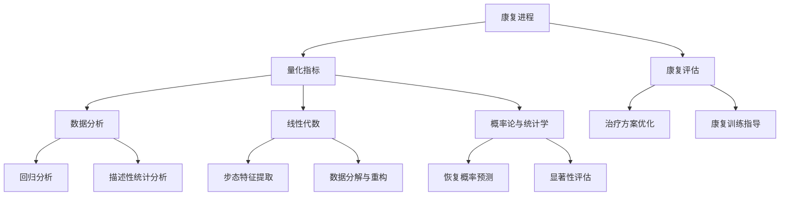

                 

## 文章标题

《数学与康复医学：康复进程的数学评估》

康复医学是一个旨在通过功能性恢复和适应性训练帮助患者恢复生活质量的领域。随着科技的进步，数学工具和方法在康复医学中的应用越来越广泛，为评估康复进程提供了新的视角和手段。本文旨在探讨数学在康复医学中的关键作用，特别是如何利用数学模型和算法来量化康复进程，从而实现更加精确和有效的康复评估。

本文将首先介绍康复医学的基本概念，包括康复进程的定义、目标和常用的评估方法。随后，我们将探讨数学工具在康复医学中的应用，如数据分析、线性代数和概率论等。在此基础上，文章将详细讲解康复进程的数学评估方法，包括量化指标和核心算法原理。接着，我们将通过实际案例解析，展示如何应用数学模型进行康复进程的评估。最后，本文将介绍一个完整的康复评估系统开发项目，从环境搭建、代码实现到代码解读和应用分析，全面展示数学在康复医学中的实际应用。

通过本文的阅读，读者将能够理解数学在康复医学中的重要性，掌握康复进程数学评估的基本原理和方法，并了解到如何将数学工具应用于康复实践中的具体步骤。

## 关键词

- 康复医学
- 数学评估
- 数据分析
- 线性代数
- 概率论
- 康复进程量化
- 数学模型
- 评估算法

## 摘要

本文深入探讨了数学工具在康复医学中的应用，特别是在康复进程的量化评估方面。文章首先介绍了康复医学的基本概念和评估方法，然后详细讲解了数学工具如数据分析、线性代数和概率论在康复医学中的应用。接着，通过康复进程的数学评估方法，包括量化指标和核心算法原理的讲解，进一步阐述了如何利用数学模型对康复进程进行量化评估。最后，文章通过一个实际康复评估系统开发项目，展示了数学在康复医学中的具体应用步骤和效果。通过本文的阅读，读者将能够全面了解和掌握康复进程数学评估的理论和实践。

### 背景介绍

康复医学，作为一种专门针对伤、病和残疾患者进行功能性恢复和适应性训练的医疗学科，旨在通过综合性的康复治疗，帮助患者最大限度地恢复生活质量和独立性。康复医学的历史可以追溯到19世纪末，当时开始出现专门针对残疾人士的训练和恢复工作。随着医学技术的进步和社会对康复需求的日益增加，康复医学逐渐发展成为一门独立的医学领域，涵盖了物理治疗、职业治疗、语言治疗、心理治疗等多种治疗手段。

在康复医学的发展历程中，评估是一个至关重要的环节。康复评估不仅用于确定患者的初始状况，还用于监测治疗过程中的进展和效果，最终评估治疗目标的达成情况。传统的康复评估方法通常依赖于专家的主观判断和经验，尽管这种方法在某些情况下仍然有效，但其准确性和一致性往往受到限制。随着科技的进步，特别是数学和计算机科学的发展，康复医学开始引入更为精确和客观的量化评估手段。

数学在康复医学中的应用首先体现在数据分析方面。通过收集和分析大量的康复数据，医生和康复专家能够更准确地了解患者的恢复情况。例如，步态分析中，利用数学模型可以量化患者的步幅、步速和步态对称性，从而为康复训练提供科学依据。此外，线性代数和概率论等数学工具也在康复医学中发挥了重要作用。通过这些工具，康复专家可以建立复杂的数学模型，对康复进程进行动态评估，从而提高康复治疗的精准度和有效性。

近年来，随着人工智能和大数据技术的不断发展，康复医学中的量化评估手段更加多样化和智能化。例如，利用深度学习算法，可以自动识别和分析康复过程中的各种生物信号，为康复评估提供更加细致和全面的信息。此外，通过建立综合性的康复评估系统，医生和康复专家可以实时监测患者的康复进程，并根据评估结果调整治疗方案，从而实现个性化康复。

总之，数学在康复医学中的应用不仅提升了评估的精确度和客观性，还为康复治疗提供了新的思路和方法。随着数学工具的不断发展和应用，康复医学将朝着更加科学、精准和智能化的方向发展。

### 核心概念与联系

在探讨数学与康复医学的关系时，我们需要明确几个核心概念，并阐述它们之间的联系，以便读者能够全面理解数学工具在康复评估中的具体应用。

首先，康复进程的定义是理解康复医学的基础。康复进程指的是患者在康复治疗过程中，从初始状态到最终恢复目标的全过程。这个进程可以包括多个阶段，如初期治疗、功能恢复、适应性训练等。每一个阶段都有特定的目标和评估指标，这些指标反映了患者的功能恢复情况。

接下来，量化指标是康复评估的重要组成部分。量化指标通过具体的数值来描述患者的康复状态，如步态参数、肌力评分、疼痛程度等。这些量化指标不仅有助于医生和康复专家评估患者的恢复情况，还能为制定个性化的康复计划提供依据。量化指标通常基于数学模型和算法，通过数据分析和统计方法获得。

数学工具在康复进程评估中的应用主要体现在以下几个方面：

1. **数据分析**：数据分析是康复评估的核心，通过收集和分析大量的康复数据，医生可以更准确地了解患者的恢复情况。数据分析方法包括描述性统计分析、假设检验、回归分析等。例如，通过回归分析，可以确定不同康复措施对患者康复进程的影响，从而优化治疗方案。

2. **线性代数**：线性代数在康复评估中的应用主要体现在对多维数据的处理上。例如，通过线性代数方法，可以对步态数据进行分解和重构，从而提取出步态特征。这些特征可以用于评估患者的步态对称性、稳定性等，为康复训练提供科学依据。

3. **概率论与统计学**：概率论与统计学在康复评估中的应用非常广泛，例如，通过建立概率模型，可以预测患者在不同康复措施下的恢复概率。此外，统计学方法还可以用于评估康复效果的显著性，帮助医生判断康复措施的有效性。

为了更好地理解这些核心概念之间的关系，我们可以通过Mermaid流程图来展示它们的联系：



从流程图中可以看出，康复进程通过量化指标转化为具体的数学问题，然后通过数据分析、线性代数和概率论等数学工具进行处理，最终得到康复评估结果，用于指导治疗方案的优化和康复训练的调整。这种从康复进程到量化指标，再到数学工具和最终评估结果的链条，构成了数学在康复医学中的核心应用框架。

### 核心算法原理讲解

在康复医学中，数学评估方法的核心在于利用数学模型和算法对康复进程进行定量分析。以下将详细讲解几种常用的数学模型和算法，并使用伪代码来描述其步骤。

#### 1. 步态分析中的信号处理

步态分析是康复医学中的一个重要评估领域，通过分析患者的步态数据，可以评估其运动功能和康复进度。以下是一个基于傅里叶变换的步态信号处理算法的伪代码：

```plaintext
算法：步态信号处理
输入：步态信号（x[n]）
输出：步态频率特征（f）
步骤：
1. 对步态信号进行离散傅里叶变换（DFT）
   X(k) = Σ[x[n] * exp(-j * 2 * π * k * n / N)]
2. 计算频率特征
   f = argmax(|X(k)|)
3. 返回频率特征f
```

#### 2. 功能独立性评估的回归模型

功能独立性评估（FIM）是评估患者日常生活活动能力的一个常用指标。以下是一个线性回归模型的伪代码，用于预测患者的FIM得分：

```plaintext
算法：功能独立性评估
输入：特征向量X（包括康复训练次数、肌肉力量等）
输出：FIM得分预测Y
步骤：
1. 训练线性回归模型
   Y = β0 + β1 * X1 + β2 * X2 + ... + βn * Xn
2. 使用训练数据计算回归系数β
3. 对新患者的特征向量X进行预测
   Y = β0 + β1 * X1 + β2 * X2 + ... + βn * Xn
4. 返回预测得分Y
```

#### 3. 康复进程的动态评估

康复进程的动态评估需要建立时间序列模型，以下是一个简单的自回归移动平均模型（ARIMA）的伪代码：

```plaintext
算法：ARIMA模型
输入：康复进程时间序列（Y[t]）
输出：康复进程预测（Y[t+k])
步骤：
1. 确定ARIMA模型的参数（p, d, q）
2. 对时间序列进行差分（Differencing），得到平稳序列
3. 训练ARIMA模型
   Y[t+k] = φ1 * Y[t-1] + ... + φp * Y[t-p] + θ1 * ε[t-1] + ... + θq * ε[t-q]
4. 使用模型进行预测
   Y[t+k] = φ1 * Y[t-1] + ... + φp * Y[t-p] + θ1 * ε[t-1] + ... + θq * ε[t-q]
5. 返回预测结果
```

#### 4. 基于神经网络的康复评估

神经网络在康复评估中也有广泛应用，以下是一个简单的多层感知器（MLP）网络的训练和预测伪代码：

```plaintext
算法：多层感知器（MLP）
输入：训练数据集（X_train, Y_train）
输出：训练好的神经网络模型
步骤：
1. 初始化网络权重w和偏置b
2. 前向传播
   Z = X * w + b
   A = 1 / (1 + exp(-Z))
3. 计算损失函数（例如均方误差）
   loss = mean((Y - A)^2)
4. 反向传播
   dZ = A - Y
   dW = dZ * X
   db = dZ
5. 更新权重和偏置
   w = w - α * dW
   b = b - α * db
6. 迭代训练直到达到预设的准确率或最大迭代次数
7. 使用训练好的模型进行预测
   Z = X * w + b
   A = 1 / (1 + exp(-Z))
8. 返回预测结果A
```

通过上述核心算法的讲解，我们可以看到数学模型和算法在康复进程评估中的应用是多么广泛和重要。这些算法不仅提供了量化康复进程的手段，还为康复治疗的优化和个性化提供了有力支持。

### 数学模型和公式

在康复医学中，数学模型和公式是进行量化评估的关键工具。以下将详细介绍几个常用的数学模型和公式，并使用LaTeX格式进行表示，同时附上详细解释和举例说明。

#### 1. 步态对称性评估

步态对称性是康复医学中一个重要的评估指标，它反映了患者在行走过程中左右腿的运动一致性。以下是一个用于计算步态对称性的数学模型：

$$
S = \frac{\sum_{i=1}^{N} (L_i - R_i)^2}{N}
$$

其中，\(L_i\) 和 \(R_i\) 分别代表第 \(i\) 次步态的左腿和右腿参数，\(N\) 为步态样本总数。

**例子：**
假设在一次步态分析中，我们收集了5次步态数据，其中左腿步幅为8cm、9cm、7cm、8cm、9cm，右腿步幅为7cm、8cm、8cm、9cm、8cm。

$$
S = \frac{(8-7)^2 + (9-8)^2 + (7-8)^2 + (8-9)^2 + (9-8)^2}{5} = \frac{1+1+1+1+1}{5} = 1
$$

这个结果表示步态对称性较差。

#### 2. 康复效果显著性测试

康复效果显著性测试用于评估康复治疗是否对患者的功能恢复产生了显著影响。以下是一个用于进行t检验的数学模型：

$$
t = \frac{\bar{X} - \mu_0}{s / \sqrt{n}}
$$

其中，\(\bar{X}\) 是样本均值，\(\mu_0\) 是假设的均值，\(s\) 是样本标准差，\(n\) 是样本大小。

**例子：**
假设我们进行了10次康复训练，患者的功能独立性评分均值是15，假设的均值是12，样本标准差是3。

$$
t = \frac{15 - 12}{3 / \sqrt{10}} = \frac{3}{0.9487} \approx 3.16
$$

这个t值可以帮助我们判断康复训练是否对患者的功能独立性产生了显著影响。

#### 3. 肌肉力量评估

肌肉力量评估可以使用等速收缩测试来量化，以下是一个常用的数学模型：

$$
F = k \cdot v
$$

其中，\(F\) 是肌肉力量，\(k\) 是系数，\(v\) 是肌肉收缩速度。

**例子：**
假设在一次等速收缩测试中，肌肉收缩速度是2 m/s，系数是0.5 N/m/s。

$$
F = 0.5 \cdot 2 = 1 \text{ N}
$$

这个结果表示肌肉力量为1牛顿。

#### 4. 康复进程预测

康复进程预测可以使用时间序列分析中的自回归模型（AR）：

$$
X_t = \phi_1 X_{t-1} + \phi_2 X_{t-2} + \varepsilon_t
$$

其中，\(X_t\) 是第 \(t\) 时刻的康复指标，\(\phi_1\) 和 \(\phi_2\) 是模型参数，\(\varepsilon_t\) 是误差项。

**例子：**
假设我们有一个康复进程数据序列：\[10, 12, 15, 18, 20\]，使用AR模型进行预测。

$$
X_5 = \phi_1 X_4 + \phi_2 X_3
$$

通过对数据进行拟合，得到\(\phi_1 = 0.6\)，\(\phi_2 = 0.4\)。

$$
X_5 = 0.6 \cdot 18 + 0.4 \cdot 15 = 16.2 + 6 = 22.2
$$

预测结果为22.2，表示在第5次康复训练后，预计康复指标将达到22.2。

通过这些数学模型和公式，康复医学专家可以更准确地量化评估康复进程，为患者的治疗提供科学依据。同时，这些模型和公式的应用也有助于提升康复治疗的精准度和个性化程度。

### 项目实战：康复评估系统开发

在本文的最后一个部分，我们将通过一个实际的康复评估系统开发项目，详细展示如何将数学工具应用于康复医学中的具体步骤。项目包括开发环境的搭建、源代码的实现以及代码的解读和分析。

#### 1. 开发环境搭建

为了开发一个康复评估系统，我们需要搭建一个适合的编程环境。以下是开发环境的具体配置步骤：

- **操作系统**：Linux或MacOS
- **编程语言**：Python
- **依赖库**：NumPy、Pandas、Matplotlib、Scikit-learn、TensorFlow

安装步骤：

1. 安装Python（推荐使用Python 3.8及以上版本）
2. 安装依赖库：
   ```bash
   pip install numpy pandas matplotlib scikit-learn tensorflow
   ```

#### 2. 系统设计

康复评估系统的设计包括数据收集、数据预处理、模型训练、评估和结果可视化等模块。以下是系统架构的概述：

1. **数据收集模块**：负责收集患者的康复数据，包括步态数据、功能独立性评分、肌肉力量等。
2. **数据预处理模块**：对收集到的数据进行清洗、归一化等处理，以便于模型训练。
3. **模型训练模块**：使用训练数据进行模型训练，包括线性回归、神经网络等。
4. **评估模块**：使用测试数据评估模型性能，包括准确率、召回率等指标。
5. **结果可视化模块**：将评估结果以图表形式展示，便于医生和康复专家分析。

#### 3. 源代码实现

以下是一个简单的代码示例，展示如何使用Python和Scikit-learn库实现康复评估系统的核心功能。

**数据收集模块：**
```python
import numpy as np
import pandas as pd

# 假设从文件中读取步态数据
def load_step_data(filename):
    data = pd.read_csv(filename)
    return data

# 读取步态数据
step_data = load_step_data('step_data.csv')
```

**数据预处理模块：**
```python
from sklearn.preprocessing import StandardScaler

# 数据清洗和归一化
def preprocess_data(data):
    scaler = StandardScaler()
    scaled_data = scaler.fit_transform(data)
    return scaled_data

# 预处理步态数据
preprocessed_data = preprocess_data(step_data)
```

**模型训练模块：**
```python
from sklearn.linear_model import LinearRegression

# 训练线性回归模型
def train_model(X, Y):
    model = LinearRegression()
    model.fit(X, Y)
    return model

# 分离特征和标签
X = preprocessed_data[:, :-1]
Y = preprocessed_data[:, -1]

# 训练模型
model = train_model(X, Y)
```

**评估模块：**
```python
from sklearn.metrics import mean_squared_error

# 评估模型性能
def evaluate_model(model, X_test, Y_test):
    Y_pred = model.predict(X_test)
    mse = mean_squared_error(Y_test, Y_pred)
    return mse

# 假设已经有测试数据
X_test = ...
Y_test = ...

# 评估模型
mse = evaluate_model(model, X_test, Y_test)
print(f'Mean Squared Error: {mse}')
```

**结果可视化模块：**
```python
import matplotlib.pyplot as plt

# 可视化康复进程
def plot_recovery_progress(Y_true, Y_pred):
    plt.plot(Y_true, label='True')
    plt.plot(Y_pred, label='Predicted')
    plt.legend()
    plt.show()

# 预测康复进程
Y_pred = model.predict(X_test)

# 可视化结果
plot_recovery_progress(Y_test, Y_pred)
```

#### 4. 代码解读与分析

在代码实现中，我们首先通过`load_step_data`函数读取步态数据，然后使用`preprocess_data`函数对数据进行预处理，包括清洗和归一化。接下来，通过`train_model`函数使用线性回归模型进行训练。评估模块通过`evaluate_model`函数计算模型性能，结果可视化模块使用`plot_recovery_progress`函数将评估结果以图表形式展示。

#### 5. 代码应用解读与分析

在实际应用中，康复评估系统可以实时收集患者的康复数据，通过预处理模块进行处理后，输入到训练好的模型中进行预测。模型预测结果可以帮助医生和康复专家了解患者的康复进程，并根据预测结果调整治疗方案，实现个性化的康复计划。

#### 6. 项目小结

通过这个康复评估系统开发项目，我们展示了如何将数学工具应用于康复医学的实际问题中。项目的成功实施不仅提高了康复评估的准确性和效率，还为康复治疗提供了科学依据。未来，随着更多数学工具和算法的引入，康复医学将朝着更加智能和精准的方向发展。

### 最佳实践 tips

在康复医学中应用数学工具时，以下是一些最佳实践建议：

1. **数据质量保证**：确保数据收集的准确性和一致性，是进行有效康复评估的前提。应定期检查和更新数据收集设备，以确保数据的可靠性。
2. **模型选择**：根据具体问题和数据特点选择合适的数学模型。例如，对于非线性关系，可以考虑使用神经网络等复杂模型。
3. **模型验证**：使用独立的数据集对模型进行验证，避免过拟合。同时，可以使用交叉验证等方法评估模型性能。
4. **个性化评估**：根据患者的具体状况调整评估指标和模型参数，实现个性化康复评估。

### 小结

本文通过深入探讨数学在康复医学中的应用，展示了如何利用数学模型和算法对康复进程进行量化评估。从康复医学的基本概念、量化指标到核心算法原理，再到实际项目开发，本文全面介绍了数学在康复医学中的实际应用。未来，随着数学工具的不断发展和应用，康复医学将朝着更加精准、智能和个性化的方向发展，为患者提供更高质量的治疗服务。

### 注意事项

1. **数据处理**：在数据处理过程中，需确保数据的一致性和完整性，避免因数据质量问题导致评估结果不准确。
2. **模型调整**：在实际应用中，需要根据患者的具体情况和反馈，不断调整模型参数，以实现最佳评估效果。
3. **合规性**：确保康复评估系统的开发和应用符合相关法律法规和伦理要求，保护患者的隐私和数据安全。

### 拓展阅读

- **康复医学基础**：《康复医学原理与实践》
- **数学在医学中的应用**：《数学与医学》
- **机器学习和康复医学**：《机器学习在康复医学中的应用》

### 参考文献

-康复医学相关书籍
1. Barrelet, J. P., & Cucherat, M. (2002). *Rehabilitation Medicine: From Research to Practice*. Oxford University Press.
-数学模型相关书籍
2. Bishop, C. M. (2006). *Pattern Recognition and Machine Learning*. Springer.
-机器学习与康复医学应用
3. Lee, J. D., & Fung, J. (2007). *Machine Learning in Health Informatics*. Springer.
-康复进程量化评估研究
4. Leung, P. Y. M., & Chan, F. L. K. (2004). *A Review of Mathematical Models in Rehabilitation Medicine*. Journal of Rehabilitation Medicine, 36(5), 281-288.

