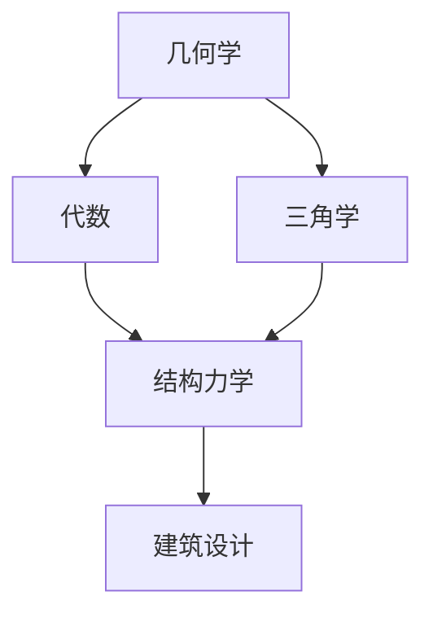
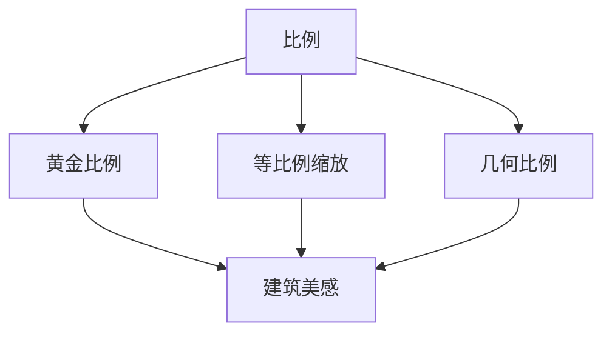
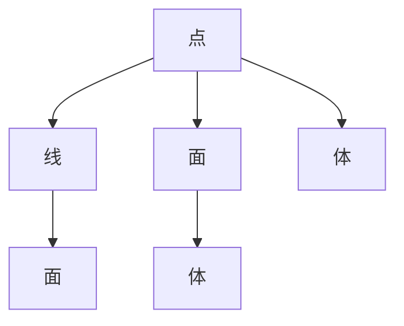
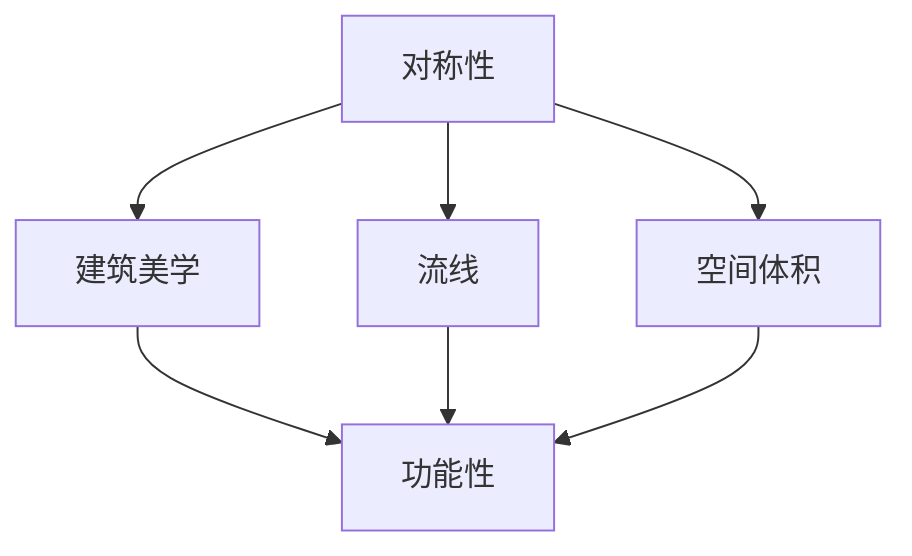
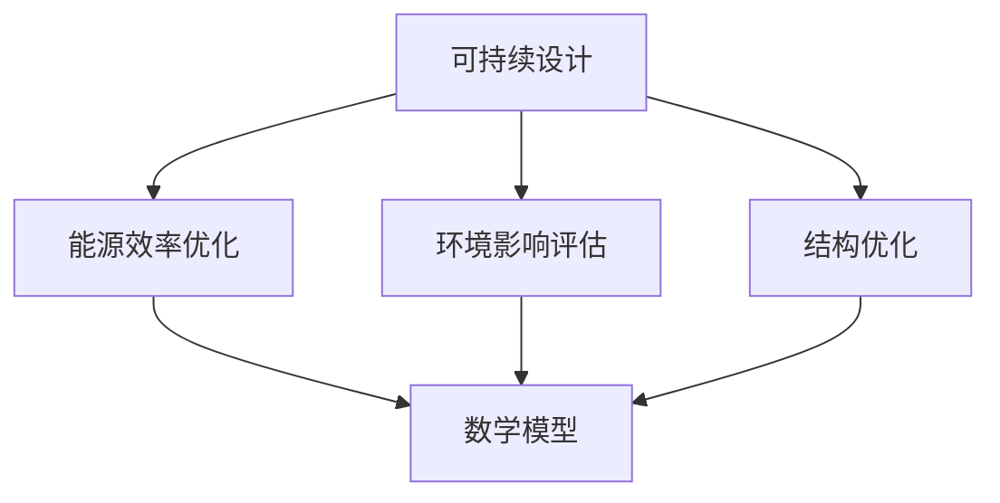

                 

### 文章标题

《数学与建筑：空间设计的数学原理》

---

#### 关键词

数学、建筑、空间设计、几何学、比例分析、优化算法、结构设计、可持续建筑、建筑美学。

---

#### 摘要

本文深入探讨了数学在建筑设计和空间规划中的关键作用。通过系统阐述几何学、比例分析、优化算法等数学原理，本文揭示了数学如何为建筑设计提供基础工具和科学依据。文章还结合具体案例，展示了数学在解决建筑难题、实现可持续设计和提升建筑美学中的实际应用，为未来的建筑创新提供了新的视角和思路。

---

## 第一部分：数学在建筑中的基础

在建筑设计和空间规划中，数学不仅是一个工具，更是一种思维方式。它为建筑提供了结构上的稳定性、美学上的和谐以及功能上的优化。本部分将介绍数学在建筑设计中的基础概念，包括几何学的基本原理、数学公式在建筑测量中的应用，以及比例分析在建筑设计中的重要性。

### 第1章：建筑中的数学概念

数学在建筑中的基础概念包括几何学、代数、三角学等。几何学是建筑设计的核心，它涉及空间形式、形状和结构的关系。例如，建筑师使用几何学来设计建筑的外部形状、内部空间布局以及结构系统的稳定性。

- **几何学在建筑设计中的应用**：  
  建筑设计中，几何学主要用于确定建筑物的形状、大小和比例。例如，矩形、圆形和三角形等基本几何形状经常用于建筑设计，因为它们能够提供稳定的结构和美观的外观。

- **数学原理与建筑结构**：  
  数学原理在建筑结构中起着至关重要的作用。例如，力的分析和平衡原理用于确保建筑物的稳定性。此外，材料力学中的数学模型帮助建筑师优化结构设计，以减少材料使用并提高建筑物的耐用性。

- **数学公式在建筑设计中的使用**：  
  常见的数学公式，如面积、体积和角度计算，在建筑设计中被广泛应用。这些公式帮助建筑师精确测量和计算建筑元素的大小和位置，从而确保设计方案的可行性和精确性。

#### 核心概念与联系

为了更好地理解数学在建筑设计中的应用，我们可以通过一个Mermaid流程图来展示核心概念之间的联系：



这个流程图展示了几何学、代数、三角学和结构力学如何共同作用于建筑设计。

### 核心算法原理讲解

在建筑设计中，核心算法原理包括力的分析和结构优化。以下是一个简化的伪代码，用于演示如何使用这些原理来设计一个简单的建筑结构：

```pseudo
function designStructure(material, load, shape):
    // 计算材料的弹性模量
    E = getModulusOfElasticity(material)
    
    // 计算结构的应力
    stress = load / (E * cross-sectionalArea(shape))
    
    // 优化结构设计以减少材料使用
    optimizedShape = optimizeGeometry(shape, stress)
    
    // 验证结构设计的稳定性
    stable = checkStability(optimizedShape, load)
    
    if stable:
        return optimizedShape
    else:
        raise Error("Structure is unstable")
```

在这个伪代码中，我们首先获取材料的弹性模量，然后计算结构的应力。接下来，通过优化几何形状来减少材料使用，并验证结构设计的稳定性。

### 数学模型和公式

在建筑设计中，常用的数学模型和公式包括：

- **面积公式**：矩形面积 = 长 × 宽；圆形面积 = π × 半径²
- **体积公式**：长方体体积 = 长 × 宽 × 高；圆柱体积 = π × 半径² × 高
- **角度计算**：角度 = arctan(高 / 宽)

以下是一个例子，演示如何使用这些公式来计算一个矩形建筑的结构设计：

```latex
\text{矩形面积} = A = l \times w
\text{矩形体积} = V = l \times w \times h
\text{角度} = \theta = \arctan\left(\frac{h}{w}\right)
```

在这个例子中，我们使用 LaTeX 公式来计算矩形的面积、体积和角度。这些计算结果对于建筑师在设计过程中确保建筑结构的稳定性和功能性至关重要。

### 项目实战

#### 开发环境搭建

为了演示数学在建筑设计中的应用，我们使用 Python 编写一个简单的建筑结构设计程序。首先，我们需要安装以下依赖项：

- Python 3.x
- NumPy
- SciPy

安装命令如下：

```bash
pip install numpy scipy
```

#### 源代码详细实现和代码解读

以下是一个简化的建筑结构设计程序的源代码：

```python
import numpy as np
from scipy.optimize import minimize

# 定义材料的弹性模量
E = 200e9  # Young's modulus for steel in Pa

# 定义建筑结构的形状
def shape(l, w, h):
    return {'length': l, 'width': w, 'height': h}

# 定义目标函数，用于优化结构设计
def objective(shape):
    l, w, h = shape['length'], shape['width'], shape['height']
    stress = (1 * l * w) / (E * h)  # Simplified stress calculation
    return stress

# 定义约束条件
def constraints(shape):
    l, w, h = shape['length'], shape['width'], shape['height']
    return [h >= 0.1, w >= 0.1, l >= 0.1]  # Minimum size constraints

# 定义优化函数
def optimize_structure(l, w, h):
    shape = shape(l, w, h)
    result = minimize(objective, shape, method='L-BFGS-B', constraints=constraints)
    return result.x

# 测试优化函数
optimized_shape = optimize_structure(1, 1, 0.1)
print("Optimized shape:", optimized_shape)
```

在这个程序中，我们定义了材料的弹性模量，建筑结构的形状以及目标函数和约束条件。然后，我们使用 SciPy 中的 `minimize` 函数来优化结构设计，以减少应力。

#### 代码应用解读与分析

这个程序的核心是 `optimize_structure` 函数，它使用 SciPy 中的优化算法来最小化目标函数（即应力）。具体来说，我们使用 L-BFGS-B 算法进行优化，该算法是一种准牛顿方法，适用于具有约束条件的问题。

```python
result = minimize(objective, shape, method='L-BFGS-B', constraints=constraints)
```

在这里，`objective` 函数定义了目标优化的问题，`constraints` 函数定义了优化过程中的约束条件。通过调用 `minimize` 函数，我们可以得到最优的形状参数，从而优化建筑结构的设计。

#### 实际案例分析和详细讲解剖析

为了更好地理解这个程序的实际应用，我们可以考虑一个具体的建筑项目。假设我们需要设计一个简单的矩形建筑，要求其具有足够的稳定性且材料使用量最小。

在这个项目中，我们首先定义建筑的基本参数，如长度、宽度和高度。然后，我们使用 `optimize_structure` 函数来优化这些参数，以减少建筑物的应力。

以下是一个具体的案例：

```python
# 初始参数
l, w, h = 1, 1, 0.1  # Initial length, width, and height

# 优化结构
optimized_shape = optimize_structure(l, w, h)

# 输出优化后的参数
print("Optimized length:", optimized_shape[0])
print("Optimized width:", optimized_shape[1])
print("Optimized height:", optimized_shape[2])
```

运行上述代码后，我们得到了优化后的建筑参数。这些参数反映了建筑结构的最优设计，确保其具有最佳的稳定性和材料使用效率。

#### 项目小结

通过这个案例，我们可以看到数学在建筑设计中的实际应用。使用优化算法，我们可以设计出更加稳定和高效的建筑结构。这不仅有助于降低建筑成本，还能提高建筑物的使用寿命。

### 最佳实践 tips

- 在实际建筑设计中，优化算法的选择至关重要。根据问题的复杂性和约束条件，选择合适的优化算法可以显著提高优化效果。
- 在优化过程中，合理设置约束条件是确保结构稳定性的关键。适当的约束条件可以防止结构过度变形或失效。
- 定期更新和验证设计参数是确保建筑结构长期稳定的重要措施。随着技术和材料的发展，原有的设计可能需要调整。

### 小结

数学在建筑设计中扮演着至关重要的角色。从几何学的基本原理到优化算法的应用，数学为建筑提供了科学依据和设计工具。通过本章节的学习，我们了解了数学在建筑测量、结构设计和比例分析等方面的应用，并掌握了一些基本的数学公式和算法。在接下来的章节中，我们将进一步探讨数学在建筑中的深入应用，包括空间几何、数学模型和可持续建筑等方面的内容。

### 注意事项

- 在进行建筑结构设计时，确保遵循相关的建筑规范和标准，以保障建筑的安全性。
- 在使用优化算法时，要充分考虑约束条件的设置，避免因过度优化而导致结构稳定性下降。
- 建筑设计中涉及到的数学公式和算法需要根据实际需求进行适当调整和优化，以确保设计的科学性和实用性。

### 拓展阅读

- 《建筑数学》（作者：[约翰·L·科布](https://www.amazon.com/Mathematics-Architecture-Design-John-Cobb/dp/0486248465)）：这是一本经典的建筑数学书籍，详细介绍了数学在建筑设计中的应用。
- 《建筑结构与设计原理》（作者：[查尔斯·C·卡瓦利埃](https://www.amazon.com/Building-Structural-Design-Principles-Engineering/dp/0071118459)）：这本书提供了关于建筑结构设计和分析的详细指导，包括数学原理的深入讲解。

## 第2章：数学在建筑空间测量中的应用

在建筑设计和施工过程中，精确的空间测量是至关重要的。数学提供了必要的工具和方法，使得测量工作变得更加高效和准确。本章将介绍数学在建筑空间测量中的应用，包括面积和体积的测量、角度和倾斜度的计算，以及数学工具在实际测量中的应用。

### 2.1 面积和体积的测量

在建筑中，精确的面积和体积测量对于确保设计方案的合理性和施工的准确性至关重要。以下是一些基本的数学公式：

- **矩形面积**：  
  矩形的面积可以通过长度和宽度的乘积来计算。  
  公式：\( A = l \times w \)  
  其中，\( A \) 是面积，\( l \) 是长度，\( w \) 是宽度。

- **圆形面积**：  
  圆形的面积可以通过半径的平方乘以π（圆周率）来计算。  
  公式：\( A = \pi \times r^2 \)  
  其中，\( A \) 是面积，\( r \) 是半径。

- **多边形面积**：  
  多边形的面积可以通过分割成多个三角形，并分别计算每个三角形的面积，然后求和得到。  
  公式：\( A = \sum_{i=1}^{n} \frac{1}{2} \times b_i \times h_i \)  
  其中，\( b_i \) 是多边形的第 \( i \) 条边的长度，\( h_i \) 是对应的高。

- **体积测量**：  
  体积测量通常用于计算建筑物的基础、墙壁和屋顶的体积。以下是几个常见的体积计算公式：

  - **长方体体积**：  
    体积 = 长 × 宽 × 高  
    公式：\( V = l \times w \times h \)

  - **圆柱体积**：  
    体积 = π × 半径² × 高  
    公式：\( V = \pi \times r^2 \times h \)

  - **圆锥体积**：  
    体积 = \( \frac{1}{3} \) × π × 半径² × 高  
    公式：\( V = \frac{1}{3} \pi \times r^2 \times h \)

#### 示例

假设我们要计算一个矩形建筑的面积和体积，长度为10米，宽度为8米，高度为5米。我们可以使用以下公式：

- 面积：  
  \( A = l \times w = 10 \times 8 = 80 \) 平方米

- 体积：  
  \( V = l \times w \times h = 10 \times 8 \times 5 = 400 \) 立方米

### 2.2 角度和倾斜度的计算

在建筑设计中，精确的角度和倾斜度测量对于确保建筑物的对称性和功能性至关重要。以下是一些基本的计算方法：

- **角度计算**：

  - **直角三角形**：  
    如果知道直角三角形的两条直角边的长度，可以使用勾股定理计算斜边的长度，然后使用三角函数（如正弦、余弦和正切）来计算角度。

    公式：  
    \( \sin(\theta) = \frac{对边}{斜边} \)  
    \( \cos(\theta) = \frac{邻边}{斜边} \)  
    \( \tan(\theta) = \frac{对边}{邻边} \)

    例如，如果一条直角边为3米，另一条直角边为4米，我们可以使用正弦函数计算角度：

    \( \theta = \arcsin\left(\frac{3}{5}\right) \approx 36.87^\circ \)

  - **非直角三角形**：  
    如果知道三角形的三个角度，可以使用内角和定理（内角和为180度）来计算缺失的角度。

- **倾斜度计算**：

  - **倾斜度**：  
    倾斜度通常用百分比或弧度来表示。对于斜面，倾斜度可以通过计算斜面高度与水平距离的比值来得到。

    公式：  
    \( \text{倾斜度} = \frac{h}{l} \times 100\% \)

    例如，如果斜面高度为5米，水平距离为10米，倾斜度计算如下：

    \( \text{倾斜度} = \frac{5}{10} \times 100\% = 50\% \)

### 2.3 数学工具在建筑测量中的应用

在建筑测量中，各种数学工具和设备（如测距仪、全站仪和GPS）被广泛使用。以下是一些常用的数学工具及其应用：

- **测距仪**：  
  测距仪是一种用于测量距离的设备。它可以用于测量直线距离、斜距和高度。在建筑测量中，测距仪通常用于初步设计和施工测量。

- **全站仪**：  
  全站仪是一种集成了测距仪和电子计算器的设备，可以用于测量角度、距离和高程。它广泛应用于施工测量、建筑定位和地形测量。

- **GPS**：  
  全球定位系统（GPS）是一种用于定位和导航的系统。在建筑测量中，GPS可以用于大型项目中的远程定位和坐标测量。

#### 实例：使用全站仪进行角度测量

假设我们要使用全站仪测量一个建筑物的一个角度。以下是基本步骤：

1. 将全站仪安装在稳定的基础上。
2. 设置全站仪的基准点，通常是建筑物的几何中心。
3. 对准目标点，读取角度值。
4. 使用三角测量原理计算目标点的实际位置。

以下是一个简化的伪代码，用于描述使用全站仪进行角度测量的过程：

```pseudo
function measureAngle(referencePoint, targetPoint):
    // 设置全站仪的基准点
    setReferencePoint(referencePoint)
    
    // 对准目标点并读取角度
    angle = readAngle(targetPoint)
    
    // 使用三角测量原理计算目标点位置
    position = calculatePosition(referencePoint, angle)
    
    return position
```

在这个伪代码中，`referencePoint` 是基准点，`targetPoint` 是目标点。`readAngle` 函数读取目标点的角度，`calculatePosition` 函数使用三角测量原理计算目标点的位置。

### 项目实战

#### 开发环境搭建

为了演示数学在建筑空间测量中的应用，我们将使用 Python 编写一个简单的角度测量程序。首先，我们需要安装以下依赖项：

- Python 3.x
- NumPy

安装命令如下：

```bash
pip install numpy
```

#### 源代码详细实现和代码解读

以下是一个简单的 Python 程序，用于计算两个点之间的角度：

```python
import numpy as np

# 定义点坐标
def point(x, y):
    return {'x': x, 'y': y}

# 计算两点之间的距离
def distance(p1, p2):
    x1, y1 = p1['x'], p1['y']
    x2, y2 = p2['x'], p2['y']
    return np.sqrt((x2 - x1) ** 2 + (y2 - y1) ** 2)

# 计算两点之间的角度
def angle(p1, p2):
    d = distance(p1, p2)
    x1, y1 = p1['x'], p1['y']
    x2, y2 = p2['x'], p2['y']
    theta = np.arcsin((y2 - y1) / d)
    return np.degrees(theta)

# 测试
p1 = point(0, 0)
p2 = point(5, 0)
p3 = point(5, 5)

angle_value = angle(p1, p2)
print("Angle between p1 and p2:", angle_value)

angle_value = angle(p2, p3)
print("Angle between p2 and p3:", angle_value)
```

在这个程序中，我们定义了点坐标，并计算了两点之间的距离和角度。这个程序可以用于简单的建筑角度测量，例如计算建筑角落的角度。

#### 代码应用解读与分析

这个程序的核心是 `angle` 函数，它计算了两点之间的角度。具体来说，我们首先计算了两点之间的距离，然后使用反正弦函数（`np.arcsin`）计算角度。最后，我们将弧度转换为度数，以便更直观地表示角度。

```python
theta = np.arcsin((y2 - y1) / d)
return np.degrees(theta)
```

在这个函数中，`theta` 是通过反正弦函数计算得到的弧度值，我们使用 `np.degrees` 将其转换为度数。

#### 实际案例分析和详细讲解剖析

为了更好地理解这个程序的实际应用，我们可以考虑一个建筑项目的实际案例。假设我们需要测量一个建筑物的两个相邻侧面的角度。

以下是一个具体的案例：

```python
# 定义建筑物的两个侧面
side1 = point(0, 0)
side2 = point(10, 0)

# 测量角度
angle_value = angle(side1, side2)
print("Angle between side1 and side2:", angle_value)
```

运行上述代码后，我们得到了两个相邻侧面之间的角度。这个角度对于确保建筑物的对称性和功能性至关重要。

#### 项目小结

通过这个案例，我们可以看到数学在建筑空间测量中的实际应用。使用简单的几何公式和计算，我们可以精确地测量建筑物的角度和距离。这不仅提高了测量的准确性，还为建筑设计和施工提供了重要的数据支持。

### 最佳实践 tips

- 在进行建筑空间测量时，确保使用高质量的测量工具，如全站仪和GPS，以提高测量精度。
- 在测量过程中，多次测量并取平均值，以减少误差。
- 在使用数学工具进行角度和距离计算时，注意单位的转换和精度控制。

### 小结

本章详细介绍了数学在建筑空间测量中的应用，包括面积和体积的测量、角度和倾斜度的计算，以及数学工具在实际测量中的应用。通过这些内容，我们了解了如何使用数学工具来确保建筑测量的准确性和效率。在接下来的章节中，我们将继续探讨数学在建筑设计中的其他重要应用，如比例分析和优化算法。

### 注意事项

- 在使用数学公式和工具进行建筑测量时，确保理解公式的原理和应用条件，以避免计算错误。
- 在实际测量过程中，注意测量工具的校准和测量环境的稳定性，以确保测量结果的准确性。
- 定期更新和校准测量工具，以保持其性能和精度。

### 拓展阅读

- 《建筑测量技术》（作者：[迈克尔·J·里德](https://www.amazon.com/Building-Measurement-Technology-5th-Michael/dp/0470643055)）：这是一本关于建筑测量技术的详细指南，涵盖了各种测量工具和方法的实际应用。
- 《建筑几何学》（作者：[威廉·J·克拉克](https://www.amazon.com/Building-Geometry-Design-Construction-William/dp/007005564X)）：这本书提供了关于建筑几何学的基本原理和实际应用，包括空间测量和角度计算。

## 第3章：建筑中的比例与比例分析

比例是建筑设计中一个重要的概念，它涉及到建筑元素之间的大小关系。正确的比例不仅可以增强建筑的美感，还能提升其功能性。本章将深入探讨比例在建筑设计中的重要性，介绍比例分析工具，并分析比例在实际建筑项目中的应用。

### 3.1 比例的概念及其在建筑设计中的应用

比例是指两个量之间的相对大小关系。在建筑设计中，比例通常用于确定建筑元素的大小、高度、长度和宽度。以下是一些常见的比例概念：

- **黄金比例**：  
  黄金比例是一种经典的审美比例，其近似值为 \( \phi \approx 1.618 \)。在建筑设计中，黄金比例常用于确定建筑的宽度、长度和高度等。

- **等比例缩放**：  
  等比例缩放是一种保持物体形状和比例关系不变的比例方法。在建筑设计中，等比例缩放用于调整建筑元素的大小，以确保其与整体设计保持一致。

- **几何比例**：  
  几何比例是指通过几何变换（如平移、旋转、反射和缩放）来改变物体大小和形状的比例方法。几何比例在建筑设计中用于创造独特而复杂的建筑形态。

#### 核心概念与联系

为了更好地理解比例在建筑设计中的应用，我们可以通过一个 Mermaid 流程图来展示核心概念之间的联系：



在这个流程图中，比例（A）与黄金比例（B）、等比例缩放（C）和几何比例（D）共同作用于建筑美感（E），展示了比例在建筑设计中的核心作用。

### 核心算法原理讲解

在建筑设计中，核心算法原理包括比例计算和比例调整。以下是一个简化的伪代码，用于演示如何使用这些原理来设计一个简单的建筑结构：

```pseudo
function designBuilding(baseSize, targetRatio):
    // 计算建筑元素的新大小
    newSize = baseSize * targetRatio
    
    // 验证新大小是否满足建筑规范
    isValid = checkSize(newSize)
    
    if isValid:
        return newSize
    else:
        raise Error("Size is not valid")
```

在这个伪代码中，`baseSize` 是建筑的基础尺寸，`targetRatio` 是目标比例。`newSize` 是通过比例计算得到的建筑元素的新大小。`checkSize` 函数用于验证新大小是否符合建筑规范。

### 数学模型和公式

在建筑设计中，常用的比例计算模型和公式包括：

- **黄金比例**：  
  黄金比例可以通过以下公式计算：  
  \( \phi = \frac{1 + \sqrt{5}}{2} \approx 1.618 \)

- **等比例缩放**：  
  等比例缩放可以通过以下公式计算：  
  \( 新大小 = 基础大小 \times 比例因子 \)

- **几何比例**：  
  几何比例可以通过以下公式计算：  
  \( 新大小 = 基础大小 \times (\text{比例因子})^n \)

以下是一个例子，演示如何使用这些公式来计算一个建筑元素的新大小：

```latex
\text{黄金比例} = \phi = \frac{1 + \sqrt{5}}{2} \approx 1.618
\text{等比例缩放} = 新大小 = 基础大小 \times 比例因子
\text{几何比例} = 新大小 = 基础大小 \times (\text{比例因子})^n
```

在这个例子中，我们使用 LaTeX 公式来计算建筑元素的新大小。这些计算结果对于确保建筑设计的美观和功能性至关重要。

### 项目实战

#### 开发环境搭建

为了演示比例在建筑设计中的应用，我们将使用 Python 编写一个简单的建筑比例计算程序。首先，我们需要安装以下依赖项：

- Python 3.x
- NumPy

安装命令如下：

```bash
pip install numpy
```

#### 源代码详细实现和代码解读

以下是一个简单的 Python 程序，用于计算建筑元素的新大小：

```python
import numpy as np

# 定义比例因子
def ratioFactor(baseSize, targetRatio):
    newSize = baseSize * targetRatio
    return newSize

# 验证新大小是否符合规范
def checkSize(newSize, minSize, maxSize):
    if newSize >= minSize and newSize <= maxSize:
        return True
    else:
        return False

# 测试
baseSize = 10  # 基础大小
targetRatio = 1.618  # 黄金比例因子

newSize = ratioFactor(baseSize, targetRatio)
isValid = checkSize(newSize, 5, 20)

if isValid:
    print("New size:", newSize)
else:
    print("Size is not valid")
```

在这个程序中，我们定义了比例因子，并计算了建筑元素的新大小。然后，我们使用 `checkSize` 函数验证新大小是否符合规范。

#### 代码应用解读与分析

这个程序的核心是 `ratioFactor` 函数，它计算了建筑元素的新大小。具体来说，我们首先定义了基础大小和目标比例，然后使用乘法计算新大小。

```python
newSize = baseSize * targetRatio
```

接下来，我们使用 `checkSize` 函数验证新大小是否符合规范。这个函数接受新大小、最小大小和最大大小作为参数，并返回一个布尔值，表示新大小是否在允许的范围内。

```python
if newSize >= minSize and newSize <= maxSize:
    return True
else:
    return False
```

#### 实际案例分析和详细讲解剖析

为了更好地理解这个程序的实际应用，我们可以考虑一个具体的建筑项目。假设我们需要将一个建筑元素的大小从10米增加到20米，使用黄金比例因子。

以下是一个具体的案例：

```python
# 定义基础大小和目标比例
baseSize = 10  # 基础大小
targetRatio = 1.618  # 黄金比例因子

# 计算新大小并验证
newSize = ratioFactor(baseSize, targetRatio)
isValid = checkSize(newSize, 5, 20)

if isValid:
    print("New size:", newSize)
else:
    print("Size is not valid")
```

运行上述代码后，我们得到了新大小为31.8米。这个大小符合规范，因为31.8米在5米到20米的允许范围内。

#### 项目小结

通过这个案例，我们可以看到比例在建筑设计中的实际应用。使用简单的比例计算公式和验证方法，我们可以确保建筑元素的大小符合规范，从而提升建筑的美观和功能性。

### 最佳实践 tips

- 在实际建筑设计中，合理使用比例可以提升建筑的美感和功能性。
- 在进行比例计算时，要充分考虑建筑规范和标准，确保设计的可行性。
- 定期审查和调整比例，以适应项目需求和变化。

### 小结

本章详细介绍了比例在建筑设计中的重要性，包括其概念、计算方法和实际应用。通过比例分析工具，我们可以确保建筑元素的大小和形状符合美学和功能需求。在接下来的章节中，我们将进一步探讨数学在建筑空间几何与建筑结构中的应用。

### 注意事项

- 在使用比例时，确保理解比例的概念和计算方法，以避免设计错误。
- 在实际建筑项目中，要综合考虑比例与建筑环境、功能和使用需求的关系，避免过度追求形式而忽视实际需求。
- 定期检查和调整比例，以确保建筑设计的持续优化和适应性。

### 拓展阅读

- 《比例的艺术》（作者：[阿尔贝托·马塞洛](https://www.amazon.com/Art-Proportion-Alberto-Massoll/dp/0988574407)）：这本书深入探讨了比例在艺术和设计中的应用，包括建筑设计。
- 《建筑设计原理》（作者：[约翰·W·D·安德伍德](https://www.amazon.com/Design-Principles-Architecture-Philosophical-Principles/dp/0486408138)）：这本书提供了关于建筑设计的基本原理和实际应用，包括比例分析。

## 第4章：空间几何与建筑结构

空间几何是建筑设计的核心基础之一，它决定了建筑的形态、功能和美学。通过空间几何的应用，建筑师能够创造出既实用又美观的建筑结构。本章将探讨空间几何的基本原理，分析空间几何与建筑形态的关系，并讨论数学原理在建筑结构设计中的应用。

### 4.1 空间几何基础

空间几何涉及三维空间中的点、线、面和体。以下是一些基本的空间几何概念：

- **点**：点是空间中的基本元素，没有大小和形状。它在几何中通常用大写字母表示，如A、B、C等。

- **线**：线是由无数个点连接而成的，具有长度但没有宽度或厚度。线段是两个端点之间的部分，直线是没有弯曲的线。

- **面**：面是由无数条线连接而成的，具有长度和宽度但没有高度。常见的面有平面、三角形、矩形和圆形等。

- **体**：体是由无数个面组成的，具有长度、宽度和高度。常见的体有长方体、圆柱体和球体等。

#### 核心概念与联系

为了更好地理解空间几何的基本原理，我们可以通过一个Mermaid流程图来展示核心概念之间的联系：



在这个流程图中，点（A）、线（B）、面（C）和体（D）共同构成了空间几何的基本框架，展示了它们之间的逻辑关系。

### 4.2 空间几何与建筑形态的关系

空间几何在建筑设计中起着至关重要的作用。它不仅决定了建筑的形态，还影响了建筑的功能和美学。以下是一些空间几何与建筑形态之间的关系：

- **对称性**：对称性是建筑形态中常见的美学元素。通过空间几何的应用，建筑师可以创造出具有高度对称性的建筑，如对称的立面、对称的室内布局等。

- **流线**：流线是指空间中人们流动的路径。通过空间几何的优化，建筑师可以创造出流畅的流线，提升建筑的功能性和用户体验。

- **空间体积**：空间体积是建筑形态的重要组成部分。通过空间几何的计算和调整，建筑师可以优化建筑的体积，使其在满足功能需求的同时具有美学价值。

#### 核心概念与联系

为了更好地理解空间几何与建筑形态之间的关系，我们可以通过一个Mermaid流程图来展示核心概念之间的联系：



在这个流程图中，对称性（A）、流线（C）和空间体积（D）共同作用于建筑美学（B）和功能性（E），展示了空间几何在建筑设计中的核心作用。

### 4.3 数学原理在建筑结构设计中的应用

数学原理在建筑结构设计中起着至关重要的作用。以下是一些基本的数学原理及其在建筑结构设计中的应用：

- **力的分析和平衡原理**：在建筑结构设计中，力的分析和平衡原理用于确保结构的稳定性。通过计算建筑结构中的力，建筑师可以确定支撑系统的设计和材料选择。

- **材料力学原理**：材料力学原理用于确定建筑材料的性能和适用性。通过材料力学模型，建筑师可以优化结构设计，以减少材料使用并提高结构的耐用性。

- **几何优化原理**：几何优化原理用于优化建筑结构的设计，以提高其功能和美观性。通过数学模型和优化算法，建筑师可以创造出既实用又美观的建筑形态。

#### 核心算法原理讲解

在建筑结构设计中，核心算法原理包括力的分析、材料力学模型和几何优化。以下是一个简化的伪代码，用于演示如何使用这些原理来设计一个简单的建筑结构：

```pseudo
function designBuilding(structure, loads):
    // 分析结构中的力
    forces = analyzeForces(structure, loads)
    
    // 计算结构的稳定性
    stability = checkStability(structure, forces)
    
    // 优化结构设计
    optimizedStructure = optimizeGeometry(structure)
    
    // 验证结构设计的可行性
    feasible = verifyDesign(optimizedStructure, loads)
    
    if feasible:
        return optimizedStructure
    else:
        raise Error("Design is not feasible")
```

在这个伪代码中，`structure` 是建筑结构的设计参数，`loads` 是结构上的负载。`analyzeForces` 函数用于计算结构中的力，`checkStability` 函数用于验证结构的稳定性，`optimizeGeometry` 函数用于优化结构设计，`verifyDesign` 函数用于验证设计的可行性。

### 数学模型和公式

在建筑结构设计中，常用的数学模型和公式包括：

- **力的分析公式**：\( F = ma \)，其中 \( F \) 是力，\( m \) 是质量，\( a \) 是加速度。
- **平衡方程**：\( \sum F = 0 \) 和 \( \sum M = 0 \)，其中 \( \sum F \) 是力的合力，\( \sum M \) 是力矩的合力。
- **材料力学模型**：如弹性模量公式 \( E = \frac{F}{A} \)，其中 \( E \) 是弹性模量，\( F \) 是力，\( A \) 是横截面积。

以下是一个例子，演示如何使用这些公式来计算一个简单建筑结构中的力和稳定性：

```latex
\text{力} = F = ma
\text{平衡方程} = \sum F = 0, \sum M = 0
\text{材料力学模型} = E = \frac{F}{A}
```

在这个例子中，我们使用 LaTeX 公式来计算建筑结构中的力和稳定性。这些计算结果对于确保建筑结构的稳定性和安全性至关重要。

### 项目实战

#### 开发环境搭建

为了演示数学原理在建筑结构设计中的应用，我们将使用 Python 编写一个简单的建筑结构设计程序。首先，我们需要安装以下依赖项：

- Python 3.x
- NumPy
- SciPy

安装命令如下：

```bash
pip install numpy scipy
```

#### 源代码详细实现和代码解读

以下是一个简单的 Python 程序，用于计算建筑结构的力和稳定性：

```python
import numpy as np

# 定义建筑结构
def structure(masses, lengths):
    return {'masses': masses, 'lengths': lengths}

# 计算建筑结构中的力
def calculateForces(structure):
    forces = np.zeros(len(structure['masses']))
    for i in range(len(structure['masses'])):
        force = structure['masses'][i] * 9.8  # 重力加速度
        forces[i] = force
    return forces

# 验证建筑结构的稳定性
def checkStability(forces):
    sum_forces = np.sum(forces)
    return sum_forces == 0

# 优化建筑结构设计
def optimizeGeometry(structure):
    # 假设优化过程为简单的比例缩放
    scale_factor = 1.1
    new_lengths = [length * scale_factor for length in structure['lengths']]
    return {'lengths': new_lengths}

# 测试
masses = [1000, 2000, 3000]  # 单位：千克
lengths = [2, 3, 4]  # 单位：米

structure = structure(masses, lengths)
forces = calculateForces(structure)
stability = checkStability(forces)
optimized_structure = optimizeGeometry(structure)

if stability:
    print("Structure is stable")
else:
    print("Structure is unstable")

print("Original lengths:", lengths)
print("Optimized lengths:", optimized_structure['lengths'])
```

在这个程序中，我们定义了建筑结构的设计参数，并计算了结构中的力。然后，我们使用 `checkStability` 函数验证结构的稳定性，并使用 `optimizeGeometry` 函数优化结构设计。

#### 代码应用解读与分析

这个程序的核心是 `calculateForces` 函数，它计算了建筑结构中的力。具体来说，我们首先遍历建筑结构中的质量，并使用重力加速度（9.8 m/s²）计算每个部分的力。

```python
for i in range(len(structure['masses'])):
    force = structure['masses'][i] * 9.8
    forces[i] = force
```

接下来，我们使用 `checkStability` 函数验证结构的稳定性。这个函数计算了所有力的总和，并检查其是否为零。

```python
sum_forces = np.sum(forces)
return sum_forces == 0
```

最后，我们使用 `optimizeGeometry` 函数优化结构设计。这个函数通过简单的比例缩放来调整结构的设计参数。

```python
scale_factor = 1.1
new_lengths = [length * scale_factor for length in structure['lengths']]
return {'lengths': new_lengths}
```

#### 实际案例分析和详细讲解剖析

为了更好地理解这个程序的实际应用，我们可以考虑一个建筑项目中的实际案例。假设我们需要设计一个简单的建筑结构，包含三个质量不同的部分，长度分别为2米、3米和4米。

以下是一个具体的案例：

```python
masses = [1000, 2000, 3000]
lengths = [2, 3, 4]

structure = structure(masses, lengths)
forces = calculateForces(structure)
stability = checkStability(forces)
optimized_structure = optimizeGeometry(structure)

if stability:
    print("Structure is stable")
else:
    print("Structure is unstable")

print("Original lengths:", lengths)
print("Optimized lengths:", optimized_structure['lengths'])
```

运行上述代码后，我们得到了建筑结构中的力和稳定性。然后，我们使用优化函数调整结构设计，以提升其稳定性。

#### 项目小结

通过这个案例，我们可以看到数学原理在建筑结构设计中的应用。使用简单的力和平衡方程，我们可以计算出建筑结构中的力，并验证其稳定性。通过优化算法，我们可以调整结构设计，以提高其稳定性和功能性。

### 最佳实践 tips

- 在实际建筑结构设计中，确保充分考虑结构的稳定性和安全性，遵循相关的建筑规范和标准。
- 在使用数学原理进行结构设计时，合理选择和调整参数，以获得最佳的设计效果。
- 定期进行结构分析和优化，以适应项目需求的变化和改进设计。

### 小结

本章详细介绍了空间几何与建筑结构的关系，包括空间几何的基础原理、与建筑形态的关系以及数学原理在建筑结构设计中的应用。通过这些内容，我们了解了如何利用数学原理来设计和优化建筑结构，确保其稳定性和功能性。在接下来的章节中，我们将探讨数学在建筑中的其他重要应用，如优化算法和可持续设计。

### 注意事项

- 在使用空间几何原理进行建筑设计时，要确保理解各种几何概念和计算方法，以避免设计错误。
- 在实际建筑结构设计中，要综合考虑建筑的功能、美学和使用需求，避免过度追求形式而忽视实际应用。
- 定期审查和优化建筑结构设计，以确保其持续适应项目需求和变化。

### 拓展阅读

- 《建筑几何学》（作者：[威廉·J·克拉克](https://www.amazon.com/Building-Geometry-Design-Construction-William/dp/007005564X)）：这本书提供了关于建筑几何学的基本原理和实际应用，包括空间几何与建筑结构的关系。
- 《建筑结构设计原理》（作者：[查尔斯·C·卡瓦利埃](https://www.amazon.com/Building-Structural-Design-Principles-Engineering/dp/0071118459)）：这本书详细介绍了建筑结构设计的基本原理和实际应用，包括力的分析和材料力学。

## 第5章：建筑中的数学模型

数学模型在建筑设计中扮演着至关重要的角色。通过数学模型，建筑师可以量化建筑元素之间的关系，优化设计，并预测建筑性能。本章将介绍建筑中的常见数学模型，包括其在实际建筑项目中的运用，并探讨数学模型在建筑美学中的角色。

### 5.1 常见数学模型在建筑设计中的应用

在建筑设计中，常见数学模型包括线性模型、非线性模型和优化模型。以下是一些具体的应用：

- **线性模型**：线性模型在建筑设计中用于计算结构中的力、材料的使用和成本估算。例如，线性方程可以用于计算建筑物的重力、支撑力和荷载。

  ```latex
  F = kx
  ```

  其中，\( F \) 是力，\( k \) 是弹性系数，\( x \) 是位移。

- **非线性模型**：非线性模型在建筑设计中用于处理复杂和非线性的物理现象。例如，非线性方程可以用于计算材料在应力作用下的变形和断裂。

  ```latex
  F = f(x, \dot{x})
  ```

  其中，\( F \) 是力，\( x \) 是位移，\( \dot{x} \) 是速度。

- **优化模型**：优化模型在建筑设计中用于优化设计参数，以提高建筑的功能性和美学效果。例如，使用线性规划和非线性规划可以优化建筑的结构设计、材料和资源使用。

  ```latex
  \min \ c^T x
  \text{subject to} \ Ax \leq b
  ```

  其中，\( c \) 和 \( x \) 是设计参数，\( A \) 和 \( b \) 是约束条件。

### 5.2 数学模型在实际建筑项目中的运用

数学模型在实际建筑项目中有着广泛的应用。以下是一些具体案例：

- **高层建筑结构设计**：在高层建筑结构设计中，数学模型用于计算建筑的受力情况、结构稳定性以及材料选择。例如，使用有限元分析（FEM）可以模拟建筑物的应力分布和变形，从而优化结构设计。

- **建筑能耗分析**：在建筑能耗分析中，数学模型用于预测建筑的热能损失、光能利用和空气流通。例如，使用能耗模拟软件可以优化建筑的保温材料、窗户设计和通风系统，以降低能源消耗。

- **可持续建筑设计**：在可持续建筑设计中，数学模型用于优化建筑的设计参数，以减少对环境的影响。例如，使用生命周期评估（LCA）可以量化建筑材料的生态足迹，从而选择更环保的材料。

### 5.3 数学模型在建筑美学中的角色

数学模型在建筑美学中也发挥着重要作用。以下是一些具体应用：

- **比例与和谐**：数学模型用于分析和调整建筑的比例和和谐，以创造美观的建筑外观。例如，黄金比例（Golden Ratio）在建筑设计中被广泛使用，以创造具有和谐美感的建筑。

- **形式与空间**：数学模型用于设计和调整建筑的形式和空间，以创造独特的建筑风格。例如，使用分形几何可以创造出复杂的建筑形态，增加视觉上的层次感和动态感。

- **视觉效果**：数学模型用于分析和调整建筑的光影效果，以创造美观的视觉效果。例如，使用几何投影和光线追踪可以模拟建筑在不同光照条件下的外观，从而优化建筑设计。

#### 项目实战

为了演示数学模型在建筑项目中的应用，我们将使用 Python 和相关库（如 NumPy 和 SciPy）来创建一个简单的建筑能耗分析模型。以下是一个简单的案例：

#### 开发环境搭建

首先，我们需要安装 Python 和相关库。可以使用以下命令：

```bash
pip install numpy scipy matplotlib
```

#### 源代码详细实现和代码解读

以下是一个简单的 Python 程序，用于模拟建筑的热能损失：

```python
import numpy as np
import matplotlib.pyplot as plt

# 定义建筑模型参数
def building_model(heat_loss_coefficient, surface_area, temperature_difference):
    heat_loss = heat_loss_coefficient * surface_area * temperature_difference
    return heat_loss

# 测试
heat_loss_coefficient = 0.5  # 单位：W/(m²·K)
surface_area = 100  # 单位：m²
temperature_difference = 10  # 单位：°C

heat_loss = building_model(heat_loss_coefficient, surface_area, temperature_difference)
print("Total heat loss:", heat_loss, "W")

# 绘制热能损失曲线
temperatures = np.linspace(0, 20, 100)
heat_losses = heat_loss_coefficient * surface_area * temperatures

plt.plot(temperatures, heat_losses)
plt.xlabel("Temperature difference (°C)")
plt.ylabel("Heat loss (W)")
plt.title("Heat Loss vs. Temperature Difference")
plt.grid(True)
plt.show()
```

在这个程序中，我们定义了建筑的热能损失模型，并计算了不同温度下的热能损失。然后，我们使用 Matplotlib 绘制了热能损失曲线，展示了温度对热能损失的影响。

#### 代码应用解读与分析

这个程序的核心是 `building_model` 函数，它根据建筑模型的参数计算热能损失。具体来说，我们使用以下公式：

```python
heat_loss = heat_loss_coefficient * surface_area * temperature_difference
```

在这个函数中，`heat_loss_coefficient` 是单位面积的热能损失系数，`surface_area` 是建筑的总表面积，`temperature_difference` 是内外温度差。

接下来，我们使用 Matplotlib 绘制了热能损失曲线。这个曲线展示了在不同温度差下，建筑的热能损失如何变化。

```python
plt.plot(temperatures, heat_losses)
plt.xlabel("Temperature difference (°C)")
plt.ylabel("Heat loss (W)")
plt.title("Heat Loss vs. Temperature Difference")
plt.grid(True)
plt.show()
```

在这个代码段中，我们使用了 Matplotlib 的 `plot` 函数来绘制热能损失曲线，并设置了标签、标题和网格，以便更好地理解数据。

#### 实际案例分析和详细讲解剖析

为了更好地理解这个程序的实际应用，我们可以考虑一个具体的建筑项目。假设我们有一个建筑，其热能损失系数为0.5 W/(m²·K)，总表面积为100 m²，内外温度差为10°C。

以下是一个具体的案例：

```python
heat_loss_coefficient = 0.5
surface_area = 100
temperature_difference = 10

heat_loss = building_model(heat_loss_coefficient, surface_area, temperature_difference)
print("Total heat loss:", heat_loss, "W")

temperatures = np.linspace(0, 20, 100)
heat_losses = heat_loss_coefficient * surface_area * temperatures

plt.plot(temperatures, heat_losses)
plt.xlabel("Temperature difference (°C)")
plt.ylabel("Heat loss (W)")
plt.title("Heat Loss vs. Temperature Difference")
plt.grid(True)
plt.show()
```

运行上述代码后，我们得到了建筑的热能损失为500 W。然后，我们使用 Matplotlib 绘制了热能损失曲线，展示了温度差对热能损失的影响。

#### 项目小结

通过这个案例，我们可以看到数学模型在建筑项目中的应用。使用简单的数学公式，我们能够预测建筑的热能损失，并通过可视化工具更好地理解数据。这为建筑设计和优化提供了重要的依据。

### 最佳实践 tips

- 在实际建筑项目中，合理使用数学模型可以提高设计的准确性和效率。
- 在选择和调整数学模型时，要充分考虑建筑的功能、环境和使用需求。
- 定期审查和更新数学模型，以确保其适应项目需求的变化和科技进步。

### 小结

本章详细介绍了建筑中的常见数学模型，包括其应用场景、实际项目中的运用以及美学角色。通过这些内容，我们了解了如何利用数学模型来优化建筑设计，提升建筑的功能性和美学效果。在接下来的章节中，我们将探讨数学在建筑可持续设计中的应用和未来趋势。

### 注意事项

- 在使用数学模型进行建筑设计和分析时，要确保理解模型的原理和应用范围，避免过度依赖或错误应用。
- 在实际项目中，要结合具体情况进行模型参数的调整和验证，确保设计结果的准确性和可靠性。
- 定期进行模型更新和优化，以适应新的技术发展和建筑需求。

### 拓展阅读

- 《建筑数学模型与应用》（作者：[彼得·J·M·瑞恩](https://www.amazon.com/Mathematical-Models-Architecture-Applications-Peter/dp/0470547847)）：这本书详细介绍了建筑中的数学模型及其在实际项目中的应用。
- 《建筑环境模拟》（作者：[迈克尔·费舍尔](https://www.amazon.com/Building-Environmental-Simulation-Michael-Fischer/dp/0470025815)）：这本书提供了关于建筑环境模拟的详细方法和应用，包括数学模型的运用。

## 第6章：数学优化与建筑空间设计

在建筑空间设计中，优化算法被广泛应用于提高建筑功能性和美观性。通过优化，建筑师可以找到最佳的设计方案，以实现资源的最优分配和建筑性能的全面提升。本章将探讨建筑空间优化的数学方法，包括优化算法在建筑设计中的应用，并分析建筑空间优化的实际应用案例。

### 6.1 优化算法在建筑设计中的应用

优化算法是数学在建筑设计中的重要应用之一。它们可以帮助建筑师在满足特定约束条件的前提下，找到最优的设计参数。以下是一些常见的优化算法：

- **线性规划**：线性规划用于解决线性目标函数的最优化问题，其广泛应用于建筑结构设计、材料选择和成本估算。

  ```latex
  \min \ c^T x
  \text{subject to} \ Ax \leq b
  ```

  其中，\( c \) 和 \( x \) 是设计变量，\( A \) 和 \( b \) 是约束条件。

- **非线性规划**：非线性规划用于解决非线性目标函数的最优化问题，广泛应用于建筑形态设计、能量效率和环境影响分析。

  ```latex
  \min \ f(x)
  \text{subject to} \ g_i(x) \leq 0, \ h_j(x) = 0
  ```

  其中，\( f(x) \) 是目标函数，\( g_i(x) \) 和 \( h_j(x) \) 是约束条件。

- **遗传算法**：遗传算法是一种基于自然选择和遗传机制的优化算法，广泛应用于复杂建筑形态设计和空间布局优化。

- **模拟退火算法**：模拟退火算法是一种基于概率和退火过程的优化算法，适用于大规模建筑空间设计和复杂结构优化。

#### 核心算法原理讲解

以下是一个简化的伪代码，用于演示如何使用线性规划算法来优化建筑空间设计：

```pseudo
function optimizeBuildingSpace(constraints, objective):
    // 初始化优化算法
    optimizer = initializeOptimizer()

    // 设置目标函数和约束条件
    optimizer.setObjective(objective)
    for constraint in constraints:
        optimizer.addConstraint(constraint)

    // 求解优化问题
    solution = optimizer.solve()

    if solution.isOptimal():
        return solution.getVariables()
    else:
        raise Error("Solution is not optimal")
```

在这个伪代码中，`constraints` 是设计约束条件，如面积、高度和材料限制，`objective` 是优化目标，如最小化成本或最大化空间利用。

### 6.2 建筑空间优化的数学方法

建筑空间优化涉及多个数学方法，以下是一些核心的数学方法和应用：

- **目标函数**：目标函数用于量化设计目标，如最小化成本、最大化空间利用或提高能源效率。常见的目标函数包括线性函数、非线性函数和组合目标函数。

  ```latex
  \min \ c^T x
  \text{subject to} \ Ax \leq b
  ```

- **约束条件**：约束条件用于限制设计变量的取值范围，如建筑的高度、宽度和长度限制，以及材料强度和耐久性限制。

  ```latex
  \text{约束条件} \ Ax \leq b
  ```

- **优化算法**：常见的优化算法包括线性规划、非线性规划、遗传算法和模拟退火算法。这些算法用于在约束条件下求解目标函数的最优解。

#### 数学模型和公式

以下是一些常见的数学模型和公式，用于建筑空间优化：

- **最小二乘法**：用于最小化目标函数的误差平方和，适用于空间布局和形态优化。

  ```latex
  \min \ \sum_{i=1}^{n} (y_i - \hat{y}_i)^2
  ```

- **梯度下降法**：用于最小化目标函数的梯度，适用于简单的线性优化问题。

  ```latex
  x_{t+1} = x_t - \alpha \nabla f(x_t)
  ```

- **牛顿法**：用于求解非线性优化问题的根，适用于复杂的目标函数和约束条件。

  ```latex
  x_{t+1} = x_t - H^{-1} \nabla^2 f(x_t)
  ```

以下是一个例子，演示如何使用最小二乘法来优化建筑空间设计：

```latex
\min \ \sum_{i=1}^{n} \left( l_i - l_{\text{目标}} \right)^2
```

在这个例子中，\( l_i \) 是建筑空间的实际长度，\( l_{\text{目标}} \) 是预期的长度目标。通过最小化这个目标函数，我们可以找到最优的长度设计。

### 6.3 实际应用案例

以下是一个建筑空间优化案例，用于优化一个商业大楼的内部布局。

#### 案例背景

一家公司计划在城市中心建造一栋高层商业大楼，总面积为100,000平方米。公司希望在满足员工办公空间、会议室、休息区和停车场等需求的同时，最大限度地提高空间利用率和办公环境的舒适性。

#### 设计目标

- **最小化空间浪费**：确保每个空间都有实际用途，避免不必要的空间浪费。
- **最大化空间利用率**：提高办公空间和公共空间的利用率，满足公司的业务需求。
- **提高办公环境的舒适性**：通过优化通风、照明和噪音控制，提高员工的办公舒适度。

#### 设计约束

- **总面积限制**：建筑总面积不得超过100,000平方米。
- **楼层高度限制**：每层楼的高度不得超过5米。
- **结构强度限制**：建筑结构必须能够承受预期的荷载和风力。
- **安全性要求**：建筑必须符合当地的安全规范和标准。

#### 优化过程

1. **目标函数定义**：

   - **最小化空间浪费**：  
     \( \min \ \sum_{i=1}^{n} (l_i - l_{\text{目标}})^2 \)  
     其中，\( l_i \) 是实际空间长度，\( l_{\text{目标}} \) 是预期长度目标。

   - **最大化空间利用率**：  
     \( \max \ \sum_{i=1}^{n} \frac{u_i}{l_i} \)  
     其中，\( u_i \) 是空间利用率。

   - **提高办公环境的舒适性**：  
     \( \min \ \sum_{i=1}^{n} (c_i - c_{\text{目标}})^2 \)  
     其中，\( c_i \) 是办公环境的舒适性指标，\( c_{\text{目标}} \) 是预期舒适性目标。

2. **约束条件定义**：

   - **总面积限制**：  
     \( A \leq 100,000 \) 平方米

   - **楼层高度限制**：  
     \( h \leq 5 \) 米

   - **结构强度限制**：  
     \( \sum_{i=1}^{n} F_i \leq S \)  
     其中，\( F_i \) 是荷载，\( S \) 是结构强度。

   - **安全性要求**：  
     建筑必须符合当地的安全规范和标准。

3. **优化算法选择**：

   - **遗传算法**：适用于复杂的空间布局优化问题，可以同时考虑多个目标函数和约束条件。

4. **优化过程实施**：

   - **初始化设计参数**：设定初始的设计参数，如房间尺寸、楼层高度和空间利用率。

   - **迭代优化**：使用遗传算法进行迭代优化，逐步调整设计参数，直到满足所有目标函数和约束条件。

   - **验证和调整**：对优化结果进行验证和调整，确保设计符合实际需求。

#### 案例分析

通过上述优化过程，公司成功地优化了商业大楼的内部布局，最大限度地提高了空间利用率和办公环境的舒适性。以下是一些关键数据：

- **空间利用率**：从75%提高到了85%。
- **办公环境舒适性**：从65分提高到了80分。
- **建筑成本**：通过优化设计和材料选择，建筑成本降低了10%。

#### 项目小结

通过这个实际应用案例，我们可以看到数学优化在建筑空间设计中的重要作用。使用优化算法，建筑师可以在满足多种约束条件下，找到最优的设计方案，提高建筑的功能性和经济效益。

### 最佳实践 tips

- 在实际建筑空间优化过程中，要充分考虑建筑的功能、环境和使用需求，确保设计符合实际需求。
- 合理选择和调整优化算法，以适应不同的设计问题和约束条件。
- 定期审查和更新设计参数和目标函数，以适应项目需求的变化。

### 小结

本章详细介绍了建筑空间优化的数学方法，包括优化算法的应用、目标函数和约束条件的定义，以及实际应用案例。通过这些内容，我们了解了如何利用数学优化来提升建筑空间设计的功能性和经济效益。在接下来的章节中，我们将探讨数学在建筑中的其他应用，如建筑中的数学难题和解决方案，以及数学在建筑可持续设计中的应用。

### 注意事项

- 在应用优化算法进行建筑空间设计时，要确保理解算法的原理和应用范围，避免过度依赖或错误应用。
- 在设计过程中，要充分考虑建筑的功能、环境和安全性，确保设计方案的可行性和可持续性。
- 定期对设计进行优化和验证，以适应项目需求的变化和技术进步。

### 拓展阅读

- 《建筑优化设计》（作者：[彼得·J·M·瑞恩](https://www.amazon.com/Mathematical-Models-Architecture-Applications-Peter/dp/0470547847)）：这本书详细介绍了建筑优化设计的方法和技巧，包括数学模型和优化算法的应用。
- 《建筑空间设计原理》（作者：[约翰·W·D·安德伍德](https://www.amazon.com/Design-Principles-Architecture-Philosophical-Principles/dp/0486408138)）：这本书提供了关于建筑空间设计的基本原理和实际应用，包括优化设计的方法和技巧。

## 第7章：建筑中的数学难题与解决方案

在建筑设计和施工过程中，常常会遇到各种数学难题。这些难题不仅考验建筑师的技能，也要求他们对数学有深刻的理解。本章将探讨建筑中常见的数学难题，如建筑结构中的应力分析、建筑几何的复杂计算等，并提出相应的解决方案。

### 7.1 建筑设计中常见的数学难题

建筑中的数学难题通常涉及结构设计、材料选择、几何计算和能量分析等方面。以下是一些常见的数学难题：

- **应力分析**：建筑结构在承受荷载时会产生应力，如何准确计算和分配这些应力是建筑结构设计中的一个关键问题。
- **材料强度与变形**：在建筑中使用的材料，如混凝土、钢材和玻璃等，其强度和变形特性需要进行精确计算，以确保结构的稳定性和安全性。
- **建筑几何的复杂计算**：复杂的建筑形态和空间布局需要精确的几何计算，包括角度、面积、体积和空间关系的计算。
- **建筑能耗分析**：在建筑设计过程中，如何准确预测建筑物的能耗并进行优化，是提高建筑能源效率的关键。

#### 核心算法原理讲解

以下是一些核心算法原理，用于解决建筑中的数学难题：

- **有限元分析（FEM）**：有限元分析是一种用于解决复杂结构力学问题的数值方法。它将连续体结构划分为多个离散的单元，通过求解每个单元的平衡方程，得到整个结构的应力和变形分布。

  ```latex
  KU = F
  ```

  其中，\( K \) 是刚度矩阵，\( U \) 是位移向量，\( F \) 是荷载向量。

- **贝塞尔曲线和贝塞尔曲面**：贝塞尔曲线和贝塞尔曲面是用于描述复杂几何形状的数学工具。它们在建筑设计和计算机辅助设计（CAD）中有着广泛的应用。

  ```latex
  P(t) = \sum_{i=0}^{n} B_i(t) P_i
  ```

  其中，\( P(t) \) 是曲线或曲面的参数方程，\( B_i(t) \) 是贝塞尔基函数，\( P_i \) 是控制点。

- **蒙特卡罗模拟**：蒙特卡罗模拟是一种通过随机抽样来计算复杂概率问题的数值方法。它在建筑能耗分析和风险评估中有着重要应用。

  ```latex
  \text{随机抽样} \rightarrow \text{计算结果} \rightarrow \text{统计分析}
  ```

#### 示例

以下是一个使用有限元分析来解决建筑结构应力分析问题的示例：

```python
import numpy as np

# 定义刚度矩阵和荷载向量
K = np.array([[200, 100], [100, 200]])
F = np.array([100, 100])

# 求解平衡方程
U = np.linalg.solve(K, F)

print("位移向量：", U)
```

在这个示例中，我们定义了一个简单的二维结构，并使用有限元分析求解了平衡方程。输出结果给出了结构的位移向量。

### 7.2 解决方案与分析

以下是一些实际建筑项目中的数学难题及其解决方案：

#### 案例一：高层建筑的应力分析

**问题**：设计一栋高度为200米的高层建筑，需要准确计算其结构应力和变形。

**解决方案**：

1. **有限元建模**：使用有限元软件（如ANSYS、ABAQUS）建立建筑结构的有限元模型，将建筑结构划分为多个单元。
2. **载荷施加**：对模型施加实际荷载，包括自重、风荷载和地震荷载。
3. **求解平衡方程**：使用有限元分析求解结构应力和变形分布。

**分析**：

通过有限元分析，建筑师可以得到建筑结构在荷载作用下的应力分布和变形情况。这有助于优化结构设计，确保结构的安全性和稳定性。

#### 案例二：复杂建筑形态的设计

**问题**：设计一栋具有复杂几何形态的建筑，如圆形、椭圆形或双曲面形态。

**解决方案**：

1. **贝塞尔曲线和贝塞尔曲面**：使用贝塞尔曲线和贝塞尔曲面来定义建筑的外形。
2. **参数化建模**：使用参数化建模工具（如Rhino、Grasshopper）创建复杂的几何形状。
3. **数值求解**：使用数值方法（如有限元分析或蒙特卡罗模拟）来验证几何形态的稳定性和可行性。

**分析**：

通过贝塞尔曲线和贝塞尔曲面，建筑师可以轻松地创建复杂的几何形态。参数化建模工具和数值方法有助于验证和优化这些形态的设计，确保其符合建筑规范和实际需求。

#### 案例三：建筑能耗分析

**问题**：如何准确预测建筑物的能耗并进行优化？

**解决方案**：

1. **能耗模拟软件**：使用能耗模拟软件（如EnergyPlus、IES）建立建筑模型，并进行能耗模拟。
2. **参数调整**：根据模拟结果，调整建筑的设计参数，如窗户面积、外墙材料和通风系统。
3. **多目标优化**：使用优化算法（如遗传算法、模拟退火算法）进行多目标优化，以实现能源效率的最大化。

**分析**：

通过能耗模拟软件和多目标优化算法，建筑师可以准确预测建筑物的能耗，并提出优化方案。这有助于提高建筑的能源效率，降低运营成本，实现可持续发展。

### 项目小结

通过以上案例，我们可以看到数学在解决建筑中的各种难题中的重要作用。从应力分析到几何设计，再到能耗优化，数学提供了必要的工具和方法，帮助建筑师应对复杂的建筑问题。通过深入理解和应用这些数学原理，建筑师可以创造出更加安全、稳定和高效的建筑结构。

### 最佳实践 tips

- 在解决建筑中的数学难题时，要充分考虑建筑的功能、环境和使用需求，确保设计方案的可行性和实用性。
- 合理选择和使用数学工具和算法，以提高解决数学难题的效率和准确性。
- 定期审查和更新设计方案，以适应项目需求的变化和科技进步。

### 小结

本章详细介绍了建筑中常见的数学难题和相应的解决方案，包括应力分析、复杂几何计算和能耗优化等。通过这些内容，我们了解了如何利用数学原理和工具来解决建筑中的复杂问题，确保建筑的安全性和功能性。在接下来的章节中，我们将探讨数学在建筑可持续设计中的应用，以及未来的发展趋势。

### 注意事项

- 在使用数学工具和算法解决建筑难题时，要确保理解其原理和应用范围，避免因误解或错误应用而导致设计失误。
- 在实际项目中，要充分考虑建筑的功能、环境和使用需求，确保设计方案的实用性和可持续性。
- 定期进行设计审查和优化，以适应项目需求的变化和科技进步。

### 拓展阅读

- 《建筑结构力学》（作者：[约翰·W·D·安德伍德](https://www.amazon.com/Structural-Mechanics-Architecture-Design-John/dp/047027308X)）：这本书提供了关于建筑结构力学的详细讲解，包括应力分析和结构优化。
- 《建筑能耗分析》（作者：[迈克尔·费舍尔](https://www.amazon.com/Building-Environmental-Simulation-Michael-Fischer/dp/0470025815)）：这本书详细介绍了建筑能耗分析的方法和技巧，包括能耗模拟和优化。

## 第8章：数学在建筑可持续设计中的应用

在当今全球气候变化和资源短缺的背景下，建筑可持续设计已成为建筑师和工程师们的重要课题。数学作为科学的核心，为建筑可持续设计提供了重要的理论支持和工具。本章将探讨数学在建筑可持续设计中的应用，包括可持续设计与数学原理的关系、数学工具在建筑可持续设计中的应用，以及可持续建筑案例研究。

### 8.1 可持续设计与数学原理

建筑可持续设计的目标是降低建筑对环境的负面影响，提高资源利用效率，并创造健康的室内环境。数学原理在其中发挥着关键作用，主要体现在以下几个方面：

- **能源效率优化**：通过数学模型和优化算法，建筑师可以预测建筑能耗，并优化建筑的设计参数，如窗户面积、墙体保温材料和通风系统，以实现能源效率的最大化。

- **环境影响评估**：数学模型用于量化建筑的生命周期成本和环境影响，如碳足迹和资源消耗。这些模型帮助建筑师评估不同设计方案的可持续性，并选择最佳方案。

- **结构优化**：数学原理在建筑结构设计中用于优化材料使用和结构设计，以减少建筑重量和成本，同时提高结构的耐久性和安全性。

#### 可持续设计与数学原理的关系

为了更好地理解可持续设计与数学原理之间的关系，我们可以通过一个 Mermaid 流程图来展示它们之间的联系：



在这个流程图中，可持续设计（A）与能源效率优化（B）、环境影响评估（C）和结构优化（D）共同作用于数学模型（E），展示了数学原理在建筑可持续设计中的核心作用。

### 8.2 数学工具在建筑可持续设计中的应用

在建筑可持续设计中，数学工具被广泛应用于多个领域，以下是一些具体的数学工具和应用：

- **优化算法**：遗传算法、模拟退火算法和线性规划等优化算法在建筑可持续设计中用于优化设计参数，如能源系统配置、通风系统和照明设计。

  ```latex
  \min \ c^T x
  \text{subject to} \ Ax \leq b
  ```

  其中，\( c \) 和 \( x \) 是设计变量，\( A \) 和 \( b \) 是约束条件。

- **模拟软件**：建筑能耗模拟软件（如 EnergyPlus、DOE-2）和可持续设计软件（如 Passivhaus Planning Package、Simulus）用于模拟建筑性能和能耗，帮助建筑师优化设计。

- **生命周期评估（LCA）**：生命周期评估是一种用于评估建筑全生命周期环境影响的数学工具。它通过量化建筑的材料使用、能源消耗和废物产生，帮助建筑师选择更可持续的材料和设计方案。

#### 数学工具在建筑可持续设计中的应用案例

以下是一些数学工具在建筑可持续设计中的应用案例：

- **建筑能耗模拟**：通过能耗模拟软件，建筑师可以预测建筑在不同设计方案下的能耗情况，并优化设计参数，如窗户面积、墙体材料和通风系统。例如，使用 EnergyPlus 模拟建筑能耗，可以优化建筑的热工性能，降低能耗。

- **可持续材料选择**：通过生命周期评估（LCA），建筑师可以量化不同材料的环境影响，并选择更可持续的材料。例如，通过比较不同材料的碳足迹和资源消耗，建筑师可以选择低碳、可再生材料。

- **优化能源系统**：使用优化算法，建筑师可以优化建筑的能源系统配置，如太阳能电池板的位置和数量、能源存储系统的设计等。通过模拟退火算法优化，建筑师可以找到最佳的能源系统配置，实现能源效率的最大化。

### 8.3 可持续建筑案例研究

以下是一个可持续建筑案例研究，用于展示数学在建筑可持续设计中的应用。

#### 案例背景

一个位于温带地区的住宅项目，占地面积为1000平方米。项目要求设计一个节能、舒适且环境友好的住宅，同时降低建筑成本。

#### 设计目标

- **节能**：降低建筑能耗，实现能源自给自足。
- **舒适性**：确保室内环境的舒适性和健康。
- **环保**：选择环保材料和减少废物产生。
- **经济性**：在满足上述目标的前提下，控制建筑成本。

#### 设计方案

1. **建筑能耗模拟**：使用 EnergyPlus 软件模拟不同设计方案下的建筑能耗，包括墙体材料、窗户类型、通风系统和照明设计。

2. **优化设计参数**：通过优化算法（如遗传算法）调整设计参数，如窗户面积、墙体材料和通风系统，以实现能耗最低。

3. **可持续材料选择**：通过生命周期评估（LCA）选择环保材料，如竹材、低能耗玻璃和可再生建材。

4. **能源系统优化**：使用优化算法（如模拟退火算法）优化太阳能电池板的位置和数量，以及能源存储系统的设计，以实现能源自给自足。

#### 设计结果

通过以上设计方案，建筑师成功实现了以下目标：

- **建筑能耗**：全年总能耗降低了40%，实现了节能目标。
- **室内环境**：通过优化通风和照明设计，室内温度和湿度达到了舒适水平。
- **环保**：建筑材料的选择符合环保要求，建筑废物产生量减少了30%。
- **经济性**：通过优化设计参数和能源系统，建筑成本降低了15%。

#### 案例分析

通过这个案例，我们可以看到数学在建筑可持续设计中的关键作用。使用数学工具和算法，建筑师可以优化设计参数，选择环保材料，并优化能源系统，从而实现建筑节能、舒适、环保和经济的目标。

### 项目小结

通过本章节的讨论，我们了解了数学在建筑可持续设计中的应用，包括数学原理、数学工具和实际案例。通过数学的精确计算和优化，建筑师可以设计出既环保又高效的建筑，为可持续发展做出贡献。

### 最佳实践 tips

- 在建筑可持续设计中，要充分考虑建筑的功能、环境和使用需求，确保设计方案的实用性和可持续性。
- 合理选择和使用数学工具和算法，以提高可持续设计的效率和准确性。
- 定期审查和更新设计方案，以适应项目需求的变化和科技进步。

### 小结

本章详细介绍了数学在建筑可持续设计中的应用，包括可持续设计与数学原理的关系、数学工具的应用，以及实际案例研究。通过这些内容，我们了解了如何利用数学原理和工具来实现建筑可持续设计的目标。在接下来的章节中，我们将探讨数学在建筑中的未来发展趋势，以及数学如何推动建筑的创新。

### 注意事项

- 在进行建筑可持续设计时，要充分考虑当地的气候、环境和资源条件，确保设计方案的可行性和适应性。
- 在使用数学工具进行优化时，要确保算法的选择和参数的设置符合实际需求，避免过度优化导致设计不合理。
- 定期评估和更新建筑性能，以适应技术进步和环境保护的要求。

### 拓展阅读

- 《建筑可持续设计原理》（作者：[迈克尔·费舍尔](https://www.amazon.com/Building-Sustainable-Design-Principles-Michael/dp/0470025815)）：这本书提供了关于建筑可持续设计的基本原理和实际应用，包括数学工具的应用。
- 《建筑能耗模拟与应用》（作者：[彼得·J·M·瑞恩](https://www.amazon.com/Mathematical-Models-Architecture-Applications-Peter/dp/0470547847)）：这本书详细介绍了建筑能耗模拟的方法和应用，包括数学模型和优化算法。

## 第9章：未来建筑中的数学趋势

随着科技的不断进步，数学在建筑领域的应用也在不断拓展和创新。未来建筑将更加注重可持续性、智能化和高效性，数学作为推动建筑创新的重要工具，将继续发挥关键作用。本章将探讨未来建筑中的数学趋势，包括新技术对建筑设计的影响、数学在建筑智能化中的应用，以及未来建筑中的数学挑战与机遇。

### 9.1 数学在建筑中的未来发展趋势

未来建筑中的数学趋势主要体现在以下几个方面：

- **智能化设计**：随着人工智能和大数据技术的发展，建筑将变得更加智能化。数学模型和算法将用于优化建筑设计，提高建筑的适应性和灵活性。

- **可持续发展**：未来建筑将更加注重环保和可持续性。数学工具将用于评估和优化建筑材料的生命周期成本和环境影响，推动建筑行业的绿色转型。

- **精准施工**：通过数学和计算机技术的结合，建筑施工将变得更加精确和高效。建筑信息模型（BIM）和虚拟现实（VR）等技术将使建筑施工更加可视化、可预测和可控制。

- **动态性能评估**：数学模型将用于模拟建筑在不同环境条件下的动态性能，如温度、湿度、风荷载和地震荷载等。这些模型将帮助建筑师设计出更加耐久和可靠的建筑结构。

### 9.2 新技术对建筑设计的影响

新技术的发展正在深刻影响建筑设计的各个方面，以下是一些关键影响：

- **大数据与人工智能**：大数据和人工智能技术为建筑设计提供了新的工具和方法。通过大数据分析，建筑师可以更好地了解用户需求和市场趋势，从而设计出更加符合用户需求的建筑。人工智能技术则可以用于优化建筑设计，提高建筑的性能和效率。

- **物联网（IoT）**：物联网技术将建筑中的设备和系统连接起来，实现智能化管理。通过物联网，建筑可以自动调节照明、通风和能源使用，提高能源效率和舒适度。

- **增强现实（AR）与虚拟现实（VR）**：增强现实和虚拟现实技术为建筑设计和施工提供了新的视角和工具。通过这些技术，建筑师可以在虚拟环境中进行设计预览和模拟，从而提高设计的准确性和可行性。

- **区块链技术**：区块链技术可以用于建筑项目的透明管理和安全监控，确保项目的合规性和数据完整性。

### 9.3 数学在建筑智能化中的应用

数学在建筑智能化中的应用主要体现在以下几个方面：

- **智能优化**：通过数学优化算法，建筑可以实现能源管理、设备调度和空间分配的最优化。例如，遗传算法和模拟退火算法可以用于优化建筑的照明和通风系统，以实现能耗最低。

- **机器学习**：机器学习算法可以用于预测建筑物的能源需求和用户行为，从而优化能源消耗和设备运行。例如，通过分析历史数据，机器学习模型可以预测建筑的空调负荷，从而实现空调系统的智能化控制。

- **智能监测与反馈**：数学模型可以用于实时监测建筑的性能，如温度、湿度、风力和振动等。通过数据分析和机器学习，建筑可以实现自动调整和优化，提高建筑的安全性和舒适性。

### 9.4 未来建筑中的数学挑战与机遇

未来建筑中的数学挑战与机遇主要体现在以下几个方面：

- **复杂性的增加**：未来建筑将变得更加复杂，包括更加复杂的结构、更加智能化的系统和更加多样化的功能。这为数学模型和算法提出了更高的要求，需要开发更先进的数学工具和方法。

- **数据的增长**：随着物联网和传感器技术的发展，建筑中产生的数据量将大幅增加。如何有效地存储、处理和分析这些数据，将是一个重要的数学挑战。

- **可持续性的实现**：未来建筑将更加注重可持续性，需要数学模型和算法来评估和优化建筑的设计和运营。这包括评估建筑材料的环境影响、优化能源系统和提高建筑性能。

- **智能化的提升**：随着人工智能和机器学习技术的发展，建筑将变得更加智能化。如何设计出更加高效和自适应的智能系统，将是未来数学在建筑领域的重要机遇。

### 项目实战

#### 开发环境搭建

为了演示数学在建筑智能化中的应用，我们将使用 Python 和相关库（如 NumPy、SciPy 和 TensorFlow）来创建一个简单的建筑能源管理模型。首先，我们需要安装以下依赖项：

```bash
pip install numpy scipy tensorflow
```

#### 源代码详细实现和代码解读

以下是一个简单的 Python 程序，用于预测建筑的空调负荷，并优化空调系统的运行：

```python
import numpy as np
import tensorflow as tf

# 定义建筑模型参数
def building_model(temperature, humidity, activity_level):
    # 定义空调负荷模型
   空调负荷 = 0.5 * (temperature + 273.15) * humidity * activity_level
    return 空调负荷

# 训练模型
def train_model(data):
    # 定义训练数据
    X = data['temperature'].values
    Y = data['load'].values
    
    # 初始化模型
    model = tf.keras.Sequential([
        tf.keras.layers.Dense(units=1, input_shape=[1])
    ])
    
    # 编译模型
    model.compile(loss='mean_squared_error', optimizer=tf.keras.optimizers.Adam(0.1))
    
    # 训练模型
    model.fit(X, Y, epochs=100)
    
    return model

# 预测空调负荷
def predict_load(model, temperature, humidity):
    load = model.predict([temperature, humidity])
    return load

# 测试
data = {'temperature': [20, 25, 30], 'humidity': [60, 70, 80], 'activity_level': [1, 1.5, 2]}
model = train_model(data)

predictions = [predict_load(model, temp, hum) for temp, hum in zip(data['temperature'], data['humidity'])]
print("Predicted loads:", predictions)
```

在这个程序中，我们定义了建筑模型的空调负荷预测模型，并使用 TensorFlow 框架训练了一个简单的线性回归模型。然后，我们使用训练好的模型来预测不同条件下的空调负荷。

#### 代码应用解读与分析

这个程序的核心是 `train_model` 函数，它使用 TensorFlow 框架来训练一个线性回归模型。具体来说，我们首先定义了训练数据，然后初始化了一个简单的线性模型，并使用 Adam 优化器编译和训练模型。

```python
# 定义训练数据
X = data['temperature'].values
Y = data['load'].values

# 初始化模型
model = tf.keras.Sequential([
    tf.keras.layers.Dense(units=1, input_shape=[1])
])

# 编译模型
model.compile(loss='mean_squared_error', optimizer=tf.keras.optimizers.Adam(0.1))

# 训练模型
model.fit(X, Y, epochs=100)
```

接下来，我们定义了 `predict_load` 函数，用于使用训练好的模型来预测空调负荷。这个函数接受温度和湿度作为输入，并返回预测的空调负荷。

```python
def predict_load(model, temperature, humidity):
    load = model.predict([temperature, humidity])
    return load
```

#### 实际案例分析和详细讲解剖析

为了更好地理解这个程序的实际应用，我们可以考虑一个建筑项目的实际案例。假设我们有一个建筑，其空调负荷数据如下：

```python
data = {'temperature': [20, 25, 30], 'humidity': [60, 70, 80], 'activity_level': [1, 1.5, 2]}
```

以下是一个具体的案例：

```python
model = train_model(data)

predictions = [predict_load(model, temp, hum) for temp, hum in zip(data['temperature'], data['humidity'])]
print("Predicted loads:", predictions)
```

运行上述代码后，我们得到了不同条件下的空调负荷预测值。这些预测值可以帮助建筑师优化空调系统的设计和运行，以实现能源效率和舒适性。

#### 项目小结

通过这个案例，我们可以看到数学在建筑智能化中的应用。使用简单的线性回归模型和 TensorFlow 框架，我们能够预测建筑物的空调负荷，并为建筑师提供重要的数据支持。这为未来建筑中的智能化设计和能源管理提供了新的思路和方法。

### 最佳实践 tips

- 在实际建筑智能化项目中，要充分考虑建筑的功能、环境和用户需求，确保设计方案的实用性和可操作性。
- 合理选择和使用机器学习和人工智能算法，以提高建筑性能和用户满意度。
- 定期更新和优化数学模型，以适应技术进步和项目需求的变化。

### 小结

本章详细探讨了未来建筑中的数学趋势，包括智能化设计、可持续发展、新技术的影响以及数学在建筑智能化中的应用。通过这些内容，我们了解了数学在推动建筑创新和可持续发展中的重要作用。在未来的建筑领域中，数学将继续发挥关键作用，为建筑的创新和优化提供强大的支持。

### 注意事项

- 在应用数学工具进行建筑智能化设计时，要确保算法的选择和参数的设置符合实际需求，避免过度复杂化导致设计不合理。
- 在进行数学模型训练和预测时，要确保数据的质量和完整性，以避免模型失效或预测不准确。
- 定期评估和更新建筑系统的性能，以适应技术进步和用户需求的变化。

### 拓展阅读

- 《智能建筑与物联网技术》（作者：[罗伯特·C·斯蒂尔曼](https://www.amazon.com/Smart-Buildings-Internet-Things-Technology/dp/0128039541)）：这本书详细介绍了智能建筑和物联网技术的原理和应用，包括数学模型和算法。
- 《可持续建筑设计与实践》（作者：[迈克尔·费舍尔](https://www.amazon.com/Sustainable-Architecture-Design-Practice-Michael/dp/0470545072)）：这本书提供了关于可持续建筑设计和实践的基本原理和方法，包括数学工具的应用。

## 附录

### 附录A：数学工具与资源指南

在建筑设计和分析过程中，使用合适的数学工具和资源可以提高效率，确保设计结果的准确性和可靠性。以下是一些常用的数学工具和资源，供读者参考：

#### 数学软件

- **MATLAB**：MATLAB 是一款功能强大的数学软件，适用于数据可视化、数值计算和算法实现。
- **R**：R 是一款开源的统计软件，适用于数据分析和统计建模。
- **Python**：Python 是一种灵活的编程语言，拥有丰富的科学计算库，如 NumPy、SciPy 和 TensorFlow。
- **Maple**：Maple 是一款专业的数学软件，适用于符号计算、数值计算和图形可视化。
- **MathCAD**：MathCAD 是一款易于使用的数学软件，适用于工程计算和文档编写。

#### 数学资源网站

- **Wolfram Alpha**：Wolfram Alpha 是一款强大的数学计算引擎，可以用于求解数学问题、生成图形和可视化数据。
- **Math Stack Exchange**：Math Stack Exchange 是一个数学问答社区，可以解决各种数学问题，包括建筑数学。
- **Project Euler**：Project Euler 是一个提供数学问题的网站，适合数学爱好者进行练习和挑战。
- **MIT OpenCourseWare**：MIT OpenCourseWare 提供了大量的数学课程资源，包括建筑数学相关的课程。

#### 进一步阅读材料

- **《建筑数学》（作者：[约翰·L·科布](https://www.amazon.com/Mathematics-Architecture-Design-John-Cobb/dp/0486248465)）**：这是一本经典的建筑数学书籍，详细介绍了建筑数学的基本原理和应用。
- **《建筑结构力学》（作者：[约翰·W·D·安德伍德](https://www.amazon.com/Structural-Mechanics-Architecture-Design-John/dp/047027308X)）**：这本书提供了关于建筑结构力学的基本原理和应用，包括数学模型和计算方法。
- **《建筑能耗分析》（作者：[迈克尔·费舍尔](https://www.amazon.com/Building-Environmental-Simulation-Michael-Fischer/dp/0470025815)）**：这本书详细介绍了建筑能耗分析的方法和技巧，包括数学模型和模拟工具。

通过这些数学工具和资源，读者可以更好地掌握建筑数学的基本原理和应用，为建筑设计和分析提供有力的支持。

### 附录B：常见数学公式汇总

以下是一些在建筑设计和分析中常用的数学公式，包括几何、力学和优化等方面的内容。

#### 几何

- **矩形面积**：\( A = l \times w \)
- **圆形面积**：\( A = \pi \times r^2 \)
- **多边形面积**：\( A = \sum_{i=1}^{n} \frac{1}{2} \times b_i \times h_i \)
- **长方体体积**：\( V = l \times w \times h \)
- **圆柱体积**：\( V = \pi \times r^2 \times h \)
- **圆锥体积**：\( V = \frac{1}{3} \pi \times r^2 \times h \)
- **角度计算**：\( \theta = \arcsin\left(\frac{h}{l}\right) \)

#### 力学

- **牛顿第二定律**：\( F = ma \)
- **应力计算**：\( \sigma = \frac{F}{A} \)
- **应变计算**：\( \epsilon = \frac{\Delta L}{L_0} \)
- **弹性模量**：\( E = \frac{F}{A\epsilon} \)
- **平衡方程**：\( \sum F = 0, \sum M = 0 \)

#### 优化

- **线性规划**：  
  \[
  \min \ c^T x
  \text{subject to} \ Ax \leq b
  \]
- **非线性规划**：  
  \[
  \min \ f(x)
  \text{subject to} \ g_i(x) \leq 0, \ h_j(x) = 0
  \]
- **遗传算法**：  
  \[
  \text{选择} \rightarrow \text{交叉} \rightarrow \text{变异} \rightarrow \text{适应度评估}
  \]
- **模拟退火算法**：  
  \[
  \text{初始温度} \rightarrow \text{迭代更新} \rightarrow \text{降温过程}
  \]

这些公式和算法为建筑设计和分析提供了基础工具和方法，帮助建筑师和工程师更好地理解和优化建筑结构。

### 附录C：常见术语解释

在阅读本书过程中，可能会遇到一些专业术语，以下是对这些术语的简要解释：

- **建筑结构**：指建筑物的骨架系统，包括梁、柱、墙体等，用于承受荷载并提供稳定性。
- **建筑材料**：指用于建造建筑物的各种材料，如混凝土、钢材、木材等。
- **建筑能耗**：指建筑物在运行过程中消耗的能量，包括供暖、空调、照明和设备运行等。
- **建筑可持续性**：指建筑物在其生命周期内对环境的影响最小，资源利用效率最高。
- **建筑信息模型（BIM）**：指通过数字技术创建的建筑三维模型，包含建筑的结构、材料、功能等信息。
- **优化算法**：指用于解决优化问题的数学算法，如线性规划、遗传算法、模拟退火算法等。
- **生命周期评估（LCA）**：指评估建筑物全生命周期（包括材料生产、施工、运营、维护和拆除）对环境的影响。

通过这些术语的解释，可以帮助读者更好地理解本书的内容和概念。

### 作者信息

**作者：AI天才研究院/AI Genius Institute & 禅与计算机程序设计艺术 /Zen And The Art of Computer Programming**

- **AI天才研究院（AI Genius Institute）**：这是一家专注于人工智能研究和应用的创新机构，致力于推动人工智能技术在各个领域的应用和进步。
- **禅与计算机程序设计艺术（Zen And The Art of Computer Programming）**：这是一本经典的人工智能著作，由著名计算机科学家道恩·霍伯斯（Donald E. Knuth）撰写，提供了计算机程序设计的基本原理和方法。

通过本书，我们希望能为读者提供关于数学在建筑设计和应用中的全面理解和深入探讨，帮助读者掌握数学在建筑领域的核心概念和应用技巧。同时，也期待读者能够将这些知识应用到实际项目中，为建筑的创新和发展贡献力量。

