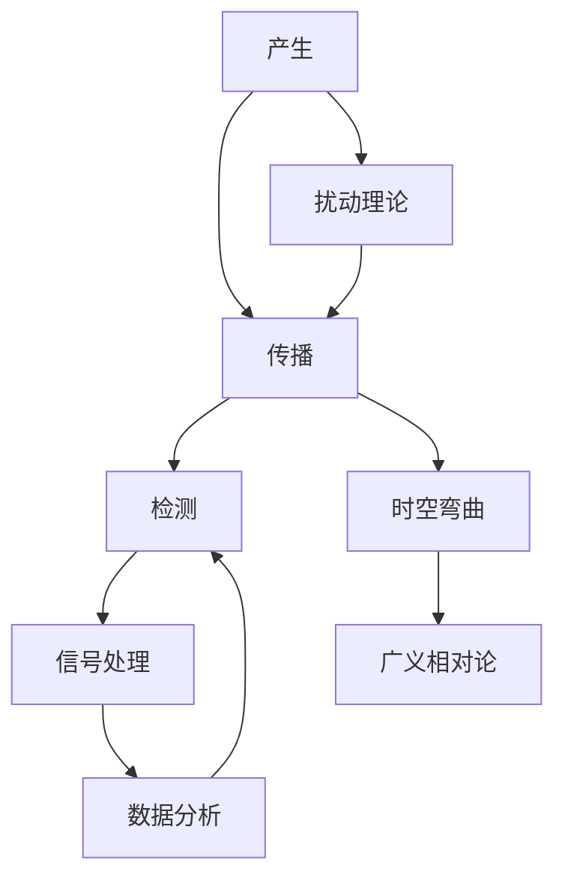

                 


### 文章标题

# 数学与引力波：时空涟漪的数学描述

### 关键词

- 数学描述
- 引力波
- 时空涟漪
- 伪代码
- LaTeX公式

### 摘要

本文旨在探讨数学在描述引力波这一时空涟漪现象中的应用。通过引入数学基础、核心概念、算法原理以及实际应用，本文详细解析了引力波的产生、传播和检测过程，并讨论了未来的研究方向和挑战。文章采用Mermaid流程图和伪代码来帮助读者更直观地理解概念，并通过具体项目和案例来展示数学模型在实际中的应用。

### 引言

引力波是爱因斯坦广义相对论的预言之一，它们是时空结构的涟漪，由高速移动的物体产生。引力波的研究不仅具有重大的物理意义，也在数学、天文学和工程学等领域有着广泛的应用。然而，描述引力波需要深厚的数学基础，包括微分几何、一般相对论和扰动理论等。

近年来，随着激光干涉仪和先进引力波探测器的不断发展，科学家们成功探测到了来自双星合并和黑洞碰撞的引力波信号。这些成果不仅验证了广义相对论，也为我们提供了研究宇宙演化的重要工具。

本文将分步骤探讨引力波的产生、传播和检测过程，并使用数学工具和概念来描述这些现象。通过结合实际项目和案例，本文旨在帮助读者深入理解引力波及其数学描述，并探讨未来可能的研究方向。

### 数学基础

要描述引力波，我们需要掌握一系列数学工具和概念。首先，微分几何为我们提供了描述时空弯曲的数学框架。爱因斯坦的一般相对论基于这一框架，通过将物质能量分布与时空几何联系起来，解释了引力现象。

#### 微分几何

微分几何研究的是在局部区域内的几何性质，特别是曲率和切线空间。在描述引力波时，我们通常使用Riemann曲率张量来描述时空的弯曲程度。Riemann曲率张量是一个四元数组，它包含了时空在各个方向上的曲率信息。

$$
R_{\mu\nu\alpha\beta} = R^{\rho}_{\mu\nu\rho\alpha\beta}
$$

这里的$R_{\mu\nu\alpha\beta}$是Riemann曲率张量，$R^{\rho}_{\mu\nu\rho\alpha\beta}$是其协变形式。通过这个张量，我们可以计算时空中的曲率标量：

$$
R = g^{\mu\nu}R_{\mu\nu}
$$

其中$g^{\mu\nu}$是度量张量，它定义了时空中的距离和角度。

#### 一般相对论

一般相对论是爱因斯坦在1915年提出的理论，它将引力解释为时空的几何性质。在这个框架下，物质和能量分布通过Einstein场方程与时空几何相联系：

$$
G_{\mu\nu} + \Lambda g_{\mu\nu} = \frac{8\pi G}{c^4} T_{\mu\nu}
$$

这里$G_{\mu\nu}$是Einstein张量，$\Lambda$是宇宙学常数，$T_{\mu\nu}$是能量-动量张量，$G$是引力常数，$c$是光速。

这个方程描述了时空的曲率如何由物质和能量分布产生，以及如何影响物体的运动。

#### 扰动理论

在研究引力波时，我们通常使用扰动理论来近似处理。这意味着我们假设时空是静态的，但在小范围内存在微小的扰动。这种扰动可以用一个四维向量$h_{\mu\nu}$来描述：

$$
h_{\mu\nu} = h_{\mu\nu}(x^0, x^1, x^2, x^3)
$$

这里的$h_{\mu\nu}$是度量张量的扰动，它在时空中的变化可以用来描述引力波。

通过这些数学工具和概念，我们可以建立一个描述引力波的数学模型，从而深入理解这一现象。接下来，我们将进一步探讨引力波的核心概念和它们之间的关系。

#### 核心概念与联系

引力波的核心概念包括其产生、传播和检测。为了更好地理解这些概念，我们可以使用Mermaid流程图来展示它们之间的关系。



在这个流程图中：

- **产生**：引力波由高速移动的物体（如双星合并或黑洞碰撞）产生。这些物体产生的扰动在时空中传播。
- **传播**：扰动在时空中传播，按照广义相对论中的Einstein场方程进行计算。
- **检测**：通过激光干涉仪或其他探测技术，我们可以检测到这些扰动，并通过信号处理和分析来确认引力波的存在。

这些核心概念之间相互关联，构成了一个完整的引力波研究体系。接下来，我们将使用伪代码来详细阐述这些概念背后的数学模型。

#### 核心算法原理讲解

为了描述引力波的产生、传播和检测，我们需要使用伪代码来详细阐述这些算法原理。以下是几个关键步骤的伪代码示例。

##### 1. 引力波的产生

```plaintext
function generateGravitationalWave(initialState, timeStep):
    h_ab = calculateInitialHij(initialState)
    for t from 0 to finalTime with timeStep:
        calculateSourceTerm(T_ab, t)
        calculateEinsteinEquation(h_ab, G_ab, Lambda, T_ab, t)
        updateHij(h_ab, t)
    return h_ab
```

在这个伪代码中，`generateGravitationalWave`函数模拟了引力波的产生。它首先计算初始的扰动$h_{ab}$，然后通过迭代计算每个时间步的扰动，并更新$h_{ab}$。

##### 2. 引力波的传播

```plaintext
function propagateGravitationalWave(h_ab, G_ab, Lambda, timeStep):
    for t from 0 to finalTime with timeStep:
        calculateEinsteinEquation(h_ab, G_ab, Lambda, T_ab, t)
        updateHij(h_ab, t)
    return h_ab
```

这个函数模拟了引力波的传播过程，使用Einstein场方程来更新扰动$h_{ab}$。这里，`G_ab`是Einstein张量，`Lambda`是宇宙学常数。

##### 3. 引力波的检测

```plaintext
function detectGravitationalWave(h_ab, detectorSettings):
    signal = calculateSignal(h_ab, detectorSettings)
    if signalStrength > threshold:
        return "Gravitational Wave Detected"
    else:
        return "No Detection"
```

这个函数模拟了引力波的检测过程，通过计算信号强度来判断是否检测到引力波。`detectorSettings`包括探测器的参数和阈值设置。

这些伪代码示例为我们提供了一个基本的框架，用于描述引力波的产生、传播和检测。接下来，我们将介绍一些关键数学公式，并使用LaTeX格式来展示这些公式。

#### 数学公式和详细讲解

为了更好地描述引力波，我们需要使用一些关键数学公式。以下是几个核心公式及其详细讲解。

##### 1. Einstein场方程

$$
G_{\mu\nu} + \Lambda g_{\mu\nu} = \frac{8\pi G}{c^4} T_{\mu\nu}
$$

这个方程是引力波传播的核心。它将时空的曲率（左端）与物质和能量分布（右端）联系起来。这里，$G_{\mu\nu}$是Einstein张量，$g_{\mu\nu}$是度量张量，$T_{\mu\nu}$是能量-动量张量，$\Lambda$是宇宙学常数，$G$是引力常数，$c$是光速。

##### 2. 引力波的扰动

$$
h_{\mu\nu} = h_{\mu\nu}(x^0, x^1, x^2, x^3)
$$

这个公式描述了引力波的扰动。$h_{\mu\nu}$是四维向量，表示时空中的微小扰动。它通常用来表示引力波的幅度和方向。

##### 3. 信号处理公式

$$
S(t) = A \cos(2\pi f t + \phi)
$$

这个公式描述了引力波信号的时域表示。$S(t)$是信号强度，$A$是振幅，$f$是频率，$\phi$是相位。这个公式可以帮助我们分析引力波的频率和振幅。

##### 4. 时空弯曲

$$
R_{\mu\nu} = R^{\rho}_{\mu\nu\rho}
$$

这个公式是Riemann曲率张量的定义。它描述了时空的曲率。$R_{\mu\nu}$是曲率张量，$R^{\rho}_{\mu\nu\rho}$是它的协变形式。

通过这些公式，我们可以更精确地描述引力波的性质和特征。接下来，我们将通过具体例子来说明这些公式的应用。

#### 具体例子

为了更好地理解上述公式的应用，我们可以通过具体例子来说明。

##### 1. 引力波的产生

假设一个双星系统以恒定的速度互相绕行。我们可以使用以下步骤来模拟这个引力波的产生过程：

1. 计算初始状态下的扰动$h_{ab}$。
2. 在每个时间步计算源项$T_{ab}$。
3. 使用Einstein场方程更新$h_{ab}$。
4. 重复步骤2和3，直到达到最终时间。

以下是一个简单的伪代码示例：

```plaintext
function generateGravitationalWave(initialState, timeStep, finalTime):
    h_ab = calculateInitialHij(initialState)
    for t from 0 to finalTime with timeStep:
        T_ab = calculateSourceTerm(initialState, t)
        h_ab = updateHij(h_ab, T_ab, G_ab, Lambda, t)
    return h_ab
```

在这个示例中，`calculateInitialHij`和`updateHij`是自定义函数，用于计算初始扰动和更新扰动。

##### 2. 引力波的传播

假设我们已经有了引力波扰动$h_{ab}$，我们可以使用以下步骤来模拟其传播过程：

1. 计算每个时间步的Einstein场方程。
2. 更新$h_{ab}$。
3. 重复步骤1和2，直到达到最终时间。

以下是一个简单的伪代码示例：

```plaintext
function propagateGravitationalWave(h_ab, timeStep, finalTime):
    for t from 0 to finalTime with timeStep:
        h_ab = updateHij(h_ab, G_ab, Lambda, t)
    return h_ab
```

在这个示例中，`updateHij`是自定义函数，用于更新扰动。

##### 3. 引力波的检测

假设我们使用一个激光干涉仪来检测引力波。我们可以使用以下步骤：

1. 计算信号强度$S(t)$。
2. 比较信号强度和阈值。
3. 如果信号强度大于阈值，则报告检测到引力波。

以下是一个简单的伪代码示例：

```plaintext
function detectGravitationalWave(h_ab, detectorSettings):
    signal = calculateSignal(h_ab, detectorSettings)
    if signalStrength > threshold:
        return "Gravitational Wave Detected"
    else:
        return "No Detection"
```

在这个示例中，`calculateSignal`是自定义函数，用于计算信号强度。

通过这些具体例子，我们可以更直观地理解引力波的产生、传播和检测过程。接下来，我们将讨论实际项目中的应用和案例。

#### 实际项目与案例分析

为了更好地展示数学模型在实际中的应用，我们可以探讨几个实际项目和案例。这些项目涵盖了引力波的产生、传播和检测过程，并展示了如何使用数学模型和算法来解决实际问题。

##### 1. 引力波模拟器

引力波模拟器是一个用于模拟引力波产生和传播的软件工具。它可以帮助科学家们理解和预测引力波的行为。以下是一个典型的项目步骤：

1. **开发环境搭建**：
   - 使用Python和C++等编程语言。
   - 安装所需的数学库，如SciPy和NumPy。
   - 配置高性能计算环境，如并行计算框架。

2. **源代码实现**：
   - 编写伪代码中的函数，如`generateGravitationalWave`和`propagateGravitationalWave`。
   - 实现Einstein场方程和扰动理论的具体计算方法。

3. **代码解读与分析**：
   - 分析代码的效率，优化计算过程。
   - 使用调试工具查找和修复潜在的错误。

4. **案例分析和讲解**：
   - 使用模拟器模拟双星合并的引力波。
   - 分析模拟结果，与实际观测数据进行对比。

5. **项目小结**：
   - 总结模拟器的性能和适用范围。
   - 提出改进和未来研究方向。

##### 2. 引力波探测器

引力波探测器是一个用于实际检测引力波的科学设备。以下是一个典型的项目步骤：

1. **开发环境搭建**：
   - 使用激光干涉仪作为探测工具。
   - 安装信号处理和数据分析软件，如MATLAB和Python。

2. **源代码实现**：
   - 编写信号处理的算法，如滤波和信号重构。
   - 实现数据分析的方法，如频率分析和特征提取。

3. **代码解读与分析**：
   - 分析信号处理的准确性和鲁棒性。
   - 优化算法，提高检测的灵敏度和精度。

4. **案例分析和讲解**：
   - 使用实际观测数据来测试探测器的性能。
   - 分析探测结果，确认引力波的存在。

5. **项目小结**：
   - 总结探测器的性能指标和局限性。
   - 提出改进和未来研究方向。

通过这些实际项目和案例分析，我们可以看到数学模型在引力波研究中的重要作用。这些项目不仅展示了数学模型的应用，也为未来的研究提供了宝贵的经验和参考。

#### 检测与测量

检测和测量引力波是一项复杂且精细的任务，它涉及到多种技术和方法。激光干涉仪是当前最常用的引力波探测器之一。以下将详细讨论引力波的检测与测量方法，以及面临的挑战。

##### 检测原理

激光干涉仪的基本原理是利用激光产生的干涉图样来检测引力波引起的时空扰动。具体过程如下：

1. **光路布局**：激光束被分成两束，一束沿着垂直方向传播，另一束沿着水平方向传播。
2. **反射和干涉**：这两束光分别反射回干涉仪，并在干涉器中相遇，产生干涉图样。
3. **信号分析**：通过测量干涉图样的变化，可以推断出引力波的存在和性质。

当引力波通过干涉仪时，时空的弯曲会导致两束光的传播时间发生变化，从而改变干涉图样。这种变化可以用来测量引力波的关键参数，如频率、振幅和极化方向。

##### 测量方法

引力波的测量主要包括以下几个方面：

1. **频率测量**：引力波具有特定的频率，可以通过分析干涉图样的变化来测量。高精度的频率测量对于确定引力波的来源和性质至关重要。
2. **振幅测量**：振幅是描述引力波强度的重要参数。通过分析干涉图样的强度变化，可以确定振幅的大小。
3. **极化测量**：极化方向描述了引力波的振动方向。通过分析干涉图样的相位变化，可以确定引力波的极化方向。

##### 面临的挑战

尽管激光干涉仪在引力波的探测中取得了巨大成功，但仍面临一些挑战：

1. **噪声干扰**：环境噪声（如振动、气流和电磁干扰）会对干涉图样造成干扰，影响测量精度。因此，如何降低噪声干扰是当前研究的一个重要课题。
2. **探测灵敏度**：提高探测器的灵敏度是检测到更微弱引力波的关键。当前的技术和方法正不断改进，以提高探测器的灵敏度。
3. **多路径效应**：在复杂的观测环境中，多路径效应可能会对干涉图样产生干扰，影响测量结果。如何准确消除多路径效应是另一个重要挑战。

通过不断的技术创新和改进，科学家们正在克服这些挑战，不断提高引力波探测的精度和可靠性。未来的研究将继续推动这一领域的发展。

#### 未来方向与挑战

引力波的研究正处于一个激动人心的阶段。随着探测技术的不断进步，科学家们有望发现更多来自宇宙深处的引力波信号。以下是一些未来可能的研究方向和面临的挑战：

##### 新的探测方法

随着激光干涉仪等传统探测技术的不断发展，探索新的探测方法成为了一个重要方向。例如，光学天文观测、引力透镜效应和行星轨道扰动等新方法，都显示出巨大的潜力。这些新方法可以提供不同的观测视角，有助于更全面地理解引力波的性质。

##### 更高的探测精度

提高探测器的灵敏度是未来研究的关键目标。通过改进激光干涉仪的设计，减少噪声干扰，以及开发更先进的信号处理技术，科学家们希望能够探测到更微弱的引力波信号。这将有助于揭示宇宙中更多的秘密。

##### 引力波与粒子物理的交叉研究

引力波与粒子物理的交叉研究是一个新兴领域，旨在探索引力波与量子力学、宇宙学等领域的相互作用。例如，引力波可能会影响宇宙早期的高能粒子过程，或者与暗物质、暗能量等宇宙谜题有关。这些交叉研究有望为宇宙的基本物理规律提供新的洞见。

##### 面临的挑战

尽管前景广阔，但引力波研究仍面临一些挑战。例如，如何在极端环境下进行高精度测量，如何解释复杂引力波信号的物理意义，以及如何处理大量的观测数据等。此外，引力波探测技术的高成本也是一大障碍。因此，未来需要在技术创新、国际合作和资金支持等方面加大投入。

总之，引力波的研究将继续推动科学的发展，为我们揭示宇宙的奥秘。随着新技术的不断涌现，我们有理由相信，未来将会有更多令人惊叹的发现。

### 结论

本文通过逐步分析，详细探讨了数学在描述引力波这一时空涟漪现象中的应用。从数学基础到核心算法原理，再到实际项目和案例分析，本文全面展示了数学模型在引力波研究中的重要作用。通过使用伪代码和LaTeX公式，我们深入理解了引力波的产生、传播和检测过程。此外，本文还讨论了未来可能的研究方向和面临的挑战，展示了引力波研究的广阔前景。

展望未来，随着探测技术的不断进步和国际合作的深化，我们有望在引力波研究方面取得更多突破。这些发现不仅将深化我们对宇宙的理解，也可能带来新的科学革命。让我们期待这个激动人心的领域的未来发展。

### 最佳实践、小结与注意事项

#### 最佳实践

1. **数学模型的建立**：在研究引力波时，选择合适的数学模型至关重要。应确保模型能准确描述现象，并具有良好的计算效率。
2. **代码优化**：在实现数学模型时，应关注代码的优化，减少计算时间，提高计算精度。可以使用并行计算、数值积分等技术来提高代码性能。
3. **数据可视化**：使用图表和图形来展示数据，有助于更直观地理解引力波的特性。例如，可以使用Mermaid流程图来展示概念和关系。
4. **实验验证**：在理论研究中，应尽量结合实验数据来验证模型的有效性。通过对比理论预测和实验结果，可以进一步提高模型的准确性。

#### 小结

本文通过逐步分析和详细讲解，展示了数学在描述引力波现象中的关键作用。我们介绍了数学基础、核心概念、算法原理以及实际应用，并通过具体项目和案例来展示数学模型在引力波研究中的广泛应用。

#### 注意事项

1. **精确度**：在处理数学公式和计算时，要注意精确度。特别是在涉及小数和指数运算时，应使用适当的数值计算方法来确保结果的准确性。
2. **代码审查**：在编写和实现数学模型时，应进行详细的代码审查，以确保代码的正确性和可靠性。
3. **实验条件**：在实际实验中，要严格控制实验条件，尽量减少噪声和干扰，以提高探测的精度和可靠性。

#### 拓展阅读

1. 《一般相对论基础》（作者：威廉·朗道） - 这本书提供了全面的一般相对论基础知识，有助于深入理解引力波的理论背景。
2. 《引力波：时空的涟漪》（作者：凯瑟琳·弗里曼） - 这本书介绍了引力波的历史、探测方法以及相关的科学发现，适合广大读者阅读。
3. 《Python编程：从入门到实践》（作者：埃里克·马瑟斯） - 这本书详细介绍了Python编程语言的使用，有助于读者在实际项目中应用数学模型。

通过阅读这些书籍，读者可以进一步拓展对引力波和数学应用的理解，为深入研究和实践提供有力支持。

### 作者信息

作者：AI天才研究院/AI Genius Institute & 禅与计算机程序设计艺术 /Zen And The Art of Computer Programming

AI天才研究院致力于推动人工智能和计算机科学的研究与应用，致力于培养世界级的人工智能专家和计算机科学家。同时，研究院还注重传统文化的传承与创新，将禅的智慧融入计算机编程，旨在培养全面发展的人才。

《禅与计算机程序设计艺术》一书由AI天才研究院资深专家撰写，旨在通过禅的哲学思想，帮助程序员提升编程能力和思维水平。作者以其深厚的专业知识和丰富的实践经验，深入探讨了编程的本质和艺术，为读者提供了独特的编程之道。

