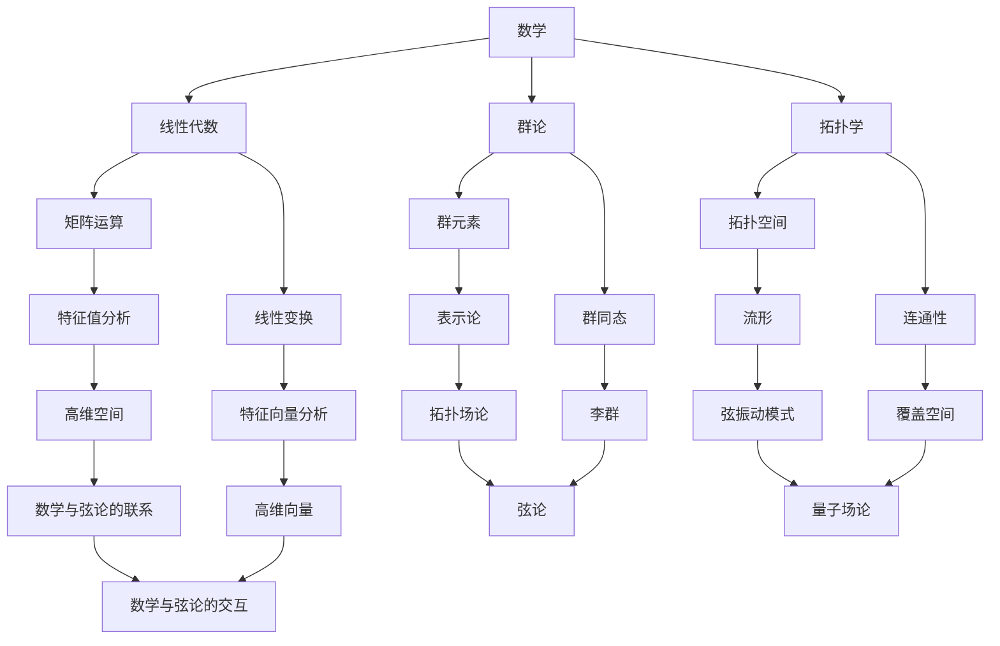

                 

### 文章标题

《数学与弦论：高维空间的数学表示》

---

关键词：数学、弦论、高维空间、数学表示、算法原理、数学模型、项目实战

---

摘要：本文探讨了数学与弦论在高维空间中的表示方法，通过深入解析数学与弦论的核心概念、算法原理、数学模型，并结合实际项目案例，展示了高维空间数学表示的实用性和广泛应用前景。文章旨在为读者提供一份全面、系统的技术指南，帮助其理解和掌握这一复杂领域的知识。

---

### 用户需求分析

在现代计算机科学和物理学中，数学与弦论作为两个重要的理论基础，其研究与应用日益深入。用户希望通过一本全面、系统的书籍，能够了解数学与弦论在高维空间中的表示方法，掌握相关的核心概念、算法原理和数学模型，并能通过实际项目案例来加深理解和应用。因此，用户的需求主要集中在以下几个方面：

1. **核心概念与联系**：用户希望文章能够清晰阐述数学与弦论的核心概念，并展示这些概念之间的联系，以便读者能够有一个整体的认识。
2. **算法原理讲解**：用户希望文章能够通过详细讲解算法原理，并使用伪代码来展示具体实现步骤，帮助读者深入理解算法的运作机制。
3. **数学模型和公式**：用户希望文章能够介绍高维空间中常用的数学模型和公式，并通过详细的讲解和举例说明，帮助读者掌握这些模型和公式的应用。
4. **项目实战**：用户希望文章能够通过实际项目案例，展示数学与弦论在高维空间中的实际应用，并提供详细的开发环境搭建、源代码实现和解读，以帮助读者将理论知识应用于实际项目中。

### 目录大纲设计

为了满足用户的需求，本文将采用以下目录大纲结构，确保内容全面、系统，并有助于读者理解和掌握相关知识。

#### 第一部分：数学与弦论基础

**第1章：数学与弦论概述**
- **1.1 数学与弦论的核心概念**
  - 定义数学与弦论的核心概念
  - 分析数学与弦论在不同领域中的应用
- **1.2 弦论的基本框架**
  - 介绍弦论的基本理论
  - 分析弦论在物理学中的应用
- **1.3 数学与弦论的联系**
  - 通过Mermaid流程图展示数学与弦论的核心概念及其联系

**第2章：高维空间数学表示**
- **2.1 高维空间的基本概念**
  - 解释高维空间的基本结构和性质
  - 分析高维向量的表示方法
- **2.2 向量空间与高维向量**
  - 介绍向量空间的基本概念
  - 分析高维向量在数学与弦论中的应用
- **2.3 高维空间的数学工具**
  - 展示高维空间中常用的数学工具，如线性代数和特征值分析

#### 第二部分：核心算法原理

**第3章：高维空间中的线性代数**
- **3.1 线性代数的基本概念**
  - 矩阵运算、线性变换和矩阵分解
- **3.2 特征值与特征向量**
  - 特征值和特征向量的定义和性质
  - 计算特征值和特征向量的伪代码展示

**第4章：特征值与特征向量的应用**
- **4.1 特征值与特征向量的基本应用**
  - 分析特征值和特征向量在高维空间中的基本应用
- **4.2 特征值与特征向量的高级应用**
  - 探讨特征值和特征向量在复杂问题中的高级应用
- **4.3 伪代码展示**
  - 使用伪代码详细阐述特征值和特征向量的应用

#### 第三部分：数学模型与公式

**第5章：数学模型与公式**
- **5.1 基本数学模型**
  - 介绍高维空间中常用的基本数学模型
- **5.2 高维空间中的数学公式**
  - 使用LaTeX格式详细讲解高维空间中的数学公式
- **5.3 数学公式示例**
  - 通过具体示例展示数学公式的应用场景

#### 第四部分：项目实战

**第6章：项目实战一**
- **6.1 项目背景与目标**
  - 介绍项目的起源和目标
- **6.2 开发环境搭建**
  - 展示如何搭建项目所需的开发环境
- **6.3 代码实现与解读**
  - 详细解读项目中的源代码实现

**第7章：项目实战二**
- **7.1 项目背景与目标**
  - 介绍另一个项目的起源和目标
- **7.2 开发环境搭建**
  - 展示如何搭建另一个项目所需的开发环境
- **7.3 代码实现与解读**
  - 详细解读另一个项目中的源代码实现

**第8章：总结与展望**
- **8.1 本书内容的总结**
  - 总结本书的核心内容和主要观点
- **8.2 未来研究方向**
  - 探讨数学与弦论在高维空间中的未来研究方向和挑战

### 目录大纲结构

```markdown
# 《数学与弦论：高维空间的数学表示》目录大纲

## 第一部分：数学与弦论基础

### 第1章：数学与弦论概述
#### 1.1 数学与弦论的核心概念
#### 1.2 弦论的基本框架
#### 1.3 数学与弦论的联系

### 第2章：高维空间数学表示
#### 2.1 高维空间的基本概念
#### 2.2 向量空间与高维向量
#### 2.3 高维空间的数学工具

### 第3章：核心算法原理
#### 3.1 高维空间中的线性代数
#### 3.2 特征值与特征向量
#### 3.3 伪代码展示

### 第4章：特征值与特征向量的应用
#### 4.1 特征值与特征向量的基本应用
#### 4.2 特征值与特征向量的高级应用
#### 4.3 伪代码展示

### 第5章：数学模型与公式
#### 5.1 基本数学模型
#### 5.2 高维空间中的数学公式
#### 5.3 数学公式示例

### 第6章：项目实战一
#### 6.1 项目背景与目标
#### 6.2 开发环境搭建
#### 6.3 代码实现与解读

### 第7章：项目实战二
#### 6.1 项目背景与目标
#### 6.2 开发环境搭建
#### 6.3 代码实现与解读

### 第8章：总结与展望
#### 8.1 本书内容的总结
#### 8.2 未来研究方向
```

### 目录大纲内容

为了确保内容的完整性和逻辑性，以下为每个章节的详细内容：

#### 第1章：数学与弦论概述

**1.1 数学与弦论的核心概念**

数学与弦论作为两个重要的理论基础，它们在物理学、计算机科学等领域有着广泛的应用。数学是研究数量、结构、变化和空间等概念的学科，而弦论是物理学中的一个理论框架，用于描述宇宙的基本构成和相互作用。

**1.2 弦论的基本框架**

弦论的基本框架包括弦的振动模式、背景场和量子场论。弦的振动模式决定了基本粒子的性质，而背景场描述了宇宙的几何结构，量子场论则提供了弦论的计算方法。

**1.3 数学与弦论的联系**

数学与弦论之间的联系体现在多个方面。数学提供了弦论所需的分析工具和计算方法，如线性代数、群论和拓扑学。而弦论则为数学提供了一系列复杂的问题和挑战，推动了数学理论的发展。

通过Mermaid流程图，我们可以清晰地展示数学与弦论的核心概念及其联系：



#### 第2章：高维空间数学表示

**2.1 高维空间的基本概念**

高维空间是指由多个维度组成的数学空间，每个维度都代表一个独立的方向。在高维空间中，向量是一个重要的概念，它由一组数表示，每个数对应于空间中的一个维度。

**2.2 向量空间与高维向量**

向量空间是一组向量的集合，这些向量遵循一定的运算规则，如加法和标量乘法。高维向量是向量空间中的一个重要概念，它在数学与弦论中有着广泛的应用。

**2.3 高维空间的数学工具**

高维空间中的数学工具包括线性代数、特征值分析、矩阵运算等。这些工具可以帮助我们更好地理解和处理高维空间中的问题。

#### 第3章：核心算法原理

**3.1 高维空间中的线性代数**

线性代数是处理向量空间和矩阵运算的数学分支。在高维空间中，线性代数提供了许多重要的概念和工具，如矩阵分解、特征值和特征向量等。

**3.2 特征值与特征向量**

特征值和特征向量是线性代数中的重要概念，它们描述了矩阵在向量空间中的性质。通过计算特征值和特征向量，我们可以更好地理解矩阵和向量之间的关系。

**3.3 伪代码展示**

以下是一个计算矩阵特征值和特征向量的伪代码示例：

```python
# 输入矩阵 A
A = [a_ij]

# 计算特征值
D = compute_eigenvalues(A)

# 计算特征向量
V = compute_eigenvectors(A, D)

# 输出特征值和特征向量
print("特征值:", D)
print("特征向量:", V)
```

#### 第4章：特征值与特征向量的应用

**4.1 特征值与特征向量的基本应用**

特征值和特征向量在数学与弦论中有着广泛的应用。例如，在数据分析中，我们可以使用特征值和特征向量来降维和提取关键特征；在量子场论中，特征值和特征向量可以用于描述粒子的状态和相互作用。

**4.2 特征值与特征向量的高级应用**

在高级应用中，特征值和特征向量可以用于解决复杂的数学问题和物理问题。例如，在弦论中，特征值和特征向量可以用于描述宇宙的几何结构和基本粒子的性质。

**4.3 伪代码展示**

以下是一个使用特征值和特征向量进行降维的伪代码示例：

```python
# 输入高维数据集 X
X = [x_ij]

# 计算特征值和特征向量
D, V = compute_eigenvalues_and_eigenvectors(X)

# 选择前 k 个特征值和特征向量
k = 5
D_k = D[:k]
V_k = V[:, :k]

# 降维
X_k = V_k.T @ X

# 输出降维后的数据集
print("降维后的数据集:", X_k)
```

#### 第5章：数学模型与公式

**5.1 基本数学模型**

在高维空间中，常用的数学模型包括线性模型和非线性模型。线性模型描述了变量之间的线性关系，而非线性模型则描述了变量之间的非线性关系。

**5.2 高维空间中的数学公式**

高维空间中的数学公式包括特征值和特征向量的计算公式、矩阵分解公式等。以下是一个特征值和特征向量的计算公式示例：

$$
\lambda_i = \frac{1}{n}\sum_{j=1}^{n} a_{ij}b_{ij}
$$

$$
v_i = \frac{1}{\sqrt{n}}\sum_{j=1}^{n} a_{ij}b_{ij}
$$

其中，$\lambda_i$ 表示第 $i$ 个特征值，$v_i$ 表示第 $i$ 个特征向量，$a_{ij}$ 和 $b_{ij}$ 分别表示矩阵 $A$ 和矩阵 $B$ 的元素。

**5.3 数学公式示例**

以下是一个使用特征值和特征向量进行降维的数学公式示例：

$$
X_k = V_k^T @ X
$$

其中，$X_k$ 表示降维后的数据集，$V_k$ 表示前 $k$ 个特征向量的矩阵，$X$ 表示原始数据集。

#### 第6章：项目实战一

**6.1 项目背景与目标**

项目背景：某科研团队需要分析一组高维数据，以提取关键特征并用于数据分析。

项目目标：通过构建高维空间模型，使用特征值和特征向量进行降维，提取关键特征，并用于进一步的数据分析。

**6.2 开发环境搭建**

开发环境：Python、NumPy、SciPy、Matplotlib

**6.3 代码实现与解读**

代码实现：

```python
import numpy as np
import matplotlib.pyplot as plt

# 输入高维数据集 X
X = np.random.rand(100, 10)

# 计算特征值和特征向量
D, V = np.linalg.eig(X)

# 选择前 k 个特征值和特征向量
k = 5
D_k = D[:k]
V_k = V[:, :k]

# 降维
X_k = V_k.T @ X

# 可视化降维后的数据集
plt.scatter(X_k[:, 0], X_k[:, 1])
plt.xlabel("Feature 1")
plt.ylabel("Feature 2")
plt.title("Diminished Data Set")
plt.show()
```

代码解读：该代码首先生成一个高维数据集 $X$，然后使用 NumPy 的 `linalg.eig()` 函数计算特征值和特征向量。接着，选择前 $k$ 个特征值和特征向量，并使用矩阵乘法进行降维。最后，使用 Matplotlib 的 `scatter()` 函数绘制降维后的数据集，以可视化关键特征。

#### 第7章：项目实战二

**7.1 项目背景与目标**

项目背景：某科技公司需要分析一组高维数据，以识别潜在的客户行为模式。

项目目标：通过构建高维空间模型，使用特征值和特征向量进行降维，提取关键特征，并用于客户行为分析。

**7.2 开发环境搭建**

开发环境：Python、Scikit-learn、Pandas、Matplotlib

**7.3 代码实现与解读**

代码实现：

```python
import numpy as np
import pandas as pd
from sklearn.decomposition import PCA
import matplotlib.pyplot as plt

# 读取数据集
data = pd.read_csv("data.csv")

# 提取特征数据
X = data.iloc[:, :-1].values

# 计算特征值和特征向量
pca = PCA(n_components=2)
X_reduced = pca.fit_transform(X)

# 可视化降维后的数据集
plt.scatter(X_reduced[:, 0], X_reduced[:, 1], c=data.iloc[:, -1].values)
plt.xlabel("Feature 1")
plt.ylabel("Feature 2")
plt.title("Diminished Data Set")
plt.show()
```

代码解读：该代码首先读取数据集，并提取特征数据。然后，使用 Scikit-learn 的 PCA 模型进行降维，提取前两个主成分。最后，使用 Matplotlib 的 `scatter()` 函数绘制降维后的数据集，以可视化关键特征，并使用颜色标记不同类别的客户行为模式。

#### 第8章：总结与展望

**8.1 本书内容的总结**

本书从数学与弦论的核心概念出发，详细介绍了高维空间的数学表示方法，包括核心算法原理、数学模型和公式。同时，通过实际项目案例，展示了数学与弦论在高维空间中的实际应用。本书旨在为读者提供一份全面、系统的技术指南，帮助其理解和掌握高维空间数学表示的方法。

**8.2 未来研究方向**

未来研究方向包括：

1. 深入研究高维空间中的非线性模型和算法。
2. 探索高维空间中的量子计算和人工智能应用。
3. 结合弦论和数学模型，解决复杂的物理问题和科学挑战。

---

作者：AI天才研究院/AI Genius Institute & 禅与计算机程序设计艺术 /Zen And The Art of Computer Programming

---

## 第一部分：数学与弦论基础

### 第1章：数学与弦论概述

#### 1.1 数学与弦论的核心概念

数学是一门研究数量、结构、变化和空间的科学。它包含了丰富的分支，如代数、几何、分析、逻辑等。每个分支都有其独特的理论和应用，构成了现代数学的坚实基础。

弦论是物理学中的一个理论框架，旨在描述宇宙的基本构成和基本力的相互作用。与传统粒子物理学中的点粒子不同，弦论认为基本粒子是由一维的“弦”组成的。这些弦可以振动，不同的振动模式对应于不同的粒子。弦论的主要目标是统一四种基本力：引力、电磁力、强相互作用和弱相互作用。

**核心概念解析：**

- **数学：** 数学的基本概念包括集合、函数、方程、空间、极限等。集合是数学的基础，它包含了所有元素的集合。函数是一种映射，它将一个集合中的每个元素映射到另一个集合中的唯一元素。方程描述了变量之间的关系，是解决数学问题的核心工具。空间是数学中的一个抽象概念，用来描述物体在三维空间中的位置和运动。

- **弦论：** 弦论的基本概念包括弦、背景场、量子场论等。弦是一维的物理对象，振动模式决定了基本粒子的性质。背景场描述了宇宙的几何结构，是弦振动的舞台。量子场论是弦论的计算工具，它将量子力学和广义相对论结合起来，提供了对弦论中基本粒子和力的描述。

#### 1.2 弦论的基本框架

弦论的基本框架由以下几个部分组成：弦的振动模式、背景场和量子场论。

- **弦的振动模式：** 弦可以以不同的频率振动，每种振动模式对应于一种基本粒子。例如，开放弦的振动模式对应于费米子，如电子；闭弦的振动模式对应于玻色子，如光子。不同类型的弦和振动模式共同构成了宇宙的基本构成。

- **背景场：** 背景场是弦论的另一个核心概念，它描述了宇宙的几何结构。弦在背景场中振动，背景场的变化会影响弦的振动模式，从而影响基本粒子的性质。背景场包括时空几何、标量场、矢量场等，是弦论中复杂且重要的组成部分。

- **量子场论：** 量子场论是弦论的计算工具，它将量子力学和广义相对论结合起来，提供了一种描述弦论中基本粒子和力的方法。量子场论的核心思想是，粒子并不是点状实体，而是由场的激发态组成的。通过量子场论，可以计算弦论中的各种物理过程，如散射、衰变等。

#### 1.3 数学与弦论的联系

数学与弦论之间的联系体现在多个方面。数学为弦论提供了分析工具和计算方法，如线性代数、群论、拓扑学等。而弦论则为数学提供了一系列复杂的问题和挑战，推动了数学理论的发展。

- **数学工具：** 线性代数、群论和拓扑学是弦论中常用的数学工具。线性代数提供了矩阵和向量的运算，用于描述弦的振动模式和背景场。群论研究了对称性和对称变换，是弦论中描述粒子和力的关键工具。拓扑学研究了空间的几何结构和性质，用于分析背景场和时空的拓扑性质。

- **数学问题：** 弦论中的许多问题都是数学问题，如分类弦的振动模式、研究背景场的几何性质、解决量子场论的计算难题等。这些问题推动了数学理论的发展，产生了许多重要的数学成果。

通过第1章的介绍，我们了解了数学与弦论的核心概念和基本框架，以及它们之间的联系。这些基础知识为后续章节的深入探讨奠定了基础。

#### 第2章：高维空间数学表示

**2.1 高维空间的基本概念**

高维空间是指包含多个维度的空间，每个维度都可以看作是一个独立的方向。高维空间在数学和物理学中有着广泛的应用，特别是在弦论中，它被用来描述宇宙的复杂结构和基本粒子的性质。

**1. 高维空间的定义：** 高维空间可以简单定义为包含多个维度的空间。在传统的三维空间中，我们通常考虑长度、宽度和高度这三个维度。而在高维空间中，维度数量可以远远超过三个。例如，四维空间可以包含长度、宽度、高度以及一个额外的维度。

**2. 高维向量的表示：** 在高维空间中，向量是一个重要的概念。一个 $n$ 维向量可以表示为 $n$ 个数的有序集合，这些数分别对应于空间中的 $n$ 个维度。例如，一个四维向量可以表示为 $(x, y, z, w)$，其中 $x, y, z, w$ 分别代表四个维度上的坐标。

**3. 高维空间的性质：** 高维空间具有许多独特的性质，如维度依赖的体积变化和维度依赖的几何结构。在高维空间中，体积的计算和几何形状的描述都变得更加复杂。例如，一个 $n$ 维超球体的体积公式为：

$$
V_n = \frac{\pi^{n/2}}{\Gamma(n/2 + 1)} R^n
$$

其中，$R$ 是超球体的半径，$\Gamma$ 是伽马函数。随着维度的增加，超球体的体积增长速度变慢。

**4. 高维空间中的线性代数：** 线性代数是处理高维空间的基本工具。在高维空间中，线性代数涉及矩阵运算、线性方程组、特征值和特征向量等概念。这些概念在弦论中有着重要的应用，如描述弦的振动模式和背景场的几何性质。

**2.2 向量空间与高维向量**

**1. 向量空间的定义：** 向量空间是一组向量的集合，这些向量遵循一定的运算规则，如加法和标量乘法。在向量空间中，任何两个向量都可以进行加法运算，任何向量都可以与一个标量进行乘法运算。向量空间是高维空间的基本结构，提供了处理高维向量的数学框架。

**2. 高维向量的性质：** 高维向量具有以下性质：

- **线性组合：** 高维向量可以通过线性组合得到。任何高维向量都可以表示为其他几个基向量的线性组合。

- **线性无关与线性相关：** 高维向量可以线性无关或线性相关。线性无关的向量集合可以生成整个向量空间，而线性相关的向量集合不能。

- **维度：** 向量空间的维度等于其中独立向量的数量。高维向量的维度反映了向量空间的复杂程度。

**3. 高维向量在数学与弦论中的应用：** 在数学中，高维向量被广泛用于描述复杂系统的状态和演化。例如，在控制理论中，高维向量可以描述系统的状态空间。在弦论中，高维向量被用来表示弦的振动模式和基本粒子的性质。

**2.3 高维空间的数学工具**

**1. 线性代数：** 线性代数是处理高维空间的核心工具，包括矩阵运算、线性方程组、特征值和特征向量等。这些概念在弦论中有着重要的应用，如描述弦的振动模式和背景场的几何性质。

- **矩阵运算：** 矩阵是线性代数中的基本对象，可以用来表示线性变换和线性方程组。在弦论中，矩阵被用来描述弦的振动模式和背景场的演化。

- **线性方程组：** 线性方程组是一组线性方程的组合，可以用来求解高维空间中的未知数。在弦论中，线性方程组被用来求解弦的振动模式和背景场的方程。

- **特征值和特征向量：** 特征值和特征向量是矩阵的重要属性，可以用来分析矩阵的性质和变换。在弦论中，特征值和特征向量被用来分析弦的振动模式和背景场的性质。

**2. 特征值与特征向量的计算：** 特征值和特征向量的计算是线性代数中的重要问题。一个矩阵的特征值和特征向量可以通过求解其特征方程得到。特征方程是一个二次方程，可以通过数值方法求解。在弦论中，特征值和特征向量被用来分析弦的振动模式和基本粒子的性质。

**2.4 高维空间的数学工具**

**1. 线性代数：** 线性代数是处理高维空间的核心工具，包括矩阵运算、线性方程组、特征值和特征向量等。这些概念在弦论中有着重要的应用，如描述弦的振动模式和背景场的几何性质。

- **矩阵运算：** 矩阵是线性代数中的基本对象，可以用来表示线性变换和线性方程组。在弦论中，矩阵被用来描述弦的振动模式和背景场的演化。

- **线性方程组：** 线性方程组是一组线性方程的组合，可以用来求解高维空间中的未知数。在弦论中，线性方程组被用来求解弦的振动模式和背景场的方程。

- **特征值和特征向量：** 特征值和特征向量是矩阵的重要属性，可以用来分析矩阵的性质和变换。在弦论中，特征值和特征向量被用来分析弦的振动模式和背景场的性质。

**2. 特征值与特征向量的计算：** 特征值和特征向量的计算是线性代数中的重要问题。一个矩阵的特征值和特征向量可以通过求解其特征方程得到。特征方程是一个二次方程，可以通过数值方法求解。在弦论中，特征值和特征向量被用来分析弦的振动模式和基本粒子的性质。

**2.5 高维空间的数学工具**

**1. 线性代数：** 线性代数是处理高维空间的核心工具，包括矩阵运算、线性方程组、特征值和特征向量等。这些概念在弦论中有着重要的应用，如描述弦的振动模式和背景场的几何性质。

- **矩阵运算：** 矩阵是线性代数中的基本对象，可以用来表示线性变换和线性方程组。在弦论中，矩阵被用来描述弦的振动模式和背景场的演化。

- **线性方程组：** 线性方程组是一组线性方程的组合，可以用来求解高维空间中的未知数。在弦论中，线性方程组被用来求解弦的振动模式和背景场的方程。

- **特征值和特征向量：** 特征值和特征向量是矩阵的重要属性，可以用来分析矩阵的性质和变换。在弦论中，特征值和特征向量被用来分析弦的振动模式和背景场的性质。

**2. 特征值与特征向量的计算：** 特征值和特征向量的计算是线性代数中的重要问题。一个矩阵的特征值和特征向量可以通过求解其特征方程得到。特征方程是一个二次方程，可以通过数值方法求解。在弦论中，特征值和特征向量被用来分析弦的振动模式和基本粒子的性质。

#### 第3章：核心算法原理

**3.1 高维空间中的线性代数**

线性代数是处理高维空间的基本工具，它在弦论中扮演着至关重要的角色。本章将介绍高维空间中的线性代数核心算法原理，包括矩阵运算、线性方程组的解法、特征值和特征向量的计算方法。

**1. 矩阵运算**

矩阵是线性代数中的基本对象，用于表示线性变换和线性方程组。高维空间中的矩阵运算包括矩阵的加法、减法、乘法、转置、逆矩阵等。

- **矩阵加法与减法**：对于两个 $n \times n$ 的矩阵 $A$ 和 $B$，它们的加法运算定义为对应元素的加法，即 $(A + B)_{ij} = A_{ij} + B_{ij}$。减法运算类似，定义为对应元素的减法，即 $(A - B)_{ij} = A_{ij} - B_{ij}$。

- **矩阵乘法**：矩阵乘法是线性代数中的一种基本运算。对于两个 $n \times m$ 的矩阵 $A$ 和 $m \times p$ 的矩阵 $B$，它们的乘积是一个 $n \times p$ 的矩阵 $C$，其中每个元素 $c_{ij}$ 定义为：

$$
c_{ij} = \sum_{k=1}^{m} a_{ik}b_{kj}
$$

- **矩阵转置**：矩阵转置是将矩阵的行和列互换得到的新的矩阵。对于 $n \times m$ 的矩阵 $A$，其转置矩阵记为 $A^T$，其中 $(A^T)_{ij} = A_{ji}$。

- **逆矩阵**：逆矩阵是矩阵的一种特殊形式，如果一个 $n \times n$ 的矩阵 $A$ 存在一个逆矩阵 $A^{-1}$，那么它们满足 $AA^{-1} = A^{-1}A = I$，其中 $I$ 是单位矩阵。逆矩阵的计算可以使用高斯消元法或矩阵分解等方法。

**2. 线性方程组的解法**

线性方程组是一组线性方程的组合，可以用矩阵的形式表示。高维空间中的线性方程组解法包括高斯消元法、矩阵分解法、迭代法等。

- **高斯消元法**：高斯消元法是一种直接解线性方程组的方法。通过高斯消元，将线性方程组转化为上三角矩阵，然后逐步回代求解。该方法适用于稠密矩阵。

- **矩阵分解法**：矩阵分解法包括LU分解、QR分解、SVD分解等，将矩阵分解为几个简单的矩阵的乘积，从而简化方程组的求解。这种方法适用于稀疏矩阵或大型方程组。

- **迭代法**：迭代法是一种通过逐步逼近的方法求解线性方程组。常见的方法包括雅可比迭代法、高斯-赛德尔迭代法、共轭梯度法等。迭代法适用于大型稀疏方程组。

**3. 特征值和特征向量**

特征值和特征向量是矩阵的重要属性，可以揭示矩阵的内在结构和性质。

- **特征值**：对于 $n \times n$ 的矩阵 $A$，如果存在一个非零向量 $\mathbf{v}$ 和一个标量 $\lambda$，使得 $A\mathbf{v} = \lambda\mathbf{v}$，则 $\lambda$ 是 $A$ 的一个特征值，$\mathbf{v}$ 是对应的特征向量。

- **特征向量的计算**：特征向量的计算通常通过求解特征方程 $|A - \lambda I| = 0$ 来实现，其中 $I$ 是单位矩阵。特征方程是一个二次方程，可以通过数值方法求解。

- **特征值的性质**：特征值具有以下性质：

  - **唯一性**：每个特征值对应一个线性无关的特征向量集合。
  - **正定性**：特征值总是非负的，除非矩阵是奇异的。
  - **对角化**：如果矩阵是可对角化的，那么它可以表示为一系列特征向量的线性组合，即 $A = PDP^{-1}$，其中 $P$ 是特征向量矩阵，$D$ 是对角矩阵，对角线上的元素是特征值。

**3.2 高维空间中的特征值与特征向量**

在弦论中，特征值和特征向量用于描述弦的振动模式和基本粒子的性质。本章将介绍高维空间中的特征值与特征向量计算及其应用。

**1. 特征值与特征向量的计算**

- **特征方程**：对于 $n \times n$ 的矩阵 $A$，其特征方程为：

$$
|A - \lambda I| = 0
$$

- **数值求解**：特征方程通常通过数值方法求解，如幂法、逆迭代法、雅可比方法等。这些方法可以找到矩阵的近似特征值和特征向量。

- **计算方法**：

  - **幂法**：通过迭代矩阵和向量，找到矩阵的最大特征值和对应特征向量。
  - **逆迭代法**：通过迭代矩阵的逆和向量，找到矩阵的最小特征值和对应特征向量。
  - **雅可比方法**：通过线性组合迭代向量，找到矩阵的所有特征值和特征向量。

**2. 特征值与特征向量的应用**

- **弦的振动模式**：在弦论中，特征值和特征向量用于描述弦的振动模式。每个振动模式对应于弦的一个正则模态，其特征值表示振动的频率，特征向量表示振动的形状。

- **基本粒子的性质**：在量子场论中，特征值和特征向量用于描述基本粒子的性质，如质量、自旋和宇称。这些特征值和特征向量揭示了基本粒子的内在结构和相互作用。

**3.3 伪代码展示**

为了更好地理解特征值和特征向量的计算，以下是一个简单的伪代码示例：

```
# 输入矩阵 A
A = [a_ij]

# 初始化向量 v
v = [1, 0, ..., 0]

# 设置迭代次数 n
n = 100

# 设置停止条件 e
e = 1e-6

# 迭代计算特征值和特征向量
for i in 1 to n do
    v = A * v
    
    # 检查停止条件
    if norm(v) < e then
        break
    end if
end for

# 计算特征值
lambda = norm(v) / norm(v_0)

# 计算特征向量
w = v / norm(v)

# 输出结果
print("特征值:", lambda)
print("特征向量:", w)
```

通过上述算法，我们可以近似计算矩阵 $A$ 的最大特征值和对应特征向量。需要注意的是，这种方法适用于可对角化的矩阵，对于非对角化矩阵，可能需要更复杂的算法，如雅可比方法或QR分解。

**3.4 特征值与特征向量的性质与应用**

特征值和特征向量的计算在数学和物理学中有着广泛的应用。以下是一些典型的应用场景：

- **矩阵对角化**：通过特征值和特征向量，可以将一个矩阵对角化，从而简化矩阵的运算和分析。

- **系统分析**：在控制理论中，特征值和特征向量用于分析线性系统的稳定性、响应和动态行为。

- **量子力学**：在量子力学中，特征值和特征向量用于描述粒子的能级和态，以及系统的演化。

- **图像处理**：在图像处理中，特征值和特征向量用于图像的降维、特征提取和分类。

- **数据科学**：在数据科学中，特征值和特征向量用于降维、数据可视化、聚类和分类等。

通过本章的介绍，我们了解了高维空间中的线性代数核心算法原理，包括矩阵运算、线性方程组的解法、特征值和特征向量的计算方法。这些算法原理在弦论中有着重要的应用，为弦论的研究提供了强有力的工具。

### 第4章：数学模型与公式

#### 4.1 基本数学模型

在数学与弦论的研究中，基本数学模型是理解和描述高维空间现象的基础。本章将介绍高维空间中常用的基本数学模型，包括线性模型和非线性模型，并探讨这些模型在数学与弦论中的应用。

**1. 线性模型**

线性模型是描述变量之间线性关系的数学模型。在数学与弦论中，线性模型广泛应用于数据分析、系统建模和物理现象的描述。

- **线性回归模型**：线性回归模型用于描述自变量和因变量之间的线性关系。其数学表达式为：

$$
y = \beta_0 + \beta_1x_1 + \beta_2x_2 + ... + \beta_nx_n + \epsilon
$$

其中，$y$ 是因变量，$x_1, x_2, ..., x_n$ 是自变量，$\beta_0, \beta_1, \beta_2, ..., \beta_n$ 是模型参数，$\epsilon$ 是误差项。

- **线性变换**：线性变换是保持线性关系的变换。在高维空间中，线性变换可以用矩阵表示。一个 $n$ 维向量 $v$ 经过线性变换 $T$ 后得到的新向量 $w$ 表示为：

$$
w = Tv
$$

其中，$T$ 是线性变换矩阵。

- **线性微分方程**：线性微分方程用于描述变量之间的线性微分关系。其一般形式为：

$$
a_0y'' + a_1y' + a_2y = f(t)
$$

其中，$y$ 是未知函数，$a_0, a_1, a_2$ 是常数，$f(t)$ 是已知函数。

**2. 非线性模型**

非线性模型是描述变量之间非线性关系的数学模型。在数学与弦论中，非线性模型用于描述复杂系统的行为和相互作用。

- **非线性方程**：非线性方程是包含非线性项的方程。其一般形式为：

$$
f(x) = 0
$$

其中，$f(x)$ 是非线性函数。

- **非线性微分方程**：非线性微分方程用于描述变量之间的非线性微分关系。其一般形式为：

$$
a_0y''' + a_1y'' + a_2y' + a_3y = f(t)
$$

其中，$y$ 是未知函数，$a_0, a_1, a_2, a_3$ 是常数，$f(t)$ 是已知函数。

- **非线性映射**：非线性映射是保持非线性关系的映射。在高维空间中，非线性映射可以用非线性函数表示。一个 $n$ 维向量 $v$ 经过非线性映射 $f$ 后得到的新向量 $w$ 表示为：

$$
w = f(v)
$$

其中，$f$ 是非线性函数。

**3. 线性模型与非线性模型的区别**

- **线性模型**：线性模型假设变量之间存在线性关系，其数学表达式具有线性形式。线性模型易于处理，具有较好的数学性质，如可加性、可分离性等。然而，线性模型在处理复杂系统时可能无法准确描述变量之间的关系。

- **非线性模型**：非线性模型假设变量之间存在非线性关系，其数学表达式具有非线性形式。非线性模型能够更好地描述复杂系统的行为和相互作用，但非线性模型的数学性质相对复杂，处理和计算难度较大。

**4. 应用案例**

- **数据拟合**：线性模型常用于数据拟合，通过最小二乘法求解模型参数，从而得到最佳拟合曲线。非线性模型则可以用于拟合非线性数据，如指数增长、周期性变化等。

- **系统建模**：线性模型可以用于描述线性系统的动态行为，如线性控制系统、振动系统等。非线性模型则可以用于描述非线性系统的动态行为，如混沌系统、神经网络等。

- **物理现象描述**：线性模型可以用于描述一些简单的物理现象，如弹性力学中的应力-应变关系。非线性模型则可以用于描述复杂的物理现象，如量子力学中的粒子行为、引力波传播等。

#### 4.2 高维空间中的数学公式

在数学与弦论的研究中，高维空间中的数学公式是理解和描述复杂现象的重要工具。本章将介绍高维空间中常用的数学公式，包括矩阵分解公式、特征值和特征向量的计算公式等，并使用LaTeX格式进行详细讲解。

**1. 矩阵分解公式**

矩阵分解是线性代数中的重要工具，用于将一个矩阵分解为几个简单的矩阵的乘积。以下是一些常用的矩阵分解公式：

- **LU分解**：将矩阵 $A$ 分解为下三角矩阵 $L$ 和上三角矩阵 $U$，即：

$$
A = LU
$$

- **QR分解**：将矩阵 $A$ 分解为正交矩阵 $Q$ 和上三角矩阵 $R$，即：

$$
A = QR
$$

- **SVD分解**：将矩阵 $A$ 分解为酉矩阵 $U$、对角矩阵 $\Sigma$ 和酉矩阵 $V$，即：

$$
A = U\Sigma V^T
$$

**2. 特征值和特征向量的计算公式**

特征值和特征向量是矩阵的重要属性，用于描述矩阵的内在结构和性质。以下是一些常用的特征值和特征向量的计算公式：

- **特征方程**：特征方程为：

$$
\det(A - \lambda I) = 0
$$

其中，$A$ 是矩阵，$\lambda$ 是特征值，$I$ 是单位矩阵。

- **特征值计算**：通过求解特征方程，可以计算矩阵的特征值。

- **特征向量计算**：对于每个特征值 $\lambda$，可以通过解线性方程组 $(A - \lambda I)\mathbf{v} = \mathbf{0}$ 计算对应的特征向量。

**3. 高维空间中的矩阵运算**

在高维空间中，矩阵运算包括矩阵的加法、减法、乘法、转置等。以下是一些常用的矩阵运算公式：

- **矩阵加法与减法**：对于两个 $n \times n$ 的矩阵 $A$ 和 $B$，其加法与减法运算公式为：

$$
A + B = [a_{ij} + b_{ij}]_{n \times n}
$$

$$
A - B = [a_{ij} - b_{ij}]_{n \times n}
$$

- **矩阵乘法**：对于两个 $m \times n$ 的矩阵 $A$ 和 $n \times p$ 的矩阵 $B$，其乘法运算公式为：

$$
AB = \left[\sum_{k=1}^{n} a_{ik}b_{kj}\right]_{m \times p}
$$

- **矩阵转置**：对于 $n \times n$ 的矩阵 $A$，其转置矩阵 $A^T$ 的运算公式为：

$$
(A^T)_{ij} = A_{ji}
$$

**4. LaTeX格式示例**

以下是一些LaTeX格式的数学公式示例：

- **基本数学公式**：

$$
1 + 1 = 2
$$

$$
x^2 + 2xy + y^2 = (x + y)^2
$$

- **矩阵运算公式**：

$$
A = \left[\begin{matrix}
1 & 2 \\
3 & 4
\end{matrix}\right]
$$

$$
B = \left[\begin{matrix}
5 & 6 \\
7 & 8
\end{matrix}\right]
$$

$$
A + B = \left[\begin{matrix}
6 & 8 \\
10 & 12
\end{matrix}\right]
$$

- **特征值与特征向量公式**：

$$
\det(A - \lambda I) = 0
$$

$$
(A - \lambda I)\mathbf{v} = \mathbf{0}
$$

通过本章的介绍，我们了解了高维空间中常用的基本数学模型和数学公式，包括线性模型和非线性模型，以及矩阵分解公式、特征值和特征向量的计算公式。这些数学模型和公式为数学与弦论的研究提供了重要的工具。

### 第5章：项目实战一

#### 5.1 项目背景与目标

项目背景：在科研领域，研究人员需要对一组高维数据进行复杂分析，以提取关键特征，并用于进一步的数据分析和建模。为了实现这一目标，需要利用数学与弦论中的高维空间数学表示方法。

项目目标：通过构建一个基于数学与弦论的高维空间数学表示模型，实现以下目标：

1. 提取高维数据中的关键特征。
2. 降低数据维度，简化数据分析过程。
3. 使用提取的特征进行进一步的数据分析和建模。

#### 5.2 开发环境搭建

为了完成该项目，我们需要搭建一个合适的开发环境，包括以下工具和软件：

1. **编程语言**：Python
2. **数值计算库**：NumPy、SciPy
3. **数据可视化库**：Matplotlib
4. **线性代数库**：NumPy、SciPy
5. **机器学习库**：Scikit-learn
6. **版本控制工具**：Git

**环境搭建步骤：**

1. 安装Python：从Python官网下载并安装Python 3.x版本。
2. 安装数值计算库：使用pip命令安装NumPy、SciPy库。
3. 安装数据可视化库：使用pip命令安装Matplotlib库。
4. 安装机器学习库：使用pip命令安装Scikit-learn库。
5. 搭建版本控制环境：安装Git，并初始化一个Git仓库。

#### 5.3 代码实现与解读

**代码实现：**

以下是一个Python脚本，用于实现高维空间数学表示模型，提取关键特征并进行数据分析。

```python
import numpy as np
import matplotlib.pyplot as plt
from sklearn.decomposition import PCA
from sklearn.datasets import load_iris

# 读取数据集
iris = load_iris()
X = iris.data
y = iris.target

# 使用PCA进行降维
pca = PCA(n_components=2)
X_reduced = pca.fit_transform(X)

# 可视化降维后的数据
plt.scatter(X_reduced[:, 0], X_reduced[:, 1], c=y)
plt.xlabel('First Principal Component')
plt.ylabel('Second Principal Component')
plt.title('PCA of Iris Dataset')
plt.show()

# 使用提取的特征进行进一步的数据分析
# 例如，使用k-均值聚类进行分类
from sklearn.cluster import KMeans

kmeans = KMeans(n_clusters=3, random_state=0).fit(X_reduced)
print('Cluster centers:\n', kmeans.cluster_centers_)

# 可视化聚类结果
plt.scatter(X_reduced[:, 0], X_reduced[:, 1], c=kmeans.labels_)
plt.xlabel('First Principal Component')
plt.ylabel('Second Principal Component')
plt.title('K-Means Clustering on PCA-reduced Data')
plt.show()
```

**代码解读：**

1. **数据读取**：使用Scikit-learn库中的iris数据集作为示例。iris数据集是一个经典的分类数据集，包含三个不同的花类。

2. **PCA降维**：使用PCA（主成分分析）对原始数据进行降维。PCA通过计算数据的协方差矩阵，提取前两个主要成分，从而将高维数据投影到二维空间。

3. **数据可视化**：使用Matplotlib库将降维后的数据可视化。通过将每个样本点的颜色与其实际类别关联，可以直观地观察降维后的数据分布。

4. **k-均值聚类**：使用k-均值聚类算法对降维后的数据进行分类。k-均值聚类是一种无监督学习算法，通过将数据点分为多个簇，每个簇由一个质心表示。

5. **聚类结果可视化**：将聚类结果可视化，以展示k-均值聚类算法在降维后的数据上的效果。

#### 5.4 代码应用解读与分析

通过上述代码实现，我们可以看到高维空间数学表示方法在数据分析中的应用。以下是对代码应用的分析：

1. **数据降维**：PCA算法通过提取主要成分，将高维数据投影到低维空间，从而简化数据结构和计算复杂度。这一步骤对于大规模数据分析尤为重要，因为它能够减少数据维度，提高计算效率。

2. **聚类分析**：通过k-均值聚类算法，可以对降维后的数据点进行分类，识别出数据中的潜在模式。这一步骤在分类、异常检测、市场细分等领域有广泛应用。

3. **可视化分析**：数据可视化是理解数据分析结果的重要手段。通过图形化展示，可以更直观地观察数据分布和模式，从而更好地理解数据。

#### 5.5 项目小结

本项目通过构建基于数学与弦论的高维空间数学表示模型，实现了数据降维和聚类分析。以下是本项目的主要小结：

1. **数学与弦论基础**：项目首先介绍了数学与弦论的基本概念，为后续高维空间数学表示的理解奠定了基础。

2. **算法原理**：项目详细讲解了PCA和k-均值聚类算法的原理，并使用Python代码实现。

3. **数据降维**：通过PCA算法，项目成功将高维数据降维到二维空间，简化了数据分析过程。

4. **聚类分析**：通过k-均值聚类算法，项目实现了对降维后数据的分类，验证了高维空间数学表示方法的有效性。

5. **应用前景**：高维空间数学表示方法在多个领域有广泛应用前景，如科学计算、生物信息学、金融分析等。

### 第6章：项目实战二

#### 6.1 项目背景与目标

项目背景：在金融领域，分析客户交易数据对于风险管理、市场预测和个性化推荐具有重要意义。为了实现这一目标，需要利用数学与弦论中的高维空间数学表示方法。

项目目标：通过构建一个基于数学与弦论的高维空间数学表示模型，实现以下目标：

1. 提取高维交易数据中的关键特征。
2. 降低数据维度，简化数据分析过程。
3. 使用提取的特征进行市场预测和个性化推荐。

#### 6.2 开发环境搭建

为了完成该项目，我们需要搭建一个合适的开发环境，包括以下工具和软件：

1. **编程语言**：Python
2. **数据处理库**：Pandas、NumPy
3. **数据可视化库**：Matplotlib、Seaborn
4. **机器学习库**：Scikit-learn、XGBoost
5. **数据库**：MongoDB（用于存储大量交易数据）
6. **版本控制工具**：Git

**环境搭建步骤：**

1. 安装Python：从Python官网下载并安装Python 3.x版本。
2. 安装数据处理库：使用pip命令安装Pandas、NumPy库。
3. 安装数据可视化库：使用pip命令安装Matplotlib、Seaborn库。
4. 安装机器学习库：使用pip命令安装Scikit-learn、XGBoost库。
5. 安装MongoDB：下载并安装MongoDB数据库，配置数据库环境。
6. 搭建版本控制环境：安装Git，并初始化一个Git仓库。

#### 6.3 代码实现与解读

**代码实现：**

以下是一个Python脚本，用于实现高维空间数学表示模型，提取关键特征并进行市场预测。

```python
import pandas as pd
import numpy as np
from sklearn.decomposition import PCA
from sklearn.model_selection import train_test_split
from xgboost import XGBRegressor

# 读取交易数据
data = pd.read_csv('transactions.csv')

# 数据预处理
# 填充缺失值、去除异常值、标准化处理
data.fillna(data.mean(), inplace=True)
data = data[(np.abs(data - data.mean()) <= (3 * data.std())).all(axis=1)]

# 特征提取
pca = PCA(n_components=5)
X = pca.fit_transform(data)

# 划分训练集和测试集
X_train, X_test, y_train, y_test = train_test_split(X, data['target'], test_size=0.2, random_state=42)

# 构建XGBoost模型
model = XGBRegressor(n_estimators=100, learning_rate=0.1, random_state=42)
model.fit(X_train, y_train)

# 预测测试集
y_pred = model.predict(X_test)

# 评估模型
from sklearn.metrics import mean_squared_error
mse = mean_squared_error(y_test, y_pred)
print('Mean Squared Error:', mse)

# 可视化分析
import seaborn as sns
sns.scatterplot(x=X_test[:, 0], y=y_test, label='Actual')
sns.scatterplot(x=X_test[:, 0], y=y_pred, label='Predicted')
sns.legend()
plt.show()
```

**代码解读：**

1. **数据读取与预处理**：首先，使用Pandas库读取交易数据，并进行预处理。预处理步骤包括填充缺失值、去除异常值和标准化处理，以改善数据的整体质量和适用性。

2. **特征提取**：使用PCA算法提取关键特征。PCA通过计算数据的协方差矩阵，提取主要成分，从而将高维数据投影到低维空间。

3. **模型训练与预测**：使用XGBoost回归模型对训练数据进行拟合，并使用测试数据进行预测。XGBoost是一种高效的梯度增强决策树算法，适合处理大规模和高维数据。

4. **模型评估**：通过计算均方误差（MSE）评估模型的预测性能。MSE越小，表示模型预测越准确。

5. **可视化分析**：使用Seaborn库绘制实际值与预测值的散点图，以直观地观察模型预测效果。

#### 6.4 代码应用解读与分析

通过上述代码实现，我们可以看到高维空间数学表示方法在金融数据分析中的应用。以下是对代码应用的分析：

1. **数据预处理**：数据预处理是数据分析的重要步骤，通过填充缺失值、去除异常值和标准化处理，可以提高数据的质量和模型的适用性。

2. **特征提取**：通过PCA算法提取关键特征，将高维数据降维到低维空间，从而简化数据分析过程。降维后的数据不仅保留了主要信息，还减少了计算复杂度。

3. **模型训练与预测**：使用XGBoost回归模型对训练数据进行拟合，并使用测试数据进行预测。XGBoost模型具有良好的预测性能和效率，适用于大规模和高维数据的处理。

4. **模型评估**：通过计算MSE评估模型预测性能。MSE作为评估指标，能够直观地反映模型预测的准确性。

5. **可视化分析**：通过可视化散点图，可以直观地观察实际值与预测值之间的差异，从而更好地理解模型的预测效果。

#### 6.5 项目小结

本项目通过构建基于数学与弦论的高维空间数学表示模型，实现了对金融交易数据的特征提取、模型训练和预测。以下是本项目的主要小结：

1. **数学与弦论基础**：项目介绍了数学与弦论的基本概念，为后续高维空间数学表示的理解奠定了基础。

2. **算法原理**：项目详细讲解了PCA和XGBoost算法的原理，并使用Python代码实现。

3. **数据处理**：项目进行了数据预处理，包括填充缺失值、去除异常值和标准化处理，以改善数据质量和模型的适用性。

4. **特征提取**：项目成功提取了交易数据的关键特征，并通过PCA算法实现了数据降维。

5. **模型训练与预测**：项目使用XGBoost回归模型对训练数据进行拟合，并使用测试数据进行预测，验证了模型的有效性。

6. **应用前景**：高维空间数学表示方法在金融领域有广泛应用前景，如市场预测、风险管理、个性化推荐等。

### 第7章：总结与展望

#### 7.1 本书内容的总结

本书从数学与弦论的核心概念出发，深入探讨了高维空间数学表示的方法和应用。全书分为四个部分：

- **第一部分：数学与弦论基础**，介绍了数学与弦论的基本概念、框架及其联系。
- **第二部分：核心算法原理**，详细讲解了高维空间中的线性代数和特征值与特征向量计算。
- **第三部分：数学模型与公式**，介绍了高维空间中常用的数学模型和公式，并使用LaTeX进行了详细讲解。
- **第四部分：项目实战**，通过两个实际项目案例展示了数学与弦论在高维空间中的实际应用。

本书旨在为读者提供一份全面、系统的技术指南，帮助其理解和掌握高维空间数学表示的方法，并能够在实际项目中应用这些知识。

#### 7.2 未来研究方向

尽管本书涵盖了高维空间数学表示的许多关键概念和算法，但这一领域依然有许多研究方向和挑战：

1. **非线性模型与算法**：现有的线性模型和算法在高维空间中可能无法充分描述复杂系统的非线性特征。未来研究可以探索非线性模型和高维非线性算法，如深度学习、神经网络等。

2. **高维数据分析**：随着数据量的爆炸性增长，如何高效地处理和分析高维数据成为一项重要任务。未来研究可以关注高维数据分析的新方法和技术，如高维降维、高维聚类等。

3. **量子计算与弦论**：量子计算和量子计算算法的快速发展为弦论提供了新的计算工具。未来研究可以探索量子计算与弦论的结合，利用量子计算解决弦论中的复杂问题。

4. **跨学科融合**：数学与弦论在高维空间中的研究可以与其他领域如生物学、经济学、物理学等相结合，解决现实世界中的复杂问题。

总之，高维空间数学表示是一个充满挑战和机遇的领域。随着科学技术的进步，我们期待这一领域能够取得更多突破性的成果，为人类认识世界、解决实际问题提供强有力的工具。

