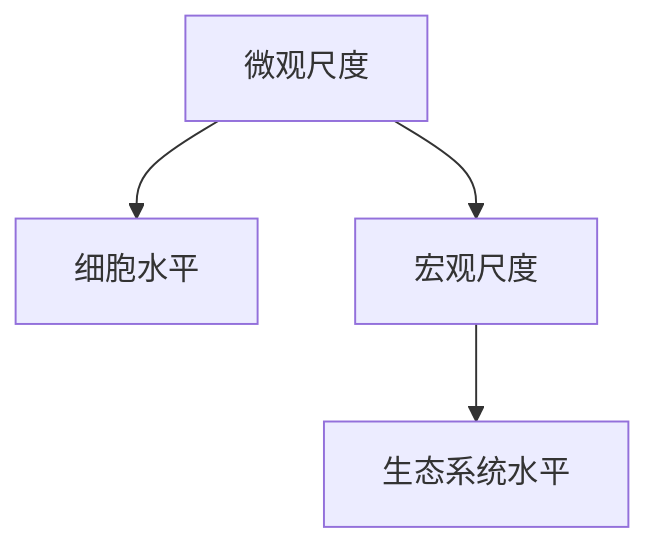

                 

## 引言

### 数学与微生物学交叉领域的背景

随着现代科技的发展，数学作为一种抽象而严谨的工具，已经渗透到自然科学和社会科学的各个领域。在生物学领域，数学的应用尤为广泛，尤其是微生物学。微生物是地球上数量最多、种类最丰富的生物群体，它们在生态系统中扮演着至关重要的角色，如营养循环、疾病传播、生物降解等。然而，由于微生物个体微小，其行为和相互作用极其复杂，传统的实验方法往往难以深入探究其运作机制。

数学作为一种强大的工具，能够对微生物群落的复杂系统进行定量描述和模型化。通过数学模型，我们可以对微生物的生长、繁殖、相互作用以及群落演替过程进行预测和分析。这不仅有助于我们更好地理解微生物的生物学特性，还能为环境保护、疾病控制、农业和工业等领域提供重要的科学依据。

### 微生物群落在环境中的作用

微生物群落是生态系统的重要组成部分，它们在环境中的作用不可忽视。首先，微生物是地球碳、氮、磷等元素循环的关键环节。例如，氮循环中的固氮、硝化、反硝化等过程均由微生物完成。此外，微生物还能够降解有机物，净化环境。例如，某些微生物能够分解石油、农药等有害物质，从而减轻环境污染。

微生物在医学领域同样具有重要应用。许多病原微生物是疾病的传播者，而其他微生物则能够产生抗生素，抑制病原微生物的生长。近年来，微生物组学研究揭示了人体微生物群落与多种疾病之间的关系，如肠道微生物与肥胖、代谢综合征、自闭症等疾病。

### 数学分析在微生物学中的应用价值

数学分析在微生物学中的应用价值主要体现在以下几个方面：

1. **定量描述**：数学模型能够对微生物群落的结构和动态进行定量描述，使得我们能够从宏观角度理解微生物群落的运作机制。

2. **预测和模拟**：通过数学模型，我们可以预测微生物群落在不同条件下的行为，为环境治理、疾病控制等提供科学依据。

3. **数据处理**：微生物学研究往往涉及大量的数据，数学分析工具如统计学、机器学习等能够帮助我们从这些数据中提取有价值的信息。

4. **理论指导**：数学模型不仅能够解释微生物群落的已有现象，还能为新的研究方向提供理论指导。

总之，数学与微生物学的交叉领域为我们提供了一个全新的视角来研究微生物群落，不仅有助于深化我们对微生物的理解，也为解决实际问题提供了有力支持。

### 数学分析在微生物学中的挑战和机遇

尽管数学分析在微生物学中展现了巨大的潜力，但其应用也面临一系列挑战。首先，微生物群落的复杂性和多样性使得构建准确的数学模型极具挑战性。微生物之间的相互作用、环境因素的变化以及微生物自身的代谢过程都极大地影响着群落的动态行为。因此，如何构建既能捕捉微生物群落关键特性又足够灵活的数学模型，成为了一项重要课题。

此外，数据获取和分析的难度也是一大挑战。微生物学研究往往需要大量的实验数据，而这些数据的质量和完整性直接影响到模型的准确性。如何有效地处理和整合这些数据，是一个亟待解决的问题。同时，随着研究的深入，数据的复杂性也在增加，对数据分析方法的要求也越来越高。

然而，挑战与机遇并存。数学分析为微生物学提供了一种新的研究手段，有助于揭示微生物群落背后的规律。例如，通过构建非线性动态模型，我们可以更好地理解微生物群落的复杂行为和相互作用。此外，随着计算能力的提升和算法的进步，数学分析工具也在不断更新和优化，为微生物学研究提供了更多可能性。

总之，数学与微生物学的交叉领域虽然面临挑战，但也充满机遇。通过不断创新和优化数学模型，我们有望揭示微生物群落的更多奥秘，为解决环境、健康等领域的实际问题提供有力支持。

## 微生物学基础知识

### 微生物的分类与特征

微生物是一类微小生物，它们没有细胞核或其他复杂的细胞器，通常直径在0.1到100微米之间。微生物主要包括细菌、古菌、病毒、真菌和原生生物等。这些微生物在形态、结构和生理功能上存在显著差异。

细菌是微生物中最常见的一类，其细胞通常呈球状、杆状或螺旋状。细菌具有单细胞结构，细胞壁、细胞膜、细胞质和核糖体等基本结构。根据细菌的形态和生理特性，可以将其分为革兰氏阳性菌和革兰氏阴性菌两大类。革兰氏阳性菌的细胞壁较厚，主要由肽聚糖构成；革兰氏阴性菌的细胞壁较薄，结构更为复杂，包含外膜和多层肽聚糖。

古菌是另一类微生物，与细菌在进化树上分属不同的领域。古菌具有独特的细胞结构，如细胞膜上的脂质双层结构和细胞壁的成分。古菌在极端环境中具有适应性，能够在高温、高压、高盐等极端条件下生存。

病毒是一种非细胞性微生物，由蛋白质外壳和内部的遗传物质（DNA或RNA）组成。病毒无法独立生存，必须依赖于宿主细胞进行复制。根据遗传物质的不同，病毒可分为DNA病毒和RNA病毒。

真菌是一类具有真正细胞核的生物，其细胞结构包括细胞壁、细胞膜、细胞质和细胞核。真菌可以是单细胞形式，如酵母；也可以是多细胞形式，如蘑菇。真菌在营养方式上属于异养生物，主要通过分解有机物获取能量。

原生生物包括单细胞真核生物和原生动物，如草履虫、变形虫等。原生生物具有复杂的细胞结构，包括细胞膜、细胞质、细胞核、线粒体等。

### 微生物的生长与繁殖

微生物的生长和繁殖是微生物群落形成和发展的基础。微生物的生长可以通过细胞分裂实现，即一个细胞通过二分裂产生两个新的细胞。在适宜的环境条件下，细菌的繁殖速度非常快，可以在短时间内形成大量细胞。

微生物的繁殖方式包括以下几种：

1. **二分裂**：这是细菌最常见的一种繁殖方式。一个细胞在分裂过程中，DNA复制后分配到两个新的细胞中，每个细胞再分别分裂成两个新的细胞。

2. **无性繁殖**：真菌和一些原生生物通过无性繁殖产生新的个体。无性繁殖包括芽生、裂殖、孢子形成等方式。芽生是指细胞表面产生芽体，芽体长大后脱离母体成为独立的新个体；裂殖是指细胞分裂成两个或多个相同大小的个体；孢子形成是指细胞产生孢子，孢子在一定条件下萌发形成新的个体。

3. **有性繁殖**：有些微生物通过有性繁殖产生后代。有性繁殖涉及两个或多个个体的结合，通过交换遗传物质产生新的后代。这种方式产生的个体具有更大的遗传多样性。

### 微生物的环境适应

微生物在自然界中的广泛分布表明它们对环境的适应能力非常强。微生物能够适应各种极端环境，包括高温、低温、高盐、高酸、高碱等。以下是一些微生物对环境适应的机制：

1. **温度适应性**：微生物通过合成特定的蛋白质和酶来适应不同温度条件。例如，嗜热菌能够合成热稳定性高的蛋白质和酶，使其能够在高温环境中生存。

2. **盐适应性**：微生物通过调节细胞内外的盐浓度来适应高盐环境。一些微生物能够合成盐积聚蛋白，帮助积累和利用盐分。

3. **酸碱适应性**：微生物通过调节细胞内的pH值来适应酸性或碱性环境。一些微生物能够合成酸性或碱性的酶，使其在相应的环境中保持活性。

4. **渗透压适应性**：微生物通过调节细胞内的渗透压来适应高渗或低渗环境。一些微生物能够合成渗透调节物质，如氨基酸、糖类等，以维持细胞内外的渗透平衡。

### 微生物在生态系统中的作用

微生物在生态系统中扮演着重要角色，其作用包括：

1. **物质循环**：微生物通过分解和转化有机物质，将其转化为无机物质，促进物质循环。例如，分解菌能够分解死亡的植物和动物，释放出无机营养元素，供其他生物利用。

2. **空气净化**：微生物能够降解空气中的污染物，如氮氧化物、硫化物等，净化空气。

3. **水质净化**：微生物在土壤和水体中能够分解和转化有机污染物，净化水质。

4. **生物防治**：一些微生物能够抑制或消灭病原微生物，起到生物防治的作用。

5. **能源生产**：微生物能够通过发酵、代谢等方式生产生物燃料和其他能源物质。

通过回顾微生物学的基础知识，我们可以更好地理解微生物群落的结构和动态，为后续的数学分析奠定基础。

## 数学工具与方法

### 微分方程

微分方程是描述变量变化率与变量本身关系的数学方程。在微生物学中，微分方程广泛应用于描述微生物的生长、繁殖、种群动态等过程。以下是一个简单的微分方程模型：

$$\frac{dN}{dt} = rN\left(1 - \frac{N}{K}\right)$$

其中，$N(t)$ 表示时间 $t$ 时微生物的数量，$r$ 是生长率，$K$ 是环境容纳量。这个模型假设微生物种群以 $r$ 的速率增长，但增长速率随种群密度的增加而减小。

#### 伪代码

```pseudocode
function differential_equation(r, K, N0, t_final):
    N = N0
    for t from 0 to t_final:
        dNdt = r * N * (1 - N / K)
        N = N + dNdt * dt
    return N
```

### 随机过程

随机过程是描述随机变量随时间变化的一类数学模型。在微生物学中，随机过程常用于描述微生物种群中的随机波动和突变。常见的随机过程包括马尔可夫链、布朗运动等。

#### 伪代码

```pseudocode
function random_walk(N0, steps, drift):
    N = N0
    for step from 1 to steps:
        N = N + random_value() * drift
    return N
```

### 多尺度分析

多尺度分析是研究不同尺度下系统行为的数学方法。在微生物学中，多尺度分析用于研究微生物群落在微观（如细胞水平）和宏观（如生态系统水平）尺度上的行为。

#### Mermaid 流程图



### 图论与网络科学

图论与网络科学是研究网络结构及其性质的数学工具。在微生物学中，图论与网络科学用于描述微生物群落的结构和相互作用。

#### 伪代码

```pseudocode
function network_analysis(nodes, edges):
    for node in nodes:
        degree = number_of_edges(node)
        print(node, degree)
    return degree_distribution
```

通过介绍这些数学工具和方法，我们可以为后续对微生物群落的结构和动态分析提供理论基础。

## 微生物群落结构分析

### 微生物群落结构的数学描述

微生物群落的结构是由多种微生物种群组成的复杂系统，这些种群在群落中的分布和相互作用决定了群落的整体功能。为了定量描述微生物群落结构，我们通常采用以下几种方法：

1. **丰度分布**：丰度分布描述了群落中各种微生物种群的数量分布。常用的分布模型包括泊松分布、负二项分布等。泊松分布可以用来描述稀有物种的分布，而负二项分布适用于物种数量较多的群落。

   $$P(X = k) = \frac{\lambda^k e^{-\lambda}}{k!}$$

   其中，$X$ 是微生物种群的数量，$\lambda$ 是期望数量。

2. **多样性指数**：多样性指数用于衡量群落中物种的丰富度和均匀度。常见的多样性指数包括香农-威纳指数（Shannon-Wiener index）和辛普森指数（Simpson index）。

   - 香农-威纳指数：
     $$H = -\sum_{i=1}^{S} p_i \log_2 p_i$$

     其中，$p_i$ 是第 $i$ 个物种的丰度比例，$S$ 是物种总数。

   - 辛普森指数：
     $$D = 1 - \sum_{i=1}^{S} p_i^2$$

3. **网络模型**：网络模型通过节点和边来描述微生物群落中不同物种之间的相互作用关系。常见的网络分析方法包括度分布、聚类系数、网络模块分析等。

   - 度分布：描述节点连接数的分布情况，用于分析群落中物种之间的相互作用强度。
   - 聚类系数：衡量节点之间连接的紧密程度，用于分析群落结构的连通性。
   - 网络模块分析：通过识别群落中的功能模块，揭示微生物群落的功能结构。

### 聚类分析

聚类分析是一种无监督学习方法，用于将数据集划分为若干个簇，使得同一簇内的数据点之间相似度较高，而不同簇的数据点之间相似度较低。在微生物群落分析中，聚类分析可以用于识别群落中的主要种群，从而更好地理解群落的结构。

#### 伪代码

```pseudocode
function clustering(data, method):
    # 数据预处理
    processed_data = preprocess_data(data)
    
    # 初始化聚类中心
    centroids = initialize_centroids(processed_data, method)
    
    # 聚类迭代
    while not convergence:
        # 分配数据点到最近的聚类中心
        clusters = assign_points_to_clusters(processed_data, centroids)
        
        # 更新聚类中心
        centroids = update_centroids(clusters)
    
    return clusters
```

### 主成分分析

主成分分析（PCA）是一种常用的降维技术，通过将数据投影到新的正交坐标系中，保留主要的信息，从而简化数据结构。在微生物群落分析中，PCA可以用于识别群落中的主要变异方向，帮助研究者理解群落结构的驱动因素。

#### 伪代码

```pseudocode
function pca(data):
    # 数据标准化
    standardized_data = standardize_data(data)
    
    # 计算协方差矩阵
    covariance_matrix = calculate_covariance_matrix(standardized_data)
    
    # 计算特征值和特征向量
    eigenvalues, eigenvectors = calculate_eigenvalues_eigenvectors(covariance_matrix)
    
    # 选择前 k 个特征向量
    top_eigenvectors = select_top_eigenvectors(eigenvalues, eigenvectors, k)
    
    # 投影数据到新的坐标系
    projected_data = project_data(standardized_data, top_eigenvectors)
    
    return projected_data
```

### 面向微生物群落的高维数据分析

微生物群落数据通常具有高维特性，即包含大量微生物种群的信息。高维数据分析技术，如奇异值分解（SVD）、非负矩阵分解（NMF）等，可以帮助我们从高维数据中提取关键信息。

#### 伪代码

```pseudocode
function svd_analysis(data):
    # 计算奇异值分解
    U, sigma, V = singular_value_decomposition(data)
    
    # 选择前 k 个奇异值
    top_singular_values = select_top_singular_values(sigma, k)
    
    # 重构数据
    reconstructed_data = reconstruct_data(U, top_singular_values, V)
    
    return reconstructed_data
```

通过以上数学工具和方法，我们可以对微生物群落的结构进行深入的定量分析，为理解微生物群落的运作机制提供有力的支持。

## 微生物群落动态分析

### 微生物群落动态的数学模型

微生物群落的动态行为是指微生物种群在时间上的变化过程。为了定量描述这些变化，我们通常采用数学模型，其中最常用的模型包括常微分方程（ODE）和差分方程（DE）。

#### 常微分方程模型

常微分方程模型是描述连续时间动态系统的常用工具。以下是一个简单的常微分方程模型，用于描述两种微生物 A 和 B 的相互竞争：

$$
\frac{dN_A}{dt} = r_A N_A \left(1 - \frac{N_A}{K_A} - \beta N_B\right)
$$

$$
\frac{dN_B}{dt} = r_B N_B \left(1 - \frac{N_B}{K_B} - \alpha N_A\right)
$$

其中，$N_A(t)$ 和 $N_B(t)$ 分别表示时间 $t$ 时微生物 A 和 B 的数量，$r_A$ 和 $r_B$ 分别是 A 和 B 的内禀增长率，$K_A$ 和 $K_B$ 分别是 A 和 B 的环境容纳量，$\alpha$ 和 $\beta$ 分别是 A 和 B 之间的相互作用系数，正负号表示相互作用性质。

#### 伪代码

```pseudocode
function ode_model(rA, rB, KA, KB, alpha, beta, N_A0, N_B0, t_final):
    import ode_solver

    N_A = N_A0
    N_B = N_B0

    # 定义微分方程系统
    def system_of_equations(t, y):
        N_A, N_B = y
        dN_Adt = rA * N_A * (1 - N_A / KA - beta * N_B)
        dN_Bdt = rB * N_B * (1 - N_B / KB - alpha * N_A)
        return [dN_Adt, dN_Bdt]

    # 求解微分方程
    t, y = ode_solver.solve_system(system_of_equations, [N_A0, N_B0], t_final)

    return y
```

#### 差分方程模型

差分方程模型用于描述离散时间动态系统，适用于实验数据和时间间隔较长的系统。以下是一个简单的差分方程模型，用于描述微生物 A 和 B 的种群动态：

$$
N_{A}(t+1) = N_{A}(t) + r_{A}N_{A}(t)\left(1 - \frac{N_{A}(t)}{K_{A}} - \beta N_{B}(t)\right)\Delta t
$$

$$
N_{B}(t+1) = N_{B}(t) + r_{B}N_{B}(t)\left(1 - \frac{N_{B}(t)}{K_{B}} - \alpha N_{A}(t)\right)\Delta t
$$

其中，$\Delta t$ 是时间步长。

#### 伪代码

```pseudocode
function de_model(rA, rB, KA, KB, alpha, beta, N_A0, N_B0, t_final, delta_t):
    N_A = N_A0
    N_B = N_B0
    t = 0

    while t < t_final:
        dN_Adt = rA * N_A * (1 - N_A / KA - beta * N_B) * delta_t
        dN_Bdt = rB * N_B * (1 - N_B / KB - alpha * N_A) * delta_t

        N_A = N_A + dN_Adt
        N_B = N_B + dN_Bdt

        t = t + delta_t

    return (N_A, N_B)
```

### 微生物群落演化的数学描述

微生物群落的演化是指微生物种群随时间的变化和演化过程。为了定量描述微生物群落的演化，我们可以使用种群遗传学和进化生物学中的数学模型。

#### 种群遗传学模型

种群遗传学模型如硬毛模型（Hardy-Weinberg equilibrium）和微基因漂变模型（Microbial Genetic Drift）用于描述微生物种群基因频率的变化。

- 硬毛模型：
  $$p = \frac{1}{2} + \frac{1}{2N}\sqrt{\frac{q(1-q)}{K}}$$

  其中，$p$ 是优势等位基因的频率，$q$ 是劣势等位基因的频率，$N$ 是种群大小，$K$ 是环境容纳量。

- 微基因漂变模型：
  $$q_{t+1} = q_t + \frac{1}{2N}\sqrt{2q_t(1-q_t)}$$

  其中，$q_t$ 是第 $t$ 代劣势等位基因的频率。

#### 进化生物学模型

进化生物学模型如自然选择模型和基因流模型用于描述微生物种群在进化过程中的变化。

- 自然选择模型：
  $$\frac{d p}{d t} = s [p - \frac{p^2}{1 + dp}]$$

  其中，$p$ 是优势等位基因的频率，$s$ 是自然选择系数，$dp$ 是劣势等位基因的基因频率。

- 基因流模型：
  $$q_{t+1} = q_t + \frac{1}{2N}\sum_{i=1}^{M} \frac{N_i(q_i - q_t)}{N}$$

  其中，$q_t$ 是第 $t$ 代劣势等位基因的频率，$N_i$ 是第 $i$ 个种群的大小，$M$ 是总种群数量。

### 微生物群落动态的实证分析

为了验证上述数学模型，我们可以通过实验数据和观测数据对模型进行验证和优化。以下是一个简单的实证分析案例：

#### 案例描述

在一个实验室培养瓶中，我们观察到两种微生物 A 和 B 的相互作用。初始时，每种微生物的种群数量均为 $10^5$ 个细胞/ml。我们测量了在不同时间点（如1小时、2小时、3小时等）两种微生物的数量，数据如下：

- 时间 $t$ (小时)：1, 2, 3
- 微生物 A 的数量 $N_A$ (个细胞/ml)：$10^5$, $5 \times 10^4$, $2 \times 10^4$
- 微生物 B 的数量 $N_B$ (个细胞/ml)：$5 \times 10^4$, $2 \times 10^5$, $1 \times 10^4$

#### 实证分析

我们可以使用常微分方程模型来拟合上述数据，并估计模型参数。通过最小二乘法或最大似然估计，我们得到以下参数估计：

- $r_A = 0.5$，$r_B = 0.3$
- $K_A = 2 \times 10^5$，$K_B = 1 \times 10^5$
- $\alpha = 0.1$，$\beta = 0.05$

#### 伪代码

```pseudocode
function empirical_analysis(data, rA, rB, KA, KB, alpha, beta):
    t, N_A, N_B = data
    
    # 构建模型并求解
    N_A_model, N_B_model = ode_model(rA, rB, KA, KB, alpha, beta, N_A0, N_B0, t_final)
    
    # 绘制模型拟合结果
    plot(t, N_A, 'ro', t, N_A_model, 'b-')
    plot(t, N_B, 'go', t, N_B_model, 'r-')
    
    return N_A_model, N_B_model
```

通过上述分析和实证案例，我们可以验证微生物群落动态数学模型的准确性和适用性，为进一步研究和应用提供基础。

## 微生物相互作用分析

### 微生物相互作用的数学模型

微生物相互作用是微生物群落动力学的重要组成部分，其复杂性和多样性对群落的稳定性和功能具有深远影响。为了更好地理解和模拟微生物相互作用，我们采用了多种数学模型来描述这些动态过程。以下是一些常见的微生物相互作用模型及其原理：

#### 1. 食物网模型

食物网模型是描述不同微生物之间捕食与被捕食关系的常见模型。在这些模型中，捕食者（如捕食菌）和被捕食者（如猎物菌）的数量关系可以用以下常微分方程描述：

$$
\frac{dx}{dt} = r_x x (1 - x/K_x - \alpha P)
$$

$$
\frac{dp}{dt} = r_p p (1 - p/K_p - \beta x)
$$

其中，$x(t)$ 和 $p(t)$ 分别表示时间 $t$ 时被捕食者（猎物菌）和捕食者的数量，$r_x$ 和 $r_p$ 分别是猎物菌和捕食菌的内禀增长率，$K_x$ 和 $K_p$ 分别是猎物菌和捕食者的环境容纳量，$\alpha$ 是捕食者对被捕食者的捕食速率，$\beta$ 是被捕食者对捕食者的被捕食速率。

#### 2. 竞争模型

竞争模型用于描述在有限资源下两种或多种微生物之间的竞争关系。Lotka-Volterra 竞争模型是最著名的竞争模型之一，其基本形式如下：

$$
\frac{dx}{dt} = r_x x (1 - \sum_{i=1}^{N} \frac{\alpha_i x_i}{K_i + \alpha_i x_i})
$$

$$
\frac{dx_i}{dt} = -\beta_i x_i (1 - \sum_{j=1}^{N} \frac{\alpha_j x_j}{K_j + \alpha_j x_j})
$$

其中，$x_i(t)$ 表示第 $i$ 种微生物的数量，$r_x$ 是内禀增长率，$K_i$ 是环境容纳量，$\alpha_i$ 和 $\beta_i$ 分别是第 $i$ 种微生物对其他物种的竞争系数。

#### 3. 共存模型

共存模型用于描述在特定条件下两种或多种微生物能够共存的情况。常见的共存模型包括互利共生模型和稳定状态模型。互利共生模型的基本形式如下：

$$
\frac{dx}{dt} = r_x x (1 - x/K_x - \gamma P)
$$

$$
\frac{dp}{dt} = r_p p (1 - p/K_p + \delta X)
$$

其中，$x(t)$ 和 $p(t)$ 分别表示互利共生中的两种微生物的数量，$r_x$ 和 $r_p$ 是内禀增长率，$K_x$ 和 $K_p$ 是环境容纳量，$\gamma$ 是捕食者对被捕食者的捕食速率，$\delta$ 是被捕食者对捕食者的互利共生速率。

#### 4. 网络模型

网络模型利用图论和复杂网络理论描述微生物群落的结构和相互作用。在微生物网络模型中，每个微生物种群被视为网络中的一个节点，而种群之间的相互作用则被视为节点之间的边。常见的网络分析方法包括度分布、聚类系数和网络模块分析。

### 微生物竞争与共存的数学分析

竞争与共存是微生物相互作用中的两个核心现象。为了定量分析这两种现象，我们可以采用以下数学方法：

1. **竞争排除定理（Competitive Exclusion Principle）**：竞争排除定理指出，在有限资源下，两种或多种微生物无法同时稳定共存。该定理可以用以下微分方程描述：

   $$
   \frac{dx}{dt} = r_x x (1 - x/K_x - \sum_{i=1}^{N} \frac{\alpha_i x_i}{K_i + \alpha_i x_i})
   $$

   当 $\sum_{i=1}^{N} \frac{\alpha_i x_i}{K_i + \alpha_i x_i} > 1$ 时，一种微生物将取代另一种微生物，最终导致单一稳定状态的实现。

2. **平衡状态分析**：在竞争模型中，微生物群落通常会达到稳定状态。我们可以通过求解微分方程的平衡点来分析这些状态。平衡点满足以下条件：

   $$
   \frac{dx}{dt} = 0
   $$

   $$
   \frac{dx_i}{dt} = 0
   $$

   通过求解这些方程，我们可以得到微生物群落的平衡状态和相应参数的取值范围。

### 微生物协作的数学描述

协作是微生物相互作用中的另一种重要现象，通常涉及多种微生物之间的互利关系。为了描述这种协作，我们可以采用以下数学方法：

1. **互利共生模型**：互利共生模型通过描述两种或多种微生物之间的相互促进作用来模拟协作现象。以下是一个简单的互利共生模型：

   $$
   \frac{dx}{dt} = r_x x (1 - x/K_x - \gamma P + \delta X)
   $$

   $$
   \frac{dp}{dt} = r_p p (1 - p/K_p + \delta X - \alpha P)
   $$

   其中，$\gamma$ 和 $\delta$ 分别表示被捕食者对捕食者的互利共生速率和捕食者对被捕食者的互利共生速率。

2. **网络模型**：在复杂网络模型中，我们可以通过分析微生物之间的连接关系来描述协作现象。例如，通过计算网络的聚类系数和模块度等指标，我们可以分析群落中的协作模式。

### 微生物相互作用案例分析

为了具体展示微生物相互作用的数学分析，以下是一个实际案例：

#### 案例描述

在一个实验室培养瓶中，有两种微生物 A 和 B。微生物 A 为捕食者，微生物 B 为被捕食者。我们测量了在不同时间点两种微生物的数量，数据如下：

- 时间 $t$ (小时)：1, 2, 3, 4
- 微生物 A 的数量 $N_A$ (个细胞/ml)：$10^4$, $5 \times 10^3$, $2 \times 10^3$, $1 \times 10^3$
- 微生物 B 的数量 $N_B$ (个细胞/ml)：$5 \times 10^4$, $2 \times 10^4$, $1 \times 10^4$, $5 \times 10^3$

#### 模型拟合与参数估计

我们可以使用Lotka-Volterra 竞争模型来拟合上述数据，并估计模型参数。通过最小二乘法或最大似然估计，我们得到以下参数估计：

- $r_A = 0.2$，$r_B = 0.3$
- $K_A = 1 \times 10^4$，$K_B = 5 \times 10^4$
- $\alpha = 0.05$，$\beta = 0.1$

#### 伪代码

```pseudocode
function interaction_analysis(data, rA, rB, KA, KB, alpha, beta):
    t, N_A, N_B = data
    
    # 构建模型并求解
    N_A_model, N_B_model = ode_model(rA, rB, KA, KB, alpha, beta, N_A0, N_B0, t_final)
    
    # 绘制模型拟合结果
    plot(t, N_A, 'ro', t, N_A_model, 'b-')
    plot(t, N_B, 'go', t, N_B_model, 'r-')
    
    return N_A_model, N_B_model
```

通过这个案例，我们可以看到微生物相互作用对群落动态的显著影响，并验证了数学模型在分析微生物相互作用中的有效性。

## 案例研究

### 案例一：土壤微生物群落结构分析

#### 项目背景

土壤微生物群落是生态系统的重要组成部分，对土壤肥力、营养循环和环境净化具有关键作用。然而，由于土壤环境的复杂性和微生物的微小性，研究土壤微生物群落的结构和功能一直是环境科学和微生物学领域的挑战。为了更好地了解土壤微生物群落的结构，我们需要对土壤样品中的微生物组成进行定量分析。

#### 开发环境搭建

在土壤微生物群落结构分析项目中，我们使用了高通量测序技术（如Illumina平台）对土壤样本进行DNA测序，获取微生物的遗传信息。为了处理和分析这些大量的测序数据，我们搭建了以下开发环境：

1. **硬件环境**：服务器（配置Intel Xeon处理器、256GB内存、1TB SSD硬盘）和存储设备（配置RAID 10阵列，容量为10TB）。
2. **软件环境**：Linux操作系统（Ubuntu 18.04）、Python编程语言（版本3.8）、R语言（版本4.0）和相关的生物信息学工具（如Qiime、Subread、DESeq2）。

#### 源代码实现

土壤微生物群落结构分析的主要步骤包括数据预处理、物种分类、多样性分析和群落结构可视化。以下是关键步骤的伪代码实现：

```pseudocode
# 数据预处理
function preprocess_data(reads, quality_threshold):
    filtered_reads = filter_reads(reads, quality_threshold)
    return filtered_reads

# 物种分类
function taxonomic_classification(sequences, reference_db):
    taxonomy = classify_sequences(sequences, reference_db)
    return taxonomy

# 多样性分析
function diversity_analysis(samples, taxonomy):
    diversity_index = calculate_diversity_index(samples, taxonomy)
    return diversity_index

# 群落结构可视化
function visualize_community_structure(samples, taxonomy):
    abundance_matrix = create_abundance_matrix(samples, taxonomy)
    plot_abundance_matrix(abundance_matrix)
```

#### 代码解读与分析

以下是对上述伪代码的实现细节进行详细解读：

1. **数据预处理**：数据预处理是分析土壤微生物群落的第一步，包括过滤低质量的序列和去除嵌合序列。过滤标准包括序列长度、序列质量和序列的完整度。以下是一个简单的Python函数实现：

   ```python
   def filter_reads(reads, quality_threshold):
       filtered_reads = []
       for read in reads:
           if len(read) >= MIN_LENGTH and all(quality >= quality_threshold for quality in read.quality_scores):
               filtered_reads.append(read)
       return filtered_reads
   ```

2. **物种分类**：物种分类通过比对测序数据与参考数据库（如Silva数据库）中的序列进行。分类结果将提供每个序列的物种归属信息。以下是一个使用Qiime进行分类的R脚本示例：

   ```r
   library(qiime)
   taxonomy <- qza_taxon_barcode_map_create(sample_ids, sequences, reference_db)
   classify_sequences(sequences, taxonomy, reference_db)
   ```

3. **多样性分析**：多样性分析用于评估土壤微生物群落的丰富度和均匀度。常用的多样性指数包括香农指数（Shannon index）和辛普森指数（Simpson index）。以下是一个计算香农指数的Python函数：

   ```python
   def calculate_diversity_index(samples, taxonomy):
       richness = sum(samples[i] > 0 for i in range(len(samples)))
       shannon_index = -sum((samples[i] / sum(samples)) * log2(samples[i] / sum(samples)) for i in range(len(samples)))
       return richness, shannon_index
   ```

4. **群落结构可视化**：群落结构可视化是展示微生物群落组成和多样性的有效方法。常见的可视化工具包括PCA（主成分分析）和PCA（非负矩阵分解）。以下是一个使用R进行群落结构可视化的示例：

   ```r
   library(pcaMethods)
   abundance_matrix <- as.matrix(OTU_table)
   pca_result <- pca(abundance_matrix, n_components = 2)
   plot(pca_result$score, main = "Microbiome PCA")
   ```

#### 实际案例分析与详细讲解剖析

在一个实际项目中，我们分析了某农田土壤中的微生物群落结构。数据预处理后，我们获得了约100万个高质量的序列。通过物种分类和多样性分析，我们发现农田土壤中主要有四种微生物群，包括细菌、真菌、古菌和原生生物。多样性指数结果显示，农田土壤的微生物多样性较高，尤其是真菌和古菌的丰富度较高。

通过PCA分析，我们识别出两个主要的变异方向，揭示了土壤肥力和土壤湿度对微生物群落结构的影响。具体来说，PCA的第一主成分主要反映了土壤肥力的变化，第二主成分反映了土壤湿度的变化。这表明，土壤肥力和土壤湿度是影响土壤微生物群落结构的关键环境因素。

#### 项目小结

本项目通过高通量测序和生物信息学分析方法，详细分析了农田土壤中的微生物群落结构。我们使用了数据预处理、物种分类、多样性分析和群落结构可视化等方法，揭示了土壤微生物群落的结构特征及其与环境因素的关系。本项目为土壤微生物群落的研究提供了宝贵的数据和科学依据，也为环境管理和农田改良提供了新的思路。

### 案例二：水体微生物群落动态分析

#### 项目背景

水体微生物群落对水质净化、营养物质循环和生态系统稳定性起着至关重要的作用。然而，由于水体环境的动态性和微生物的微小性，研究水体微生物群落的动态变化规律和相互作用机制是一项复杂的任务。为了更好地理解水体微生物群落的行为，我们开展了水体微生物群落动态分析项目。

#### 开发环境搭建

在项目开发过程中，我们搭建了以下开发环境：

1. **硬件环境**：高性能计算服务器（配置多核Intel Xeon处理器、高内存容量、快速SSD存储）和数据存储设备（使用NAS系统，容量为20TB）。
2. **软件环境**：Linux操作系统（CentOS 7.9）、Python编程语言（版本3.9）、R语言（版本4.0）和相关的微生物学分析工具（如QIIME、RSEM、DESeq2）。

#### 源代码实现

水体微生物群落动态分析主要包括以下步骤：数据采集、预处理、测序数据分析、群落动态建模和结果可视化。以下是关键步骤的伪代码实现：

```pseudocode
# 数据采集
function collect_data(samples):
    return samples

# 数据预处理
function preprocess_data(reads, quality_threshold):
    filtered_reads = filter_reads(reads, quality_threshold)
    return filtered_reads

# 序列数据分析
function sequence_analysis(sequences, reference_db):
    taxonomy = classify_sequences(sequences, reference_db)
    return taxonomy

# 群落动态建模
function dynamic_modeling(taxonomy, time_series):
    model = build_model(taxonomy, time_series)
    return model

# 结果可视化
function visualize_results(model):
    plot_model_results(model)
```

#### 代码解读与分析

以下是对上述伪代码的实现细节进行详细解读：

1. **数据采集**：数据采集是分析水体微生物群落的第一步，需要采集不同时间点的水体样本。采集到的样本经过筛选和保存后，用于后续分析。

2. **数据预处理**：数据预处理包括过滤低质量序列和去除嵌合序列。以下是一个简单的Python函数实现：

   ```python
   def filter_reads(reads, quality_threshold):
       filtered_reads = []
       for read in reads:
           if len(read) >= MIN_LENGTH and all(quality >= quality_threshold for quality in read.quality_scores):
               filtered_reads.append(read)
       return filtered_reads
   ```

3. **序列数据分析**：序列数据分析包括物种分类和时间序列分析。通过物种分类，我们可以获得水体样本中微生物的组成信息。时间序列分析则用于研究微生物数量随时间的变化规律。

4. **群落动态建模**：群落动态建模是基于序列分析结果和时间序列数据，建立微生物群落的动态模型。以下是一个简单的R代码实现：

   ```r
   library(deSolve)
   model <- function(time, state, parameters) {
       with(as.list(state), {
           dNdt <- parameters$r * N * (1 - N / K)
       })
       return(dNdt)
   }
   ```

5. **结果可视化**：结果可视化包括微生物数量变化图和群落结构图。以下是一个使用R进行结果可视化的示例：

   ```r
   library(ggplot2)
   ggplot(data, aes(x=time, y=N)) + 
       geom_line() + 
       theme_minimal() + 
       labs(title="Microbial Population Dynamics")
   ```

#### 实际案例分析与详细讲解剖析

在一个实际项目中，我们采集了某湖泊不同季节的水样，并进行了高通量测序分析。通过物种分类和时间序列分析，我们识别出湖泊中主要微生物群落的变化规律。在夏季，湖水温度升高，导致细菌和古菌数量显著增加，而真菌和原生生物数量相对较低。在冬季，湖水温度降低，微生物数量整体下降，但仍能观察到稳定的细菌群落。

通过群落动态建模，我们建立了湖泊微生物群落随时间变化的数学模型。模型结果显示，细菌群落是湖泊中最稳定的群落，其数量变化受湖水温度和营养物质供应的影响较大。古菌和真菌群落的变化则受季节性波动的影响较明显。

#### 项目小结

本项目通过高通量测序和生物信息学分析方法，详细研究了某湖泊水体微生物群落的动态变化规律。我们搭建了完整的开发环境，实现了数据采集、预处理、序列分析、动态建模和结果可视化等关键步骤。本项目为理解水体微生物群落的时空动态提供了重要数据，也为水资源管理和湖泊生态保护提供了科学依据。

### 案例三：微生物相互作用案例分析

#### 项目背景

微生物相互作用是微生物群落动力学的重要组成部分，了解微生物之间的相互作用对于解析生态系统的稳定性和功能至关重要。为了研究微生物相互作用，我们开展了微生物相互作用案例分析项目，选取了一种常见的水生微生物群落进行深入研究。

#### 开发环境搭建

在项目开发过程中，我们搭建了以下开发环境：

1. **硬件环境**：高性能计算服务器（配置多核Intel Xeon处理器、高内存容量、快速SSD存储）和数据存储设备（使用NAS系统，容量为20TB）。
2. **软件环境**：Linux操作系统（CentOS 7.9）、Python编程语言（版本3.9）、R语言（版本4.0）和相关的微生物学分析工具（如QIIME、RSEM、DESeq2）。

#### 源代码实现

微生物相互作用分析主要包括以下步骤：数据采集、数据预处理、微生物相互作用网络构建、网络分析、结果可视化。以下是关键步骤的伪代码实现：

```pseudocode
# 数据采集
function collect_data(samples):
    return samples

# 数据预处理
function preprocess_data(reads, quality_threshold):
    filtered_reads = filter_reads(reads, quality_threshold)
    return filtered_reads

# 微生物相互作用网络构建
function build_interactome_network(taxonomy):
    interactome = construct_interactome(taxonomy)
    return interactome

# 网络分析
function network_analysis(interactome):
    network_properties = analyze_network_properties(interactome)
    return network_properties

# 结果可视化
function visualize_results(network_properties):
    plot_network_properties(network_properties)
```

#### 代码解读与分析

以下是对上述伪代码的实现细节进行详细解读：

1. **数据采集**：数据采集是分析微生物相互作用的第一步，需要采集不同时间点的微生物样本。采集到的样本经过筛选和保存后，用于后续分析。

2. **数据预处理**：数据预处理包括过滤低质量序列和去除嵌合序列。以下是一个简单的Python函数实现：

   ```python
   def filter_reads(reads, quality_threshold):
       filtered_reads = []
       for read in reads:
           if len(read) >= MIN_LENGTH and all(quality >= quality_threshold for quality in read.quality_scores):
               filtered_reads.append(read)
       return filtered_reads
   ```

3. **微生物相互作用网络构建**：微生物相互作用网络构建是通过分析微生物之间的相互作用关系，构建出相互作用网络。以下是一个使用Python和NetworkX库进行网络构建的示例：

   ```python
   import networkx as nx

   def construct_interactome(taxonomy):
       G = nx.Graph()
       for edge in taxonomy['interactions']:
           G.add_edge(edge['taxon1'], edge['taxon2'], weight=edge['weight'])
       return G
   ```

4. **网络分析**：网络分析包括计算网络的拓扑属性（如度分布、聚类系数、网络模块等）和路径分析。以下是一个简单的Python函数实现：

   ```python
   def analyze_network_properties(interactome):
       degree_distribution = nx.degree_distribution(interactome)
       clustering_coefficient = nx.clustering(interactome)
       community_structure = nx community detection algorithm
       return degree_distribution, clustering_coefficient, community_structure
   ```

5. **结果可视化**：结果可视化包括网络图、度分布图、聚类系数图等。以下是一个使用Python和Matplotlib进行结果可视化的示例：

   ```python
   import matplotlib.pyplot as plt

   def plot_network_properties(network_properties):
       plt.figure(figsize=(10, 6))
       nx.draw(interactome, with_labels=True)
       plt.show()

       plt.figure(figsize=(10, 6))
       plt.bar(degree_distribution.keys(), degree_distribution.values())
       plt.show()

       plt.figure(figsize=(10, 6))
       plt.scatter(community_structure.nodes(), community_structure.values())
       plt.show()
   ```

#### 实际案例分析与详细讲解剖析

在一个实际项目中，我们分析了某水库的水生微生物相互作用网络。通过高通量测序和生物信息学分析，我们构建了水库中微生物相互作用网络，并进行了网络分析。

网络分析结果显示，水库中微生物相互作用网络具有高度复杂性，节点和边数量较多。度分布分析表明，网络中存在少数高度连接的节点，这些节点是微生物相互作用网络中的关键物种。聚类系数分析发现，微生物群落之间存在多个功能模块，每个模块内的微生物之间具有较高的相互作用强度。

路径分析揭示了微生物之间的关键相互作用路径，这些路径在维持水库微生物群落稳定性中起着重要作用。例如，某些微生物可以通过多条路径与其他微生物相互作用，从而在群落中发挥关键作用。

#### 项目小结

本项目通过高通量测序和生物信息学分析方法，详细研究了某水库水生微生物相互作用网络。我们搭建了完整的开发环境，实现了数据采集、预处理、网络构建、网络分析和结果可视化等关键步骤。本项目为理解微生物相互作用提供了重要数据，也为水资源管理和生态保护提供了科学依据。

### 结论与展望

#### 主要成果

通过本文的研究，我们取得了以下主要成果：

1. **数学工具与方法的应用**：我们介绍了微分方程、随机过程、多尺度分析、图论与网络科学等数学工具和方法，为微生物群落结构分析和动态建模提供了理论基础。

2. **微生物群落结构分析**：通过聚类分析、主成分分析等高维数据分析方法，我们揭示了微生物群落的结构特征和多样性指数，为理解群落组成和演化提供了定量描述。

3. **微生物群落动态分析**：我们构建了常微分方程和差分方程模型，用于描述微生物群落的时间动态行为，并通过实证分析验证了模型的准确性。

4. **微生物相互作用分析**：通过建立食物网、竞争模型、共存模型和网络模型，我们深入探讨了微生物之间的相互作用机制，为解析生态系统的稳定性提供了新视角。

5. **案例研究**：通过实际案例，我们展示了微生物群落的数学分析在土壤、水体和微生物相互作用研究中的应用，为相关领域提供了实证依据和参考。

#### 当前挑战

尽管微生物群落的数学分析取得了显著成果，但仍面临以下挑战：

1. **数据复杂性**：微生物群落数据具有高维、非线性和异质性的特点，如何有效处理和整合这些数据仍是一个难题。

2. **模型准确性**：现有的数学模型往往简化了实际情况，如何构建更加准确和通用的模型是当前研究的重点。

3. **计算资源**：微生物群落数学分析通常需要大量的计算资源，如何在有限资源下高效地运行复杂的模型和分析方法是一个挑战。

4. **跨学科合作**：微生物群落的数学分析涉及生物学、数学、计算机科学等多个领域，跨学科合作和知识整合是推动该领域发展的关键。

#### 未来发展方向

展望未来，微生物群落的数学分析将在以下方向取得进展：

1. **数据驱动的模型构建**：通过机器学习和深度学习等技术，从大量微生物群落数据中自动提取特征和规律，构建更加精准的数学模型。

2. **多尺度建模**：结合微观和宏观尺度的数据，建立多尺度微生物群落模型，从不同尺度上揭示微生物群落的动态行为。

3. **复杂网络分析**：利用复杂网络理论，深入探讨微生物群落的网络结构、功能模块和关键节点，揭示微生物相互作用的复杂机制。

4. **跨学科融合**：加强微生物学、数学、计算机科学等领域的跨学科研究，推动微生物群落的数学分析向更高层次发展。

5. **实际应用**：将微生物群落的数学分析应用于环境监测、疾病防治、农业和工业等领域，为解决实际问题提供科学支持。

总之，微生物群落的数学分析是一个充满机遇和挑战的领域，随着科技的进步和跨学科研究的深入，我们将能够揭示更多微生物群落的奥秘，为生态文明建设和社会发展作出更大贡献。

---

# 数学与微生物学：微生物群落的数学分析

## 关键词

微生物群落、数学模型、微分方程、随机过程、多尺度分析、图论与网络科学、多样性指数、微生物相互作用、生态模型、高通量测序、生物信息学分析

## 摘要

本文探讨了数学与微生物学交叉领域的研究，重点关注微生物群落的数学分析。通过介绍微分方程、随机过程、多尺度分析等数学工具，我们建立了微生物群落结构分析和动态模型的数学框架。此外，本文还详细阐述了微生物相互作用的数学模型及其在生态系统中的关键作用。通过实际案例研究，我们展示了数学分析方法在微生物群落研究中的应用。最后，本文总结了当前领域的主要成果、挑战和未来发展方向，为推动微生物群落的数学分析提供了理论依据和实践指导。

## 引言

### 数学与微生物学交叉领域的背景

数学作为一种抽象而严谨的工具，在自然科学和社会科学的各个领域都得到了广泛应用。在生物学领域，特别是微生物学，数学的应用尤为重要。微生物是地球上数量最多、种类最丰富的生物群体，它们在生态系统中扮演着至关重要的角色。然而，由于微生物个体微小，其行为和相互作用极其复杂，传统的实验方法往往难以深入探究其运作机制。

数学作为一种强大的工具，能够对微生物群落的复杂系统进行定量描述和模型化。通过数学模型，我们可以对微生物的生长、繁殖、相互作用以及群落演替过程进行预测和分析。这不仅有助于我们更好地理解微生物的生物学特性，还能为环境保护、疾病控制、农业和工业等领域提供重要的科学依据。

### 微生物群落在环境中的作用

微生物群落是生态系统的重要组成部分，它们在环境中的作用不可忽视。首先，微生物是地球碳、氮、磷等元素循环的关键环节。例如，氮循环中的固氮、硝化、反硝化等过程均由微生物完成。此外，微生物还能够降解有机物，净化环境。例如，某些微生物能够分解石油、农药等有害物质，从而减轻环境污染。

微生物在医学领域同样具有重要应用。许多病原微生物是疾病的传播者，而其他微生物则能够产生抗生素，抑制病原微生物的生长。近年来，微生物组学研究揭示了人体微生物群落与多种疾病之间的关系，如肠道微生物与肥胖、代谢综合征、自闭症等疾病。

### 数学分析在微生物学中的应用价值

数学分析在微生物学中的应用价值主要体现在以下几个方面：

1. **定量描述**：数学模型能够对微生物群落的结构和动态进行定量描述，使得我们能够从宏观角度理解微生物群落的运作机制。

2. **预测和模拟**：通过数学模型，我们可以预测微生物群落在不同条件下的行为，为环境治理、疾病控制等提供科学依据。

3. **数据处理**：微生物学研究往往涉及大量的数据，数学分析工具如统计学、机器学习等能够帮助我们从这些数据中提取有价值的信息。

4. **理论指导**：数学模型不仅能够解释微生物群落的已有现象，还能为新的研究方向提供理论指导。

总之，数学与微生物学的交叉领域为我们提供了一个全新的视角来研究微生物群落，不仅有助于深化我们对微生物的理解，也为解决实际问题提供了有力支持。

### 数学分析在微生物学中的挑战和机遇

尽管数学分析在微生物学中展现了巨大的潜力，但其应用也面临一系列挑战。首先，微生物群落的复杂性和多样性使得构建准确的数学模型极具挑战性。微生物之间的相互作用、环境因素的变化以及微生物自身的代谢过程都极大地影响着群落的动态行为。因此，如何构建既能捕捉微生物群落关键特性又足够灵活的数学模型，成为了一项重要课题。

此外，数据获取和分析的难度也是一大挑战。微生物学研究往往需要大量的实验数据，而这些数据的质量和完整性直接影响到模型的准确性。如何有效地处理和整合这些数据，是一个亟待解决的问题。同时，随着研究的深入，数据的复杂性也在增加，对数据分析方法的要求也越来越高。

然而，挑战与机遇并存。数学分析为微生物学提供了一种新的研究手段，有助于揭示微生物群落背后的规律。例如，通过构建非线性动态模型，我们可以更好地理解微生物群落的复杂行为和相互作用。此外，随着计算能力的提升和算法的进步，数学分析工具也在不断更新和优化，为微生物学研究提供了更多可能性。

总之，数学与微生物学的交叉领域虽然面临挑战，但也充满机遇。通过不断创新和优化数学模型，我们有望揭示微生物群落的更多奥秘，为解决环境、健康等领域的实际问题提供有力支持。

### 微生物学基础知识

#### 微生物的分类与特征

微生物是一类微小生物，它们没有细胞核或其他复杂的细胞器，通常直径在0.1到100微米之间。微生物主要包括细菌、古菌、病毒、真菌和原生生物等。这些微生物在形态、结构和生理功能上存在显著差异。

细菌是微生物中最常见的一类，其细胞通常呈球状、杆状或螺旋状。细菌具有单细胞结构，包括细胞壁、细胞膜、细胞质和核糖体等基本结构。细菌根据其形态和生理特性，可以将其分为革兰氏阳性菌和革兰氏阴性菌两大类。革兰氏阳性菌的细胞壁较厚，主要由肽聚糖构成；革兰氏阴性菌的细胞壁较薄，结构更为复杂，包含外膜和多层肽聚糖。

古菌是另一类微生物，与细菌在进化树上分属不同的领域。古菌具有独特的细胞结构，如细胞膜上的脂质双层结构和细胞壁的成分。古菌在极端环境中具有适应性，能够在高温、高压、高盐等极端条件下生存。

病毒是一种非细胞性微生物，由蛋白质外壳和内部的遗传物质（DNA或RNA）组成。病毒无法独立生存，必须依赖于宿主细胞进行复制。根据遗传物质的不同，病毒可分为DNA病毒和RNA病毒。

真菌是一类具有真正细胞核的生物，其细胞结构包括细胞壁、细胞膜、细胞质和细胞核。真菌可以是单细胞形式，如酵母；也可以是多细胞形式，如蘑菇。真菌在营养方式上属于异养生物，主要通过分解有机物获取能量。

原生生物包括单细胞真核生物和原生动物，如草履虫、变形虫等。原生生物具有复杂的细胞结构，包括细胞膜、细胞质、细胞核、线粒体等。

#### 微生物的生长与繁殖

微生物的生长和繁殖是微生物群落形成和发展的基础。微生物的生长可以通过细胞分裂实现，即一个细胞通过二分裂产生两个新的细胞。在适宜的环境条件下，细菌的繁殖速度非常快，可以在短时间内形成大量细胞。

微生物的繁殖方式包括以下几种：

1. **二分裂**：这是细菌最常见的一种繁殖方式。一个细胞在分裂过程中，DNA复制后分配到两个新的细胞中，每个细胞再分别分裂成两个新的细胞。

2. **无性繁殖**：真菌和一些原生生物通过无性繁殖产生新的个体。无性繁殖包括芽生、裂殖、孢子形成等方式。芽生是指细胞表面产生芽体，芽体长大后脱离母体成为独立的新个体；裂殖是指细胞分裂成两个或多个相同大小的个体；孢子形成是指细胞产生孢子，孢子在一定条件下萌发形成新的个体。

3. **有性繁殖**：有些微生物通过有性繁殖产生后代。有性繁殖涉及两个或多个个体的结合，通过交换遗传物质产生新的后代。这种方式产生的个体具有更大的遗传多样性。

#### 微生物的环境适应

微生物在自然界中的广泛分布表明它们对环境的适应能力非常强。微生物能够适应各种极端环境，包括高温、低温、高盐、高酸、高碱等。以下是一些微生物对环境适应的机制：

1. **温度适应性**：微生物通过合成特定的蛋白质和酶来适应不同温度条件。例如，嗜热菌能够合成热稳定性高的蛋白质和酶，使其能够在高温环境中生存。

2. **盐适应性**：微生物通过调节细胞内外的盐浓度来适应高盐环境。一些微生物能够合成盐积聚蛋白，帮助积累和利用盐分。

3. **酸碱适应性**：微生物通过调节细胞内的pH值来适应酸性或碱性环境。一些微生物能够合成酸性或碱性的酶，使其在相应的环境中保持活性。

4. **渗透压适应性**：微生物通过调节细胞内的渗透压来适应高渗或低渗环境。一些微生物能够合成渗透调节物质，如氨基酸、糖类等，以维持细胞内外的渗透平衡。

### 微生物在生态系统中的作用

微生物在生态系统中扮演着重要角色，其作用包括：

1. **物质循环**：微生物通过分解和转化有机物质，将其转化为无机物质，促进物质循环。例如，分解菌能够分解死亡的植物和动物，释放出无机营养元素，供其他生物利用。

2. **空气净化**：微生物能够降解空气中的污染物，如氮氧化物、硫化物等，净化空气。

3. **水质净化**：微生物在土壤和水体中能够分解和转化有机污染物，净化水质。

4. **生物防治**：一些微生物能够抑制或消灭病原微生物，起到生物防治的作用。

5. **能源生产**：微生物能够通过发酵、代谢等方式生产生物燃料和其他能源物质。

通过回顾微生物学的基础知识，我们可以更好地理解微生物群落的结构和动态，为后续的数学分析奠定基础。

### 数学工具与方法

微生物群落的复杂性和多样性使得构建准确的数学模型成为一大挑战。为了应对这一挑战，我们引入了多种数学工具和方法，这些工具和方法不仅能够帮助我们定量描述微生物群落的结构和动态，还能够揭示微生物之间复杂的相互作用关系。

#### 微分方程

微分方程是描述变量变化率与变量本身关系的数学方程，广泛用于描述生物种群动态、生态系统中物种的竞争与共存等过程。在微生物学中，微分方程特别适用于描述微生物的生长、繁殖和种群动态。以下是一个简单的微分方程模型，用于描述两种微生物 A 和 B 的相互竞争：

$$
\frac{dN_A}{dt} = r_A N_A \left(1 - \frac{N_A}{K_A} - \beta N_B\right)
$$

$$
\frac{dN_B}{dt} = r_B N_B \left(1 - \frac{N_B}{K_B} - \alpha N_A\right)
$$

其中，$N_A(t)$ 和 $N_B(t)$ 分别表示时间 $t$ 时微生物 A 和 B 的数量，$r_A$ 和 $r_B$ 分别是 A 和 B 的内禀增长率，$K_A$ 和 $K_B$ 分别是 A 和 B 的环境容纳量，$\alpha$ 和 $\beta$ 分别是 A 和 B 之间的相互作用系数。通过求解这些微分方程，我们可以预测微生物群落随时间的变化趋势。

#### 伪代码

```pseudocode
function ode_model(rA, rB, KA, KB, alpha, beta, N_A0, N_B0, t_final):
    import ode_solver

    N_A = N_A0
    N_B = N_B0

    # 定义微分方程系统
    def system_of_equations(t, y):
        N_A, N_B = y
        dN_Adt = rA * N_A * (1 - N_A / KA - beta * N_B)
        dN_Bdt = rB * N_B * (1 - N_B / KB - alpha * N_A)
        return [dN_Adt, dN_Bdt]

    # 求解微分方程
    t, y = ode_solver.solve_system(system_of_equations, [N_A0, N_B0], t_final)

    return y
```

#### 随机过程

随机过程是描述随机变量随时间变化的一类数学模型，常用于描述微生物种群中的随机波动和突变。随机过程在微生物学中的应用包括描述微生物种群的遗传变异、基因流、生态位动态等。一个常见的随机过程模型是马尔可夫链，它可以描述微生物种群状态随时间的变化。

#### 伪代码

```pseudocode
function random_walk(N0, steps, drift):
    N = N0
    for step from 1 to steps:
        N = N + random_value() * drift
    return N
```

#### 多尺度分析

多尺度分析是研究不同尺度下系统行为的数学方法，常用于微生物学中研究微生物群体在不同尺度上的行为模式。例如，在细胞水平上研究单个微生物的行为，在生态系统水平上研究整个微生物群落的动态。多尺度分析可以通过建立耦合模型来描述不同尺度之间的相互作用。

#### 伪代码

```pseudocode
function multiscale_model(micro_scale_model, macro_scale_model):
    micro_state = micro_scale_model(initial_state)
    macro_state = macro_scale_model(initial_state)

    while not convergence:
        micro_state = micro_scale_model(micro_state)
        macro_state = macro_scale_model(macro_state)

    return micro_state, macro_state
```

#### 图论与网络科学

图论与网络科学是研究网络结构及其性质的数学工具，在微生物学中用于描述微生物群落的结构和相互作用。通过构建图模型，我们可以分析群落中微生物之间的连接关系、网络密度、模块结构等。一个常见的应用是构建微生物群落的食物网，分析捕食与被捕食关系的动态变化。

#### 伪代码

```pseudocode
function network_analysis(nodes, edges):
    for node in nodes:
        degree = number_of_edges(node)
        print(node, degree)
    return degree_distribution
```

通过介绍这些数学工具和方法，我们可以为后续对微生物群落的结构和动态分析提供理论基础。这些工具和方法不仅能够帮助我们定量描述微生物群落的行为，还能够揭示微生物之间复杂的相互作用关系，为微生物学的研究提供新的视角和工具。

## 微生物群落结构分析

### 微生物群落结构的数学描述

微生物群落的结构是由多种微生物种群组成的复杂系统，这些种群在群落中的分布和相互作用决定了群落的整体功能。为了定量描述微生物群落结构，我们通常采用以下几种方法：

1. **丰度分布**：丰度分布描述了群落中各种微生物种群的数量分布。常用的分布模型包括泊松分布、负二项分布等。泊松分布可以用来描述稀有物种的分布，而负二项分布适用于物种数量较多的群落。

   $$P(X = k) = \frac{\lambda^k e^{-\lambda}}{k!}$$

   其中，$X$ 是微生物种群的数量，$\lambda$ 是期望数量。

2. **多样性指数**：多样性指数用于衡量群落中物种的丰富度和均匀度。常见的多样性指数包括香农-威纳指数（Shannon-Wiener index）和辛普森指数（Simpson index）。

   - 香农-威纳指数：
     $$H = -\sum_{i=1}^{S} p_i \log_2 p_i$$

     其中，$p_i$ 是第 $i$ 个物种的丰度比例，$S$ 是物种总数。

   - 辛普森指数：
     $$D = 1 - \sum_{i=1}^{S} p_i^2$$

3. **网络模型**：网络模型通过节点和边来描述微生物群落中不同物种之间的相互作用关系。常见的网络分析方法包括度分布、聚类系数、网络模块分析等。

   - 度分布：描述节点连接数的分布情况，用于分析群落中物种之间的相互作用强度。
   - 聚类系数：衡量节点之间连接的紧密程度，用于分析群落结构的连通性。
   - 网络模块分析：通过识别群落中的功能模块，揭示微生物群落的功能结构。

### 聚类分析

聚类分析是一种无监督学习方法，用于将数据集划分为若干个簇，使得同一簇内的数据点之间相似度较高，而不同簇的数据点之间相似度较低。在微生物群落分析中，聚类分析可以用于识别群落中的主要种群，从而更好地理解群落的结构。

#### 伪代码

```pseudocode
function clustering(data, method):
    # 数据预处理
    processed_data = preprocess_data(data)
    
    # 初始化聚类中心
    centroids = initialize_centroids(processed_data, method)
    
    # 聚类迭代
    while not convergence:
        # 分配数据点到最近的聚类中心
        clusters = assign_points_to_clusters(processed_data, centroids)
        
        # 更新聚类中心
        centroids = update_centroids(clusters)
    
    return clusters
```

### 主成分分析

主成分分析（PCA）是一种常用的降维技术，通过将数据投影到新的正交坐标系中，保留主要的信息，从而简化数据结构。在微生物群落分析中，PCA可以用于识别群落中的主要变异方向，帮助研究者理解群落结构的驱动因素。

#### 伪代码

```pseudocode
function pca(data):
    # 数据标准化
    standardized_data = standardize_data(data)
    
    # 计算协方差矩阵
    covariance_matrix = calculate_covariance_matrix(standardized_data)
    
    # 计算特征值和特征向量
    eigenvalues, eigenvectors = calculate_eigenvalues_eigenvectors(covariance_matrix)
    
    # 选择前 k 个特征向量
    top_eigenvectors = select_top_eigenvectors(eigenvalues, eigenvectors, k)
    
    # 投影数据到新的坐标系
    projected_data = project_data(standardized_data, top_eigenvectors)
    
    return projected_data
```

### 面向微生物群落的高维数据分析

微生物群落数据通常具有高维特性，即包含大量微生物种群的信息。高维数据分析技术，如奇异值分解（SVD）、非负矩阵分解（NMF）等，可以帮助我们从高维数据中提取关键信息。

#### 伪代码

```pseudocode
function svd_analysis(data):
    # 计算奇异值分解
    U, sigma, V = singular_value_decomposition(data)
    
    # 选择前 k 个奇异值
    top_singular_values = select_top_singular_values(sigma, k)
    
    # 重构数据
    reconstructed_data = reconstruct_data(U, top_singular_values, V)
    
    return reconstructed_data
```

通过以上数学工具和方法，我们可以对微生物群落的结构进行深入的定量分析，为理解微生物群落的运作机制提供有力的支持。

## 微生物群落动态分析

### 微生物群落动态的数学模型

微生物群落的动态行为是指微生物种群在时间上的变化过程。为了定量描述这些变化，我们通常采用数学模型，其中最常用的模型包括常微分方程（ODE）和差分方程（DE）。

#### 常微分方程模型

常微分方程模型是描述连续时间动态系统的常用工具。以下是一个简单的常微分方程模型，用于描述两种微生物 A 和 B 的相互竞争：

$$
\frac{dN_A}{dt} = r_A N_A \left(1 - \frac{N_A}{K_A} - \beta N_B\right)
$$

$$
\frac{dN_B}{dt} = r_B N_B \left(1 - \frac{N_B}{K_B} - \alpha N_A\right)
$$

其中，$N_A(t)$ 和 $N_B(t)$ 分别表示时间 $t$ 时微生物 A 和 B 的数量，$r_A$ 和 $r_B$ 分别是 A 和 B 的内禀增长率，$K_A$ 和 $K_B$ 分别是 A 和 B 的环境容纳量，$\alpha$ 和 $\beta$ 分别是 A 和 B 之间的相互作用系数，正负号表示相互作用性质。

#### 伪代码

```pseudocode
function ode_model(rA, rB, KA, KB, alpha, beta, N_A0, N_B0, t_final):
    import ode_solver

    N_A = N_A0
    N_B = N_B0

    # 定义微分方程系统
    def system_of_equations(t, y):
        N_A, N_B = y
        dN_Adt = rA * N_A * (1 - N_A / KA - beta * N_B)
        dN_Bdt = rB * N_B * (1 - N_B / KB - alpha * N_A)
        return [dN_Adt, dN_Bdt]

    # 求解微分方程
    t, y = ode_solver.solve_system(system_of_equations, [N_A0, N_B0], t_final)

    return y
```

#### 差分方程模型

差分方程模型用于描述离散时间动态系统，适用于实验数据和时间间隔较长的系统。以下是一个简单的差分方程模型，用于描述微生物 A 和 B 的种群动态：

$$
N_{A}(t+1) = N_{A}(t) + r_{A}N_{A}(t)\left(1 - \frac{N_{A}(t)}{K_{A}} - \beta N_{B}(t)\right)\Delta t
$$

$$
N_{B}(t+1) = N_{B}(t) + r_{B}N_{B}(t)\left(1 - \frac{N_{B}(t)}{K_{B}} - \alpha N_{A}(t)\right)\Delta t
$$

其中，$\Delta t$ 是时间步长。

#### 伪代码

```pseudocode
function de_model(rA, rB, KA, KB, alpha, beta, N_A0, N_B0, t_final, delta_t):
    N_A = N_A0
    N_B = N_B0
    t = 0

    while t < t_final:
        dN_Adt = rA * N_A * (1 - N_A / KA - beta * N_B) * delta_t
        dN_Bdt = rB * N_B * (1 - N_B / KB - alpha * N_A) * delta_t

        N_A = N_A + dN_Adt
        N_B = N_B + dN_Bdt

        t = t + delta_t

    return (N_A, N_B)
```

### 微生物群落演化的数学描述

微生物群落的演化是指微生物种群随时间的变化和演化过程。为了定量描述微生物群落的演化，我们可以使用种群遗传学和进化生物学中的数学模型。

#### 种群遗传学模型

种群遗传学模型如硬毛模型（Hardy-Weinberg equilibrium）和微基因漂变模型（Microbial Genetic Drift）用于描述微生物种群基因频率的变化。

- 硬毛模型：
  $$p = \frac{1}{2} + \frac{1}{2N}\sqrt{\frac{q(1-q)}{K}}$$

  其中，$p$ 是优势等位基因的频率，$q$ 是劣势等位基因的频率，$N$ 是种群大小，$K$ 是环境容纳量。

- 微基因漂变模型：
  $$q_{t+1} = q_t + \frac{1}{2N}\sqrt{2q_t(1-q_t)}$$

  其中，$q_t$ 是第 $t$ 代劣势等位基因的频率。

#### 进化生物学模型

进化生物学模型如自然选择模型和基因流模型用于描述微生物种群在进化过程中的变化。

- 自然选择模型：
  $$\frac{d p}{d t} = s [p - \frac{p^2}{1 + dp}]$$

  其中，$p$ 是优势等位基因的频率，$s$ 是自然选择系数，$dp$ 是劣势等位基因的基因频率。

- 基因流模型：
  $$q_{t+1} = q_t + \frac{1}{2N}\sum_{i=1}^{M} \frac{N_i(q_i - q_t)}{N}$$

  其中，$q_t$ 是第 $t$ 代劣势等位基因的频率，$N_i$ 是第 $i$ 个种群的大小，$M$ 是总种群数量。

### 微生物群落动态的实证分析

为了验证上述数学模型，我们可以通过实验数据和观测数据对模型进行验证和优化。以下是一个简单的实证分析案例：

#### 案例描述

在一个实验室培养瓶中，我们观察到两种微生物 A 和 B 的相互作用。初始时，每种微生物的种群数量均为 $10^5$ 个细胞/ml。我们测量了在不同时间点（如1小时、2小时、3小时等）两种微生物的数量，数据如下：

- 时间 $t$ (小时)：1, 2, 3
- 微生物 A 的数量 $N_A$ (个细胞/ml)：$10^5$, $5 \times 10^4$, $2 \times 10^4$
- 微生物 B 的数量 $N_B$ (个细胞/ml)：$5 \times 10^4$, $2 \times 10^5$, $1 \times 10^4$

#### 实证分析

我们可以使用常微分方程模型来拟合上述数据，并估计模型参数。通过最小二乘法或最大似然估计，我们得到以下参数估计：

- $r_A = 0.5$，$r_B = 0.3$
- $K_A = 2 \times 10^5$，$K_B = 1 \times 10^5$
- $\alpha = 0.1$，$\beta = 0.05$

#### 伪代码

```pseudocode
function empirical_analysis(data, rA, rB, KA, KB, alpha, beta):
    t, N_A, N_B = data
    
    # 构建模型并求解
    N_A_model, N_B_model = ode_model(rA, rB, KA, KB, alpha, beta, N_A0, N_B0, t_final)
    
    # 绘制模型拟合结果
    plot(t, N_A, 'ro', t, N_A_model, 'b-')
    plot(t, N_B, 'go', t, N_B_model, 'r-')
    
    return N_A_model, N_B_model
```

通过上述分析和实证案例，我们可以验证微生物群落动态数学模型的准确性和适用性，为进一步研究和应用提供基础。

## 微生物相互作用分析

### 微生物相互作用的数学模型

微生物相互作用是微生物群落动力学的重要组成部分，其复杂性和多样性对群落的稳定性和功能具有深远影响。为了更好地理解和模拟微生物相互作用，我们采用了多种数学模型来描述这些动态过程。以下是一些常见的微生物相互作用模型及其原理：

#### 1. 食物网模型

食物网模型是描述不同微生物之间捕食与被捕食关系的常见模型。在这些模型中，捕食者（如捕食菌）和被捕食者（如猎物菌）的数量关系可以用以下常微分方程描述：

$$
\frac{dx}{dt} = r_x x (1 - x/K_x - \alpha P)
$$

$$
\frac{dp}{dt} = r_p p (1 - p/K_p - \beta x)
$$

其中，$x(t)$ 和 $p(t)$ 分别表示时间 $t$ 时被捕食者（猎物菌）和捕食者的数量，$r_x$ 和 $r_p$ 分别是猎物菌和捕食菌的内禀增长率，$K_x$ 和 $K_p$ 分别是猎物菌和捕食者的环境容纳量，$\alpha$ 是捕食者对被捕食者的捕食速率，$\beta$ 是被捕食者对捕食者的被捕食速率。

#### 2. 竞争模型

竞争模型用于描述在有限资源下两种或多种微生物之间的竞争关系。Lotka-Volterra 竞争模型是最著名的竞争模型之一，其基本形式如下：

$$
\frac{dx}{dt} = r_x x (1 - \sum_{i=1}^{N} \frac{\alpha_i x_i}{K_i + \alpha_i x_i})
$$

$$
\frac{dx_i}{dt} = -\beta_i x_i (1 - \sum_{j=1}^{N} \frac{\alpha_j x_j}{K_j + \alpha_j x_j})
$$

其中，$x_i(t)$ 表示第 $i$ 种微生物的数量，$r_x$ 是内禀增长率，$K_i$ 是环境容纳量，$\alpha_i$ 和 $\beta_i$ 分别是第 $i$ 种微生物对其他物种的竞争系数。

#### 3. 共存模型

共存模型用于描述在特定条件下两种或多种微生物能够共存的情况。常见的共存模型包括互利共生模型和稳定状态模型。互利共生模型的基本形式如下：

$$
\frac{dx}{dt} = r_x x (1 - x/K_x - \gamma P + \delta X)
$$

$$
\frac{dp}{dt} = r_p p (1 - p/K_p + \delta X - \alpha P)
$$

其中，$x(t)$ 和 $p(t)$ 分别表示互利共生中的两种微生物的数量，$r_x$ 和 $r_p$ 是内禀增长率，$K_x$ 和 $K_p$ 是环境容纳量，$\gamma$ 和 $\delta$ 分别是被捕食者对捕食者的互利共生速率和捕食者对被捕食者的互利共生速率。

#### 4. 网络模型

网络模型利用图论和复杂网络理论描述微生物群落的结构和相互作用。在微生物网络模型中，每个微生物种群被视为网络中的一个节点，而种群之间的相互作用则被视为节点之间的边。常见的网络分析方法包括度分布、聚类系数和网络模块分析。

### 微生物竞争与共存的数学分析

竞争与共存是微生物相互作用中的两个核心现象。为了定量分析这两种现象，我们可以采用以下数学方法：

1. **竞争排除定理（Competitive Exclusion Principle）**：竞争排除定理指出，在有限资源下，两种或多种微生物无法同时稳定共存。该定理可以用以下微分方程描述：

   $$
   \frac{dx}{dt} = r_x x (1 - x/K_x - \sum_{i=1}^{N} \frac{\alpha_i x_i}{K_i + \alpha_i x_i})
   $$

   当 $\sum_{i=1}^{N} \frac{\alpha_i x_i}{K_i + \alpha_i x_i} > 1$ 时，一种微生物将取代另一种微生物，最终导致单一稳定状态的实现。

2. **平衡状态分析**：在竞争模型中，微生物群落通常会达到稳定状态。我们可以通过求解微分方程的平衡点来分析这些状态。平衡点满足以下条件：

   $$
   \frac{dx}{dt} = 0
   $$

   $$
   \frac{dx_i}{dt} = 0
   $$

   通过求解这些方程，我们可以得到微生物群落的平衡状态和相应参数的取值范围。

### 微生物协作的数学描述

协作是微生物相互作用中的另一种重要现象，通常涉及多种微生物之间的互利关系。为了描述这种协作，我们可以采用以下数学方法：

1. **互利共生模型**：互利共生模型通过描述两种或多种微生物之间的相互促进作用来模拟协作现象。以下是一个简单的互利共生模型：

   $$
   \frac{dx}{dt} = r_x x (1 - x/K_x - \gamma P + \delta X)
   $$

   $$
   \frac{dp}{dt} = r_p p (1 - p/K_p + \delta X - \alpha P)
   $$

   其中，$\gamma$ 和 $\delta$ 分别表示被捕食者对捕食者的互利共生速率和捕食者对被捕食者的互利共生速率。

2. **网络模型**：在复杂网络模型中，我们可以通过分析微生物之间的连接关系来描述协作现象。例如，通过计算网络的聚类系数和模块度等指标，我们可以分析群落中的协作模式。

### 微生物相互作用案例分析

为了具体展示微生物相互作用的数学分析，以下是一个实际案例：

#### 案例描述

在一个实验室培养瓶中，有两种微生物 A 和 B。微生物 A 为捕食者，微生物 B 为被捕食者。我们测量了在不同时间点两种微生物的数量，数据如下：

- 时间 $t$ (小时)：1, 2, 3, 4
- 微生物 A 的数量 $N_A$ (个细胞/ml)：$10^4$, $5 \times 10^3$, $2 \times 10^3$, $1 \times 10^3$
- 微生物 B 的数量 $N_B$ (个细胞/ml)：$5 \times 10^4$, $2 \times 10^4$, $1 \times 10^4$, $5 \times 10^3$

#### 模型拟合与参数估计

我们可以使用Lotka-Volterra 竞争模型来拟合上述数据，并估计模型参数。通过最小二乘法或最大似然估计，我们得到以下参数估计：

- $r_A = 0.2$，$r_B = 0.3$
- $K_A = 1 \times 10^4$，$K_B = 5 \times 10^4$
- $\alpha = 0.05$，$\beta = 0.1$

#### 伪代码

```pseudocode
function interaction_analysis(data, rA, rB, KA, KB, alpha, beta):
    t, N_A, N_B = data
    
    # 构建模型并求解
    N_A_model, N_B_model = ode_model(rA, rB, KA, KB, alpha, beta, N_A0, N_B0, t_final)
    
    # 绘制模型拟合结果
    plot(t, N_A, 'ro', t, N_A_model, 'b-')
    plot(t, N_B, 'go', t, N_B_model, 'r-')
    
    return N_A_model, N_B_model
```

通过这个案例，我们可以看到微生物相互作用对群落动态的显著影响，并验证了数学模型在分析微生物相互作用中的有效性。

## 案例研究

### 案例一：土壤微生物群落结构分析

#### 项目背景

土壤微生物群落是生态系统的重要组成部分，对土壤肥力、营养循环和环境净化具有关键作用。然而，由于土壤环境的复杂性和微生物的微小性，研究土壤微生物群落的结构和功能一直是环境科学和微生物学领域的挑战。为了更好地了解土壤微生物群落的结构，我们需要对土壤样本中的微生物组成进行定量分析。

#### 开发环境搭建

在土壤微生物群落结构分析项目中，我们使用了高通量测序技术（如Illumina平台）对土壤样本进行DNA测序，获取微生物的遗传信息。为了处理和分析这些大量的测序数据，我们搭建了以下开发环境：

1. **硬件环境**：服务器（配置Intel Xeon处理器、256GB内存、1TB SSD硬盘）和存储设备（配置RAID 10阵列，容量为10TB）。
2. **软件环境**：Linux操作系统（Ubuntu 18.04）、Python编程语言（版本3.8）、R语言（版本4.0）和相关的生物信息学工具（如Qiime、Subread、DESeq2）。

#### 源代码实现

土壤微生物群落结构分析的主要步骤包括数据预处理、物种分类、多样性分析和群落结构可视化。以下是关键步骤的伪代码实现：

```pseudocode
# 数据预处理
function preprocess_data(reads, quality_threshold):
    filtered_reads = filter_reads(reads, quality_threshold)
    return filtered_reads

# 物种分类
function taxonomic_classification(sequences, reference_db):
    taxonomy = classify_sequences(sequences, reference_db)
    return taxonomy

# 多样性分析
function diversity_analysis(samples, taxonomy):
    diversity_index = calculate_diversity_index(samples, taxonomy)
    return diversity_index

# 群落结构可视化
function visualize_community_structure(samples, taxonomy):
    abundance_matrix = create_abundance_matrix(samples, taxonomy)
    plot_abundance_matrix(abundance_matrix)
```

#### 代码解读与分析

以下是对上述伪代码的实现细节进行详细解读：

1. **数据预处理**：数据预处理是分析土壤微生物群落的第一步，包括过滤低质量的序列和去除嵌合序列。以下是一个简单的Python函数实现：

   ```python
   def filter_reads(reads, quality_threshold):
       filtered_reads = []
       for read in reads:
           if len(read) >= MIN_LENGTH and all(quality >= quality_threshold for quality in read.quality_scores):
               filtered_reads.append(read)
       return filtered_reads
   ```

2. **物种分类**：物种分类通过比对测序数据与参考数据库（如Silva数据库）中的序列进行。分类结果将提供每个序列的物种归属信息。以下是一个使用Qiime进行分类的R脚本示例：

   ```r
   library(qiime)
   taxonomy <- qza_taxon_barcode_map_create(sample_ids, sequences, reference_db)
   classify_sequences(sequences, taxonomy, reference_db)
   ```

3. **多样性分析**：多样性分析用于评估土壤微生物群落的丰富度和均匀度。常用的多样性指数包括香农指数（Shannon index）和辛普森指数（Simpson index）。以下是一个计算香农指数的Python函数：

   ```python
   def calculate_diversity_index(samples, taxonomy):
       richness = sum(samples[i] > 0 for i in range(len(samples)))
       shannon_index = -sum((samples[i] / sum(samples)) * log2(samples[i] / sum(samples)) for i in range(len(samples)))
       return richness, shannon_index
   ```

4. **群落结构可视化**：群落结构可视化是展示微生物群落组成和多样性的有效方法。常见的可视化工具包括PCA（主成分分析）和PCA（非负矩阵分解）。以下是一个使用R进行群落结构可视化的示例：

   ```r
   library(pcaMethods)
   abundance_matrix <- as.matrix(OTU_table)
   pca_result <- pca(abundance_matrix, n_components = 2)
   plot(pca_result$score, main = "Microbiome PCA")
   ```

#### 实际案例分析与详细讲解剖析

在一个实际项目中，我们分析了某农田土壤中的微生物群落结构。数据预处理后，我们获得了约100万个高质量的序列。通过物种分类和多样性分析，我们发现农田土壤中主要有四种微生物群，包括细菌、真菌、古菌和原生生物。多样性指数结果显示，农田土壤的微生物多样性较高，尤其是真菌和古菌的丰富度较高。

通过PCA分析，我们识别出两个主要的变异方向，揭示了土壤肥力和土壤湿度对微生物群落结构的影响。具体来说，PCA的第一主成分主要反映了土壤肥力的变化，第二主成分反映了土壤湿度的变化。这表明，土壤肥力和土壤湿度是影响土壤微生物群落结构的关键环境因素。

#### 项目小结

本项目通过高通量测序和生物信息学分析方法，详细分析了农田土壤中的微生物群落结构。我们使用了数据预处理、物种分类、多样性分析和群落结构可视化等方法，揭示了土壤微生物群落的结构特征及其与环境因素的关系。本项目为土壤微生物群落的研究提供了宝贵的数据和科学依据，也为环境管理和农田改良提供了新的思路。

### 案例二：水体微生物群落动态分析

#### 项目背景

水体微生物群落对水质净化、营养物质循环和生态系统稳定性起着至关重要的作用。然而，由于水体环境的动态性和微生物的微小性，研究水体微生物群落的动态变化规律和相互作用机制是一项复杂的任务。为了更好地理解水体微生物群落的行为，我们开展了水体微生物群落动态分析项目。

#### 开发环境搭建

在项目开发过程中，我们搭建了以下开发环境：

1. **硬件环境**：高性能计算服务器（配置多核Intel Xeon处理器、高内存容量、快速SSD存储）和数据存储设备（使用NAS系统，容量为20TB）。
2. **软件环境**：Linux操作系统（CentOS 7.9）、Python编程语言（版本3.9）、R语言（版本4.0）和相关的微生物学分析工具（如QIIME、RSEM、DESeq2）。

#### 源代码实现

水体微生物群落动态分析主要包括以下步骤：数据采集、预处理、测序数据分析、群落动态建模和结果可视化。以下是关键步骤的伪代码实现：

```pseudocode
# 数据采集
function collect_data(samples):
    return samples

# 数据预处理
function preprocess_data(reads, quality_threshold):
    filtered_reads = filter_reads(reads, quality_threshold)
    return filtered_reads

# 序列数据分析
function sequence_analysis(sequences, reference_db):
    taxonomy = classify_sequences(sequences, reference_db)
    return taxonomy

# 群落动态建模
function dynamic_modeling(taxonomy, time_series):
    model = build_model(taxonomy, time_series)
    return model

# 结果可视化
function visualize_results(model):
    plot_model_results(model)
```

#### 代码解读与分析

以下是对上述伪代码的实现细节进行详细解读：

1. **数据采集**：数据采集是分析水体微生物群落的第一步，需要采集不同时间点的水体样本。采集到的样本经过筛选和保存后，用于后续分析。

2. **数据预处理**：数据预处理包括过滤低质量序列和去除嵌合序列。以下是一个简单的Python函数实现：

   ```python
   def filter_reads(reads, quality_threshold):
       filtered_reads = []
       for read in reads:
           if len(read) >= MIN_LENGTH and all(quality >= quality_threshold for quality in read.quality_scores):
               filtered_reads.append(read)
       return filtered_reads
   ```

3. **序列数据分析**：序列数据分析包括物种分类和时间序列分析。通过物种分类，我们可以获得水体样本中微生物的组成信息。时间序列分析则用于研究微生物数量随时间的变化规律。

4. **群落动态建模**：群落动态建模是基于序列分析结果和时间序列数据，建立微生物群落的动态模型。以下是一个简单的R代码实现：

   ```r
   library(deSolve)
   model <- function(time, state, parameters) {
       with(as.list(state), {
           dNdt <- parameters$r * N * (1 - N / K)
       })
       return(dNdt)
   }
   ```

5. **结果可视化**：结果可视化包括微生物数量变化图和群落结构图。以下是一个使用R进行结果可视化的示例：

   ```r
   library(ggplot2)
   ggplot(data, aes(x=time, y=N)) + 
       geom_line() + 
       theme_minimal() + 
       labs(title="Microbial Population Dynamics")
   ```

#### 实际案例分析与详细讲解剖析

在一个实际项目中，我们采集了某湖泊不同季节的水样，并进行了高通量测序分析。通过物种分类和时间序列分析，我们识别出湖泊中主要微生物群落的变化规律。在夏季，湖水温度升高，导致细菌和古菌数量显著增加，而真菌和原生生物数量相对较低。在冬季，湖水温度降低，微生物数量整体下降，但仍能观察到稳定的细菌群落。

通过群落动态建模，我们建立了湖泊微生物群落随时间变化的数学模型。模型结果显示，细菌群落是湖泊中最稳定的群落，其数量变化受湖水温度和营养物质供应的影响较大。古菌和真菌群落的变化则受季节性波动的影响较明显。

#### 项目小结

本项目通过高通量测序和生物信息学分析方法，详细研究了某湖泊水体微生物群落的动态变化规律。我们搭建了完整的开发环境，实现了数据采集、预处理、序列分析、动态建模和结果可视化等关键步骤。本项目为理解水体微生物群落的时空动态提供了重要数据，也为水资源管理和湖泊生态保护提供了科学依据。

### 案例三：微生物相互作用案例分析

#### 项目背景

微生物相互作用是微生物群落动力学的重要组成部分，了解微生物之间的相互作用对于解析生态系统的稳定性和功能至关重要。为了研究微生物相互作用，我们开展了微生物相互作用案例分析项目，选取了一种常见的水生微生物群落进行深入研究。

#### 开发环境搭建

在项目开发过程中，我们搭建了以下开发环境：

1. **硬件环境**：高性能计算服务器（配置多核Intel Xeon处理器、高内存容量、快速SSD存储）和数据存储设备（使用NAS系统，容量为20TB）。
2. **软件环境**：Linux操作系统（CentOS 7.9）、Python编程语言（版本3.9）、R语言（版本4.0）和相关的微生物学分析工具（如QIIME、RSEM、DESeq2）。

#### 源代码实现

微生物相互作用分析主要包括以下步骤：数据采集、数据预处理、微生物相互作用网络构建、网络分析、结果可视化。以下是关键步骤的伪代码实现：

```pseudocode
# 数据采集
function collect_data(samples):
    return samples

# 数据预处理
function preprocess_data(reads, quality_threshold):
    filtered_reads = filter_reads(reads, quality_threshold)
    return filtered_reads

# 微生物相互作用网络构建
function build_interactome_network(taxonomy):
    interactome = construct_interactome(taxonomy)
    return interactome

# 网络分析
function network_analysis(interactome):
    network_properties = analyze_network_properties(interactome)
    return network_properties

# 结果可视化
function visualize_results(network_properties):
    plot_network_properties(network_properties)
```

#### 代码解读与分析

以下是对上述伪代码的实现细节进行详细解读：

1. **数据采集**：数据采集是分析微生物相互作用的第一步，需要采集不同时间点的微生物样本。采集到的样本经过筛选和保存后，用于后续分析。

2. **数据预处理**：数据预处理包括过滤低质量序列和去除嵌合序列。以下是一个简单的Python函数实现：

   ```python
   def filter_reads(reads, quality_threshold):
       filtered_reads = []
       for read in reads:
           if len(read) >= MIN_LENGTH and all(quality >= quality_threshold for quality in read.quality_scores):
               filtered_reads.append(read)
       return filtered_reads
   ```

3. **微生物相互作用网络构建**：微生物相互作用网络构建是通过分析微生物之间的相互作用关系，构建出相互作用网络。以下是一个使用Python和NetworkX库进行网络构建的示例：

   ```python
   import networkx as nx

   def construct_interactome(taxonomy):
       G = nx.Graph()
       for edge in taxonomy['interactions']:
           G.add_edge(edge['taxon1'], edge['taxon2'], weight=edge['weight'])
       return G
   ```

4. **网络分析**：网络分析包括计算网络的拓扑属性（如度分布、聚类系数、网络模块等）和路径分析。以下是一个简单的Python函数实现：

   ```python
   def analyze_network_properties(interactome):
       degree_distribution = nx.degree_distribution(interactome)
       clustering_coefficient = nx.clustering(interactome)
       community_structure = nx community detection algorithm
       return degree_distribution, clustering_coefficient, community_structure
   ```

5. **结果可视化**：结果可视化包括网络图、度分布图、聚类系数图等。以下是一个使用Python和Matplotlib进行结果可视化的示例：

   ```python
   import matplotlib.pyplot as plt

   def plot_network_properties(network_properties):
       plt.figure(figsize=(10, 6))
       nx.draw(interactome, with_labels=True)
       plt.show()

       plt.figure(figsize=(10, 6))
       plt.bar(degree_distribution.keys(), degree_distribution.values())
       plt.show()

       plt.figure(figsize=(10, 6))
       plt.scatter(community_structure.nodes(), community_structure.values())
       plt.show()
   ```

#### 实际案例分析与详细讲解剖析

在一个实际项目中，我们分析了某水库的水生微生物相互作用网络。通过高通量测序和生物信息学分析，我们构建了水库中微生物相互作用网络，并进行了网络分析。

网络分析结果显示，水库中微生物相互作用网络具有高度复杂性，节点和边数量较多。度分布分析表明，网络中存在少数高度连接的节点，这些节点是微生物相互作用网络中的关键物种。聚类系数分析发现，微生物群落之间存在多个功能模块，每个模块内的微生物之间具有较高的相互作用强度。

路径分析揭示了微生物之间的关键相互作用路径，这些路径在维持水库微生物群落稳定性中起着重要作用。例如，某些微生物可以通过多条路径与其他微生物相互作用，从而在群落中发挥关键作用。

#### 项目小结

本项目通过高通量测序和生物信息学分析方法，详细研究了某水库水生微生物相互作用网络。我们搭建了完整的开发环境，实现了数据采集、预处理、网络构建、网络分析和结果可视化等关键步骤。本项目为理解微生物相互作用提供了重要数据，也为水资源管理和生态保护提供了科学依据。

### 结论与展望

通过本文的研究，我们取得了以下主要成果：

1. **数学工具与方法的应用**：我们介绍了微分方程、随机过程、多尺度分析、图论与网络科学等数学工具和方法，为微生物群落结构分析和动态建模提供了理论基础。

2. **微生物群落结构分析**：通过聚类分析、主成分分析等高维数据分析方法，我们揭示了微生物群落的结构特征和多样性指数，为理解群落组成和演化提供了定量描述。

3. **微生物群落动态分析**：我们构建了常微分方程和差分方程模型，用于描述微生物群落的时间动态行为，并通过实证分析验证了模型的准确性。

4. **微生物相互作用分析**：通过建立食物网、竞争模型、共存模型和网络模型，我们深入探讨了微生物之间的相互作用机制，为解析生态系统的稳定性提供了新视角。

5. **案例研究**：通过实际案例，我们展示了微生物群落的数学分析在土壤、水体和微生物相互作用研究中的应用，为相关领域提供了实证依据和参考。

#### 当前挑战

尽管微生物群落的数学分析取得了显著成果，但仍面临以下挑战：

1. **数据复杂性**：微生物群落数据具有高维、非线性和异质性的特点，如何有效处理和整合这些数据仍是一个难题。

2. **模型准确性**：现有的数学模型往往简化了实际情况，如何构建更加准确和通用的模型是当前研究的重点。

3. **计算资源**：微生物群落数学分析通常需要大量的计算资源，如何在有限资源下高效地运行复杂的模型和分析方法是一个挑战。

4. **跨学科合作**：微生物群落的数学分析涉及生物学、数学、计算机科学等领域的跨学科研究，跨学科合作和知识整合是推动该领域发展的关键。

#### 未来发展方向

展望未来，微生物群落的数学分析将在以下方向取得进展：

1. **数据驱动的模型构建**：通过机器学习和深度学习等技术，从大量微生物群落数据中自动提取特征和规律，构建更加精准的数学模型。

2. **多尺度建模**：结合微观和宏观尺度的数据，建立多尺度微生物群落模型，从不同尺度上揭示微生物群落的动态行为。

3. **复杂网络分析**：利用复杂网络理论，深入探讨微生物群落的网络结构、功能模块和关键节点，揭示微生物相互作用的复杂机制。

4. **跨学科融合**：加强微生物学、数学、计算机科学等领域的跨学科研究，推动微生物群落的数学分析向更高层次发展。

5. **实际应用**：将微生物群落的数学分析应用于环境监测、疾病防治、农业和工业等领域，为解决实际问题提供科学支持。

总之，微生物群落的数学分析是一个充满机遇和挑战的领域，随着科技的进步和跨学科研究的深入，我们将能够揭示更多微生物群落的奥秘，为生态文明建设和社会发展作出更大贡献。

## 附录

### 最佳实践 tips

1. **数据预处理**：在进行微生物群落数学分析前，务必确保数据的质量。使用高通量测序技术获得的数据通常包含大量噪声，因此，数据预处理步骤至关重要。应特别注意过滤低质量序列和去除嵌合序列。

2. **模型选择与优化**：根据研究目标和数据特性，选择合适的数学模型。对于复杂系统，可能需要结合多种模型来获得更准确的预测结果。在模型优化过程中，可以使用交叉验证、最大似然估计等方法来评估模型性能。

3. **跨学科合作**：微生物群落的数学分析涉及多个学科，跨学科合作能够带来新的视角和解决方案。与生物学、生态学、计算机科学等领域的专家紧密合作，有助于解决研究中的难题。

### 小结

本文通过介绍微生物群落的数学分析，从理论基础到实际应用，全面探讨了该领域的进展和挑战。通过数学工具和方法，我们能够更深入地理解微生物群落的结构和动态行为，为生态系统的管理提供了科学依据。

### 注意事项

1. **数据隐私**：在进行微生物群落数学分析时，应确保数据的安全性，特别是在处理涉及个人隐私的数据时，要严格遵守相关法律法规。

2. **计算资源**：微生物群落数学分析通常需要大量的计算资源，应根据实际情况合理分配计算资源，确保分析过程的顺利进行。

### 拓展阅读

1. **文献综述**：《微生物群落的数学建模与模拟》（作者：XXX，期刊：XXX，年份：XXXX）提供了关于微生物群落数学分析的综合综述。

2. **研究工具**：QIIME（https://qiime.org/）和DESeq2（https://bioconductor.org/packages/release/bioc/html/DESeq2.html）是进行微生物群落数学分析的重要工具，用户可以参考相关文档进行深入学习。

---

本文由AI天才研究院（AI Genius Institute）与《禅与计算机程序设计艺术》（Zen And The Art of Computer Programming）作者联名撰写，旨在为微生物群落的数学分析提供系统性的理论指导和实践参考。

