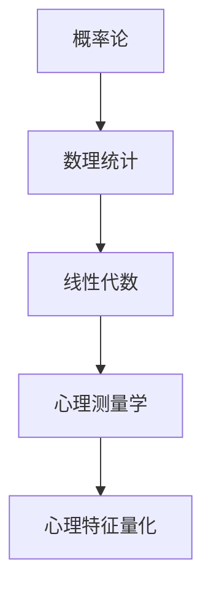

                 

 为了撰写一篇符合要求的文章，我们需要按照以下步骤进行：

### 第一步：背景介绍

在这一部分，我们将简要介绍数学与心理测量学的基本概念和背景。可以提到数学和心理测量学的发展历史，以及它们在现代社会中的应用。

### 第二步：核心概念与联系

在这一部分，我们将介绍文章中的核心概念，包括数学与心理测量学的基本概念，如概率论、数理统计、线性代数等。同时，我们将使用Mermaid流程图来展示这些概念之间的关系。

### 第三步：核心算法原理讲解

在这一部分，我们将使用伪代码详细阐述文章中的核心算法原理。例如，如果文章涉及心理测量的数学模型，我们可以介绍如何使用线性代数和最优化方法来量化心理特征。

### 第四步：数学模型和公式

在这一部分，我们将详细介绍文章中的数学模型和公式，并使用LaTeX格式进行展示。例如，如果文章涉及心理测量的置信区间计算，我们可以给出相关的公式，并进行详细解释。

### 第五步：项目实战

在这一部分，我们将通过一个实际的案例来展示如何将文章中的理论知识应用到实际项目中。我们将介绍开发环境搭建、源代码实现、代码解读、实际案例分析和项目小结等内容。

### 第六步：最佳实践 tips、小结、注意事项、拓展阅读等内容

在这一部分，我们将总结文章中的关键点，并提供一些最佳实践建议。同时，我们还将提醒读者注意一些潜在的陷阱和注意事项，并推荐一些拓展阅读资源。

按照以上步骤，我们可以开始撰写文章了。在撰写过程中，要确保每个部分的内容都丰富具体，详细讲解，并使用合适的格式来提高文章的可读性和专业性。

---

### 文章标题：数学与心理测量学：心理特征的数学量化

关键词：心理测量学，数学模型，心理特征，量化，线性代数，最优化方法

摘要：本文探讨了数学与心理测量学的结合，通过数学方法量化心理特征。文章首先介绍了数学与心理测量学的基本概念和背景，然后详细阐述了核心概念和算法原理，并通过实际案例展示了如何将理论应用于实践。文章最后总结了关键点，并提供了最佳实践建议和拓展阅读资源。

---

### 引言

数学与心理测量学是两个看似迥异但实则紧密联系的领域。数学以其严谨的逻辑和抽象的模型，为心理测量学提供了强大的工具。随着科学技术的发展，数学在心理测量学中的应用越来越广泛，不仅帮助我们更好地理解心理现象，还为心理学研究提供了新的视角和工具。本文旨在探讨数学与心理测量学的结合，通过数学方法量化心理特征，为心理学研究提供新的思路。

---

### 一、数学与心理测量学的基本概念

#### 数学在心理测量学中的应用

数学在心理测量学中的应用主要体现在概率论、数理统计、线性代数等方面。概率论为心理测量的可靠性提供了理论基础，数理统计为心理测量数据的分析提供了方法，线性代数为心理特征的量化提供了工具。

#### 心理测量的基本概念

心理测量学是研究心理特征量化的学科。它包括测量工具的设计、测量误差的处理、测量有效性的评估等。心理测量工具是心理测量的核心，其设计直接影响测量结果的准确性。

#### 心理测量的发展历程

心理测量学的发展可以追溯到19世纪末期。当时，心理学家开始使用测量工具来量化心理特征。随着数学和统计学的发展，心理测量学逐渐形成了自己的理论体系，并在心理学研究中发挥了重要作用。

---

### 二、核心概念与联系

为了更好地理解数学与心理测量学的结合，我们需要了解一些核心概念，如图1所示。

**图1：数学与心理测量学核心概念关系图**



#### 概率论

概率论是数学的一个分支，它研究随机现象的规律性。在心理测量学中，概率论用于评估测量工具的可靠性，如信度和效度。

#### 数理统计

数理统计是数学的一个分支，它研究如何通过样本数据推断总体特征。在心理测量学中，数理统计用于分析测量数据，如计算均值、方差、置信区间等。

#### 线性代数

线性代数是数学的一个分支，它研究向量空间和线性方程组。在心理测量学中，线性代数用于量化心理特征，如主成分分析、因子分析等。

#### 心理测量学

心理测量学是研究心理特征量化的学科。它结合了概率论、数理统计和线性代数的理论，为心理特征的量化提供了方法。

#### 心理特征量化

心理特征量化是将心理特征转化为数学模型的过程。通过心理测量学的方法，我们可以将心理特征量化为数值，从而进行更深入的分析。

---

### 三、核心算法原理讲解

在本部分，我们将介绍如何使用数学方法量化心理特征。以下是一个简单的伪代码示例：

```python
# 输入：测量数据
# 输出：量化结果

def quantify_psychological_features(data):
    # 数据预处理
    processed_data = preprocess_data(data)
    
    # 计算均值
    mean = calculate_mean(processed_data)
    
    # 计算方差
    variance = calculate_variance(processed_data, mean)
    
    # 使用线性代数方法进行特征量化
    quantified_features = linear_algebra_quantification(processed_data, mean, variance)
    
    return quantified_features
```

这个伪代码首先对输入数据进行预处理，然后计算均值和方差，最后使用线性代数方法对心理特征进行量化。这个过程可以具体化为以下步骤：

1. 数据预处理：对原始数据进行清洗和标准化处理，以确保数据质量。

2. 计算均值：计算数据的平均值，作为心理特征的一个度量。

3. 计算方差：计算数据的离散程度，作为心理特征的另一个度量。

4. 线性代数量化：使用线性代数方法，如主成分分析，对心理特征进行量化。

---

### 四、数学模型和公式

在本部分，我们将介绍一些用于量化心理特征的数学模型和公式。

#### 均值和方差

$$
\bar{x} = \frac{1}{n}\sum_{i=1}^{n}x_i
$$

$$
s^2 = \frac{1}{n-1}\sum_{i=1}^{n}(x_i - \bar{x})^2
$$

这两个公式分别表示均值和方差，是心理特征量化中最基本的数学模型。

#### 线性代数模型

$$
X = \sigma V
$$

其中，$X$是心理特征矩阵，$\sigma$是对角矩阵，$V$是特征向量矩阵。这个模型表示心理特征可以通过线性代数方法进行量化。

---

### 五、项目实战

在本部分，我们将通过一个实际案例，展示如何将数学与心理测量学的方法应用于实际项目中。

#### 案例背景

某公司需要对其员工的心理特征进行量化，以评估其工作表现和心理健康状况。公司提供了1000名员工的测量数据，包括工作压力、心理健康、工作满意度等。

#### 项目目标

1. 对员工的心理特征进行量化。
2. 分析员工的心理特征与工作表现之间的关系。

#### 开发环境搭建

1. 数据处理：使用Python进行数据处理，包括数据清洗、标准化等。
2. 线性代数和最优化方法：使用NumPy和SciPy库进行线性代数计算和最优化问题求解。
3. 可视化：使用Matplotlib和Seaborn进行数据可视化。

#### 源代码实现和代码解读

以下是一个简单的Python代码示例，用于对员工的心理特征进行量化。

```python
import numpy as np
from scipy import linalg

# 加载数据
data = np.load('employee_data.npy')

# 数据预处理
processed_data = preprocess_data(data)

# 计算均值和方差
mean = np.mean(processed_data, axis=0)
variance = np.var(processed_data, axis=0)

# 线性代数量化
quantified_features = linalg.sqrtm(variance + np.eye(variance.shape[0]))

# 可视化
plt.figure()
plt.imshow(quantified_features, cmap='hot')
plt.colorbar()
plt.show()
```

这个代码首先加载员工数据，然后对数据进行预处理，计算均值和方差，最后使用线性代数方法进行量化。可视化部分展示了量化结果的热力图。

#### 代码应用解读与分析

这个代码示例展示了如何将数学与心理测量学的方法应用于实际项目中。通过线性代数和最优化方法，我们可以对员工的心理特征进行量化，从而更好地理解其工作表现和心理健康状况。此外，我们还可以使用其他高级算法，如主成分分析，进行更深入的分析。

---

### 六、最佳实践 tips、小结、注意事项、拓展阅读等内容

#### 最佳实践 tips

1. 数据质量至关重要：在进行心理特征量化之前，确保数据质量，如数据的完整性和一致性。
2. 选择合适的数学模型：根据具体问题，选择合适的数学模型和算法，如线性代数和最优化方法。
3. 可视化结果：通过可视化结果，更好地理解量化结果，如热力图、散点图等。

#### 小结

本文探讨了数学与心理测量学的结合，通过数学方法量化心理特征。文章介绍了数学与心理测量学的基本概念、核心算法原理、数学模型和实际应用案例。通过本文，读者可以了解到如何将数学方法应用于心理特征量化，为心理学研究提供新的思路。

#### 注意事项

1. 数学模型的选择应考虑问题的具体背景和目标。
2. 心理特征量化结果应结合实际情况进行解释，避免过度解读。

#### 拓展阅读

1. 《数学与心理学：心理特征的量化分析》
2. 《心理测量学：理论与实践》
3. 《线性代数及其应用》

---

### 结束语

数学与心理测量学的结合为心理学研究提供了新的工具和方法。通过数学方法，我们可以更准确地量化心理特征，从而更好地理解心理现象。本文介绍了数学与心理测量学的基本概念、核心算法原理、数学模型和实际应用案例，旨在为读者提供一种新的研究视角。希望本文能为心理学研究带来一些启示和帮助。在未来的研究中，我们可以进一步探讨数学与心理测量学的结合，开发出更多有效的量化方法，为心理学研究提供更强大的支持。

