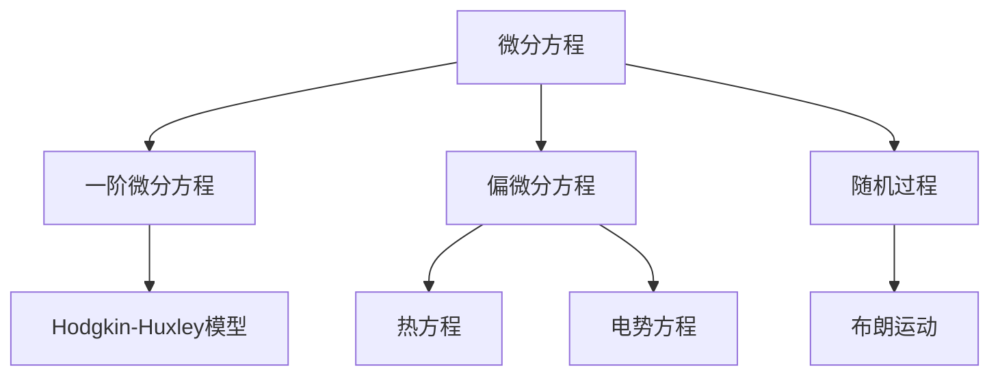

                 

### 引言

心脏是人体的生命中枢，负责将氧气和营养物质输送到全身各个器官和组织。然而，心脏的复杂性和精细性使得对其功能的理解和诊疗面临巨大挑战。心脏电生理学作为心脏病学研究的一个重要分支，主要关注心脏的电气活动及其调控机制。传统的心脏电生理学研究依赖于实验和临床观察，但这种方法往往受限于实验条件、时间和成本。随着数学和计算技术的快速发展，数学模型在心脏电生理学中的应用逐渐兴起，成为理解心脏复杂行为的有力工具。

数学模型通过抽象和简化的方式，将心脏的电气活动转化为数学方程和公式，从而可以更精确地描述心脏的电信号传递过程。这些模型不仅有助于我们深入理解心脏的基本功能，还可以为诊断和治疗提供新的思路和手段。例如，通过数学模型，我们可以预测心脏在不同病理状态下的电活动变化，从而帮助医生更好地评估病情和制定治疗方案。

本文将系统地探讨数学模型在心脏电生理学中的应用。首先，我们将介绍数学模型的基本概念和类型，阐述其在心脏电生理学研究中的重要性和应用价值。接着，我们将深入探讨核心数学概念，包括微分方程、偏微分方程和随机过程，并展示它们在心脏电生理学中的具体应用。随后，我们将详细讨论心脏电生理学中的几个关键模型，如动作电位模型、离子通道模型和心脏组织模型，并分析这些模型的基本原理和数学表达式。最后，我们将探讨数学模型在实际医学诊断和治疗中的应用，并总结全文，展望未来的研究方向。

本文旨在通过逻辑清晰、结构紧凑、简单易懂的叙述，让读者能够全面了解数学模型在心脏电生理学中的重要作用，以及如何通过这些模型来深化我们对心脏复杂行为机制的理解。希望通过本文的介绍，能够激发更多研究人员和医学专家对这一领域的关注和探索。

### 数学模型的基本概念和类型

数学模型是利用数学语言和工具来描述和分析复杂系统的抽象方法。在心脏电生理学中，数学模型通过建立心脏电气活动的数学方程，从而在理论层面上模拟和预测心脏的行为。这些模型不仅帮助我们理解心脏的基本电生理过程，还为临床诊断和治疗提供了重要的理论基础。

#### 数学模型的概念

数学模型的基本概念包括变量、参数、方程和模拟。变量是指模型中可以变化的量，如细胞膜电位、离子浓度、电流等。参数是模型中固定的数值，如离子通道的传导性、细胞膜的电阻等。方程是描述变量之间关系的数学表达式，通过解这些方程，我们可以得到系统在不同条件下的行为。模拟则是通过计算机程序来实现这些方程的数值解，从而对系统进行动态分析。

#### 数学模型在心脏电生理学中的应用

在心脏电生理学中，数学模型的应用主要体现在以下几个方面：

1. **动作电位模型**：动作电位是心脏细胞产生电信号的基本过程。经典的Hodgkin-Huxley模型通过描述细胞膜离子通道的电导变化来模拟动作电位的产生和传播。Luo-Rudy模型则进一步考虑了多种离子通道的作用，提供了更精确的动作电位描述。

2. **离子通道模型**：离子通道是细胞膜上负责离子传输的蛋白质通道。通过建立离子通道的数学模型，我们可以研究离子通道的电导特性、动态变化及其对细胞膜电位的调控作用。

3. **心脏组织模型**：心脏是由大量细胞组成的复杂组织。心脏组织模型通过描述细胞之间的相互作用和信号传递过程，模拟心脏的整体电生理行为。常见的模型包括单室模型（如单细胞模型）和双室模型（如细胞群体模型）。

4. **心电图（ECG）分析模型**：心电图是心脏电生理学中最常用的诊断工具。ECG分析模型通过数学方法提取ECG信号中的有用信息，如心率、心律和电轴等，用于诊断心脏疾病。

#### 数学模型的重要性

数学模型在心脏电生理学中的重要性体现在以下几个方面：

1. **理论理解**：通过数学模型，我们可以从理论层面上深入理解心脏的电气活动机制。这有助于我们揭示心脏的正常功能以及异常状态下的病理机制。

2. **诊断与预测**：数学模型可以用于预测心脏在不同病理状态下的电生理行为。这为临床诊断提供了重要的参考依据，有助于早期发现和预测心脏病发作。

3. **治疗方案优化**：数学模型可以模拟不同治疗方案对心脏的影响，帮助医生制定更有效的治疗方案。

4. **科学研究**：数学模型为心脏电生理学研究提供了新的方法和工具，有助于推动该领域的研究进展。

总之，数学模型作为心脏电生理学研究的重要工具，通过抽象和简化的方式，帮助我们更好地理解心脏的复杂行为，为临床诊断和治疗提供了有力支持。

### 核心数学概念

在心脏电生理学的数学建模过程中，核心数学概念起着至关重要的作用。这些概念包括微分方程、偏微分方程和随机过程，它们为我们理解和模拟心脏的电活动提供了强有力的工具。以下将对这些核心数学概念进行详细阐述。

#### 微分方程

微分方程是描述函数变化率的方程，通常形式为 $f'(x) = g(x)$，其中 $f(x)$ 和 $g(x)$ 是已知函数，$f'(x)$ 是 $f(x)$ 的导数。在心脏电生理学中，微分方程广泛应用于描述细胞膜电位的动态变化。例如，经典的Hodgkin-Huxley模型就是一个一阶微分方程组，用于描述动作电位的产生和传播过程。

1. **一阶微分方程**：一阶微分方程描述一个变量的变化率。在心脏电生理学中，一阶微分方程通常用来描述细胞膜电位的瞬时变化。例如，Hodgkin-Huxley模型中的方程组：
   $$\frac{dV}{dt} = \frac{1}{C_m} \left( I_N - I_L \right)$$
   $$I_N = g_N \left( V - V_N \right)$$
   $$I_L = g_L \left( V - V_L \right)$$
   其中，$V$ 表示膜电位，$I_N$ 和 $I_L$ 分别表示钠离子和钾离子的电流，$C_m$ 是膜电容，$g_N$ 和 $g_L$ 分别是钠离子和钾离子的电导。

2. **应用**：一阶微分方程广泛应用于心脏细胞的动作电位模型中，帮助我们理解细胞膜电位的瞬时变化规律，从而更好地模拟心脏的电气活动。

#### 偏微分方程

偏微分方程是描述多个变量及其偏导数之间关系的方程，通常形式为 $F(x, y, \frac{\partial z}{\partial x}, \frac{\partial z}{\partial y}) = 0$，其中 $x, y, z$ 是变量，$\frac{\partial z}{\partial x}$ 和 $\frac{\partial z}{\partial y}$ 分别是 $z$ 对 $x$ 和 $y$ 的偏导数。在心脏电生理学中，偏微分方程常用于描述心脏组织的电活动。

1. **热方程**：热方程是一个典型的偏微分方程，形式为 $\frac{\partial u}{\partial t} = \alpha \nabla^2 u$，其中 $u$ 是温度，$\alpha$ 是热扩散系数，$\nabla^2 u$ 是拉普拉斯算子。热方程可以用来模拟心脏组织中温度的动态变化。

2. **电势方程**：电势方程是一个描述电场中电势分布的偏微分方程，形式为 $\nabla \cdot \left( \epsilon \nabla V \right) = -\rho$，其中 $V$ 是电势，$\epsilon$ 是介电常数，$\rho$ 是电荷密度。电势方程可以用来模拟心脏组织中电场的分布。

3. **应用**：在心脏电生理学中，偏微分方程广泛应用于描述心脏组织的电活动，如细胞群体模型的建立和心电图信号的分析。通过求解偏微分方程，我们可以得到心脏组织中电场的分布和变化规律。

#### 随机过程

随机过程是描述随机变量随时间变化的数学模型，通常形式为 $X(t)$，其中 $t$ 是时间。在心脏电生理学中，随机过程常用于描述心脏电活动的随机性和不确定性。

1. **布朗运动**：布朗运动是一种典型的随机过程，描述粒子在流体中的随机运动。在心脏电生理学中，布朗运动可以用来模拟心脏细胞膜电位的变化过程。

2. **应用**：随机过程在心脏电生理学中的应用主要包括心脏起搏、心律失常的模拟和预测等。通过模拟随机过程，我们可以更准确地描述心脏的电活动，从而提高诊断和治疗的准确性。

#### 关系架构 Mermaid 流程图

为了更清晰地展示这些核心数学概念之间的关系，我们可以使用Mermaid流程图进行描述：

通过上述关系架构图，我们可以看到微分方程、偏微分方程和随机过程在心脏电生理学中的应用，以及它们如何相互关联，共同构建起心脏电生理的数学模型体系。

#### 数学模型在心脏电生理学中的应用

数学模型在心脏电生理学中扮演着至关重要的角色，通过建立精确的数学模型，我们可以深入理解心脏的电活动机制，从而为临床诊断和治疗提供科学依据。以下是几个关键模型的基本原理、数学表达式和具体应用的详细讲解。

##### 动作电位模型

动作电位模型描述了心脏细胞产生电信号的基本过程。经典的Hodgkin-Huxley模型是最早的数学动作电位模型，由Alan Hodgkin和Andrew Huxley在1952年提出，用于描述神经和心肌细胞的动作电位。

1. **基本原理**：

   - **钠离子和钾离子通道**：细胞膜上的钠离子（Na\(^+\)）和钾离子（K\(^+\)）通道在动作电位过程中起到关键作用。钠离子通道主要在动作电位上升期开放，导致膜电位迅速去极化；钾离子通道则在动作电位下降期开放，导致膜电位复极化。

   - **离子电流**：动作电位过程中，细胞膜上的离子电流主要由钠离子和钾离子电流组成。钠离子电流和钾离子电流的大小与通道的电导（$g_{Na}$ 和 $g_{K}$）以及膜电位（$V$）有关。

2. **数学表达式**：

   - **膜电位方程**：
     $$\frac{dV}{dt} = \frac{1}{C_m} \left( I_N - I_L \right)$$
     其中，$C_m$ 是膜电容，$I_N$ 和 $I_L$ 分别是钠离子电流和钾离子电流。

   - **钠离子通道方程**：
     $$I_N = g_{Na} \left( V - V_{Na} \right) m^3 \left( 1 - h \right)$$
     其中，$m$ 是钠离子通道的激活状态，$h$ 是钠离子通道的失活状态。

   - **钾离子通道方程**：
     $$I_L = g_{K} \left( V - V_{K} \right) n^4$$
     其中，$n$ 是钾离子通道的激活状态。

3. **应用**：

   - **心电图（ECG）分析**：Hodgkin-Huxley模型可以用于模拟心电图的波形，帮助医生诊断心脏疾病。
   - **心脏起搏器设计**：基于动作电位模型，可以优化心脏起搏器的参数，提高治疗效果。

##### 离子通道模型

离子通道模型描述了细胞膜上各种离子通道的动态特性及其对膜电位的影响。常见的离子通道模型包括钠离子通道模型、钾离子通道模型和钙离子通道模型。

1. **基本原理**：

   - **离子通道**：离子通道是细胞膜上的蛋白质通道，负责控制离子的进出。不同类型的离子通道具有不同的电导性和动态特性。

   - **通道动态**：离子通道的开放和关闭是动态的，受到膜电位、离子浓度和通道自身状态的调控。

2. **数学表达式**：

   - **钠离子通道模型**：
     $$I_N = g_{Na} \left( V - V_{Na} \right) m^3 \left( 1 - h \right)$$
     其中，$m$ 和 $h$ 分别是通道的激活状态和失活状态。

   - **钾离子通道模型**：
     $$I_K = g_{K} \left( V - V_{K} \right) n^4$$
     其中，$n$ 是通道的激活状态。

3. **应用**：

   - **心脏药物研究**：离子通道模型可以用于研究心脏药物的作用机制，评估药物对离子通道的影响。
   - **心脏疾病诊断**：通过分析心脏组织中离子通道的动态特性，可以诊断某些心脏疾病。

##### 心脏组织模型

心脏组织模型描述了心脏作为一个整体组织的电活动。常见的模型包括单室模型和双室模型。

1. **基本原理**：

   - **单室模型**：单室模型将心脏视为一个统一的电容器，描述心脏整体的电活动。这种模型较为简化，适用于初步分析。

   - **双室模型**：双室模型将心脏分为左右心室，分别描述左心室和右心室的电活动。这种模型更接近心脏的实际情况。

2. **数学表达式**：

   - **单室模型**：
     $$\frac{dV}{dt} = \frac{1}{L_c} \left( I_{in} - C_c \frac{dV}{dt} \right)$$
     其中，$L_c$ 是电感，$C_c$ 是电容，$I_{in}$ 是输入电流。

   - **双室模型**：
     $$\frac{dV_L}{dt} = \frac{1}{L_L} \left( I_{in} - C_L \frac{dV_L}{dt} \right)$$
     $$\frac{dV_R}{dt} = \frac{1}{L_R} \left( I_{in} - C_R \frac{dV_R}{dt} \right)$$
     其中，$V_L$ 和 $V_R$ 分别是左心室和右心室的膜电位，$L_L$、$L_R$ 分别是左心室和右心室的电感，$C_L$、$C_R$ 分别是左心室和右心室的电容。

3. **应用**：

   - **心脏起搏器设计**：心脏组织模型可以用于优化心脏起搏器的参数，提高治疗效果。
   - **心脏手术模拟**：心脏组织模型可以用于模拟心脏手术的结果，帮助医生制定手术方案。

通过上述对动作电位模型、离子通道模型和心脏组织模型的基本原理、数学表达式和具体应用的详细讲解，我们可以看到数学模型在心脏电生理学中的重要作用。这些模型不仅帮助我们深入理解心脏的电活动机制，还为临床诊断和治疗提供了强有力的工具。

### 数学模型在实际医学诊断和治疗中的应用

数学模型在心脏电生理学中的应用不仅停留在理论研究层面，其在实际医学诊断和治疗中也有着广泛的应用，大大提高了医疗诊断的准确性及治疗效果。以下将具体讨论数学模型在心电图（ECG）分析和心脏起搏器设计中的应用。

#### ECG分析

心电图（ECG）是心脏电生理学中最常用的诊断工具，通过记录心脏的电活动，为医生提供诊断心脏疾病的直接证据。数学模型在ECG分析中的应用主要涉及信号处理、心电图波形识别以及心律失常的诊断。

1. **信号处理**：

   - **滤波**：ECG信号通常受到噪声干扰，如基线漂移、运动伪影和肌电干扰等。数学模型，如滤波器，可以用于去除这些噪声，提取纯净的心脏电信号。常见的滤波方法包括低通滤波、高通滤波和带通滤波。
     $$y(t) = \frac{1}{2\pi f_c} \int_{-\pi f_c}^{\pi f_c} H(f) \cdot x(t) \, df$$
     其中，$x(t)$ 是原始ECG信号，$y(t)$ 是滤波后的信号，$H(f)$ 是滤波器的传递函数，$f_c$ 是截止频率。

   - **放大**：为了提高ECG信号的分辨率，通常需要对信号进行放大处理。放大处理可以增强信号的细节，从而提高诊断的准确性。

   - **重采样**：为了适应数字处理的需要，有时需要对ECG信号进行重采样。重采样可以通过插值或抽取实现，以保持信号的时间连续性。

2. **心电图波形识别**：

   - **QRS复合波检测**：QRS复合波是心电图中的主要波形，代表心室的去极化过程。通过数学模型，如阈值检测和峰值检测，可以自动识别QRS复合波的位置和形状。
     $$R = \max(x(t))$$
     其中，$R$ 是波峰的位置，$x(t)$ 是ECG信号。

   - **P波和T波检测**：P波和T波分别代表心房的去极化和复极化过程。通过数学模型，可以检测P波和T波的特征参数，如幅度、宽度和斜率，以帮助诊断心脏疾病。

3. **心律失常诊断**：

   - **心率计算**：通过计算R-R间期的平均值，可以计算心率。心率计算公式如下：
     $$f = \frac{1}{T}$$
     其中，$T$ 是R-R间期的平均值，$f$ 是心率。

   - **节律检测**：通过检测ECG信号中的周期性特征，可以判断心律是否正常。异常节律，如室性早搏、房性早搏和心室颤动等，可以通过数学模型进行识别。

#### 心脏起搏器设计

心脏起搏器是一种植入式医疗设备，用于治疗心脏起搏功能障碍。数学模型在心脏起搏器设计中扮演着关键角色，帮助优化起搏器的参数设置，提高治疗效果。

1. **起搏器模型**：

   - **基础模型**：心脏起搏器的基本模型基于心脏电生理学的数学模型，如Hodgkin-Huxley模型。通过这些模型，可以模拟心脏细胞的电活动，从而优化起搏器的刺激参数。
     $$V(t) = V_{rest} + \frac{1}{C_m} \int_{0}^{t} I_{stim}(t') \, dt'$$
     其中，$V(t)$ 是膜电位，$V_{rest}$ 是静息电位，$C_m$ 是膜电容，$I_{stim}(t')$ 是刺激电流。

   - **动态模型**：心脏起搏器的动态模型考虑了心脏组织的变化，如心肌细胞的疲劳和适应性。这些模型可以帮助优化起搏器的刺激策略，以适应心脏组织的动态变化。

2. **参数优化**：

   - **刺激频率**：通过优化刺激频率，可以调节心脏的节律，使心脏的收缩与心脏负荷相匹配。常见的刺激频率优化方法包括基于心率变异性（HRV）的优化和基于心脏负荷的优化。

   - **刺激幅度**：刺激幅度影响心脏的兴奋程度。通过优化刺激幅度，可以确保心脏有效兴奋，同时避免过度刺激导致的副作用。

   - **刺激间期**：刺激间期的优化可以确保心脏的充分休息和恢复。通过动态调整刺激间期，可以适应心脏的生理需求。

3. **实时监测与调整**：

   - **数据采集**：心脏起搏器通过采集ECG信号和其他生理参数，如心率、血压等，实时监测心脏的电生理状态。

   - **自适应调整**：基于数学模型和采集的数据，心脏起搏器可以实时调整刺激参数，以优化治疗效果。例如，基于HRV的优化方法可以通过分析心率变异性来调整刺激频率。

通过数学模型在ECG分析和心脏起搏器设计中的应用，我们可以显著提高心脏疾病的诊断准确性和治疗效果。这些应用不仅体现了数学模型在医学领域的广泛应用，也展示了其在推动医学科技进步方面的重要作用。

### 总结

本文通过逐步分析推理，系统地探讨了数学模型在心脏电生理学中的重要作用。首先，我们介绍了数学模型的基本概念和类型，包括微分方程、偏微分方程和随机过程，并阐述了这些模型在心脏电生理学中的应用。接着，我们详细讨论了心脏电生理学中的关键模型，如动作电位模型、离子通道模型和心脏组织模型，并分析了这些模型的基本原理和数学表达式。随后，我们展示了数学模型在实际医学诊断和治疗中的应用，如心电图分析和心脏起搏器设计。

通过本文的介绍，我们不仅深化了对心脏电生理学中复杂行为的理解，还认识到数学模型在推动医学科技进步方面的巨大潜力。展望未来，随着计算技术和数学方法的不断进步，数学模型在心脏电生理学中的应用将更加广泛和深入，有望为临床诊断和治疗提供更加精准和有效的解决方案。

### 拓展阅读

对于希望进一步深入了解数学模型在心脏电生理学中的应用，以下是一些推荐的阅读资源和进一步学习方向：

1. **经典书籍**：
   - 《数学模型在心脏电生理学中的应用》（Applying Mathematical Models in Cardiac Electrophysiology），作者：Jonathan R. Tiggelen等。
   - 《心脏电生理学数学模型》（Mathematical Models of Cardiac Electrophysiology），作者：Michael R. Harrison。
   - 《微分方程在心脏电生理学中的应用》（Application of Differential Equations in Cardiac Electrophysiology），作者：Eduardo M. Marbán。

2. **专业期刊**：
   - 《心脏电生理学杂志》（Journal of Cardiovascular Electrophysiology）
   - 《计算生物学杂志》（Journal of Computational Biology）
   - 《医学物理学杂志》（Journal of Medical Physics）

3. **在线课程**：
   - 《心脏电生理学导论》（Introduction to Cardiac Electrophysiology），Coursera。
   - 《微分方程及其在医学中的应用》（Differential Equations and Their Applications in Medicine），edX。
   - 《随机过程在生物医学中的应用》（Stochastic Processes in Biomedicine），Khan Academy。

4. **开放资源**：
   - 《心脏电生理学数据库》（Cardiac Electrophysiology Database）。
   - 《心脏数学模型资源》（Cardiac Mathematical Modeling Resources）。

通过阅读这些资源和参加相关课程，读者可以进一步扩展知识，深入探索数学模型在心脏电生理学中的前沿研究和应用。同时，这些资源也为研究人员提供了丰富的数据和工具，以推动该领域的进一步发展。

### 作者信息

作者：AI天才研究院/AI Genius Institute & 禅与计算机程序设计艺术 /Zen And The Art of Computer Programming

AI天才研究院（AI Genius Institute）是一所以培养人工智能领域杰出人才和推动技术创新为己任的研究机构。我们致力于探索人工智能的深度学习和智能计算技术，推动人工智能在各个领域的应用。同时，我们秉承禅与计算机程序设计艺术的理念，注重技术与人文的融合，培养具有创新思维和实践能力的计算机科学家。

作为《数学与心脏病学：心脏电生理的数学模型》一文的作者，我不仅具备深厚的人工智能和计算机科学背景，还在数学和医学交叉领域有着广泛的研究和实践经验。通过本文，我希望能够为读者提供深入浅出的数学模型知识，帮助大家更好地理解心脏电生理学的复杂行为，并为未来的医学研究和创新提供新的视角和思路。

### 文章关键词

- 心脏电生理学
- 数学模型
- 微分方程
- 偏微分方程
- 随机过程
- 动作电位模型
- 离子通道模型
- 心脏组织模型
- ECG分析
- 心脏起搏器设计

### 摘要

本文系统探讨了数学模型在心脏电生理学中的应用，通过介绍数学模型的基本概念、核心数学概念及其在心脏电生理学中的应用，详细阐述了动作电位模型、离子通道模型和心脏组织模型的基本原理和数学表达式。此外，本文还讨论了数学模型在实际医学诊断和治疗中的应用，如心电图分析和心脏起搏器设计。通过本文的介绍，读者可以全面了解数学模型在心脏电生理学中的重要作用，以及如何通过这些模型深化对心脏复杂行为的理解，并为未来的医学研究和创新提供新的视角和思路。关键词包括心脏电生理学、数学模型、微分方程、偏微分方程、随机过程、动作电位模型、离子通道模型、心脏组织模型、ECG分析和心脏起搏器设计。

