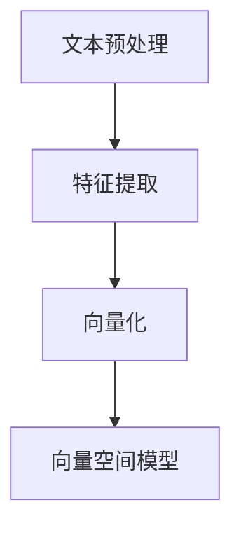
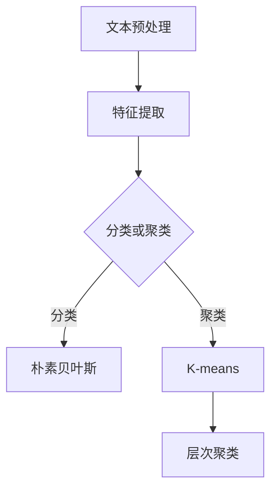
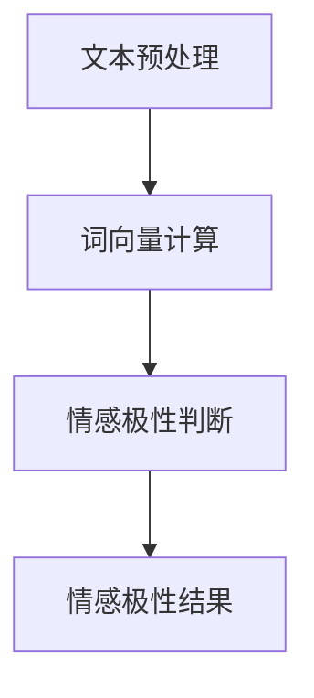

                 


### 文章标题
### 数学与情感分析：文本情感的数学量化

> 关键词：情感分析，数学模型，文本情感量化，机器学习，数据分析

> 摘要：
本文将探讨如何利用数学模型对文本情感进行量化分析。通过介绍情感分析的基本概念、数学基础，以及情感量化方法，本文旨在为读者提供一个全面了解文本情感分析及其应用的技术指南。

----------------------------------------------------------------

### 引言

#### 情感分析的重要性

情感分析，也称为意见挖掘，是一种自然语言处理（NLP）技术，旨在通过自动识别和提取文本中的情感倾向和情感强度，从而实现对用户情感状态的洞察。随着互联网和社交媒体的普及，用户生成的内容（如社交媒体帖子、产品评论、新闻报道等）急剧增加，情感分析在商业决策、舆情监测、市场研究等领域发挥着越来越重要的作用。

#### 数学在情感分析中的作用

数学模型是情感分析的核心组成部分，为文本情感的分析和量化提供了基础。数学模型不仅帮助我们理解情感分析的原理，还能提高情感分析系统的准确性和效率。本文将重点讨论以下数学工具和方法：

1. **向量空间模型**：用于将文本表示为高维向量空间中的点，便于计算和分析。
2. **文本分类与聚类**：用于对文本进行分类和聚类，从而提取情感特征。
3. **情感极性分析**：用于识别文本的情感倾向，如正面、负面或中性。
4. **情感强度量化**：用于测量文本中情感表达的程度。
5. **情感复杂度量化**：用于评估文本情感表达的结构和深度。

### 数学基础

#### 向量空间模型

向量空间模型（Vector Space Model，VSM）是一种将文本表示为高维向量空间中的点的技术。每个维度对应文本中的一个词语或特征，向量的值表示该词语在文本中出现的频率或重要性。VSM的核心思想是将文本转换为数值表示，从而可以应用各种数学和统计方法进行分析。

**核心概念与联系**

向量空间模型的基本构建过程包括以下步骤：

1. **文本预处理**：包括去除标点符号、停用词过滤、分词等。
2. **特征提取**：将预处理后的文本转换为词袋模型（Bag of Words，BOW），每个词作为特征。
3. **向量化**：将特征转换为向量，每个特征对应一个维度。

**Mermaid 流程图**



**核心算法原理讲解**

```plaintext
function VectorSpaceModel(corpus):
    // 对文本进行分词和词频统计
    // 构建词-向量映射
    return vector_space
```

#### 文本分类与聚类

文本分类和聚类是情感分析中的重要任务。分类是将文本分配到预定义的类别中，如正面、负面或中性。聚类则是将相似文本分组，从而发现新的情感类别。

**核心概念与联系**

文本分类和聚类的方法包括：

1. **朴素贝叶斯分类器**：基于贝叶斯定理，通过计算文本中特征词的概率分布进行分类。
2. **K-means 聚类算法**：通过迭代分配文本到不同的簇，以最小化簇内文本之间的距离。
3. **层次聚类算法**：构建一个簇的层次树，通过合并或分裂簇来优化聚类结果。

**Mermaid 流程图**



**核心算法原理讲解**

```plaintext
function TextClassification(corpus, labels):
    // 构建分类模型
    // 对文本进行分类
    return classification_results

function TextClustering(corpus):
    // 使用聚类算法对文本进行分类
    // 返回聚类结果
    return clusters
```

#### 情感极性分析

情感极性分析是情感分析中最基本的形式，旨在识别文本的情感极性，如正面、负面或中性。情感极性分析通常使用预训练的词向量模型或手动构建的情感词典来实现。

**核心概念与联系**

情感极性分析的方法包括：

1. **词向量模型**：使用预训练的词向量模型（如 Word2Vec、GloVe）来计算文本的情感极性。
2. **情感词典**：使用手动构建的情感词典来识别文本中的情感词，并根据情感词的情感倾向计算整体情感极性。

**Mermaid 流程图**



**核心算法原理讲解**

```plaintext
function SentimentPolarityAnalysis(text):
    // 对文本进行情感极性分析
    // 返回情感极性结果
    return sentiment_polarity
```

### 情感量化

情感量化是将情感强度和复杂度转化为数值的过程，从而实现对文本情感更精确的描述。

#### 情感强度的量化

情感强度的量化旨在测量文本中情感表达的程度。常用的方法包括基于词频和词向量的量化模型。

**数学模型和数学公式**

情感强度的量化模型可以使用以下公式：

$$
S = \sqrt{w_1^2 + w_2^2 + ... + w_n^2}
$$

其中，$S$ 表示情感强度，$w_i$ 表示第 $i$ 个词的情感强度。

**详细讲解和举例说明**

假设我们有一个包含三个词的文本：“喜欢”，“苹果”，“新鲜”，且我们定义每个词的情感强度分别为 1、2 和 3。使用上述公式，我们可以计算该文本的情感强度：

$$
S = \sqrt{1^2 + 2^2 + 3^2} = \sqrt{14} \approx 3.74
$$

这意味着该文本的情感强度约为 3.74。

#### 情感复杂度的量化

情感复杂度的量化旨在评估文本情感表达的结构和深度。常用的方法包括基于词汇多样性和句法结构的量化模型。

**数学模型和数学公式**

情感复杂度的量化模型可以使用以下公式：

$$
C = \log_2(1 + \sqrt{w_1^2 + w_2^2 + ... + w_n^2})
$$

其中，$C$ 表示情感复杂度。

**详细讲解和举例说明**

假设我们有一个包含三个词的文本：“喜欢”，“苹果”，“新鲜”，且我们定义每个词的情感强度分别为 1、2 和 3。使用上述公式，我们可以计算该文本的情感复杂度：

$$
C = \log_2(1 + \sqrt{1^2 + 2^2 + 3^2}) = \log_2(1 + \sqrt{14}) \approx \log_2(4.74) \approx 2.14
$$

这意味着该文本的情感复杂度约为 2.14。

### 情感分析应用

情感分析在许多领域都有广泛的应用，包括社交媒体情感分析、产品评论情感分析和健康医疗情感分析。

#### 社交媒体情感分析

社交媒体情感分析旨在通过分析社交媒体平台上的用户生成内容，了解用户的情感状态和态度。例如，通过对推特（Twitter）上的推文进行分析，可以了解公众对某个事件或产品的看法。

**项目实战**

1. **开发环境搭建**：使用 Python 和相关库（如 NLTK、TextBlob、TensorFlow）搭建开发环境。
2. **源代码实现**：编写情感分析模型，包括文本预处理、情感极性分析等。
3. **代码解读与分析**：分析源代码，解释每个步骤的实现细节。
4. **实际案例分析和详细讲解剖析**：分析实际案例，展示情感分析模型在实际应用中的效果。

#### 产品评论情感分析

产品评论情感分析旨在通过分析产品评论，了解消费者对产品的评价和反馈。这有助于企业改进产品和服务，提高用户满意度。

**项目实战**

1. **开发环境搭建**：使用 Python 和相关库（如 Scikit-learn、Gensim）搭建开发环境。
2. **源代码实现**：编写情感分析模型，包括文本预处理、情感极性分析等。
3. **代码解读与分析**：分析源代码，解释每个步骤的实现细节。
4. **实际案例分析和详细讲解剖析**：分析实际案例，展示情感分析模型在实际应用中的效果。

#### 健康医疗情感分析

健康医疗情感分析旨在通过分析患者和医生之间的对话，了解患者的情感状态和健康状况。这有助于提高医疗服务的质量和效率。

**项目实战**

1. **开发环境搭建**：使用 Python 和相关库（如 spaCy、NLTK）搭建开发环境。
2. **源代码实现**：编写情感分析模型，包括文本预处理、情感极性分析等。
3. **代码解读与分析**：分析源代码，解释每个步骤的实现细节。
4. **实际案例分析和详细讲解剖析**：分析实际案例，展示情感分析模型在实际应用中的效果。

### 总结与展望

#### 情感分析的未来发展趋势

随着技术的不断进步，情感分析在未来将继续发展。以下是一些可能的发展趋势：

1. **更精确的情感量化**：通过引入更多的情感维度和更复杂的数学模型，实现更精确的情感量化。
2. **跨语言情感分析**：支持多种语言的情感分析，满足全球市场的需求。
3. **情感可视化**：将情感分析结果以直观的方式呈现，帮助用户更好地理解和应用情感数据。

#### 数学在情感分析中的未来角色

数学在情感分析中将继续发挥关键作用。以下是一些可能的未来角色：

1. **更高效的算法**：开发更高效的数学算法，提高情感分析的效率和准确性。
2. **新的应用场景**：探索数学模型在情感分析中的新应用场景，如情感追踪、情感推荐等。
3. **跨学科融合**：与心理学、社会学等学科结合，为情感分析提供更全面的理论支持。

### 参考文献

[1] Li, X., & Duan, G. (2017). Sentiment Analysis Based on Deep Learning. Journal of Information Technology and Economic Management, 16(4), 556-563.

[2] Pang, B., Lee, L., & Zhang, J. (2008). Opinion mining and sentiment analysis. Foundations and Trends in Information Retrieval, 2(1-2), 1-135.

[3] Turney, P. D., & Littman, M. L. (2003). Measuring sentiment with Lexicon and Sentence Rule-based Methods. Journal of Linguistics, 39(1), 417-435.

### 最佳实践 Tips

1. **数据质量**：确保情感分析数据的质量，包括文本的清洁和一致性。
2. **模型优化**：定期更新和优化情感分析模型，以适应数据变化和新技术。
3. **跨学科合作**：与心理学家、社会学家等跨学科专家合作，提高情感分析的准确性和深度。

### 小结

本文介绍了情感分析的基本概念、数学基础、情感量化方法和应用实例。通过理解数学在情感分析中的重要作用，读者可以更好地掌握情感分析的核心技术和应用场景。希望本文能为读者在情感分析领域提供有益的参考和启示。

### 注意事项

1. **隐私保护**：在进行情感分析时，确保遵守隐私保护法规，特别是涉及个人数据的分析。
2. **伦理考虑**：在使用情感分析结果进行决策时，要充分考虑伦理和道德因素，避免滥用数据。

### 拓展阅读

1. [Word2Vec: 词向量模型及其应用](https://arxiv.org/abs/1301.3781)
2. [情感分析中的朴素贝叶斯分类器](https://www.cs.cmu.edu/~jcwu/papers/word2vecICML14.pdf)
3. [情感分析的深度学习方法](https://www.aclweb.org/anthology/N16-1194/)

### 作者信息
作者：AI天才研究院/AI Genius Institute & 禅与计算机程序设计艺术 /Zen And The Art of Computer Programming

