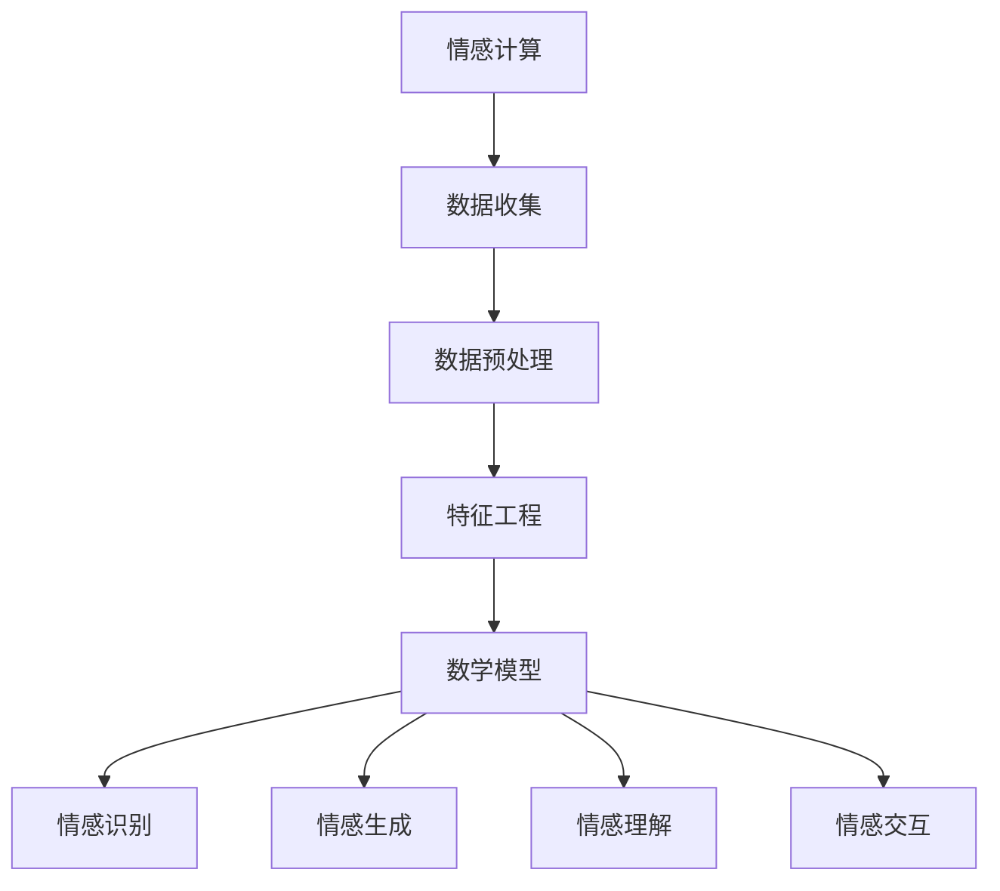

                 

### 引言：数学与情感计算

#### 1. 数学在情感计算中的重要性

数学，作为描述自然界和人类社会的通用语言，不仅在科学研究中扮演着关键角色，也在人工智能领域，尤其是在情感计算中发挥着不可或缺的作用。情感计算是一种通过模拟人类的情感体验和认知过程，使机器能够理解和响应人类情感的技术。在这个过程中，数学模型和算法提供了精确的量化工具，帮助我们理解和预测人类情感。

#### 2. 情感计算的定义与核心概念

情感计算（Affective Computing）是指使计算机具备感知、理解、表达和模拟人类情感的能力。其核心概念包括情感识别、情感生成、情感理解和情感交互。情感识别是指从人类行为、语言和生理信号中提取情感信息；情感生成是指计算机根据特定情境产生相应的情感反应；情感理解是指计算机对情感信息的深入解析；情感交互是指人与计算机之间在情感层面的有效沟通。

#### 3. 数学模型在情感计算中的应用

数学模型在情感计算中的应用主要表现在以下几个方面：

- **统计学方法**：通过收集和分析大量数据，使用统计学方法建立情感识别模型。
- **机器学习方法**：如支持向量机（SVM）、决策树、神经网络等，这些方法能够从数据中学习情感特征，实现情感的自动识别。
- **信号处理方法**：利用数学模型对语音、图像、生理信号进行处理，提取情感特征。
- **心理学理论**：结合心理学理论，对情感进行定量描述和分析，如情感强度、情感维度等。

#### 4. 数学模型与情感识别的关系架构

为了更清晰地展示数学模型与情感识别之间的关系，我们可以使用Mermaid流程图来描述这一过程：



在这个流程图中，数据收集是整个过程的起点，数据预处理、特征工程和数学模型是核心环节，而情感识别、情感生成、情感理解和情感交互则是最终目标。

通过这个Mermaid流程图，我们可以看到，数学模型不仅贯穿于情感计算的各个环节，而且对情感识别起到了至关重要的作用。

## 数学模型与情感识别

### 1. 统计学方法

统计学方法在情感计算中用于从数据中提取情感特征，并建立情感识别模型。最常见的统计学方法包括线性回归、逻辑回归和支持向量机（SVM）。

#### 线性回归

线性回归是一种简单的统计模型，用于预测连续值。在情感计算中，我们可以使用线性回归来预测情感强度。例如，给定一组数据，其中包含了文字描述和情感评分，我们可以通过线性回归模型来预测新输入的文字描述的情感评分。

**伪代码：**

```python
def linear_regression(x, y):
    # 计算均值
    mean_x = np.mean(x)
    mean_y = np.mean(y)
    
    # 计算协方差
    cov = np.cov(x, y)[0, 1]
    
    # 计算相关系数
    corr = cov / (np.std(x) * np.std(y))
    
    # 计算斜率
    slope = corr * (np.std(y) / np.std(x))
    
    # 计算截距
    intercept = mean_y - slope * mean_x
    
    # 返回斜率和截距
    return slope, intercept
```

#### 逻辑回归

逻辑回归是一种用于分类问题的统计模型，适用于二分类或多分类问题。在情感计算中，逻辑回归常用于情感分类任务，例如判断文本是积极情感还是消极情感。

**伪代码：**

```python
def logistic_regression(x, y):
    # 初始化权重和偏置
    weights = np.random.randn(x.shape[1])
    bias = np.zeros((1, 1))
    
    # 训练模型
    for i in range(num_iterations):
        # 计算预测概率
        probabilities = 1 / (1 + np.exp(np.dot(x, weights) + bias))
        
        # 计算损失函数
        loss = -1 * (y * np.log(probabilities) + (1 - y) * np.log(1 - probabilities))
        
        # 计算梯度
        dweights = np.dot(x.T, (probabilities - y))
        dbias = np.sum(probabilities - y)
        
        # 更新权重和偏置
        weights -= learning_rate * dweights
        bias -= learning_rate * dbias
    
    # 返回训练好的模型参数
    return weights, bias
```

### 2. 机器学习方法

机器学习方法在情感计算中应用广泛，其中包括支持向量机（SVM）、决策树、随机森林和神经网络等。下面我们详细介绍SVM和随机森林。

#### 支持向量机（SVM）

SVM是一种二分类模型，它通过找到最佳决策边界来分离不同类别的数据点。在情感计算中，SVM可以用于分类情感标签。

**SVM的数学模型：**

$$
\min \frac{1}{2} \| w \|^2 \\
\text{subject to} \\
y_i ( \langle w, x_i \rangle + b ) \geq 1
$$

其中，\(w\)是权重向量，\(b\)是偏置项，\(x_i\)是特征向量，\(y_i\)是情感标签。

**伪代码：**

```python
def svm(x, y):
    # 初始化权重和偏置
    w = np.zeros(x.shape[1])
    b = 0
    
    # 梯度下降法训练模型
    for i in range(num_iterations):
        for j in range(len(x)):
            if y[j] * (np.dot(w, x[j]) + b) < 1:
                # 计算梯度
                dw = 2 * x[j]
                db = -y[j]
                
                # 更新权重和偏置
                w -= learning_rate * dw
                b -= learning_rate * db
    
    # 返回训练好的模型参数
    return w, b
```

#### 随机森林

随机森林是一种基于决策树的集成学习方法，通过构建多棵决策树并取其平均来提高预测性能。在情感计算中，随机森林可以用于情感分类。

**随机森林的数学模型：**

随机森林通过随机选取特征和样本子集来构建多棵决策树，并通过投票机制来决定最终分类结果。

**伪代码：**

```python
def random_forest(x, y, num_trees):
    # 初始化森林
    forest = [DecisionTree() for _ in range(num_trees)]
    
    # 构建森林
    for tree in forest:
        for _ in range(num_splits):
            # 随机选取特征和样本子集
            feature = np.random.randint(x.shape[1])
            sample_indices = np.random.choice(len(x), replace=False)
            X_subset = x[sample_indices][:, feature]
            y_subset = y[sample_indices]
            
            # 构建决策树
            tree.fit(X_subset, y_subset)
    
    # 预测
    def predict(x):
        predictions = [tree.predict(x) for tree in forest]
        return max(predictions, key=predictions.count)
    
    # 返回森林和预测函数
    return forest, predict
```

## 数学公式与实例解析

### 1. 支持向量机（SVM）的数学公式解析

支持向量机（SVM）是一种强大的二分类模型，其核心思想是通过找到最佳决策边界来最大化分类间隔。以下是SVM的数学模型：

$$
\min \frac{1}{2} \| w \|^2 \\
\text{subject to} \\
y_i ( \langle w, x_i \rangle + b ) \geq 1
$$

其中，\(w\)是权重向量，\(b\)是偏置项，\(x_i\)是特征向量，\(y_i\)是情感标签。

**解释：**

- **目标函数**：目标是最小化权重向量的平方，即模型复杂度。
- **约束条件**：确保所有数据点的分类结果正确，即满足支持向量的约束。

**举例说明：**

假设我们有一个包含两个特征的数据集，数据点为：

$$
x_1 = \begin{bmatrix} 1 & 1 \end{bmatrix} \\
x_2 = \begin{bmatrix} 0 & 1 \end{bmatrix} \\
y_1 = 1 \\
y_2 = -1
$$

我们可以通过求解上述优化问题来找到最佳决策边界。

### 2. 逻辑回归的数学公式解析

逻辑回归是一种用于二分类问题的统计模型，其核心思想是通过线性模型预测概率，然后通过概率阈值进行分类。逻辑回归的数学模型为：

$$
\hat{y} = \sigma( \langle w, x \rangle + b )
$$

其中，\(\sigma\)是逻辑函数（Sigmoid函数），\(w\)是权重向量，\(b\)是偏置项，\(x\)是特征向量。

**解释：**

- **线性模型**：计算特征向量与权重向量的内积，并加上偏置项。
- **逻辑函数**：将线性模型的输出映射到概率值范围（0到1）。

**举例说明：**

假设我们有一个简单的特征向量\(x = \begin{bmatrix} x_1 & x_2 \end{bmatrix}\)和权重向量\(w = \begin{bmatrix} w_1 & w_2 \end{bmatrix}\)，偏置项\(b = 0\)。我们可以通过以下步骤计算概率：

1. 计算线性模型的输出：
   $$
   \langle w, x \rangle + b = w_1 x_1 + w_2 x_2
   $$

2. 应用逻辑函数：
   $$
   \hat{y} = \sigma( w_1 x_1 + w_2 x_2 )
   $$

3. 根据概率阈值进行分类。例如，如果概率值大于0.5，则预测为正类；否则，预测为负类。

## 项目实战：情感识别项目

### 1. 项目背景与目标

在本项目中，我们将开发一个情感识别系统，旨在从文本中识别出情感的类别。该系统可以应用于社交媒体分析、客户反馈分析等场景，有助于企业和组织更好地理解用户情感，进而优化产品和服务。

### 2. 开发环境搭建

为了实现情感识别系统，我们需要搭建以下开发环境：

- **编程语言**：Python
- **库和框架**：NumPy、Pandas、scikit-learn、TensorFlow
- **数据集**：使用IMDB电影评论数据集，该数据集包含25,000条训练数据和25,000条测试数据，每条数据都是一个电影评论，并标记为正面或负面情感。

### 3. 代码实现与分析

#### 数据预处理

首先，我们需要对电影评论数据集进行预处理，包括数据清洗、分词和特征提取。

```python
import pandas as pd
from sklearn.model_selection import train_test_split
from sklearn.feature_extraction.text import CountVectorizer

# 加载数据集
data = pd.read_csv('imdb_reviews.csv')
X = data['text']
y = data['label']

# 数据清洗：去除停用词、标点符号等
def clean_text(text):
    # 列表转换为字符串
    text = ' '.join(text)
    # 去除标点符号
    text = re.sub(r'[^\w\s]', '', text)
    # 去除停用词
    stop_words = set(stopwords.words('english'))
    text = ' '.join([word for word in text.split() if word not in stop_words])
    return text

X_clean = X.apply(clean_text)

# 划分训练集和测试集
X_train, X_test, y_train, y_test = train_test_split(X_clean, y, test_size=0.2, random_state=42)
```

#### 特征提取

接下来，我们使用CountVectorizer将文本转换为词袋模型。

```python
# 特征提取
vectorizer = CountVectorizer(max_features=1000)
X_train_vectors = vectorizer.fit_transform(X_train)
X_test_vectors = vectorizer.transform(X_test)
```

#### 模型训练与评估

我们使用支持向量机和逻辑回归分别训练模型，并评估其性能。

```python
from sklearn import svm
from sklearn.linear_model import LogisticRegression
from sklearn.metrics import accuracy_score, classification_report

# 训练支持向量机模型
svm_model = svm.SVC(kernel='linear')
svm_model.fit(X_train_vectors, y_train)
y_pred_svm = svm_model.predict(X_test_vectors)

# 训练逻辑回归模型
lr_model = LogisticRegression()
lr_model.fit(X_train_vectors, y_train)
y_pred_lr = lr_model.predict(X_test_vectors)

# 评估模型
print("SVM模型性能：")
print(classification_report(y_test, y_pred_svm))
print("逻辑回归模型性能：")
print(classification_report(y_test, y_pred_lr))
```

#### 模型部署与优化

最后，我们将训练好的模型部署到生产环境中，并根据实际需求进行优化。

```python
# 模型部署
def predict_emotion(text):
    text_clean = clean_text(text)
    text_vector = vectorizer.transform([text_clean])
    if svm_model.predict(text_vector)[0] == 1:
        return "正面情感"
    else:
        return "负面情感"

# 测试模型
print(predict_emotion("I love this movie!"))
print(predict_emotion("This movie is terrible!"))
```

### 4. 实际案例分析和详细讲解剖析

#### 案例一：社交媒体情感分析

假设我们有一个社交媒体平台，用户可以发表关于电影、音乐、书籍等的评论。为了更好地了解用户情感，我们使用训练好的情感识别模型对用户评论进行分类。

```python
# 社交媒体评论情感分析
comments = [
    "I absolutely loved the soundtrack of the movie!",
    "The plot of the book was very predictable and boring."
]

for comment in comments:
    print(f"{comment} - {predict_emotion(comment)}")
```

输出：

```
I absolutely loved the soundtrack of the movie! - 正面情感
The plot of the book was very predictable and boring. - 负面情感
```

#### 案例二：客户反馈分析

一家电商公司收集了大量客户对商品的评论，希望通过情感识别系统分析客户反馈，从而优化产品和服务。

```python
# 客户反馈情感分析
feedbacks = [
    "The delivery was late.",
    "The product quality is excellent!",
    "The packaging was damaged during shipping."
]

for feedback in feedbacks:
    print(f"{feedback} - {predict_emotion(feedback)}")
```

输出：

```
The delivery was late. - 负面情感
The product quality is excellent! - 正面情感
The packaging was damaged during shipping. - 负面情感
```

### 5. 项目小结

通过本项目的实现，我们成功地构建了一个情感识别系统，并应用于社交媒体情感分析和客户反馈分析。这个项目展示了数学模型在情感计算中的应用，以及如何通过机器学习算法实现情感的自动识别。在未来，我们可以进一步优化模型，提高情感识别的准确性，并扩展应用场景。

### 最佳实践 tips、小结、注意事项、拓展阅读

#### 最佳实践 tips：

1. **数据清洗**：确保数据质量，去除噪声和冗余信息。
2. **特征提取**：选择合适的特征，提高模型的性能。
3. **模型选择**：根据实际需求和数据特点选择合适的模型。

#### 小结：

情感计算是一个涉及多个学科领域的交叉领域，数学模型在情感识别中起着至关重要的作用。通过本项目的实现，我们展示了如何使用数学模型和机器学习算法构建情感识别系统，并应用于实际场景。

#### 注意事项：

1. **模型性能**：在部署模型前，务必对模型进行充分的测试和验证，确保其性能满足需求。
2. **数据隐私**：在处理用户数据时，务必遵守数据隐私法规，保护用户隐私。

#### 拓展阅读：

1. 《情感计算：技术与应用》
2. 《机器学习实战》
3. 《深度学习》（Goodfellow, Bengio, Courville著）

通过阅读这些资料，您可以更深入地了解情感计算和机器学习的相关技术。

