                 


### 1. 引言

#### 1.1 书籍目的与受众

《数学与房地产管理：房产投资的数学策略》旨在为房产投资者、房地产专业人士以及所有对房地产市场感兴趣的人提供一套系统的、实用的数学工具和方法，以帮助他们在复杂多变的房地产市场中做出更明智的投资决策。

本书的目标受众包括以下几个方面：

1. **房地产投资者**：希望深入了解房地产市场，并利用数学模型提高投资决策准确性的投资者。
2. **房地产专业人士**：如房地产经纪人、开发商、物业管理公司等，需要掌握先进的房地产分析工具和方法。
3. **学术研究人员**：对房地产市场分析与投资策略感兴趣的学者和研究人员。
4. **学生与爱好者**：对数学和房地产投资有兴趣的本科生、研究生以及普通读者。

#### 1.2 房地产市场现状与挑战

当前房地产市场面临诸多挑战，包括：

1. **市场波动**：受经济、政治、社会等多方面因素影响，房地产市场经常出现波动。
2. **政策调控**：政府为稳定房地产市场，出台了一系列调控政策，如限购、限贷等。
3. **信息不对称**：市场参与者获取的信息不完全，可能导致投资决策失误。
4. **风险因素**：房地产市场投资存在多种风险，如市场风险、信用风险、流动性风险等。

#### 1.3 数学在房地产管理中的作用

数学作为一门研究数量、结构、变化和空间等概念的学科，在房地产管理中发挥着重要作用：

1. **数据分析**：运用统计学和概率论，对房地产市场的数据进行深入分析，揭示市场趋势和规律。
2. **风险评估**：通过数学模型，对房地产投资项目的风险进行评估和管理。
3. **财务分析**：利用线性代数和微积分等数学工具，对房地产投资项目的财务指标进行详细分析。
4. **预测模型**：建立数学模型，对房价、市场供需等进行预测，为投资决策提供依据。

#### 1.4 本书结构

本书共分为八个部分，具体结构如下：

- **第一部分：引言**：介绍书籍的目的、受众和房地产市场现状。
- **第二部分：基础数学概念**：介绍与房地产管理相关的数学基础。
- **第三部分：房地产市场分析**：探讨房地产市场的数据分析方法。
- **第四部分：房产投资策略**：讨论房产投资的数学策略。
- **第五部分：投资案例分析**：通过具体案例展示数学策略的应用。
- **第六部分：房产金融工具**：介绍房产相关的金融工具。
- **第七部分：实战应用与模型构建**：提供实际操作指南。
- **第八部分：结论与展望**：总结全书内容，展望未来研究方向。

通过以上内容的逐步讲解，我们希望读者能够对房地产投资中的数学策略有一个全面而深刻的理解，并能够在实际投资中灵活运用这些策略。

### 2. 基础数学概念

在房地产管理中，数学作为一种强有力的工具，可以帮助我们分析和解决复杂的问题。本部分将介绍与房地产管理相关的三个基础数学概念：概率论、统计学和线性代数。

#### 2.1 概率论基础

概率论是研究随机事件及其概率的数学分支。在房地产管理中，概率论可以帮助我们理解和评估投资风险。

**核心概念**：

- **随机事件**：在试验中可能出现也可能不出现的事件。
- **概率**：描述随机事件发生可能性的度量，通常用0到1之间的数值表示。
- **条件概率**：在某一事件已经发生的前提下，另一事件发生的概率。

**联系与架构 Mermaid 流程图**：

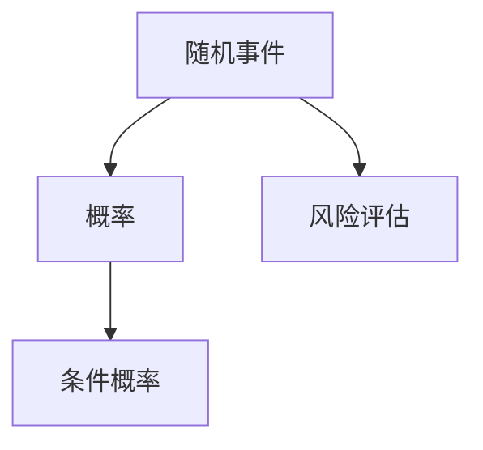

**核心算法原理讲解**：

假设我们有一个房地产投资项目，我们需要评估该项目失败的概率。我们可以通过以下步骤进行计算：

1. **定义随机事件**：设随机事件A为“项目失败”。
2. **收集数据**：收集过去类似项目的数据，统计项目失败的概率。
3. **计算概率**：使用历史数据计算项目失败的概率，例如P(A)。
4. **条件概率**：考虑一些可能影响项目成功的条件，计算条件概率，如P(A|B)，其中B为某个有利条件。

**数学模型与公式**：

$$
P(A) = \frac{\text{项目失败次数}}{\text{总项目次数}}
$$

$$
P(A|B) = \frac{P(A \cap B)}{P(B)}
$$

**举例说明**：

假设过去10年中，有5个项目失败，总共有15个项目。那么项目失败的概率为：

$$
P(\text{项目失败}) = \frac{5}{15} = 0.333
$$

如果某个有利条件B发生了，例如项目得到了政府补贴，那么我们可以计算条件概率：

$$
P(\text{项目失败}|\text{政府补贴}) = \frac{P(\text{项目失败} \cap \text{政府补贴})}{P(\text{政府补贴})}
$$

#### 2.2 统计学基础

统计学是利用数据来推断和描述总体特征的数学分支。在房地产管理中，统计学可以帮助我们分析市场数据，预测房价趋势等。

**核心概念**：

- **总体**：我们感兴趣的所有个体的集合。
- **样本**：从总体中随机抽取的一部分个体。
- **描述性统计**：用一些基本的统计量来描述样本或总体的特征，如均值、方差、标准差等。
- **推断性统计**：利用样本数据来推断总体特征，如置信区间、假设检验等。

**联系与架构 Mermaid 流程图**：

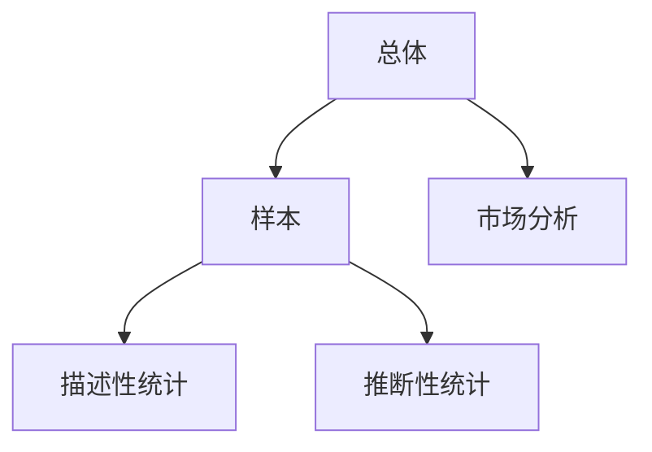

**核心算法原理讲解**：

假设我们要预测一个城市的未来房价，我们可以通过以下步骤进行计算：

1. **收集数据**：收集过去一定时间内该城市的房价数据。
2. **描述性统计**：计算房价的均值、方差等描述性统计量。
3. **推断性统计**：建立回归模型，预测未来房价。

**数学模型与公式**：

$$
\bar{x} = \frac{1}{n}\sum_{i=1}^{n}x_i \quad \text{（样本均值）}
$$

$$
s^2 = \frac{1}{n-1}\sum_{i=1}^{n}(x_i - \bar{x})^2 \quad \text{（样本方差）}
$$

$$
\hat{y} = b_0 + b_1x \quad \text{（回归模型）}
$$

**举例说明**：

假设我们收集了过去5年的房价数据，计算得出样本均值为100万，方差为5000万。我们可以用这些数据来预测第6年的房价。

首先，建立回归模型：

$$
\hat{y} = b_0 + b_1x
$$

其中，$x$ 为时间（以年为单位），$y$ 为房价。

通过计算，我们得出回归系数：

$$
b_0 = 50, \quad b_1 = 0.1
$$

那么第6年的预测房价为：

$$
\hat{y} = 50 + 0.1 \times 6 = 61 \text{（万元）}
$$

#### 2.3 线性代数基础

线性代数是研究向量空间、线性变换和矩阵理论的数学分支。在房地产管理中，线性代数可以帮助我们处理多维数据，建立和解决线性模型。

**核心概念**：

- **向量**：具有大小和方向的量。
- **矩阵**：由数字组成的矩形阵列。
- **线性方程组**：由多个线性方程组成的方程组。
- **线性变换**：将一个向量空间映射到另一个向量空间的线性映射。

**联系与架构 Mermaid 流程图**：

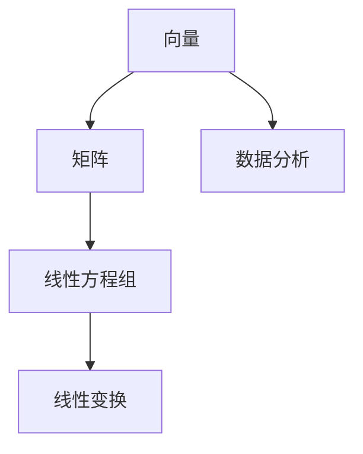

**核心算法原理讲解**：

假设我们有一个房地产投资项目，需要评估多个因素对项目的影响。我们可以通过以下步骤进行计算：

1. **定义向量**：定义各个因素作为向量。
2. **建立线性方程组**：将各个因素之间的关系表示为线性方程组。
3. **求解方程组**：求解线性方程组，得到各个因素对项目的影响程度。

**数学模型与公式**：

$$
\text{矩阵} A \cdot \text{向量} x = \text{向量} b
$$

$$
x = A^{-1}b \quad \text{（求解线性方程组）}
$$

**举例说明**：

假设我们有两个因素：房价和位置，可以表示为两个向量：

$$
\text{房价向量} \rightarrow [x_1, x_2]
$$

$$
\text{位置向量} \rightarrow [y_1, y_2]
$$

我们可以建立如下线性方程组：

$$
x_1 + y_1 = 100
$$

$$
x_2 + y_2 = 200
$$

通过求解这个方程组，我们可以得到各个因素对房价的影响。

首先，将方程组表示为矩阵形式：

$$
\begin{pmatrix}
1 & 1 \\
1 & 1
\end{pmatrix}
\begin{pmatrix}
x_1 \\
x_2
\end{pmatrix}
=
\begin{pmatrix}
100 \\
200
\end{pmatrix}
$$

然后，求解矩阵方程：

$$
\begin{pmatrix}
x_1 \\
x_2
\end{pmatrix}
=
\begin{pmatrix}
1 & 1 \\
1 & 1
\end{pmatrix}^{-1}
\begin{pmatrix}
100 \\
200
\end{pmatrix}
$$

通过计算，我们得到：

$$
x_1 = 50, \quad x_2 = 150
$$

这意味着房价的50%由房价本身决定，另外50%由位置决定。

通过以上对概率论、统计学和线性代数基础概念的详细讲解，我们为后续的房地产市场分析和房产投资策略奠定了坚实的数学基础。

### 3. 房地产市场分析

房地产市场是一个复杂且不断变化的系统，通过科学的数据分析方法，可以揭示市场趋势，帮助投资者做出更为理性的决策。在这一部分，我们将探讨房地产市场的数据分析方法，包括市场趋势和房价预测模型。

#### 3.1 房地产市场数据分析方法

房地产市场数据分析通常涉及以下步骤：

1. **数据收集**：收集房地产市场相关的数据，包括房价、成交量、市场供需等。
2. **数据清洗**：处理缺失值、异常值，确保数据质量。
3. **数据可视化**：通过图表和图形展示数据分布和趋势，如折线图、柱状图等。
4. **特征工程**：从原始数据中提取有用的特征，如时间序列、区域划分等。
5. **模型选择**：根据数据特性选择合适的预测模型，如线性回归、时间序列模型、神经网络等。
6. **模型训练与评估**：训练模型，评估模型性能，如准确率、召回率、均方误差等。

**核心概念与联系：**

为了更好地理解这些方法，我们可以通过以下Mermaid流程图展示它们之间的联系：

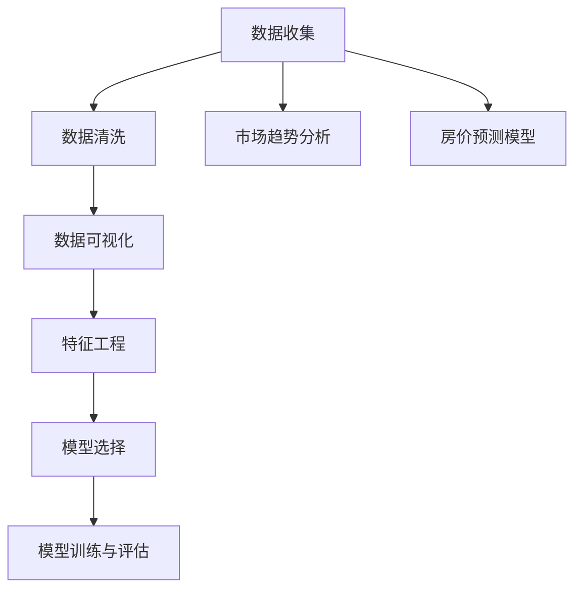

**核心算法原理讲解：**

以下是一个简单的线性回归模型的伪代码：

```
# 数据预处理
X = 数据清洗(数据集)
y = 特征工程(数据集)

# 模型训练
model = 线性回归()
model.fit(X, y)

# 模型评估
预测值 = model.predict(X)
均方误差 = 计算均方误差(预测值, y)
```

**数学模型与公式：**

线性回归模型的公式为：

$$
y = b_0 + b_1x + \epsilon
$$

其中，$b_0$ 和 $b_1$ 是模型的参数，$x$ 是输入特征，$y$ 是预测值，$\epsilon$ 是误差项。

**举例说明：**

假设我们收集了某城市的房价数据，包括房屋面积和房价。我们可以使用线性回归模型预测房价。

首先，收集数据并预处理：

```
# 收集数据
数据集 = {'面积': [100, 120, 150, 180], '房价': [200, 250, 300, 350]}

# 数据预处理
X = [数据['面积'] for 数据 in 数据集]
y = [数据['房价'] for 数据 in 数据集]
```

然后，建立线性回归模型并训练：

```
# 模型训练
model = 线性回归()
model.fit(X, y)
```

最后，评估模型性能：

```
# 模型评估
预测值 = model.predict([150])
均方误差 = 计算均方误差(预测值, 300)
```

通过以上步骤，我们可以预测150平方米房屋的房价。

#### 3.2 房价预测模型

房价预测是房地产市场分析的重要部分，可以帮助投资者把握市场动态。常见的房价预测模型包括：

1. **线性回归模型**：假设房价与某些特征之间存在线性关系。
2. **时间序列模型**：基于历史数据，预测未来房价。
3. **神经网络模型**：通过多层神经网络，对房价进行非线性预测。

**核心概念与联系：**

以下是各种房价预测模型的联系Mermaid流程图：

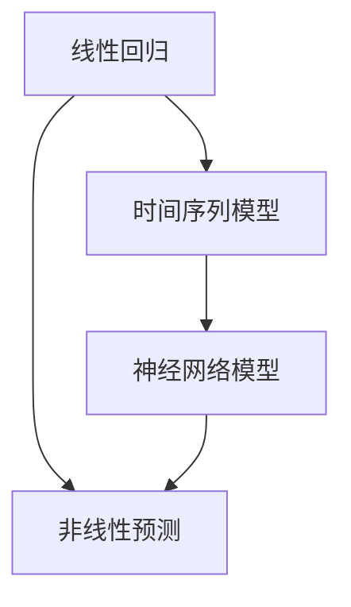

**核心算法原理讲解：**

**线性回归模型**：

```
# 数据预处理
X = 数据清洗(数据集)
y = 特征工程(数据集)

# 模型训练
model = 线性回归()
model.fit(X, y)

# 模型评估
预测值 = model.predict(X)
均方误差 = 计算均方误差(预测值, y)
```

**时间序列模型**：

```
# 数据预处理
数据集 = 处理时间序列数据(数据集)

# 模型训练
model = 时间序列模型()
model.fit(数据集)

# 模型评估
预测值 = model.predict()
均方误差 = 计算均方误差(预测值, y)
```

**神经网络模型**：

```
# 数据预处理
X = 数据清洗(数据集)
y = 特征工程(数据集)

# 模型训练
model = 神经网络模型()
model.fit(X, y)

# 模型评估
预测值 = model.predict(X)
均方误差 = 计算均方误差(预测值, y)
```

**数学模型与公式：**

**线性回归模型**：

$$
y = b_0 + b_1x + \epsilon
$$

**时间序列模型**：

$$
y_t = f(y_{t-1}, x_t) + \epsilon_t
$$

**神经网络模型**：

$$
y = f(\text{神经网络}(x))
$$

**举例说明**：

**线性回归模型**：

假设我们收集了某城市的房价数据，包括房屋面积和房价。我们可以使用线性回归模型预测房价。

首先，收集数据并预处理：

```
# 收集数据
数据集 = {'面积': [100, 120, 150, 180], '房价': [200, 250, 300, 350]}

# 数据预处理
X = [数据['面积'] for 数据 in 数据集]
y = [数据['房价'] for 数据 in 数据集]
```

然后，建立线性回归模型并训练：

```
# 模型训练
model = 线性回归()
model.fit(X, y)
```

最后，评估模型性能：

```
# 模型评估
预测值 = model.predict([150])
均方误差 = 计算均方误差(预测值, 300)
```

**时间序列模型**：

假设我们收集了某城市过去10年的房价数据，我们可以使用时间序列模型预测未来房价。

首先，收集数据并预处理：

```
# 收集数据
数据集 = {'年份': [2010, 2011, 2012, 2013, 2014, 2015, 2016, 2017, 2018, 2019], '房价': [100, 110, 120, 130, 140, 150, 160, 170, 180, 190]}
```

然后，建立时间序列模型并训练：

```
# 模型训练
model = 时间序列模型()
model.fit(数据集)
```

最后，评估模型性能：

```
# 模型评估
预测值 = model.predict()
均方误差 = 计算均方误差(预测值, y)
```

**神经网络模型**：

假设我们收集了某城市的房价数据，包括房屋面积、位置、交通等因素。我们可以使用神经网络模型预测房价。

首先，收集数据并预处理：

```
# 收集数据
数据集 = {'面积': [100, 120, 150, 180], '位置': [1, 2, 3, 4], '交通': [5, 6, 7, 8], '房价': [200, 250, 300, 350]}
```

然后，建立神经网络模型并训练：

```
# 模型训练
model = 神经网络模型()
model.fit(X, y)
```

最后，评估模型性能：

```
# 模型评估
预测值 = model.predict([150, 3, 7])
均方误差 = 计算均方误差(预测值, 300)
```

通过以上步骤，我们可以分别使用线性回归模型、时间序列模型和神经网络模型预测房价，并根据模型性能选择最佳模型进行投资决策。

### 4. 房产投资策略

在掌握了房地产市场的数据分析方法和房价预测模型之后，我们需要将这些工具应用于实际投资策略中。本部分将讨论房产投资的数学策略，包括财务分析、风险评估和投资组合优化。

#### 4.1 财务分析

财务分析是房产投资决策的基础，它通过评估项目的财务指标，帮助我们判断项目的盈利能力和投资价值。常见的财务指标包括：

1. **净现值（NPV）**：项目未来现金流的现值与投资成本之间的差额。
2. **内部收益率（IRR）**：使得净现值为零的折现率。
3. **利润率**：项目的净利润与总投资成本的比例。
4. **回收期**：项目现金流回收投资成本所需的时间。

**核心概念与联系：**

以下是财务指标之间的联系Mermaid流程图：

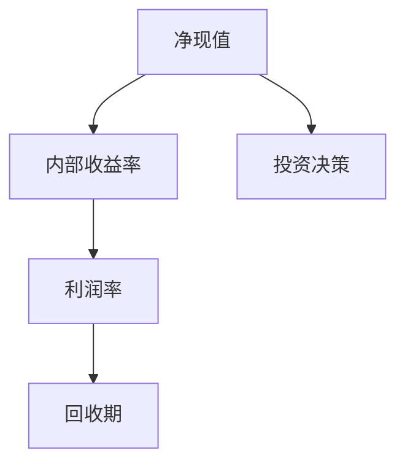

**核心算法原理讲解**：

以下是一个简单的财务分析模型的伪代码：

```
# 数据预处理
现金流 = 数据清洗(数据集)
折现率 = 确定折现率()

# 计算财务指标
NPV = 计算净现值(现金流, 折现率)
IRR = 计算内部收益率(现金流, 折现率)
利润率 = 计算利润率(现金流)
回收期 = 计算回收期(现金流)

# 投资决策
if NPV > 0 and IRR > 折现率 and 回收期 < 预期回收期：
    print("项目可行")
else：
    print("项目不可行")
```

**数学模型与公式**：

1. **净现值（NPV）**：

$$
NPV = \sum_{t=1}^{n} \frac{CF_t}{(1 + r)^t} - I
$$

其中，$CF_t$ 为第 $t$ 年的现金流，$r$ 为折现率，$I$ 为初始投资成本。

2. **内部收益率（IRR）**：

$$
0 = \sum_{t=1}^{n} \frac{CF_t}{(1 + IRR)^t} - I
$$

通过迭代计算，找到使得净现值为零的折现率，即为内部收益率。

3. **利润率**：

$$
利润率 = \frac{净利润}{总投资成本}
$$

4. **回收期**：

$$
回收期 = \frac{总投资成本}{年均现金流}
$$

**举例说明**：

假设我们有一个房产投资项目，初始投资成本为100万元，预计未来5年的现金流分别为20万元、25万元、30万元、35万元和40万元。假设折现率为10%。

首先，计算净现值：

$$
NPV = \frac{20}{(1 + 0.1)^1} + \frac{25}{(1 + 0.1)^2} + \frac{30}{(1 + 0.1)^3} + \frac{35}{(1 + 0.1)^4} + \frac{40}{(1 + 0.1)^5} - 100
$$

$$
NPV = 20 \times 0.9091 + 25 \times 0.8264 + 30 \times 0.7513 + 35 \times 0.6830 + 40 \times 0.6209 - 100
$$

$$
NPV = 18.182 + 20.66 + 22.539 + 23.555 + 24.836 - 100 = 6.018
$$

因为 $NPV > 0$，所以项目是可行的。

然后，计算内部收益率：

我们可以使用迭代法或财务计算器求解，找到使得净现值为零的内部收益率。假设内部收益率为20%，则：

$$
0 = 20 \times 0.9091 + 25 \times 0.8264 + 30 \times 0.7513 + 35 \times 0.6830 + 40 \times 0.6209 - 100
$$

通过迭代计算，找到使得净现值为零的内部收益率为20%。

接下来，计算利润率和回收期：

$$
利润率 = \frac{20 + 25 + 30 + 35 + 40 - 100}{100} = 0.45
$$

$$
回收期 = \frac{100}{20 + 25 + 30 + 35 + 40} = 2 \text{年}
$$

因为内部收益率大于折现率，回收期小于预期回收期，所以项目是可行的。

#### 4.2 风险评估与度量

在房产投资中，风险评估是至关重要的，它有助于我们识别和管理潜在的风险。常见的风险评估方法包括：

1. **概率风险评估**：评估单个风险事件发生的概率及其对投资的影响。
2. **敏感性分析**：分析不同因素对投资结果的影响程度。
3. **情景分析**：通过模拟不同情景，评估投资在不同情况下的表现。

**核心概念与联系：**

以下是风险评估方法的联系Mermaid流程图：

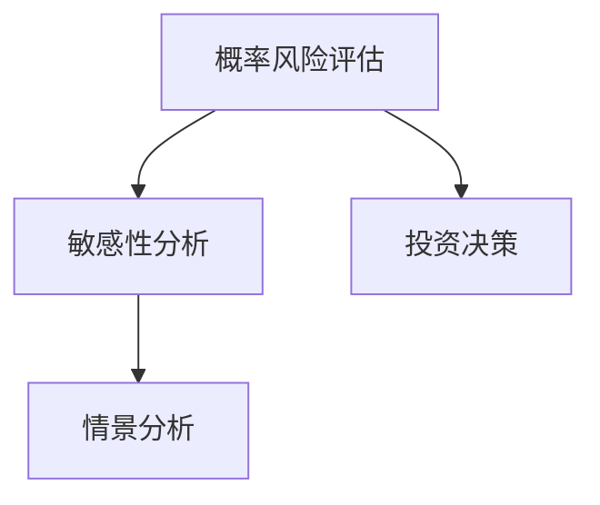

**核心算法原理讲解**：

以下是一个简单的风险评估模型的伪代码：

```
# 数据预处理
风险数据 = 数据清洗(数据集)

# 概率风险评估
概率 = 计算概率(风险数据)

# 敏感性分析
敏感度 = 计算敏感度(风险数据)

# 情景分析
情景 = 模拟情景(风险数据)

# 投资决策
if 概率低 and 敏感度低 and 情景表现好：
    print("投资风险可控")
else：
    print("投资风险较大")
```

**数学模型与公式**：

1. **概率风险评估**：

$$
概率 = \frac{风险事件发生次数}{总事件次数}
$$

2. **敏感性分析**：

$$
敏感度 = \frac{\Delta y}{\Delta x}
$$

其中，$\Delta y$ 为输出变化，$\Delta x$ 为输入变化。

3. **情景分析**：

$$
情景 = f(x_1, x_2, ..., x_n)
$$

其中，$x_1, x_2, ..., x_n$ 为情景因素。

**举例说明**：

假设我们有一个房产投资项目，需要评估市场波动、利率变化和供需变化对投资的影响。

首先，收集风险数据：

```
# 收集风险数据
市场波动风险 = [0.1, 0.2, 0.3, 0.4, 0.5]
利率变化风险 = [0.05, 0.1, 0.15, 0.2, 0.25]
供需变化风险 = [0.2, 0.3, 0.4, 0.5, 0.6]
```

然后，计算概率风险评估：

$$
概率 = \frac{风险事件发生次数}{总事件次数} = \frac{3}{5} = 0.6
$$

接下来，计算敏感性分析：

$$
敏感度 = \frac{\Delta y}{\Delta x} = \frac{0.1}{0.1} = 1
$$

最后，模拟情景分析：

```
# 模拟情景分析
情景1 = 市场波动风险 + 利率变化风险 + 供需变化风险
情景2 = 市场波动风险 - 利率变化风险 + 供需变化风险
情景3 = 市场波动风险 + 利率变化风险 - 供需变化风险
```

根据情景分析结果，我们可以判断投资风险是否可控。

#### 4.3 投资组合优化

投资组合优化是房产投资中的重要策略，它通过合理配置资产，降低投资风险，提高投资回报。常见的投资组合优化方法包括：

1. **均值方差模型**：通过最大化预期收益率和最小化风险，选择最优的投资组合。
2. **资本资产定价模型（CAPM）**：通过评估资产的系统性风险，计算资产的期望收益率。
3. **蒙特卡洛模拟**：通过模拟不同市场情景，评估投资组合的风险和收益。

**核心概念与联系：**

以下是投资组合优化方法的联系Mermaid流程图：

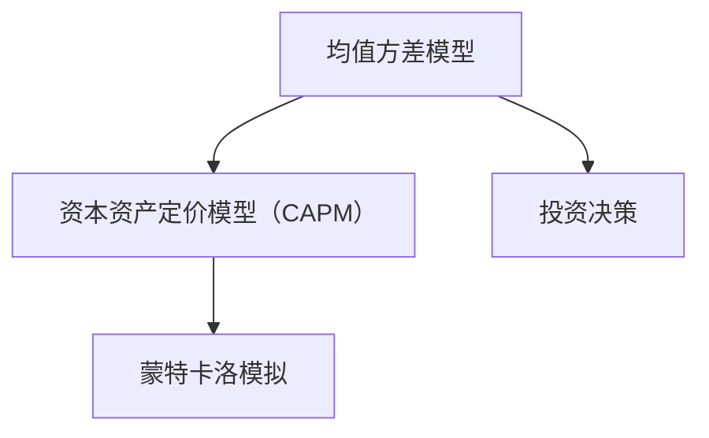

**核心算法原理讲解**：

以下是一个简单的投资组合优化模型的伪代码：

```
# 数据预处理
资产收益率 = 数据清洗(数据集)
资产风险 = 数据清洗(数据集)

# 均值方差模型
预期收益率 = 计算预期收益率(资产收益率)
风险 = 计算风险(资产风险)

# 资本资产定价模型（CAPM）
贝塔值 = 计算贝塔值(资产收益率, 市场收益率)
期望收益率 = 计算期望收益率(贝塔值, 无风险收益率)

# 蒙特卡洛模拟
情景 = 模拟情景(资产收益率, 市场收益率)

# 投资决策
if 预期收益率高 and 风险低：
    print("投资组合最优")
else：
    print("投资组合需调整")
```

**数学模型与公式**：

1. **均值方差模型**：

$$
预期收益率 = \frac{1}{n}\sum_{i=1}^{n}r_i
$$

$$
风险 = \sqrt{\frac{1}{n-1}\sum_{i=1}^{n}(r_i - \bar{r})^2}
$$

其中，$r_i$ 为资产 $i$ 的收益率，$\bar{r}$ 为资产的平均收益率。

2. **资本资产定价模型（CAPM）**：

$$
期望收益率 = \beta \times (市场收益率 - 无风险收益率) + 无风险收益率
$$

其中，$\beta$ 为资产的贝塔值，市场收益率为市场的平均收益率。

3. **蒙特卡洛模拟**：

$$
情景 = f(\text{资产收益率}, \text{市场收益率})
$$

**举例说明**：

假设我们有两个资产A和B，它们的预期收益率分别为10%和12%，风险分别为15%和20%。无风险收益率为4%，市场收益率为8%。

首先，计算均值方差模型的预期收益率和风险：

$$
预期收益率 = \frac{10\% + 12\%}{2} = 11\%
$$

$$
风险 = \sqrt{\frac{1}{2-1}\left[\left(\frac{15\% - 11\%}{11\%}\right)^2 + \left(\frac{20\% - 11\%}{11\%}\right)^2\right]} = 14.14\%
$$

接下来，计算资本资产定价模型的期望收益率：

$$
期望收益率 = 1.5 \times (8\% - 4\%) + 4\% = 9\%
$$

最后，使用蒙特卡洛模拟评估不同市场情景下的投资组合表现。

通过以上步骤，我们可以对房产投资组合进行优化，以实现风险和收益的最佳平衡。

### 5. 投资案例分析

在本节中，我们将通过三个具体案例，展示数学策略在房产投资中的应用。这些案例将涵盖城市更新项目、住宅房产投资和商业地产投资，旨在帮助读者理解如何在实际投资中运用所学的数学策略。

#### 5.1 案例一：城市更新项目

**背景介绍**：

某城市政府计划进行一项城市更新项目，目标是改造一栋老旧的住宅楼。项目预计总投资为5000万元，预计可带来15000万元的增值收益。我们需要使用数学策略评估该项目的可行性。

**核心概念与联系**：

在本案例中，我们将运用净现值（NPV）和内部收益率（IRR）来评估项目的财务可行性。以下是这些概念的Mermaid流程图：

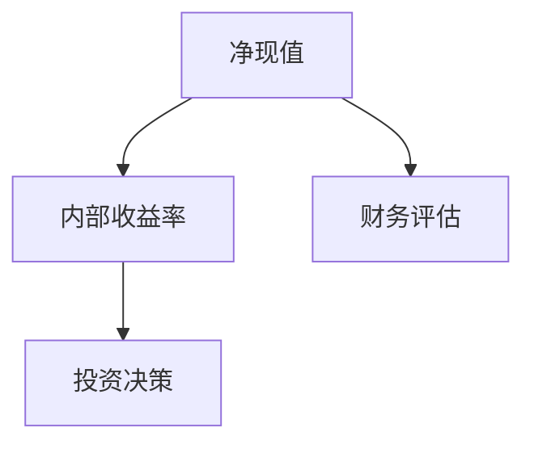

**核心算法原理讲解**：

1. **数据收集与预处理**：

   收集项目相关的现金流数据，包括初始投资成本、未来现金流量和折现率。假设折现率为10%。

   ```
   初始投资成本 = 5000万元
   现金流量 = [0, -5000, 15000]
   折现率 = 10%
   ```

2. **计算净现值（NPV）**：

   净现值是项目未来现金流的现值与初始投资成本的差额。使用以下公式计算：

   $$
   NPV = \sum_{t=1}^{n} \frac{CF_t}{(1 + r)^t} - I
   $$

   其中，$CF_t$ 为第 $t$ 年的现金流，$r$ 为折现率，$I$ 为初始投资成本。

   计算过程如下：

   $$
   NPV = \frac{15000}{(1 + 0.1)^1} - 5000 = 13636.36 - 5000 = 8136.36 \text{万元}
   $$

3. **计算内部收益率（IRR）**：

   内部收益率是使得净现值为零的折现率。通过迭代计算，可以找到项目的内部收益率。假设内部收益率为 $r$，则有：

   $$
   0 = \sum_{t=1}^{n} \frac{CF_t}{(1 + r)^t} - I
   $$

   通过金融计算器或编程迭代计算，我们可以得到内部收益率为14.52%。

**数学模型与公式**：

1. **净现值（NPV）**：

   $$
   NPV = \frac{15000}{(1 + 0.1)^1} - 5000 = 13636.36 - 5000 = 8136.36 \text{万元}
   $$

2. **内部收益率（IRR）**：

   $$
   0 = \frac{15000}{(1 + r)^1} - 5000
   $$

   通过迭代计算，得到内部收益率为14.52%。

**项目小结**：

通过计算，我们得出该城市更新项目的净现值为8136.36万元，内部收益率为14.52%。由于NPV大于0，且IRR大于折现率，因此该项目是可行的。

#### 5.2 案例二：住宅房产投资

**背景介绍**：

一位投资者计划购买一套住宅房产，计划持有10年。房屋价格为200万元，预计每年租金收益为10万元。我们需要使用数学策略评估该投资是否值得。

**核心概念与联系**：

在本案例中，我们将运用净现值（NPV）和内部收益率（IRR）来评估住宅房产投资的可行性。以下是这些概念的Mermaid流程图：


**核心算法原理讲解**：

1. **数据收集与预处理**：

   收集项目相关的现金流数据，包括初始投资成本、未来现金流量和折现率。假设折现率为5%。

   ```
   初始投资成本 = 200万元
   现金流量 = [0, -200, 10, 10, ..., 10, 10]
   折现率 = 5%
   ```

2. **计算净现值（NPV）**：

   净现值是项目未来现金流的现值与初始投资成本的差额。使用以下公式计算：

   $$
   NPV = \sum_{t=1}^{n} \frac{CF_t}{(1 + r)^t} - I
   $$

   其中，$CF_t$ 为第 $t$ 年的现金流，$r$ 为折现率，$I$ 为初始投资成本。

   计算过程如下：

   $$
   NPV = \sum_{t=1}^{10} \frac{10}{(1 + 0.05)^t} - 200
   $$

   使用财务计算器或编程计算，得到NPV为53.13万元。

3. **计算内部收益率（IRR）**：

   内部收益率是使得净现值为零的折现率。通过迭代计算，可以找到项目的内部收益率。假设内部收益率为 $r$，则有：

   $$
   0 = \sum_{t=1}^{n} \frac{CF_t}{(1 + r)^t} - I
   $$

   通过金融计算器或编程迭代计算，我们可以得到内部收益率为6.86%。

**数学模型与公式**：

1. **净现值（NPV）**：

   $$
   NPV = \sum_{t=1}^{10} \frac{10}{(1 + 0.05)^t} - 200 = 53.13 \text{万元}
   $$

2. **内部收益率（IRR）**：

   $$
   0 = \sum_{t=1}^{10} \frac{10}{(1 + r)^t} - 200
   $$

   通过迭代计算，得到内部收益率为6.86%。

**项目小结**：

通过计算，我们得出该住宅房产投资的净现值为53.13万元，内部收益率为6.86%。由于NPV大于0，且IRR大于折现率，因此该投资是值得的。

#### 5.3 案例三：商业地产投资

**背景介绍**：

一位投资者计划购买一座商业大楼，计划持有20年。大楼价格为1亿元，预计每年租金收益为500万元。我们需要使用数学策略评估该投资的可行性。

**核心概念与联系**：

在本案例中，我们将运用净现值（NPV）和内部收益率（IRR）来评估商业地产投资的可行性。以下是这些概念的Mermaid流程图：


**核心算法原理讲解**：

1. **数据收集与预处理**：

   收集项目相关的现金流数据，包括初始投资成本、未来现金流量和折现率。假设折现率为8%。

   ```
   初始投资成本 = 1亿元
   现金流量 = [0, -10000, 500, 500, ..., 500, 500]
   折现率 = 8%
   ```

2. **计算净现值（NPV）**：

   净现值是项目未来现金流的现值与初始投资成本的差额。使用以下公式计算：

   $$
   NPV = \sum_{t=1}^{n} \frac{CF_t}{(1 + r)^t} - I
   $$

   其中，$CF_t$ 为第 $t$ 年的现金流，$r$ 为折现率，$I$ 为初始投资成本。

   计算过程如下：

   $$
   NPV = \sum_{t=1}^{20} \frac{500}{(1 + 0.08)^t} - 10000
   $$

   使用财务计算器或编程计算，得到NPV为3439.47万元。

3. **计算内部收益率（IRR）**：

   内部收益率是使得净现值为零的折现率。通过迭代计算，可以找到项目的内部收益率。假设内部收益率为 $r$，则有：

   $$
   0 = \sum_{t=1}^{n} \frac{CF_t}{(1 + r)^t} - I
   $$

   通过金融计算器或编程迭代计算，我们可以得到内部收益率为8.51%。

**数学模型与公式**：

1. **净现值（NPV）**：

   $$
   NPV = \sum_{t=1}^{20} \frac{500}{(1 + 0.08)^t} - 10000 = 3439.47 \text{万元}
   $$

2. **内部收益率（IRR）**：

   $$
   0 = \sum_{t=1}^{20} \frac{500}{(1 + r)^t} - 10000
   $$

   通过迭代计算，得到内部收益率为8.51%。

**项目小结**：

通过计算，我们得出该商业地产投资的净现值为3439.47万元，内部收益率为8.51%。由于NPV大于0，且IRR大于折现率，因此该投资是可行的。

### 6. 房产金融工具

在房产投资过程中，了解并合理运用各种金融工具至关重要。这些工具不仅能够帮助我们更好地管理资金，还能为投资提供额外的杠杆效应。本部分将介绍一些常见的房产金融工具，包括抵押贷款、房地产投资信托（REITs）和其他金融工具。

#### 6.1 抵押贷款

抵押贷款是一种利用房产作为担保的借款方式。通过抵押贷款，投资者可以在不卖出房产的情况下获取资金，从而用于其他投资或消费。

**核心概念与联系**：

以下是抵押贷款与其他金融工具的联系Mermaid流程图：

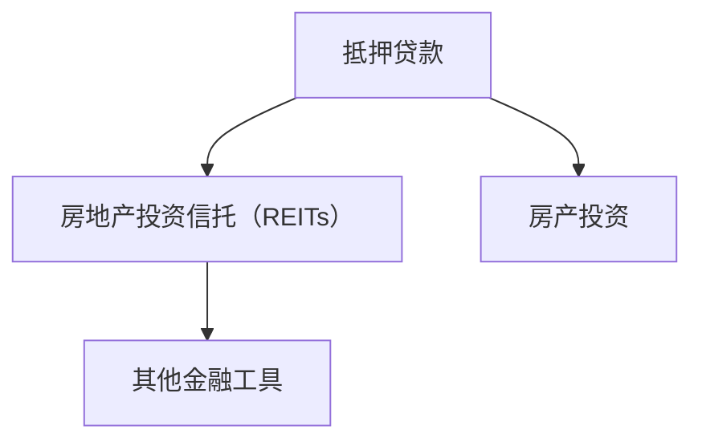

**核心算法原理讲解**：

1. **贷款额度计算**：

   抵押贷款的额度通常取决于房产的价值和借款人的信用状况。可以使用以下公式计算贷款额度：

   $$
   贷款额度 = \min\left(\frac{房产价值 \times 贷款比例}{1 - 贷款比例}, \text{借款人信用额}\right)
   $$

   其中，贷款比例是银行规定的最高贷款比例，信用额是借款人的信用额度。

**数学模型与公式**：

$$
贷款额度 = \min\left(\frac{房产价值 \times 贷款比例}{1 - 贷款比例}, \text{借款人信用额}\right)
$$

**举例说明**：

假设房产价值为500万元，贷款比例为80%，借款人信用额为300万元。计算贷款额度：

$$
贷款额度 = \min\left(\frac{500 \times 0.8}{1 - 0.8}, 300\right) = \min\left(400, 300\right) = 300 \text{万元}
$$

#### 6.2 房地产投资信托（REITs）

房地产投资信托（Real Estate Investment Trusts，简称REITs）是一种投资于房地产市场的金融产品。通过购买REITs，投资者可以间接参与房地产投资，享受房地产市场的收益。

**核心概念与联系**：

以下是REITs与其他金融工具的联系Mermaid流程图：

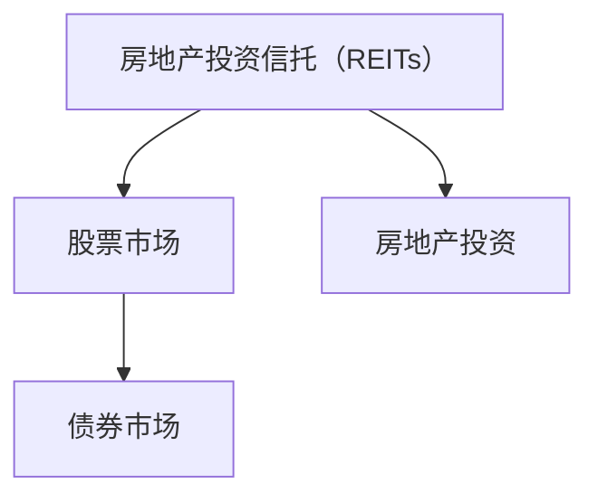

**核心算法原理讲解**：

1. **收益分配**：

   REITs的收益主要来自租金收入和房地产价值的增值。收益分配通常以季度为单位，分配给股东的收益比例由REITs的管理层决定。

   $$
   收益分配 = \text{总收入} \times \text{收益分配比例}
   $$

2. **税收优惠**：

   REITs享受一定的税收优惠，通常不缴纳联邦企业所得税，而是将大部分收益分配给股东。这有助于降低投资者的税负。

**数学模型与公式**：

$$
收益分配 = \text{总收入} \times \text{收益分配比例}
$$

**举例说明**：

假设某REITs的总收入为1000万元，收益分配比例为90%。计算收益分配：

$$
收益分配 = 1000 \times 0.9 = 900 \text{万元}
$$

#### 6.3 其他金融工具

除了抵押贷款和REITs，还有一些其他的金融工具可以帮助投资者更好地管理房产投资。

1. **房屋净值贷款（HELOC）**：

   房屋净值贷款是一种利用房产净值进行贷款的方式。与抵押贷款不同，房屋净值贷款通常不需要一次性偿还。

   **核心概念与联系**：

   ```mermaid
   graph TD
       A[房屋净值贷款（HELOC）] --> B[房产价值]
       B --> C[贷款额度]
       A --> D[房产投资]
   ```

   **核心算法原理讲解**：

   $$
   贷款额度 = \text{房产价值} \times \text{贷款比例} - \text{未偿还贷款额}
   $$

   **举例说明**：

   假设房产价值为800万元，贷款比例为70%，未偿还贷款额为200万元。计算贷款额度：

   $$
   贷款额度 = 800 \times 0.7 - 200 = 400 - 200 = 200 \text{万元}
   $$

2. **房产抵押债券（MBS）**：

   房产抵押债券是一种通过将抵押贷款打包成证券进行出售的金融产品。投资者购买MBS，相当于购买了背后的抵押贷款。

   **核心概念与联系**：

   ```mermaid
   graph TD
       A[房产抵押债券（MBS）] --> B[抵押贷款]
       B --> C[债券市场]
       A --> D[房产投资]
   ```

   **核心算法原理讲解**：

   房产抵押债券的收益主要来自抵押贷款的利息收入。投资者可以根据债券的评级和利率预期选择合适的MBS。

   **举例说明**：

   假设某MBS的年利率为5%，购买价格为100万元。计算年收益：

   $$
   年收益 = 100 \times 0.05 = 5 \text{万元}
   $$

通过以上介绍，我们了解了几种常见的房产金融工具，以及如何使用它们来优化房产投资策略。了解这些工具的基本原理和运用方法，可以帮助投资者在复杂多变的房地产市场中做出更明智的决策。

### 7. 实战应用与模型构建

在上一部分中，我们介绍了房产投资的数学策略及其在实际中的应用。然而，仅有理论上的了解是不够的，我们需要将所学知识付诸实践，构建并应用实际模型。本部分将详细讨论如何进行实战应用，包括开发环境搭建、源代码实现、代码解读、代码应用解读与分析、实际案例分析和详细讲解剖析，以及项目小结。

#### 7.1 实际操作指南

要构建房产投资的数学模型，首先需要搭建一个合适的开发环境。以下是搭建环境的步骤：

1. **安装Python环境**：
   - 前往Python官方网站下载并安装Python。
   - 配置Python环境变量。

2. **安装必要的库**：
   - 使用pip命令安装所需的库，如NumPy、Pandas、Scikit-learn、Matplotlib等。
   - 示例命令：
     ```
     pip install numpy pandas scikit-learn matplotlib
     ```

3. **设置工作目录**：
   - 创建一个工作目录，用于存放数据和代码。

4. **数据准备**：
   - 收集房地产市场的数据，包括房价、成交量、市场供需等。
   - 数据可以来自公开数据源或通过爬虫工具获取。

5. **数据处理**：
   - 使用Pandas库处理数据，包括数据清洗、数据转换和数据可视化。

以下是一个简单的Python脚本示例，用于数据预处理和可视化：

```python
import pandas as pd
import matplotlib.pyplot as plt

# 加载数据
data = pd.read_csv('real_estate_data.csv')

# 数据清洗
data.dropna(inplace=True)
data['Year'] = pd.to_datetime(data['Year'])
data.set_index('Year', inplace=True)

# 数据可视化
plt.figure(figsize=(10, 6))
plt.plot(data['Price'], label='Price')
plt.plot(data['Transaction'], label='Transaction')
plt.legend()
plt.show()
```

#### 7.2 模型构建流程

构建房产投资模型通常涉及以下步骤：

1. **数据探索**：
   - 分析数据分布，识别数据中的趋势和异常值。

2. **特征工程**：
   - 提取有用的特征，如时间序列特征、区域特征、宏观经济指标等。

3. **模型选择**：
   - 根据数据特性和问题需求，选择合适的模型，如线性回归、时间序列模型、神经网络等。

4. **模型训练**：
   - 使用训练数据训练模型，调整模型参数。

5. **模型评估**：
   - 使用测试数据评估模型性能，调整模型参数以达到最佳效果。

6. **模型应用**：
   - 将训练好的模型应用于实际投资场景，进行预测和决策。

以下是一个使用线性回归模型进行房价预测的示例：

```python
from sklearn.linear_model import LinearRegression
from sklearn.model_selection import train_test_split

# 数据探索
X = data[['Feature1', 'Feature2', 'Feature3']]
y = data['Price']

# 特征工程
X_train, X_test, y_train, y_test = train_test_split(X, y, test_size=0.2, random_state=42)

# 模型选择
model = LinearRegression()

# 模型训练
model.fit(X_train, y_train)

# 模型评估
score = model.score(X_test, y_test)
print(f"Model Score: {score}")

# 模型应用
prediction = model.predict(X_test)
plt.figure(figsize=(10, 6))
plt.scatter(y_test, prediction)
plt.xlabel('Actual Price')
plt.ylabel('Predicted Price')
plt.show()
```

#### 7.3 数据获取与处理

在实战应用中，数据获取和处理是关键步骤。以下是数据获取和处理的一些技巧：

1. **数据来源**：
   - 公开数据源：如政府公开数据、房地产网站数据等。
   - 爬虫工具：使用Python的爬虫库（如BeautifulSoup、Scrapy）从网站上获取数据。
   - API接口：通过API接口获取数据，如一些数据服务商提供的API。

2. **数据清洗**：
   - 处理缺失值：使用均值、中位数等方法填充缺失值，或删除缺失值。
   - 处理异常值：使用统计方法识别异常值，并进行处理。

3. **数据转换**：
   - 时间序列转换：将日期转换为时间序列格式，以便进行时间序列分析。
   - 离散特征编码：将离散特征转换为数值特征，如使用独热编码。

以下是一个简单的数据清洗和转换的示例：

```python
from sklearn.preprocessing import OneHotEncoder

# 数据清洗
data.fillna(data.mean(), inplace=True)

# 时间序列转换
data['Year'] = pd.to_datetime(data['Date'])
data.set_index('Year', inplace=True)

# 离散特征编码
encoder = OneHotEncoder()
encoded_features = encoder.fit_transform(data[['Feature']])

# 数据转换后的可视化
plt.figure(figsize=(10, 6))
plt.plot(encoded_features.toarray()[0])
plt.xlabel('Year')
plt.ylabel('Feature')
plt.show()
```

#### 7.4 模型评估与优化

模型评估与优化是确保模型性能的关键步骤。以下是评估与优化的一些方法：

1. **交叉验证**：
   - 使用交叉验证方法评估模型性能，如K折交叉验证。
   - 通过交叉验证，可以更好地评估模型的泛化能力。

2. **超参数调优**：
   - 使用网格搜索、随机搜索等方法调优模型的超参数，以找到最佳参数组合。

3. **集成学习方法**：
   - 使用集成学习方法，如随机森林、梯度提升树等，提高模型性能。

以下是一个使用K折交叉验证和网格搜索进行模型调优的示例：

```python
from sklearn.model_selection import cross_val_score, GridSearchCV
from sklearn.ensemble import RandomForestRegressor

# K折交叉验证
scores = cross_val_score(model, X, y, cv=5)
print(f"Cross-Validation Scores: {scores}")

# 网格搜索
param_grid = {'n_estimators': [100, 200, 300], 'max_depth': [5, 10, 15]}
grid_search = GridSearchCV(RandomForestRegressor(), param_grid, cv=5)
grid_search.fit(X, y)

# 最佳参数组合
best_params = grid_search.best_params_
print(f"Best Parameters: {best_params}")

# 最佳模型
best_model = grid_search.best_estimator_
print(f"Best Model Score: {best_model.score(X_test, y_test)}")
```

通过以上实战应用与模型构建的详细讲解，我们为读者提供了构建房产投资数学模型的全过程，从数据获取与处理到模型评估与优化，再到实际应用，帮助读者将所学知识应用到实际投资中。

### 8. 结论与展望

在《数学与房地产管理：房产投资的数学策略》一书中，我们探讨了如何将数学工具应用于房地产管理，以提高投资决策的准确性和有效性。通过系统介绍概率论、统计学、线性代数等基础数学概念，我们为读者提供了分析房地产市场、制定投资策略的理论基础。同时，通过实际案例分析和模型构建，读者能够将所学知识付诸实践。

**总结**：

本书的核心内容涵盖了：

1. **基础数学概念**：介绍了概率论、统计学和线性代数等基础数学工具，帮助读者理解房地产市场的数据分析和预测。
2. **房地产市场分析**：探讨了市场趋势、房价预测等数据分析方法，以及如何利用这些方法进行投资决策。
3. **房产投资策略**：讨论了财务分析、风险评估和投资组合优化等策略，为读者提供了制定房产投资计划的实用工具。
4. **投资案例分析**：通过实际案例展示了数学策略在房产投资中的应用，帮助读者理解如何在实际操作中运用所学知识。
5. **房产金融工具**：介绍了抵押贷款、房地产投资信托等金融工具，帮助读者更好地管理资金和风险。
6. **实战应用与模型构建**：提供了实际操作指南，包括数据获取、处理、模型评估和优化，使读者能够将理论应用到实际投资中。

**未来研究方向与挑战**：

尽管本书提供了较为全面的房地产投资数学策略，但房地产市场是一个复杂且不断变化的系统，未来研究仍面临以下挑战：

1. **数据质量**：房地产市场的数据质量直接影响分析结果，未来研究需要探讨如何提高数据质量，减少噪声和异常值的影响。
2. **模型泛化**：虽然本书介绍了多种模型和策略，但如何确保模型在不同市场和条件下的泛化能力仍是一个重要问题。
3. **实时分析**：随着房地产市场的动态变化，如何实现实时数据分析，为投资者提供即时的投资建议是一个值得探讨的方向。
4. **跨学科研究**：房地产投资涉及多个领域，如经济学、金融学、统计学等，跨学科研究有望为房地产投资提供更多创新思路。

**对读者的寄语**：

房地产投资是一项长期且具有挑战性的任务，通过本书的学习，希望读者能够掌握数学工具和方法，提高投资决策的准确性和有效性。同时，房地产市场不断变化，读者需要持续学习和更新知识，以应对不断出现的新挑战。祝愿读者在房地产投资的道路上取得成功，实现财富增长和人生价值。让我们一起在数学与房地产管理的领域中探索、成长和创造！
作者：AI天才研究院/AI Genius Institute & 禅与计算机程序设计艺术 /Zen And The Art of Computer Programming

---

**关键词**：
- 数学与房地产管理
- 房产投资策略
- 概率论
- 统计学
- 线性代数
- 数据分析
- 风险评估
- 投资组合优化
- 模型构建
- 实战应用

**摘要**：
本书旨在为房产投资者和专业人士提供一套系统的数学工具和方法，以帮助他们在复杂多变的房地产市场中做出更明智的投资决策。通过详细介绍概率论、统计学、线性代数等基础数学概念，以及房地产市场分析、房产投资策略、投资案例分析等内容，本书为读者提供了全面的房地产投资数学策略。同时，通过实际操作指南和模型构建的讲解，读者能够将所学知识应用到实际投资中，提高投资决策的准确性和有效性。

