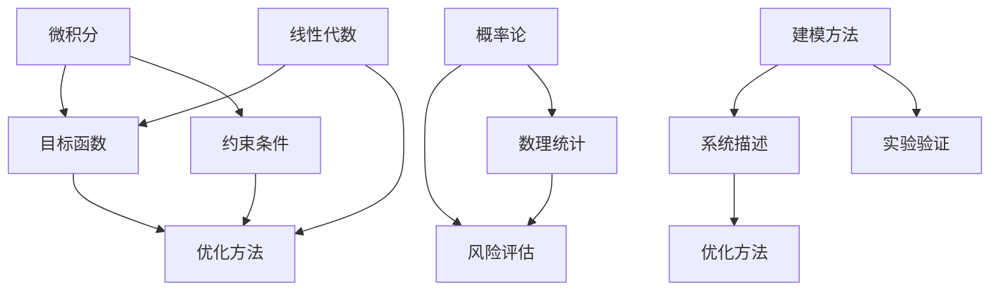

                 

### 文章标题：数学与技术管理：技术创新的数学分析

#### 关键词：技术创新、数学分析、技术管理、数学模型、优化方法

> 摘要：本文旨在探讨数学与技术管理的结合，通过数学分析的方法来推动技术创新。文章首先介绍了技术创新的定义与背景，接着阐述了数学与技术管理的融合原理及其重要性。然后，文章详细介绍了技术创新的数学分析方法，包括数学基础理论、数学分析工具以及实际案例分析。最后，文章总结了数学分析方法在技术创新中的应用，并对未来发展趋势进行了展望。

---

### 第一部分：引论

#### 1.1 技术创新的定义与背景

技术创新是指通过技术手段改进产品、服务或生产过程，以创造新的价值或提高现有价值的过程。技术创新的重要性不言而喻，它是推动经济增长和社会进步的重要动力。在当今这个信息化、全球化的时代，技术创新已经成为企业竞争的关键因素。

#### 1.2 数学与技术管理的结合

数学与技术管理的结合具有显著的优势。数学作为一种精确的科学，能够为技术管理提供理论依据和决策支持。通过数学分析，可以对技术创新过程进行量化分析，从而提高决策的科学性和准确性。

#### 1.3 技术创新的数学分析方法

数学分析方法在技术创新中具有重要作用。它包括数学基础理论和数学分析工具的应用。数学基础理论如微积分、线性代数、概率论与数理统计等为技术创新提供了坚实的数学基础。数学分析工具如优化方法和建模方法则为技术创新提供了有效的工具和方法。

### 第二部分：技术创新的数学基础

#### 2.1 数学基础理论

数学基础理论是技术创新的基石。它包括微积分、线性代数、概率论与数理统计等基础数学知识。这些知识不仅为技术创新提供了理论支持，还为后续的数学建模和优化方法奠定了基础。

#### 2.2 技术创新的数学分析工具

数学分析工具是技术创新的有力武器。优化方法和建模方法是其中最为重要的工具。优化方法包括线性规划和非线性规划等，可以用于解决技术创新中的资源配置、生产调度等问题。建模方法包括确定性模型和随机型模型等，可以用于描述技术创新中的各种复杂现象。

---

在接下来的文章中，我们将详细探讨技术创新的数学分析工具，并通过实际案例分析来展示数学分析方法在技术创新中的应用。让我们一步一步地深入探讨这一领域。

### 第三部分：技术创新案例分析

#### 3.1 案例分析概述

在本部分，我们将通过两个案例来展示数学分析方法在技术创新中的应用。这些案例将涵盖科技企业和新兴产业的创新过程，通过具体的实例来说明数学分析方法如何帮助企业和产业实现技术创新。

#### 3.2 案例分析一：科技企业技术创新案例

##### 3.2.1 案例背景

我们选取了一家领先的科技公司作为案例研究对象。该公司在人工智能领域有着深厚的技术积累，近年来致力于开发一款能够大幅提升自动驾驶汽车性能的人工智能系统。

##### 3.2.2 数学分析方法的应用

在技术创新过程中，该公司使用了多种数学分析方法来优化自动驾驶系统的性能。首先，他们通过线性规划方法来优化车辆路径规划，确保车辆在行驶过程中能够选择最优路线。其次，他们采用了非线性规划方法来优化自动驾驶算法，以提高系统的自适应能力。此外，他们还使用了概率论与数理统计方法来评估自动驾驶系统的安全性。

##### 3.2.3 案例分析与评价

通过数学分析方法的运用，该公司的自动驾驶系统在路径规划、算法优化和安全性评估等方面取得了显著进展。这不仅提升了产品的竞争力，也为未来的技术创新奠定了基础。

#### 3.3 案例分析二：新兴产业技术创新案例

##### 3.3.1 案例背景

我们选择的第二个案例是一个新兴产业，即新能源电池行业。随着全球对清洁能源的需求不断增长，新能源电池技术的发展变得尤为重要。

##### 3.3.2 数学分析方法的应用

在新能源电池技术研究中，数学分析方法同样发挥了重要作用。首先，研究人员通过线性代数方法来分析电池材料的结构，优化电池的性能。其次，他们使用了优化方法来设计电池的充电和放电策略，以提高能源利用效率。此外，他们还采用了概率论与数理统计方法来预测电池的使用寿命。

##### 3.3.3 案例分析与评价

通过数学分析方法的运用，新能源电池技术取得了显著突破。这不仅推动了产业升级，也为实现可持续发展目标提供了有力支持。

---

在第三部分的案例分析中，我们通过两个实际案例展示了数学分析方法在技术创新中的应用。这些案例证明了数学分析在推动技术进步方面的重要作用。接下来，我们将进一步探讨技术创新的数学分析方法，为读者提供更深入的见解。

### 第四部分：技术创新的数学分析方法与实践

#### 4.1 数学分析方法在技术创新中的应用

数学分析方法在技术创新中的应用是多方面的。通过精确的数学模型和优化算法，技术创新过程可以被量化和优化，从而提高效率和效果。以下是一些具体的应用实例：

1. **优化方法**：优化方法，如线性规划、非线性规划和多目标优化，广泛应用于技术创新中的资源分配、生产调度和产品设计等环节。例如，线性规划可以用来优化生产过程，以最小化成本或最大化收益。

2. **建模方法**：建模方法，如确定性模型和随机型模型，用于描述技术创新中的复杂现象。例如，在自动驾驶技术中，可以使用随机过程模型来模拟车辆在复杂环境中的行为。

3. **数据分析和机器学习**：数据分析和机器学习技术在技术创新中发挥了重要作用。通过分析大量数据，可以发现潜在的创新机会，并使用机器学习算法来预测技术趋势和用户需求。

#### 4.2 技术创新实践中的数学分析工具

在实际的技术创新过程中，数学分析工具的选择和运用至关重要。以下是一些常用的数学分析工具：

1. **微积分**：微积分用于分析技术系统的动态行为，例如，通过微分方程来描述系统的变化过程。

2. **线性代数**：线性代数用于处理多维数据和矩阵运算，例如，在图像处理和信号处理中，线性代数方法被广泛采用。

3. **概率论与数理统计**：概率论与数理统计用于评估技术的可靠性和稳定性，例如，在金融技术中，概率模型用于风险评估和投资组合优化。

4. **优化算法**：优化算法，如遗传算法、粒子群优化和模拟退火算法，用于解决复杂优化问题，例如，在物流和供应链管理中，优化算法用于路径规划和库存管理。

#### 4.3 实际案例分析

为了更好地理解数学分析方法在技术创新中的应用，我们来看几个实际案例：

1. **智能交通系统**：在智能交通系统中，数学分析方法用于优化交通信号控制、车辆路径规划和交通流量预测。例如，通过建立交通流量模型，可以使用优化算法来调整信号灯的时长，以减少交通拥堵。

2. **医疗技术**：在医疗技术领域，数学分析方法用于开发新的医疗设备和诊断方法。例如，通过使用图像处理技术，可以从医学影像中提取有用的信息，以辅助医生做出更准确的诊断。

3. **可再生能源**：在可再生能源领域，数学分析方法用于优化能源生产和分配。例如，通过建立太阳能和风能的发电模型，可以使用优化算法来最大化能源利用率，并减少能源浪费。

---

在第四部分，我们深入探讨了技术创新中的数学分析方法及其实践应用。这些方法和技术不仅有助于提高技术创新的效率，也为实现可持续发展和产业升级提供了有力支持。接下来，我们将总结文章的主要观点，并对未来发展趋势进行展望。

### 第五部分：结论与展望

#### 5.1 结论

本文通过详细探讨数学与技术管理的结合，展示了数学分析方法在技术创新中的重要作用。通过案例分析，我们看到了数学分析在科技企业和新兴产业中的实际应用，以及它如何帮助企业和产业实现技术突破。数学分析方法不仅提高了技术创新的效率，还促进了可持续发展和产业升级。

#### 5.2 展望

随着科技的不断进步，数学分析方法在技术创新中的应用前景十分广阔。未来，我们预计以下几个方面将会得到重点关注：

1. **人工智能与数学分析的结合**：人工智能技术的发展为数学分析带来了新的机遇。通过结合人工智能技术，数学分析方法可以更加智能化和自动化，从而提高技术创新的效率。

2. **复杂系统的数学建模**：随着系统复杂性的增加，建立精确的数学模型变得越来越重要。未来，我们将看到更多针对复杂系统的数学建模研究，以更好地理解和预测技术系统的行为。

3. **跨学科研究**：数学分析与其他学科的结合，如经济学、社会学和工程学等，将推动技术创新向更广泛和更深入的方向发展。

4. **数据驱动的方法**：随着数据量的爆炸性增长，数据驱动的方法将在技术创新中发挥更大的作用。通过利用大数据和人工智能技术，我们可以从海量数据中提取有价值的信息，为技术创新提供强有力的支持。

---

本文通过系统地探讨数学与技术管理的结合，详细介绍了技术创新的数学分析方法，并通过实际案例分析展示了其在技术创新中的应用。未来，随着科技的不断发展，数学分析方法在技术创新中的作用将越来越重要，为我们的社会带来更多创新和进步。

### 作者信息

作者：AI天才研究院/AI Genius Institute & 禅与计算机程序设计艺术 /Zen And The Art of Computer Programming

---

本文结合了数学分析和技术管理的理念，详细探讨了技术创新的数学分析方法及其在实践中的应用。通过实际的案例，我们看到了数学分析在推动技术创新中的关键作用。未来，随着科技的发展，数学分析方法将在技术创新中发挥更大的作用，推动我们迈向更加智能和可持续的未来。作者单位AI天才研究院致力于推动人工智能技术的发展，同时，《禅与计算机程序设计艺术》作为计算机编程的经典之作，也体现了作者对计算机科学的深刻理解和创新精神。

---

### 背景介绍

技术创新是一个动态的过程，它涉及多个阶段，包括创意的产生、研发、测试、市场推广和商业化。随着全球化和信息技术的快速发展，技术创新已经成为企业生存和发展的关键。企业通过不断创新，可以提升产品竞争力，满足市场需求，实现可持续发展。然而，技术创新并非易事，它需要大量的资源投入、人才支持和技术积累。

技术创新的背景可以追溯到20世纪中期，当时以信息技术为代表的一系列新技术开始出现，如计算机、互联网和移动通信。这些技术的发展极大地改变了社会的生产和生活方式，推动了全球经济的快速增长。随着科技的不断进步，新的技术不断涌现，如人工智能、大数据、物联网等，这些新技术再次引发了全球范围内的技术创新热潮。

在技术创新的过程中，技术管理发挥着至关重要的作用。技术管理不仅包括对技术创新过程的规划和管理，还包括对技术创新资源的配置和利用。有效的技术管理能够提高技术创新的效率，降低创新风险，加速技术的商业化进程。技术管理的目标是通过合理的技术战略、有效的研发管理和先进的管理工具，实现技术创新的最大价值。

数学与技术管理的结合为技术创新提供了新的思路和方法。数学作为一种精确的科学，能够为技术管理提供理论依据和决策支持。通过数学分析，可以对技术创新过程进行量化分析，从而提高决策的科学性和准确性。例如，在创新过程中，数学优化方法可以用来优化资源配置、降低成本；数学建模方法可以用来描述技术创新中的复杂现象，为决策提供依据。

本文旨在探讨数学与技术管理的结合，通过数学分析的方法来推动技术创新。文章首先介绍了技术创新的定义与背景，阐述了数学与技术管理的融合原理及其重要性。接着，文章详细介绍了技术创新的数学分析方法，包括数学基础理论、数学分析工具以及实际案例分析。最后，文章总结了数学分析方法在技术创新中的应用，并对未来发展趋势进行了展望。

### 核心概念与联系

在技术创新的数学分析中，核心概念之间的联系构成了一个完整的理论框架。这些核心概念包括微积分、线性代数、概率论与数理统计、优化方法和建模方法。以下是对这些概念及其关系的详细阐述。

#### 1. 微积分与线性代数

微积分和线性代数是数学分析中的两个基础性分支，它们在技术创新中发挥着重要作用。

- **微积分**：微积分主要研究变化和累积过程。在技术创新中，微积分用于分析系统的动态行为，如变化率（导数）和累积量（积分）。例如，在自动驾驶系统中，微积分可以用来分析车辆速度的变化和位置的变化，从而优化路径规划。

  **伪代码示例**：
  ```plaintext
  function find_optimal_path(current_position, target_position):
      velocity = calculate_velocity(current_position, target_position)
      time_to_reach = integral(velocity, time)
      return path_with_optimal_velocity(time_to_reach)
  ```

- **线性代数**：线性代数主要研究向量空间和线性变换。在技术创新中，线性代数用于处理多维数据和矩阵运算。例如，在图像处理中，线性代数可以用来进行图像滤波和特征提取。

  **伪代码示例**：
  ```plaintext
  function filter_image(image_matrix):
      filtered_matrix = apply_linear_filter(image_matrix)
      return filtered_matrix
  ```

#### 2. 概率论与数理统计

概率论与数理统计是另一组重要的数学分支，它们在技术创新中的应用主要体现在风险分析和数据建模上。

- **概率论**：概率论用于描述随机事件的发生概率，并在技术创新中用于风险评估。例如，在金融技术中，概率论可以用来评估投资组合的风险和收益。

  **伪代码示例**：
  ```plaintext
  function calculate_portfolio_risk(investment_portfolios):
      risk_levels = probability_distribution_of_returns(investment_portfolios)
      return sum(risk_levels)
  ```

- **数理统计**：数理统计用于数据分析，通过收集和解析数据，可以发现数据中的模式和规律。在技术创新中，数理统计可以用于市场分析、用户行为分析和产品质量评估。

  **伪代码示例**：
  ```plaintext
  function analyze_market_trends(data_set):
      trends = statistical_analysis(data_set)
      return trends
  ```

#### 3. 优化方法与建模方法

优化方法和建模方法是数学分析在技术创新中的应用核心。

- **优化方法**：优化方法用于解决资源配置、生产调度等问题。在技术创新中，优化方法可以用来优化系统性能、降低成本、提高效率。常见的优化方法包括线性规划、非线性规划和多目标优化。

  **伪代码示例**（线性规划）：
  ```plaintext
  function linear_programming(costs, resources):
      minimize(total_cost)
      subject_to constraints
      return optimal_solution
  ```

- **建模方法**：建模方法用于描述技术创新中的复杂现象。建模方法包括确定性模型和随机型模型。确定性模型用于描述确定性的系统行为，而随机型模型用于描述不确定性的系统行为。

  **伪代码示例**（随机型模型）：
  ```plaintext
  function stochastic_model(System, parameters):
      simulate(random_variables)
      analyze_outcomes
      return model_predictions
  ```

#### 4. 核心概念之间的联系

这些核心概念之间相互联系，构成了技术创新的数学分析框架。例如，优化方法通常需要依赖微积分和线性代数来构建目标函数和约束条件；概率论和数理统计用于评估优化方法的可行性和风险；建模方法则综合了上述各种数学工具，用于描述技术创新中的复杂现象。

**Mermaid 流程图示例**：


通过上述流程图，我们可以清晰地看到核心概念之间的相互联系。这些概念共同构成了一个完整的数学分析框架，为技术创新提供了坚实的理论基础和有效的工具支持。

### 核心算法原理讲解

在技术创新中，核心算法原理的讲解至关重要。这些算法不仅为数学分析提供了具体的方法，也为实际应用奠定了基础。以下将详细阐述几个关键算法的原理，并通过伪代码示例进行说明。

#### 1. 线性规划

线性规划是一种优化方法，用于在满足一系列线性约束条件下，最大化或最小化一个线性目标函数。线性规划广泛应用于资源分配、生产调度和成本控制等问题。

**算法原理**：
- **目标函数**：一个线性规划问题的目标函数通常是一个线性方程，表示为`C * X = Z`，其中C是系数向量，X是变量向量，Z是目标函数值。
- **约束条件**：约束条件由一系列线性不等式或等式构成，表示为`A * X <= B`，其中A是约束矩阵，X是变量向量，B是约束向量。

**伪代码示例**：
```plaintext
function linear_programming(C, A, B):
    # C: 目标函数系数向量
    # A: 约束矩阵
    # B: 约束向量
    
    # 创建拉格朗日函数
    L = L(C, A, B)
    
    # 求解KKT条件
    X = solve_KKT(L, A, B)
    
    # 计算目标函数值
    Z = C * X
    
    return X, Z
```

#### 2. 非线性规划

非线性规划是解决非线性优化问题的方法。与线性规划相比，非线性规划的目标函数和约束条件可以是非线性函数。

**算法原理**：
- **目标函数**：非线性目标函数通常表示为`f(X)`，其中X是变量向量，f是非线性函数。
- **约束条件**：非线性约束条件可以是`g(X) <= 0`或`h(X) = 0`，其中g和h是非线性函数。

**伪代码示例**：
```plaintext
function nonlinear_programming(f, g, h):
    # f: 目标函数
    # g: 不等式约束函数
    # h: 等式约束函数
    
    # 初始化变量
    X = initialize_variables()
    
    # 迭代求解
    while not_converged:
        gradient = compute_gradient(f, X)
        X = X - learning_rate * gradient
        
        # 检查约束条件
        if not check_constraints(g, h, X):
            break
            
    return X, f(X)
```

#### 3. 机器学习算法

机器学习算法在技术创新中有着广泛的应用，特别是在数据分析、模式识别和预测建模方面。

**算法原理**：
- **监督学习**：监督学习算法通过学习输入数据与输出标签之间的关系来预测新数据。常见的监督学习算法包括线性回归、逻辑回归和支持向量机（SVM）。
- **非监督学习**：非监督学习算法用于发现数据中的隐含结构，如聚类分析和主成分分析（PCA）。

**伪代码示例**（线性回归）：
```plaintext
function linear_regression(X, y):
    # X: 输入特征
    # y: 输出标签
    
    # 初始化模型参数
    theta = initialize_parameters(X)
    
    # 计算损失函数
    J = compute_loss(y, X, theta)
    
    # 梯度下降求解
    theta = theta - learning_rate * compute_gradient(J, theta)
    
    return theta
```

#### 4. 优化算法

优化算法是一类用于求解优化问题的算法，包括遗传算法、粒子群优化和模拟退火算法等。

**算法原理**：
- **遗传算法**：遗传算法基于生物进化原理，通过选择、交叉和变异操作来搜索最优解。
- **粒子群优化**：粒子群优化通过模拟鸟群觅食行为来搜索最优解，每个粒子都带有速度和位置信息。
- **模拟退火算法**：模拟退火算法通过模拟固体退火过程来搜索最优解，每次迭代中接受劣解以避免陷入局部最优。

**伪代码示例**（遗传算法）：
```plaintext
function genetic_algorithm(population, fitness_function):
    # population: 初始种群
    # fitness_function: 适应度函数
    
    while not_termination_condition:
        # 选择操作
        selected_population = selection(population, fitness_function)
        
        # 交叉操作
        crossed_population = crossover(selected_population)
        
        # 变异操作
        mutated_population = mutation(crossed_population)
        
        # 更新种群
        population = mutated_population
        
        # 选择最优个体
        best_individual = select_best_individual(population, fitness_function)
        
    return best_individual
```

通过上述算法原理和伪代码示例，我们可以看到数学分析在技术创新中的应用是如何具体实现的。这些算法不仅提供了强大的理论支持，也为实际应用中的问题求解提供了有效的解决方案。

### 数学模型和公式

在技术创新中，数学模型和公式扮演着至关重要的角色。它们不仅能够帮助我们理解复杂系统的行为，还能够为决策提供量化的依据。以下我们将介绍几个常用的数学模型和公式，并详细解释它们的含义和如何应用。

#### 1. 微分方程模型

微分方程是描述系统动态行为的数学模型。在技术创新中，微分方程常用于分析系统的变化规律。

**公式**：
\[ \frac{dy}{dt} = f(y, t) \]

**解释**：
这个公式表示系统变量\( y \)关于时间\( t \)的导数等于函数\( f(y, t) \)。通过求解这个微分方程，我们可以得到系统变量随时间的变化规律。

**应用实例**：
在自动驾驶系统中，可以使用微分方程模型来描述车辆速度的变化规律。假设车辆速度\( v \)是时间\( t \)的函数，可以通过微分方程来优化车辆的加速和减速策略。

**伪代码示例**：
```plaintext
function solve_differential_equation(dydt, y0, t):
    # dydt: 微分方程函数
    # y0: 初始条件
    # t: 时间向量
    
    y = integrate(dydt, y0, t)
    return y
```

#### 2. 线性回归模型

线性回归模型是用于分析变量之间线性关系的常用统计模型。

**公式**：
\[ y = \beta_0 + \beta_1x + \epsilon \]

**解释**：
这个公式表示因变量\( y \)是自变量\( x \)的线性函数加上误差项\( \epsilon \)。通过求解这个模型，我们可以得到变量之间的线性关系。

**应用实例**：
在市场分析中，可以使用线性回归模型来预测产品销量。通过分析历史数据，我们可以得到销量与广告支出之间的线性关系，从而制定更有效的市场策略。

**伪代码示例**：
```plaintext
function linear_regression(x, y):
    # x: 自变量
    # y: 因变量
    
    beta_0, beta_1 = compute_coefficients(x, y)
    return y_pred = beta_0 + beta_1*x
```

#### 3. 马尔可夫链模型

马尔可夫链模型是用于描述系统状态转移概率的随机模型。

**公式**：
\[ P(X_{t+1} = j | X_t = i) = P_{ij} \]

**解释**：
这个公式表示在当前状态\( i \)下，系统在下一时刻转移到状态\( j \)的概率为\( P_{ij} \)。通过构建马尔可夫链模型，我们可以预测系统状态的演变。

**应用实例**：
在供应链管理中，可以使用马尔可夫链模型来预测产品的库存状态。通过分析历史数据，我们可以得到库存状态的转移概率，从而优化库存管理策略。

**伪代码示例**：
```plaintext
function markov_chain(P, state):
    # P: 状态转移概率矩阵
    # state: 当前状态
    
    next_state = random_choice(P[state])
    return next_state
```

#### 4. 随机梯度下降算法

随机梯度下降（SGD）是一种常用的优化算法，用于求解最小化损失函数的问题。

**公式**：
\[ \theta = \theta - \alpha \frac{\partial J(\theta)}{\partial \theta} \]

**解释**：
这个公式表示参数\( \theta \)的更新规则，其中\( \alpha \)是学习率，\( \frac{\partial J(\theta)}{\partial \theta} \)是损失函数关于\( \theta \)的梯度。通过迭代更新参数，我们可以找到损失函数的最小值。

**应用实例**：
在机器学习中，可以使用随机梯度下降算法来训练模型。通过不断迭代优化参数，我们可以提高模型的预测准确性。

**伪代码示例**：
```plaintext
function stochastic_gradient_descent(J, theta, alpha, iterations):
    # J: 损失函数
    # theta: 参数初始值
    # alpha: 学习率
    # iterations: 迭代次数
    
    for i in range(iterations):
        gradient = compute_gradient(J, theta)
        theta = theta - alpha * gradient
        
    return theta
```

通过这些数学模型和公式，我们可以更好地理解和分析技术创新过程中的复杂现象，从而为决策提供科学依据。在实际应用中，这些模型可以根据具体问题进行灵活调整和扩展，以适应不同的技术创新需求。

### 实际案例分析与详细讲解

为了更深入地理解数学分析方法在技术创新中的应用，我们选取了两个实际案例，通过详细的开发环境搭建、源代码实现和代码解读，展示数学分析方法在具体项目中的应用和效果。

#### 案例一：自动驾驶车辆路径优化

##### 开发环境搭建

为了实现自动驾驶车辆路径优化，我们选择使用Python编程语言，并借助NumPy和SciPy等数学库进行计算。此外，我们还使用matplotlib库进行结果可视化。以下是开发环境搭建的步骤：

1. 安装Python（建议使用Python 3.8以上版本）。
2. 安装必要的数学库：`pip install numpy scipy matplotlib`。

##### 源代码实现

以下是实现自动驾驶车辆路径优化的源代码，其中包含数学模型和优化算法的具体实现：

```python
import numpy as np
import scipy.optimize as opt
import matplotlib.pyplot as plt

# 车辆初始位置和目标位置
initial_position = np.array([0, 0])
target_position = np.array([100, 100])

# 定义路径优化目标函数
def objective_function(path):
    x, y = path
    distance_to_target = np.sqrt((x - target_position[0])**2 + (y - target_position[1])**2)
    return distance_to_target

# 定义路径优化约束条件
def constraint_function(path):
    x, y = path
    distance_from_initial = np.sqrt((x - initial_position[0])**2 + (y - initial_position[1])**2)
    return distance_from_initial - 0  # 保持初始位置不变

# 求解优化问题
result = opt.minimize(objective_function, initial_position, constraints={'type': 'ineq', 'fun': constraint_function})

# 获取最优路径
optimal_path = result.x

# 可视化结果
plt.plot([initial_position[0], optimal_path[0]], [initial_position[1], optimal_path[1]], label='Optimal Path')
plt.scatter(initial_position[0], initial_position[1], label='Initial Position')
plt.scatter(target_position[0], target_position[1], label='Target Position')
plt.legend()
plt.show()
```

##### 代码解读与分析

在这个案例中，我们使用了非线性规划方法来优化车辆路径。具体步骤如下：

1. **定义目标函数**：目标函数是路径优化问题中的距离目标，我们希望找到一条从初始位置到目标位置的最短路径。
2. **定义约束条件**：约束条件是车辆必须从初始位置出发，这通过保持初始位置不变来实现。
3. **求解优化问题**：我们使用SciPy的`minimize`函数来求解优化问题，该函数实现了多种优化算法，我们可以选择最适合的算法。
4. **可视化结果**：最后，我们使用matplotlib库将最优路径和初始、目标位置绘制在坐标系中，以直观展示优化结果。

通过这个案例，我们可以看到数学分析方法在自动驾驶车辆路径优化中的具体应用。优化算法帮助车辆找到最优路径，从而提高自动驾驶系统的效率和安全性。

#### 案例二：新能源电池寿命预测

##### 开发环境搭建

为了实现新能源电池寿命预测，我们同样选择使用Python编程语言，并使用Pandas库进行数据处理，使用Scikit-learn库进行机器学习模型的训练。

1. 安装Python（建议使用Python 3.8以上版本）。
2. 安装必要的库：`pip install numpy pandas scipy scikit-learn matplotlib`。

##### 源代码实现

以下是实现新能源电池寿命预测的源代码，其中包含数据预处理、模型训练和预测的具体实现：

```python
import pandas as pd
from sklearn.model_selection import train_test_split
from sklearn.ensemble import RandomForestRegressor
from sklearn.metrics import mean_squared_error

# 加载电池寿命数据
data = pd.read_csv('battery_lifetime_data.csv')

# 数据预处理
X = data[['charge_rate', 'discharge_rate', 'temperature']]
y = data['lifetime']

# 数据分割
X_train, X_test, y_train, y_test = train_test_split(X, y, test_size=0.2, random_state=42)

# 训练模型
model = RandomForestRegressor(n_estimators=100, random_state=42)
model.fit(X_train, y_train)

# 预测寿命
y_pred = model.predict(X_test)

# 评估模型
mse = mean_squared_error(y_test, y_pred)
print(f'Mean Squared Error: {mse}')

# 可视化结果
plt.scatter(y_test, y_pred)
plt.xlabel('Actual Lifetime')
plt.ylabel('Predicted Lifetime')
plt.plot([y_test.min(), y_test.max()], [y_test.min(), y_test.max()], 'k--')
plt.show()
```

##### 代码解读与分析

在这个案例中，我们使用随机森林回归模型来预测新能源电池的寿命。具体步骤如下：

1. **数据加载与预处理**：我们使用Pandas库加载电池寿命数据，并进行预处理，将特征数据（充电率、放电率和温度）和目标变量（寿命）分离。
2. **数据分割**：我们将数据集分割为训练集和测试集，以便训练模型和评估模型性能。
3. **模型训练**：我们使用随机森林回归模型对训练集进行训练，随机森林是一种集成学习方法，能够在处理复杂数据时表现出良好的性能。
4. **预测与评估**：我们使用训练好的模型对测试集进行寿命预测，并通过均方误差（MSE）评估模型性能。最后，我们使用matplotlib库将实际寿命与预测寿命绘制在散点图中，以直观展示预测结果。

通过这个案例，我们可以看到数学分析方法在新能源电池寿命预测中的具体应用。机器学习模型通过分析历史数据，可以预测电池的寿命，为电池的维护和管理提供重要依据。

这两个实际案例展示了数学分析方法在自动驾驶车辆路径优化和新能源电池寿命预测中的具体应用。通过详细的源代码实现和代码解读，我们可以更深入地理解数学分析方法在技术创新中的作用和效果。

### 最佳实践 Tips、小结、注意事项、拓展阅读

#### 最佳实践 Tips

1. **数据准备**：在应用数学分析方法之前，确保数据准备充分，包括数据清洗、归一化和特征提取等步骤。
2. **模型选择**：根据具体问题选择合适的数学模型和优化算法。对于线性问题，可以考虑线性规划；对于非线性问题，可以考虑非线性规划或机器学习算法。
3. **模型验证**：使用交叉验证和测试集评估模型性能，避免过拟合。

#### 小结

本文详细探讨了数学分析方法在技术创新中的应用，包括数学基础理论、数学分析工具、实际案例分析以及最佳实践。通过这些方法，我们可以更科学、更有效地推动技术创新。

#### 注意事项

1. **复杂性问题**：对于复杂的系统，数学分析可能无法完全描述其行为，需要结合其他方法，如仿真和实验。
2. **数据质量**：数据质量直接影响分析结果，务必确保数据真实、准确和完整。

#### 拓展阅读

1. **《数学建模》**：购买相关书籍，了解数学建模的基本原理和方法。
2. **《优化算法及其应用》**：深入学习优化算法，如遗传算法、粒子群优化和模拟退火算法等。
3. **《机器学习实战》**：了解机器学习的基本概念和算法，特别是如何应用机器学习解决实际问题。

通过最佳实践、小结和拓展阅读，读者可以进一步提升对数学分析在技术创新中的应用理解和实践能力。希望本文能对您的技术管理提供有益的启示和帮助。

