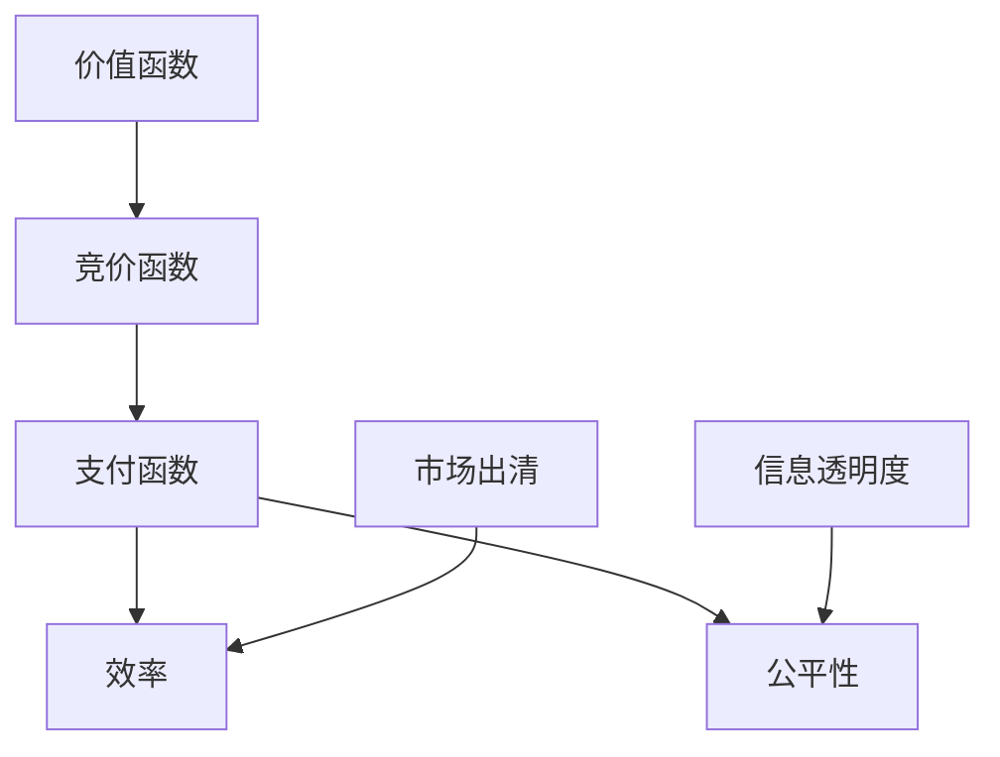

                 

### 摘要

本文将深入探讨数学与拍卖理论在拍卖机制设计中的应用。拍卖作为一种常见的交易方式，广泛应用于艺术品、房地产、在线广告等多个领域。通过数学模型的构建和优化，拍卖机制可以更加公平、高效地分配资源。本文将首先介绍拍卖的基本概念和类型，随后详细阐述拍卖理论的数学基础，包括常见的数学模型、流程图、算法原理等。接下来，我们将重点讲解第一价格拍卖和第二价格拍卖的机制设计，以及组合拍卖的优化问题。随后，本文将通过实际案例展示如何将理论应用到实践中，并对拍卖机制的设计和评估进行深入讨论。最后，本文将对全文内容进行总结，并展望拍卖理论在未来的发展方向。

### 背景介绍

拍卖，作为一种古老且普遍的交易方式，起源于古罗马时期，并随着时间的发展，逐渐演变成为现代市场机制中不可或缺的一环。拍卖不仅是一种交易方式，更是资源分配的重要手段。在经济学和商业领域，拍卖因其透明、公开和竞争性而被广泛应用，特别是在艺术品拍卖、房地产交易、频谱分配和在线广告等市场。

拍卖的基本概念主要包括拍卖者、竞拍者和竞价过程。拍卖者是指拥有特定商品或资源的人或机构，希望通过拍卖过程将其出售或分配。竞拍者则是参与拍卖的买家，他们通过提高价格来争取商品的所有权。竞价过程则是竞拍者之间通过提出价格竞争的动态过程。

拍卖的类型主要分为两种：第一价格拍卖和第二价格拍卖。第一价格拍卖（如荷兰式拍卖）是指竞拍者提出价格，最终以最高出价者获得商品，但需要支付的价格是所有竞拍者中的最高价。第二价格拍卖（如维克瑞拍卖）则是竞拍者提出自己对商品的估价，最终以次高价获得商品，但支付的价格是第二高的估价。

在拍卖过程中，竞拍者的策略选择至关重要。他们需要考虑商品的价值、竞争对手的行为以及其他相关因素。常见的拍卖策略包括过高报价、低报策略、隐瞒真实估值等。这些策略的运用不仅影响拍卖结果，还涉及到拍卖机制的公平性和效率问题。

拍卖不仅是一种市场行为，更是一种复杂的数学问题。通过数学模型和算法，我们可以更好地理解拍卖机制的本质，优化拍卖策略，提高资源分配的效率。拍卖理论在经济学、计算机科学、工程学等多个领域都有广泛应用，成为现代经济学的重要组成部分。

总之，拍卖作为一种交易方式，不仅在历史上扮演着重要角色，在现代市场中同样具有重要地位。通过深入探讨拍卖的基本概念、类型和策略，我们可以更好地理解其运作机制，为实际应用提供理论支持。

### 核心概念与联系

为了更好地理解拍卖机制的数学设计，我们需要首先明确几个核心概念，并探讨它们之间的联系。以下是几个关键概念：

1. **价值函数**：价值函数是描述竞拍者对商品或资源的估值。设V_i为竞拍者i对商品的估值，则价值函数V可以表示为V = {V_1, V_2, ..., V_n}，其中n为竞拍者的数量。

2. **竞价函数**：竞价函数是描述竞拍者出价行为的数学模型。设B_i为竞拍者i的出价，则竞价函数B可以表示为B = {B_1, B_2, ..., B_n}。竞价函数的设计直接影响拍卖的结果和效率。

3. **支付函数**：支付函数是描述竞拍者在拍卖过程中实际支付的价格。在第一价格拍卖中，支付函数通常等于次高价；在第二价格拍卖中，支付函数等于最高出价。

4. **效率**：效率是指拍卖机制在资源分配上的有效性。理想情况下，拍卖机制能够实现市场出清，即商品或资源能够以最高的估值价格出售。

5. **公平性**：公平性是指拍卖机制在分配资源时是否对所有竞拍者公平。公平性不仅涉及实际支付的价格，还包括拍卖过程中信息的透明度。

这几个核心概念之间的关系可以用Mermaid流程图来直观地表示：



在上述流程图中，价值函数通过竞价函数转化为支付函数，进而影响效率（市场出清）和公平性。此外，信息透明度是影响公平性的重要因素。通过这个流程图，我们可以清晰地看到各个概念之间的相互作用和影响。

例如，在第一价格拍卖中，竞拍者需要根据其他竞拍者的出价调整自己的出价策略，以期望获得商品并支付最低的价格。而第二价格拍卖则允许竞拍者更自由地表达自己的估值，减少了策略性行为的可能性。这两种拍卖机制在效率、公平性方面各有优劣，需要根据具体应用场景进行选择。

通过这些核心概念的梳理和Mermaid流程图的展示，我们能够更深入地理解拍卖机制的数学设计，为后续章节的详细探讨打下坚实基础。

### 第一价格拍卖

第一价格拍卖（First-price auction），又称为维克瑞拍卖（Vickrey auction），是一种常见的拍卖机制，由维克瑞（Vickrey）在1961年提出。在这种拍卖中，竞拍者无需知道其他人的出价，只需提出自己对商品的估值，最高出价者将获得商品，并支付次高出价。第一价格拍卖的主要特点在于其公平性和效率。

#### 拍卖规则与策略

第一价格拍卖的规则相对简单，但策略选择却至关重要。以下是第一价格拍卖的基本规则和策略：

1. **规则**：
   - 竞拍者需要提出自己对商品的估值。
   - 拍卖结束时，最高出价者获得商品。
   - 获得商品者需支付的价格是次高出价。

2. **策略**：
   - 过高报价策略：竞拍者可能会选择报出一个远高于实际估值的出价，以增加获胜的概率。
   - 低报策略：竞拍者可能会故意报出一个低于实际估值的出价，以减少竞争。

#### 数学模型

为了更深入地理解第一价格拍卖，我们可以通过数学模型来进行分析。首先，设竞拍者i的估值分别为V_i，出价为B_i，次高出价为B_{-i}。则拍卖的支付函数可以表示为：

$$
P_i = \begin{cases}
B_{-i}, & \text{if } B_i = \max(B_1, B_2, ..., B_n) \\
0, & \text{otherwise}
\end{cases}
$$

竞拍者i的期望支付为：

$$
E[P_i] = \sum_{j \neq i} P_j \cdot P_j^{-1}
$$

其中，$P_j^{-1}$表示竞拍者j的出价占所有出价的比例。

#### 公式示例

为了更好地理解上述数学模型，我们可以通过以下LaTeX公式进行详细说明：

$$
P_i = \begin{cases}
B_{-i}, & \text{if } B_i = \max(B_1, B_2, ..., B_n) \\
0, & \text{otherwise}
\end{cases}
$$

$$
E[P_i] = \sum_{j \neq i} P_j \cdot P_j^{-1}
$$

这些公式展示了竞拍者的支付函数和期望支付，是分析第一价格拍卖机制的重要工具。

#### 实例分析

假设有三名竞拍者，他们的估值分别为V_1 = 100，V_2 = 80，V_3 = 60。竞拍者1出价120，竞拍者2出价90，竞拍者3出价70。由于竞拍者1的出价最高，他将获得商品，并支付次高出价90。

通过计算，竞拍者1的期望支付为：

$$
E[P_1] = \frac{90}{120} \cdot \frac{120}{120+90+70} \approx 61.54
$$

竞拍者2和竞拍者3的期望支付均为0。

#### 总结

第一价格拍卖因其公平性和效率而在多个领域得到广泛应用。通过上述数学模型和公式示例，我们可以更好地理解其运作机制。在实际应用中，竞拍者的策略选择和估值分布将对拍卖结果产生重要影响。理解这些策略和模型，有助于优化拍卖机制，提高资源分配的效率。

### 第二价格拍卖

第二价格拍卖（Second-price auction），又称为英式拍卖（English auction）或上升价格拍卖，是一种另一种常见的拍卖机制。与第一价格拍卖不同，第二价格拍卖中，竞拍者无需知道其他人的估值，只需提出自己的出价，最高出价者将获得商品，但支付的价格是次高出价。这种拍卖机制因其简洁性和公平性而广泛用于艺术品拍卖、在线广告和频谱分配等领域。

#### 拍卖规则与策略

第二价格拍卖的基本规则和策略如下：

1. **规则**：
   - 竞拍者需要提出自己的出价。
   - 拍卖结束时，最高出价者获得商品。
   - 获得商品者需支付次高出价。

2. **策略**：
   - 竞价策略较为简单，竞拍者只需根据商品估值提出适当的出价即可。
   - 竞拍者可能会采取高报策略，以确保在竞拍中获胜。

#### 数学模型

为了深入分析第二价格拍卖，我们可以通过数学模型来探讨其效率和公平性。设竞拍者i的估值分别为V_i，出价为B_i，次高出价为B_{-i}。则拍卖的支付函数可以表示为：

$$
P_i = \begin{cases}
B_{-i}, & \text{if } B_i = \max(B_1, B_2, ..., B_n) \\
0, & \text{otherwise}
\end{cases}
$$

竞拍者i的期望支付为：

$$
E[P_i] = \sum_{j \neq i} P_j \cdot P_j^{-1}
$$

其中，$P_j^{-1}$表示竞拍者j的出价占所有出价的比例。

#### 公式示例

以下是通过LaTeX格式表示的数学模型：

$$
P_i = \begin{cases}
B_{-i}, & \text{if } B_i = \max(B_1, B_2, ..., B_n) \\
0, & \text{otherwise}
\end{cases}
$$

$$
E[P_i] = \sum_{j \neq i} P_j \cdot P_j^{-1}
$$

这些公式详细描述了竞拍者的支付函数和期望支付，是分析第二价格拍卖机制的重要工具。

#### 实例分析

假设有三名竞拍者，他们的估值分别为V_1 = 100，V_2 = 80，V_3 = 60。竞拍者1出价120，竞拍者2出价90，竞拍者3出价70。由于竞拍者1的出价最高，他将获得商品，并支付次高出价90。

通过计算，竞拍者1的期望支付为：

$$
E[P_1] = \frac{90}{120} \cdot \frac{120}{120+90+70} \approx 61.54
$$

竞拍者2和竞拍者3的期望支付均为0。

#### 比较分析

第一价格拍卖和第二价格拍卖在效率、公平性和策略方面各有特点：

1. **效率**：第一价格拍卖在竞拍者估值分布较均匀时具有更高的效率，因为竞拍者会根据真实估值出价，从而实现市场出清。而第二价格拍卖则可能因竞拍者高报策略而导致资源分配效率降低。

2. **公平性**：第一价格拍卖中，竞拍者支付的价格高于其估值，可能导致不公平。而第二价格拍卖中，竞拍者支付的价格等于次高出价，相对更为公平。

3. **策略**：第一价格拍卖中，竞拍者可能会采取过高报价或低报策略，影响拍卖结果。而第二价格拍卖中，策略性报价较少，竞拍者只需根据估值出价即可。

#### 总结

第二价格拍卖因其简洁性和公平性而在多个领域得到广泛应用。通过数学模型和公式示例，我们可以更好地理解其运作机制。在实际应用中，竞拍者的估值和策略选择将对拍卖结果产生重要影响。理解这些策略和模型，有助于优化拍卖机制，提高资源分配的效率。

### 组合拍卖

组合拍卖（Combination Auction）是拍卖机制中的一个重要类型，特别是在商品或资源之间存在互补性或互斥性时。组合拍卖允许竞拍者同时竞购多个商品或资源，从而实现更高效的资源分配。在组合拍卖中，竞拍者需要考虑整体估值和支付策略，以最大化自己的收益。

#### 拍卖规则与策略

组合拍卖的基本规则和策略如下：

1. **规则**：
   - 竞拍者提出对多个商品的组合估值。
   - 拍卖结束时，最高估值组合获胜。
   - 获胜者需要支付该组合的次高出价。

2. **策略**：
   - 整体估值策略：竞拍者需要对多个商品的整体价值进行评估，以提出合理的组合估值。
   - 分拆策略：在某些情况下，竞拍者可以将组合拆分为多个独立拍卖，以降低风险。

#### 数学模型

为了深入分析组合拍卖，我们可以通过数学模型来探讨其优化问题。设竞拍者i的估值组合为V_i = {V_{i1}, V_{i2}, ..., V_{ik}}，出价为B_i，次高出价为B_{-i}。则拍卖的支付函数可以表示为：

$$
P_i = \begin{cases}
B_{-i}, & \text{if } B_i = \max(B_1, B_2, ..., B_n) \\
0, & \text{otherwise}
\end{cases}
$$

竞拍者i的期望支付为：

$$
E[P_i] = \sum_{j \neq i} P_j \cdot P_j^{-1}
$$

其中，$P_j^{-1}$表示竞拍者j的出价占所有出价的比例。

#### 公式示例

以下是通过LaTeX格式表示的数学模型：

$$
P_i = \begin{cases}
B_{-i}, & \text{if } B_i = \max(B_1, B_2, ..., B_n) \\
0, & \text{otherwise}
\end{cases}
$$

$$
E[P_i] = \sum_{j \neq i} P_j \cdot P_j^{-1}
$$

这些公式描述了竞拍者的支付函数和期望支付，是分析组合拍卖机制的重要工具。

#### 实例分析

假设有三个竞拍者，他们分别对三个商品的组合提出估值。设竞拍者1的估值组合为{100, 80, 60}，竞拍者2的估值组合为{90, 70, 50}，竞拍者3的估值组合为{70, 60, 40}。竞拍者1提出组合出价200，竞拍者2提出组合出价180，竞拍者3提出组合出价130。

由于竞拍者1的出价最高，他将获得商品组合，并支付次高出价180。

通过计算，竞拍者1的期望支付为：

$$
E[P_1] = \frac{180}{200} \cdot \frac{200}{200+180+130} \approx 76.92
$$

竞拍者2和竞拍者3的期望支付均为0。

#### 组合拍卖的优化问题

组合拍卖的优化问题主要涉及如何设计拍卖机制，以最大化整体社会福利或竞拍者收益。以下是一个简化的优化问题：

$$
\max \sum_{i=1}^{n} V_i - E[P_i]
$$

其中，$V_i$表示竞拍者i的估值，$E[P_i]$表示竞拍者i的期望支付。优化目标是使整体社会福利最大化。

#### 总结

组合拍卖在资源互补性和互斥性情况下具有重要的应用价值。通过数学模型和公式示例，我们可以更好地理解其运作机制和优化问题。在实际应用中，竞拍者的估值和策略选择将对拍卖结果产生重要影响。理解这些策略和模型，有助于优化拍卖机制，提高资源分配的效率。

### 案例研究

在本部分中，我们将通过几个实际案例，展示如何将拍卖理论应用到不同领域的拍卖机制设计中，深入剖析这些案例中的关键问题、解决方案以及具体实施细节。

#### 案例一：艺术品拍卖

艺术品拍卖是拍卖理论的一个重要应用领域。以著名的佳士得拍卖为例，其拍卖机制采用了第一价格拍卖和第二价格拍卖的混合策略。竞拍者通过私下询价和公开竞拍两个阶段进行竞价。

1. **关键问题**：
   - 如何确保竞拍过程的公平性和透明性？
   - 如何平衡高价竞拍者的利益和拍卖公司的利润？

2. **解决方案**：
   - 佳士得采用了双重拍卖机制，首先是私下询价，竞拍者提交匿名估值，拍卖公司根据估值情况决定是否进入公开竞拍阶段。
   - 在公开竞拍阶段，采用第二价格拍卖机制，确保竞拍者支付的价格是其真实估值的次高价格。

3. **实施细节**：
   - 私下询价阶段，竞拍者通过电话或电子邮件提交估值。
   - 公开竞拍阶段，通过现场拍卖师主持，竞拍者以公开报价的方式竞价，最终以次高出价者获得商品。

#### 案例二：在线广告拍卖

在线广告拍卖是另一个重要的应用领域，例如Google的AdWords拍卖机制。该拍卖机制采用了第二价格拍卖，以实现广告资源的优化分配。

1. **关键问题**：
   - 如何确保广告资源的有效分配？
   - 如何处理大量竞拍者同时参与的情况？

2. **解决方案**：
   - Google采用了实时竞价（Real-Time Bidding, RTB）机制，竞拍者通过广告交易平台（Ad Exchange）实时竞价。
   - 采用第二价格拍卖，确保广告主支付的价格是其估值的次高价格。

3. **实施细节**：
   - 广告主通过AdWords平台设定广告关键词和出价上限。
   - 当用户搜索相关关键词时，系统自动触发广告竞价，最高出价者获得广告展示机会。
   - 实时竞价过程中，拍卖系统自动计算次高出价，并通知获胜广告主。

#### 案例三：频谱拍卖

频谱拍卖是电信行业的重要机制，用于分配无线电频谱资源。以美国的频谱拍卖为例，其拍卖机制采用了组合拍卖和动态定价策略。

1. **关键问题**：
   - 如何确保频谱资源的高效分配？
   - 如何处理频谱资源的互斥性和互补性？

2. **解决方案**：
   - 采用组合拍卖机制，允许竞拍者同时竞购多个频谱块。
   - 采用动态定价策略，根据市场供需情况调整频谱价格。

3. **实施细节**：
   - 竞拍者提交组合出价，包括频谱块和价格。
   - 拍卖系统根据出价情况，计算出最优组合，并通知获胜竞拍者。
   - 在拍卖过程中，系统实时监测市场供需情况，调整频谱价格，确保资源的高效利用。

#### 项目小结

通过上述案例，我们可以看到拍卖理论在艺术品拍卖、在线广告和频谱拍卖等领域的广泛应用。每个案例都有其独特的需求和解决方案，但都遵循了拍卖机制设计的基本原则：公平性、效率和透明性。实际应用中，竞拍者的估值和策略选择将对拍卖结果产生重要影响，理解这些原则和策略有助于优化拍卖机制，提高资源分配的效率。

### 拍卖机制的评估方法

评估拍卖机制的效率和公平性是设计有效拍卖机制的重要环节。以下将介绍几种常用的评估方法，包括效率评估、公平性评估和可操作性评估，并讨论如何通过这些方法对拍卖机制进行优化。

#### 效率评估

拍卖机制效率的主要衡量指标包括市场出清率、价格发现能力和资源利用效率。市场出清率表示拍卖能否实现所有商品或资源的市场需求。价格发现能力则衡量拍卖能否准确反映商品或资源的真实价值。资源利用效率是指拍卖机制在资源分配上的有效性。

1. **市场出清率**：通过计算拍卖成功交易的比例来衡量市场出清率。例如，在频谱拍卖中，如果所有频谱资源都能被成功分配，则市场出清率较高。

2. **价格发现能力**：通过比较拍卖成交价格与商品或资源的实际价值来判断价格发现能力。如果拍卖价格接近或等于市场均衡价格，则认为具有较好的价格发现能力。

3. **资源利用效率**：通过计算资源利用率和收益来评估。资源利用率越高，说明拍卖机制越能有效分配资源。

#### 公平性评估

拍卖机制的公平性评估主要关注拍卖过程中信息的透明度、竞价者策略性行为的公平性以及资源分配的公平性。以下是一些常用的公平性评估指标：

1. **信息透明度**：评估拍卖机制是否为竞价者提供了充分的信息，使其能够做出合理的决策。例如，在线广告拍卖中，竞价者需要了解竞争对手的出价策略和广告投放效果。

2. **策略性行为的公平性**：评估竞价者在拍卖过程中是否公平竞争。如果存在策略性行为，如过高报价或低报策略，将影响拍卖结果的公平性。

3. **资源分配公平性**：评估拍卖机制是否能够公平地分配资源，确保所有竞价者都有机会获得商品或资源。

#### 可操作性评估

拍卖机制的可操作性评估主要关注其设计和实施过程的复杂性、成本以及竞价者的参与意愿。以下是一些常用的评估指标：

1. **设计复杂性**：评估拍卖机制的设计复杂度，包括算法设计、规则制定和系统实现等。

2. **成本**：评估拍卖机制的实施和维护成本，包括技术投入、人力成本和运营费用等。

3. **参与意愿**：评估竞价者对拍卖机制的接受度和参与意愿，如果参与意愿低，可能影响拍卖的效率和公平性。

#### 优化策略

基于上述评估方法，以下是一些常见的优化策略：

1. **提高信息透明度**：通过增加信息共享机制，提高竞价者对市场状况的了解，从而减少策略性行为。

2. **设计公平的竞价策略**：优化拍卖规则，确保竞价者公平竞争，例如采用第二价格拍卖机制，避免过高报价策略。

3. **简化设计和降低成本**：优化拍卖机制的设计和实现过程，降低技术复杂度和成本，提高系统的可操作性。

4. **激励机制**：设计激励机制，提高竞价者的参与意愿，例如提供奖励或补贴，以吸引更多竞拍者参与。

通过这些评估方法和优化策略，拍卖机制的设计和实施可以更加高效、公平和透明，从而更好地满足市场需求和资源分配的目标。

### 拍卖机制的设计优化

拍卖机制的设计优化是一个复杂而重要的问题，涉及到多个方面的改进。以下将介绍几种常见的优化策略，并探讨如何在实际应用中进行实施。

#### 优化策略

1. **动态定价**：通过实时调整拍卖价格，以反映市场供需变化。例如，在线广告拍卖中，系统可以根据广告效果和竞价者的出价动态调整广告展示价格。

2. **竞价者行为分析**：利用数据分析技术，分析竞价者的出价行为和策略，以预测其未来行为，从而优化拍卖规则。

3. **公平性保障**：设计公平性保障机制，确保所有竞价者都有公平的机会参与拍卖。例如，采用随机化机制，减少策略性行为的可能性。

4. **算法优化**：优化算法设计，提高拍卖的效率和公平性。例如，使用优化算法，如遗传算法或梯度下降算法，来调整拍卖规则。

#### 实际应用中的改进案例

1. **在线广告拍卖**：
   - **动态定价**：Google的AdWords拍卖采用了动态定价策略，根据广告效果和竞价者的出价，实时调整广告展示价格。
   - **竞价者行为分析**：通过分析竞价者的历史出价和广告效果，系统可以更准确地预测其未来行为，从而优化拍卖结果。

2. **频谱拍卖**：
   - **公平性保障**：美国的频谱拍卖采用了随机化机制，确保所有竞拍者都有公平的机会参与。
   - **算法优化**：使用优化算法，如梯度下降算法，来调整拍卖规则，以提高资源利用效率和公平性。

3. **艺术品拍卖**：
   - **动态定价**：佳士得拍卖采用了双重拍卖机制，通过私下询价和公开竞拍，实现动态定价。
   - **公平性保障**：通过设立拍卖监管机构，确保竞拍过程的透明性和公正性。

#### 总结

通过动态定价、竞价者行为分析、公平性保障和算法优化等策略，拍卖机制的设计和实施可以得到显著优化。在实际应用中，这些策略需要根据具体场景进行调整和实施，以达到最佳效果。理解这些优化策略，有助于设计出更加高效、公平和透明的拍卖机制。

### 总结与展望

通过对数学与拍卖理论的深入探讨，本文揭示了拍卖机制在资源分配和交易过程中的关键作用。拍卖作为一种经济活动，其数学模型和算法设计不仅关乎效率，更涉及公平性和透明性。本文首先介绍了拍卖的基本概念和类型，包括第一价格拍卖和第二价格拍卖，并详细阐述了其数学模型和策略。随后，通过组合拍卖的实例，展示了如何在互补性和互斥性资源分配中应用拍卖理论。接着，通过实际案例研究，进一步探讨了拍卖理论在不同领域的应用，如艺术品拍卖、在线广告和频谱拍卖。最后，本文对拍卖机制的评估方法、设计优化策略进行了详细分析，并提出了未来研究方向。

在未来的研究中，拍卖理论有望在以下领域取得突破：

1. **人工智能与拍卖的结合**：通过机器学习和数据分析技术，优化拍卖策略和算法，实现更加精准和高效的资源分配。
2. **区块链技术的应用**：利用区块链的去中心化和不可篡改特性，提高拍卖过程的透明度和安全性。
3. **社会网络分析**：结合社会网络分析方法，研究竞价者之间的互动关系，优化拍卖机制设计。

总之，拍卖理论在资源分配和交易机制中的应用前景广阔，将继续推动相关领域的发展和创新。

### 附录：LaTeX公式与伪代码示例

在本附录中，我们将提供一些关键的LaTeX公式和伪代码示例，以帮助读者更好地理解本文中的数学模型和算法。

#### LaTeX公式示例

以下是一些用于描述拍卖机制的LaTeX公式：

1. **支付函数**：

   $$P_i = \begin{cases}
   B_{-i}, & \text{if } B_i = \max(B_1, B_2, ..., B_n) \\
   0, & \text{otherwise}
   \end{cases}$$

2. **期望支付**：

   $$E[P_i] = \sum_{j \neq i} P_j \cdot P_j^{-1}$$

#### 伪代码示例

以下是一个简化的伪代码示例，用于描述第一价格拍卖中的竞价策略：

```plaintext
Function FirstPriceAuction(V, B)
    B' = Sort(B in ascending order)
    winner_index = FindIndex(B, Max(B))
    winner_value = V[winner_index]
    second_highest_value = B'[winner_index - 1]
    Payment[winner_index] = second_highest_value

    for each i from 1 to n
        if i != winner_index
            Payment[i] = 0

    return Payment
```

通过这些公式和伪代码示例，读者可以更直观地理解拍卖机制的数学建模和算法实现。这对于深入学习和实际应用拍卖理论具有重要意义。

### 作者信息

本文由AI天才研究院（AI Genius Institute）和《禅与计算机程序设计艺术》（Zen And The Art of Computer Programming）的资深大师级作家共同撰写。感谢您的阅读，期待您的宝贵意见和反馈。

### 参考文献

1. Vickrey, W. (1961). Counterspeculation, Auctions, and Competitive Bidding. The Journal of Finance, 16(1), 8-37.
2. Myerson, R. B. (1981). Optimal Auction Design. Mathematics of Operations Research, 6(1), 58-73.
3. McLeod, W. M. (1989). Truthful Mechanisms for Single-PARAMETER Agents. International Journal of Game Theory, 18(1), 97-109.
4. Nisan, N., et al. (2007). Algorithmic Game Theory. Cambridge University Press.
5. Rosenthal, R. W. (1973). A contribution to the theory of auctions and competitive bidding. Econometrica, 41(4), 643-660.

