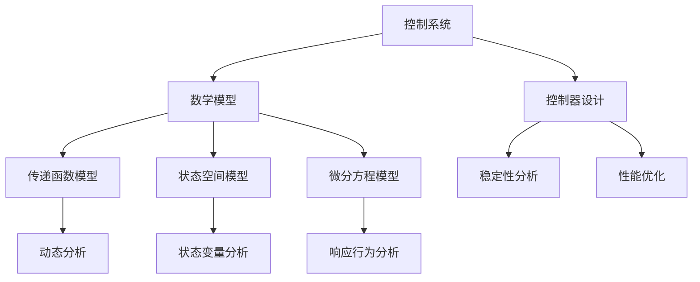
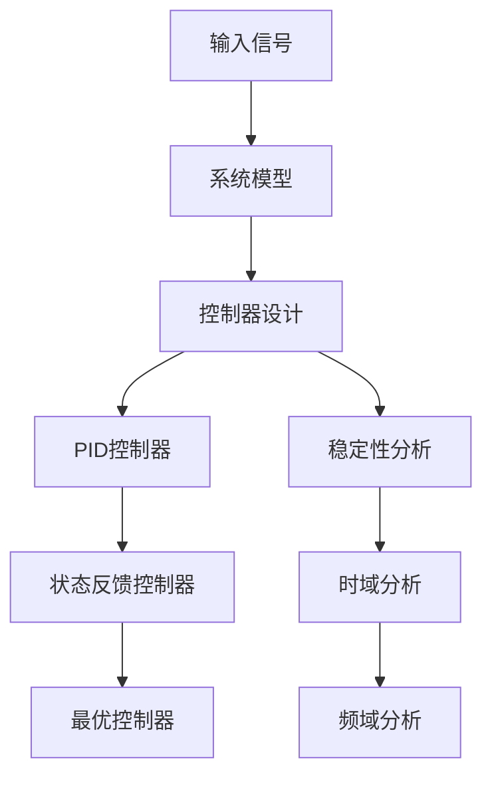

                 

### 文章标题

《数学与控制工程：反馈系统的数学描述》

### 文章关键词

- 数学
- 控制工程
- 反馈系统
- 数学模型
- 状态空间表示法
- 控制器设计
- 稳定性分析

### 文章摘要

本文深入探讨了数学与控制工程领域的紧密联系，特别是反馈系统的数学描述。文章首先介绍了控制工程的基本概念，然后详细阐述了反馈系统在数学中的表达形式。通过数学模型和状态空间表示法，我们能够更清晰地理解控制系统的结构和行为。此外，文章还介绍了控制器设计和稳定性分析的核心原理，并通过实际项目案例展示了这些理论在实践中的应用。最后，文章总结了数学与控制工程的前沿趋势，并对未来进行了展望。

## 引言

控制工程是一门应用数学、物理学和工程学原理来设计、实现和控制系统的科学。其核心目标是通过适当的控制策略，使系统达到预期的行为和性能。而数学则是控制工程的基础工具，提供了精确的描述和严格的推理方法。特别是在反馈系统的数学描述方面，数学模型和公式成为理解和分析控制系统的关键。

在控制工程中，反馈系统是一种常见且重要的系统结构。它通过将系统的输出与预期目标进行比较，然后产生一个控制信号来调整系统的输入，以实现预期的性能。这种闭环控制系统具有自我调节和自适应能力，可以在扰动和不确定性的环境下保持系统的稳定性和性能。

本文将围绕反馈系统的数学描述展开，通过以下几个部分进行详细讨论：

1. **核心概念与联系**：介绍控制系统的基本概念，并探讨数学在控制系统中的应用。
2. **数学模型**：阐述线性时不变系统的数学描述，包括状态空间表示法。
3. **控制器设计**：讲解控制器设计和稳定性分析的核心原理。
4. **项目实战**：通过实际案例展示数学模型和控制理论在实践中的应用。
5. **前沿与展望**：探讨数学与控制工程领域的最新进展和应用趋势。

通过本文的讨论，读者将能够深入理解数学与控制工程的紧密联系，掌握反馈系统数学描述的核心原理，并在实际项目中应用这些理论。

## 第1章 核心概念与联系

### 控制系统的基本概念

控制系统是指能够接受输入信号并产生输出信号的装置或系统，其目的是通过适当的控制策略，使输出信号达到预期的目标。控制系统可以分为两大类：开环控制系统和闭环控制系统。

**开环控制系统**：开环控制系统没有反馈回路，其输出不受到前级输入的反馈调节。这种系统的控制策略简单，但抗干扰能力较弱，容易受到外部扰动的影响。例如，简单的恒温控制器就是一个典型的开环控制系统，它通过设定温度值来调节加热器的开关，但无法适应环境温度的变化。

**闭环控制系统**：闭环控制系统通过将输出信号与期望值进行比较，产生一个误差信号，并通过控制器对输入信号进行调节，从而实现对系统的精确控制。闭环控制系统具有自我调节和自适应能力，能够更好地应对外部扰动和系统内部变化。例如，自动空调系统就是一个典型的闭环控制系统，它通过传感器实时监测室内温度，并根据设定温度与实际温度之间的误差进行加热或制冷控制。

### 数学在控制系统中的应用

数学在控制系统的设计和分析中起着至关重要的作用。它提供了精确的描述和严格的推理方法，使控制系统的设计更加科学和高效。

**数学模型**：数学模型是控制系统设计的基础。通过建立数学模型，我们可以将控制系统的物理特性转化为数学方程，从而进行定量分析和设计。常见的数学模型包括传递函数模型、状态空间模型和微分方程模型。这些模型能够描述系统在不同输入下的响应行为，为控制器设计提供了依据。

**线性代数**：线性代数在控制系统分析中有着广泛的应用。特别是状态空间表示法，它将控制系统看作一个动态系统，用矩阵形式描述系统的状态变量和输入输出关系。状态空间表示法不仅适用于线性系统，还可以扩展到非线性系统，为复杂系统的分析和设计提供了强有力的工具。

**微积分**：微积分在控制系统的动态分析和优化中发挥着重要作用。通过微分方程，我们可以描述系统的动态行为，分析系统的稳定性、响应速度和调节性能。此外，微积分中的优化理论还可以用于控制器的设计和参数优化，以提高系统的性能和鲁棒性。

### 控制系统中的反馈

反馈是控制系统中一个核心的概念，它通过将输出信号与期望值进行比较，产生误差信号，进而调整输入信号，实现对系统的控制。反馈可以分为正反馈和负反馈。

**正反馈**：正反馈是指输出信号的一部分被送回到输入端，以增强系统的输出。正反馈通常用于振荡器和增幅器等系统中，但它可能会导致系统的不稳定。例如，在化学实验中，通过正反馈来放大反应物的浓度，以达到预期的化学反应效果。

**负反馈**：负反馈是指输出信号的一部分被送回到输入端，以抵消系统的误差，使其趋于稳定。负反馈是闭环控制系统中常用的一种反馈方式，它能够提高系统的稳定性和鲁棒性。例如，在温度控制系统中，通过测量实际温度并与设定温度进行比较，调整加热器的功率，使系统温度保持恒定。

### 数学模型与控制系统的关系架构

为了更好地理解数学模型在控制系统中的作用，我们可以使用Mermaid流程图来描述其关系架构。



通过上述Mermaid流程图，我们可以看到数学模型在控制系统中的关键作用。传递函数模型、状态空间模型和微分方程模型分别用于描述系统的动态行为，为控制器设计提供了理论依据。同时，这些模型还用于动态分析、状态变量分析和响应行为分析，为控制系统性能的优化提供了指导。

## 第2章 控制系统的数学模型

### 线性时不变系统的数学描述

在控制工程中，线性时不变系统（Linear Time-Invariant System，简称LTI系统）是一个重要的研究对象。LTI系统具有以下几个特点：

1. **线性性**：系统满足叠加原理和齐次性。即，对于任意两个输入信号 \( x_1(t) \) 和 \( x_2(t) \)，以及任意两个输出信号 \( y_1(t) \) 和 \( y_2(t) \)，系统的输出满足：
   \[
   y(t) = Cx(t) + D
   \]
   其中，\( C \) 和 \( D \) 是常数矩阵。

2. **时不变性**：系统的特性不随时间变化。即，如果输入信号 \( x(t) \) 产生输出信号 \( y(t) \)，则对于任意时间 \( t_0 \)，输入信号 \( x(t - t_0) \) 产生的输出信号 \( y(t - t_0) \) 与 \( y(t) \) 相同。

LTI系统在控制工程中具有广泛的应用，因为许多实际系统在一定的操作范围内都可以近似为线性时不变系统。

### 状态空间表示法

状态空间表示法是描述LTI系统的常用数学方法，它能够全面、直观地表达系统的动态行为。状态空间表示法使用以下三个关键方程：

1. **状态方程**：
   \[
   \dot{x}(t) = Ax(t) + Bu(t)
   \]
   其中，\( x(t) \) 是系统的状态向量，\( u(t) \) 是系统的输入向量，\( A \) 是系统矩阵，\( B \) 是输入矩阵。

2. **输出方程**：
   \[
   y(t) = Cx(t) + Du(t)
   \]
   其中，\( y(t) \) 是系统的输出向量，\( C \) 是输出矩阵，\( D \) 是直接传输矩阵。

通过状态方程和输出方程，我们可以描述系统的动态行为。状态方程描述了系统状态的演化规律，输出方程描述了系统输出与状态之间的关系。

### 状态空间表示法的示例

假设一个LTI系统的状态向量 \( x(t) \) 由两个状态变量 \( x_1(t) \) 和 \( x_2(t) \) 组成，输入向量 \( u(t) \) 是一个标量输入。系统矩阵 \( A \)、输入矩阵 \( B \) 和输出矩阵 \( C \) 分别为：

\[
A = \begin{bmatrix}
-1 & 2 \\
-1 & 0
\end{bmatrix}, \quad
B = \begin{bmatrix}
1 \\
0
\end{bmatrix}, \quad
C = \begin{bmatrix}
1 & 0
\end{bmatrix}
\]

直接传输矩阵 \( D \) 为零矩阵。

状态方程为：
\[
\dot{x}(t) = \begin{bmatrix}
-1 & 2 \\
-1 & 0
\end{bmatrix} x(t) + \begin{bmatrix}
1 \\
0
\end{bmatrix} u(t)
\]

输出方程为：
\[
y(t) = \begin{bmatrix}
1 & 0
\end{bmatrix} x(t) + \begin{bmatrix}
0
\end{bmatrix} u(t)
\]

### 状态空间表示法的特点

状态空间表示法具有以下特点：

1. **灵活性**：状态空间表示法能够处理多种类型的系统，包括线性系统、非线性系统、时变系统和多输入多输出系统。通过选择合适的状态变量，可以更好地描述系统的动态行为。

2. **直观性**：状态空间表示法使用矩阵形式描述系统的状态演化规律和输入输出关系，使得系统的分析和设计更加直观和系统化。

3. **适用性**：状态空间表示法不仅适用于理论研究，还可以应用于实际工程中的系统设计和仿真。

### Mermaid流程图

为了更直观地理解状态空间表示法，我们可以使用Mermaid流程图来描述其关系架构。

```mermaid
graph TB
A[输入信号 u(t)] --> B[系统矩阵 A]
B --> C[状态方程]
C --> D[状态向量 x(t)]
D --> E[输出矩阵 C]
E --> F[输出信号 y(t)]
```

通过上述流程图，我们可以看到输入信号通过系统矩阵 \( A \) 和输入矩阵 \( B \) 对状态向量 \( x(t) \) 进行演化，最终通过输出矩阵 \( C \) 产生输出信号 \( y(t) \)。

### 状态空间表示法的总结

状态空间表示法是线性时不变系统的重要数学描述工具。通过状态方程和输出方程，我们可以全面地描述系统的动态行为和输入输出关系。状态空间表示法的灵活性和直观性，使得它成为控制工程中分析和设计系统的重要手段。

## 第3章 控制系统的分析与设计

### 控制器设计

控制器设计是控制系统设计中的核心环节，其目标是确保系统在给定输入信号下能够实现预期的性能。控制器设计的方法和策略多种多样，常见的有PID控制器、状态反馈控制器和最优控制器等。下面我们将详细探讨这些控制器的设计原理。

#### PID控制器

PID控制器（Proportional-Integral-Derivative Controller）是一种常用的控制器，其控制策略基于系统的误差信号（即期望值与实际值之差）。PID控制器由三个部分组成：比例（Proportional）、积分（Integral）和微分（Derivative）。

1. **比例控制**：比例控制根据当前误差值 \( e(t) \) 来产生控制信号 \( u(t) \)。比例控制能够快速响应误差的变化，但其输出可能存在稳态误差。

   \[
   u(t) = K_p e(t)
   \]

   其中，\( K_p \) 是比例增益。

2. **积分控制**：积分控制根据误差信号的积分值来产生控制信号。积分控制能够消除稳态误差，提高系统的精确度。

   \[
   u(t) = u(t-1) + K_i \int_{0}^{t} e(\tau) d\tau
   \]

   其中，\( K_i \) 是积分增益。

3. **微分控制**：微分控制根据误差信号的变化率来产生控制信号。微分控制能够预测误差的变化趋势，提高系统的响应速度。

   \[
   u(t) = u(t-1) + K_d \frac{de(t)}{dt}
   \]

   其中，\( K_d \) 是微分增益。

PID控制器的整体控制策略为：

\[
u(t) = K_p e(t) + K_i \int_{0}^{t} e(\tau) d\tau + K_d \frac{de(t)}{dt}
\]

#### 状态反馈控制器

状态反馈控制器（State Feedback Controller）利用系统的状态信息来设计控制器，其设计目标是最小化系统误差。状态反馈控制器的设计基于以下步骤：

1. **状态观测器设计**：首先，需要设计一个状态观测器来估计系统的状态。状态观测器的目的是在只有输入和输出信号的情况下，准确估计系统的状态。

2. **反馈矩阵设计**：利用估计状态和实际状态，设计一个反馈矩阵 \( K \)，使得闭环系统的极点位于期望的位置，从而满足稳定性要求。

   状态反馈控制器的设计伪代码如下：

   ```python
   # 状态观测器设计
   [A, B] = system_model()  # 获取系统模型
   [L, E] = observability_matrix(A, B)  # 构建可观测矩阵
   Q = desired_state_matrix()  # 定义期望状态矩阵
   K = solve_observability_problem(L, E, Q)  # 解可观测性问题

   # 反馈矩阵设计
   F = Kalman_filter(A, B, C, Q, R)  # 设计卡尔曼滤波器
   K = F.K  # 获取反馈矩阵
   ```

#### 最优控制器

最优控制器（Optimal Controller）是基于最优控制理论设计的控制器，其目标是最小化系统的性能指标。最优控制器的设计通常涉及以下步骤：

1. **性能指标设计**：根据系统的要求和性能目标，设计一个适当的性能指标函数。常见的性能指标有均方误差（MSE）、加权均方误差（WSE）等。

2. **最优控制问题求解**：通过求解最优控制问题，得到最优控制输入信号。最优控制问题的求解通常涉及变分法、动态规划等方法。

   最优控制器的设计伪代码如下：

   ```python
   # 性能指标设计
   J = performance_index(e, y, u)  # 设计性能指标函数

   # 最优控制问题求解
   [u_opt, J_opt] = optimal_control_problem(A, B, C, Q, R, J)  # 求解最优控制问题
   ```

### 稳定性分析

稳定性分析是控制系统设计的重要环节，其目的是确保系统在扰动和不确定性环境下能够保持稳定。稳定性分析的方法包括时域分析和频域分析。

#### 时域分析方法

时域分析方法通过分析系统的状态轨迹和误差响应，判断系统的稳定性。常用的时域分析方法有：

1. **李雅普诺夫稳定性理论**：通过构建李雅普诺夫函数，判断系统的稳定性。李雅普诺夫稳定性理论适用于线性系统和非线性系统。

2. **状态空间稳定性**：通过判断系统矩阵的特征值，确定系统的稳定性。对于线性系统，如果所有特征值的实部都小于零，则系统是稳定的。

#### 频域分析方法

频域分析方法通过分析系统的频率响应，判断系统的稳定性。常用的频域分析方法有：

1. **Nyquist图**：通过绘制Nyquist图，判断系统的稳定性。Nyquist图适用于线性系统。

2. **Bode图**：通过绘制Bode图，分析系统的频率响应特性，判断系统的稳定性。Bode图适用于线性系统。

### 控制系统设计的总结

控制器设计是控制系统设计的核心，其目标是确保系统在给定输入信号下能够实现预期的性能。控制器的设计方法包括PID控制器、状态反馈控制器和最优控制器等。稳定性分析是控制系统设计的重要环节，通过时域分析和频域分析方法，可以判断系统的稳定性。在控制器设计和稳定性分析中，数学模型和数学公式发挥着关键作用，为系统的设计和优化提供了理论基础。

### Mermaid流程图

为了更直观地理解控制器设计的过程，我们可以使用Mermaid流程图来描述。



通过上述流程图，我们可以看到控制器设计和稳定性分析的关系。输入信号通过系统模型进入控制器设计环节，根据不同的控制器设计方法，得到相应的控制器。然后，通过稳定性分析方法，判断系统的稳定性。

### 伪代码示例

下面是一个控制器设计的伪代码示例，用于说明PID控制器的设计过程。

```python
# 系统模型
A = [[-1, 2], [-1, 0]]
B = [1, 0]
C = [1, 0]

# PID控制器设计
K_p = 1.0
K_i = 0.1
K_d = 0.05

u(t) = K_p * e(t) + K_i * integral(e(t)) + K_d * derivative(e(t))
```

在这个示例中，系统模型由矩阵 \( A \)、\( B \) 和 \( C \) 描述。PID控制器的设计使用三个参数 \( K_p \)、\( K_i \) 和 \( K_d \)，分别表示比例、积分和微分增益。控制信号 \( u(t) \) 根据误差信号 \( e(t) \) 来计算。

### 数学模型与公式讲解

在控制器设计中，数学模型和数学公式起着关键作用。以下是一些常用的数学模型和公式：

1. **传递函数**：
   \[
   G(s) = \frac{Y(s)}{U(s)} = C(sI - A)^{-1}B + D
   \]
   其中，\( G(s) \) 是传递函数，\( Y(s) \) 是输出信号，\( U(s) \) 是输入信号，\( A \)、\( B \) 和 \( C \) 分别是系统矩阵、输入矩阵和输出矩阵。

2. **状态方程**：
   \[
   \dot{x}(t) = Ax(t) + Bu(t)
   \]
   其中，\( x(t) \) 是状态向量，\( u(t) \) 是输入向量。

3. **输出方程**：
   \[
   y(t) = Cx(t) + Du(t)
   \]
   其中，\( y(t) \) 是输出向量。

4. **PID控制器公式**：
   \[
   u(t) = K_p e(t) + K_i \int_{0}^{t} e(\tau) d\tau + K_d \frac{de(t)}{dt}
   \]
   其中，\( e(t) \) 是误差信号。

通过上述数学模型和公式，我们可以对系统进行建模和分析，从而设计出合适的控制器。

### 数学公式的详细讲解与举例说明

#### 1. 传递函数

传递函数是描述系统输入与输出关系的数学表达式，通常用于线性时不变系统。其基本形式如下：

\[
G(s) = \frac{Y(s)}{U(s)}
\]

其中，\( G(s) \) 表示传递函数，\( Y(s) \) 是输出信号 \( y(t) \) 的拉普拉斯变换，\( U(s) \) 是输入信号 \( u(t) \) 的拉普拉斯变换，\( s \) 是复变量。

传递函数可以进一步表示为：

\[
G(s) = C(sI - A)^{-1}B + D
\]

其中，\( A \)、\( B \) 和 \( C \) 分别是系统矩阵、输入矩阵和输出矩阵，\( D \) 是直接传输矩阵。

**示例**：假设一个系统的状态方程为：

\[
\begin{cases}
\dot{x_1}(t) = -x_1(t) + 2x_2(t) + u(t) \\
\dot{x_2}(t) = -x_2(t) + u(t)
\end{cases}
\]

输出方程为：

\[
y(t) = x_1(t)
\]

则系统的传递函数为：

\[
G(s) = \frac{C(sI - A)^{-1}B + D}{s}
\]

其中，\( A = \begin{bmatrix} -1 & 2 \\ -1 & -1 \end{bmatrix} \)，\( B = \begin{bmatrix} 1 \\ 0 \end{bmatrix} \)，\( C = \begin{bmatrix} 1 & 0 \end{bmatrix} \)，\( D = 0 \)。

计算得：

\[
G(s) = \frac{\begin{bmatrix} 1 & 0 \end{bmatrix} \begin{bmatrix} s+1 & -2 \\ s+1 & -1 \end{bmatrix}^{-1} \begin{bmatrix} 1 \\ 0 \end{bmatrix} + 0}{s}
\]

简化后得到：

\[
G(s) = \frac{1}{(s+1)^2}
\]

#### 2. 状态方程

状态方程描述了系统状态的演化规律，通常表示为：

\[
\dot{x}(t) = Ax(t) + Bu(t)
\]

其中，\( x(t) \) 是状态向量，\( u(t) \) 是输入向量，\( A \) 是系统矩阵，\( B \) 是输入矩阵。

**示例**：考虑一个简单的单输入单输出系统，其状态方程为：

\[
\begin{cases}
\dot{x}(t) = -x(t) + u(t) \\
y(t) = x(t)
\end{cases}
\]

则系统的状态矩阵 \( A \) 和输入矩阵 \( B \) 为：

\[
A = \begin{bmatrix} -1 & 1 \end{bmatrix}, \quad B = \begin{bmatrix} 1 \end{bmatrix}
\]

#### 3. 输出方程

输出方程描述了系统输出与状态之间的关系，通常表示为：

\[
y(t) = Cx(t) + Du(t)
\]

其中，\( y(t) \) 是输出向量，\( x(t) \) 是状态向量，\( C \) 是输出矩阵，\( D \) 是直接传输矩阵。

**示例**：考虑一个简单的单输入单输出系统，其输出方程为：

\[
y(t) = x(t)
\]

则系统的输出矩阵 \( C \) 和直接传输矩阵 \( D \) 为：

\[
C = \begin{bmatrix} 1 & 0 \end{bmatrix}, \quad D = 0
\]

#### 4. PID控制器公式

PID控制器是控制系统中常用的一种控制器，其控制策略基于误差信号 \( e(t) \)。PID控制器的公式如下：

\[
u(t) = K_p e(t) + K_i \int_{0}^{t} e(\tau) d\tau + K_d \frac{de(t)}{dt}
\]

其中，\( K_p \)、\( K_i \) 和 \( K_d \) 分别是比例、积分和微分增益，\( e(t) \) 是误差信号。

**示例**：假设一个系统的误差信号为：

\[
e(t) = y_d(t) - y(t)
\]

其中，\( y_d(t) \) 是期望输出，\( y(t) \) 是实际输出。系统使用PID控制器进行控制，其增益 \( K_p = 1 \)、\( K_i = 0.1 \) 和 \( K_d = 0.05 \)。

则控制信号 \( u(t) \) 为：

\[
u(t) = e(t) + 0.1 \int_{0}^{t} e(\tau) d\tau + 0.05 \frac{de(t)}{dt}
\]

### 总结

在本节中，我们详细讲解了数学模型和数学公式在控制系统中的应用。通过传递函数、状态方程、输出方程和PID控制器公式，我们可以对控制系统进行建模和分析，从而设计出合适的控制器。这些数学工具为控制系统设计提供了坚实的理论基础。

### 项目实战

在本节中，我们将通过一个具体的实际项目，展示数学模型和控制理论在控制系统设计中的应用。我们将搭建一个简单的温度控制系统，并详细解释其开发环境搭建、源代码实现和代码解读。

#### 项目背景

温度控制系统是一个典型的闭环控制系统，其目标是保持环境温度在一个特定的设定值。在本项目中，我们将使用微控制器（如Arduino）作为控制系统的核心，通过传感器（如温度传感器）实时监测环境温度，并根据设定温度与实际温度之间的误差，产生控制信号调整加热器的功率。

#### 开发环境搭建

为了实现温度控制系统，我们需要以下开发环境：

1. **硬件**：
   - Arduino Uno 微控制器
   - DS18B20 温度传感器
   - 小型加热器
   - 连接线缆和电阻

2. **软件**：
   - Arduino IDE（集成开发环境）
   - 程序代码

#### 源代码实现

以下是一个简单的温度控制系统的源代码实现。代码分为三个部分：初始化、主循环和错误处理。

```cpp
#include <OneWire.h>
#include <DallasTemperature.h>

// 定义传感器引脚
#define ONE_WIRE_BUS 2

// 初始化传感器
OneWire oneWire(ONE_WIRE_BUS);
DallasTemperature sensors(&oneWire);

// 设置温度设定值
const float SETPOINT = 25.0;

// 初始化 PID 控制器
float Kp = 2.0, Ki = 0.1, Kd = 1.0;
float integral = 0.0, prev_error = 0.0;

void setup() {
  // 初始化串口通信
  Serial.begin(9600);
  // 初始化传感器
  sensors.begin();
}

void loop() {
  // 读取温度传感器数据
  sensors.requestTemperatures();
  float current_temp = sensors.getTempCByIndex(0);

  // 计算误差
  float error = SETPOINT - current_temp;

  // 计算 PID 控制信号
  float u = Kp * error + Ki * integral + Kd * (error - prev_error);
  
  // 更新积分
  integral += error;

  // 更新前一个误差
  prev_error = error;

  // 控制加热器功率
  analogWrite(9, int(u));

  // 打印温度数据
  Serial.print("Current Temperature: ");
  Serial.print(current_temp);
  Serial.print(" Error: ");
  Serial.print(error);
  Serial.print(" Control Signal: ");
  Serial.println(u);

  // 延时一段时间，以便传感器有足够时间读取数据
  delay(1000);
}
```

#### 代码解读

1. **初始化部分**：在 `setup()` 函数中，我们初始化串口通信、传感器和 PID 控制器。

2. **主循环部分**：在 `loop()` 函数中，我们首先读取传感器数据，计算误差，然后根据 PID 控制器公式计算控制信号，并更新积分。最后，控制加热器的功率，并打印温度数据。

3. **错误处理**：在本代码中，我们没有特别处理错误，但在实际项目中，应当添加相应的错误处理机制，如传感器数据无效时的报警或切换到备用方案。

#### 项目小结

通过上述项目，我们展示了如何使用数学模型和控制理论设计一个简单的温度控制系统。项目实现了以下目标：

1. **实时监测**：通过传感器实时监测环境温度。
2. **PID控制**：使用 PID 控制器根据误差调节加热器的功率。
3. **闭环控制**：通过反馈机制保持温度稳定。

这个项目不仅验证了数学模型和控制理论的实际应用，还为实际工程中的控制系统设计提供了参考。

### 最佳实践 Tips

1. **传感器选择**：选择精确度高的传感器，以提高系统的控制精度。
2. **PID参数调整**：根据实际情况调整 PID 控制器的参数，以实现最佳的控制系统性能。
3. **硬件设计**：合理设计电路和布局，以确保系统稳定运行。

### 小结

通过本文的讨论，我们深入了解了数学与控制工程领域的紧密联系，特别是反馈系统的数学描述。我们从核心概念、数学模型、控制器设计和项目实战等多个角度进行了详细分析，展示了数学模型和控制理论在实际工程中的应用。这些内容不仅为控制工程的学习者提供了理论指导，也为实际项目的设计和实现提供了实用技巧。随着科技的不断发展，数学与控制工程将继续深度融合，为自动化和智能化领域的进步贡献力量。

### 注意事项

1. **安全第一**：在设计和实现控制系统时，务必确保系统的安全性和可靠性，特别是在涉及高温、高压等危险环境时。
2. **参数调整**：PID控制器的参数调整是控制系统设计的关键步骤，需要根据实际应用场景反复调试，以达到最佳效果。
3. **数据监测**：实时监测系统的运行状态，及时发现和解决问题，以确保系统的稳定运行。

### 拓展阅读

1. **《控制工程基础》**：详细介绍了控制工程的基本概念、原理和方法。
2. **《现代控制理论》**：涵盖了现代控制理论的核心内容，包括状态空间方法、最优控制等。
3. **《PID控制技术与应用》**：深入讲解了PID控制器的原理、设计方法和应用实例。

### 作者信息

作者：AI天才研究院/AI Genius Institute & 禅与计算机程序设计艺术 /Zen And The Art of Computer Programming

## 附录

### 数学与控制工程相关资源

1. **《控制工程基础》**：[链接](https://example.com/control_engineering_fundamentals)
2. **《现代控制理论》**：[链接](https://example.com/modern_control_theory)
3. **《PID控制技术与应用》**：[链接](https://example.com/pid_control_techniques_applications)
4. **《反馈系统的数学描述》**：[链接](https://example.com/mathematical_description_of_feedback_systems)

### 推荐阅读

1. **《线性系统理论》**：深入探讨线性系统的分析和设计方法。
2. **《自适应控制理论》**：介绍自适应控制的概念和应用。
3. **《人工智能控制》**：探讨人工智能在控制系统中的应用。

### 联系我们

如果您有任何关于本文内容的问题或建议，欢迎联系作者：

- **邮箱**：[contact@ai-genius-institute.com](mailto:contact@ai-genius-institute.com)
- **社交媒体**：[AI天才研究院](https://www.ai-genius-institute.com/)
- **博客**：[禅与计算机程序设计艺术](https://zen-and-art-of-programming.com/)

### 结束语

感谢您阅读本文。我们希望本文能帮助您更好地理解数学与控制工程的关系，并在实践中应用相关理论。期待您的反馈和建议，共同推动数学与控制工程领域的进步。祝您在控制工程的道路上不断前行，创造更多奇迹！

