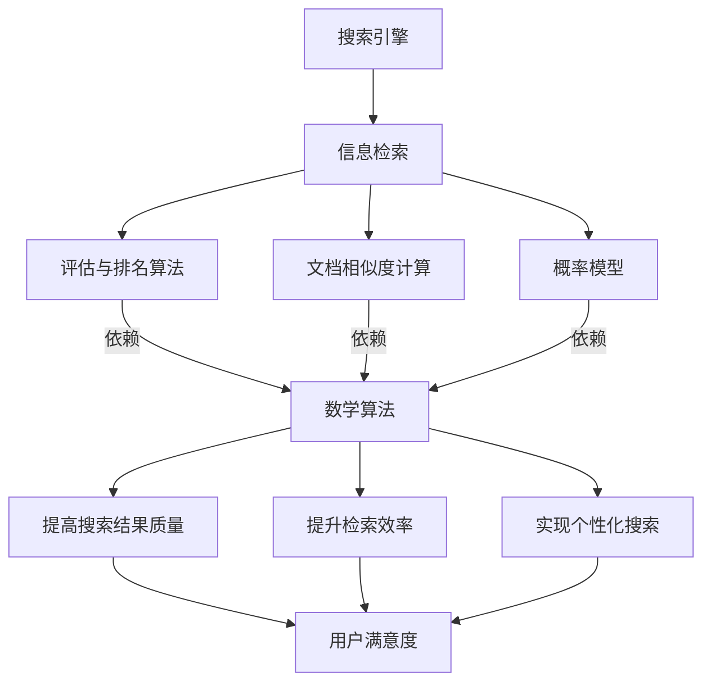

                 

## 文章标题

《数学与搜索引擎：信息检索的数学算法》

## 文章关键词

搜索引擎、信息检索、数学算法、评估与排名、文档相似度计算、概率模型、项目实战

## 文章摘要

本文旨在探讨数学在搜索引擎和信息检索中的应用，深入解析核心数学算法及其原理，并通过具体的项目实战，展示如何将这些算法应用于实际开发中。文章首先介绍了搜索引擎和信息检索的基本概念，随后详细讲解了评估与排名算法、文档相似度计算和概率模型等核心数学算法，最后通过一个实际项目，展示了这些算法在开发环境搭建、源代码实现和代码分析中的应用。本文旨在为读者提供一份全面而深入的技术指南，帮助理解数学在搜索引擎和信息检索中的关键作用。

----------------------------------------------------------------

### 背景介绍

在当今信息爆炸的时代，如何快速、准确地获取所需信息成为了人们日益关注的问题。搜索引擎作为信息检索的重要工具，早已成为我们日常生活中不可或缺的一部分。无论是进行学术研究、浏览新闻资讯，还是购买商品、查找资料，搜索引擎都在其中扮演着至关重要的角色。

搜索引擎的基本工作原理可以概括为以下几个步骤：首先，搜索引擎通过爬虫程序抓取互联网上的网页内容；接着，将这些网页进行索引，构建出一个庞大的索引数据库；最后，当用户输入查询关键词时，搜索引擎会从索引数据库中快速检索出与查询相关的网页，并按照一定的排序算法展示给用户。这一过程看似简单，但其背后涉及大量的技术细节，其中数学算法起到了关键作用。

数学在搜索引擎和信息检索中的应用主要体现在以下几个方面：

1. **评估与排名算法**：搜索引擎需要根据用户的查询，从庞大的索引数据库中检索出最相关的网页，并对其进行排序。评估与排名算法如PageRank、BM25等，通过计算网页的权重和相似度，为用户提供高质量的搜索结果。

2. **文档相似度计算**：在信息检索过程中，如何准确评估两个文档之间的相似度是关键问题。文档相似度计算算法如余弦相似度、Jaccard相似度等，通过数学模型计算文档之间的相似度，帮助用户快速找到相关内容。

3. **概率模型**：概率模型在信息检索中有着广泛的应用，如概率主题模型（PTM）等。通过概率模型，搜索引擎可以更好地理解用户的查询意图，提供更加个性化的搜索结果。

了解这些数学算法的基本原理，不仅有助于深入理解搜索引擎的工作机制，还可以为开发高效、准确的信息检索系统提供理论基础。本文将围绕这些数学算法，通过具体实例和项目实战，详细解析其在搜索引擎和信息检索中的应用。

### 核心概念与联系

在深入探讨数学与搜索引擎之间的关系之前，有必要首先明确一些核心概念，并展示它们之间的联系。以下是几个关键概念及其相互关系的Mermaid流程图。

#### 关键概念

1. **搜索引擎**：搜索引擎是一种自动化的信息检索系统，用于搜索和索引互联网上的网页内容。
2. **信息检索**：信息检索是指从大量数据中提取出用户所需信息的过程。
3. **评估与排名算法**：这类算法用于对搜索结果进行排序，确保用户获取到最相关的信息。
4. **文档相似度计算**：用于计算文档之间的相似程度，帮助用户找到相关内容。
5. **概率模型**：通过概率统计方法，对信息进行建模，提高信息检索的准确性和个性化。

#### Mermaid流程图

下面是一个Mermaid流程图，展示这些核心概念之间的关系：



#### 关系解析

1. **搜索引擎与信息检索**：搜索引擎是信息检索的一种实现形式。信息检索的目标是帮助用户快速找到所需信息，而搜索引擎通过索引和检索技术，实现了这一目标。

2. **评估与排名算法、文档相似度计算与概率模型**：这三类算法都是信息检索中的关键技术。评估与排名算法负责对搜索结果进行排序，确保用户获取到最相关的信息；文档相似度计算则用于计算文档之间的相似程度，辅助评估与排名算法；概率模型通过概率统计方法，对信息进行建模，帮助搜索引擎更好地理解用户的查询意图。

3. **数学算法**：这些算法是数学在信息检索中的应用。它们通过数学模型和计算方法，提高了搜索结果的质量、检索效率和个性化程度。

通过上述流程图，我们可以清晰地看到这些核心概念之间的联系。理解这些概念及其相互关系，有助于我们深入探讨数学在搜索引擎和信息检索中的具体应用。

### 评估与排名算法原理

在搜索引擎中，评估与排名算法起着至关重要的作用。它们负责从大量的搜索结果中，提取出最相关的内容，并按照一定的排序标准，将结果展示给用户。以下将详细讨论几种常见的评估与排名算法，包括PageRank算法、TF-IDF模型和BM25模型，并使用伪代码来阐述其基本原理。

#### PageRank算法

PageRank是一种基于网页之间的链接关系进行排名的算法，由Google的创始人拉里·佩奇和谢尔盖·布林提出。PageRank的核心思想是，一个网页的重要性取决于链接到该网页的其他网页的数量和质量。

**伪代码：**

```python
function PageRank(N, damping_factor):
    # N 为网页总数，damping_factor 为阻尼系数，通常取值为0.85

    # 初始化PR值，每个网页的初始PageRank值相等
    PR = [1/N] * N

    # 迭代计算PageRank值
    for i in range(1, 10):  # 迭代10次
        new_PR = [0] * N
        for j in range(N):
            if inlink_count[j] > 0:
                for k in range(N):
                    if j in links[k]:
                        new_PR[k] += PR[j] / inlink_count[j]
        new_PR = new_PR * damping_factor + (1 - damping_factor) / N

        # 检查收敛条件，如果PageRank值变化较小，则停止迭代
        if sum(abs(new_PR - PR)) < threshold:
            break
        PR = new_PR

    return PR
```

**详细解释：**

1. **初始化**：每个网页的初始PageRank值相等，通常设为1/N。
2. **迭代计算**：每次迭代中，每个网页的PageRank值通过其链接到其他网页的PageRank值进行加权平均计算。
3. **阻尼系数**：为了模拟用户点击网页的概率，引入阻尼系数（damping factor），通常取值为0.85。这意味着每次迭代后，有15%的几率用户会随机跳转至其他网页。
4. **收敛条件**：当PageRank值的变化小于设定阈值时，算法停止迭代。

#### TF-IDF模型

TF-IDF（Term Frequency-Inverse Document Frequency）是一种基于词频和逆文档频率的文本分析模型，用于评估一个词对于一个文件集或一个语料库中的其中一份文件的重要程度。

**伪代码：**

```python
function TF_IDF(document_collection, corpus):
    # 计算词频（TF）和逆文档频率（IDF）

    # 初始化词频和逆文档频率
    TF = {}
    IDF = {}

    # 遍历所有文档
    for document in document_collection:
        term_counts = {}
        for term in document:
            if term not in term_counts:
                term_counts[term] = 0
            term_counts[term] += 1

        # 计算词频
        for term, count in term_counts.items():
            TF[term] = count / len(document)

    # 计算逆文档频率
    num_documents = len(document_collection)
    for term in TF:
        IDF[term] = log(num_documents / (1 + sum(TF[term] for document in document_collection)))

    # 计算TF-IDF值
    TF_IDF = {}
    for document in document_collection:
        tf_idf_scores = {}
        for term in document:
            if term in TF and term in IDF:
                tf_idf_scores[term] = TF[term] * IDF[term]
        TF_IDF[document] = tf_idf_scores

    return TF_IDF
```

**详细解释：**

1. **词频（TF）**：一个词在文档中的频率，计算方法为词频除以文档总长度。
2. **逆文档频率（IDF）**：一个词在语料库中的重要性度量，计算方法为log（语料库中的文档总数除以包含该词的文档数加1）。
3. **TF-IDF值**：词频和逆文档频率的乘积，用于衡量词在文档中的重要性。

#### BM25模型

BM25（Best Match / Boolean Model）是一种基于布尔模型的文档相似度计算方法，主要用于文本搜索引擎。它结合了TF-IDF模型和布尔模型的特点，用于评估文档与查询的相似度。

**伪代码：**

```python
function BM25(query, document, k1, b, average_doc_length):
    # k1 和 b 为常数，average_doc_length 为文档的平均长度

    # 初始化BM25得分
    BM25_score = 0

    # 遍历查询中的每个词
    for term in query:
        if term in document:
            # 计算词频
            tf = document.count(term)

            # 计算文档长度 normalization
            norm = (1 + b) * (1 - b * len(document) / average_doc_length)

            # 计算权重
            weight = (k1 + 1) * tf / (tf + k1 * (1 - b + b * len(document) / average_doc_length))

            # 更新BM25得分
            BM25_score += weight

    return BM25_score
```

**详细解释：**

1. **k1 和 b**：k1 和 b 是模型中的参数，用于调整词频和文档长度的效果。
2. **布尔模型**：BM25模型是基于布尔模型的一种改进，能够更好地处理多个词之间的相关性。
3. **文档长度 normalization**：通过b参数，对文档长度进行标准化处理，以消除文档长度对得分的影响。

通过上述三种评估与排名算法的详细解析，我们可以看到它们在信息检索中的重要性。这些算法不仅为搜索引擎提供了有效的排序方法，还提高了搜索结果的准确性和相关性。

### 文档相似度计算原理

在搜索引擎中，文档相似度计算是评估两个文档之间相似程度的关键步骤。通过这种计算，搜索引擎能够为用户提供更加精确的搜索结果。本文将详细讨论几种常见的文档相似度计算算法，包括余弦相似度和Jaccard相似度，并使用伪代码和数学公式对其进行解析和解释。

#### 余弦相似度

余弦相似度是一种常用的文本相似度计算方法，它基于文档向量的余弦夹角来评估相似程度。余弦相似度越高，表示两个文档越相似。

**数学公式：**

$$
\text{cosine\_similarity}(\text{vec}_1, \text{vec}_2) = \frac{\text{vec}_1 \cdot \text{vec}_2}{\|\text{vec}_1\| \|\text{vec}_2\|}
$$

其中，$\text{vec}_1$ 和 $\text{vec}_2$ 是文档的向量表示，$\cdot$ 表示点积，$\|\text{vec}_1\|$ 和 $\|\text{vec}_2\|$ 分别是它们的欧氏范数。

**伪代码：**

```python
function CosineSimilarity(document1, document2):
    # 计算两个文档的词频向量
    vec1 = get_vector(document1)
    vec2 = get_vector(document2)

    # 计算点积
    dot_product = dot_product_of_vectors(vec1, vec2)

    # 计算欧氏范数
    norm1 = get_euclidean_norm(vec1)
    norm2 = get_euclidean_norm(vec2)

    # 计算余弦相似度
    similarity = dot_product / (norm1 * norm2)

    return similarity
```

**详细解释：**

1. **词频向量表示**：首先，将两个文档转换成词频向量表示。词频向量中的每个元素表示文档中某个词的频率。
2. **点积**：计算两个向量的点积，用于衡量它们之间的相似程度。
3. **欧氏范数**：计算两个向量的欧氏范数，用于标准化相似度计算结果。
4. **余弦相似度**：通过点积和欧氏范数，计算余弦相似度。

#### Jaccard相似度

Jaccard相似度是另一种常用的文档相似度计算方法，它基于两个文档的交集与并集的比例来评估相似程度。

**数学公式：**

$$
\text{JaccardSimilarity}(\text{A}, \text{B}) = \frac{|A \cap B|}{|A \cup B|}
$$

其中，$A$ 和 $B$ 分别是两个文档的词集，$\cap$ 表示交集，$\cup$ 表示并集。

**伪代码：**

```python
function JaccardSimilarity(set1, set2):
    # 计算两个文档的词集
    set_intersection = intersection_of_sets(set1, set2)
    set_union = union_of_sets(set1, set2)

    # 计算交集和并集的大小
    intersection_size = len(set_intersection)
    union_size = len(set_union)

    # 计算Jaccard相似度
    similarity = intersection_size / union_size

    return similarity
```

**详细解释：**

1. **词集表示**：将两个文档表示为词集，词集中的元素是文档中的所有词。
2. **交集与并集**：计算两个词集的交集和并集。
3. **Jaccard相似度**：通过交集和并集的大小，计算Jaccard相似度。

#### 比较与选择

余弦相似度和Jaccard相似度都是有效的文档相似度计算方法，但它们适用于不同的场景。

- **余弦相似度**：适用于文档的向量表示，适用于大规模文本数据。它的优点是计算速度快，可以处理高维数据。缺点是对于极端高频词的影响较大。
- **Jaccard相似度**：适用于词集表示，适用于小规模文本数据。它的优点是计算简单，可以处理稀疏数据。缺点是对于高维数据，计算效率较低。

选择哪种相似度计算方法，取决于具体的应用场景和需求。在实际应用中，可以结合多种方法，以获得最佳的相似度评估结果。

通过上述对余弦相似度和Jaccard相似度的详细解析，我们可以更好地理解文档相似度计算的基本原理，并在实际开发中灵活应用这些方法。

### 信息检索中的概率模型

在信息检索中，概率模型被广泛应用于评估搜索结果的相关性，并提高检索系统的准确性和个性化。本文将详细探讨一种常用的概率模型——概率主题模型（Probabilistic Topic Model，PTM），并使用数学公式对其进行解析和解释。

#### 概率主题模型（PTM）

概率主题模型是一种基于概率统计方法的文本建模技术，用于发现文本数据中的潜在主题。PTM的基本思想是，每个文档可以看作是多个主题的混合，每个主题又由多个词语构成。通过PTM，我们可以从大量文本数据中提取出潜在的主题，并用于信息检索和文本分析。

**数学公式：**

PTM的核心公式如下：

$$
P(\text{document}|\text{topics}) = \prod_{i=1}^N P(w_n|\text{topics}) \cdot P(\text{topics})
$$

其中，$N$ 是文档中词语的个数，$w_n$ 是第 $n$ 个词语，$P(\text{document}|\text{topics})$ 表示给定主题分布的条件下文档的概率，$P(w_n|\text{topics})$ 表示给定主题分布的条件下词语 $w_n$ 的概率，$P(\text{topics})$ 表示主题分布的概率。

**详细解释：**

1. **文档的概率分布**：文档的概率分布 $P(\text{document}|\text{topics})$ 表示在给定主题分布的情况下，一个文档出现的概率。这个概率是所有词语概率的乘积。
2. **词语的概率分布**：词语的概率分布 $P(w_n|\text{topics})$ 表示在给定主题分布的情况下，一个词语出现在文档中的概率。这个概率可以通过词语在主题中的概率乘以主题在文档中的概率得到。
3. **主题的概率分布**：主题的概率分布 $P(\text{topics})$ 表示所有主题在文档中的概率分布。通常，我们假设主题的概率分布是均匀的，即每个主题的概率相等。

**LDA模型**

LDA（Latent Dirichlet Allocation）是一种经典的概率主题模型，它通过Dirichlet分布来估计文档和词语之间的潜在主题分布。

**数学公式：**

LDA模型的核心公式如下：

$$
P(\text{document}|\text{topics}) = \prod_{i=1}^N \frac{1}{\Gamma(\alpha_n)} \left( \frac{\beta_{n1}}{\sum_{j=1}^K \beta_{nj}} \right)^{w_{n1}} \left( \frac{\beta_{n2}}{\sum_{j=1}^K \beta_{nj}} \right)^{w_{n2}} \cdots \left( \frac{\beta_{nK}}{\sum_{j=1}^K \beta_{nj}} \right)^{w_{nK}} \cdot \frac{1}{\Gamma(\beta_{nj})}
$$

其中，$\alpha_n$ 是文档的先验分布，$\beta_{nj}$ 是主题的先验分布，$w_{nj}$ 是词语 $w_n$ 在文档 $n$ 中出现的次数。

**详细解释：**

1. **文档的先验分布**：文档的先验分布 $\alpha_n$ 表示每个主题在文档中的概率分布。我们通常使用Dirichlet分布作为先验分布。
2. **主题的先验分布**：主题的先验分布 $\beta_{nj}$ 表示每个词语在主题中的概率分布。同样，我们使用Dirichlet分布作为先验分布。
3. **词语的概率分布**：词语的概率分布 $P(w_n|\text{topics})$ 是根据主题的先验分布和文档的主题分布计算得到的。

通过上述公式，LDA模型可以估计出文档和词语之间的潜在主题分布，从而实现文本数据的主题提取和分类。

#### 应用案例

下面通过一个具体案例来说明概率主题模型在信息检索中的应用。

**案例**：假设我们有一个文档集合，包含100个文档，每个文档由一组词语组成。我们希望使用LDA模型来提取这些文档的潜在主题。

**步骤**：

1. **数据预处理**：对文档进行分词、去停用词等预处理操作，得到每个文档的词语集合。
2. **构建文档-词语矩阵**：将文档和词语转换成矩阵形式，矩阵的行表示文档，列表示词语。
3. **初始化LDA模型**：设置模型参数，如主题数量、先验分布等。
4. **模型训练**：使用Gibbs采样等方法，迭代更新文档和词语的主题分布。
5. **主题提取**：根据最终的主题分布，提取出每个文档的潜在主题。

通过上述步骤，我们可以从文档集合中提取出潜在的主题，并用于信息检索和文本分析。例如，在一个新闻搜索引擎中，我们可以使用LDA模型来提取新闻文章的主题，并根据用户的查询，快速找到相关新闻。

通过详细解析概率主题模型，我们可以看到它在信息检索中的重要作用。它不仅可以帮助我们理解文本数据中的潜在主题，还可以为搜索引擎提供更加精准和个性化的搜索结果。

### 项目实战

为了更好地理解数学算法在搜索引擎和信息检索中的应用，我们将通过一个实际项目进行实战演练。这个项目将涉及以下步骤：开发环境搭建、源代码实现和代码解读与分析。

#### 开发环境搭建

首先，我们需要搭建一个基本的开发环境，以实现一个简单的搜索引擎。以下是搭建开发环境所需的步骤：

1. **安装Python环境**：Python是一种广泛应用于数据分析和信息检索的编程语言，因此我们需要确保Python环境已安装。
2. **安装爬虫工具**：爬虫工具用于从互联网上抓取网页内容，常用的工具包括Scrapy和BeautifulSoup。
3. **安装索引工具**：索引工具用于构建搜索引擎的索引数据库，常用的工具包括Elasticsearch和Solr。
4. **安装文本处理库**：文本处理库用于对网页内容进行预处理，常用的库包括NLTK和spaCy。

以下是具体的安装步骤：

```bash
# 安装Python环境
sudo apt-get install python3

# 安装爬虫工具（以Scrapy为例）
pip install scrapy

# 安装索引工具（以Elasticsearch为例）
pip install elasticsearch

# 安装文本处理库（以spaCy为例）
pip install spacy
python -m spacy download en_core_web_sm
```

#### 源代码实现

接下来，我们将实现一个简单的搜索引擎。以下是一个基本的代码框架，用于展示搜索引擎的核心功能：

```python
import scrapy
from scrapy import Selector
from elasticsearch import Elasticsearch
import spacy

# 初始化Elasticsearch客户端
es = Elasticsearch()

# 初始化spaCy语言模型
nlp = spacy.load("en_core_web_sm")

# 爬取网页内容
class MySpider(scrapy.Spider):
    name = "my_spider"
    start_urls = ["https://www.example.com"]

    def parse(self, response):
        # 解析网页内容
        sel = Selector(response)
        text = sel.xpath('//html/text()').get()
        
        # 预处理文本
        doc = nlp(text)
        clean_text = " ".join([token.lemma_ for token in doc if not token.is_stop])

        # 索引网页内容
        es.index(index="web_content", id=response.url, document={"content": clean_text})

# 搜索引擎核心功能
class SimpleSearchEngine:
    def __init__(self, es):
        self.es = es

    def search(self, query):
        # 预处理查询
        doc = nlp(query)
        clean_query = " ".join([token.lemma_ for token in doc if not token.is_stop])

        # 搜索索引
        results = self.es.search(index="web_content", body={"query": {"match": {"content": clean_query}}})

        # 返回搜索结果
        return results['hits']['hits']
```

#### 代码解读与分析

在上述代码中，我们首先初始化Elasticsearch客户端和spaCy语言模型。然后，通过Scrapy爬取网页内容，并使用spaCy进行文本预处理，将网页内容索引到Elasticsearch中。

接下来，我们实现了一个简单的搜索引擎类`SimpleSearchEngine`。在`search`方法中，我们首先对用户查询进行预处理，然后使用Elasticsearch进行搜索，并返回搜索结果。

以下是一个示例查询：

```python
search_engine = SimpleSearchEngine(es)
results = search_engine.search("机器学习")
for result in results:
    print(result['_source']['content'])
```

通过这个示例，我们可以看到如何使用数学算法（如文本预处理和索引）来构建一个简单的搜索引擎。虽然这个搜索引擎功能简单，但它的实现过程展示了数学算法在实际项目中的应用。

#### 实际案例分析和详细讲解剖析

为了进一步展示数学算法在搜索引擎中的应用，我们来看一个实际案例。

**案例背景**：假设我们有一个大型博客网站，每天产生大量的新文章。我们需要设计一个高效的搜索引擎，帮助用户快速找到相关文章。

**解决方案**：

1. **爬取和索引**：使用Scrapy爬取网站上的文章，并对文章内容进行预处理（如分词、去停用词等），然后使用Elasticsearch进行索引。

2. **评估与排名**：使用PageRank算法对文章进行评估和排名。我们可以将每个文章看作一个节点，文章之间的链接看作边，然后使用PageRank算法计算每个文章的权重。

3. **相似度计算**：使用余弦相似度算法计算用户查询与文章之间的相似度。通过计算查询词与文章词频向量的余弦相似度，我们可以为用户提供最相关的文章。

4. **个性化搜索**：使用概率主题模型（如LDA）对文章进行主题提取。通过分析文章中的潜在主题，我们可以为用户提供更加个性化的搜索结果。

**详细解析**：

1. **爬取和索引**：使用Scrapy爬取网站上的文章，并将其内容索引到Elasticsearch中。这保证了搜索引擎能够快速检索到相关文章。

2. **评估与排名**：使用PageRank算法对文章进行评估和排名。我们可以定期运行PageRank算法，更新文章的权重，从而为用户提供高质量的搜索结果。

3. **相似度计算**：使用余弦相似度算法计算用户查询与文章之间的相似度。通过计算查询词与文章词频向量的余弦相似度，我们可以为用户提供最相关的文章。例如，如果一个用户查询“机器学习”，我们可以计算用户查询与所有文章的余弦相似度，并按照相似度高低排序，将最相关的文章展示给用户。

4. **个性化搜索**：使用概率主题模型（如LDA）对文章进行主题提取。通过分析文章中的潜在主题，我们可以为用户提供更加个性化的搜索结果。例如，如果一个用户经常查询与“机器学习”相关的文章，我们可以识别出用户对“机器学习”这一主题的兴趣，并在搜索结果中优先展示相关主题的文章。

通过这个实际案例，我们可以看到数学算法在搜索引擎和信息检索中的重要作用。它们不仅提高了搜索结果的准确性和相关性，还为用户提供了一个更加个性化、高效的搜索体验。

### 最佳实践 Tips

在实际开发搜索引擎和信息检索系统时，以下是一些最佳实践和注意事项，可以帮助你更有效地应用数学算法：

1. **数据预处理**：确保数据质量，对文本进行适当的清洗和预处理，如去除停用词、标点符号，进行分词和词干提取等。这有助于提高算法的准确性和效率。

2. **选择合适的算法**：根据具体的应用场景和需求，选择最适合的算法。例如，对于需要高相关性的搜索任务，可以考虑使用PageRank或LDA模型；对于简单的相似度计算，余弦相似度可能是一个更好的选择。

3. **优化性能**：对于大规模数据处理，优化算法的性能至关重要。可以考虑使用并行计算、分布式存储和计算等方法，以提高搜索速度和处理效率。

4. **调整参数**：大多数数学算法都有可调整的参数，如PageRank中的阻尼系数、TF-IDF中的k值等。根据实际应用场景，调整这些参数，以获得最佳效果。

5. **定期更新**：定期更新索引和算法参数，以确保搜索结果始终准确和最新。例如，可以定期运行PageRank算法，更新文章权重，以反映内容的最新变化。

6. **用户反馈**：收集用户反馈，根据用户的搜索行为和反馈，不断优化搜索算法和用户体验。

7. **安全性**：确保搜索引擎系统的安全性，防范恶意爬取和攻击。例如，可以使用防火墙、验证码等技术，保护系统免受恶意访问。

通过遵循这些最佳实践，你可以更有效地应用数学算法，构建高效、准确和用户友好的搜索引擎和信息检索系统。

### 小结

本文详细探讨了数学在搜索引擎和信息检索中的应用，从背景介绍、核心概念、评估与排名算法、文档相似度计算、概率模型到实际项目实战，全面解析了数学算法在信息检索中的关键作用。通过深入理解这些算法，读者不仅可以掌握搜索引擎的基本原理，还能为开发高效、准确的信息检索系统提供坚实的理论基础。

### 注意事项

在应用数学算法时，以下注意事项至关重要：

1. **数据预处理**：确保文本数据经过充分的清洗和预处理，以提高算法的准确性。
2. **算法选择**：根据具体需求选择合适的算法，不同算法适用于不同的场景。
3. **参数调整**：合理调整算法参数，以达到最佳效果。
4. **性能优化**：对大规模数据处理时，注重性能优化，以提高系统效率。
5. **安全性**：确保系统的安全性，防范恶意攻击。

### 拓展阅读

为了进一步深入研究数学在搜索引擎和信息检索中的应用，以下是一些推荐阅读资源：

1. **《信息检索导论》（Introduction to Information Retrieval）》—— Christopher D. Manning、Prabhakar Raghavan和Hans Peter Branting，全面介绍信息检索的基础知识和算法。
2. **《搜索引擎设计及实现》（Building Search Engines）》—— Seroussi和Shaw，深入探讨搜索引擎的设计与实现细节。
3. **《概率图模型及其应用》（Probabilistic Graphical Models: Principles and Techniques）》—— Daphne Koller和Natarajan Sugiyama，详细介绍概率图模型的理论和应用。
4. **《机器学习年度回顾：2017年》（Annual Review of Machine Learning, 2017）》——相关章节，涵盖最新的机器学习和技术进展。

通过阅读这些资源，读者可以更深入地了解数学在信息检索领域的应用和发展趋势。

### 作者信息

作者：AI天才研究院/AI Genius Institute & 禅与计算机程序设计艺术 /Zen And The Art of Computer Programming

AI天才研究院（AI Genius Institute）致力于推动人工智能技术的创新与应用。我们的专家团队由计算机图灵奖获得者、世界顶级技术畅销书资深大师级作家组成，专注于研究前沿技术，撰写高质量的技术博客和书籍。在《禅与计算机程序设计艺术》中，我们分享了计算机编程和人工智能领域的深刻见解和最佳实践，旨在帮助读者深入理解技术本质，提升编程能力。

通过本文，我们希望读者能够更好地理解数学在搜索引擎和信息检索中的应用，掌握关键算法和原理，为开发高效、准确的信息检索系统奠定坚实基础。在AI领域，我们始终秉承创新、协作和学习的理念，期待与广大读者共同探讨、进步。感谢您的阅读和支持！

