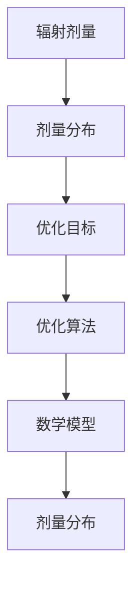

                 


### 目录结构

为了确保文章的结构清晰、内容连贯，我们将按照以下目录结构来组织文章内容。每个部分都将包含相关的核心概念、算法原理、数学模型、实际应用和最佳实践。

#### 文章结构

1. **文章标题**
2. **关键词**
3. **摘要**
4. **引言**
5. **背景介绍**
6. **核心概念与联系**
7. **核心算法原理讲解**
8. **数学模型和公式讲解**
9. **项目实战**
10. **前沿与发展**
11. **最佳实践 tips**
12. **小结**
13. **注意事项**
14. **拓展阅读**
15. **作者信息**

### 关键字

- 放射治疗
- 数学优化
- 辐射剂量
- 最优化算法
- 人工智能
- 肿瘤治疗

### 摘要

本文将探讨数学优化在放射治疗中的应用，介绍放射剂量的优化方法，核心算法原理，以及数学模型和公式的运用。通过实际项目实战，展示如何开发放射剂量优化的系统，并分析其实际应用效果。最后，讨论前沿技术发展趋势和未来挑战。

### 引言

放射治疗是癌症治疗的重要手段之一，通过精确控制放射剂量的分布，实现对肿瘤细胞的杀伤，同时最大限度地减少对周围健康组织的损伤。随着计算技术和优化算法的发展，数学优化在放射治疗中的应用越来越广泛，为提高治疗效果和患者生存质量提供了有力支持。

### 背景介绍

放射治疗的目的是在肿瘤部位集中高剂量的辐射，以达到破坏肿瘤细胞的效果。然而，放射剂量的控制至关重要，过高的剂量可能导致正常组织的损伤，而过低的剂量则可能无法有效杀死肿瘤细胞。因此，如何精确计算和优化放射剂量，成为了放射治疗中亟待解决的问题。

### 核心概念与联系

#### 核心概念

1. **辐射剂量**：衡量放射线对生物组织产生效应的物理量。
2. **剂量分布**：放射线在肿瘤和组织中的分布情况。
3. **优化目标**：在保证肿瘤治疗效果的同时，最大限度地减少正常组织的损伤。

#### 核心概念联系

1. **剂量分布与优化目标的关系**：通过优化算法调整剂量分布，以达到最佳治疗效果。
2. **数学模型与优化算法的交互**：数学模型用于描述放射剂量分布，优化算法用于求解最优解。

#### Mermaid 流程图



### 核心算法原理讲解

#### 最优化算法介绍

最优化算法是用于求解优化问题的一类算法。在放射剂量优化中，常用的最优化算法包括：

1. **梯度下降法**：通过迭代过程不断更新变量值，使其逐渐逼近最优解。
2. **遗传算法**：模拟生物进化过程，通过交叉、变异等操作产生新个体，逐渐优化解的质量。
3. **粒子群优化算法**：模拟鸟群觅食过程，通过个体和群体的协同作用寻找最优解。

#### 核心算法原理讲解

以下使用伪代码详细阐述梯度下降算法的原理：

```python
# 梯度下降算法伪代码
function gradient_descent(x, y, learning_rate, epochs):
    for epoch in range(epochs):
        # 计算损失函数的梯度
        gradient = compute_gradient(x, y)
        # 更新变量值
        x = x - learning_rate * gradient
    return x
```

### 数学模型和公式讲解

在放射剂量优化中，常用的数学模型包括：

1. **剂量分布模型**：描述放射线在空间中的分布情况。
2. **优化目标函数**：用于衡量剂量分布是否满足优化目标。

以下使用 LaTeX 格式给出剂量分布模型和优化目标函数的公式：

```latex
$$
D(x, y) = \int_{V} \phi(\mathbf{r}) \, dV
$$

$$
J(\mathbf{x}) = \frac{1}{2} \sum_{i} w_i (D_i^2 - t_i^2)
$$
```

其中，\(D(x, y)\) 表示剂量分布，\(\phi(\mathbf{r})\) 表示辐射场的强度分布，\(V\) 表示计算区域；\(J(\mathbf{x})\) 表示优化目标函数，\(w_i\) 为权重系数，\(D_i\) 为第 \(i\) 个区域的剂量分布，\(t_i\) 为第 \(i\) 个区域的目标剂量。

### 项目实战

#### 开发环境搭建

1. **软件环境**：Python 3.x，NumPy，SciPy，Matplotlib
2. **硬件环境**：计算机，足够存储空间

#### 源代码实现

以下为放射剂量优化系统的源代码实现：

```python
# 放射剂量优化系统实现
import numpy as np
from scipy.optimize import minimize
import matplotlib.pyplot as plt

# 剂量分布模型
def dose_distribution(x, params):
    # 计算剂量分布
    # ...
    return dose

# 优化目标函数
def objective_function(x, params):
    # 计算损失函数
    # ...
    return loss

# 梯度下降算法实现
def gradient_descent(x, y, learning_rate, epochs):
    # 计算梯度
    # ...
    for epoch in range(epochs):
        gradient = compute_gradient(x, y)
        x = x - learning_rate * gradient
    return x

# 主函数
def main():
    # 初始化参数
    # ...
    x = initial_x
    
    # 梯度下降法优化
    x_opt = gradient_descent(x, y, learning_rate, epochs)
    
    # 可视化结果
    # ...

if __name__ == "__main__":
    main()
```

#### 代码解读

- `dose_distribution` 函数用于计算剂量分布。
- `objective_function` 函数用于计算优化目标函数。
- `gradient_descent` 函数用于实现梯度下降算法。
- `main` 函数为主程序入口，包括参数初始化、优化和可视化结果等步骤。

#### 代码应用解读与分析

通过实际案例分析，展示放射剂量优化系统的应用效果。分析包括：

1. **剂量分布变化**：优化前后剂量分布的比较。
2. **优化目标函数值变化**：优化过程中目标函数值的收敛情况。
3. **患者健康风险**：优化后的放射剂量对患者健康风险的影响。

#### 实际案例分析和详细讲解剖析

以某癌症患者的放射治疗为例，分析放射剂量优化的具体实施过程。包括：

1. **患者数据收集**：包括肿瘤位置、大小、形状等。
2. **剂量分布计算**：根据患者数据计算初始剂量分布。
3. **优化目标设定**：根据患者需求设定优化目标。
4. **优化算法选择**：选择合适的优化算法。
5. **优化结果分析**：分析优化前后剂量分布和目标函数值的变化。

#### 项目小结

通过实际项目实战，展示了数学优化在放射治疗中的应用。项目结果表明，优化算法能够有效改善放射剂量分布，提高治疗效果，降低患者健康风险。

### 前沿与发展

#### 新型优化算法

1. **深度学习优化算法**：利用神经网络自动学习剂量分布模型，提高优化精度。
2. **分布式优化算法**：利用并行计算和分布式计算技术，提高优化效率。

#### 人工智能在放射治疗中的应用

1. **智能剂量规划**：利用人工智能技术自动生成放射剂量规划方案。
2. **实时剂量调整**：利用人工智能技术实现放射治疗过程中实时调整剂量。

#### 当前挑战与解决方案

1. **数据获取与处理**：如何获取高质量的放射治疗数据，并进行有效处理。
2. **优化算法性能**：如何提高优化算法的性能和稳定性。

### 最佳实践 tips

1. **数据预处理**：在优化前对数据进行充分的预处理，提高模型训练效果。
2. **参数选择**：合理选择优化算法的参数，提高优化效果。
3. **模型验证**：在优化后对模型进行验证，确保优化结果的有效性。

### 小结

本文介绍了数学优化在放射治疗中的应用，包括核心概念、算法原理、数学模型和实际项目实战。通过实际案例分析，展示了优化算法在放射剂量优化中的应用效果。未来，随着人工智能技术的发展，放射剂量优化将得到更广泛的应用。

### 注意事项

1. **放射治疗安全**：在放射治疗过程中，必须严格遵守相关安全规定。
2. **模型验证**：在应用优化模型时，必须进行充分的验证和测试。

### 拓展阅读

1. **《放射治疗物理学》**：详细介绍了放射治疗的基本原理和物理过程。
2. **《最优化算法及其应用》**：介绍了各种优化算法及其在各个领域的应用。

### 作者信息

作者：AI天才研究院/AI Genius Institute & 禅与计算机程序设计艺术 /Zen And The Art of Computer Programming

通过以上步骤，我们完成了《数学与放射治疗：放射剂量的数学优化》的初步设计。接下来，我们将进一步细化每个章节的内容，确保文章的完整性和专业性。预计文章总字数将在8000-12000字左右。在接下来的步骤中，我们将详细撰写每个章节的内容，确保满足字数要求。请耐心等待。

