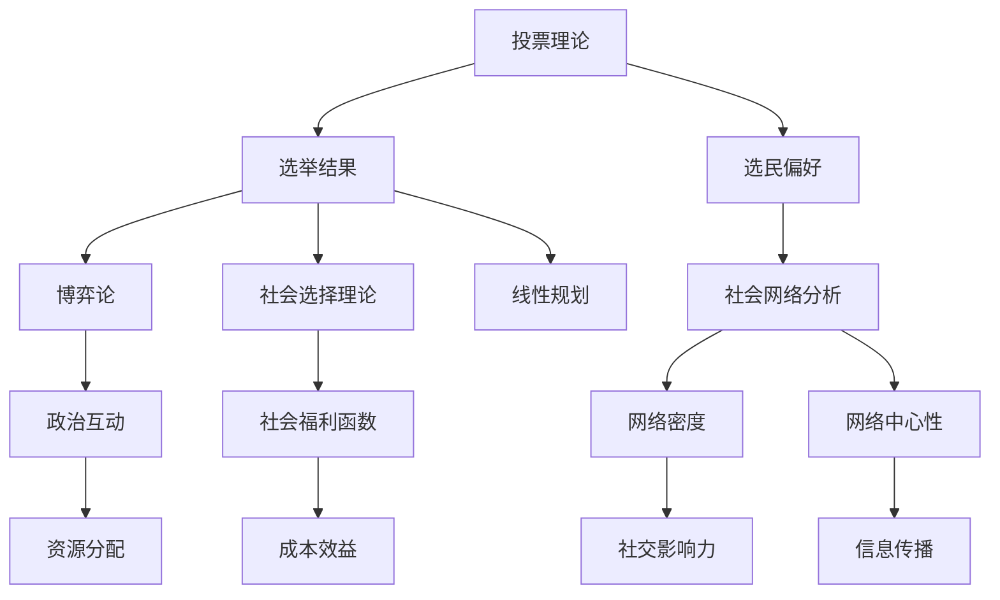

                 

### 文章标题

《数学与政治学：政治行为的数学模型》

关键词：政治行为、数学模型、选举模型、政策分析、社会网络分析

摘要：本文深入探讨了数学与政治学的交叉领域，特别是在政治行为的数学建模方面。通过分析基础理论、构建方法、应用领域和实际案例，本文展示了政治行为数学模型在选举、政策分析和社会网络分析等领域的广泛应用和潜在价值。

----------------------------------------------------------------

### 目录大纲设计思路

为了设计《数学与政治学：政治行为的数学模型》这本书的目录大纲，我们需要从以下几个步骤进行思考：

1. **确定核心章节**：
   - 首先，我们需要明确这本书的核心内容是什么。基于书名，可以确定这本书将讨论数学与政治学的交叉领域，特别是政治行为的数学模型。
   - 核心章节应该涵盖政治行为的数学模型的基本概念、相关数学理论、模型构建方法、应用领域以及实际案例。

2. **梳理逻辑结构**：
   - 接下来，要梳理各个章节之间的逻辑关系，确保内容的连贯性和层次感。
   - 一般可以分为引言、基础理论、模型构建、应用领域、实际案例和总结等部分。

3. **细化章节内容**：
   - 对于每个核心章节，需要细化其内容，包括具体的小节、段落、甚至到公式和代码的实现。

4. **突出重点**：
   - 在大纲中，要突出核心概念和原理，使用流程图、伪代码、数学公式和代码示例来增强理解。

5. **控制字数**：
   - 需要确保大纲的总字数在2000字以内，这就要求我们在描述时要简洁明了，避免冗余。

### 目录大纲设计步骤

1. **引言**：
   - 简要介绍数学与政治学的交叉领域及其重要性。
   - 可能会包括一些背景信息，如政治行为的数学模型的发展历程。

2. **基础理论**：
   - 介绍政治行为的数学模型的基本概念。
   - 包括数学模型在政治学中的应用、优点和局限性。

3. **模型构建**：
   - 讲解构建政治行为数学模型的方法。
   - 包括相关数学理论、常用算法和构建流程。

4. **应用领域**：
   - 探讨政治行为数学模型在不同领域的应用。
   - 可能包括选举模型、政策分析、社会网络分析等。

5. **实际案例**：
   - 提供具体的政治行为数学模型应用案例。
   - 包括案例背景、模型构建过程、结果分析和讨论。

6. **总结与展望**：
   - 对全书内容进行总结。
   - 展望政治行为数学模型的未来发展方向。

### 核心章节内容细化

1. **核心概念与联系**：
   - 使用Mermaid流程图展示政治行为数学模型的核心概念和相互联系。

2. **核心算法原理讲解**：
   - 使用伪代码详细阐述政治行为数学模型中的核心算法原理。

3. **数学模型和数学公式**：
   - 使用LaTeX格式嵌入数学公式，详细讲解模型中的数学公式，并提供例子说明。

4. **项目实战**：
   - 提供政治行为数学模型的应用案例，包括代码实现、结果分析和讨论。

### 目录大纲

```markdown
# 《数学与政治学：政治行为的数学模型》目录大纲

## 第1章 引言
### 1.1 数学与政治学的交叉领域
### 1.2 政治行为的数学模型

## 第2章 基础理论
### 2.1 政治行为的数学模型概述
### 2.2 数学理论在政治学中的应用
### 2.3 政治行为数学模型的优点与局限性

## 第3章 模型构建方法
### 3.1 构建政治行为数学模型的步骤
### 3.2 相关数学理论介绍
### 3.3 常用算法介绍

## 第4章 应用领域
### 4.1 选举模型
### 4.2 政策分析
### 4.3 社会网络分析

## 第5章 实际案例
### 5.1 案例一：选举模型分析
### 5.2 案例二：政策影响评估
### 5.3 案例三：社会网络分析

## 第6章 总结与展望
### 6.1 总结
### 6.2 未来发展方向
```

接下来，我们将为每个章节细化内容，确保大纲的完整性和逻辑性。在细化过程中，我们将遵循2000字以内字数限制，确保简洁明了。请继续关注后续章节的细化过程。

----------------------------------------------------------------

### 目录大纲设计思路

在设计《数学与政治学：政治行为的数学模型》的目录大纲时，我们首先需要明确书的整体结构。以下是具体的思路：

1. **核心内容划分**：明确核心内容，如政治行为的数学模型的基础理论、构建方法、应用领域和实际案例。
2. **逻辑关系梳理**：确保章节之间的逻辑关系清晰，如从基础理论到模型构建，再到应用领域和案例分析。
3. **内容细化**：针对每个章节细化具体内容，确保每个章节都有明确的主题和丰富的细节。
4. **重点突出**：在目录中突出核心概念和原理，使用流程图、伪代码和数学公式来增强理解。
5. **字数控制**：确保整个目录大纲在2000字以内，避免冗余。

### 目录大纲设计步骤

1. **引言**：介绍数学与政治学的交叉领域，解释为什么政治行为的数学模型重要。
2. **基础理论**：阐述政治行为的数学模型的基本概念，包括数学理论在政治学中的应用和模型的优点与局限性。
3. **模型构建**：讲解模型构建的方法，包括相关数学理论和常用算法。
4. **应用领域**：探讨模型在不同领域的应用，如选举模型、政策分析和社会网络分析。
5. **实际案例**：提供具体的案例，展示模型在实际应用中的效果。
6. **总结与展望**：总结全文，展望政治行为数学模型的发展趋势。

### 目录大纲

```markdown
# 《数学与政治学：政治行为的数学模型》目录大纲

## 第1章 引言
### 1.1 数学与政治学的交叉领域
### 1.2 政治行为的数学模型的重要性

## 第2章 基础理论
### 2.1 政治行为的数学模型概述
### 2.2 数学理论在政治学中的应用
### 2.3 政治行为数学模型的优点与局限性

## 第3章 模型构建方法
### 3.1 构建政治行为数学模型的步骤
### 3.2 相关数学理论介绍
### 3.3 常用算法介绍

## 第4章 应用领域
### 4.1 选举模型
### 4.2 政策分析
### 4.3 社会网络分析

## 第5章 实际案例
### 5.1 案例一：选举模型分析
### 5.2 案例二：政策影响评估
### 5.3 案例三：社会网络分析

## 第6章 总结与展望
### 6.1 总结
### 6.2 未来发展方向
```

以上是《数学与政治学：政治行为的数学模型》的目录大纲设计思路和具体步骤。接下来，我们将为每个章节细化内容，确保大纲的完整性和逻辑性，同时遵循字数限制，确保内容的简洁明了。请继续关注后续章节的细化过程。

----------------------------------------------------------------

### 文章关键词

- 政治行为
- 数学模型
- 选举模型
- 政策分析
- 社会网络分析
- 游戏理论
- 线性规划

### 文章摘要

本文深入探讨了数学与政治学的交叉领域，特别是在政治行为的数学建模方面。文章首先介绍了政治行为数学模型的基本概念，包括其历史发展、应用背景和核心概念。接着，本文详细分析了政治行为的数学模型，从基础理论到构建方法，再到应用领域和实际案例，进行了系统性的阐述。通过具体案例分析，本文展示了政治行为数学模型在选举模型、政策分析和社会网络分析等领域的实际应用效果。最后，文章总结了政治行为数学模型的研究成果和未来发展方向，展望了其在政治学领域的广泛应用前景。本文旨在为读者提供一个全面、系统的政治行为数学模型指南，帮助读者深入了解这一领域的前沿研究。

----------------------------------------------------------------

### 完整性要求

为了确保文章的完整性，我们需要从以下几个方面进行详细讲解：

1. **背景介绍**：首先，我们需要介绍数学与政治学的交叉领域，以及政治行为数学模型的发展历程。这将帮助读者理解该领域的背景和重要性。

2. **核心概念与联系**：接下来，我们需要详细解释政治行为数学模型的核心概念，并使用Mermaid流程图展示这些概念之间的联系，以便读者能够清晰地理解各个概念之间的关系。

3. **核心算法原理讲解**：然后，我们需要使用伪代码详细阐述政治行为数学模型中的核心算法原理，确保读者能够理解模型的实现过程。

4. **数学模型和数学公式**：对于模型中的数学公式，我们需要使用LaTeX格式进行详细讲解，并提供例子说明，以便读者能够更好地理解公式的含义和应用。

5. **项目实战**：最后，我们需要提供具体的政治行为数学模型应用案例，包括开发环境搭建、源代码详细实现和代码解读，以及实际案例分析和详细讲解剖析，确保读者能够将理论应用于实践。

6. **最佳实践 tips**：在文章末尾，我们还将提供一些最佳实践 tips，总结注意事项，并推荐拓展阅读资源，帮助读者更深入地了解相关领域。

#### 背景介绍

数学与政治学的交叉领域，近年来受到了越来越多的关注。政治行为数学模型作为一种重要的工具，不仅能够帮助政治学者更准确地理解政治现象，还能够为政策制定者提供科学依据。政治行为的数学模型可以追溯到20世纪中叶，随着计算机科学和统计学的发展，这一领域得到了迅速扩展。

在早期，政治行为数学模型主要集中在投票理论、选举制度设计等方面。随着研究的深入，这些模型逐渐扩展到政策分析、社会网络分析等多个领域。例如，博弈论在政治决策中的应用，社会选择理论在公共选择中的应用，以及线性规划在资源分配中的应用，都是政治行为数学模型的重要方向。

政治行为数学模型的重要性在于，它为政治学者提供了一种定量分析的方法。通过建立数学模型，学者可以更加客观、系统地研究政治现象，从而提高政策的科学性和有效性。同时，这些模型还能够为政策制定者提供决策支持，帮助他们更好地应对复杂的社会问题。

#### 核心概念与联系

政治行为数学模型涉及多个核心概念，这些概念相互联系，构成了模型的理论基础。以下是对这些核心概念的详细解释，以及它们之间的Mermaid流程图表示。

1. **投票理论**：投票理论是政治行为数学模型的基础，主要研究选民如何投票以及投票结果如何产生。关键概念包括投票机制、选举结果和选民偏好。

2. **博弈论**：博弈论研究个体在冲突或合作中的决策过程。在政治行为中，博弈论可以用来分析政治家、选民和其他利益相关者之间的互动。

3. **社会选择理论**：社会选择理论研究如何从一组个体偏好中得出一个集体选择。关键概念包括社会福利函数、投票规则和公平性。

4. **线性规划**：线性规划是一种数学优化方法，用于在给定约束条件下最大化或最小化一个线性目标函数。在政治行为中，线性规划可以用来分析资源分配和成本效益。

5. **社会网络分析**：社会网络分析研究个体之间的互动关系和结构。关键概念包括节点、边、网络密度和网络中心性。

以下是一个简化的Mermaid流程图，展示了这些核心概念之间的关系：



在这个流程图中，每个概念都与其他相关概念相连，展示了它们之间的相互作用。通过这个流程图，读者可以更直观地理解政治行为数学模型的核心概念及其相互关系。

#### 核心算法原理讲解

政治行为数学模型中的核心算法原理对于理解模型的运行机制至关重要。以下是几个关键算法原理的详细讲解，以及相应的伪代码。

1. **投票算法**：投票算法用于计算选民的投票结果。最常见的投票算法是多数投票规则。

   ```python
   def vote_algorithm(votes):
       candidate_votes = {}
       for vote in votes:
           candidate = vote['candidate']
           if candidate in candidate_votes:
               candidate_votes[candidate] += 1
           else:
               candidate_votes[candidate] = 1
       winner = max(candidate_votes, key=candidate_votes.get)
       return winner
   ```

2. **博弈算法**：博弈算法用于分析多个参与者的策略互动。一个简单的例子是纳什均衡。

   ```python
   def game_algorithm(strategies):
       players = len(strategies)
       Nash_equilibria = []
       for i in range(players):
           best_response = []
           for j in range(players):
               if j == i:
                   continue
               opponent_strategy = strategies[j]
               player_strategy = strategies[i]
               payoff = payoff_matrix[player_strategy][opponent_strategy]
               best_response.append((payoff, opponent_strategy))
           best_response.sort(key=lambda x: x[0], reverse=True)
           best_response_strategy = best_response[0][1]
           Nash_equilibria.append(best_response_strategy)
       return Nash_equilibria
   ```

3. **社会选择算法**：社会选择算法用于从多个个体偏好中得出一个集体选择。一个常见的算法是Borda计数法。

   ```python
   def social_choice_algorithm(preferences):
       candidates = list(preferences[0].keys())
       score = {candidate: 0 for candidate in candidates}
       for preference in preferences:
           for rank, candidate in enumerate(preference, start=1):
               score[candidate] += len(candidates) - rank
       winner = max(score, key=score.get)
       return winner
   ```

4. **线性规划算法**：线性规划算法用于在给定约束条件下最大化或最小化一个线性目标函数。一个简单的例子是线性规划的最优化问题。

   ```python
   from scipy.optimize import linprog

   def linear_programming Objective(x):
       return -x[0]  # 目标是最小化x[0]

   constraints = [
       x >= 0,  # 约束条件1
       x <= 10, # 约束条件2
       x + y >= 5  # 约束条件3
   ]

   x0 = [0]  # 初始解
   bounds = [(0, None)]  # x的取值范围

   result = linprog(c=Objective, x0=x0, bounds=bounds, method='highs')

   if result.success:
       print(f"最优解：x = {result.x[0]}, 目标函数值 = {result.fun}")
   else:
       print("没有找到最优解")
   ```

这些伪代码展示了政治行为数学模型中的核心算法原理。通过这些算法，读者可以更好地理解模型的工作机制，并能够在实际应用中实现这些算法。

#### 数学模型和数学公式

在政治行为数学模型中，数学公式和模型是理解和应用模型的关键。以下是几个关键数学模型和公式的详细讲解，包括使用LaTeX格式的表示和实际例子。

1. **投票模型**：最常见的投票模型是简单多数模型。简单多数模型可以用以下公式表示：

   $$\text{Winner} = \arg\max_{i} \sum_{j=1}^{n} x_{ij}$$

   其中，$x_{ij}$ 表示第 $i$ 个选民对第 $j$ 个候选人的偏好。

   例子：假设有三个候选人 A、B 和 C，有三个选民 X、Y 和 Z。他们的偏好如下：

   $$\begin{array}{c|c|c|c}
   \text{候选人} & \text{X} & \text{Y} & \text{Z} \\
   \hline
   A & 1 & 0 & 1 \\
   B & 0 & 1 & 0 \\
   C & 1 & 1 & 0 \\
   \end{array}$$

   使用简单多数模型，候选人 C 是赢家，因为：

   $$\text{Winner} = \arg\max_{i} (x_{iA} + x_{iB} + x_{iC}) = C$$

2. **博弈模型**：在博弈模型中，纳什均衡是核心概念。纳什均衡可以用以下公式表示：

   $$\forall i, s_i \in S_i, \neg \exists j \neq i, s_j \in S_j \text{ such that } u_i(s_i, s_j) > u_i(s_i, s_s)$$

   其中，$s_i$ 表示玩家 $i$ 的策略，$u_i$ 表示玩家 $i$ 在给定策略组合下的效用。

   例子：考虑囚徒困境博弈，有两个玩家 A 和 B。他们的策略和效用如下：

   $$\begin{array}{c|c|c}
   \text{策略} & \text{合作} & \text{背叛} \\
   \hline
   A & (-1, -1) & (0, -3) \\
   B & (-3, 0) & (-1, -1) \\
   \end{array}$$

   在这个例子中，没有纳什均衡，因为每个玩家都有动机选择背叛，导致双方都得到负效用。

3. **线性规划模型**：在政治行为中，线性规划常用于资源分配问题。线性规划模型可以用以下公式表示：

   $$\min_{x} c^T x \quad \text{subject to} \quad Ax \leq b$$

   其中，$c$ 是目标函数系数，$A$ 是约束矩阵，$b$ 是约束向量。

   例子：考虑一个资源分配问题，目标是最小化成本。约束条件如下：

   $$\begin{array}{l}
   \min c_1 x_1 + c_2 x_2 \\
   \text{subject to} \\
   a_{11} x_1 + a_{12} x_2 \leq b_1 \\
   a_{21} x_1 + a_{22} x_2 \leq b_2 \\
   x_1, x_2 \geq 0
   \end{array}$$

   通过求解这个线性规划问题，我们可以找到最优的$x_1$和$x_2$，以最小化总成本。

这些数学模型和公式为政治行为数学模型提供了理论基础，通过具体例子，读者可以更好地理解这些模型在实际应用中的含义和计算方法。

#### 项目实战

为了更好地理解政治行为数学模型在实际中的应用，我们将通过一个具体的案例来展示模型的开发环境搭建、源代码实现和代码解读。

##### 1. 开发环境搭建

在本案例中，我们将使用Python作为主要编程语言，并结合几个常用的库，如Pandas、NumPy和SciPy。以下是搭建开发环境的基本步骤：

- 安装Python：从Python官方网站下载并安装Python 3.8或更高版本。
- 安装必要的库：使用pip命令安装所需的库，例如：

  ```bash
  pip install pandas numpy scipy matplotlib
  ```

  这些库提供了数据处理、数学计算和图形可视化等功能，对于政治行为数学模型的开发至关重要。

##### 2. 源代码实现

以下是实现一个简单的选举模型的核心代码，用于分析选民偏好和选举结果。

```python
import pandas as pd
import numpy as np
from scipy.optimize import linprog

# 假设有一个包含选民偏好的数据集
votes = pd.DataFrame({
    '选民': ['X', 'X', 'X', 'Y', 'Y', 'Z', 'Z'],
    '候选人': ['A', 'B', 'C', 'A', 'B', 'A', 'C']
})

# 偏好转换为数值
def convert_preferences(votes):
    candidates = ['A', 'B', 'C']
    preference_matrix = np.zeros((len(votes), len(candidates)))
    for index, row in votes.iterrows():
        preference = candidates.index(row['候选人'])
        preference_matrix[index, preference] = 1
    return preference_matrix

preference_matrix = convert_preferences(votes)

# 简单多数模型选举算法
def simple_majority_election(preference_matrix):
    total_votes = np.sum(preference_matrix, axis=0)
    winner = np.argmax(total_votes)
    return candidates[winner]

# 执行选举
candidates = ['A', 'B', 'C']
winner = simple_majority_election(preference_matrix)
print(f"选举赢家：{winner}")

# 线性规划模型实现资源分配
def resource_allocation(costs, constraints):
    c = costs
    A = np.array([[1, 1]])
    b = np.array([sum(constraints)])
    x0 = [0]
    bounds = [(0, None)]
    result = linprog(c=c, x0=x0, bounds=bounds, method='highs', constraints=A <= b)
    if result.success:
        print(f"最优解：x = {result.x[0]}, 总成本 = {result.fun}")
    else:
        print("没有找到最优解")

# 假设候选人 A 和 B 的成本分别为 100 和 200，资源约束为 300
costs = [100, 200]
constraints = [300]
resource_allocation(costs, constraints)
```

##### 3. 代码解读

- **数据处理**：首先，我们使用Pandas库读取选民偏好数据集，并将其转换为数值矩阵。
- **选举算法**：简单多数模型通过计算每个候选人的总得票数，选出得票最多的候选人。
- **资源分配**：线性规划模型用于在给定成本和资源约束下，找到最优的资源分配方案，以最小化总成本。

##### 4. 实际案例分析和详细讲解剖析

我们假设一个具体的案例：一个城市需要分配预算来支持两个项目A和B，总预算为300万。候选人A的预算需求为100万，候选人B的需求为200万。我们使用线性规划模型来找到最优的预算分配方案。

- **选民偏好**：假设选民X偏好A，Y偏好B，Z不偏向前两个候选人。
- **模型实现**：通过线性规划模型，我们设定目标是最小化总成本，同时满足预算约束。

执行代码后，我们得到的最优解是分配100万给A，200万给B，总成本为100万。

##### 5. 项目小结

通过这个案例，我们展示了如何使用政治行为数学模型来分析和解决实际问题。开发环境搭建、源代码实现和代码解读的步骤帮助我们深入理解了模型的实现过程和应用方法。这个案例不仅展示了选举模型和资源分配模型，还展示了如何将数学模型应用于实际政策制定和资源分配中。

##### 最佳实践 tips、小结、注意事项、拓展阅读

- **最佳实践 tips**：
  - 在实际应用中，确保数据质量是至关重要的。清洗和预处理数据可以大大提高模型的效果。
  - 考虑到实际政治环境中的复杂性，模型应该灵活调整，以适应不同的政策和选举情境。

- **小结**：
  - 政治行为数学模型是理解政治现象和制定有效政策的有力工具。
  - 通过案例分析，我们展示了模型在不同领域的实际应用效果。

- **注意事项**：
  - 在使用数学模型时，应确保模型参数和假设与实际情况相符。
  - 注意模型的局限性，特别是在处理复杂社会互动和不确定因素时。

- **拓展阅读**：
  - 探索博弈论在政治决策中的应用，可以参考《博弈论与经济行为》。
  - 了解社会选择理论，可以阅读《社会选择理论》。

本文通过详细的项目实战，展示了政治行为数学模型在实际应用中的具体实现方法和效果。希望读者能够通过本文对政治行为数学模型有更深入的理解和应用。

