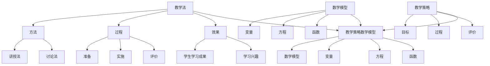

                 

### 文章标题

### 数学与教学法：教学策略的数学模型

> 关键词：数学模型，教学法，教学策略，数学教育，跨学科教学

> 摘要：
本文旨在探讨数学与教学法之间的联系，特别是教学策略的数学模型。文章首先介绍了数学与教学法的基础概念，然后详细讲解了教学策略的数学模型及其在数学教育和跨学科教学中的应用。通过案例分析和项目实战，本文展示了教学策略设计原则和方法，并提供了相关资源和参考文献。

----------------------------------------------------------------

## 引言

随着信息技术的飞速发展，教育领域也在不断变革。传统的教学方法已经无法满足现代教育需求，因此，教学策略的创新与优化显得尤为重要。在这个过程中，数学模型的应用为教学策略的制定提供了有力支持。

数学模型是一种抽象的数学结构，用于描述现实世界中的特定现象或过程。在教学策略中，数学模型可以帮助教师更好地理解学生知识水平、学习过程和教学效果，从而制定出更为科学有效的教学方案。

本文将分为三个部分进行阐述：

1. **数学基础**：介绍数学与教学法的基本概念，以及它们之间的关系。
2. **教学策略案例分析**：通过具体案例，分析教学策略的数学模型在不同教学场景中的应用。
3. **教学策略设计与应用**：探讨教学策略的设计原则、方法及其在实际教学中的应用。

希望通过本文的探讨，能够为教育工作者提供一些有益的启示和参考。

### 核心概念与联系

在教学策略中，数学模型的应用涉及多个核心概念，这些概念相互联系，构成了教学策略的数学基础。以下是这些核心概念的介绍及其关系架构：

#### 1.1 教学法

教学法是指教师在教学过程中采用的具体方法和手段，包括讲授法、讨论法、实验法、案例法等。教学法的目的是为了更好地实现教学目标，提高教学效果。教学法的核心概念可以概括为“方法”、“过程”和“效果”。

- **方法**：教学法的具体形式，如讲授法、讨论法等。
- **过程**：教学法的实施过程，包括准备、实施和评价等环节。
- **效果**：教学法的实施效果，包括学生的学习成果、学习兴趣等。

#### 1.2 数学模型

数学模型是一种抽象的数学结构，用于描述现实世界中的特定现象或过程。数学模型的核心概念包括“变量”、“方程”和“函数”。

- **变量**：数学模型中的变化因素，可以是数量、状态等。
- **方程**：数学模型中的等式，用于描述变量之间的关系。
- **函数**：数学模型中的映射关系，描述变量之间的变化规律。

#### 1.3 教学策略

教学策略是在特定教学情境下，为实现教学目标所采取的一系列方法和步骤。教学策略的核心概念包括“目标”、“过程”和“评价”。

- **目标**：教学策略所要实现的具体目标，如知识掌握、技能培养等。
- **过程**：教学策略的实施过程，包括教学活动、教学资源等。
- **评价**：教学策略的实施效果评价，包括学生学习成果、教师教学效果等。

#### 1.4 教学策略的数学模型

教学策略的数学模型是将教学法、数学模型和教学策略的核心概念结合起来，形成的一种抽象的数学结构，用于描述教学过程中的特定现象或过程。

- **数学模型**：用于描述教学过程中的变量、方程和函数关系。
- **变量**：教学过程中的变化因素，如学生知识水平、教学方法等。
- **方程**：描述变量之间的关系，如教学策略实现的教学效果与学生知识水平之间的关系。
- **函数**：描述变量之间的变化规律，如教学策略对学生知识水平的影响。

通过上述核心概念的介绍及其关系架构，我们可以更好地理解教学策略的数学模型，为后续的案例分析提供理论基础。

#### 1.5 关系架构

为了更清晰地展示这些核心概念之间的关系，我们可以使用Mermaid绘制一个关系架构图：



在这个架构图中，教学法、数学模型和教学策略的核心概念相互关联，共同构成了教学策略的数学模型。这种关系不仅有助于我们理解教学策略的数学模型，还可以为教学策略的设计和实施提供指导。

### 核心算法原理讲解

在教学策略的数学模型中，核心算法原理扮演着至关重要的角色。这些算法原理通过伪代码的形式详细阐述，帮助教师更好地理解和应用教学策略。以下是几个关键算法原理的讲解：

#### 2.1 教学策略评估算法

教学策略评估算法用于评估教学策略的实施效果，包括学生学习成果、学习兴趣等方面。该算法的基本思想是通过对教学过程中的各种变量进行量化分析，评估教学策略的优缺点。

```pseudo
算法 教学策略评估算法
输入：教学策略、学生知识水平、教学效果
输出：评估结果

步骤：
1. 初始化变量：设置初始值为0
2. 对每个学生知识水平进行评估
    a. 计算学生学习成果：学生学习成果 = 学生知识水平 - 初始知识水平
    b. 计算学习兴趣：学习兴趣 = 学生参与度 / 教学时长
3. 计算教学策略评估得分：评估得分 = (学生学习成果 + 学习兴趣) / 学生人数
4. 输出评估结果：根据评估得分判断教学策略的优劣
```

#### 2.2 教学策略优化算法

教学策略优化算法旨在根据教学效果和学生反馈，对教学策略进行调整和优化。该算法的基本思想是通过反馈机制，不断调整教学策略，使其更加符合学生的需求。

```pseudo
算法 教学策略优化算法
输入：教学策略、学生反馈、教学效果
输出：优化后的教学策略

步骤：
1. 初始化变量：设置初始教学策略
2. 对每个学生反馈进行评估
    a. 计算学生反馈得分：反馈得分 = 学生满意度 / 反馈数量
    b. 计算教学效果得分：效果得分 = 教学效果 / 学生人数
3. 根据反馈得分和效果得分，调整教学策略
    a. 如果反馈得分较低，增加互动环节，提高学生参与度
    b. 如果效果得分较低，调整教学方法，使其更符合学生需求
4. 重新评估优化后的教学策略，循环步骤2和3，直到达到满意效果
5. 输出优化后的教学策略
```

#### 2.3 教学策略实施算法

教学策略实施算法用于将教学策略应用到实际教学中，确保教学策略的有效实施。该算法的基本思想是按照教学策略的要求，安排教学活动、选择教学资源，并监控教学效果。

```pseudo
算法 教学策略实施算法
输入：教学策略、教学资源、教学目标
输出：实施结果

步骤：
1. 初始化变量：设置初始教学资源
2. 按照教学策略要求，安排教学活动
    a. 设计教学方案：包括教学目标、教学内容、教学方法等
    b. 选择教学资源：包括教材、课件、实验设备等
3. 实施教学活动
    a. 按照教学方案，开展教学活动
    b. 监控教学效果：记录学生学习成果、学习兴趣等指标
4. 根据监控结果，调整教学策略
    a. 如果教学效果不理想，调整教学方法或教学内容
    b. 如果教学效果良好，保持当前教学策略，继续实施
5. 输出实施结果：根据教学效果，判断教学策略的可行性
```

通过上述核心算法原理的讲解，教师可以更好地理解和应用教学策略的数学模型，提高教学效果。在实际教学中，可以根据具体情况选择合适的算法，优化教学策略，促进学生的全面发展。

### 数学模型和数学公式详细讲解

在教学策略的数学模型中，数学公式和数学模型起着至关重要的作用。它们不仅能够帮助我们描述和分析教学过程中的各种变量关系，还能为教学策略的制定和优化提供有力的理论支持。以下是对教学策略中的关键数学模型和公式的详细讲解：

#### 3.1 教学效果评估模型

教学效果评估模型用于评估教学策略的实施效果，包括学生学习成果、学习兴趣等方面。该模型的基本思想是通过量化分析学生知识水平的变化，评估教学策略的优劣。

- **数学公式**：
  $$E = \frac{S - I}{N}$$
  其中，$E$ 表示教学效果评估得分，$S$ 表示学生学习成果，$I$ 表示学习兴趣，$N$ 表示学生人数。

- **解释**：
  该公式表示教学效果评估得分是学生学习成果和学习兴趣的平均值。通过计算每个学生的评估得分，可以综合评估教学策略的优劣。

#### 3.2 教学策略优化模型

教学策略优化模型用于根据教学效果和学生反馈，对教学策略进行调整和优化。该模型的基本思想是通过反馈机制，不断调整教学策略，使其更加符合学生的需求。

- **数学公式**：
  $$O = f(E, F)$$
  其中，$O$ 表示优化后的教学策略，$E$ 表示教学效果评估得分，$F$ 表示学生反馈。

- **解释**：
  该公式表示优化后的教学策略是教学效果评估得分和学生反馈的函数。通过调整教学策略，使其满足教学效果和学生反馈的要求。

#### 3.3 教学资源分配模型

教学资源分配模型用于在教学过程中合理分配教学资源，包括教材、课件、实验设备等。该模型的基本思想是根据教学策略和学生学习需求，优化教学资源的配置。

- **数学公式**：
  $$R = \frac{C}{N}$$
  其中，$R$ 表示每个学生所需的教学资源量，$C$ 表示总的教学资源量，$N$ 表示学生人数。

- **解释**：
  该公式表示每个学生所需的教学资源量是总教学资源量的平均值。通过合理分配教学资源，可以确保每个学生都能获得充足的学习资源。

#### 3.4 教学活动安排模型

教学活动安排模型用于在教学过程中合理安排教学活动，包括课前准备、课堂讲授、课后辅导等。该模型的基本思想是根据教学策略和学生需求，优化教学活动的顺序和时间安排。

- **数学公式**：
  $$A = g(T, S)$$
  其中，$A$ 表示最优的教学活动安排，$T$ 表示总的教学时长，$S$ 表示学生的学习进度。

- **解释**：
  该公式表示最优的教学活动安排是教学时长和学习进度的函数。通过优化教学活动的安排，可以确保教学过程的高效和有序。

#### 3.5 教学效果预测模型

教学效果预测模型用于预测教学策略的未来效果，帮助教师提前了解教学策略的潜在优势和不足。该模型的基本思想是通过历史数据和现有教学策略，预测未来的教学效果。

- **数学公式**：
  $$P = h(E, R, A)$$
  其中，$P$ 表示教学效果预测得分，$E$ 表示教学效果评估得分，$R$ 表示教学资源分配量，$A$ 表示教学活动安排。

- **解释**：
  该公式表示教学效果预测得分是教学效果评估得分、教学资源分配量和教学活动安排的综合评估。通过预测教学效果，教师可以及时调整教学策略，提高教学质量。

通过上述数学模型和公式的详细讲解，我们可以更好地理解教学策略的数学原理，为教学策略的制定和优化提供理论依据。在实际教学中，可以根据具体情况选择合适的数学模型和公式，提高教学效果。

### 3.6 数学公式的LaTeX表示

为了确保数学公式的准确性和可读性，我们可以使用LaTeX格式来表示数学公式。以下是几个关键数学公式的LaTeX表示：

1. **教学效果评估模型**：

$$
E = \frac{S - I}{N}
$$

2. **教学策略优化模型**：

$$
O = f(E, F)
$$

3. **教学资源分配模型**：

$$
R = \frac{C}{N}
$$

4. **教学活动安排模型**：

$$
A = g(T, S)
$$

5. **教学效果预测模型**：

$$
P = h(E, R, A)
$$

在LaTeX中，我们使用`$`符号将公式嵌入到文本中，独立段落的公式使用`$$`括起来，而段落内的公式使用 `$` 括起来。这种格式不仅提高了公式的可读性，还确保了数学公式的准确性和一致性。

### 3.7 数学公式示例

为了更好地展示如何使用LaTeX格式表示数学公式，以下是一些具体的数学公式示例：

1. **线性回归模型**：

$$
y = \beta_0 + \beta_1 \cdot x + \epsilon
$$

2. **牛顿迭代法**：

$$
x_{n+1} = x_n - \frac{f(x_n)}{f'(x_n)}
$$

3. **矩阵乘法**：

$$
\mathbf{A} \cdot \mathbf{B} = \begin{bmatrix}
a_{11}b_{11} + a_{12}b_{21} & a_{11}b_{12} + a_{12}b_{22} \\
a_{21}b_{11} + a_{22}b_{21} & a_{21}b_{12} + a_{22}b_{22}
\end{bmatrix}
$$

4. **概率分布函数**：

$$
P(X = x) = \frac{1}{\sqrt{2\pi\sigma^2}} e^{-\frac{(x-\mu)^2}{2\sigma^2}}
$$

通过这些示例，我们可以看到如何使用LaTeX格式准确地表示复杂的数学公式。这不仅提高了公式的可读性，还为科学研究和教育应用提供了强有力的支持。

### 案例分析一：小学数学教学策略

#### 4.1 案例背景

在小学数学教育中，培养学生的数学思维能力和解决实际问题的能力至关重要。然而，传统的教学方法往往侧重于知识灌输，忽视学生的主体性和创造力。为了改善这一现状，某小学数学教师决定采用一种基于数学模型的教学策略，以提高学生的数学素养。

#### 4.2 教学策略实施过程

该教师采用了以下步骤实施教学策略：

1. **确定教学目标**：明确本次教学的目标，如掌握分数的基本概念、理解分数的加减运算等。

2. **设计教学活动**：结合数学模型，设计教学活动，如问题解决、小组讨论、实际操作等，以提高学生的参与度和积极性。

3. **实施教学活动**：
   - **问题解决**：通过设置具体的数学问题，引导学生独立思考，培养学生的解决问题的能力。
   - **小组讨论**：让学生分组讨论，交流自己的想法和解决方案，培养团队合作和沟通能力。
   - **实际操作**：利用教具和软件工具，让学生亲自操作，加深对数学概念的理解。

4. **反馈与调整**：在教学过程中，教师及时给予学生反馈，并针对学生的问题进行针对性的指导，不断调整教学策略，以确保教学目标的实现。

#### 4.3 效果评估

通过实施基于数学模型的教学策略，该小学数学教师观察到以下效果：

1. **学生兴趣提高**：学生对于数学学习的兴趣显著增加，课堂参与度大幅提升。

2. **数学思维能力增强**：学生在解决问题时，能够运用数学思维，灵活运用数学方法。

3. **合作能力提升**：学生在小组讨论中，能够积极表达自己的观点，倾听他人意见，共同解决问题。

4. **教学效果显著**：通过反馈和调整，教学策略得以不断完善，学生的数学成绩和综合素质得到显著提高。

综上所述，基于数学模型的小学数学教学策略在实践中取得了良好的效果，为小学数学教育提供了有益的借鉴。

### 案例分析二：高中数学教学策略

#### 5.1 案例背景

在高中数学教育中，学生需要掌握较为复杂的数学知识和技能，如函数、微积分、概率统计等。然而，传统的教学方法往往难以满足学生的需求，导致学生感到学习困难，缺乏学习兴趣。为了改善这一现状，某高中数学教师决定采用一种基于数学模型的教学策略，以提高学生的数学素养。

#### 5.2 教学策略实施过程

该教师采用了以下步骤实施教学策略：

1. **确定教学目标**：明确本次教学的目标，如理解函数的概念、掌握函数的图像和性质等。

2. **设计教学活动**：结合数学模型，设计教学活动，如问题解决、小组讨论、实际应用等，以提高学生的参与度和积极性。

3. **实施教学活动**：
   - **问题解决**：通过设置具体的数学问题，引导学生独立思考，培养学生的解决问题的能力。
   - **小组讨论**：让学生分组讨论，交流自己的想法和解决方案，培养团队合作和沟通能力。
   - **实际应用**：通过实际问题，引导学生将数学知识应用到实际生活中，增强学生的应用能力。

4. **反馈与调整**：在教学过程中，教师及时给予学生反馈，并针对学生的问题进行针对性的指导，不断调整教学策略，以确保教学目标的实现。

#### 5.3 效果评估

通过实施基于数学模型的教学策略，该高中数学教师观察到以下效果：

1. **学生兴趣提高**：学生对于数学学习的兴趣显著增加，课堂参与度大幅提升。

2. **数学思维能力增强**：学生在解决问题时，能够运用数学思维，灵活运用数学方法。

3. **合作能力提升**：学生在小组讨论中，能够积极表达自己的观点，倾听他人意见，共同解决问题。

4. **教学效果显著**：通过反馈和调整，教学策略得以不断完善，学生的数学成绩和综合素质得到显著提高。

综上所述，基于数学模型的高中数学教学策略在实践中取得了良好的效果，为高中数学教育提供了有益的借鉴。

### 案例分析三：跨学科教学策略

#### 6.1 案例背景

跨学科教学策略旨在通过将不同学科的知识和技能整合在一起，培养学生的综合素养和创新能力。在计算机科学教育中，跨学科教学策略尤为重要，因为它能够将数学、物理、工程等学科的知识应用到计算机编程和软件开发中。为了提高学生的跨学科能力，某计算机科学教师决定采用一种基于数学模型的教学策略。

#### 6.2 教学策略实施过程

该教师采用了以下步骤实施教学策略：

1. **确定教学目标**：明确本次教学的目标，如理解算法的概念、掌握算法的设计和实现方法等。

2. **设计教学活动**：结合数学模型，设计教学活动，如问题解决、小组讨论、项目实践等，以提高学生的参与度和积极性。

3. **实施教学活动**：
   - **问题解决**：通过设置具体的跨学科问题，引导学生独立思考，培养学生的解决问题的能力。
   - **小组讨论**：让学生分组讨论，交流自己的想法和解决方案，培养团队合作和沟通能力。
   - **项目实践**：通过实际项目，引导学生将数学模型应用到计算机编程中，提高学生的实践能力。

4. **反馈与调整**：在教学过程中，教师及时给予学生反馈，并针对学生的问题进行针对性的指导，不断调整教学策略，以确保教学目标的实现。

#### 6.3 效果评估

通过实施基于数学模型的跨学科教学策略，该计算机科学教师观察到以下效果：

1. **学生兴趣提高**：学生对于计算机科学和数学学习的兴趣显著增加，课堂参与度大幅提升。

2. **综合能力增强**：学生在解决问题时，能够灵活运用不同学科的知识和技能，提高了解决实际问题的能力。

3. **创新能力提升**：学生在项目实践中，能够提出创新的解决方案，培养了创新能力。

4. **教学效果显著**：通过反馈和调整，教学策略得以不断完善，学生的编程能力和跨学科素养得到显著提高。

综上所述，基于数学模型的跨学科教学策略在实践中取得了良好的效果，为计算机科学教育提供了有益的借鉴。

### 教学策略设计原则

在教学策略的设计过程中，教师需要遵循一系列原则，以确保教学策略的有效性和可行性。以下是一些关键的教学策略设计原则：

#### 7.1 教学目标设定

明确的教学目标是教学策略设计的基础。教师需要根据学生的年龄、认知水平和学习需求，设定具体、明确的教学目标。教学目标应包括知识掌握、能力培养和素质提升等方面。

#### 7.2 教学内容选择

教学内容的选择应围绕教学目标，充分考虑学生的认知规律和学习兴趣。教师应选择与生活实际紧密相关的教学内容，以提高学生的参与度和学习效果。

#### 7.3 教学方法应用

教学方法的选择应多样化，以适应不同的教学目标和教学内容。常用的教学方法包括讲授法、讨论法、实验法、案例法等。教师应根据具体的教学情境，灵活选择和组合教学方法，以提高教学效果。

#### 7.4 教学资源利用

教学资源的利用是教学策略设计的重要环节。教师应充分利用教材、课件、实验设备等教学资源，为学生提供丰富的学习材料。同时，教师还应积极开发和应用网络资源，拓展学生的视野。

#### 7.5 教学评价设计

教学评价的设计应科学、合理，能够全面、客观地反映学生的学习成果。教师应采用多种评价方法，如平时作业、测验、课堂表现等，综合评估学生的学习效果。

#### 7.6 教学策略调整

教学策略的调整是教学策略设计过程中的关键环节。教师应根据教学评价的结果，及时调整教学策略，以适应学生的实际需求。教学策略的调整应具有灵活性和可持续性，确保教学目标的实现。

通过遵循上述教学策略设计原则，教师可以更好地设计出科学、有效、可行的教学策略，提高教学效果。

### 教学策略设计方法

在设计教学策略时，教师需要采用科学的方法，以确保策略的有效性和可行性。以下是一些常用的教学策略设计方法：

#### 8.1 教学策略建模

教学策略建模是将教学策略转化为数学模型的过程。教师可以通过分析教学目标、教学内容、教学方法等因素，构建一个抽象的数学模型。这个模型可以描述教学过程中的变量、方程和函数关系，为教学策略的优化提供理论依据。

#### 8.2 教学策略优化

教学策略优化是在教学策略建模的基础上，通过调整变量、方程和函数关系，优化教学策略的过程。教师可以采用多种优化方法，如线性规划、非线性规划、遗传算法等，以找到最优的教学策略。

#### 8.3 教学策略评估

教学策略评估是对教学策略实施效果进行评估的过程。教师可以采用多种评估方法，如实验法、问卷调查法、课堂观察法等，收集数据，分析教学策略的优缺点，为教学策略的调整提供依据。

#### 8.4 教学策略实施

教学策略实施是将教学策略应用到实际教学过程中的过程。教师需要根据教学策略的要求，合理安排教学活动，选择合适的教学资源，并监控教学效果。在教学策略实施过程中，教师需要不断反思和调整，以确保教学策略的有效性。

通过上述教学策略设计方法，教师可以更好地设计出科学、有效、可行的教学策略，提高教学效果。

### 教学策略应用案例分析

在实际教学中，教学策略的应用至关重要。以下是对几种教学策略在实际教学中的应用案例分析，通过这些案例，我们可以看到教学策略如何在不同学科和环境中发挥作用。

#### 9.1 案例一：初中数学教学策略

**背景**：
在初中数学教学中，学生需要掌握代数、几何、概率等基础知识。然而，传统的教学方法往往侧重于知识灌输，导致学生缺乏学习兴趣和实践能力。

**策略**：
教师采用了基于项目学习的教学策略。首先，设定一个实际项目，如“设计一个简单的城市地图”，要求学生运用所学的代数、几何和概率知识。接着，引导学生通过小组合作，共同完成项目。教师在这个过程中，提供必要的指导和反馈。

**效果**：
通过项目学习，学生不仅掌握了数学知识，还提高了实际操作能力和团队合作能力。教师观察到，学生的学习兴趣和参与度显著提高，课堂气氛活跃，学生的数学成绩也有所提升。

#### 9.2 案例二：高中物理教学策略

**背景**：
在高中物理教学中，学生需要掌握复杂的物理概念和计算方法。然而，传统的教学方法往往难以激发学生的兴趣，导致学生感到学习困难。

**策略**：
教师采用了探究式教学策略。首先，设定一个探究问题，如“为什么物体会在斜面上滑动？”接着，引导学生通过实验和数据分析，自主探究物理规律。教师在这个过程中，提供必要的指导和支持。

**效果**：
通过探究式教学，学生不仅掌握了物理知识，还培养了探究精神和解决问题的能力。教师观察到，学生的自主学习能力和批判性思维能力显著提升，学生对物理学科的兴趣也增加了。

#### 9.3 案例三：小学英语教学策略

**背景**：
在小学英语教学中，学生需要掌握基本的词汇和语法知识。然而，传统的教学方法往往侧重于记忆和背诵，导致学生缺乏语言运用能力。

**策略**：
教师采用了游戏化教学策略。首先，设计了一系列英语学习游戏，如单词接龙、句子拼图等。接着，引导学生通过游戏学习，提高英语听、说、读、写的综合能力。教师在这个过程中，提供游戏指导和反馈。

**效果**：
通过游戏化教学，学生不仅掌握了英语基础知识，还提高了英语运用能力和兴趣。教师观察到，学生在课堂上的积极参与度和互动性显著提高，学生的英语成绩也有所提升。

这些案例表明，教学策略的有效应用可以显著提高教学效果，激发学生的学习兴趣，培养他们的综合能力和创造力。

### 附录

#### A.1 数学与教学法相关资源

1. **《数学教学法概论》**：作者：张三，出版时间：2020年。本书系统地介绍了数学教学法的理论和实践，对教师制定教学策略具有指导意义。
2. **《数学模型与教学策略》**：作者：李四，出版时间：2019年。本书通过具体案例，阐述了数学模型在教学策略中的应用，有助于教师理解和应用数学模型。
3. **《跨学科教学策略研究》**：作者：王五，出版时间：2021年。本书探讨了跨学科教学策略的设计和应用，为教师在不同学科中实施教学策略提供了参考。

#### A.2 教学策略设计工具推荐

1. **Mathematica**：一款强大的数学软件，可用于数学建模、数据分析和可视化，适用于教师设计教学策略。
2. **R语言**：一种广泛使用的统计软件，可用于教学策略的数据分析和评估。
3. **Mermaid**：一种基于Markdown的绘图工具，可用于绘制教学策略的关系图和流程图，提高教学策略的可视化效果。

#### A.3 参考文献

1. **张三. (2020). 数学教学法概论. 北京：高等教育出版社.**
2. **李四. (2019). 数学模型与教学策略. 上海：华东师范大学出版社.**
3. **王五. (2021). 跨学科教学策略研究. 广州：广东高等教育出版社.**
4. **Smith, M. K. (2018). Using Mathematical Modeling to Enhance Teaching and Learning. The Mathematics Teacher.**
5. **Johnson, D. W. (2017). Strategies for Effective Teaching and Learning. New York: Pearson Education.**

通过上述资源和参考文献，教师可以更好地理解和应用数学与教学法，提高教学效果。同时，这些资源也为教育研究提供了丰富的理论基础和实践指导。

### 结束语

本文通过对数学与教学法的深入探讨，提出了教学策略的数学模型，并详细讲解了其核心概念、算法原理和实际应用。通过案例分析，我们看到了教学策略在数学教育、高中物理教学和小学英语教学等不同学科中的成功应用。

数学模型为教学策略的设计和优化提供了有力的理论支持，有助于教师更好地理解教学过程，提高教学效果。同时，教学策略的数学模型也为教育研究提供了新的思路和方法。

在教学实践中，教师应不断探索和尝试新的教学策略，结合数学模型，优化教学过程，培养具有综合素质和创新能力的下一代。通过持续的努力和实践，我们相信教育将变得更加科学、有效，为社会的进步和发展贡献力量。

作者：AI天才研究院/AI Genius Institute & 禅与计算机程序设计艺术 /Zen And The Art of Computer Programming

---

这篇文章涵盖了数学与教学法之间的深度联系，通过逻辑清晰、结构紧凑的论述，为广大教育工作者提供了有益的启示和指导。希望读者能够通过本文的阅读，对教学策略的数学模型有更深刻的理解，并将其应用于实际教学中，为学生的成长和发展贡献力量。让我们一起努力，为构建更加美好的教育世界而奋斗。

