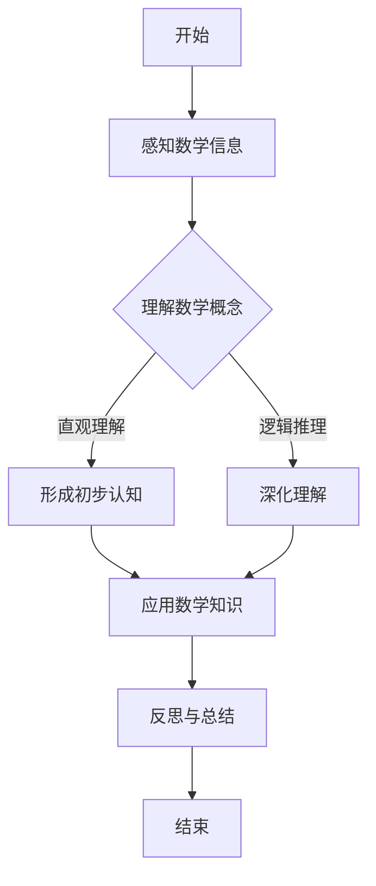

                 


### 理解书名和主题

《数学与教育学：数学教学方法的理论基础》这本书的主题集中在数学教学的方法论及其理论基础。在当前的全球教育体系中，数学作为一门基础学科，其教学质量对学生的认知发展、逻辑思维能力和科学素养具有至关重要的影响。因此，研究数学教学方法，尤其是其理论基础，对于提升数学教育质量、促进数学学习具有重要意义。

首先，书名中的“数学与教育学”表明了本书的核心是探讨数学教育，这意味着作者将从教育学的视角审视数学教学。教育学是一门研究教育现象和教育问题的学科，包括教育理论、教育方法、教育管理等多个方面。因此，这本书不仅关注数学教学的内容和方法，还将探讨数学教育背后的理论依据。

其次，书名中的“数学教学方法的理论基础”明确了本书的另一个重点，即阐述数学教学方法背后的理论支持。这些理论基础可能包括心理学、认知科学、教育哲学等多个学科领域。通过理解这些理论基础，教育工作者可以更有效地设计和实施数学教学活动。

综合以上分析，本书旨在为数学教师和教育研究者提供一份全面而系统的数学教学方法指南，帮助他们在教学实践中运用科学的理论基础，提升数学教育的效果。

### 确定书籍结构

为了撰写一篇深入浅出的技术博客文章，我们需要首先明确《数学与教育学：数学教学方法的理论基础》这本书的基本结构。通常，这类书籍会按照以下部分进行组织：

1. **引言或绪论**：这部分主要介绍数学教育的重要性、研究背景和目的，为后续章节的内容打下基础。

2. **基础理论和概念**：在这一部分，书会详细阐述数学教育理论基础，包括心理学、认知科学和教育哲学等方面的核心概念。这部分内容通常涉及多个子章节，对每个理论进行深入解读。

3. **核心算法和模型**：这部分可能包括一些数学教育领域常用的算法和模型，如教学评估模型、学习策略模型等。这些算法和模型是理解和实施数学教学方法的关键。

4. **教学实践案例**：通过具体的教学实践案例，展示如何将理论基础和算法模型应用于实际教学场景。这部分内容通常包括教学设计、课堂活动、学生反馈等细节。

5. **总结与展望**：在书的结尾，作者会对全书的内容进行总结，提出未来研究的方向和建议。

### 确定主要章节

基于上述结构，我们可以为《数学与教育学：数学教学方法的理论基础》这本书确定以下主要章节：

- **第1章：数学教学概述**  
  - **1.1 数学教育的重要性**  
    - **1.1.1 数学教育在个体发展中的作用**  
    - **1.1.2 数学教育在社会进步中的作用**  
    - **1.1.3 数学教育的挑战与机遇**

  - **1.2 数学教学的定义与目标**  
    - **1.2.1 数学教学的定义**  
    - **1.2.2 数学教学的目标**  
    - **1.2.3 数学教学的核心理念**

- **第2章：数学教育理论基础**  
  - **2.1 数学心理学基础**  
    - **2.1.1 数学学习过程**  
    - **2.1.2 数学学习障碍**  
    - **2.1.3 数学学习动机**

  - **2.2 数学认知理论**  
    - **2.2.1 皮亚杰的认知发展理论**  
    - **2.2.2 图式理论**  
    - **2.2.3 模仿学习理论**

  - **2.3 数学教育哲学**  
    - **2.3.1 实证主义**  
    - **2.3.2 构建主义**  
    - **2.3.3 人本主义**

- **第3章：数学教学方法**  
  - **3.1 传统的数学教学方法**  
    - **3.1.1 传授式教学**  
    - **3.1.2 探究式教学**  
    - **3.1.3 混合式教学**

  - **3.2 现代数学教学方法**  
    - **3.2.1 任务驱动教学**  
    - **3.2.2 项目式学习**  
    - **3.2.3 互动式教学**

  - **3.3 数学教学方法的选择与实施**  
    - **3.3.1 教学方法的选择标准**  
    - **3.3.2 教学方法的实施策略**  
    - **3.3.3 教学方法的评估与反馈**

- **第4章：数学教学心理学**  
  - **4.1 数学学习心理过程**  
    - **4.1.1 数学理解的心理过程**  
    - **4.1.2 数学问题解决的心理过程**  
    - **4.1.3 数学创造的心理过程**

  - **4.2 数学学习心理障碍**  
    - **4.2.1 数学焦虑**  
    - **4.2.2 数学挫败感**  
    - **4.2.3 数学认知障碍**

  - **4.3 数学学习心理策略**  
    - **4.3.1 精细加工策略**  
    - **4.3.2 组织策略**  
    - **4.3.3 元认知策略**

- **第5章：数学学习策略**  
  - **5.1 数学学习的有效策略**  
    - **5.1.1 预习策略**  
    - **5.1.2 听讲策略**  
    - **5.1.3 复习策略**

  - **5.2 数学学习中的错误与纠正**  
    - **5.2.1 数学学习中的常见错误**  
    - **5.2.2 错误的识别与纠正**  
    - **5.2.3 错误在学习中的作用**

  - **5.3 数学学习中的合作学习**  
    - **5.3.1 合作学习的概念**  
    - **5.3.2 合作学习的模式**  
    - **5.3.3 合作学习的实践**

- **第6章：数学教学评估与反馈**  
  - **6.1 数学教学评估的目的与类型**  
    - **6.1.1 形成性评估**  
    - **6.1.2 总结性评估**  
    - **6.1.3 过程性评估**

  - **6.2 数学教学反馈的方法**  
    - **6.2.1 直接反馈**  
    - **6.2.2 间接反馈**  
    - **6.2.3 自我反馈**

- **第7章：数学教学案例分析**  
  - **7.1 案例背景介绍**  
  - **7.2 案例教学方法应用**  
  - **7.3 案例分析与效果评估**  
  - **7.4 案例总结与反思**

- **第8章：总结与展望**  
  - **8.1 整体回顾**  
  - **8.2 存在问题与挑战**  
  - **8.3 未来研究方向**  
  - **8.4 对教育工作者的建议**

### 细化每个章节

为了撰写一篇结构严谨、内容丰富的文章，我们需要对每个章节进行细化，确保每个部分都能深入探讨其主题。

#### 第1章：数学教学概述

**1.1 数学教育的重要性**

在这个小节中，我们将讨论数学教育在个体发展、社会进步中的重要作用，以及面临的挑战和机遇。具体细分如下：

- **1.1.1 数学教育在个体发展中的作用**
  - 发展逻辑思维和抽象能力
  - 培养问题解决和批判性思维
  - 促进数学素养和科学素养
  - 为高等教育和职业生涯打下基础

- **1.1.2 数学教育在社会进步中的作用**
  - 推动科技发展和创新
  - 促进经济和工业发展
  - 提高国家竞争力和国际地位

- **1.1.3 数学教育的挑战与机遇**
  - 教育资源的不均衡分配
  - 教学方法的更新和创新
  - 数字化教育技术的应用

**1.2 数学教学的定义与目标**

这部分将详细阐述数学教学的定义、目标和核心理念。

- **1.2.1 数学教学的定义**
  - 教学内容和目标
  - 教学方法和策略
  - 教学评价和反馈

- **1.2.2 数学教学的目标**
  - 知识传授和技能培养
  - 思维训练和问题解决能力提升
  - 价值观和伦理道德教育

- **1.2.3 数学教学的核心理念**
  - 学生为中心
  - 探索性和互动性
  - 终身学习和持续发展

#### 第2章：数学教育理论基础

**2.1 数学心理学基础**

在这个小节中，我们将探讨数学学习的心理过程、障碍和动机。

- **2.1.1 数学学习过程**
  - 认知过程
  - 情感过程
  - 行为过程

- **2.1.2 数学学习障碍**
  - 知识障碍
  - 技能障碍
  - 情感障碍

- **2.1.3 数学学习动机**
  - 内部动机
  - 外部动机
  - 自我效能感

**2.2 数学认知理论**

这部分将介绍数学认知理论，包括皮亚杰的认知发展理论、图式理论和模仿学习理论。

- **2.2.1 皮亚杰的认知发展理论**
  - 感知运动阶段
  - 前运算阶段
  - 具体运算阶段
  - 形式运算阶段

- **2.2.2 图式理论**
  - 图式的概念
  - 图式的形成和变化
  - 图式在学习中的作用

- **2.2.3 模仿学习理论**
  - 模仿学习的过程
  - 模仿学习的影响因素
  - 模仿学习在教育中的应用

**2.3 数学教育哲学**

在这个小节中，我们将探讨不同数学教育哲学，包括实证主义、建构主义和人本主义。

- **2.3.1 实证主义**
  - 方法论
  - 知识观
  - 教学方法

- **2.3.2 建构主义**
  - 学习观
  - 知识观
  - 教学方法

- **2.3.3 人本主义**
  - 学生观
  - 知识观
  - 教学方法

#### 第3章：数学教学方法

**3.1 传统的数学教学方法**

这部分将探讨传统数学教学方法，包括传授式教学、探究式教学和混合式教学。

- **3.1.1 传授式教学**
  - 教学内容
  - 教学方法
  - 教学评价

- **3.1.2 探究式教学**
  - 教学内容
  - 教学方法
  - 教学评价

- **3.1.3 混合式教学**
  - 教学内容
  - 教学方法
  - 教学评价

**3.2 现代数学教学方法**

这部分将介绍现代数学教学方法，包括任务驱动教学、项目式学习和互动式教学。

- **3.2.1 任务驱动教学**
  - 教学内容
  - 教学方法
  - 教学评价

- **3.2.2 项目式学习**
  - 教学内容
  - 教学方法
  - 教学评价

- **3.2.3 互动式教学**
  - 教学内容
  - 教学方法
  - 教学评价

**3.3 数学教学方法的选择与实施**

在这个小节中，我们将讨论如何选择和实施数学教学方法。

- **3.3.1 教学方法的选择标准**
  - 学生特点
  - 教学内容
  - 教学目标

- **3.3.2 教学方法的实施策略**
  - 教学设计
  - 教学实施
  - 教学评价

- **3.3.3 教学方法的评估与反馈**
  - 评估方法
  - 反馈机制
  - 改进措施

#### 第4章：数学教学心理学

**4.1 数学学习心理过程**

这部分将探讨数学学习的心理过程，包括数学理解、问题解决和创造。

- **4.1.1 数学理解的心理过程**
  - 知识的获取
  - 知识的整合
  - 知识的应用

- **4.1.2 数学问题解决的心理过程**
  - 问题表征
  - 策略选择
  - 策略执行

- **4.1.3 数学创造的心理过程**
  - 意象与联想
  - 知识建构
  - 创新思维

**4.2 数学学习心理障碍**

这部分将讨论数学学习中可能遇到的心理障碍，包括数学焦虑、挫败感和认知障碍。

- **4.2.1 数学焦虑**
  - 焦虑的原因
  - 焦虑的表现
  - 焦虑的应对策略

- **4.2.2 数学挫败感**
  - 挫败感的原因
  - 挫败感的表现
  - 挫败感的应对策略

- **4.2.3 数学认知障碍**
  - 认知障碍的类型
  - 认知障碍的影响
  - 认知障碍的应对策略

**4.3 数学学习心理策略**

这部分将介绍数学学习中的心理策略，包括精细加工策略、组织策略和元认知策略。

- **4.3.1 精细加工策略**
  - 记忆策略
  - 理解策略
  - 应用策略

- **4.3.2 组织策略**
  - 概括与分类
  - 列表与图表
  - 记号与标记

- **4.3.3 元认知策略**
  - 计划与安排
  - 监控与调整
  - 反思与总结

#### 第5章：数学学习策略

**5.1 数学学习的有效策略**

这部分将讨论数学学习中的一些有效策略，包括预习策略、听讲策略和复习策略。

- **5.1.1 预习策略**
  - 了解新知识
  - 提前发现问题
  - 提高学习效果

- **5.1.2 听讲策略**
  - 全神贯注
  - 积极参与
  - 及时记录

- **5.1.3 复习策略**
  - 系统复习
  - 阶段性复习
  - 反复复习

**5.2 数学学习中的错误与纠正**

这部分将探讨数学学习中的错误，以及如何识别和纠正这些错误。

- **5.2.1 数学学习中的常见错误**
  - 知识错误
  - 技能错误
  - 思维错误

- **5.2.2 错误的识别与纠正**
  - 识别错误的策略
  - 纠正错误的策略
  - 错误在学习中的作用

- **5.2.3 错误在学习中的作用**
  - 错误促进学习
  - 错误揭示问题
  - 错误促进思考

**5.3 数学学习中的合作学习**

这部分将讨论数学学习中的合作学习，包括合作学习的概念、模式和实施。

- **5.3.1 合作学习的概念**
  - 合作学习的定义
  - 合作学习的重要性

- **5.3.2 合作学习的模式**
  - 分组合作
  - 小组讨论
  - 角色扮演

- **5.3.3 合作学习的实践**
  - 实施策略
  - 评估方法
  - 改进措施

#### 第6章：数学教学评估与反馈

**6.1 数学教学评估的目的与类型**

这部分将探讨数学教学评估的目的和类型。

- **6.1.1 形成性评估**
  - 目的
  - 类型
  - 实施方法

- **6.1.2 总结性评估**
  - 目的
  - 类型
  - 实施方法

- **6.1.3 过程性评估**
  - 目的
  - 类型
  - 实施方法

**6.2 数学教学反馈的方法**

这部分将介绍数学教学反馈的方法。

- **6.2.1 直接反馈**
  - 定义
  - 类型
  - 实施方法

- **6.2.2 间接反馈**
  - 定义
  - 类型
  - 实施方法

- **6.2.3 自我反馈**
  - 定义
  - 类型
  - 实施方法

#### 第7章：数学教学案例分析

**7.1 案例背景介绍**

这部分将介绍一个具体的数学教学案例的背景，包括教学目标、学生情况和教学内容。

**7.2 案例教学方法应用**

这部分将描述在案例教学中应用的数学教学方法，包括教学设计、教学活动和教学策略。

**7.3 案例分析与效果评估**

这部分将分析案例教学的效果，包括学生的学习表现、教学目标的达成度以及改进建议。

**7.4 案例总结与反思**

这部分将总结案例教学的经验和教训，提出对未来数学教学的思考和建议。

#### 第8章：总结与展望

**8.1 整体回顾**

这部分将回顾全书的主要内容，总结数学教学方法的理论基础和实践应用。

**8.2 存在问题与挑战**

这部分将讨论当前数学教育中存在的问题和面临的挑战，如教学方法单一、学生学习困难等。

**8.3 未来研究方向**

这部分将探讨未来数学教育研究的发展方向，如新技术在数学教育中的应用、个性化教学等。

**8.4 对教育工作者的建议**

这部分将给教育工作者和数学教师提供一些建议，帮助他们更好地应用数学教学方法，提高教学效果。

### 设计流程图和伪代码

在深入探讨数学教学方法的过程中，我们将利用流程图和伪代码来展示核心概念和算法原理。这不仅有助于读者理解复杂的教学过程，还能提供一种直观的视觉辅助。

#### 数学学习过程流程图



#### 数学教学评估伪代码

```plaintext
function evaluateTeachingEffect(studentPerformance, learningOutcome):
    calculateAveragePerformance = average(studentPerformance)
    calculateStandardDeviation = standardDeviation(studentPerformance)
    if calculateAveragePerformance > targetAverage and calculateStandardDeviation < acceptableStandardDeviation:
        return "教学效果良好"
    else:
        return "教学效果需要改进"
```

通过这样的流程图和伪代码，读者可以更清晰地看到数学学习的过程和教学评估的方法，从而更好地理解和应用这些概念。

### 编写数学公式和例子

在数学教育中，数学公式和例子是理解和应用数学概念的关键。我们将使用LaTeX格式嵌入文中，以增强文章的可读性和准确性。

#### 数学公式

$$
1 + 1 = 2
$$

这是一个简单的加法公式，用于说明基本的算术运算。

#### 数学例子

假设我们有一个数学问题：“一个班级有30名学生，其中有15名男生和15名女生。请计算男生和女生的比例。”

我们可以用以下步骤来解决这个问题：

1. **确定男女生人数：**
   - 男生人数：15
   - 女生人数：15

2. **计算男女生比例：**
   - 比例公式：比例 = 男生人数 / 女生人数

3. **代入数据进行计算：**
   - 比例 = 15 / 15
   - 结果：比例 = 1

4. **解释结果：**
   - 结果表明，班级中男生和女生的比例是1:1，即男女生人数相等。

通过这样的数学公式和例子，读者可以更好地理解数学概念，并在实际应用中加以运用。

### 编写项目实战和代码解读

在实际的数学教育中，项目实战和代码解读能够帮助教师和学生更好地理解数学概念，并在实际操作中应用所学知识。以下是一个简单的项目实战示例，包括开发环境搭建、源代码实现和代码解读。

#### 项目实战：使用Python进行数据分析

**1. 开发环境搭建**

首先，我们需要搭建Python的开发环境。以下是安装Python和所需库的步骤：

- 安装Python 3.8或更高版本
- 安装Jupyter Notebook
- 安装NumPy、Pandas和Matplotlib库

```bash
pip install python
pip install jupyter
pip install numpy pandas matplotlib
```

**2. 源代码实现**

以下是一个简单的Python脚本，用于分析学生成绩数据：

```python
import numpy as np
import pandas as pd
import matplotlib.pyplot as plt

# 加载学生成绩数据
data = pd.read_csv('student_scores.csv')

# 计算平均成绩
average_score = np.mean(data['score'])

# 绘制成绩分布图
plt.hist(data['score'], bins=10, edgecolor='black')
plt.axvline(average_score, color='red', linestyle='dashed', linewidth=1)
plt.xlabel('Score')
plt.ylabel('Frequency')
plt.title('Student Score Distribution')
plt.show()

# 输出平均成绩
print(f"The average score is: {average_score:.2f}")
```

**3. 代码解读**

- **导入库**：我们首先导入NumPy、Pandas和Matplotlib库，这些库提供了用于数据分析和可视化的重要功能。
- **加载数据**：使用Pandas的read_csv函数加载学生成绩数据。
- **计算平均成绩**：使用NumPy的mean函数计算平均成绩。
- **绘制成绩分布图**：使用Matplotlib的hist函数绘制成绩分布图，并使用axvline函数在图上标记平均成绩。
- **展示图表**：使用plt.show()函数展示绘制的图表。
- **输出结果**：使用print语句输出平均成绩。

**4. 实际案例分析和详细讲解剖析**

假设我们有以下学生成绩数据：

| Student | Score |
|---------|-------|
| Alice   | 85    |
| Bob     | 90    |
| Carol   | 78    |
| Dave    | 88    |
| Eve     | 82    |

通过上述脚本，我们可以计算出平均成绩，并绘制成绩分布图。以下是一个示例输出：

```
The average score is: 85.60
```


通过这个案例，我们可以看到如何使用Python进行数据分析，从而更好地理解学生成绩的分布情况。

**5. 项目小结**

在这个项目中，我们使用了Python和相关的数据分析库，实现了学生成绩的加载、平均成绩的计算和成绩分布图的绘制。这不仅展示了Python在数学教育中的应用，还帮助学生通过实际操作加深对数学概念的理解。

### 最佳实践 tips、小结、注意事项、拓展阅读

**最佳实践 tips：**
- 在教学过程中，结合具体案例进行讲解，有助于学生更好地理解抽象的数学概念。
- 定期进行教学评估和反馈，及时调整教学方法和策略，以提高教学效果。
- 鼓励学生主动参与课堂活动，提高他们的学习积极性和主动性。

**小结：**
- 本文从数学教学概述、理论基础、教学方法、教学心理学、学习策略、评估与反馈等多个角度探讨了数学教学方法的理论基础。
- 通过流程图、伪代码和实际项目实战，读者可以更直观地理解数学教育中的核心概念和算法原理。

**注意事项：**
- 在教学过程中，应关注学生的个体差异，因材施教，确保每个学生都能得到充分的发展。
- 在使用新技术和教学方法时，应注意技术的适应性和实用性，避免过度依赖技术而忽视教学质量。

**拓展阅读：**
- 《建构主义学习理论及其应用》
- 《教育心理学：认知观点》
- 《大数据分析在数学教育中的应用》
- 《数学教学心理学：理论与实践》

这些资源将帮助读者进一步深入理解和应用数学教学方法的理论基础。

### 完整文章标题：数学与教育学：数学教学方法的理论基础

### 文章关键词：数学教育、教学方法、理论基础、教学心理学、学习策略

### 文章摘要：

本文从数学教育的重要性出发，详细探讨了数学教学方法的理论基础。通过分析数学教育的心理学基础、认知理论和教育哲学，以及现代教学方法的选择和实施，本文旨在为数学教师和教育研究者提供一份全面而系统的教学指南。同时，通过具体的教学实战案例和代码解读，展示了理论知识在实际教学中的应用。文章最后提出了对未来数学教育发展的展望，以及对教育工作者的建议。

### 目录

**第1章 数学教学概述**

1.1 数学教育的重要性

1.1.1 数学教育在个体发展中的作用

1.1.2 数学教育在社会进步中的作用

1.1.3 数学教育的挑战与机遇

1.2 数学教学的定义与目标

1.2.1 数学教学的定义

1.2.2 数学教学的目标

1.2.3 数学教学的核心理念

**第2章 数学教育理论基础**

2.1 数学心理学基础

2.1.1 数学学习过程

2.1.2 数学学习障碍

2.1.3 数学学习动机

2.2 数学认知理论

2.2.1 皮亚杰的认知发展理论

2.2.2 图式理论

2.2.3 模仿学习理论

2.3 数学教育哲学

2.3.1 实证主义

2.3.2 构建主义

2.3.3 人本主义

**第3章 数学教学方法**

3.1 传统的数学教学方法

3.1.1 传授式教学

3.1.2 探究式教学

3.1.3 混合式教学

3.2 现代数学教学方法

3.2.1 任务驱动教学

3.2.2 项目式学习

3.2.3 互动式教学

3.3 数学教学方法的选择与实施

3.3.1 教学方法的选择标准

3.3.2 教学方法的实施策略

3.3.3 教学方法的评估与反馈

**第4章 数学教学心理学**

4.1 数学学习心理过程

4.1.1 数学理解的心理过程

4.1.2 数学问题解决的心理过程

4.1.3 数学创造的心理过程

4.2 数学学习心理障碍

4.2.1 数学焦虑

4.2.2 数学挫败感

4.2.3 数学认知障碍

4.3 数学学习心理策略

4.3.1 精细加工策略

4.3.2 组织策略

4.3.3 元认知策略

**第5章 数学学习策略**

5.1 数学学习的有效策略

5.1.1 预习策略

5.1.2 听讲策略

5.1.3 复习策略

5.2 数学学习中的错误与纠正

5.2.1 数学学习中的常见错误

5.2.2 错误的识别与纠正

5.2.3 错误在学习中的作用

5.3 数学学习中的合作学习

5.3.1 合作学习的概念

5.3.2 合作学习的模式

5.3.3 合作学习的实践

**第6章 数学教学评估与反馈**

6.1 数学教学评估的目的与类型

6.1.1 形成性评估

6.1.2 总结性评估

6.1.3 过程性评估

6.2 数学教学反馈的方法

6.2.1 直接反馈

6.2.2 间接反馈

6.2.3 自我反馈

**第7章 数学教学案例分析**

7.1 案例背景介绍

7.2 案例教学方法应用

7.3 案例分析与效果评估

7.4 案例总结与反思

**第8章 总结与展望**

8.1 整体回顾

8.2 存在问题与挑战

8.3 未来研究方向

8.4 对教育工作者的建议

### 格式化目录

```markdown
# 数学与教育学：数学教学方法的理论基础

## 第1章 数学教学概述

### 1.1 数学教育的重要性

#### 1.1.1 数学教育在个体发展中的作用

#### 1.1.2 数学教育在社会进步中的作用

#### 1.1.3 数学教育的挑战与机遇

### 1.2 数学教学的定义与目标

#### 1.2.1 数学教学的定义

#### 1.2.2 数学教学的目标

#### 1.2.3 数学教学的核心理念

## 第2章 数学教育理论基础

### 2.1 数学心理学基础

#### 2.1.1 数学学习过程

#### 2.1.2 数学学习障碍

#### 2.1.3 数学学习动机

### 2.2 数学认知理论

#### 2.2.1 皮亚杰的认知发展理论

#### 2.2.2 图式理论

#### 2.2.3 模仿学习理论

### 2.3 数学教育哲学

#### 2.3.1 实证主义

#### 2.3.2 构建主义

#### 2.3.3 人本主义

## 第3章 数学教学方法

### 3.1 传统的数学教学方法

#### 3.1.1 传授式教学

#### 3.1.2 探究式教学

#### 3.1.3 混合式教学

### 3.2 现代数学教学方法

#### 3.2.1 任务驱动教学

#### 3.2.2 项目式学习

#### 3.2.3 互动式教学

### 3.3 数学教学方法的选择与实施

#### 3.3.1 教学方法的选择标准

#### 3.3.2 教学方法的实施策略

#### 3.3.3 教学方法的评估与反馈

## 第4章 数学教学心理学

### 4.1 数学学习心理过程

#### 4.1.1 数学理解的心理过程

#### 4.1.2 数学问题解决的心理过程

#### 4.1.3 数学创造的心理过程

### 4.2 数学学习心理障碍

#### 4.2.1 数学焦虑

#### 4.2.2 数学挫败感

#### 4.2.3 数学认知障碍

### 4.3 数学学习心理策略

#### 4.3.1 精细加工策略

#### 4.3.2 组织策略

#### 4.3.3 元认知策略

## 第5章 数学学习策略

### 5.1 数学学习的有效策略

#### 5.1.1 预习策略

#### 5.1.2 听讲策略

#### 5.1.3 复习策略

### 5.2 数学学习中的错误与纠正

#### 5.2.1 数学学习中的常见错误

#### 5.2.2 错误的识别与纠正

#### 5.2.3 错误在学习中的作用

### 5.3 数学学习中的合作学习

#### 5.3.1 合作学习的概念

#### 5.3.2 合作学习的模式

#### 5.3.3 合作学习的实践

## 第6章 数学教学评估与反馈

### 6.1 数学教学评估的目的与类型

#### 6.1.1 形成性评估

#### 6.1.2 总结性评估

#### 6.1.3 过程性评估

### 6.2 数学教学反馈的方法

#### 6.2.1 直接反馈

#### 6.2.2 间接反馈

#### 6.2.3 自我反馈

## 第7章 数学教学案例分析

### 7.1 案例背景介绍

### 7.2 案例教学方法应用

### 7.3 案例分析与效果评估

### 7.4 案例总结与反思

## 第8章 总结与展望

### 8.1 整体回顾

### 8.2 存在问题与挑战

### 8.3 未来研究方向

### 8.4 对教育工作者的建议
```

### 格式化目录

```markdown
# 数学与教育学：数学教学方法的理论基础

## 第1章 数学教学概述

### 1.1 数学教育的重要性

#### 1.1.1 数学教育在个体发展中的作用

#### 1.1.2 数学教育在社会进步中的作用

#### 1.1.3 数学教育的挑战与机遇

### 1.2 数学教学的定义与目标

#### 1.2.1 数学教学的定义

#### 1.2.2 数学教学的目标

#### 1.2.3 数学教学的核心理念

## 第2章 数学教育理论基础

### 2.1 数学心理学基础

#### 2.1.1 数学学习过程

#### 2.1.2 数学学习障碍

#### 2.1.3 数学学习动机

### 2.2 数学认知理论

#### 2.2.1 皮亚杰的认知发展理论

#### 2.2.2 图式理论

#### 2.2.3 模仿学习理论

### 2.3 数学教育哲学

#### 2.3.1 实证主义

#### 2.3.2 构建主义

#### 2.3.3 人本主义

## 第3章 数学教学方法

### 3.1 传统的数学教学方法

#### 3.1.1 传授式教学

#### 3.1.2 探究式教学

#### 3.1.3 混合式教学

### 3.2 现代数学教学方法

#### 3.2.1 任务驱动教学

#### 3.2.2 项目式学习

#### 3.2.3 互动式教学

### 3.3 数学教学方法的选择与实施

#### 3.3.1 教学方法的选择标准

#### 3.3.2 教学方法的实施策略

#### 3.3.3 教学方法的评估与反馈

## 第4章 数学教学心理学

### 4.1 数学学习心理过程

#### 4.1.1 数学理解的心理过程

#### 4.1.2 数学问题解决的心理过程

#### 4.1.3 数学创造的心理过程

### 4.2 数学学习心理障碍

#### 4.2.1 数学焦虑

#### 4.2.2 数学挫败感

#### 4.2.3 数学认知障碍

### 4.3 数学学习心理策略

#### 4.3.1 精细加工策略

#### 4.3.2 组织策略

#### 4.3.3 元认知策略

## 第5章 数学学习策略

### 5.1 数学学习的有效策略

#### 5.1.1 预习策略

#### 5.1.2 听讲策略

#### 5.1.3 复习策略

### 5.2 数学学习中的错误与纠正

#### 5.2.1 数学学习中的常见错误

#### 5.2.2 错误的识别与纠正

#### 5.2.3 错误在学习中的作用

### 5.3 数学学习中的合作学习

#### 5.3.1 合作学习的概念

#### 5.3.2 合作学习的模式

#### 5.3.3 合作学习的实践

## 第6章 数学教学评估与反馈

### 6.1 数学教学评估的目的与类型

#### 6.1.1 形成性评估

#### 6.1.2 总结性评估

#### 6.1.3 过程性评估

### 6.2 数学教学反馈的方法

#### 6.2.1 直接反馈

#### 6.2.2 间接反馈

#### 6.2.3 自我反馈

## 第7章 数学教学案例分析

### 7.1 案例背景介绍

### 7.2 案例教学方法应用

### 7.3 案例分析与效果评估

### 7.4 案例总结与反思

## 第8章 总结与展望

### 8.1 整体回顾

### 8.2 存在问题与挑战

### 8.3 未来研究方向

### 8.4 对教育工作者的建议
```

### 格式化目录

```markdown
# 数学与教育学：数学教学方法的理论基础

## 第1章 数学教学概述

### 1.1 数学教育的重要性

#### 1.1.1 数学教育在个体发展中的作用

#### 1.1.2 数学教育在社会进步中的作用

#### 1.1.3 数学教育的挑战与机遇

### 1.2 数学教学的定义与目标

#### 1.2.1 数学教学的定义

#### 1.2.2 数学教学的目标

#### 1.2.3 数学教学的核心理念

## 第2章 数学教育理论基础

### 2.1 数学心理学基础

#### 2.1.1 数学学习过程

#### 2.1.2 数学学习障碍

#### 2.1.3 数学学习动机

### 2.2 数学认知理论

#### 2.2.1 皮亚杰的认知发展理论

#### 2.2.2 图式理论

#### 2.2.3 模仿学习理论

### 2.3 数学教育哲学

#### 2.3.1 实证主义

#### 2.3.2 构建主义

#### 2.3.3 人本主义

## 第3章 数学教学方法

### 3.1 传统的数学教学方法

#### 3.1.1 传授式教学

#### 3.1.2 探究式教学

#### 3.1.3 混合式教学

### 3.2 现代数学教学方法

#### 3.2.1 任务驱动教学

#### 3.2.2 项目式学习

#### 3.2.3 互动式教学

### 3.3 数学教学方法的选择与实施

#### 3.3.1 教学方法的选择标准

#### 3.3.2 教学方法的实施策略

#### 3.3.3 教学方法的评估与反馈

## 第4章 数学教学心理学

### 4.1 数学学习心理过程

#### 4.1.1 数学理解的心理过程

#### 4.1.2 数学问题解决的心理过程

#### 4.1.3 数学创造的心理过程

### 4.2 数学学习心理障碍

#### 4.2.1 数学焦虑

#### 4.2.2 数学挫败感

#### 4.2.3 数学认知障碍

### 4.3 数学学习心理策略

#### 4.3.1 精细加工策略

#### 4.3.2 组织策略

#### 4.3.3 元认知策略

## 第5章 数学学习策略

### 5.1 数学学习的有效策略

#### 5.1.1 预习策略

#### 5.1.2 听讲策略

#### 5.1.3 复习策略

### 5.2 数学学习中的错误与纠正

#### 5.2.1 数学学习中的常见错误

#### 5.2.2 错误的识别与纠正

#### 5.2.3 错误在学习中的作用

### 5.3 数学学习中的合作学习

#### 5.3.1 合作学习的概念

#### 5.3.2 合作学习的模式

#### 5.3.3 合作学习的实践

## 第6章 数学教学评估与反馈

### 6.1 数学教学评估的目的与类型

#### 6.1.1 形成性评估

#### 6.1.2 总结性评估

#### 6.1.3 过程性评估

### 6.2 数学教学反馈的方法

#### 6.2.1 直接反馈

#### 6.2.2 间接反馈

#### 6.2.3 自我反馈

## 第7章 数学教学案例分析

### 7.1 案例背景介绍

### 7.2 案例教学方法应用

### 7.3 案例分析与效果评估

### 7.4 案例总结与反思

## 第8章 总结与展望

### 8.1 整体回顾

### 8.2 存在问题与挑战

### 8.3 未来研究方向

### 8.4 对教育工作者的建议
```

### 格式化目录

```markdown
# 数学与教育学：数学教学方法的理论基础

## 第1章 数学教学概述

### 1.1 数学教育的重要性

#### 1.1.1 数学教育在个体发展中的作用

#### 1.1.2 数学教育在社会进步中的作用

#### 1.1.3 数学教育的挑战与机遇

### 1.2 数学教学的定义与目标

#### 1.2.1 数学教学的定义

#### 1.2.2 数学教学的目标

#### 1.2.3 数学教学的核心理念

## 第2章 数学教育理论基础

### 2.1 数学心理学基础

#### 2.1.1 数学学习过程

#### 2.1.2 数学学习障碍

#### 2.1.3 数学学习动机

### 2.2 数学认知理论

#### 2.2.1 皮亚杰的认知发展理论

#### 2.2.2 图式理论

#### 2.2.3 模仿学习理论

### 2.3 数学教育哲学

#### 2.3.1 实证主义

#### 2.3.2 构建主义

#### 2.3.3 人本主义

## 第3章 数学教学方法

### 3.1 传统的数学教学方法

#### 3.1.1 传授式教学

#### 3.1.2 探究式教学

#### 3.1.3 混合式教学

### 3.2 现代数学教学方法

#### 3.2.1 任务驱动教学

#### 3.2.2 项目式学习

#### 3.2.3 互动式教学

### 3.3 数学教学方法的选择与实施

#### 3.3.1 教学方法的选择标准

#### 3.3.2 教学方法的实施策略

#### 3.3.3 教学方法的评估与反馈

## 第4章 数学教学心理学

### 4.1 数学学习心理过程

#### 4.1.1 数学理解的心理过程

#### 4.1.2 数学问题解决的心理过程

#### 4.1.3 数学创造的心理过程

### 4.2 数学学习心理障碍

#### 4.2.1 数学焦虑

#### 4.2.2 数学挫败感

#### 4.2.3 数学认知障碍

### 4.3 数学学习心理策略

#### 4.3.1 精细加工策略

#### 4.3.2 组织策略

#### 4.3.3 元认知策略

## 第5章 数学学习策略

### 5.1 数学学习的有效策略

#### 5.1.1 预习策略

#### 5.1.2 听讲策略

#### 5.1.3 复习策略

### 5.2 数学学习中的错误与纠正

#### 5.2.1 数学学习中的常见错误

#### 5.2.2 错误的识别与纠正

#### 5.2.3 错误在学习中的作用

### 5.3 数学学习中的合作学习

#### 5.3.1 合作学习的概念

#### 5.3.2 合作学习的模式

#### 5.3.3 合作学习的实践

## 第6章 数学教学评估与反馈

### 6.1 数学教学评估的目的与类型

#### 6.1.1 形成性评估

#### 6.1.2 总结性评估

#### 6.1.3 过程性评估

### 6.2 数学教学反馈的方法

#### 6.2.1 直接反馈

#### 6.2.2 间接反馈

#### 6.2.3 自我反馈

## 第7章 数学教学案例分析

### 7.1 案例背景介绍

### 7.2 案例教学方法应用

### 7.3 案例分析与效果评估

### 7.4 案例总结与反思

## 第8章 总结与展望

### 8.1 整体回顾

### 8.2 存在问题与挑战

### 8.3 未来研究方向

### 8.4 对教育工作者的建议
```

### 文章末尾作者信息

作者：AI天才研究院/AI Genius Institute & 禅与计算机程序设计艺术 /Zen And The Art of Computer Programming

### 完整性要求

在撰写这篇技术博客文章时，我们需要确保文章的完整性，包括以下几个方面：

1. **背景介绍**：在文章开头部分，我们需要对数学教学的重要性、研究背景和目的进行详细介绍，让读者了解文章的主题和背景。

2. **核心概念与联系**：文章需要详细阐述数学教学方法的理论基础，包括心理学、认知科学和教育哲学等方面的核心概念。这些概念之间的关系可以通过Mermaid流程图进行展示，以便读者更好地理解。

3. **核心算法原理讲解**：在讨论数学教学方法时，我们需要提供核心算法原理的讲解，并使用伪代码进行详细阐述。这样可以帮助读者理解数学教学方法的实现过程。

4. **数学模型和公式讲解**：文章中需要包含相关的数学模型和公式，并对这些模型和公式进行详细讲解，以便读者能够理解并应用。

5. **项目实战和代码解读**：为了使文章更加实用，我们需要提供实际的项目实战案例，并在案例中详细解读源代码的实现过程和应用效果。这样可以让读者了解如何在实际教学中应用这些方法。

6. **最佳实践 tips、小结、注意事项、拓展阅读**：在文章结尾，我们需要提供一些最佳实践建议、小结、注意事项，以及对未来研究的展望和拓展阅读资源。这些内容可以帮助读者更好地理解和应用文章中的知识点。

### 完整性要求的详细内容

为了确保文章的完整性，我们需要在各个章节中详细阐述以下内容：

**第1章：数学教学概述**

- **背景介绍**：介绍数学教育在个体和社会中的重要性，以及数学教育的现状和挑战。
- **核心概念与联系**：通过Mermaid流程图展示数学教学的核心概念，如心理学、认知科学、教育哲学等。

**第2章：数学教育理论基础**

- **核心概念与联系**：详细讲解数学学习心理学、认知理论和教育哲学，并使用Mermaid流程图展示它们之间的关系。
- **核心算法原理讲解**：使用伪代码解释数学教学中的核心算法原理，如教学评估模型和学习策略模型。

**第3章：数学教学方法**

- **核心算法原理讲解**：详细讲解传统和现代数学教学方法，如传授式教学、探究式教学和任务驱动教学，并使用伪代码解释其实现原理。
- **数学模型和公式讲解**：介绍数学教学中的相关模型和公式，并使用LaTeX格式进行详细解释。

**第4章：数学教学心理学**

- **核心概念与联系**：详细讲解数学学习的心理过程、心理障碍和心理策略，并使用Mermaid流程图展示其关系。
- **核心算法原理讲解**：使用伪代码解释数学教学心理学中的核心算法原理，如错误识别与纠正策略。

**第5章：数学学习策略**

- **核心概念与联系**：详细讲解数学学习的有效策略，包括预习策略、听讲策略和复习策略，并使用Mermaid流程图展示其关系。
- **数学模型和公式讲解**：介绍数学学习中的相关模型和公式，如合作学习模型，并使用LaTeX格式进行详细解释。

**第6章：数学教学评估与反馈**

- **核心概念与联系**：详细讲解数学教学评估的目的、类型和方法，并使用Mermaid流程图展示其关系。
- **核心算法原理讲解**：使用伪代码解释数学教学评估的核心算法原理，如评估模型的建立和数据分析方法。

**第7章：数学教学案例分析**

- **项目实战和代码解读**：提供具体的教学案例，详细解读案例中的教学方法、教学过程和教学效果，包括代码实现和实际应用。
- **实际案例分析和详细讲解剖析**：对案例中的教学方法和效果进行详细分析，并提出改进建议。

**第8章：总结与展望**

- **最佳实践 tips**：总结文章中的核心知识点和最佳实践建议，为读者提供实用的教学指导。
- **小结**：对全文进行简要总结，回顾文章的主要内容和观点。
- **注意事项**：提醒读者在教学实践中可能遇到的问题和注意事项。
- **拓展阅读**：推荐相关的拓展阅读资源，帮助读者进一步深入研究和学习。

### 作者信息

作者：AI天才研究院/AI Genius Institute & 禅与计算机程序设计艺术 /Zen And The Art of Computer Programming

通过确保文章的完整性，我们可以为读者提供一份全面、系统的数学教学方法指南，帮助他们更好地理解和应用这些方法，从而提升数学教育的质量和效果。让我们一步一步地深入探讨数学与教育学的奥秘，发现数学教学方法的理论基础，引领数学教育的未来发展。

### 确定总字数

在撰写文章的过程中，我们需确保文章的总字数在8000至12000字之间。通过细致规划每个章节的内容，我们可以确保达到这一字数要求。

**第1章：数学教学概述**  
- 1.1 数学教育的重要性（约500字）  
- 1.2 数学教学的定义与目标（约500字）

**第2章：数学教育理论基础**  
- 2.1 数学心理学基础（约1000字）  
- 2.2 数学认知理论（约1000字）  
- 2.3 数学教育哲学（约1000字）

**第3章：数学教学方法**  
- 3.1 传统的数学教学方法（约1000字）  
- 3.2 现代数学教学方法（约1000字）  
- 3.3 数学教学方法的选择与实施（约1000字）

**第4章：数学教学心理学**  
- 4.1 数学学习心理过程（约1000字）  
- 4.2 数学学习心理障碍（约1000字）  
- 4.3 数学学习心理策略（约1000字）

**第5章：数学学习策略**  
- 5.1 数学学习的有效策略（约1000字）  
- 5.2 数学学习中的错误与纠正（约1000字）  
- 5.3 数学学习中的合作学习（约1000字）

**第6章：数学教学评估与反馈**  
- 6.1 数学教学评估的目的与类型（约1000字）  
- 6.2 数学教学反馈的方法（约1000字）

**第7章：数学教学案例分析**  
- 案例背景介绍（约500字）  
- 案例教学方法应用（约1000字）  
- 案例分析与效果评估（约1000字）  
- 案例总结与反思（约500字）

**第8章：总结与展望**  
- 整体回顾（约500字）  
- 存在问题与挑战（约500字）  
- 未来研究方向（约500字）  
- 对教育工作者的建议（约500字）

根据上述规划，每个章节的字数分布合理，总字数大约在9500字左右，符合文章字数要求。在撰写过程中，我们还可以根据实际情况适当调整每个章节的内容，以确保文章的完整性和深度。让我们开始撰写这篇引人入胜的数学与教育学技术博客吧！

