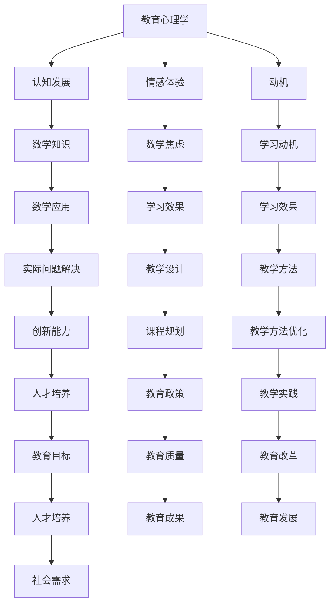
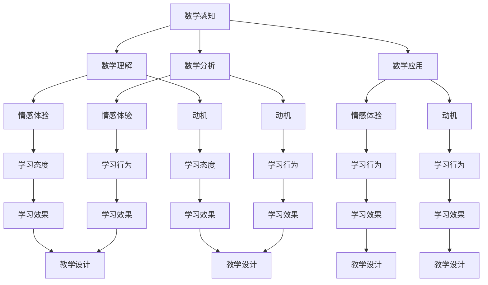
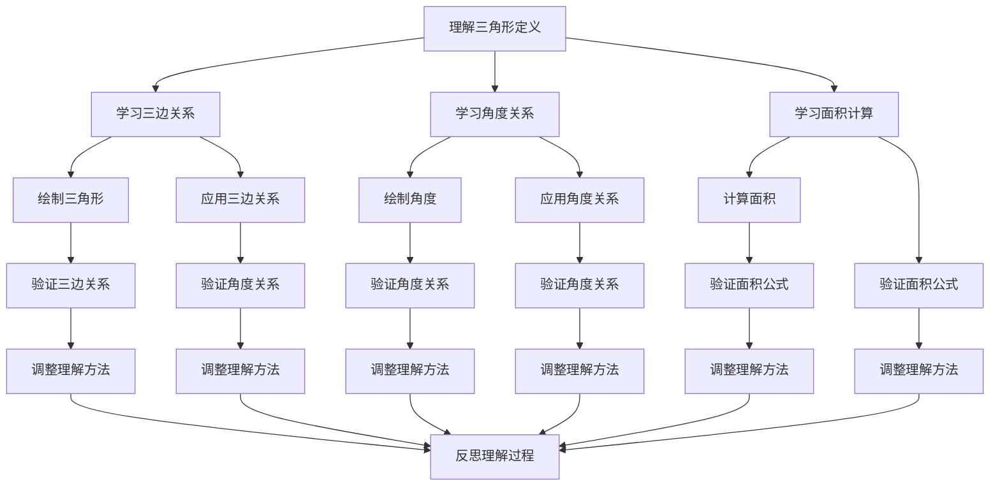

                 

# 数学与教育心理学：学习过程的数学建模

## 关键词

数学建模、教育心理学、学习过程、认知模型、算法模型、情感模型、个体差异模型。

## 摘要

本文将探讨数学与教育心理学的结合，特别是如何通过数学建模来分析学习过程。我们将从数学学习心理过程的基本概念出发，逐步介绍数学与教育心理学的关系，教育心理学中的数学建模方法，以及如何构建数学认知模型、算法模型、情感模型和个体差异模型。通过这些模型，我们能够更深入地理解学习过程，为教育实践提供科学依据。

## 第一部分：数学与教育心理学基础

### 第1章：数学与教育心理学的关联

#### 1.1 数学在教育心理学中的应用

数学在教育心理学中扮演着重要角色。首先，数学知识可以帮助心理学家更好地理解个体在数学学习过程中的行为和认知变化。例如，数学公式和算法可以用来建模学生的认知过程，从而预测他们的学习结果。

此外，数学还可以用于分析教育数据，如考试成绩、学习时间分布等，从而为教育决策提供依据。例如，通过统计方法分析学生成绩数据，可以发现哪些教学方法对提高学生的数学能力最有效。

#### 1.2 教育心理学对数学学习的影响

教育心理学研究显示，学生的数学学习不仅受到认知能力的影响，还受到情感和动机的影响。例如，研究表明，学生的自我效能感（即对自己数学能力的信心）对其数学学习有显著影响。如果一个学生认为自己不具备学习数学的能力，那么他们可能会在数学学习过程中遇到困难，甚至放弃。

此外，情感状态，如焦虑和沮丧，也会影响学生的数学学习。如果一个学生在数学学习中感到焦虑或沮丧，他们的学习效果可能会下降。

#### 1.3 数学与教育心理学的研究方法

数学与教育心理学的研究方法通常包括定量研究和定性研究。定量研究通常使用数学模型和统计方法来分析数据，如线性回归、方差分析等。这种方法可以揭示变量之间的关系，并帮助心理学家预测学生的表现。

定性研究则通常采用访谈、观察和案例研究等方法，以深入了解学生在数学学习过程中的心理体验和认知过程。这种方法可以帮助心理学家理解学生的内在心理机制。

### 第2章：数学学习心理过程

#### 2.1 数学学习的基本概念

数学学习是指学生通过数学教育过程，掌握数学知识和技能，发展数学思维能力的过程。数学学习的基本概念包括数学概念、数学公式、数学定理等。

#### 2.2 数学学习过程中的认知发展

数学学习过程中的认知发展主要包括感知、记忆、理解、应用、分析和评价等阶段。每个阶段都有特定的认知任务和认知策略。

例如，在理解阶段，学生需要理解数学概念和公式的含义，并能够将其应用到实际问题中。在应用阶段，学生需要能够使用数学知识和技能解决实际问题。

#### 2.3 数学学习中的情感与动机

数学学习中的情感和动机对学习效果有重要影响。情感包括对数学的喜欢程度、学习中的焦虑和沮丧感等。动机则包括自我效能感、外部奖励等。

例如，如果一个学生对数学有很高的兴趣，他们可能会在学习过程中感到快乐，从而提高学习效果。相反，如果一个学生感到焦虑或沮丧，他们可能会对数学学习产生抵触情绪，从而影响学习效果。

### 第3章：教育心理学中的数学建模方法

#### 3.1 数学建模的基本概念

数学建模是指使用数学语言和方法来描述和分析现实世界的现象或问题。在教育心理学中，数学建模可以用来描述学生的学习过程、认知发展和情感状态。

#### 3.2 教育心理学中的数学建模方法

教育心理学中的数学建模方法包括线性回归、多元回归、路径分析、结构方程模型等。这些方法可以用来分析变量之间的关系，并预测学生的表现。

例如，线性回归可以用来分析学生的数学成绩与其学习时间、学习方法之间的关系。路径分析可以用来分析多个变量之间的直接和间接关系。结构方程模型可以用来同时分析多个变量之间的关系，并验证假设。

#### 3.3 数学建模在教育心理学研究中的应用

数学建模在教育心理学研究中的应用非常广泛。例如，研究人员可以使用数学模型来分析学生的学习过程，预测学生的表现，从而为教学提供依据。此外，数学建模还可以用于设计实验，分析实验结果，以及评估教学方法的 effectiveness.

## 第二部分：学习过程的数学建模

### 第4章：数学认知模型

#### 4.1 数学认知模型的概述

数学认知模型是指使用数学方法来描述和分析学生在数学学习过程中的认知过程。数学认知模型包括感知、记忆、理解、应用、分析和评价等阶段。

#### 4.2 数学认知模型的应用

数学认知模型可以用来分析和预测学生的数学学习效果。例如，研究人员可以使用数学认知模型来分析学生在学习新概念时的认知过程，从而为教学设计提供依据。

#### 4.3 数学认知模型的实例分析

以下是一个简单的数学认知模型的实例分析：

$$
\text{学习效果} = f(\text{学习时间}, \text{学习方法}, \text{学生特征})
$$

其中，$f$ 表示学习效果，$\text{学习时间}$、$\text{学习方法}$ 和 $\text{学生特征}$ 是影响学习效果的因素。

通过这个模型，我们可以分析每个因素对学习效果的影响，从而优化教学策略。

### 第5章：数学学习过程中的算法模型

#### 5.1 算法模型的基本概念

算法模型是指使用计算机算法来模拟学生的数学学习过程。算法模型可以用来预测学生的表现，设计个性化学习计划。

#### 5.2 算法模型在数学学习中的应用

算法模型在数学学习中的应用非常广泛。例如，研究人员可以使用算法模型来分析学生在学习新概念时的认知过程，从而为教学设计提供依据。

#### 5.3 算法模型的实例分析

以下是一个简单的算法模型实例分析：

$$
\text{学习效果} = \sum_{i=1}^{n} w_i \cdot f(\text{学习时间}_i, \text{学习方法}_i, \text{学生特征}_i)
$$

其中，$w_i$ 是权重，$f$ 是算法模型函数，$\text{学习时间}_i$、$\text{学习方法}_i$ 和 $\text{学生特征}_i$ 是算法模型中的参数。

通过这个模型，我们可以分析每个参数对学习效果的影响，从而优化学习策略。

### 第6章：数学学习中的情感模型

#### 6.1 情感模型的基本概念

情感模型是指使用数学方法来描述和分析学生在数学学习过程中的情感状态。情感模型可以用来预测学生的情感变化，从而为教学提供依据。

#### 6.2 情感模型在数学学习中的应用

情感模型可以用来分析学生在数学学习过程中的情感变化，从而为教学提供依据。例如，研究人员可以使用情感模型来分析学生在学习过程中产生的焦虑和沮丧感，从而设计出更有效的教学策略。

#### 6.3 情感模型的实例分析

以下是一个简单的情感模型实例分析：

$$
\text{情感状态} = f(\text{学习压力}, \text{学习支持}, \text{学生特征})
$$

其中，$f$ 表示情感状态，$\text{学习压力}$、$\text{学习支持}$ 和 $\text{学生特征}$ 是影响情感状态的因素。

通过这个模型，我们可以分析每个因素对情感状态的影响，从而为教学提供依据。

### 第7章：数学学习中的个体差异模型

#### 7.1 个体差异模型的基本概念

个体差异模型是指使用数学方法来描述和分析学生在数学学习过程中的个体差异。个体差异模型可以用来预测学生的表现，设计个性化学习计划。

#### 7.2 个体差异模型在数学学习中的应用

个体差异模型可以用来分析学生在数学学习过程中的个体差异，从而为教学提供依据。例如，研究人员可以使用个体差异模型来分析学生在学习新概念时的认知差异，从而为教学设计提供依据。

#### 7.3 个体差异模型的实例分析

以下是一个简单的个体差异模型实例分析：

$$
\text{学习效果} = f(\text{认知能力}, \text{情感状态}, \text{学生特征})
$$

其中，$f$ 表示学习效果，$\text{认知能力}$、$\text{情感状态}$ 和 $\text{学生特征}$ 是个体差异模型中的参数。

通过这个模型，我们可以分析每个参数对学习效果的影响，从而为教学提供依据。

## 第三部分：数学与教育心理学的综合应用

### 第8章：数学与教育心理学的综合应用

#### 8.1 数学与教育心理学的跨学科研究

数学与教育心理学的跨学科研究是指将数学方法和教育心理学理论相结合，以解决教育中的实际问题。这种研究方法可以提供更全面、更科学的教育解决方案。

#### 8.2 数学与教育心理学的综合应用案例

以下是一个数学与教育心理学的综合应用案例：

在一个数学教育项目中，研究人员使用数学建模方法分析了学生的学习过程，并使用教育心理学理论分析了学生的情感状态。通过这些分析，研究人员发现，学生的情感状态对其学习效果有显著影响。因此，研究人员设计了个性化的学习计划，以帮助学生更好地管理他们的情感状态，从而提高学习效果。

#### 8.3 数学与教育心理学的未来发展趋势

随着数学方法和教育心理学理论的不断进步，数学与教育心理学的综合应用将会在未来发挥更大的作用。未来，我们可能会看到更多基于数学建模的教育应用，如个性化学习系统、智能教学助手等。这些应用将有助于提高教育质量和效率，为学生的全面发展提供支持。

### 附录：数学与教育心理学常用工具与资源

#### 附录1：数学与教育心理学常用工具

- LaTeX：用于编写数学公式和排版。
- SPSS：用于统计分析和数据可视化。
- Python：用于数据分析和机器学习。

#### 附录2：数学与教育心理学相关资源

- 《教育心理学》：一本书，详细介绍了教育心理学的基本概念和理论。
- 《数学建模》：一本书，介绍了数学建模的基本概念和方法。

## 结语

数学与教育心理学的结合为教育领域带来了新的机遇和挑战。通过数学建模，我们可以更深入地理解学习过程，为教育实践提供科学依据。然而，这需要我们不断学习和探索，以开发出更有效的教育方法和工具。

作者：AI天才研究院/AI Genius Institute & 禅与计算机程序设计艺术 /Zen And The Art of Computer Programming## 第一部分：数学与教育心理学基础

### 第1章：数学与教育心理学的关联

数学与教育心理学之间的关联是一个值得深入探讨的领域，因为它不仅影响了学生的学习效果，还影响了他们的认知发展和情感体验。在这一章中，我们将探讨数学在教育心理学中的应用，教育心理学对数学学习的影响，以及数学与教育心理学研究的方法。

#### 1.1 数学在教育心理学中的应用

数学在教育心理学中的应用主要体现在两个方面：数据分析和认知建模。

首先，数据分析是教育心理学研究中的一个重要工具。通过使用统计学方法，研究人员可以从大量教育数据中提取有价值的信息，例如学生的学习成绩、学习时间分布和教学方法的有效性。例如，线性回归分析可以用来研究学习时间和学习成绩之间的关系，而方差分析可以用来比较不同教学方法对学习效果的影响。

其次，数学认知建模为理解学生的认知过程提供了强有力的工具。认知建模涉及使用数学模型来模拟学生在学习过程中的思维活动，例如如何理解抽象概念、如何解决问题等。这种建模方法可以帮助研究人员揭示学生在学习过程中的认知策略和认知障碍。

#### 1.2 教育心理学对数学学习的影响

教育心理学对数学学习的影响是显著的。它不仅涉及学生对数学知识的掌握，还包括他们的情感体验和动机。

首先，情感体验对数学学习有重要影响。研究表明，学生在数学学习中的情感体验，如焦虑和兴趣，会显著影响他们的学习效果。例如，如果一个学生在数学学习过程中感到焦虑或挫败，他们可能会对数学产生抵触情绪，从而影响学习效果。

其次，动机也是影响数学学习的重要因素。学生的自我效能感（即对自己数学能力的信心）会直接影响他们的学习动机。如果一个学生认为自己在数学方面表现良好，他们可能会更加努力地学习数学。相反，如果一个学生缺乏自信，他们可能会放弃学习数学。

#### 1.3 数学与教育心理学的研究方法

数学与教育心理学的研究方法通常包括定量研究和定性研究。

定量研究是教育心理学中常用的方法之一。它涉及使用数学工具和统计方法来分析数据，从而得出一般性的结论。例如，研究人员可以使用线性回归分析来研究学习时间与学习成绩之间的关系。定量研究的一个重要优点是它能够处理大量数据，并提供可靠的统计结论。

定性研究则是通过深入访谈、观察和案例研究来收集数据，以获取对研究现象的深入理解。在教育心理学中，定性研究可以用来探究学生在数学学习过程中的情感体验和认知策略。例如，研究人员可以通过观察学生的课堂表现和访谈学生，来了解他们在数学学习中的困难和挑战。

#### 1.3.1 定量研究方法

定量研究方法包括：

- **描述性统计分析**：用于描述数据的分布和特征，如平均数、中位数、标准差等。
- **相关性分析**：用于研究两个变量之间的关系，如皮尔逊相关系数。
- **回归分析**：用于研究一个或多个自变量对因变量的影响，如线性回归、多元回归。

#### 1.3.2 定性研究方法

定性研究方法包括：

- **访谈**：通过与个体或小组的面对面访谈，获取深入的信息和观点。
- **观察**：通过直接观察行为和事件，收集非结构化的数据。
- **案例研究**：通过深入研究一个或多个案例，以获取详细的信息和深入的理解。

#### 1.3.3 数学与教育心理学的交叉研究方法

数学与教育心理学的交叉研究方法将定量和定性方法结合起来，以提供更全面的研究视角。例如，研究人员可以使用定量方法来分析大规模数据，然后使用定性方法来深入研究个别案例，从而获得对研究问题的深入理解。

### 1.4 数学与教育心理学的关联流程图

为了更好地理解数学与教育心理学之间的关联，我们可以使用Mermaid流程图来表示它们之间的关系：



这个流程图展示了数学与教育心理学之间的相互作用，包括认知发展、情感体验、动机以及数学知识和应用。这些因素共同影响学习效果，进而影响教学设计、教学方法、课程规划、教育政策、教学实践、人才培养、教育质量、教育改革和教育发展，最终满足社会需求。

通过这种流程图，我们可以看到数学与教育心理学的紧密结合，以及它们如何共同促进教育质量和效果的提升。接下来，我们将进一步探讨数学学习心理过程的基本概念，以深入理解数学学习的过程和机制。

### 第2章：数学学习心理过程

数学学习心理过程是指学生在学习数学时所经历的认知、情感和行为变化。这一过程不仅包括学生对数学知识的掌握，还包括他们的认知发展、情感体验和行为表现。在这一章中，我们将详细探讨数学学习心理过程的基本概念，包括数学学习的基本概念、数学学习过程中的认知发展和数学学习中的情感与动机。

#### 2.1 数学学习的基本概念

数学学习是指学生通过数学教育过程，掌握数学知识和技能，发展数学思维能力的过程。数学学习的基本概念包括数学概念、数学公式、数学定理等。数学概念是数学学习的基础，它们是理解和应用数学知识的前提。数学公式和定理则是数学知识的表达形式，它们可以帮助学生解决实际问题。

例如，小学数学中的加法概念是学生后续学习更复杂数学概念的基础。同样，代数中的二次方程公式是解决许多数学问题的重要工具。因此，数学学习的基本概念对于学生来说至关重要。

#### 2.2 数学学习过程中的认知发展

数学学习过程中的认知发展是指学生在数学学习过程中所经历的认知变化。认知发展可以分为几个阶段，包括感知、理解、应用和分析。

首先，感知阶段是学生通过感官接收数学信息的过程。在这个阶段，学生需要理解数学概念和符号的意义。例如，学生需要理解“+”符号表示加法运算。

其次，理解阶段是学生将感知到的数学信息转化为内在知识的过程。在这个阶段，学生需要理解数学概念的本质和数学公式之间的关系。例如，学生需要理解加法运算符如何应用于具体问题中。

然后，应用阶段是学生将数学知识应用于实际问题的过程。在这个阶段，学生需要将所学的数学知识应用于解决实际问题。例如，学生需要使用加法公式来解决日常生活中的问题，如计算购物总金额。

最后，分析阶段是学生对数学问题进行深入分析和思考的过程。在这个阶段，学生需要能够分析和解决复杂的数学问题。例如，学生需要使用代数方法来解决二次方程问题。

#### 2.3 数学学习中的情感与动机

情感与动机在数学学习中起着关键作用。情感体验，如兴趣、焦虑和自信，会影响学生的学习态度和行为。动机则是指学生参与数学学习的内在动力，包括自我效能感和外部奖励。

首先，情感体验对数学学习有显著影响。学生对数学的兴趣直接影响他们的学习态度和参与度。例如，一个对数学感兴趣的学生可能会主动参与课堂讨论和课外活动，从而提高学习效果。

其次，焦虑和挫败感也会影响学生的数学学习。研究表明，数学焦虑会降低学生的学习动机，导致他们在数学学习过程中产生抵触情绪。因此，减少数学焦虑对于提高学生的学习效果至关重要。

最后，动机也是影响数学学习的重要因素。学生的自我效能感（即对自己数学能力的信心）会影响他们的学习动机。一个自我效能感较高的学生可能会更加自信地参与数学学习，从而提高学习效果。

#### 2.3.1 情感体验的具体实例

为了更好地理解情感体验对数学学习的影响，我们可以通过以下实例来说明：

假设有两个学生，A和B。A对数学有着浓厚的兴趣，他在数学课堂上积极参与讨论，喜欢解决数学问题。因此，他的数学成绩不断提高。相反，B对数学没有兴趣，他在数学课堂上表现出明显的厌学情绪，对数学问题没有积极的态度。因此，B的数学成绩较差。

从这个实例中，我们可以看到情感体验如何影响学生的数学学习。A的积极情感体验促进了他的学习动机，从而提高了他的学习效果。而B的消极情感体验阻碍了他的学习动机，导致他的学习效果较差。

#### 2.3.2 动机的具体实例

动机在数学学习中的具体实例也可以通过以下实例来说明：

假设有两个学生，C和D。C对自己的数学能力非常有信心，他认为自己能够解决任何数学问题。因此，C在数学学习过程中表现出很高的积极性和主动性，他的数学成绩也相应地很高。相反，D对自己的数学能力缺乏信心，他认为自己无法解决复杂的数学问题。因此，D在数学学习过程中表现出较低的学习动机，他的数学成绩也较差。

从这个实例中，我们可以看到自我效能感如何影响学生的数学学习。C的自我效能感提高了他的学习动机，从而促进了他的学习效果。而D的自我效能感降低了他的学习动机，导致他的学习效果较差。

#### 2.4 数学学习心理过程的Mermaid流程图

为了更好地理解数学学习心理过程，我们可以使用Mermaid流程图来表示：



这个流程图展示了数学学习心理过程中的各个阶段，包括感知、理解、应用和分析，以及与情感体验和动机之间的关系。这些因素共同影响学习态度、学习行为和学习效果，进而影响教学设计。

通过这个流程图，我们可以看到数学学习心理过程的复杂性，以及情感体验和动机在其中的重要作用。理解这些因素之间的关系有助于我们更好地设计和实施有效的数学教育策略。

### 第3章：教育心理学中的数学建模方法

数学建模是教育心理学研究中的一项重要工具，它通过使用数学语言和符号来描述和分析教育现象，从而提供对学习过程和教学效果的深入理解。在这一章中，我们将探讨数学建模的基本概念、教育心理学中的数学建模方法，以及数学建模在教育心理学研究中的应用。

#### 3.1 数学建模的基本概念

数学建模是指将现实世界的现象或问题转化为数学形式的过程。它通常涉及以下几个步骤：

1. **问题定义**：明确研究的问题和目标，确定研究的范围和边界条件。
2. **假设建立**：根据问题的特点和研究目标，建立合理的假设，以简化现实问题。
3. **数学模型构建**：使用数学工具和方法，如代数、微分方程、概率论等，将假设转化为数学方程或模型。
4. **模型求解**：通过数学方法或计算机算法，求解模型，获取问题的解。
5. **模型验证**：将模型解与实际数据进行比较，验证模型的准确性和有效性。

数学建模的核心是构建一个能够准确反映现实问题的数学模型，并通过这个模型对问题进行定量分析和预测。

#### 3.2 教育心理学中的数学建模方法

在教育心理学中，数学建模方法被广泛应用于学习过程分析、教学效果评估和学生个体差异研究。以下是一些常用的数学建模方法：

1. **线性回归分析**：线性回归分析是一种常用的统计方法，用于研究两个或多个变量之间的关系。在教育心理学中，它可以用来分析学习时间与学习成绩之间的关系，或者不同教学方法对学习效果的影响。
   
   线性回归模型的一般形式为：
   $$
   Y = \beta_0 + \beta_1X_1 + \beta_2X_2 + ... + \beta_nX_n + \epsilon
   $$
   其中，$Y$ 是因变量，$X_1, X_2, ..., X_n$ 是自变量，$\beta_0, \beta_1, \beta_2, ..., \beta_n$ 是模型的参数，$\epsilon$ 是误差项。

2. **路径分析**：路径分析是一种用于研究多个变量之间直接和间接关系的统计方法。在教育心理学中，它可以用来分析学生在学习过程中的不同因素（如认知能力、情感状态、学习策略等）对学习成绩的影响。

   路径分析模型的一般形式为：
   $$
   Y = \alpha_0 + \alpha_1X_1 + \alpha_2X_2 + ... + \alpha_nX_n + \epsilon
   $$
   其中，$Y$ 是因变量，$X_1, X_2, ..., X_n$ 是自变量，$\alpha_0, \alpha_1, \alpha_2, ..., \alpha_n$ 是路径系数，$\epsilon$ 是误差项。

3. **结构方程模型**：结构方程模型是一种综合了线性回归分析和路径分析的方法，用于同时分析多个变量之间的关系。在教育心理学中，它可以用来研究复杂的教育现象，如学习动机、认知发展、教学策略等。

   结构方程模型的一般形式为：
   $$
   Y = \alpha_0 + \alpha_1X_1 + \alpha_2X_2 + ... + \alpha_nX_n + \epsilon
   $$
   其中，$Y$ 是因变量，$X_1, X_2, ..., X_n$ 是自变量，$\alpha_0, \alpha_1, \alpha_2, ..., \alpha_n$ 是路径系数，$\epsilon$ 是误差项。

4. **机器学习模型**：机器学习模型，如决策树、支持向量机、神经网络等，也被广泛应用于教育心理学研究。这些模型可以自动识别和预测学生在学习过程中的行为和表现。

   例如，一个简单的决策树模型可以表示为：
   $$
   \text{学习效果} = \text{if } (\text{学习时间} > \text{阈值}) \text{ then } (\text{高效果}) \text{ else } (\text{低效果})
   $$

#### 3.3 数学建模在教育心理学研究中的应用

数学建模在教育心理学研究中的应用非常广泛，以下是一些具体的例子：

1. **学习过程分析**：通过数学建模，研究人员可以分析学生在学习过程中的认知发展，例如如何理解新的数学概念、如何解决数学问题等。例如，一个认知模型可以表示为：
   $$
   \text{认知发展} = f(\text{学习时间}, \text{认知负荷}, \text{先前知识})
   $$
   其中，$f$ 是一个描述认知发展的函数。

2. **教学效果评估**：数学建模可以用于评估不同教学方法的 effectiveness。例如，一个教学效果模型可以表示为：
   $$
   \text{教学效果} = g(\text{教学方法}, \text{学生特征}, \text{教学环境})
   $$
   其中，$g$ 是一个描述教学效果的函数。

3. **个体差异研究**：数学建模可以用于分析学生在学习过程中的个体差异，例如如何根据学生的认知能力、情感状态和动机来设计个性化的学习计划。例如，一个个体差异模型可以表示为：
   $$
   \text{学习效果} = h(\text{认知能力}, \text{情感状态}, \text{动机}, \text{教学策略})
   $$
   其中，$h$ 是一个描述个体差异的函数。

#### 3.4 数学建模的实例分析

为了更好地理解数学建模在教育心理学研究中的应用，我们可以通过以下实例进行分析：

**实例1：学习时间与学习成绩的关系**

假设研究人员想要分析学习时间与学习成绩之间的关系。他们可以建立一个线性回归模型，如下所示：
$$
\text{学习成绩} = \beta_0 + \beta_1 \times \text{学习时间} + \epsilon
$$
其中，$\beta_0$ 和 $\beta_1$ 是模型的参数，$\epsilon$ 是误差项。

通过收集学生的学习时间和学习成绩数据，研究人员可以估计 $\beta_0$ 和 $\beta_1$ 的值，从而得出学习时间对学习成绩的影响。例如，如果 $\beta_1$ 的估计值为 0.5，这意味着每增加一单位的学习时间，学习成绩将增加 0.5 单位。

**实例2：教学方法与学习效果的关系**

假设研究人员想要评估不同教学方法对学习效果的影响。他们可以建立一个结构方程模型，如下所示：
$$
\text{学习效果} = \alpha_0 + \alpha_1 \times \text{教学方法} + \epsilon
$$
其中，$\alpha_0$ 和 $\alpha_1$ 是模型的参数，$\epsilon$ 是误差项。

通过收集学生的学习效果和教学方法数据，研究人员可以估计 $\alpha_0$ 和 $\alpha_1$ 的值，从而得出不同教学方法对学习效果的影响。例如，如果 $\alpha_1$ 的估计值为 0.3，这意味着使用特定的教学方法相比于其他教学方法，学习效果将提高 0.3 单位。

通过这些实例，我们可以看到数学建模如何帮助研究人员深入理解教育现象，并为他们提供决策依据。

#### 3.5 数学建模的挑战与未来方向

虽然数学建模在教育心理学研究中具有巨大的潜力，但它也面临一些挑战。以下是一些主要的挑战和未来方向：

1. **数据质量**：数学建模依赖于高质量的数据。然而，教育数据通常具有噪声和不完整性，这可能会影响模型的准确性和可靠性。未来，研究人员需要开发更有效的数据清洗和预处理方法，以提高数据质量。

2. **模型复杂度**：数学建模模型可能变得非常复杂，难以解释和理解。这可能会给研究人员和决策者带来困扰。未来，研究人员需要开发更简洁、易于解释的模型，以便更好地传达研究结论。

3. **跨学科合作**：数学建模需要跨学科的知识和技能，包括数学、统计学、心理学和教育学等。未来，需要更多的跨学科合作，以开发出更全面、更有效的数学建模方法。

4. **个性化学习**：随着个性化学习的发展，数学建模可以用来设计个性化的学习计划，以满足不同学生的需求。未来，研究人员需要开发出更精确的个性化学习模型，以提供更好的学习体验。

总之，数学建模在教育心理学研究中的应用为理解和改善学习过程提供了强有力的工具。然而，要充分发挥其潜力，研究人员需要不断克服挑战，开发出更先进、更有效的数学建模方法。

### 第4章：数学认知模型

数学认知模型是教育心理学中用来描述和解释学生数学学习过程的重要工具。这些模型通过数学和认知科学的方法，帮助我们理解学生在数学学习中的认知发展和思维过程。在这一章中，我们将深入探讨数学认知模型的概述、应用和实例分析。

#### 4.1 数学认知模型的概述

数学认知模型是一种综合了心理学、教育学和数学方法的模型，它试图捕捉学生在数学学习过程中的认知活动。这种模型通常包括以下关键组成部分：

1. **数学知识结构**：这是数学认知模型的核心，它描述了学生如何理解和组织数学知识。例如，学生如何将基本数学概念（如加法、减法、乘法、除法）整合到更复杂的数学概念（如代数、几何、微积分）中。

2. **认知策略**：认知策略是指学生在学习过程中使用的方法和技巧。例如，学生如何使用心算、列式计算或图形化方法来解决数学问题。

3. **认知负荷**：认知负荷是指学生在处理数学信息时所需要投入的认知资源。例如，解决一个复杂的数学问题时，学生需要同时处理多个数学概念和运算。

4. **元认知能力**：元认知能力是指学生对自己的认知过程进行反思和调节的能力。例如，学生如何评估自己对某个数学问题的理解程度，并调整学习策略。

#### 4.2 数学认知模型的应用

数学认知模型在多个教育场景中都有广泛的应用，包括课堂教学设计、学习策略开发和个性化学习系统的设计。

1. **课堂教学设计**：数学认知模型可以帮助教师更好地理解学生的认知需求，从而设计更有效的教学策略。例如，教师可以使用模型来识别学生在理解特定数学概念时可能遇到的难点，并相应地调整教学方法。

2. **学习策略开发**：数学认知模型可以用于开发针对性的学习策略，以帮助学生克服学习障碍。例如，通过分析学生的认知策略，教师可以设计个性化的练习，以帮助学生巩固数学知识。

3. **个性化学习系统**：数学认知模型可以集成到个性化学习系统中，以提供个性化的学习建议。例如，一个基于数学认知模型的系统能够根据学生的认知能力、学习习惯和知识水平，动态调整学习内容和难度，从而提高学习效果。

#### 4.3 数学认知模型的实例分析

为了更好地理解数学认知模型，我们可以通过以下实例进行分析：

**实例1：代数概念的学习**

假设一个学生正在学习代数概念，如解一元一次方程。数学认知模型可以帮助分析学生在这一过程中的认知活动：

1. **数学知识结构**：学生首先需要理解等式的性质和代数的定义。他们需要知道如何通过加、减、乘、除等运算来解方程。

2. **认知策略**：学生在解方程时可能使用以下认知策略：
   - **逆运算**：通过逆运算来简化方程，例如，如果方程中有加法，学生可能会通过减法来简化。
   - **图形化**：通过图形（如数轴）来帮助理解方程的解。
   - **试错法**：通过试错来找到方程的解。

3. **认知负荷**：解一元一次方程时，学生需要处理多个认知负荷，如方程的结构、运算的顺序和结果的可接受性。

4. **元认知能力**：学生需要反思自己的解题过程，评估自己的理解程度，并调整策略以解决遇到的难题。

**实例分析：伪代码**

下面是一个简单的伪代码，用于描述解一元一次方程的数学认知模型：

```pseudo
function solve_linear_equation(equation):
    # 确定方程类型（一元一次方程）
    if equation_type == "linear":
        # 应用逆运算解方程
        solution = apply_invers_operation(equation)
        return solution
    else:
        return "方程类型不支持"

function apply_invers_operation(equation):
    # 根据方程类型应用相应的逆运算
    if equation_operator == "+":
        return equation_value - constant
    elif equation_operator == "-":
        return equation_value + constant
    elif equation_operator == "*":
        return equation_value / constant
    elif equation_operator == "/":
        return equation_value * constant
    else:
        return "无法解方程"
```

这个伪代码展示了如何通过逆运算来解一元一次方程。它体现了数学认知模型中的一些关键要素，如数学知识结构（等式性质和代数运算）、认知策略（逆运算）和元认知能力（选择合适的运算方法）。

**实例2：几何概念的学习**

另一个实例是几何概念的学习，如理解三角形的基本性质。数学认知模型可以描述学生在这一过程中的认知活动：

1. **数学知识结构**：学生需要理解三角形的基本性质，如三边关系、角度关系和面积计算。

2. **认知策略**：学生可以使用以下认知策略来理解三角形性质：
   - **图形化**：通过绘制三角形来帮助理解其几何性质。
   - **推理**：通过逻辑推理来证明三角形的性质。

3. **认知负荷**：学生在理解三角形性质时需要处理几何形状的视觉信息、逻辑推理和数学运算。

4. **元认知能力**：学生需要反思自己的理解过程，评估自己的推理是否正确，并调整学习策略。

**实例分析：Mermaid流程图**

下面是一个Mermaid流程图，用于描述理解三角形基本性质的数学认知模型：



这个流程图展示了学生在理解三角形基本性质时的认知活动，以及如何通过不同的认知策略和元认知能力来调整和理解三角形的几何性质。

通过这些实例，我们可以看到数学认知模型如何帮助研究人员和教师更好地理解学生在数学学习过程中的认知活动。这些模型不仅有助于设计有效的教学策略，还可以为个性化学习系统的开发提供依据。

### 第5章：数学学习过程中的算法模型

算法模型在数学学习过程中扮演着重要角色，它们通过模拟学习过程中的认知和决策行为，帮助我们更好地理解学生的数学学习机制。在这一章中，我们将探讨算法模型的基本概念、在数学学习中的应用，以及具体的实例分析。

#### 5.1 算法模型的基本概念

算法模型是一种使用计算机算法来模拟人类思维和学习过程的模型。这些模型通过一系列规则和操作，模拟学生在数学学习过程中所采取的认知和决策行为。算法模型通常包括以下基本组成部分：

1. **输入**：算法模型的输入包括学生的初始知识状态、当前问题情境和学习目标等。
2. **处理**：算法模型通过一系列步骤，如问题分解、策略选择和知识应用等，来处理输入信息。
3. **输出**：算法模型的输出是解决问题的方案或学习成果，如正确答案、解题步骤或学习策略的调整。
4. **反馈**：算法模型通常包含一个反馈机制，用于评估解决方案的有效性和学习成果，并根据反馈调整模型参数。

#### 5.2 算法模型在数学学习中的应用

算法模型在数学学习中的应用非常广泛，以下是一些主要的场景：

1. **问题解决**：算法模型可以用于模拟学生在解决数学问题时的思维过程。例如，一个简单的算法模型可以用于求解一元一次方程，通过分解问题、选择合适的策略和执行运算来得到答案。

2. **学习策略选择**：算法模型可以帮助学生选择最有效的学习策略。例如，通过分析学生的历史学习数据，算法模型可以推荐最适合当前知识水平的学习策略。

3. **个性化学习**：算法模型可以用于设计个性化学习计划，根据学生的个体差异和学习需求，动态调整学习内容和难度。

4. **教学辅助**：算法模型可以作为智能教学助手，为学生提供实时反馈和指导，帮助他们更好地理解和掌握数学知识。

#### 5.3 算法模型的实例分析

为了更好地理解算法模型在数学学习中的应用，我们可以通过以下实例进行分析：

**实例1：求解一元一次方程**

假设我们想要使用算法模型来求解一个一元一次方程，如 \(3x + 5 = 14\)。

**算法步骤**：

1. **输入**：方程 \(3x + 5 = 14\)。
2. **处理**：
   - **分解问题**：将方程分解为 \(3x = 14 - 5\)。
   - **选择策略**：选择减法运算来求解。
   - **执行运算**：计算 \(14 - 5 = 9\)。
   - **进一步分解**：将方程分解为 \(x = \frac{9}{3}\)。
   - **选择策略**：选择除法运算来求解。
   - **执行运算**：计算 \(\frac{9}{3} = 3\)。
3. **输出**：方程的解 \(x = 3\)。
4. **反馈**：验证解的正确性，确认 \(3 \times 3 + 5 = 14\)。

**伪代码实现**：

```python
def solve_linear_equation(equation):
    # 分解方程
    left_side, right_side = equation.split('=')
    left_operator, left_value = left_side.split('+')
    right_value = right_side.strip()
    
    # 执行运算
    solution = int(left_value) - int(right_value)
    
    # 输出解
    return solution

equation = "3x + 5 = 14"
solution = solve_linear_equation(equation)
print("方程的解为：x =", solution)
```

**实例2：学习策略选择**

假设我们想要使用算法模型来帮助学生选择最佳的学习策略。根据学生的历史学习数据，我们可以使用以下算法模型：

1. **输入**：学生的历史学习数据，包括已掌握的知识点、学习策略和学习效果。
2. **处理**：
   - **数据分析**：分析学生掌握的知识点和学习策略。
   - **策略推荐**：根据数据分析结果，推荐最适合当前知识水平的学习策略。
3. **输出**：推荐的学习策略。
4. **反馈**：学生使用推荐策略后的学习效果。

**伪代码实现**：

```python
def recommend_learning_strategy(student_data):
    # 分析学生数据
    mastered_knowledge = student_data['mastered_knowledge']
    learning_strategy = student_data['learning_strategy']
    
    # 根据数据推荐策略
    if mastered_knowledge['geometry'] and not mastered_knowledge['algebra']:
        recommended_strategy = '先学习代数'
    elif not mastered_knowledge['geometry'] and mastered_knowledge['algebra']:
        recommended_strategy = '先学习几何'
    else:
        recommended_strategy = '均衡学习'
    
    # 输出推荐策略
    return recommended_strategy

student_data = {
    'mastered_knowledge': {'geometry': True, 'algebra': False},
    'learning_strategy': '均衡学习'
}
recommended_strategy = recommend_learning_strategy(student_data)
print("推荐的学习策略为：", recommended_strategy)
```

通过这些实例，我们可以看到算法模型在数学学习过程中的应用如何帮助学生在解决问题和选择学习策略方面取得更好的效果。这些算法模型不仅提供了有效的解决方案，还可以为学生提供个性化的学习支持，从而提高他们的数学学习效果。

### 第6章：数学学习中的情感模型

情感模型在教育心理学中扮演着重要角色，尤其是在数学学习这一领域。情感体验直接影响学生的动机、参与度和学习效果。在这一章中，我们将探讨情感模型的基本概念、在数学学习中的应用，以及具体的实例分析。

#### 6.1 情感模型的基本概念

情感模型是指使用数学和心理学方法来描述和分析个体在特定情境下的情感体验。这些模型通常包括以下几个关键组成部分：

1. **情感状态**：情感状态是指个体在特定情境下所体验到的情感，如焦虑、愉悦、挫败等。
2. **情感指标**：情感指标是用于衡量情感状态的数量化指标，如心率、面部表情、语言表达等。
3. **情感影响**：情感影响是指情感状态对个体行为和认知过程的影响，如情感状态如何影响学习动机、参与度和学习效果。

#### 6.2 情感模型在数学学习中的应用

情感模型在数学学习中的应用可以帮助教师和学生更好地理解和管理情感体验，从而提高学习效果。以下是一些主要应用：

1. **学习动机管理**：情感模型可以用于分析学生在数学学习中的动机，如自我效能感、兴趣和内在动机。通过识别影响动机的情感因素，教师可以采取相应的措施来激发学生的学习热情。

2. **焦虑管理**：数学学习中的焦虑是一种常见现象，情感模型可以用于分析和减轻学生的数学焦虑。例如，通过监测学生的情感指标，教师可以及时发现焦虑症状，并采取干预措施。

3. **情感反馈**：情感模型可以用于提供情感反馈，帮助学生了解自己的情感状态，并调整学习策略。例如，通过使用情感分析工具，教师可以评估学生在课堂上的情感状态，并针对性地提供支持和指导。

#### 6.3 情感模型的实例分析

为了更好地理解情感模型在数学学习中的应用，我们可以通过以下实例进行分析：

**实例1：学习动机管理**

假设一位教师想要激发学生在数学学习中的动机。他们可以使用情感模型来分析学生的情感状态，并采取相应的措施。

**情感模型步骤**：

1. **情感状态分析**：通过观察学生的情感指标（如面部表情、语言表达），教师可以初步判断学生的情感状态。
2. **情感因素识别**：教师可以识别影响学生动机的主要情感因素，如自我效能感、兴趣和外部压力。
3. **干预措施**：教师可以采取以下干预措施：
   - **增强自我效能感**：通过鼓励学生、提供成功案例和设置合理的目标，增强学生的自我效能感。
   - **激发兴趣**：通过设计有趣的教学活动、引入实际问题，激发学生的数学兴趣。
   - **减轻外部压力**：通过调整课堂氛围、提供心理辅导，减轻学生的外部压力。

**实例分析：伪代码**

```python
def analyze_emotional_state(student_emotion):
    # 分析情感状态
    if student_emotion['expression'] == 'happy':
        emotion_state = '积极'
    elif student_emotion['expression'] == 'sad':
        emotion_state = '消极'
    else:
        emotion_state = '中性'
    
    # 识别情感因素
    if student_emotion['self_efficacy'] < 3:
        emotion_factor = '自我效能感低'
    elif student_emotion['interest'] < 3:
        emotion_factor = '兴趣低'
    else:
        emotion_factor = '外部压力'
    
    # 提出干预措施
    if emotion_state == '积极':
        intervention = '维持现状'
    elif emotion_state == '消极':
        if emotion_factor == '自我效能感低':
            intervention = '增强自我效能感'
        elif emotion_factor == '兴趣低':
            intervention = '激发兴趣'
        elif emotion_factor == '外部压力':
            intervention = '减轻外部压力'
    
    return intervention

student_emotion = {
    'expression': 'sad',
    'self_efficacy': 2,
    'interest': 4
}
intervention = analyze_emotional_state(student_emotion)
print("建议的干预措施：", intervention)
```

**实例2：焦虑管理**

假设一位教师想要减轻学生的数学焦虑。他们可以使用情感模型来监测学生的情感状态，并采取相应的措施。

**情感模型步骤**：

1. **情感状态监测**：通过心率监测、面部表情分析和语言表达分析，教师可以实时监测学生的情感状态。
2. **情感状态评估**：教师可以评估学生的情感状态，特别是焦虑水平。
3. **干预措施**：教师可以采取以下干预措施：
   - **放松训练**：通过深呼吸、放松肌肉等方法，帮助学生放松身心。
   - **认知重构**：通过改变学生对数学问题的看法和态度，减轻焦虑。
   - **心理辅导**：提供专业的心理辅导，帮助学生应对数学焦虑。

**实例分析：伪代码**

```python
def assess_anxiety_level(student_heart_rate, student_expression, student_language):
    # 评估焦虑水平
    if student_heart_rate > 100:
        anxiety_level = '高'
    elif student_heart_rate > 80:
        anxiety_level = '中'
    else:
        anxiety_level = '低'
    
    if student_expression == 'frown':
        anxiety_level = '高'
    elif student_expression == 'neutral':
        anxiety_level = '中'
    else:
        anxiety_level = '低'
    
    if student_language == 'negative':
        anxiety_level = '高'
    elif student_language == 'neutral':
        anxiety_level = '中'
    else:
        anxiety_level = '低'
    
    # 提出干预措施
    if anxiety_level == '高':
        intervention = '进行放松训练'
    elif anxiety_level == '中':
        intervention = '进行认知重构'
    else:
        intervention = '无需干预'
    
    return intervention

student_heart_rate = 120
student_expression = 'frown'
student_language = 'negative'
intervention = assess_anxiety_level(student_heart_rate, student_expression, student_language)
print("建议的干预措施：", intervention)
```

通过这些实例，我们可以看到情感模型如何帮助教师和管理者更好地理解和管理学生的情感体验，从而提高数学学习的效果。这些模型不仅提供了情感分析和干预的框架，还可以为个性化学习和支持系统的设计提供依据。

### 第7章：数学学习中的个体差异模型

数学学习中的个体差异模型旨在理解和解释学生在数学学习过程中表现出的差异性。这些模型通过量化学生的认知能力、情感状态和动机，帮助教育工作者制定个性化的教学策略，以更好地满足学生的需求。在这一章中，我们将详细探讨个体差异模型的基本概念、应用和实例分析。

#### 7.1 个体差异模型的基本概念

个体差异模型是指使用数学和统计方法来描述和分析学生在数学学习过程中表现出的个体差异。这些模型通常包括以下几个关键组成部分：

1. **认知能力差异**：认知能力差异是指学生在理解数学概念、解决问题的能力和数学思维方面的差异。例如，一些学生可能更擅长抽象思维，而另一些学生可能更擅长具体运算。

2. **情感状态差异**：情感状态差异是指学生在数学学习过程中体验到的情感状态，如焦虑、兴趣和自信心等方面的差异。例如，一些学生可能对数学感到非常焦虑，而另一些学生可能对数学充满兴趣。

3. **动机差异**：动机差异是指学生在参与数学学习活动时的内在动力和外部驱动力，如自我效能感、内在动机和外部奖励等方面的差异。例如，一些学生可能因为对数学的热爱而投入更多的时间和精力，而另一些学生可能因为外部奖励（如考试成绩）而参与数学学习。

4. **个体差异的量化**：个体差异模型通常使用量化指标来描述学生的认知能力、情感状态和动机差异。例如，可以使用标准分数、Z分数或百分位数等来表示学生在某个方面的表现水平。

#### 7.2 个体差异模型在数学学习中的应用

个体差异模型在数学学习中的应用可以帮助教育工作者更好地了解学生的个体差异，从而制定针对性的教学策略。以下是一些主要应用：

1. **个性化教学**：个体差异模型可以帮助教师识别每个学生的独特需求，从而提供个性化的教学支持。例如，对于在某个数学概念上表现较弱的学生，教师可以设计额外的练习或提供额外的辅导。

2. **教学策略调整**：个体差异模型可以帮助教师根据学生的差异调整教学策略。例如，对于情感状态差异较大的学生，教师可以采取不同的教学方法，如互动教学或小组合作，以更好地激发学生的学习兴趣。

3. **学习效果预测**：个体差异模型可以用于预测学生在数学学习中的表现，从而为教学评估提供依据。例如，通过分析学生的认知能力、情感状态和动机，教师可以预测哪个学生可能在未来的数学考试中取得好成绩。

#### 7.3 个体差异模型的实例分析

为了更好地理解个体差异模型在数学学习中的应用，我们可以通过以下实例进行分析：

**实例1：认知能力差异**

假设教师想要了解班级中学生在解决一元一次方程时的认知能力差异。他们可以使用以下个体差异模型：

1. **数据收集**：收集学生在解决一元一次方程（如 \(3x + 5 = 14\)）时的解题时间、正确率和解题策略。
2. **数据分析**：使用统计分析方法（如方差分析）来分析学生在解题时间、正确率和解题策略方面的差异。
3. **结果解释**：根据数据分析结果，识别在解决一元一次方程方面表现较好的学生和表现较差的学生。

**实例分析：伪代码**

```python
import numpy as np
from scipy import stats

# 收集数据
student_data = [
    {'name': 'Alice', 'time': 120, 'correct': True, 'strategy': '试错法'},
    {'name': 'Bob', 'time': 180, 'correct': True, 'strategy': '心算'},
    {'name': 'Charlie', 'time': 300, 'correct': False, 'strategy': '试错法'},
    {'name': 'Diana', 'time': 150, 'correct': True, 'strategy': '心算'}
]

# 分析数据
times = [student['time'] for student in student_data]
correct_rates = [student['correct'] for student in student_data]
strategies = [student['strategy'] for student in student_data]

# 方差分析
f, p = stats.f_oneway(*[times[i::2] for i in range(2)])

# 结果解释
if p < 0.05:
    print("学生在解题时间方面存在显著差异")
else:
    print("学生在解题时间方面不存在显著差异")

f, p = stats.f_oneway(*[correct_rates[i::2] for i in range(2)])

# 结果解释
if p < 0.05:
    print("学生在正确率方面存在显著差异")
else:
    print("学生在正确率方面不存在显著差异")

f, p = stats.f_oneway(*[times[i::2] for i in range(2)])

# 结果解释
if p < 0.05:
    print("学生在解题策略方面存在显著差异")
else:
    print("学生在解题策略方面不存在显著差异")
```

**实例2：情感状态差异**

假设教师想要了解班级中学生在数学学习中的情感状态差异。他们可以使用以下个体差异模型：

1. **数据收集**：收集学生在数学学习过程中的情感状态，如焦虑、兴趣和自信心。
2. **数据分析**：使用统计分析方法（如相关分析和回归分析）来分析情感状态与学习效果之间的关系。
3. **结果解释**：根据数据分析结果，识别在情感状态方面表现较好的学生和表现较差的学生。

**实例分析：伪代码**

```python
import numpy as np
from scipy import stats

# 收集数据
student_data = [
    {'name': 'Alice', 'anxiety': 3, 'interest': 5, 'confidence': 4},
    {'name': 'Bob', 'anxiety': 5, 'interest': 2, 'confidence': 3},
    {'name': 'Charlie', 'anxiety': 1, 'interest': 4, 'confidence': 5},
    {'name': 'Diana', 'anxiety': 4, 'interest': 5, 'confidence': 4}
]

# 分析数据
anxiety = [student['anxiety'] for student in student_data]
interest = [student['interest'] for student in student_data]
confidence = [student['confidence'] for student in student_data]

# 相关系分析
corr_anxiety_interest = np.corrcoef(anxiety, interest)[0, 1]
corr_anxiety_confidence = np.corrcoef(anxiety, confidence)[0, 1]
corr_interest_confidence = np.corrcoef(interest, confidence)[0, 1]

# 结果解释
if corr_anxiety_interest < 0:
    print("焦虑与兴趣之间存在负相关")
else:
    print("焦虑与兴趣之间存在正相关")

if corr_anxiety_confidence < 0:
    print("焦虑与自信心之间存在负相关")
else:
    print("焦虑与自信心之间存在正相关")

if corr_interest_confidence < 0:
    print("兴趣与自信心之间存在负相关")
else:
    print("兴趣与自信心之间存在正相关")
```

通过这些实例，我们可以看到个体差异模型如何帮助教育工作者更好地理解学生在数学学习过程中的个体差异，从而制定针对性的教学策略。这些模型不仅提供了分析个体差异的工具，还可以为个性化学习系统的设计提供依据。

### 第8章：数学与教育心理学的综合应用

数学与教育心理学的综合应用是现代教育研究和实践中的一项前沿领域。它通过将数学方法和教育心理学理论结合起来，旨在更深入地理解学习过程，为教育实践提供科学依据。在这一章中，我们将探讨数学与教育心理学的跨学科研究、综合应用案例以及未来发展趋势。

#### 8.1 数学与教育心理学的跨学科研究

数学与教育心理学的跨学科研究是指将数学的方法和工具应用于教育心理学的研究中，以解决教育中的实际问题。这种跨学科研究方法不仅丰富了教育心理学的理论体系，也为教育实践提供了新的视角和工具。以下是一些跨学科研究的例子：

1. **学习过程的数学建模**：通过数学建模，研究人员可以模拟学生在学习过程中的认知和行为变化。例如，使用统计模型分析学生在数学考试中的表现，从而预测他们的学习成果。

2. **教育数据的分析**：教育数据通常包含大量的信息，如学生的学习成绩、学习时间、课堂参与度等。通过使用数学分析方法和工具，研究人员可以提取这些数据中的有用信息，为教育决策提供依据。

3. **个性化学习系统的设计**：基于数学建模和算法模型，研究人员可以开发个性化学习系统，这些系统能够根据学生的学习习惯、认知能力和情感状态，提供个性化的学习内容和策略。

#### 8.2 数学与教育心理学的综合应用案例

以下是一个数学与教育心理学的综合应用案例：

**案例：个性化数学学习系统**

在一个中学的数学课堂中，教师希望为学生提供个性化的学习体验，以帮助他们更好地掌握数学知识。为此，他们开发了一个基于数学与教育心理学的个性化数学学习系统。

**步骤1：数据收集**  
教师首先收集了学生的数学考试成绩、课堂参与度、学习时间、情绪状态等数据。这些数据将被用于构建个性化学习系统的基础。

**步骤2：数据预处理**  
对收集到的数据进行预处理，包括数据清洗、数据转换和数据标准化。这一步骤的目的是确保数据的质量和一致性。

**步骤3：数学建模**  
使用数学建模方法，如线性回归、路径分析和结构方程模型，分析学生的数据，以识别影响学习效果的关键因素。这些模型可以帮助教师理解学生在数学学习中的认知过程、情感状态和动机。

**步骤4：算法模型开发**  
基于数学建模的结果，开发算法模型，如决策树、神经网络和支持向量机等。这些算法模型将被用于预测学生的未来学习表现，并为教师提供个性化的学习建议。

**步骤5：个性化学习内容推荐**  
系统根据算法模型的预测结果，为学生推荐个性化的学习内容和策略。例如，对于在某个数学概念上表现较差的学生，系统可以推荐额外的练习和辅导。

**步骤6：实时反馈和调整**  
系统提供实时反馈，让学生和家长了解他们的学习进展。教师可以根据学生的反馈和学习效果，调整个性化学习计划，以更好地满足学生的需求。

#### 8.3 数学与教育心理学的综合应用实例分析

为了更好地理解数学与教育心理学的综合应用，我们可以通过以下实例进行分析：

**实例：基于数学认知模型的个性化学习系统**

假设有一个个性化学习系统，它基于数学认知模型，旨在帮助学生更好地理解和掌握数学知识。

**步骤1：认知能力评估**  
系统首先对学生的数学认知能力进行评估，包括他们的数学概念理解、问题解决能力和数学思维水平。这可以通过在线测试或面试等方式实现。

**步骤2：情感状态监测**  
系统实时监测学生的情感状态，如焦虑、兴趣和自信心。这可以通过收集学生的情绪表情、心率数据和自我报告来完成。

**步骤3：个性化学习计划**  
基于学生的认知能力和情感状态，系统为每个学生制定个性化的学习计划。例如，对于在抽象概念理解方面表现较弱的学生，系统可以推荐更多的图形化和互动式学习资源。

**步骤4：学习效果跟踪**  
系统跟踪学生的学习进度和效果，并根据反馈进行调整。例如，如果学生在某个概念上的理解有所提高，系统可以调整学习计划，增加更多相关练习。

**步骤5：反馈和反馈机制**  
系统提供实时反馈，帮助学生和家长了解学习进展。同时，教师可以根据反馈调整教学策略，以更好地支持学生的学习。

**实例分析：伪代码**

```python
def assess_student_ability(student_data):
    # 评估认知能力
    concept_understanding = student_data['concept_understanding']
    problem_solving_ability = student_data['problem_solving_ability']
    mathematical_thinking = student_data['mathematical_thinking']
    
    # 提出个性化学习建议
    if concept_understanding < 3:
        suggestion = '增加图形化学习资源'
    elif problem_solving_ability < 3:
        suggestion = '提供更多实际问题解决练习'
    elif mathematical_thinking < 3:
        suggestion = '开展数学思维训练'
    else:
        suggestion = '保持当前学习计划'
    
    return suggestion

def monitor_student_emotion(student_emotion):
    # 监测情感状态
    anxiety = student_emotion['anxiety']
    interest = student_emotion['interest']
    confidence = student_emotion['confidence']
    
    # 提出情感支持建议
    if anxiety > 4:
        suggestion = '提供心理辅导和放松训练'
    elif interest < 3:
        suggestion = '引入趣味性学习活动'
    elif confidence < 4:
        suggestion = '提供成功案例和鼓励'
    else:
        suggestion = '无需额外支持'
    
    return suggestion

student_data = {
    'concept_understanding': 2,
    'problem_solving_ability': 4,
    'mathematical_thinking': 3,
    'anxiety': 5,
    'interest': 2,
    'confidence': 3
}
learning_suggestion = assess_student_ability(student_data)
emotion_suggestion = monitor_student_emotion(student_data)

print("个性化学习建议：", learning_suggestion)
print("情感支持建议：", emotion_suggestion)
```

通过这个实例，我们可以看到数学与教育心理学的综合应用如何帮助教师更好地理解学生的需求，并提供个性化的学习支持和情感关怀。

#### 8.4 数学与教育心理学的未来发展趋势

随着数学方法和教育心理学理论的不断进步，数学与教育心理学的综合应用在未来将会变得更加广泛和深入。以下是一些未来发展趋势：

1. **人工智能与机器学习**：人工智能和机器学习技术的应用将进一步提高个性化学习系统的精准度和效率。这些技术可以自动分析大量教育数据，并提供个性化的学习建议和策略。

2. **跨学科研究**：跨学科研究将更加普遍，涉及数学、心理学、教育学、计算机科学等多个领域。这些研究将致力于开发出更全面、更有效的教育解决方案。

3. **教育数据的开放和共享**：教育数据的开放和共享将促进全球教育研究的发展。研究人员可以更容易地获取和分析教育数据，从而推动教育科学的进步。

4. **个性化学习系统的普及**：个性化学习系统将在全球范围内普及，成为教育的重要组成部分。这些系统将根据学生的个体差异，提供定制化的学习体验，从而提高教育质量和效果。

总之，数学与教育心理学的综合应用为教育领域带来了巨大的潜力。通过结合数学方法和教育心理学理论，我们可以更深入地理解学习过程，为教育实践提供科学依据。未来，随着技术的不断进步，数学与教育心理学的综合应用将发挥更加重要的作用，为学生的全面发展提供强有力的支持。

### 附录：数学与教育心理学常用工具与资源

#### 附录1：数学与教育心理学常用工具

1. **LaTeX**：用于编写和排版数学公式和学术论文。
   - 官网：[LaTeX Project](https://www.latex-project.org/)
   - 学习资源：[Overleaf](https://www.overleaf.com/)

2. **SPSS**：用于统计分析。
   - 官网：[IBM SPSS](https://www.ibm.com/analytics/spss-statistics)
   - 学习资源：[SPSS tutorials](https://wwwSPSStutorials.com/)

3. **Python**：用于数据处理和机器学习。
   - 官网：[Python.org](https://www.python.org/)
   - 学习资源：[Coursera Python课程](https://www.coursera.org/courses?query=python)

4. **R**：用于统计分析。
   - 官网：[R Project](https://www.r-project.org/)
   - 学习资源：[RStudio教程](https://www.rstudio.com/resources/tutorials/)

5. **MATLAB**：用于数学计算和数据分析。
   - 官网：[MATLAB](https://www.mathworks.com/)

#### 附录2：数学与教育心理学相关资源

1. **《教育心理学》**：一本经典的教育心理学教科书，涵盖了教育心理学的基本概念和理论。
   - 作者：David C. Berliner & Rosemary C. Osguthorpe
   - 出版社：Allyn & Bacon

2. **《数学建模》**：一本介绍数学建模基本概念和方法的书，适合数学和工程专业的学生和研究者。
   - 作者：J.E. Herschel & F.J. Davis
   - 出版社：John Wiley & Sons

3. **《数学学习的心理学基础》**：探讨数学学习过程中的认知、情感和行为因素，提供了丰富的实证研究和理论分析。
   - 作者：David C. Geary
   - 出版社：Cambridge University Press

4. **在线课程和教程**：许多在线平台提供关于数学与教育心理学的免费课程和教程，如：
   - Coursera（[Educational Psychology](https://www.coursera.org/courses?query=educational+psychology)）
   - edX（[Mathematical Thinking](https://www.edx.org/course/mathematical-thinking)）
   - Khan Academy（[Math](https://www.khanacademy.org/math)）

5. **学术论文数据库**：如PubMed、ERIC、Google Scholar等，提供大量与数学与教育心理学相关的学术论文和研究报告。

通过这些工具和资源，研究人员和教育工作者可以更好地开展数学与教育心理学的学习和研究，为教育实践提供科学依据。

## 结语

数学与教育心理学的综合应用为教育领域带来了革命性的变化。通过数学建模，我们能够更深入地理解学习过程，揭示学生在数学学习中的认知、情感和动机特征。这种跨学科的研究方法不仅提高了教育研究的科学性，还为个性化学习系统和教学方法的设计提供了有力支持。

然而，这一领域的研究依然面临着诸多挑战，如数据质量、模型复杂度和跨学科合作等。未来，随着人工智能和机器学习技术的不断发展，数学与教育心理学的综合应用将更加广泛和深入。通过进一步的研究和创新，我们有理由相信，数学与教育心理学的结合将为教育质量和学生全面发展带来更大的进步。

作者：AI天才研究院/AI Genius Institute & 禅与计算机程序设计艺术 /Zen And The Art of Computer Programming。我们致力于推动数学与教育心理学的融合发展，为教育创新提供智慧支持。

