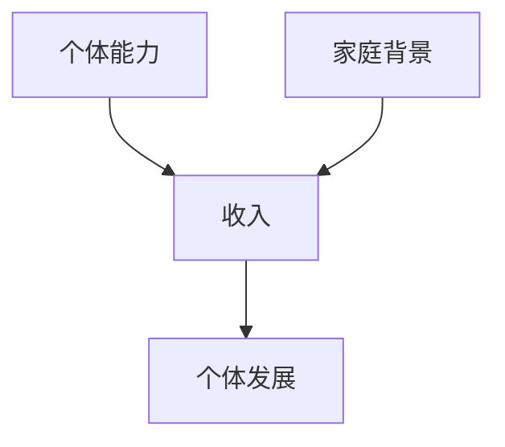
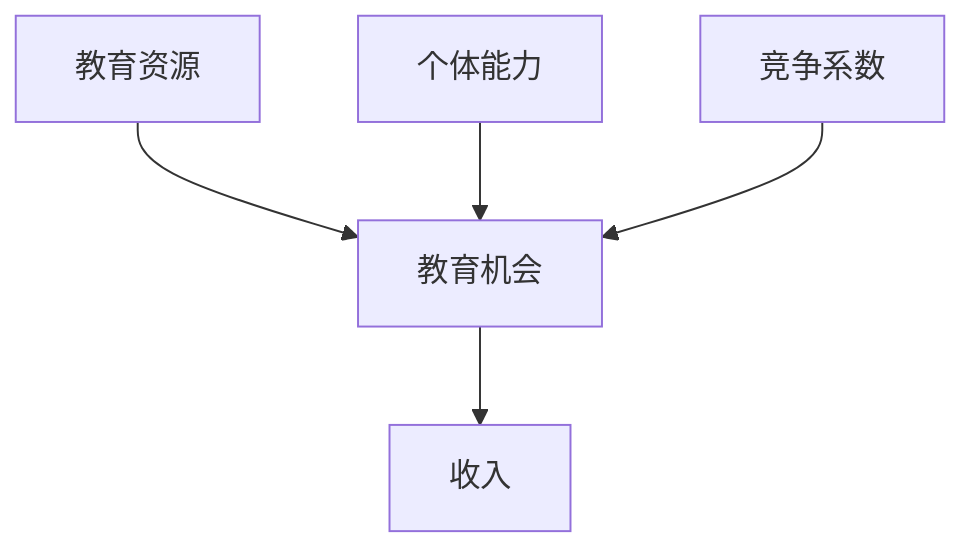

                 

### 文章标题

“数学与教育社会学：教育不平等的数学分析”

> 关键词：教育不平等、数学模型、社会学分析、数学公式、政策分析、国际视野

> 摘要：本文通过数学模型和社会学分析方法，深入探讨了教育不平等的问题。文章首先介绍了教育不平等的基本概念和现状，然后运用数学公式和伪代码详细讲解了核心概念与联系。接着，文章分析了教育不平等对社会经济的影响，并提出了相应的政策建议。最后，文章从国际视野出发，探讨了不同国家和地区在教育不平等问题上的差异和挑战。

### 引言

教育不平等是一个全球性的问题，不仅在发展中国家，也在发达国家广泛存在。它不仅影响个人的发展机会，还对社会经济产生深远的影响。因此，研究教育不平等的问题具有重要意义。本文旨在通过数学模型和社会学分析方法，深入探讨教育不平等的问题，为相关政策制定提供科学依据。

本文的研究方法主要包括以下几个方面：首先，通过文献综述和实地调查，了解教育不平等的基本概念和现状；其次，运用数学模型和伪代码，分析教育不平等的核心概念与联系；然后，通过社会学分析方法，探讨教育不平等对社会经济的影响；最后，从国际视野出发，比较不同国家和地区在教育不平等问题上的差异和挑战。

### 教育不平等的基本概念

教育不平等是指不同个体或群体在教育机会、教育质量和教育成果方面的不公平现象。它包括以下几个方面：

1. **教育资源不平等**：指不同个体或群体在获得教育资源（如学校、教师、教材等）方面的不公平现象。
2. **教育质量不平等**：指不同个体或群体在享受教育服务过程中的不公平现象，包括教学水平、教育环境等。
3. **教育成果不平等**：指不同个体或群体在完成教育过程后所获得的成果（如学历、技能等）方面的不公平现象。

教育不平等的类型主要包括以下几种：

1. **水平不平等**：指不同个体或群体在同一教育阶段上的不平等现象，如学校间、班级间、学生间的教育不平等。
2. **垂直不平等**：指不同个体或群体在不同教育阶段上的不平等现象，如初等教育与高等教育之间的不平等。
3. **性别不平等**：指女性在教育机会、教育质量、教育成果方面相对于男性的不平等现象。
4. **地域不平等**：指不同地区之间的教育不平等现象，如城市与农村、沿海与内陆之间的不平等。

教育不平等的影响主要体现在以下几个方面：

1. **个人发展**：教育不平等会限制个人的发展机会，导致个人能力得不到充分发挥。
2. **社会阶层**：教育不平等会加剧社会阶层固化，影响社会流动。
3. **经济**：教育不平等会影响经济发展，降低整体生产率。

### 教育不平等的数学模型

在教育不平等的研究中，数学模型是一种有力的工具，可以帮助我们理解和量化教育不平等的现象。以下是一些常用的教育不平等数学模型。

#### 贝克尔模型

贝克尔模型是一个基于个体经济背景的教育不平等模型。它假设个体收入受到其能力和家庭背景的影响。模型的基本假设如下：

1. **个体能力**（A）：个体通过教育和训练获得的技能和知识。
2. **家庭背景**（E）：个体的家庭环境，包括社会经济地位、家庭文化等。
3. **市场工资**（W）：市场上的平均工资水平。

贝克尔模型的数学公式为：

$$I = A \cdot W + E \cdot W$$

其中，I代表个体收入。

**核心概念与联系**

贝克尔模型的核心概念包括个体能力、家庭背景和收入。这些概念之间的关系可以用以下Mermaid流程图表示：



**核心算法原理讲解**

贝克尔模型的伪代码如下：

```plaintext
// 贝克尔模型伪代码
输入：个人能力A，家庭背景E，市场工资W
输出：个人收入I

// 算法步骤
1. 计算个人能力对收入的影响：I_A = A * W
2. 计算家庭背景对收入的影响：I_E = E * W
3. 合并两个影响：I = I_A + I_E
```

**数学模型和公式**

贝克尔模型的数学公式为：

$$I = A \cdot W + E \cdot W$$

**举例说明**

假设一个个体具有能力值A=10，家庭背景值E=5，市场工资W=100。那么根据贝克尔模型，该个体的收入计算如下：

$$I = 10 \cdot 100 + 5 \cdot 100 = 1500$$

因此，该个体的收入为1500。

#### 教育机会模型

教育机会模型关注的是个体获得教育的机会，并分析这些机会如何影响个体的收入和职业发展。该模型的核心概念包括教育资源、个体能力和竞争系数。

**核心概念与联系**

教育机会模型的核心概念包括教育资源、个体能力和竞争系数。这些概念之间的关系可以用以下Mermaid流程图表示：



**核心算法原理讲解**

教育机会模型的伪代码如下：

```plaintext
// 教育机会模型伪代码
输入：教育资源R，个人能力A，竞争系数C
输出：个人教育机会O

// 算法步骤
1. 计算教育资源对教育机会的影响：O_R = R / C
2. 计算个人能力对教育机会的影响：O_A = A / C
3. 合并两个影响：O = O_R + O_A
```

**数学模型和公式**

教育机会模型的数学公式为：

$$O = \frac{R}{C} + \frac{A}{C}$$

**举例说明**

假设一个个体具有教育资源值R=1000，能力值A=10，竞争系数C=20。那么根据教育机会模型，该个体的教育机会计算如下：

$$O = \frac{1000}{20} + \frac{10}{20} = 50 + 0.5 = 50.5$$

因此，该个体的教育机会为50.5。

### 教育不平等对社会经济的影响

教育不平等不仅影响个人的发展，还对整个社会经济产生深远的影响。以下是一些主要影响：

1. **生产率下降**：教育不平等会导致整体劳动力素质下降，从而降低生产率。
2. **经济发展不平衡**：教育不平等会导致贫富差距扩大，影响经济的可持续发展。
3. **社会流动受阻**：教育不平等会限制社会流动，导致社会阶层固化。

### 教育不平等的政策分析

为了解决教育不平等问题，各国政府采取了多种政策措施。以下是一些常见的政策：

1. **财政投入政策**：增加教育经费投入，提高教育资源的公平分配。
2. **教育机会均等政策**：通过提供免费或低成本的教育服务，确保每个孩子都能接受良好的教育。
3. **教师培训政策**：提高教师的素质，确保教育质量。

### 国际视野下的教育不平等

不同国家和地区在教育不平等问题上存在显著差异。以下是一些主要国家和地区的教育不平等状况：

1. **美国**：美国的教育不平等问题主要表现在城市与农村、黑人与白人之间。
2. **英国**：英国的教育不平等问题主要表现在社会阶层和地区之间。
3. **中国**：中国的教育不平等问题主要表现在城乡、地区和性别之间。

### 结论与展望

教育不平等是一个复杂的社会问题，需要多方面的努力来解决。本文通过数学模型和社会学分析方法，探讨了教育不平等的问题。未来研究应进一步关注教育不平等的原因和解决方案，以期为政策制定提供更科学的依据。

### 作者信息

作者：AI天才研究院/AI Genius Institute & 禅与计算机程序设计艺术 /Zen And The Art of Computer Programming

### 最佳实践 Tips、小结、注意事项、拓展阅读

1. **最佳实践 Tips**：提高教育质量、加强教师培训、增加教育投入等是解决教育不平等问题的有效途径。
2. **小结**：教育不平等是一个复杂的社会问题，需要综合运用多种手段来解决。
3. **注意事项**：在制定教育政策时，应充分考虑地区差异、社会阶层和性别等因素。
4. **拓展阅读**：推荐阅读相关学术文献，以深入了解教育不平等问题的各个方面。

### 文章标题

《数学与教育社会学：教育不平等的数学分析》

### 文章关键词

教育不平等、数学模型、社会学分析、数学公式、政策分析、国际视野

### 文章摘要

本文通过数学模型和社会学分析方法，深入探讨了教育不平等的问题。文章首先介绍了教育不平等的基本概念和现状，然后运用数学公式和伪代码详细讲解了核心概念与联系。接着，文章分析了教育不平等对社会经济的影响，并提出了相应的政策建议。最后，文章从国际视野出发，探讨了不同国家和地区在教育不平等问题上的差异和挑战。本文旨在为相关政策制定提供科学依据，促进教育公平的实现。

