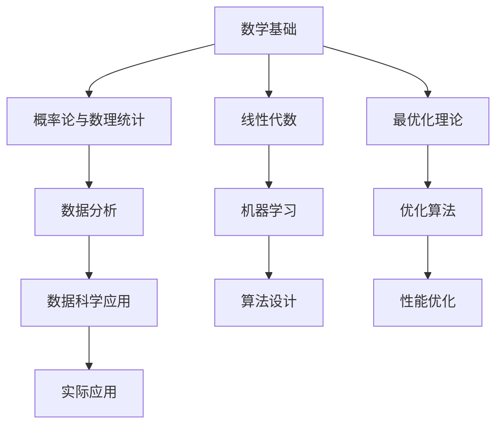

                 

# 数学与数据科学：大数据分析的数学工具

## 文章标题

数学与数据科学：大数据分析的数学工具

> 关键词：数学，数据科学，大数据分析，线性代数，概率论，最优化理论，特征选择，数据降维，决策树

> 摘要：本文旨在探讨数学与数据科学的关系，以及数学工具在处理大数据分析中的应用。文章将从数学基础、大数据分析基础、大数据分析的数学工具和大数据分析中的数学模型四个部分进行深入阐述，帮助读者理解数学在数据科学中的重要性。

## 引言

在当今信息时代，数据已成为各行各业的核心资源。如何从海量数据中提取有价值的信息，实现数据的科学分析和有效利用，已成为企业、政府和科研机构关注的焦点。数据科学，作为一门交叉学科，融合了数学、统计学、计算机科学等多个领域的知识，致力于解决数据分析中的实际问题。而数学，作为数据科学的基础，其作用不可忽视。

数学在数据科学中扮演着多种角色，包括但不限于：提供数据分析的理论基础，为算法设计提供数学工具，以及在实际应用中优化算法性能。本文将围绕这些方面，对数学与数据科学的关系进行探讨，并详细介绍大数据分析的数学工具和应用。

## 第一部分：数学基础

### 第1章：数学与数据科学概述

数学在数据科学中的作用主要表现在以下几个方面：

1. **理论支持**：数学为数据科学提供了坚实的理论基础，如概率论、数理统计、线性代数、最优化理论等，这些理论为数据分析提供了逻辑框架和工具。

2. **算法设计**：许多数据科学算法都是基于数学原理设计的，如线性回归、决策树、支持向量机等，数学原理确保了算法的有效性和稳定性。

3. **优化性能**：数学优化技术可以用于优化数据科学算法的性能，如梯度下降法、牛顿法等，这些方法在解决大规模数据分析问题时尤为有效。

### 核心概念与联系

以下是数学与数据科学中一些核心概念之间的关系架构 Mermaid 流程图：



### 第2章：线性代数基础

线性代数是数据科学中最重要的数学工具之一。本章将介绍线性代数的基本概念，包括向量空间、矩阵运算和线性变换。

#### 向量空间

向量空间是一组向量的集合，这些向量可以线性组合。向量空间具有以下特点：

1. 封闭性：对于向量空间中的任意两个向量 $\vec{u}$ 和 $\vec{v}$，它们的线性组合 $\vec{u} + \vec{v}$ 仍然属于该向量空间。
2. 同一性：向量空间中的向量有一个共同的起点，即原点。
3. 平移不变性：向量空间中的向量可以在原点附近平移，但仍然保持线性组合的性质。

#### 矩阵运算

矩阵运算是线性代数中的核心内容，包括矩阵的加法、减法、乘法和转置等。以下是矩阵乘法的伪代码：

```python
def matrix_multiply(A, B):
    # A 和 B 是二维数组，分别表示矩阵
    n = len(A)
    m = len(B[0])
    p = len(B)
    C = [[0 for _ in range(m)] for _ in range(n)]
    for i in range(n):
        for j in range(m):
            for k in range(p):
                C[i][j] += A[i][k] * B[k][j]
    return C
```

#### 线性变换

线性变换是指将一个向量空间映射到另一个向量空间的一种线性操作。线性变换可以用矩阵表示。以下是线性变换的伪代码：

```python
def linear_transform(vector, matrix):
    # vector 是一维数组，matrix 是二维数组
    transformed_vector = [0 for _ in range(len(matrix[0]))]
    for i in range(len(matrix[0])):
        for j in range(len(vector)):
            transformed_vector[i] += matrix[i][j] * vector[j]
    return transformed_vector
```

### 第3章：概率论与数理统计

概率论与数理统计是数据分析的基础，本章将介绍概率论的基本概念、数理统计的基本概念以及估计误差与置信区间。

#### 概率论基础

概率论主要研究随机事件的概率。以下是概率论中一些基本概念：

1. **随机事件**：在随机试验中可能发生也可能不发生的事件。
2. **概率**：随机事件发生的可能性，用概率值表示。
3. **条件概率**：在某个条件下另一个随机事件发生的概率。

贝叶斯定理是概率论中的重要定理，用于计算后验概率。以下是贝叶斯定理的公式：

$$
P(A|B) = \frac{P(B|A)P(A)}{P(B)}
$$

#### 数理统计基础

数理统计主要研究如何利用样本数据推断总体特征。以下是数理统计中一些基本概念：

1. **统计量**：根据样本数据计算得出的量，用于描述样本特征的量度。
2. **参数估计**：根据样本数据估计总体参数的过程。
3. **假设检验**：在给定的统计模型下，检验总体参数是否满足某个假设的过程。

#### 估计误差与置信区间

估计误差是实际值与估计值之间的差距。置信区间是估计值的区间范围，用于表示估计的不确定性。以下是置信区间的计算方法：

$$
\bar{X} \pm z_{\alpha/2} \frac{\sigma}{\sqrt{n}}
$$

其中，$\bar{X}$ 是样本均值，$z_{\alpha/2}$ 是标准正态分布的临界值，$\sigma$ 是总体标准差，$n$ 是样本容量。

### 第4章：最优化理论

最优化理论是解决优化问题的关键工具，本章将介绍最优化问题的基本概念、无约束优化和约束优化。

#### 最优化问题简介

最优化问题可以形式化为：

$$
\min_{x} f(x)
$$

其中，$x$ 是决策变量，$f(x)$ 是目标函数，要求在所有可能的 $x$ 中找到使得 $f(x)$ 最小的 $x$。

#### 无约束优化

无约束优化是指在没有任何约束条件下求解最优化问题。以下是几种常见的无约束优化算法：

1. **梯度下降法**：通过迭代更新决策变量，逐渐逼近最优解。
2. **牛顿法**：利用目标函数的导数信息，快速逼近最优解。

#### 约束优化

约束优化是指在存在约束条件下求解最优化问题。以下是两种常见的约束优化算法：

1. **拉格朗日乘数法**：将约束条件引入目标函数，求解最优化问题。
2. **内点法**：通过迭代更新决策变量和松弛变量，逐渐逼近最优解。

### 第二部分：大数据分析基础

### 第5章：大数据分析基础

大数据分析是指对海量数据进行收集、存储、处理和分析，以提取有价值信息的过程。本章将介绍大数据的定义、特点、关键技术和应用场景。

#### 大数据的定义与特点

大数据通常具有以下四个特点，即“4V”：

1. **Volume（大量）**：数据量庞大，通常达到 TB、PB 甚至 ZB 级别。
2. **Velocity（高速）**：数据处理速度极快，要求实时或近实时分析。
3. **Variety（多样）**：数据类型繁多，包括结构化数据、半结构化数据和非结构化数据。
4. **Veracity（真实性）**：数据质量参差不齐，需要处理噪声和误差。

#### 大数据分析的关键技术

大数据分析涉及多个关键技术，包括数据采集、数据存储、数据处理和数据可视化。以下是这些关键技术的基本概念：

1. **数据采集**：通过传感器、数据库、日志等方式收集数据。
2. **数据存储**：使用分布式存储系统，如 Hadoop、Spark，存储海量数据。
3. **数据处理**：使用分布式计算框架，如 MapReduce、Spark，处理海量数据。
4. **数据可视化**：通过图表、仪表盘等工具展示分析结果，帮助用户理解数据。

#### 大数据分析的应用场景

大数据分析在各个领域都有广泛应用，以下是一些典型应用场景：

1. **商业智能**：通过分析销售数据、客户行为等，帮助企业做出明智的商业决策。
2. **机器学习**：通过分析大量数据，训练机器学习模型，实现智能预测和分类。
3. **数据可视化**：通过可视化工具，将数据分析结果直观地展示给用户，提高数据分析的效率。

### 第三部分：大数据分析的数学工具

### 第6章：大数据分析的数学工具

大数据分析中常用的数学工具包括数据预处理、特征选择和数据降维。

#### 数据预处理

数据预处理是大数据分析的重要步骤，包括数据清洗、数据集成和数据变换。以下是这些步骤的基本概念：

1. **数据清洗**：去除重复数据、处理缺失值和异常值，提高数据质量。
2. **数据集成**：将来自不同来源的数据整合到一起，形成统一的数据视图。
3. **数据变换**：对数据进行规范化、归一化等处理，使其符合分析需求。

#### 特征选择

特征选择是数据挖掘中的重要步骤，旨在从原始特征中选出对目标变量有显著影响的特征。以下是几种常见的特征选择算法：

1. **过滤法**：根据特征的重要性和相关性进行筛选。
2. **包裹法**：通过迭代过程寻找最优特征组合。
3. **嵌入法**：在训练过程中逐步筛选特征。

#### 数据降维

数据降维是减少数据维度，提高数据分析效率的重要手段。以下是几种常见的数据降维方法：

1. **主成分分析（PCA）**：通过线性变换提取主要特征，降低数据维度。
2. **t-SNE**：通过非线性变换，将高维数据映射到低维空间，保持数据结构。
3. **自编码器**：通过自动编码器学习降维表示。

### 第四部分：大数据分析中的数学模型

### 第7章：大数据分析中的数学模型

大数据分析中的数学模型主要包括决策树、神经网络、聚类分析等。本章将介绍这些模型的基本概念、原理和应用。

#### 决策树

决策树是一种常见的分类和回归模型，通过一系列规则将数据划分为不同的类别或数值。以下是决策树的基本概念和构建方法：

1. **基本概念**：决策树由多个节点和分支组成，每个节点表示一个特征，每个分支表示该特征的一个可能取值。
2. **构建方法**：决策树的构建通常使用信息增益、基尼系数等指标来评估特征的重要性，并根据评估结果选择最优特征进行分割。

以下是决策树构建的伪代码：

```python
def build_decision_tree(data, features):
    # data 是数据集，features 是特征列表
    if all_labels_equal(data):
        return leaf_node(data)
    if no_more_features(features):
        return leaf_node(majority_class(data))
    best_feature = select_best_feature(data, features)
    decision_tree = {}
    for value in feature_values(data, best_feature):
        sub_data = filter_data(data, best_feature, value)
        sub_features = features_without(best_feature, features)
        decision_tree[value] = build_decision_tree(sub_data, sub_features)
    return decision_tree
```

#### 神经网络

神经网络是一种基于生物神经系统的计算模型，通过模拟神经元之间的连接和激活函数，实现数据的输入和输出。以下是神经网络的基本概念和训练方法：

1. **基本概念**：神经网络由多个层次组成，包括输入层、隐藏层和输出层。每个层次由多个神经元组成。
2. **训练方法**：神经网络训练通过调整网络权重和偏置，使网络输出尽可能接近真实值。

以下是神经网络训练的基本步骤：

1. **前向传播**：计算网络输出并计算误差。
2. **反向传播**：根据误差计算权重和偏置的梯度，并更新网络权重和偏置。
3. **迭代优化**：重复前向传播和反向传播过程，直至网络输出误差小于预定阈值。

#### 聚类分析

聚类分析是一种无监督学习方法，旨在将数据分为多个类别或簇。以下是聚类分析的基本概念和算法：

1. **基本概念**：聚类分析通过衡量数据点之间的相似性，将数据划分为多个簇。
2. **算法**：常见的聚类算法包括 K-均值、层次聚类、DBSCAN 等。

以下是 K-均值算法的基本步骤：

1. **初始化**：随机选择 K 个数据点作为初始聚类中心。
2. **分配**：将每个数据点分配到距离最近的聚类中心。
3. **更新**：重新计算聚类中心，并重复步骤 2，直至聚类中心不再发生变化。

### 总结

本文从数学与数据科学的关系出发，详细介绍了数学基础、大数据分析基础、大数据分析的数学工具和大数据分析中的数学模型。通过本文的阐述，读者可以了解到数学在数据科学中的重要性，以及如何利用数学工具进行大数据分析。

在未来的发展中，数学与数据科学的融合将进一步深化，带来更多创新和突破。本文旨在为读者提供一份有深度、有思考、有见解的专业技术博客，希望对广大读者在数据科学领域的学习和实践中有所帮助。

## 作者信息

作者：AI天才研究院/AI Genius Institute & 禅与计算机程序设计艺术 /Zen And The Art of Computer Programming

## 附录

### 附录A：数学公式汇总

以下是对本文中使用的数学公式的汇总：

1. 贝叶斯定理：$$ P(A|B) = \frac{P(B|A)P(A)}{P(B)} $$
2. 置信区间：$$ \bar{X} \pm z_{\alpha/2} \frac{\sigma}{\sqrt{n}} $$
3. 矩阵乘法：$$ C = A \times B $$
4. 线性变换：$$ \vec{y} = A\vec{x} $$
5. 梯度下降法更新：$$ x_{t+1} = x_t - \alpha \nabla f(x_t) $$
6. 牛顿法更新：$$ x_{t+1} = x_t - [H(x_t)]^{-1}\nabla f(x_t) $$

### 附录B：资源推荐

1. 《数据科学基础》：[链接](https://www.bilibili.com/video/BV1TW411c7y8)
2. 《机器学习》：[链接](https://www.bilibili.com/video/BV1jW411u7h9)
3. 《线性代数》：[链接](https://www.bilibili.com/video/BV1qW411j7R7)
4. 《概率论与数理统计》：[链接](https://www.bilibili.com/video/BV1iW411u7hL)

### 附录C：注意事项

1. 在使用数学工具进行大数据分析时，要注意数据的真实性和质量，避免因数据问题导致分析结果不准确。
2. 在选择数学模型时，要考虑模型的复杂度和计算效率，以及在实际应用中的效果。
3. 在数据降维过程中，要注意保留对目标变量有显著影响的主要特征，避免过度降维导致信息损失。

### 附录D：拓展阅读

1. 《深度学习》：[链接](https://www.bilibili.com/video/BV1MV411c7X5)
2. 《统计学》：[链接](https://www.bilibili.com/video/BV1Cg411z7bG)
3. 《线性代数及其应用》：[链接](https://www.bilibili.com/video/BV1aW411j7kb)

