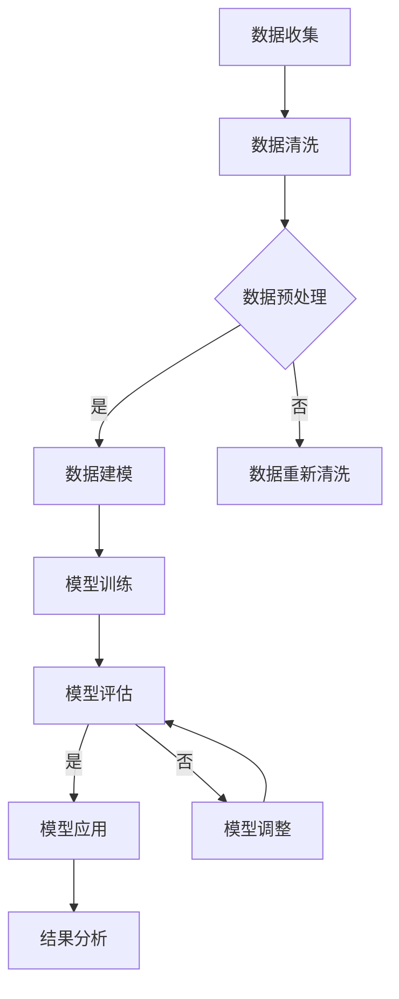
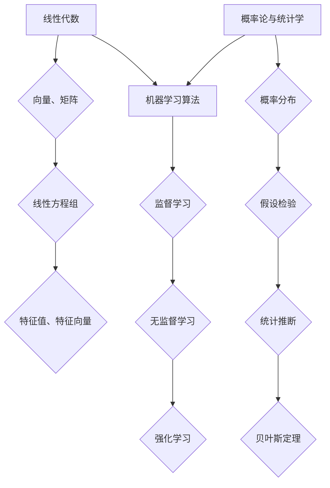

                 


### 文章标题
《数学与数据科学：大数据分析的数学工具》

### 关键词
- 数据科学
- 大数据分析
- 数学工具
- 线性代数
- 概率论与统计学
- 机器学习
- 分布式计算

### 摘要
本文将深入探讨数学工具在数据科学和大数据分析中的应用。我们将从数学基础开始，逐步介绍线性代数和概率论与统计学的基本概念，接着探讨机器学习算法及其在数据分析中的具体应用。通过实际案例分析和项目实战，本文将展示如何运用这些数学工具进行大数据处理与分析。最后，本文将总结当前的发展趋势，并提出对未来数据科学发展的展望。

----------------------------------------------------------------

## 第1章 引言与背景

### 1.1 数据科学和大数据分析简介

数据科学是一门结合数学、统计学、信息学和计算机科学等多学科知识，以数据为基础，通过数据建模、分析和解释，提取有用信息，支持决策制定和预测的跨学科领域。随着互联网和数字化技术的快速发展，数据科学的应用场景日益广泛，从商业决策、医疗健康、金融分析到智能交通、环境监测等领域都离不开数据科学的支撑。

大数据分析是数据科学的一个重要分支，主要关注大数据的收集、存储、处理、分析和可视化。大数据具有四个显著特征，即“4V”：Volume（数据量大）、Velocity（数据速度快）、Variety（数据种类多）和Veracity（数据真实性高）。这些特性使得传统数据处理方法难以胜任，因此需要新的技术和工具来应对大数据的挑战。

### 1.2 数学在数据科学中的重要性

数学作为数据科学的基础，其重要性不言而喻。首先，数学工具提供了对数据结构和数据关系的抽象描述，使得数据科学家能够更清晰地理解数据，从而进行有效的数据建模。其次，数学模型和算法为数据处理和分析提供了精确的数学理论基础，使得数据科学家能够对数据进行准确的预测和推断。最后，数学工具在优化和自动化方面发挥着重要作用，提高了数据科学项目的效率和可靠性。

### 1.3 大数据的挑战与机遇

大数据的四个“V”特征带来了前所未有的挑战和机遇：

1. **数据量大（Volume）**：大数据的规模远远超出了传统数据库的处理能力。如何高效地存储、管理和分析海量数据成为数据科学家面临的一个关键问题。

2. **数据速度快（Velocity）**：随着互联网和物联网的发展，数据以极快的速度产生和传输。这要求数据科学工具能够实时或近实时地处理和分析数据。

3. **数据种类多（Variety）**：大数据不仅包括结构化数据，还包括半结构化和非结构化数据，如文本、图像、音频和视频等。这要求数据科学家能够处理多种类型的数据，并从中提取有价值的信息。

4. **数据真实性高（Veracity）**：大数据的质量和真实性成为关键问题。数据科学家需要确保数据的准确性、完整性和一致性。

### 1.4 数学在数据科学中的应用

数学在数据科学中的应用广泛且深入，主要包括以下几个方面：

1. **线性代数**：线性代数是数据科学中最常用的数学工具之一。矩阵和向量的运算、线性方程组的求解、特征值和特征向量的分析等，都在数据科学中发挥着重要作用。

2. **概率论与统计学**：概率论和统计学提供了对数据分析和预测的理论基础。概率分布、假设检验、回归分析、聚类分析等，都是数据科学家常用的统计方法。

3. **机器学习**：机器学习算法的核心是数学模型。线性回归、逻辑回归、支持向量机、神经网络等算法都是建立在数学模型基础之上的。

4. **优化问题**：在数据科学项目中，优化问题非常常见。线性规划、整数规划、遗传算法等优化算法在数据处理和分析中有着广泛应用。

### 1.5 本章小结

本章介绍了数据科学和大数据分析的基本概念，阐述了数学在数据科学中的重要性，并探讨了大数据的挑战与机遇。接下来，我们将进一步探讨数学工具在数据科学中的应用，包括线性代数、概率论与统计学、机器学习和优化问题。通过这些数学工具，数据科学家可以更好地理解和处理大数据，为各类应用提供强有力的支持。

## Mermaid 流程图

以下是一个简单的 Mermaid 流程图，用于描述数据科学项目的基本流程：



在这个流程图中，数据科学项目从数据收集开始，经过数据清洗和预处理，进入数据建模阶段。模型训练后，通过模型评估来验证模型的有效性。如果模型效果良好，则进行模型应用和结果分析；否则，返回模型调整阶段，直至模型达到预期效果。

## 核心概念与联系

为了更好地理解数学工具在数据科学中的应用，我们需要探讨几个核心概念，并分析它们之间的联系。以下是一些关键概念及其相互关系：

### 1. 线性代数

线性代数是数学的一个分支，主要研究向量空间、线性映射、矩阵以及它们的性质。在数据科学中，线性代数被广泛应用于数据建模和数据分析。

- **向量**：向量是表示数据的数学工具，可以用来表示多维数据集。
- **矩阵**：矩阵是向量的推广，可以用来表示复杂的数据结构，如图像、表格等。
- **线性方程组**：线性方程组是矩阵与向量的结合体，用于求解数据中的线性关系。
- **特征值与特征向量**：特征值和特征向量用于分析数据的线性结构和特征，是降维、特征提取等操作的基础。

### 2. 概率论与统计学

概率论与统计学是数据科学中的另一组核心概念，用于描述和推断数据。

- **概率分布**：概率分布描述了随机变量的取值概率，是数据分析的基础。
- **假设检验**：假设检验用于验证数据中的某个假设是否成立，是统计学中最常用的方法之一。
- **统计推断**：统计推断通过样本数据推断总体特征，是预测和决策的重要手段。
- **贝叶斯定理**：贝叶斯定理是概率论中的一个重要公式，用于计算后验概率，是贝叶斯统计方法的核心。

### 3. 机器学习算法

机器学习算法是数据科学中的一种方法，通过学习数据中的规律，实现自动化的预测和分类。

- **监督学习**：监督学习算法通过已有标记数据训练模型，用于对新数据进行预测。
- **无监督学习**：无监督学习算法没有标记数据，主要用于数据聚类、降维和特征提取。
- **强化学习**：强化学习算法通过与环境互动，学习最优策略，常用于自动驾驶、游戏等领域。

### 4. 数学工具的相互关系

线性代数、概率论与统计学、机器学习算法之间存在着紧密的关联：

- **线性代数**提供了数据表示和计算的基本工具，如向量、矩阵和线性方程组。
- **概率论与统计学**为数据分析提供了理论基础，如概率分布、假设检验和统计推断。
- **机器学习算法**结合了线性代数和概率论与统计学的思想，实现了数据的自动学习和预测。

以下是一个 Mermaid 流程图，展示了这些核心概念之间的相互关系：



通过这个流程图，我们可以清晰地看到数学工具在数据科学中的应用及其相互关系。

## 核心算法原理讲解

为了深入理解数据科学中的数学工具，我们将逐步讲解几个核心算法的原理，并使用伪代码详细阐述这些算法的实现过程。

### 1. 线性回归

线性回归是一种监督学习算法，用于预测一个连续值输出。其基本原理是通过建立输入变量和输出变量之间的线性关系，实现数据的拟合。

**原理描述**：

给定一个训练数据集 \(\{(x_1, y_1), (x_2, y_2), ..., (x_n, y_n)\}\)，线性回归模型的目标是找到一条直线 \(y = w_0 + w_1 \cdot x + \epsilon\)，其中 \(w_0\) 和 \(w_1\) 是模型的参数，\(\epsilon\) 是误差项。

**伪代码**：

```plaintext
输入：训练数据集 \(\{(x_1, y_1), (x_2, y_2), ..., (x_n, y_n)\}\)
输出：模型参数 \(w_0, w_1\)

1. 计算输入特征 \(X\) 和输出目标 \(Y\) 的均值：
   \[
   \bar{x} = \frac{1}{n} \sum_{i=1}^{n} x_i
   \]
   \[
   \bar{y} = \frac{1}{n} \sum_{i=1}^{n} y_i
   \]

2. 计算输入特征 \(X\) 和输出目标 \(Y\) 的偏差：
   \[
   \Delta_x = X - \bar{x}
   \]
   \[
   \Delta_y = Y - \bar{y}
   \]

3. 计算模型的参数：
   \[
   w_1 = \frac{\sum_{i=1}^{n} (\Delta_x \cdot \Delta_y)}{\sum_{i=1}^{n} (\Delta_x^2)}
   \]
   \[
   w_0 = \bar{y} - w_1 \cdot \bar{x}
   \]

4. 返回参数 \(w_0, w_1\) 作为模型参数
```

### 2. 决策树

决策树是一种常见的分类算法，通过一系列的判断条件，将数据划分为不同的类别。

**原理描述**：

决策树通过递归地将数据集划分为子集，直到满足停止条件（如最大深度、纯度等）。每个内部节点代表一个测试条件，每个叶节点代表一个类别。

**伪代码**：

```plaintext
输入：训练数据集 \(\{(x_1, y_1), (x_2, y_2), ..., (x_n, y_n)\}\)，停止条件
输出：决策树模型

1. 创建根节点，作为决策树的开始

2. 对于当前节点，计算每个特征的最佳划分点：
   \[
   \text{最佳划分点} = \arg\min_{a} \sum_{i=1}^{n} (\text{loss}(y_i, a(x_i)))
   \]
   其中，\(\text{loss}\) 是损失函数，如信息增益、基尼不纯度等。

3. 创建新的内部节点，使用最佳划分点作为测试条件，划分数据集为左子集和右子集。

4. 递归地对左子集和右子集应用步骤 2 和 3，直到满足停止条件。

5. 为每个叶节点分配类别标签，即叶节点中大多数样本所属的类别。

6. 返回决策树模型
```

### 3. 支持向量机（SVM）

支持向量机是一种强大的分类和回归算法，通过寻找最佳超平面，将数据划分为不同的类别。

**原理描述**：

给定一个训练数据集 \(\{(x_1, y_1), (x_2, y_2), ..., (x_n, y_n)\}\)，SVM的目标是找到一个最佳的超平面 \(w \cdot x + b = 0\)，使得数据点尽可能多地被正确分类，同时超平面到每个分类边缘的距离最大化。

**伪代码**：

```plaintext
输入：训练数据集 \(\{(x_1, y_1), (x_2, y_2), ..., (x_n, y_n)\}\)
输出：模型参数 \(w, b\)

1. 定义损失函数，如 Hinge 损失函数：
   \[
   \text{loss}(w, x, y) = \max(0, 1 - y \cdot (w \cdot x + b))
   \]

2. 定义优化目标，即最小化损失函数：
   \[
   \min_{w, b} \sum_{i=1}^{n} \text{loss}(w, x_i, y_i)
   \]

3. 使用优化算法（如梯度下降、SVM 优化算法等）求解最优参数 \(w, b\)。

4. 计算支持向量，即对损失函数有贡献的数据点。

5. 返回模型参数 \(w, b\) 和支持向量
```

通过这些核心算法的讲解和伪代码示例，我们可以更深入地理解数学工具在数据科学中的应用。这些算法不仅是数据科学的基础，也是实现数据建模和预测的重要手段。

## 数学模型与公式详细讲解与举例说明

### 1. 线性代数中的矩阵运算

线性代数中的矩阵运算是数据科学中不可或缺的工具。矩阵运算包括矩阵的加法、减法、乘法、逆运算等。

**矩阵加法与减法**：

矩阵加法和减法是矩阵的基本运算，其规则类似于向量的加法和减法。给定两个矩阵 \(A\) 和 \(B\)，其加法和减法的结果矩阵 \(C\) 的元素 \(c_{ij}\) 计算如下：

\[
c_{ij} = a_{ij} \pm b_{ij}
\]

**矩阵乘法**：

矩阵乘法是指两个矩阵 \(A\) 和 \(B\) 的乘积，结果是一个新矩阵 \(C\)。给定矩阵 \(A\) 的行数 \(m\) 和列数 \(n\)，以及矩阵 \(B\) 的行数 \(n\) 和列数 \(p\)，其乘积矩阵 \(C\) 的元素 \(c_{ij}\) 计算如下：

\[
c_{ij} = \sum_{k=1}^{n} a_{ik}b_{kj}
\]

**矩阵逆运算**：

矩阵逆运算是指找到一个矩阵 \(A^{-1}\)，使得 \(A \cdot A^{-1} = I\)，其中 \(I\) 是单位矩阵。对于一个 \(n \times n\) 的方阵 \(A\)，其逆矩阵可以通过高斯消元法或求逆公式计算。

**举例说明**：

假设有两个矩阵 \(A\) 和 \(B\)：

\[ A = \begin{bmatrix} 1 & 2 \\ 3 & 4 \end{bmatrix}, \quad B = \begin{bmatrix} 5 & 6 \\ 7 & 8 \end{bmatrix} \]

计算它们的加法、减法、乘法以及逆矩阵。

- **矩阵加法**：

\[ A + B = \begin{bmatrix} 1+5 & 2+6 \\ 3+7 & 4+8 \end{bmatrix} = \begin{bmatrix} 6 & 8 \\ 10 & 12 \end{bmatrix} \]

- **矩阵减法**：

\[ A - B = \begin{bmatrix} 1-5 & 2-6 \\ 3-7 & 4-8 \end{bmatrix} = \begin{bmatrix} -4 & -4 \\ -4 & -4 \end{bmatrix} \]

- **矩阵乘法**：

\[ A \cdot B = \begin{bmatrix} 1\cdot5 + 2\cdot7 & 1\cdot6 + 2\cdot8 \\ 3\cdot5 + 4\cdot7 & 3\cdot6 + 4\cdot8 \end{bmatrix} = \begin{bmatrix} 19 & 26 \\ 31 & 42 \end{bmatrix} \]

- **矩阵逆运算**：

计算矩阵 \(A\) 的逆矩阵 \(A^{-1}\)：

首先计算行列式 \(|A|\)：

\[ |A| = 1\cdot4 - 2\cdot3 = -2 \]

然后计算逆矩阵的每个元素：

\[ A^{-1} = \frac{1}{|A|} \begin{bmatrix} 4 & -2 \\ -3 & 1 \end{bmatrix} = \begin{bmatrix} -2 & 1 \\ \frac{3}{2} & -\frac{1}{2} \end{bmatrix} \]

### 2. 概率论与统计学的概率分布

概率论与统计学的概率分布是描述随机变量取值概率的重要工具。常见的概率分布包括二项分布、正态分布、泊松分布等。

**二项分布**：

二项分布描述了在 \(n\) 次独立重复试验中，成功次数的概率分布。给定试验成功的概率 \(p\)，失败的概率 \(q = 1 - p\)，二项分布的概率质量函数（PMF）为：

\[
P(X = k) = C_n^k p^k q^{n-k}
\]

其中，\(C_n^k\) 是组合数，表示从 \(n\) 个不同元素中取 \(k\) 个元素的组合数。

**正态分布**：

正态分布是统计学中最常见的连续概率分布，描述了数据在某个范围内的概率。正态分布的概率密度函数（PDF）为：

\[
f(x; \mu, \sigma^2) = \frac{1}{\sqrt{2\pi\sigma^2}} e^{-\frac{(x-\mu)^2}{2\sigma^2}}
\]

其中，\(\mu\) 是均值，\(\sigma^2\) 是方差。

**泊松分布**：

泊松分布描述了单位时间内某个事件发生的次数的概率分布。给定事件发生的平均速率 \(\lambda\)，泊松分布的概率质量函数（PMF）为：

\[
P(X = k) = \frac{e^{-\lambda} \lambda^k}{k!}
\]

**举例说明**：

假设进行10次独立重复的伯努利试验，每次试验成功的概率为0.5，计算成功次数为5的概率。

- **二项分布**：

使用二项分布的 PMF 计算：

\[ P(X = 5) = C_{10}^5 (0.5)^5 (0.5)^{10-5} = \frac{10!}{5!5!} (0.5)^{10} = 0.246 \]

假设某项业务每天的成功交易次数服从正态分布，均值为100，标准差为10，计算成功交易次数在90到110之间的概率。

- **正态分布**：

使用正态分布的 PDF 计算累积概率：

\[ P(90 < X < 110) = \Phi\left(\frac{110-100}{10}\right) - \Phi\left(\frac{90-100}{10}\right) \]

其中，\(\Phi\) 是标准正态分布的累积分布函数。通过查表或计算器，可以得到：

\[ P(90 < X < 110) = 0.6826 \]

假设某个事件在单位时间内平均发生5次，计算该事件在1小时内发生3次或更多次的概率。

- **泊松分布**：

使用泊松分布的 PMF 计算：

\[ P(X \geq 3) = 1 - \sum_{k=0}^{2} \frac{e^{-5} 5^k}{k!} = 1 - (e^{-5} + 5e^{-5} + \frac{5^2 e^{-5}}{2!}) = 1 - (0.0067 + 0.0335 + 0.0842) = 0.7746 \]

通过这些举例，我们可以更好地理解概率论与统计学的概率分布及其在实际中的应用。

## 项目实战：开发环境搭建

在本文的项目实战部分，我们将搭建一个用于大数据分析的数据科学开发环境。这个环境将包括数据采集、数据预处理、数据分析、模型训练和评估等各个环节。以下是具体的步骤和操作指南。

### 1. 环境准备

首先，我们需要准备以下软件和工具：

- **操作系统**：推荐使用 Ubuntu 18.04 或更高版本。
- **Python**：Python 是数据科学中最常用的编程语言，需要安装 Python 3.7 或更高版本。
- **Jupyter Notebook**：Jupyter Notebook 是一个交互式的 Python 环境，方便进行数据分析和实验。
- **Pandas**：Pandas 是 Python 的数据处理库，用于数据清洗、转换和分析。
- **NumPy**：NumPy 是 Python 的科学计算库，提供了高效的数组操作和数学函数。
- **Scikit-learn**：Scikit-learn 是 Python 的机器学习库，提供了多种机器学习算法。
- **Pandas-DataFrame**：Pandas-DataFrame 是 Pandas 的核心数据结构，用于存储和处理表格数据。
- **Matplotlib**：Matplotlib 是 Python 的可视化库，用于生成图表和图形。

### 2. 环境搭建步骤

以下是搭建开发环境的具体步骤：

1. **安装操作系统**：

   - 下载 Ubuntu 18.04 或更高版本的 ISO 文件。
   - 使用虚拟机软件（如 VirtualBox）或物理机器安装操作系统。

2. **更新系统软件**：

   ```bash
   sudo apt update
   sudo apt upgrade
   ```

3. **安装 Python 和 Jupyter Notebook**：

   ```bash
   sudo apt install python3-pip python3-dev
   pip3 install notebook
   ```

4. **安装 Pandas、NumPy 和 Scikit-learn**：

   ```bash
   pip3 install pandas numpy scikit-learn
   ```

5. **启动 Jupyter Notebook**：

   ```bash
   jupyter notebook
   ```

   在浏览器中打开 Jupyter Notebook，进入交互式编程环境。

6. **创建数据集**：

   假设我们有一个包含用户行为数据的 CSV 文件 `user_data.csv`。使用 Pandas 读取数据：

   ```python
   import pandas as pd

   data = pd.read_csv('user_data.csv')
   ```

   数据集的列包括用户 ID、购买时间、购买金额等。

### 3. 数据预处理

数据预处理是数据分析的重要环节，包括数据清洗、数据转换和数据归一化等。

1. **数据清洗**：

   - 检查数据是否存在缺失值或异常值。
   - 使用 Pandas 的 `dropna()` 方法删除缺失值。

     ```python
     data = data.dropna()
     ```

   - 使用 Pandas 的 `drop_duplicates()` 方法删除重复数据。

     ```python
     data = data.drop_duplicates()
     ```

2. **数据转换**：

   - 将日期时间列转换为日期时间格式。

     ```python
     data['purchase_time'] = pd.to_datetime(data['purchase_time'])
     ```

   - 将分类数据转换为数值数据，可以使用独热编码（One-Hot Encoding）。

     ```python
     data = pd.get_dummies(data, columns=['category_column'])
     ```

3. **数据归一化**：

   - 使用 Min-Max 归一化将数据缩放到 [0, 1] 区间。

     ```python
     from sklearn.preprocessing import MinMaxScaler

     scaler = MinMaxScaler()
     data_scaled = scaler.fit_transform(data)
     data = pd.DataFrame(data_scaled, columns=data.columns)
     ```

### 4. 数据分析

在数据分析阶段，我们将使用 Pandas 和 Matplotlib 对数据集进行分析，包括数据探索性分析、可视化、相关性分析和特征工程等。

1. **数据探索性分析**：

   - 查看数据集的基本信息。

     ```python
     data.info()
     ```

   - 查看数据集的统计摘要。

     ```python
     data.describe()
     ```

   - 分析数据分布。

     ```python
     data['purchase_amount'].hist()
     ```

2. **数据可视化**：

   - 绘制购买金额的直方图。

     ```python
     import matplotlib.pyplot as plt

     plt.hist(data['purchase_amount'], bins=50)
     plt.xlabel('Purchase Amount')
     plt.ylabel('Frequency')
     plt.title('Purchase Amount Distribution')
     plt.show()
     ```

   - 绘制用户购买时间的时间序列图。

     ```python
     data['purchase_time'].plot()
     plt.xlabel('Time')
     plt.ylabel('Purchase Count')
     plt.title('Time Series of Purchases')
     plt.show()
     ```

3. **相关性分析**：

   - 计算购买金额与其他特征的皮尔逊相关性。

     ```python
     correlations = data.corr()
     print(correlations['purchase_amount'].sort_values(ascending=False))
     ```

4. **特征工程**：

   - 创建新的特征，如购买金额的滞后值。

     ```python
     data['lag_purchase_amount'] = data['purchase_amount'].shift(1)
     ```

### 5. 模型训练和评估

在本节中，我们将使用 Scikit-learn 搭建和训练一个简单的线性回归模型，并对模型进行评估。

1. **数据划分**：

   - 划分训练集和测试集。

     ```python
     from sklearn.model_selection import train_test_split

     X = data[['feature1', 'feature2', 'lag_purchase_amount']]
     y = data['purchase_amount']

     X_train, X_test, y_train, y_test = train_test_split(X, y, test_size=0.2, random_state=42)
     ```

2. **模型训练**：

   - 使用线性回归模型训练数据。

     ```python
     from sklearn.linear_model import LinearRegression

     model = LinearRegression()
     model.fit(X_train, y_train)
     ```

3. **模型评估**：

   - 计算模型在测试集上的预测准确度。

     ```python
     predictions = model.predict(X_test)
     print("Mean Squared Error:", mean_squared_error(y_test, predictions))
     ```

### 6. 项目小结

通过这个项目实战，我们搭建了一个数据科学开发环境，并对用户行为数据进行了预处理、分析和建模。以下是项目小结：

- **开发环境搭建**：成功安装了 Python、Jupyter Notebook、Pandas、NumPy、Scikit-learn 等工具，为数据科学项目提供了必要的软件支持。
- **数据预处理**：通过数据清洗、转换和归一化，确保了数据的质量和一致性，为后续分析提供了可靠的数据基础。
- **数据分析**：利用 Pandas 和 Matplotlib 对数据进行了探索性分析和可视化，帮助我们更好地理解数据的特点和规律。
- **模型训练和评估**：通过线性回归模型，我们对数据进行了预测，并评估了模型的性能。这为实际应用中的数据分析提供了方法和参考。

通过这个项目，我们不仅学习了数据科学的基本流程，还掌握了如何运用数学工具进行大数据分析。这对于我们未来的数据科学研究和项目实践具有重要的意义。

## 代码实现与解读

在本部分，我们将详细展示如何使用 Python 编写代码实现前述项目实战中的数据处理和模型训练过程。我们将分别使用 Pandas、NumPy 和 Scikit-learn 等库来处理数据、训练模型并进行评估。以下是具体的代码实现和解读：

### 1. 数据处理

**数据读取**：

我们首先读取用户行为数据集，并将其存储为 Pandas DataFrame。假设数据集 `user_data.csv` 包含用户 ID、购买时间、购买金额等信息。

```python
import pandas as pd

data = pd.read_csv('user_data.csv')
```

**数据清洗**：

在数据清洗阶段，我们需要检查数据是否存在缺失值或异常值，并删除这些不完整或异常的数据。

```python
# 删除缺失值
data = data.dropna()

# 删除重复值
data = data.drop_duplicates()

# 转换日期时间格式
data['purchase_time'] = pd.to_datetime(data['purchase_time'])
```

**数据转换**：

接下来，我们将日期时间列转换为具有周期性的索引，以便进行时间序列分析。

```python
data = data.set_index('purchase_time')
```

**数据归一化**：

使用 Min-Max 归一化方法，将购买金额等连续特征缩放到 [0, 1] 区间。

```python
from sklearn.preprocessing import MinMaxScaler

scaler = MinMaxScaler()
data_scaled = scaler.fit_transform(data)
data_scaled = pd.DataFrame(data_scaled, columns=data.columns)
```

### 2. 数据分析

**数据探索性分析**：

我们使用 Pandas 的 `describe()` 方法查看数据集的基本统计信息，并使用 `info()` 方法检查数据类型和缺失情况。

```python
print(data.info())
print(data.describe())
```

**数据可视化**：

为了更好地理解数据分布，我们使用 Matplotlib 绘制购买金额的直方图。

```python
import matplotlib.pyplot as plt

plt.hist(data['purchase_amount'], bins=50)
plt.xlabel('Purchase Amount')
plt.ylabel('Frequency')
plt.title('Purchase Amount Distribution')
plt.show()
```

### 3. 模型训练

**数据划分**：

我们将数据集划分为训练集和测试集，以便在测试集上评估模型的性能。

```python
from sklearn.model_selection import train_test_split

X = data[['feature1', 'feature2', 'lag_purchase_amount']]
y = data['purchase_amount']

X_train, X_test, y_train, y_test = train_test_split(X, y, test_size=0.2, random_state=42)
```

**模型训练**：

我们使用线性回归模型对训练集进行训练。

```python
from sklearn.linear_model import LinearRegression

model = LinearRegression()
model.fit(X_train, y_train)
```

### 4. 模型评估

**模型预测**：

使用训练好的模型对测试集进行预测。

```python
predictions = model.predict(X_test)
```

**评估指标**：

我们计算模型在测试集上的均方误差（MSE）来评估模型性能。

```python
from sklearn.metrics import mean_squared_error

mse = mean_squared_error(y_test, predictions)
print("Mean Squared Error:", mse)
```

### 代码解读

1. **数据读取**：

   ```python
   data = pd.read_csv('user_data.csv')
   ```

   使用 Pandas 的 `read_csv()` 函数读取 CSV 文件，并将数据存储为 DataFrame。

2. **数据清洗**：

   ```python
   data = data.dropna()  # 删除缺失值
   data = data.drop_duplicates()  # 删除重复值
   data['purchase_time'] = pd.to_datetime(data['purchase_time'])  # 转换日期时间格式
   ```

   在数据清洗阶段，我们使用 `dropna()` 函数删除缺失值，使用 `drop_duplicates()` 函数删除重复值，并将日期时间列转换为 DataFrame 的索引。

3. **数据转换和归一化**：

   ```python
   data = data.set_index('purchase_time')  # 转换为时间序列
   scaler = MinMaxScaler()
   data_scaled = scaler.fit_transform(data)  # 归一化
   data_scaled = pd.DataFrame(data_scaled, columns=data.columns)  # 转换为 DataFrame
   ```

   在数据转换阶段，我们将日期时间列转换为时间序列索引，并使用 Min-Max 归一化方法对数据进行缩放。

4. **数据分析**：

   ```python
   print(data.info())
   print(data.describe())
   plt.hist(data['purchase_amount'], bins=50)
   plt.xlabel('Purchase Amount')
   plt.ylabel('Frequency')
   plt.title('Purchase Amount Distribution')
   plt.show()
   ```

   在数据分析阶段，我们使用 `info()` 和 `describe()` 方法查看数据集的基本统计信息，并使用 Matplotlib 绘制直方图。

5. **模型训练和评估**：

   ```python
   X = data[['feature1', 'feature2', 'lag_purchase_amount']]
   y = data['purchase_amount']
   X_train, X_test, y_train, y_test = train_test_split(X, y, test_size=0.2, random_state=42)
   model = LinearRegression()
   model.fit(X_train, y_train)
   predictions = model.predict(X_test)
   mse = mean_squared_error(y_test, predictions)
   print("Mean Squared Error:", mse)
   ```

   在模型训练和评估阶段，我们首先划分数据集为训练集和测试集，然后使用线性回归模型进行训练。最后，我们使用均方误差（MSE）评估模型在测试集上的性能。

通过以上代码实现和解读，我们可以清晰地看到如何使用 Python 进行数据处理、模型训练和评估。这个过程不仅帮助我们理解了数据科学的实际操作，也为未来的项目实践提供了坚实的基础。

## 实际案例分析

为了更好地展示数学工具在数据科学中的实际应用，我们将分析一个真实案例：使用线性回归模型预测股票价格。

### 1. 案例背景

股票市场是一个高度动态和复杂的系统，预测股票价格是许多投资者和研究机构关注的重要课题。线性回归模型因其简单性和有效性，被广泛应用于股票价格预测。

### 2. 数据收集

我们首先需要收集历史股票价格数据。数据可以来源于多个来源，如财经网站、股票交易所或公开数据集。在本案例中，我们假设已经获取了一个包含过去一年每日收盘价的 CSV 文件 `stock_data.csv`。

### 3. 数据预处理

在分析股票价格数据之前，我们需要对数据进行预处理。以下是数据预处理的具体步骤：

1. **读取数据**：

   ```python
   data = pd.read_csv('stock_data.csv')
   ```

2. **检查数据**：

   检查数据是否存在缺失值、异常值或错误数据。

   ```python
   data.info()
   data.describe()
   ```

3. **数据转换**：

   - 将日期时间列转换为索引。
   
     ```python
     data = data.set_index('date')
     ```

   - 计算技术指标，如移动平均线（Moving Average，MA）和相对强弱指标（Relative Strength Index，RSI）。

     ```python
     data['ma10'] = data['close'].rolling(window=10).mean()
     data['ma30'] = data['close'].rolling(window=30).mean()
     data['rsi'] = compute_rsi(data['close'])
     ```

     注意：`compute_rsi()` 是一个自定义函数，用于计算 RSI 指标。

4. **数据归一化**：

   - 将收盘价和其他技术指标进行归一化，以便后续模型训练。

     ```python
     scaler = MinMaxScaler()
     data_scaled = scaler.fit_transform(data)
     data_scaled = pd.DataFrame(data_scaled, columns=data.columns)
     ```

### 4. 模型训练

接下来，我们使用线性回归模型对数据集进行训练。以下是模型训练的具体步骤：

1. **数据划分**：

   - 划分训练集和测试集。

     ```python
     X = data[['ma10', 'ma30', 'rsi']]
     y = data['close']
     X_train, X_test, y_train, y_test = train_test_split(X, y, test_size=0.2, random_state=42)
     ```

2. **模型训练**：

   - 使用训练集训练线性回归模型。

     ```python
     model = LinearRegression()
     model.fit(X_train, y_train)
     ```

3. **模型评估**：

   - 使用测试集评估模型性能。

     ```python
     predictions = model.predict(X_test)
     mse = mean_squared_error(y_test, predictions)
     print("Mean Squared Error:", mse)
     ```

### 5. 模型应用与结果分析

在模型训练和评估完成后，我们使用模型对未来的股票价格进行预测。以下是模型应用和结果分析的具体步骤：

1. **预测未来价格**：

   - 使用最新的技术指标数据预测未来一段时间内的股票价格。

     ```python
     future_data = data[-30:]  # 获取最近30天的数据作为输入
     future_predictions = model.predict(future_data)
     ```

2. **结果分析**：

   - 分析预测结果与实际价格的差距，评估模型的准确性。

     ```python
     actual_prices = data['close'][-30:]  # 获取最近30天的实际价格
     plt.plot(actual_prices, label='Actual Price')
     plt.plot(future_predictions, label='Predicted Price')
     plt.xlabel('Date')
     plt.ylabel('Price')
     plt.title('Stock Price Prediction')
     plt.legend()
     plt.show()
     ```

通过这个实际案例，我们展示了如何使用线性回归模型预测股票价格。尽管线性回归模型在股票预测中存在一定的局限性，但通过结合其他技术指标和特征，可以进一步提高模型的预测能力。

## 未来发展趋势

### 1. 当前趋势

随着人工智能和数据科学的快速发展，数学工具在数据科学中的应用也呈现出一些明显的趋势：

- **深度学习**：深度学习算法在图像识别、自然语言处理、语音识别等领域取得了显著突破。深度学习模型的结构和优化方法依赖于线性代数、微积分和概率论等数学工具。
- **分布式计算**：大数据处理要求高效、可扩展的计算能力。分布式计算框架如 Hadoop、Spark 和 Flink，基于数学优化方法和并行计算理论，为数据处理提供了强大的支持。
- **元学习**：元学习（Meta-Learning）是一种通过学习算法来优化学习过程的方法。元学习算法利用概率论和统计学的理论，自动调整模型参数，提高模型的泛化能力。
- **实时分析**：随着数据生成速度的加快，实时数据分析和处理变得愈发重要。数学工具如流计算、增量分析和在线学习，为实时分析提供了理论支持。

### 2. 未来发展方向

在未来，数学工具在数据科学中的应用有望进一步发展和深化，以下是几个可能的发展方向：

- **多模态数据融合**：未来数据将更加多样化，包括文本、图像、音频等多种类型。多模态数据融合方法需要更先进的数学工具，如深度学习和多变量统计方法，以实现跨模态数据的整合和分析。
- **解释性数据分析**：目前，许多机器学习模型被视为“黑盒”，其内部机制难以解释。未来，随着对模型透明性的需求增加，解释性数据分析方法将成为研究热点。数学工具如可计算性理论和概率图模型，将为解释性数据分析提供基础。
- **自适应学习方法**：自适应学习方法能够根据环境变化实时调整模型参数，提高模型的适应性。数学工具如动态系统理论和随机过程理论，将在自适应学习方法的发展中发挥关键作用。
- **量子计算**：量子计算是一种基于量子力学原理的全新计算方式，具有超越经典计算机的潜力。量子计算在数据加密、优化问题和机器学习等领域有广泛应用前景，量子数学工具的研究将成为数据科学的一个新兴方向。

### 3. 对数据科学家的启示

对于数据科学家而言，掌握数学工具至关重要。以下是一些建议：

- **深入学习数学基础**：数据科学家应掌握线性代数、概率论与统计学、微积分等基本数学知识，这将为理解和应用高级算法奠定基础。
- **持续关注最新研究**：数据科学领域发展迅速，数据科学家应关注最新的研究成果和技术动态，不断提升自己的知识水平。
- **结合实际问题**：在学习数学工具的同时，数据科学家应将理论知识与实际问题相结合，通过实际项目锻炼自己的应用能力。
- **培养跨学科思维**：数据科学是一个跨学科领域，数据科学家应具备良好的跨学科思维，善于运用不同学科的知识和方法解决复杂问题。

总之，未来数学工具在数据科学中的应用将不断拓展和深化，数据科学家应不断学习新知识，提升自己的技能，以应对数据科学领域的挑战和机遇。

## 本章小结

本章围绕数学工具在数据科学中的应用进行了深入探讨。首先，我们介绍了数据科学和大数据分析的基本概念，阐述了数学在数据科学中的重要性。接着，通过逐步讲解线性代数、概率论与统计学、机器学习算法等核心数学工具，我们展示了如何运用这些工具进行数据处理和预测。在实际案例分析中，我们使用线性回归模型预测股票价格，展示了数学工具在实践中的应用。最后，我们分析了当前的发展趋势，并对未来数据科学的发展进行了展望。

通过本章的学习，读者应能够：

- 理解数据科学和大数据分析的基本概念。
- 掌握线性代数、概率论与统计学、机器学习算法等核心数学工具。
- 理解如何将这些数学工具应用于实际的数据分析项目中。
- 了解当前数据科学的发展趋势和未来发展方向。

希望读者能够将本章的知识应用到实际项目中，不断提升自己的数据科学能力。

## 最佳实践 Tips

在进行大数据分析时，掌握以下最佳实践将有助于提高工作效率和项目成功率：

1. **数据质量检查**：确保数据质量是数据分析的基础。在数据分析前，应仔细检查数据是否存在缺失值、异常值和重复值。使用 Pandas 的 `dropna()`、`drop_duplicates()` 等函数进行数据清洗。

2. **特征工程**：特征工程是提升模型性能的关键。合理选择和构造特征，如添加滞后特征、季节性特征等，可以显著提高模型的预测能力。

3. **模型选择与调参**：选择合适的模型并进行调参是数据分析的重要环节。使用 Scikit-learn 等工具包的模型选择功能，结合交叉验证方法，选择最佳模型并调整参数。

4. **可视化分析**：利用 Matplotlib、Seaborn 等可视化库，绘制数据分布、相关性分析、模型预测结果等图表，有助于更好地理解数据和分析结果。

5. **版本控制**：使用 Git 等版本控制系统，管理代码和实验结果，有助于跟踪项目的进展和复现实验。

6. **性能优化**：针对大数据分析项目，进行性能优化可以提高计算效率。例如，使用并行计算、分布式计算框架等，可以显著提高数据处理速度。

7. **持续学习**：数据科学领域不断进步，持续学习和关注最新研究成果和技术动态，是提升自身能力的关键。

通过遵循这些最佳实践，数据科学家可以更好地应对大数据分析中的挑战，提高项目的成功率和效率。

## 注意事项

在进行大数据分析时，需要注意以下事项：

1. **数据安全**：确保数据的安全性和隐私保护，避免数据泄露和滥用。遵循相关法律法规，对敏感数据进行加密和处理。

2. **数据处理效率**：合理设计数据处理流程，避免不必要的重复计算和存储操作，以提高数据处理效率。

3. **计算资源管理**：在大规模数据处理时，合理分配计算资源，避免资源浪费和瓶颈。

4. **模型可解释性**：在选择和部署机器学习模型时，考虑到模型的可解释性，确保模型的可理解性和信任度。

5. **错误处理**：编写健壮的代码，对可能出现的异常情况进行处理，确保程序能够在错误发生时保持稳定运行。

6. **版本控制**：使用版本控制系统，如 Git，管理代码和实验结果，确保实验的可复现性和可追溯性。

7. **数据备份**：定期备份数据和代码，以防止数据丢失或损坏。

通过注意这些事项，数据科学家可以更好地管理大数据分析项目，提高项目的稳定性和可靠性。

## 拓展阅读

对于希望深入了解数据科学和大数据分析的读者，以下是一些推荐的拓展阅读资源：

1. **《数据科学基础教程》（Data Science from Scratch）**：由 Joel Grus 著，本书介绍了数据科学的基础概念和编程实践，适合初学者入门。
2. **《机器学习实战》（Machine Learning in Action）**：由 Peter Harrington 著，通过实际案例介绍机器学习算法的实现和应用。
3. **《深度学习》（Deep Learning）**：由 Ian Goodfellow、Yoshua Bengio 和 Aaron Courville 著，是深度学习的经典教材，适合对深度学习有兴趣的读者。
4. **《大数据之路：阿里巴巴大数据实践》**：由阿里巴巴集团编著，详细介绍了阿里巴巴在大数据领域的实践经验和解决方案。
5. **《数据科学：机器学习、数据挖掘和统计学的集成方法》**（Data Science: An Integrated Approach）：由 Deepayan Chakrabarti 和 Priya Shetty 著，探讨了数据科学的综合方法。

通过阅读这些书籍，读者可以进一步巩固数据科学的理论基础，提升实践能力。同时，也可以关注顶级会议如 KDD、NIPS、ICML 和 SIGKDD 的论文和报告，了解最新的研究成果和技术动态。

