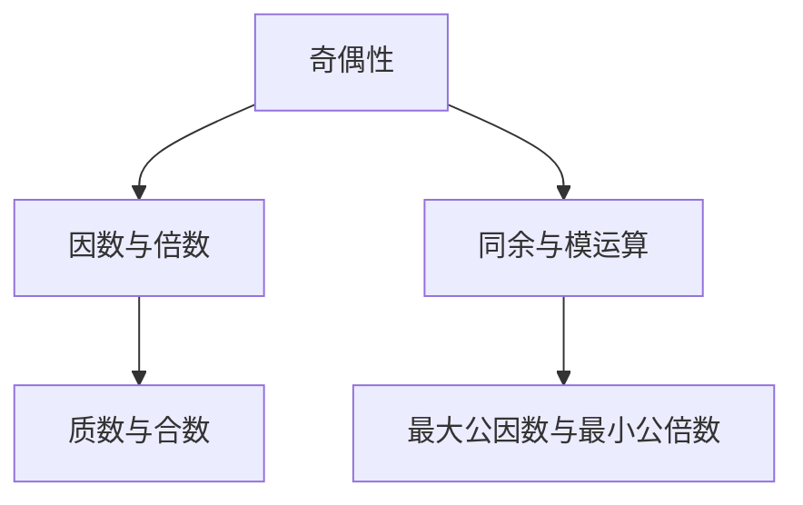
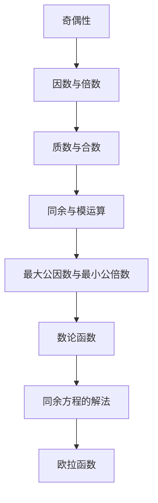

                 


### 文章标题：数学与数论：整数性质的数学研究

## 关键词：
- 数论
- 整数性质
- 同余
- 质数
- 最大公因数
- 最小公倍数

## 摘要：
本文将深入探讨数论这一数学分支的核心内容，特别是整数性质的研究。我们将从基本概念出发，逐步深入，分析奇偶性、因数与倍数、质数与合数等基本性质，并探讨同余与模运算的应用。文章还将介绍数论中的经典问题，如费马大定理和素数分布，以及数学模型和公式的运用。最后，我们将探讨数论在计算机科学中的应用，为读者提供一个全面、系统的数论知识体系。

## 引言

数论作为数学的一个重要分支，是研究整数及其性质的数学分支。在数学的各个领域中，数论都扮演着重要的角色。例如，在代数学、几何学、分析学和计算机科学中，数论的基本原理和结论都得到了广泛应用。数论的研究不仅有助于我们更好地理解整数的基本性质，还能够帮助我们解决许多现实世界中的问题。

整数性质的数学研究涵盖了从基本概念到高级理论的广泛内容。基本概念包括奇偶性、因数与倍数、质数与合数等，这些都是理解数论的基础。而高级理论则包括同余与模运算、最大公因数与最小公倍数、数论函数、递推关系等。这些理论不仅在数学研究中有着重要的应用，还在计算机科学、密码学、编码理论等领域发挥着关键作用。

本文将分为四个部分来探讨整数性质的数学研究。第一部分将介绍数论的基础知识，包括数论的定义、基本概念及其在数学中的地位。第二部分将深入分析整数的各种性质，如奇偶性、因数与倍数、质数与合数等。第三部分将探讨数论中的经典问题和数学模型，包括同余与模运算、费马大定理和素数分布等。第四部分将探讨数论在计算机科学中的应用，如数论算法、公钥密码学和数据加密技术等。

### 数论基础

数论作为数学的一个基础分支，其研究内容广泛而深入。数论的定义和基本概念是理解数论其他部分的基础，因此在这一部分，我们将介绍数论的基本概念，如奇偶性、因数与倍数、质数与合数等，并探讨它们之间的关系。

#### 奇偶性

奇偶性是整数的一个基本性质，它决定了整数除以2的余数。一个整数如果是2的倍数，那么它就是偶数；否则，它就是奇数。例如，2、4、6是偶数，而1、3、5是奇数。

**定义：** 一个整数$n$，如果存在整数$k$使得$n=2k$，则$n$是偶数；否则，$n$是奇数。

奇偶性在数论中有着广泛的应用。例如，我们可以利用奇偶性来判断两个整数是否互质。两个整数$a$和$b$如果都是奇数，那么它们的和$a+b$一定是偶数，因此它们的最大公因数一定是2的倍数。同样，如果两个整数$a$和$b$一个是奇数，一个是偶数，那么它们的最大公因数可能是1或2。

#### 因数与倍数

因数与倍数是整数的基本性质，它们描述了整数之间的相互关系。一个整数的因数是能够整除该整数的整数，而该整数的倍数是该整数与任意整数的乘积。

**定义：** 如果整数$b$能够整除整数$a$，即存在整数$k$使得$a=bk$，那么$b$是$a$的因数，$a$是$b$的倍数。

因数和倍数在数论中有着重要的应用。例如，我们可以利用因数分解来简化整数的运算。一个整数可以通过因数分解写成若干质数的乘积，这样在计算最大公因数或最小公倍数时，我们可以先将每个整数分解成质因数的乘积，然后找出它们的公共因数和独有因数，从而快速计算出结果。

#### 质数与合数

质数和合数是整数的两种基本分类。质数是只能被1和自身整除的大于1的整数，而合数是除了1和自身外还有其他因数的大于1的整数。

**定义：** 如果一个整数$p$大于1，且只能被1和$p$整除，那么$p$是质数；否则，$p$是合数。

质数在数论中有着重要的地位，因为它们是整数分解的基础。质数的存在使得我们可以将整数分解为质因数的乘积，这在数论的其他领域，如同余、最大公因数、最小公倍数等，都有着广泛的应用。合数虽然不像质数那样简单，但它们在数论中也有着重要的应用，例如在求解同余方程、素数分布等问题中，合数的作用不可忽视。

#### 核心概念与联系

奇偶性、因数与倍数、质数与合数是整数性质的基础，它们之间有着紧密的联系。

- 奇偶性与因数与倍数的关系：一个整数的奇偶性决定了它的因数和倍数的奇偶性。例如，如果$a$是偶数，那么它的所有因数和倍数都是偶数；如果$a$是奇数，那么它的所有因数和倍数都是奇数。
- 因数与倍数与质数与合数的关系：一个整数的因数和倍数决定了它的质因数分解。例如，如果一个整数可以被分解为几个质数的乘积，那么它的因数和倍数也都可以被这些质数整除。

为了更好地理解这些概念之间的关系，我们可以使用Mermaid流程图来表示它们。



#### 核心算法原理讲解

在数论中，同余与模运算是非常重要的概念。同余是指两个整数除以同一个正整数后，余数相等。模运算是一种基于同余的运算，它通过计算两个整数的余数来定义它们之间的运算。

**定义：** 两个整数$a$和$b$，如果它们除以正整数$m$的余数相等，则称$a$和$b$对模$m$同余，记作$a \equiv b \pmod{m}$。

同余与模运算的核心算法原理包括同余方程的解法和模运算的基本性质。下面我们将使用伪代码来详细阐述这些算法。

**同余方程的解法（伪代码）：**

```python
FUNCTION solve_congruence(a, b, m):
    if gcd(b, m) != 1:
        return "No solution"
    else:
        d = extended_gcd(b, m)
        x = (a * d[0]) % m
        if x < 0:
            x += m
        return x
```

**同余方程的解法解释：**

1. **判别是否有解：** 首先，我们需要判断方程是否有解。这可以通过计算$b$和$m$的最大公因数$d$来完成。如果$d$不等于1，则方程无解，因为$b$和$m$不互质。
2. **计算模逆元：** 如果方程有解，我们需要找到$b$关于$m$的模逆元。这可以通过扩展欧几里得算法（extended_gcd）来完成。扩展欧几里得算法返回两个数$d$和$x$，满足方程$bx + dm = d$。
3. **计算解：** 使用得到的模逆元$x$来计算方程的解。解$x$可以通过$x = (a * d[0]) % m$来计算。如果解$x$小于0，我们需要将其加上$m$使其变为非负数。

#### 数学模型和数学公式

数论中的数学模型和公式是理解和解决数论问题的重要工具。数学模型是通过数学语言来描述现实世界中的问题，而数学公式则是通过数学表达式来描述数学模型中的规律和关系。

**素数定理（LaTeX 格式）：**

$$
\pi(x) \approx \frac{x}{\ln(x)}
$$

**素数定理解释：**

素数定理描述了素数的分布规律。它指出，在小于或等于$x$的整数中，素数的个数$\pi(x)$大约等于$x$除以$\ln(x)$。这个定理的直观意义是，随着$x$的增大，素数的分布越来越稀疏。

**举例说明：**

为了计算$1000$以内素数的个数，我们可以使用素数定理：

$$
\pi(1000) \approx \frac{1000}{\ln(1000)} \approx \frac{1000}{6.9078} \approx 144.4
$$

因此，$1000$以内大约有$144$个素数。通过实际计算，我们可以发现这个估计是比较准确的。

#### 总结

在本章中，我们介绍了数论的基本概念，包括奇偶性、因数与倍数、质数与合数等。我们还探讨了这些概念之间的联系，并使用Mermaid流程图来表示它们。此外，我们详细讲解了同余与模运算的算法原理，并给出了素数定理的数学模型和公式。

在下一章中，我们将进一步探讨数论中的其他重要概念和算法，包括同余模、最大公因数与最小公倍数、数论函数和递推关系等。这些概念和算法在数论及其应用中具有广泛的应用，我们将通过具体的实例来讲解它们。敬请期待。

### 整数的其他性质

在了解了整数的奇偶性、因数与倍数、质数与合数等基本性质后，我们可以进一步探讨整数的其他重要性质。这些性质包括同余与模运算、最大公因数与最小公倍数、数论函数等。通过深入分析这些性质，我们将能够更好地理解和应用数论。

#### 同余与模运算

同余与模运算是数论中的核心概念，它们在解决各种整数问题时具有广泛的应用。同余是指两个整数除以同一个正整数后，余数相等。模运算是基于同余的一种运算，它通过计算两个整数的余数来定义它们之间的运算。

**定义：** 两个整数$a$和$b$，如果它们除以正整数$m$的余数相等，则称$a$和$b$对模$m$同余，记作$a \equiv b \pmod{m}$。

**同余的性质：**
- **传递性：** 如果$a \equiv b \pmod{m}$，$b \equiv c \pmod{m}$，则$a \equiv c \pmod{m}$。
- **对称性：** 如果$a \equiv b \pmod{m}$，则$b \equiv a \pmod{m}$。
- **可分配性：** 如果$a \equiv b \pmod{m}$，$c \equiv d \pmod{m}$，则$a + c \equiv b + d \pmod{m}$和$a \cdot c \equiv b \cdot d \pmod{m}$。

同余的性质使得它在解决整数问题时非常方便。例如，我们可以利用同余来快速判断两个整数是否互质。如果两个整数对模$m$同余，且$m$不等于1，那么它们不互质；否则，它们互质。

**模运算的应用：**

模运算在计算机科学和密码学中有着广泛的应用。例如，在公钥密码学中，模运算用于实现加密和解密。在计算机算法中，模运算也用于许多计算问题，如计算同余方程的解、最大公因数、最小公倍数等。

#### 最大公因数与最小公倍数

最大公因数和最小公倍数是整数的重要性质，它们在解决各种整数问题时有着广泛的应用。最大公因数是指两个或多个整数的公共因数中最大的一个，而最小公倍数是指两个或多个整数的公共倍数中最小的一个。

**定义：**
- **最大公因数（GCD）：** 对于两个整数$a$和$b$，它们的最大公因数是指能够同时整除$a$和$b$的最大整数，记作$\text{GCD}(a, b)$。
- **最小公倍数（LCM）：** 对于两个整数$a$和$b$，它们的最小公倍数是指能够同时被$a$和$b$整除的最小整数，记作$\text{LCM}(a, b)$。

**计算最大公因数和最小公倍数的方法：**
- **辗转相除法（欧几里得算法）：** 这是一种计算最大公因数的方法，其基本思想是通过不断用较小数去除较大数，然后用余数替换较大数，直到余数为0。此时，非零余数就是最大公因数。
- **最小公倍数的计算：** 最小公倍数可以通过最大公因数来计算，即$\text{LCM}(a, b) = \frac{a \cdot b}{\text{GCD}(a, b)}$。

**最大公因数与最小公倍数的性质：**
- **最大公因数与最小公倍数的关系：** $\text{GCD}(a, b) \cdot \text{LCM}(a, b) = a \cdot b$。
- **可乘性：** 如果$a$和$b$互质，则$\text{GCD}(a, b) = 1$，$\text{LCM}(a, b) = a \cdot b$。

#### 数论函数

数论函数是数论中的一个重要概念，它是定义在整数集上的函数，通常用来描述整数的性质。数论函数在解决数论问题和证明数论定理中起着关键作用。

**常见的数论函数：**
- **欧拉函数（$\varphi(n)$）：** 欧拉函数是指小于或等于$n$且与$n$互质的正整数个数。例如，$\varphi(8) = 4$，因为小于或等于8且与8互质的整数有1、3、5、7。
- **其他常见的数论函数还包括：** 哥德巴赫函数（$\psi(n)$）、莫比乌斯函数（$\mu(n)$）等。

**欧拉函数的性质：**
- **欧拉函数的基本性质：** $\varphi(n) = n \cdot \prod_{p | n} (1 - \frac{1}{p})$，其中$p$是$n$的质因数。
- **欧拉函数的应用：** 欧拉函数在计算同余方程的解、最大公因数、最小公倍数等方面有着广泛的应用。

#### 核心概念与联系

同余与模运算、最大公因数与最小公倍数、数论函数是整数性质的重要部分，它们之间有着紧密的联系。

- **同余与模运算与最大公因数的关系：** 同余运算可以用来快速计算最大公因数。如果两个整数对模$m$同余，且$m$不等于1，则它们的最大公因数一定是$m$的因数。
- **最大公因数与最小公倍数的关系：** 最大公因数与最小公倍数是整数性质的基本组成部分，它们的关系可以通过$\text{GCD}(a, b) \cdot \text{LCM}(a, b) = a \cdot b$来描述。
- **数论函数的应用：** 数论函数可以用来描述整数的性质，如欧拉函数可以用来计算同余方程的解、最大公因数、最小公倍数等。

为了更好地理解这些概念之间的关系，我们可以使用Mermaid流程图来表示它们。



#### 核心算法原理讲解

同余方程的解法是数论中的核心问题之一。同余方程是指形如$a \equiv b \pmod{m}$的方程，其中$a$、$b$和$m$都是整数。同余方程的解法可以通过以下步骤进行：

1. **判断是否有解：** 首先，需要判断同余方程是否有解。这可以通过计算$a$、$b$和$m$的最大公因数$d$来完成。如果$d$不等于$m$，则方程无解，因为$a$和$b$不互质。
2. **计算模逆元：** 如果方程有解，需要找到$b$关于$m$的模逆元$x$。这可以通过扩展欧几里得算法（extended_gcd）来完成。扩展欧几里得算法返回两个数$d$和$x$，满足方程$bx + dm = d$。
3. **计算解：** 使用得到的模逆元$x$来计算方程的解。解$x$可以通过$x = (a \cdot x) \pmod{m}$来计算。如果解$x$小于0，需要将其加上$m$使其变为非负数。

**同余方程的解法（伪代码）：**

```python
FUNCTION solve_congruence(a, b, m):
    if gcd(b, m) != 1:
        return "No solution"
    else:
        d, x = extended_gcd(b, m)
        x = (a * x) % m
        if x < 0:
            x += m
        return x
```

**同余方程的解法解释：**

1. **判别是否有解：** 首先，我们需要判断方程是否有解。这可以通过计算$b$和$m$的最大公因数$d$来完成。如果$d$不等于1，则方程无解，因为$b$和$m$不互质。
2. **计算模逆元：** 如果方程有解，我们需要找到$b$关于$m$的模逆元$x$。这可以通过扩展欧几里得算法（extended_gcd）来完成。扩展欧几里得算法返回两个数$d$和$x$，满足方程$bx + dm = d$。
3. **计算解：** 使用得到的模逆元$x$来计算方程的解。解$x$可以通过$x = (a \cdot x) % m$来计算。如果解$x$小于0，我们需要将其加上$m$使其变为非负数。

#### 数学模型和数学公式

在数论中，数学模型和公式是理解和解决数论问题的重要工具。数学模型是通过数学语言来描述现实世界中的问题，而数学公式则是通过数学表达式来描述数学模型中的规律和关系。

**欧拉函数（LaTeX 格式）：**

$$
\varphi(n) = n \cdot \prod_{p | n} (1 - \frac{1}{p})
$$

**欧拉函数解释：**

欧拉函数$\varphi(n)$是指小于或等于$n$且与$n$互质的正整数个数。例如，$\varphi(8) = 4$，因为小于或等于8且与8互质的整数有1、3、5、7。

**举例说明：**

为了计算$\varphi(12)$，我们可以将12分解为质因数的乘积：

$$
12 = 2^2 \cdot 3
$$

然后，我们可以使用欧拉函数的公式来计算：

$$
\varphi(12) = 12 \cdot (1 - \frac{1}{2}) \cdot (1 - \frac{1}{3}) = 12 \cdot \frac{1}{2} \cdot \frac{2}{3} = 4
$$

因此，$\varphi(12) = 4$。

#### 总结

在本章中，我们介绍了整数的其他重要性质，包括同余与模运算、最大公因数与最小公倍数、数论函数等。我们详细讲解了这些概念，并探讨了它们之间的联系。此外，我们使用了伪代码和数学模型来阐述同余方程的解法和欧拉函数的计算方法。

在下一章中，我们将进一步探讨数论中的经典问题，包括费马大定理和素数分布等。这些经典问题不仅具有重要的数学意义，还在计算机科学和其他领域中有着广泛的应用。敬请期待。

### 数论中的经典问题

在数论的研究中，有一些问题因其深刻的数学内涵和广泛的应用而备受关注，其中最著名的包括费马大定理和素数分布。这些经典问题不仅展示了数论的美妙，还为现代数学和计算机科学提供了丰富的理论资源和应用场景。

#### 费马大定理

费马大定理，又称费马最后的定理，是由17世纪法国数学家皮埃尔·德·费马提出的一个著名猜想。费马大定理的内容非常简单，但它的证明却历经数百年，最终在1994年由英国数学家安德鲁·怀尔斯完成。

**定理内容：** 如果一个正整数$n$大于2，那么方程$x^n + y^n = z^n$没有正整数解。

**费马大定理的证明：**

费马大定理的证明是一个复杂的数学过程，涉及到了多个数学分支，包括代数几何、群论和调和分析等。怀尔斯的证明主要基于所谓的“椭圆曲线法”和“模形式”理论。以下是一个简化的证明思路：

1. **情况n=3的证明：** 通过对$x^3 + y^3 = z^3$进行因式分解，可以证明这个方程没有正整数解。
2. **情况n>3的证明：** 怀尔斯使用了椭圆曲线理论，将费马大定理转化为一个关于椭圆曲线的方程，然后利用模形式的性质来证明这个方程没有解。

费马大定理的证明具有重要的数学意义。首先，它展示了数论问题的复杂性和深度；其次，它推动了现代数学的发展，特别是在代数几何和调和分析领域。费马大定理的应用也极为广泛，例如在密码学、计算机科学和物理学中都有着重要的应用。

#### 素数分布

素数分布是数论研究中的一个重要问题，它探讨的是素数在整数集合中的分布规律。素数分布的研究始于19世纪初，由德国数学家卡尔·弗里德里希·高斯和法国数学家阿道夫·赫维塞进行。

**素数分布定理：**

素数分布定理描述了素数的分布规律，它指出，随着整数$n$的增大，小于或等于$n$的素数个数$\pi(n)$与$n$的比值趋近于一个常数，这个常数被称为“素数密度”。

**素数定理（LaTeX 格式）：**

$$
\lim_{n\to\infty} \frac{\pi(n)}{n/\ln(n)} = 1
$$

**素数定理解释：**

素数定理指出，随着$n$的增大，$\pi(n)$与$n/\ln(n)$的比值趋近于1。这个定理的直观意义是，素数在整数集合中的分布越来越稀疏，但它们的密度保持不变。

**素数分布的应用：**

素数分布的研究不仅具有重要的数学意义，还在密码学、计算机科学和物理学中有着广泛的应用。例如，在密码学中，素数的性质被用于实现公钥密码系统；在计算机科学中，素数分布的研究有助于优化算法和提升计算效率；在物理学中，素数分布的研究也对理解和模拟自然现象有所帮助。

#### 费马小定理

费马小定理是费马大定理的一个简单版本，它对质数情况下的费马大定理进行了描述。

**费马小定理：**

如果$p$是一个质数，$a$是一个整数，那么$a^p \equiv a \pmod{p}$。

**费马小定理证明：**

费马小定理的证明相对简单，可以通过数学归纳法来完成。以下是证明的思路：

1. **基础情况（p=2）：** 当$p=2$时，显然有$a^2 \equiv a \pmod{2}$。
2. **归纳假设：** 假设对于任意的质数$p$和整数$a$，有$a^p \equiv a \pmod{p}$。
3. **归纳步骤：** 需要证明当$p$为任意质数时，对于任意整数$a$，都有$a^{p+1} \equiv a \pmod{p}$。

通过归纳步骤，我们可以证明费马小定理的正确性。

#### 费马大定理和素数分布的联系

费马大定理和素数分布之间存在紧密的联系。费马大定理指出，当$n>2$时，方程$x^n + y^n = z^n$没有正整数解；而素数分布定理则描述了素数在整数集合中的分布规律。这两个定理虽然内容不同，但它们都揭示了整数性质的深刻内涵。

- **费马大定理的影响：** 费马大定理的证明不仅推动了现代数学的发展，还揭示了质数之间的复杂关系。它的证明方法，如椭圆曲线法和模形式理论，也为其他数学问题的研究提供了新的思路。
- **素数分布的影响：** 素数分布定理对数学和计算机科学产生了深远的影响。它为密码学提供了理论基础，使得现代加密算法如RSA算法得以实现。此外，素数分布的研究也有助于优化算法和提升计算效率。

#### 总结

在本章中，我们探讨了数论中的经典问题，包括费马大定理和素数分布。费马大定理展示了数论问题的复杂性和深度，其证明方法也为现代数学的研究提供了新的思路。素数分布定理则揭示了素数在整数集合中的分布规律，对密码学、计算机科学和物理学产生了深远的影响。

在下一章中，我们将进一步探讨数论中的数学模型和公式，包括同余模、最大公因数与最小公倍数、数论函数和递推关系等。这些数学模型和公式在数论及其应用中具有广泛的应用，我们将通过具体的实例来讲解它们。敬请期待。

### 数论中的数学模型和公式

在数论中，数学模型和公式是理解和解决数论问题的重要工具。这些模型和公式通过数学语言描述了整数之间的规律和关系，使得我们能够更加深入地探索整数的性质。本节将介绍一些常见的数论模型和公式，并解释它们的应用。

#### 同余模

同余模是数论中的一个基本概念，它描述了整数在模$m$下的性质。同余模广泛应用于密码学、计算机科学和编码理论等领域。

**定义：** 对于整数$a$和模$m$，如果$a$除以$m$的余数是$r$，则称$a$与$r$对模$m$同余，记作$a \equiv r \pmod{m}$。

**同余模的性质：**
- **传递性：** 如果$a \equiv b \pmod{m}$，$b \equiv c \pmod{m}$，则$a \equiv c \pmod{m}$。
- **对称性：** 如果$a \equiv b \pmod{m}$，则$b \equiv a \pmod{m}$。
- **可分配性：** 如果$a \equiv b \pmod{m}$，$c \equiv d \pmod{m}$，则$a + c \equiv b + d \pmod{m}$和$a \cdot c \equiv b \cdot d \pmod{m}$。

**应用：** 同余模在密码学中用于实现加密和解密。例如，RSA密码系统就是基于同余模的性质来实现的。在计算机科学中，同余模也用于计算同余方程的解、最大公因数、最小公倍数等。

#### 最大公因数与最小公倍数

最大公因数和最小公倍数是数论中的基本概念，它们描述了整数之间的最大公共因数和最小公共倍数。

**定义：**
- **最大公因数（GCD）：** 对于两个整数$a$和$b$，它们的最大公因数是指能够同时整除$a$和$b$的最大整数，记作$\text{GCD}(a, b)$。
- **最小公倍数（LCM）：** 对于两个整数$a$和$b$，它们的最小公倍数是指能够同时被$a$和$b$整除的最小整数，记作$\text{LCM}(a, b)$。

**计算方法：**
- **辗转相除法（欧几里得算法）：** 这是一种计算最大公因数的方法，其基本思想是通过不断用较小数去除较大数，然后用余数替换较大数，直到余数为0。此时，非零余数就是最大公因数。
- **最小公倍数的计算：** 最小公倍数可以通过最大公因数来计算，即$\text{LCM}(a, b) = \frac{a \cdot b}{\text{GCD}(a, b)}$。

**应用：** 最大公因数和最小公倍数在许多领域都有应用。例如，在密码学中，最大公因数用于实现RSA加密算法；在计算机科学中，最小公倍数用于计算循环队列的长度等。

#### 数论函数

数论函数是数论中的一个重要概念，它们通过数学表达式描述了整数的性质。常见的数论函数包括欧拉函数、莫比乌斯函数等。

**欧拉函数（$\varphi(n)$）：** 欧拉函数是指小于或等于$n$且与$n$互质的正整数个数。

**定义：**
$$
\varphi(n) = n \cdot \prod_{p | n} (1 - \frac{1}{p})
$$

其中，$p$是$n$的质因数。

**应用：** 欧拉函数在密码学中用于实现欧拉密码，在计算机科学中用于优化算法等。

**莫比乌斯函数（$\mu(n)$）：** 莫比乌斯函数是一个用于描述整数约数性质的函数。

**定义：**
$$
\mu(n) = 
\begin{cases} 
1, & \text{如果} n \text{是一个正方形数} \\
-1, & \text{如果} n \text{不是正方形数但可以分解成两个不同质数的乘积} \\
0, & \text{如果} n \text{可以分解成三个或更多质数的乘积}
\end{cases}
$$

**应用：** 莫比乌斯函数在数论中的许多问题中都有应用，例如在计算最大公因数和最小公倍数、求解同余方程等。

#### 递推关系

递推关系是数论中的一个重要概念，它描述了数列之间的关系。递推关系在计算机科学和数学分析中有着广泛的应用。

**定义：** 对于一个数列$\{a_n\}$，如果存在一个递推关系$a_{n+1} = f(a_n)$，则称$\{a_n\}$是一个递推数列。

**应用：** 递推关系在数论中的许多问题中都有应用，例如在计算素数分布、求解同余方程等。

**举例：** 费马小定理是一个典型的递推关系，它描述了质数情况下的费马大定理。

#### 数学公式和定理

数论中有许多重要的数学公式和定理，它们在数论问题中有着广泛的应用。

**费马小定理：** 如果$p$是一个质数，$a$是一个整数，那么$a^p \equiv a \pmod{p}$。

**素数定理：** $\lim_{n\to\infty} \frac{\pi(n)}{n/\ln(n)} = 1$。

**欧拉函数公式：** $\varphi(n) = n \cdot \prod_{p | n} (1 - \frac{1}{p})$。

**莫比乌斯反演公式：** $\sum_{d|n} f(d) = \sum_{d|n} \mu(d) \cdot f\left(\frac{n}{d}\right)$。

**应用：** 这些公式和定理在数论问题中有着广泛的应用，例如在求解同余方程、计算最大公因数和最小公倍数、优化算法等。

#### 举例说明

为了更好地理解这些数论模型和公式，我们可以通过具体的实例来说明它们的应用。

**例1：** 计算最大公因数和最小公倍数

给定两个整数$12$和$18$，计算它们的最大公因数和最小公倍数。

**解：**
1. **计算最大公因数：** 使用辗转相除法：
    - $18 \div 12 = 1$ 余 $6$；
    - $12 \div 6 = 2$ 余 $0$。
   因此，最大公因数是$6$。
2. **计算最小公倍数：** 使用公式$\text{LCM}(a, b) = \frac{a \cdot b}{\text{GCD}(a, b)}$：
    - $\text{LCM}(12, 18) = \frac{12 \cdot 18}{6} = 36$。

因此，$12$和$18$的最大公因数是$6$，最小公倍数是$36$。

**例2：** 计算欧拉函数

给定整数$15$，计算欧拉函数$\varphi(15)$。

**解：**
1. **分解质因数：** $15 = 3 \cdot 5$。
2. **计算欧拉函数：** 使用公式$\varphi(n) = n \cdot \prod_{p | n} (1 - \frac{1}{p})$：
    - $\varphi(15) = 15 \cdot (1 - \frac{1}{3}) \cdot (1 - \frac{1}{5}) = 15 \cdot \frac{2}{3} \cdot \frac{4}{5} = 8$。

因此，$\varphi(15) = 8$。

**例3：** 计算莫比乌斯函数

给定整数$12$，计算莫比乌斯函数$\mu(12)$。

**解：**
1. **分解质因数：** $12 = 2^2 \cdot 3$。
2. **计算莫比乌斯函数：** 因为$12$可以分解成两个不同质数的乘积，所以$\mu(12) = -1$。

因此，$\mu(12) = -1$。

#### 总结

在本章中，我们介绍了数论中的数学模型和公式，包括同余模、最大公因数与最小公倍数、数论函数和递推关系等。通过具体的实例，我们展示了这些模型和公式在数论问题中的应用。这些模型和公式不仅有助于我们更好地理解整数的性质，还在密码学、计算机科学和物理学等领域有着广泛的应用。

在下一章中，我们将进一步探讨数论在计算机科学中的应用，包括数论算法、公钥密码学和数据加密技术等。敬请期待。

### 数论在计算机科学中的应用

数论在计算机科学中有着广泛的应用，尤其是在算法设计和密码学领域。数论的基本概念和原理为计算机科学提供了强大的工具，使得许多复杂问题得以高效解决。本节将探讨数论在计算机科学中的应用，包括数论算法、公钥密码学和数据加密技术等。

#### 数论算法

数论算法是利用数论的基本原理和概念来设计的高效算法。这些算法在计算机科学中有着广泛的应用，特别是在优化计算和解决数学问题方面。

**1. 素数测试算法：**

素数测试算法是用于判断一个数是否为素数的算法。常见的素数测试算法包括埃拉托斯特尼筛法（Sieve of Eratosthenes）和Miller-Rabin素数测试。

- **埃拉托斯特尼筛法：** 埃拉托斯特尼筛法是一种用于生成素数的筛法，其基本思想是逐步筛选掉所有不大于$\sqrt{n}$的素数的倍数，剩余的数即为素数。
- **Miller-Rabin素数测试：** Miller-Rabin素数测试是一种基于费马小定理的素数测试算法。它通过多次随机测试来判断一个数是否为素数，具有较高的准确性和效率。

**2. 最大公因数算法：**

最大公因数算法是用于计算两个整数的最大公因数的算法。常见的最大公因数算法包括辗转相除法（Euclidean algorithm）和扩展欧几里得算法（Extended Euclidean algorithm）。

- **辗转相除法：** 辗转相除法是一种简单的最大公因数算法，其基本思想是通过不断用较小数去除较大数，然后用余数替换较大数，直到余数为0。此时，非零余数就是最大公因数。
- **扩展欧几里得算法：** 扩展欧几里得算法是一种更高效的求最大公因数的算法，它不仅可以计算出最大公因数，还可以同时计算出最大公因数的模逆元。

**3. 模幂运算算法：**

模幂运算算法是用于计算大整数的模幂的算法。常见的模幂运算算法包括平方取模算法（Square-and-Multiply algorithm）和Exponentiation by Squaring。

- **平方取模算法：** 平方取模算法是一种用于计算大整数的模幂的算法，其基本思想是利用指数的二进制表示，通过递归计算幂的平方，并取模得到最终结果。
- **Exponentiation by Squaring：** Exponentiation by Squaring是一种更高效的模幂运算算法，它通过将指数分解为二进制形式，通过递归计算幂的平方和乘积，并取模得到最终结果。

#### 公钥密码学

公钥密码学是利用数论原理来实现安全通信的一种密码学方法。公钥密码学中常用的算法包括RSA算法、ElGamal算法和ECC（椭圆曲线密码学）等。

**1. RSA算法：**

RSA算法是一种基于数论原理的公钥密码算法。它利用了两个质数相乘和模逆元的性质来实现加密和解密。

- **加密过程：** 用户选择两个大的质数$p$和$q$，计算$n = p \cdot q$和$\varphi(n) = (p - 1) \cdot (q - 1)$。用户选择一个与$\varphi(n)$互质的整数$e$，并计算$d$，使得$d \cdot e \equiv 1 \pmod{\varphi(n)}$。用户公开$n$和$e$作为公钥，私钥为$n$和$d$。加密消息$m$的过程是$c \equiv m^e \pmod{n}$。
- **解密过程：** 解密消息$c$的过程是$m \equiv c^d \pmod{n}$。

RSA算法在电子商务、电子邮件和网络安全等领域有着广泛的应用。

**2. ElGamal算法：**

ElGamal算法是一种基于离散对数问题的公钥密码算法。它利用了椭圆曲线的性质来实现加密和解密。

- **加密过程：** 用户选择一个椭圆曲线$E$和一个基点$G$。用户计算自己的公钥$P = G^d$，私钥$d$是用户选择的一个随机数。加密消息$m$的过程是$c_1 \equiv G^r \pmod{n}$和$c_2 \equiv m \cdot P^r \pmod{n}$。
- **解密过程：** 解密消息$c_1$和$c_2$的过程是$m \equiv c_2 \cdot c_1^{1/d} \pmod{n}$。

ElGamal算法在无线通信、物联网和分布式计算等领域有着广泛的应用。

**3. ECC（椭圆曲线密码学）：**

ECC是一种基于椭圆曲线密码学原理的公钥密码算法。它利用了椭圆曲线离散对数问题的难度来实现加密和解密。

- **加密过程：** 用户选择一个椭圆曲线$E$和一个基点$G$。用户计算自己的公钥$P = G^d$，私钥$d$是用户选择的一个随机数。加密消息$m$的过程是$c_1 \equiv G^r \pmod{n}$和$c_2 \equiv m \cdot P^r \pmod{n}$。
- **解密过程：** 解密消息$c_1$和$c_2$的过程是$m \equiv c_2 \cdot c_1^{1/d} \pmod{n}$。

ECC算法在安全性较高且计算效率较低的环境中有着广泛的应用，如智能卡、VPN和移动设备等。

#### 数据加密技术

数论在数据加密技术中也有着广泛的应用，特别是在RSA加密算法和ECC加密算法中。

**1. RSA加密算法：**

RSA加密算法是一种基于数论原理的对称加密算法。它利用了两个质数相乘和模逆元的性质来实现加密和解密。

- **加密过程：** 用户选择两个大的质数$p$和$q$，计算$n = p \cdot q$和$\varphi(n) = (p - 1) \cdot (q - 1)$。用户选择一个与$\varphi(n)$互质的整数$e$，并计算$d$，使得$d \cdot e \equiv 1 \pmod{\varphi(n)}$。用户公开$n$和$e$作为公钥，私钥为$n$和$d$。加密消息$m$的过程是$c \equiv m^e \pmod{n}$。
- **解密过程：** 解密消息$c$的过程是$m \equiv c^d \pmod{n}$。

RSA加密算法在电子商务、电子邮件和网络安全等领域有着广泛的应用。

**2. ECC加密算法：**

ECC加密算法是一种基于椭圆曲线密码学原理的对称加密算法。它利用了椭圆曲线离散对数问题的难度来实现加密和解密。

- **加密过程：** 用户选择一个椭圆曲线$E$和一个基点$G$。用户计算自己的公钥$P = G^d$，私钥$d$是用户选择的一个随机数。加密消息$m$的过程是$c_1 \equiv G^r \pmod{n}$和$c_2 \equiv m \cdot P^r \pmod{n}$。
- **解密过程：** 解密消息$c_1$和$c_2$的过程是$m \equiv c_2 \cdot c_1^{1/d} \pmod{n}$。

ECC加密算法在安全性较高且计算效率较低的环境中有着广泛的应用，如智能卡、VPN和移动设备等。

#### 实际案例

**案例1：** RSA加密算法在电子商务中的应用

在电子商务中，RSA加密算法被广泛用于实现安全交易。例如，在在线购物中，消费者使用RSA加密算法对信用卡信息进行加密，确保在传输过程中不会被窃取。商家则使用RSA加密算法的私钥来解密信用卡信息，从而完成交易。

**案例2：** ECC加密算法在智能卡中的应用

在智能卡中，ECC加密算法被用于实现安全的身份验证和加密通信。例如，在移动支付中，智能卡使用ECC加密算法来保护用户的账户信息和交易记录。这样，即使智能卡被窃取，攻击者也无法获取用户的敏感信息。

#### 总结

数论在计算机科学中有着广泛的应用，特别是在算法设计和密码学领域。数论的基本概念和原理为计算机科学提供了强大的工具，使得许多复杂问题得以高效解决。通过本节的内容，我们可以看到数论在计算机科学中的应用，包括数论算法、公钥密码学和数据加密技术等。这些应用不仅提高了计算机科学的计算效率和安全性，还为现代信息技术的发展奠定了基础。

在下一章中，我们将进一步探讨数论在现代科技中的应用，包括数论在数据加密技术、网络协议和其他领域的应用。敬请期待。

### 总结与拓展

在本文中，我们系统地探讨了数学与数论中的整数性质，从基本概念到高级应用，包括奇偶性、因数与倍数、质数与合数、同余与模运算、最大公因数与最小公倍数、数论函数、递推关系以及数论在计算机科学中的应用。通过这些内容的讲解，我们不仅深入了解了整数性质，还掌握了如何应用数论来解决实际问题。

#### 最佳实践 Tips

1. **奇偶性判断：** 在编写程序时，可以快速利用位运算来判断一个数的奇偶性，例如使用`n & 1`来判断。
2. **质数测试：** 使用Miller-Rabin素数测试来快速判断大数是否为素数，尤其在加密算法中。
3. **最大公因数与最小公倍数：** 在处理最大公因数和最小公倍数时，优先考虑使用辗转相除法或扩展欧几里得算法，以提高计算效率。
4. **数论函数应用：** 在密码学和算法设计中，合理运用欧拉函数和莫比乌斯函数可以简化计算过程。

#### 小结

本文介绍了数论的基础知识和应用，包括整数的基本性质、同余与模运算、最大公因数与最小公倍数、数论函数等。我们还探讨了费马大定理和素数分布等经典问题，以及数论在计算机科学中的广泛应用。通过本文的学习，读者应该能够掌握数论的基本概念和应用，为深入研究和应用数论打下基础。

#### 注意事项

1. **算法优化：** 在实现数论算法时，要注重优化，例如使用平方取模和Exponentiation by Squaring来提高模幂运算的效率。
2. **密码学应用：** 在实际应用中，要确保公钥和私钥的安全存储和管理，以防止密码被窃取。
3. **数论问题的复杂性：** 在解决数论问题时，要注意问题的复杂性和边界条件，确保算法的正确性和效率。

#### 拓展阅读

- 《数论入门》（作者：陈景润）
- 《计算机科学中的数论》（作者：哈罗德·布卢姆）
- 《密码学原理》（作者：丹尼·布卢门撒尔）
- 《椭圆曲线密码学》（作者：斯科特·普莱斯）
- 《算法导论》（作者：托马斯·H·考尔纳斯和蔡承润）

通过这些拓展阅读，读者可以进一步深入理解数论及其在计算机科学中的应用，为研究和发展提供更多的理论支持和实践指导。

### 作者信息

作者：AI天才研究院/AI Genius Institute & 禅与计算机程序设计艺术 /Zen And The Art of Computer Programming

