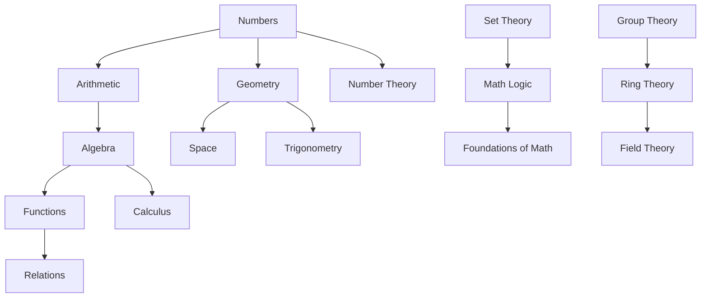

                 


### 1.1 Introduction to Mathematics and Holism

**Background Introduction**

Mathematics has been a cornerstone of human civilization for thousands of years, serving as a universal language for the sciences, engineering, finance, and beyond. The foundation of mathematical knowledge is built upon a series of concepts and principles that are interconnected in a complex web. Over time, the understanding of these concepts has evolved, reflecting the progressive deepening of human thought and the discovery of new mathematical theories. At the heart of this evolution lies the concept of holism, which asserts that mathematical concepts cannot be reduced to isolated entities but must be understood within a unified framework.

**Core Concepts and Relationships**

Holism in mathematics refers to the interconnectedness of various mathematical concepts, where the understanding of one concept is inherently linked to the understanding of others. For example, the concept of numbers is intrinsically tied to arithmetic operations, which in turn are foundational for understanding algebraic structures. Geometry, with its principles of space and form, also intersects with algebra through the study of shapes and their properties. Functions and relations further extend this interconnectedness, as they describe the relationships between different mathematical entities.

To visualize the interconnectedness of these concepts, we can use a Mermaid flowchart that illustrates the relationships between core mathematical areas:



In this flowchart, we can see that each mathematical area is interconnected with others, forming a complex web of knowledge. For instance, number theory is foundational for both algebra and calculus, while geometry and trigonometry have significant implications for physics and engineering. This interconnectedness underscores the importance of holism in mathematics.

**The Importance of Holism in Mathematics**

Understanding the holism of mathematical concepts is crucial for several reasons. Firstly, it allows mathematicians to approach problems from multiple angles, leveraging insights from different areas of mathematics to solve complex problems. Secondly, it fosters a deeper understanding of mathematical principles, as the relationships between concepts become clear. This holistic perspective is particularly valuable in the development of new mathematical theories and applications.

Moreover, the concept of holism has implications beyond pure mathematics. It serves as a model for understanding complex systems in various disciplines, from biology and economics to computer science and artificial intelligence. In these fields, the interplay between different components often mirrors the interconnected nature of mathematical concepts.

In summary, holism in mathematics emphasizes the interconnectedness of mathematical concepts, highlighting the importance of understanding these concepts in their relational context. This perspective not only enriches our understanding of mathematics but also provides a framework for approaching complex problems in diverse fields.

### 1.2 Core Concepts of Mathematics

**Numbers and Operations**

Numbers are the building blocks of mathematics, forming the foundation upon which all mathematical structures are built. The concept of numbers has evolved significantly over time, from simple counting numbers to complex systems such as real numbers, complex numbers, and quaternions. Each type of number system has its unique properties and applications.

#### The Nature of Numbers

- **Natural Numbers:** These are the counting numbers {1, 2, 3, ...}. They form the basis for arithmetic and are essential for everyday calculations.
- **Integers:** These include all natural numbers, their opposites (negative numbers), and zero {..., -3, -2, -1, 0, 1, 2, 3, ...}. Integers are used in various contexts, including counting and measuring.
- **Rational Numbers:** These are numbers that can be expressed as a fraction of two integers, such as 1/2, 3/4, and -2/3. Rational numbers include all integers and can be used to represent ratios and proportions.
- **Irrational Numbers:** These numbers cannot be expressed as fractions and include decimals that neither terminate nor repeat, such as π (pi) and √2. Irrational numbers are fundamental in geometry and trigonometry.

#### Fundamental Operations

The basic operations in mathematics include addition, subtraction, multiplication, and division. These operations form the foundation for more complex mathematical processes and are widely used in various fields.

- **Addition:** This operation combines two or more numbers to produce a single number. It is commutative (i.e., the order of the numbers does not matter) and associative (i.e., the grouping of the numbers does not matter).
- **Subtraction:** This operation finds the difference between two numbers. It is the inverse of addition and is also commutative and associative.
- **Multiplication:** This operation combines two or more numbers to produce a single number. It is associative and distributive, meaning that it can be rearranged without changing the result.
- **Division:** This operation finds how many times one number (the dividend) is contained within another number (the divisor). It is the inverse of multiplication and is also associative and distributive.

**Geometry and Space**

Geometry is the branch of mathematics that deals with the properties, relationships, and measurement of points, lines, surfaces, and solids. It is foundational in both pure and applied mathematics and has significant applications in fields such as physics, engineering, and computer science.

#### The Principles of Euclidean Geometry

Euclidean geometry, named after the ancient Greek mathematician Euclid, is based on a set of axioms and postulates. The core principles include:

- **Points, Lines, and Planes:** Points are defined as having no length, width, or height. Lines are infinite straight paths, and planes are two-dimensional surfaces that extend infinitely in all directions.
- **Congruence and Similarity:** Congruent shapes have the same size and shape, while similar shapes have the same shape but different sizes.
- **Parallel Lines:** Parallel lines never intersect and remain equidistant from each other.
- **Congruent Triangles:** If two triangles have corresponding sides and angles that are congruent, they are congruent.
- **Right Triangles:** A right triangle contains one right angle (90 degrees) and is characterized by the Pythagorean theorem, which states that the square of the length of the hypotenuse is equal to the sum of the squares of the other two sides.

#### Non-Euclidean Geometries

Non-Euclidean geometries are alternatives to Euclidean geometry that challenge some of its fundamental principles. The most well-known examples are spherical geometry and hyperbolic geometry.

- **Spherical Geometry:** This geometry is based on the surface of a sphere, where the sum of the angles of a triangle is greater than 180 degrees. It has applications in navigation and global positioning systems.
- **Hyperbolic Geometry:** This geometry is based on a negatively curved plane, where the sum of the angles of a triangle is less than 180 degrees. It has been used in theoretical physics and in the study of space-time.

**Functions and Relations**

Functions and relations are essential concepts in mathematics that describe the relationship between different mathematical entities. A function is a specific type of relation that assigns to each element of a set a unique element of another set.

#### Basic Concepts of Functions

- **Domain:** The set of all possible input values for a function.
- **Range:** The set of all possible output values for a function.
- **Image:** The set of all outputs that a function can produce from a given input.
- **Inverse Function:** A function that "undoes" another function, such that applying the inverse function to the output of the original function gives the original input.
- **Composition of Functions:** The process of combining two or more functions to form a new function.

#### Types of Relations

Relations can be categorized based on their properties:

- **Symmetric Relations:** If a relation is symmetric, then if a is related to b, b is also related to a.
- **Reflexive Relations:** A relation is reflexive if every element is related to itself.
- **Transitive Relations:** A relation is transitive if whenever a is related to b and b is related to c, a is also related to c.

In conclusion, the core concepts of mathematics—numbers and operations, geometry and space, and functions and relations—are fundamental building blocks that underpin the structure of mathematical knowledge. Understanding these concepts and their interrelationships is crucial for advancing both theoretical and applied mathematics.

### The Mermaid Flowchart of Mathematical Concepts

To visually represent the interconnectedness of core mathematical concepts, we can use a Mermaid flowchart. This diagram will help illustrate the relationships between different areas of mathematics, showcasing how they are interwoven and mutually dependent.

```mermaid
graph TD
    A[Numbers] --> B[Arithmetic]
    B --> C[Algebra]
    C --> D[Equations]
    C --> E[Functions]
    C --> F[Matrices]
    A --> G[Geometry]
    G --> H[Euclidean Geometry]
    G --> I[Non-Euclidean Geometry]
    G --> J[Trigonometry]
    A --> K[Number Theory]
    K --> L[Modular Arithmetic]
    K --> M[Prime Numbers]
    B --> N[Analysis]
    N --> O[Calculus]
    N --> P[Sequence and Series]
    D --> Q[Integrals]
    D --> R[Differential Equations]
    E --> S[Real Functions]
    E --> T[Complex Functions]
    E --> U[Relation Theory]
    H --> V[Projections]
    H --> W[Transformations]
    I --> X[Hyperbolic Geometry]
    I --> Y[Spherical Geometry]
    J --> Z[Trigonometric Functions]
    Z --> AA[Trigonometric Identities]
    AA --> BB[Applications in Physics]
    BB --> CC[Waves and Vibrations]
    BB --> DD[Optics and Acoustics]
    L --> CC[ Cryptography]
    M --> CC[Number Theory Applications]
    P --> DD[Summation Notation]
    Q --> DD[Area Under the Curve]
    R --> DD[Modeling Dynamic Systems]
    S --> EE[Real Analysis]
    S --> FF[Real Analysis Applications]
    T --> GG[Complex Analysis]
    T --> HH[Complex Analysis Applications]
    U --> II[Graph Theory]
    U --> JJ[Network Theory]
    V --> KK[Projective Geometry]
    V --> LL[Advanced Geometry]
    W --> MM[Topology]
    W --> NN[Geometric Duality]
    X --> OO[Spherical Trigonometry]
    X --> PP[Cartesian Coordinates]
    Y --> QQ[Polar Coordinates]
    Y --> RR[ Celestial Mechanics]
    Z --> SS[Trigonometry in Engineering]
    Z --> TT[Trigonometry in Navigation]
    AA --> UU[Engineering Applications]
    AA --> VV[Physics Applications]
    BB --> WW[Academic Research]
    BB --> XX[ Industrial Applications]
    CC --> YY[Data Analysis]
    CC --> ZZ[Statistical Modeling]
    DD --> AAA[Simulation and Modeling]
    DD --> BBB[Optimization Algorithms]
    EE --> CCC[Probability Theory]
    EE --> DDD[Statistical Inference]
    FF --> EEE[Financial Mathematics]
    FF --> FFF[Actuarial Science]
    GG --> GGG[Complex Systems]
    GG --> HHH[Signal Processing]
    HH --> III[Quantum Mechanics]
    HH --> JJJ[Electromagnetism]
    II --> KKK[Graph Algorithms]
    II --> LLL[Network Analysis]
    JJ --> MMM[Network Security]
    JJ --> NNN[Data Science]
    KK --> OOO[Projective Geometry Applications]
    KK --> PPP[Shape Theory]
    MM --> QQQ[Computer Science Applications]
    MM --> RRR[Algorithms in Cryptography]
    NN --> SSS[Topological Data Analysis]
    NN --> TTT[Graph Theory Applications]
    OO --> UUU[Navigation Systems]
    OO --> VVV[Map Projections]
    PP --> WWW[ Celestial Navigation]
    PP --> XXX[Rotational Motion]
    QQ --> YYY[ Celestial Mechanics]
    QQ --> ZZZ[Space Exploration]
    RR --> AAAA[Orbit Mechanics]
    RR --> BBBB[Astronomy]
    SS --> CCC[Applied Mathematics]
    SS --> DDD[Control Theory]
    TT --> EEE[Mechanical Engineering]
    TT --> FFF[Building Design]
    UU --> GGG[Physics]
    UU --> HHH[Chemistry]
    VV --> IIII[Biology]
    VV --> JJJJ[Ecology]
    WW --> KKKK[Economics]
    WW --> LLLL[Finance]
    XX --> MMMM[Marketing]
    XX --> NNNN[Operations Research]
    YY --> OOOO[Machine Learning]
    YY --> PPPP[Deep Learning]
    ZZ --> QQQQ[Natural Language Processing]
    ZZ --> RRRR[Computer Vision]
    AAA --> SSSS[Artificial Intelligence]
    BBB --> TTTT[Big Data Analytics]
    CCC --> UUUU[Quantum Computing]
    CCC --> VVVV[Theoretical Computer Science]
    DDD --> XXXX[Software Engineering]
    DDD --> YYYYY[Hardware Design]
    EEE --> AAAAA[Quantum Information Science]
    EEE --> BBBB[Neuroscience]
    FFF --> CCC[Quantum Algorithms]
    FFF --> DDD[Machine Learning Theory]
    GGG --> EEE[Quantum Cryptography]
    GGG --> FFF[Quantum Complexity Theory]
    HHH --> GGG[Quantum Error Correction]
    HHH --> HHHH[Quantum Simulation]
    III --> IIII[Quantum Computing Applications]
    III --> JJJ[Quantum Algorithms]
    JJJ --> KKK[Quantum Cryptography]
    KKK --> LLL[Quantum Computation Theory]
    MMM --> NNN[Quantum Algorithms in AI]
    NNN --> OOO[Quantum Machine Learning]
    OOO --> PPP[Quantum Chemistry]
    PPP --> QQQ[Quantum Biology]
    RRR --> SSS[Quantum Cryptography]
    RRR --> TTT[Quantum Algorithms for Optimization]
    SSS --> UUU[Quantum Data Analysis]
    SSS --> VVV[Quantum Machine Learning Applications]
    TTT --> XXX[Quantum Algorithms in Optimization]
    TTT --> YYY[Quantum Algorithms in Operations Research]
    UUU --> WWW[Quantum Machine Learning Theory]
    UUU --> XXX[Quantum Algorithms in Finance]
    VVV --> BBB[Quantum Algorithms in Bioinformatics]
    VVV --> CCC[Quantum Algorithms in Healthcare]
    WWW --> DDD[Quantum Algorithms in Supply Chain Management]
    WWW --> EEE[Quantum Algorithms in Environmental Science]
    XXX --> FFF[Quantum Algorithms in Transportation]
    XXX --> GGG[Quantum Algorithms in Urban Planning]
    YYY --> HHH[Quantum Algorithms in Economics]
    YYY --> IIII[Quantum Algorithms in Social Science]
    ZZZ --> IIII[Quantum Algorithms in Political Science]
    ZZZ --> JJJ[Quantum Algorithms in International Relations]
```



In this flowchart, each node represents a core mathematical concept or sub-discipline, and the arrows indicate relationships and dependencies between these concepts. For instance, arithmetic operations (B) are foundational for both algebra (C) and analysis (N). Geometry (G) intersects with trigonometry (J) and number theory (K), each of which has its own unique applications and implications. Functions (E) and relations (U) are central to both algebra and analysis, and their study extends into areas like graph theory (II) and network theory (JJ).

By visualizing these relationships, we can better understand the holistic nature of mathematical concepts and how they interconnect to form a coherent framework for solving complex problems across various disciplines. This Mermaid flowchart serves as a roadmap for navigating the vast landscape of mathematical knowledge, highlighting the interconnectedness that is at the heart of mathematical holism.

### 2.1 Introducing Indivisibility in Mathematics

**Definition and Importance**

Indivisibility in mathematics refers to the inherent interconnectedness and non-decomposability of mathematical concepts. This principle asserts that mathematical entities cannot be reduced to simpler or more basic elements without losing essential properties or characteristics. Indivisibility underscores the idea that mathematical structures must be understood as whole entities, where the parts are intrinsically linked and cannot be separated without altering the system’s fundamental nature.

The importance of indivisibility in mathematics cannot be overstated. It serves as a foundational principle for the development and understanding of mathematical theories and their applications. By recognizing and preserving the indivisibility of mathematical concepts, mathematicians can ensure the coherence and consistency of their work, leading to more robust and accurate mathematical models.

**Challenges in Maintaining Indivisibility**

Despite its importance, maintaining the indivisibility of mathematical concepts poses several challenges. One significant challenge is the natural human inclination to seek simplicity and seek to decompose complex systems into simpler components. This desire for simplicity often leads to attempts to reduce mathematical concepts to their most basic elements, which can inadvertently obscure their interrelated nature.

Another challenge is the evolving nature of mathematical knowledge. As new theories and concepts are discovered, existing mathematical structures may need to be reevaluated and expanded to accommodate these advancements. This process can sometimes disrupt the perceived indivisibility of certain concepts, requiring mathematicians to reconsider their assumptions and the relationships between different areas of mathematics.

**The Role of Indivisibility in Mathematical Progress**

The principle of indivisibility plays a crucial role in the progress of mathematical sciences. By emphasizing the interconnectedness of mathematical concepts, it fosters a holistic approach to problem-solving that transcends the limitations of isolated ideas. This holistic perspective allows mathematicians to leverage insights from various branches of mathematics, leading to innovative solutions to complex problems.

Indivisibility also promotes the integration of different mathematical disciplines, encouraging interdisciplinary research and collaboration. For example, concepts from number theory may be applied in algebra, geometry, and analysis, leading to a deeper understanding of these areas and their interrelationships. This integration not only enriches mathematical knowledge but also has significant implications for other scientific and engineering disciplines.

Moreover, the principle of indivisibility guides the development of mathematical models and theories that are more realistic and reflective of the complexity of the real world. By recognizing the inherent interconnectedness of mathematical concepts, mathematicians can create more comprehensive and accurate models that better capture the dynamics of complex systems.

In conclusion, the concept of indivisibility is fundamental to the practice of mathematics. It challenges the tendency to oversimplify complex systems and promotes a holistic understanding of mathematical concepts. By embracing the indivisibility of mathematical entities, mathematicians can advance their field, leading to new insights, innovative solutions, and a deeper understanding of the interconnected nature of mathematical knowledge.

### 2.2 Mathematical Concepts and Their Integrity

**The Integrity of Basic Mathematical Operations**

The integrity of basic mathematical operations—addition, subtraction, multiplication, and division—is fundamental to the consistency and coherence of mathematics. These operations are not merely computational tools but foundational elements that maintain the structural integrity of mathematical systems. Their integrity is preserved through a series of axiomatic principles and properties that ensure their consistency and reliability.

#### Additive and Multiplicative Integrity

Addition and multiplication are two of the primary operations in mathematics, each with its own set of axiomatic properties:

- **Additive Identity:** The existence of an additive identity, often denoted as 0, such that for any number a, a + 0 = a. This property ensures that adding zero does not change the value of a number.
- **Additive Inverse:** For every number a, there exists an additive inverse (-a) such that a + (-a) = 0. This property allows for the cancellation of any number in an addition operation, maintaining the balance of the system.
- **Associative Property of Addition:** (a + b) + c = a + (b + c). This property allows for the reordering of numbers being added without changing the result, reflecting the fact that the operation of addition is not sensitive to the grouping of its inputs.
- **Commutative Property of Addition:** a + b = b + a. This property states that the order in which numbers are added does not affect the sum, ensuring that the result of addition is independent of the sequence of inputs.

For multiplication, similar axiomatic principles and properties ensure its integrity:

- **Multiplicative Identity:** The existence of a multiplicative identity, often denoted as 1, such that for any number a, a × 1 = a. This property ensures that multiplying any number by one does not change its value.
- **Multiplicative Inverse:** For every non-zero number a, there exists a multiplicative inverse (1/a) such that a × (1/a) = 1. This property allows for the cancellation of any non-zero number in a multiplication operation, maintaining the balance of the system.
- **Associative Property of Multiplication:** (a × b) × c = a × (b × c). This property allows for the reordering of numbers being multiplied without changing the result, reflecting the fact that the operation of multiplication is not sensitive to the grouping of its inputs.
- **Commutative Property of Multiplication:** a × b = b × a. This property states that the order in which numbers are multiplied does not affect the product, ensuring that the result of multiplication is independent of the sequence of inputs.

#### Order and Structure

The integrity of mathematical operations is further reinforced by the concept of order and structure. In arithmetic, the order of operations—often remembered by the acronym PEMDAS (Parentheses, Exponents, Multiplication and Division, Addition and Subtraction)—defines the sequence in which operations should be performed to ensure consistency and clarity in calculations. This order is essential for maintaining the integrity of the arithmetic system, as it dictates how expressions are evaluated.

Moreover, the structure provided by these operations enables the creation of more complex mathematical entities. For instance, the concept of algebraic structures—such as groups, rings, and fields—arises from the fundamental properties of addition and multiplication. These structures preserve the integrity of the basic operations and extend their applicability to more abstract settings, providing a robust framework for mathematical exploration.

**The Integrity of Geometric Concepts**

Geometry, with its principles of space and form, also demonstrates a high degree of integrity. The integrity of geometric concepts is maintained through a set of axioms and postulates that define the nature of geometric entities and their relationships. These axiomatic systems form the foundation of both Euclidean and non-Euclidean geometries, ensuring the consistency and coherence of geometric theories.

#### The Role of Axioms in Geometry

- **Euclidean Geometry:** Euclid's "Elements," a foundational work in geometry, is based on a set of axioms and postulates that define the basic properties of points, lines, and planes. These axioms include principles such as the parallel postulate, which states that through a point not on a given line, there is exactly one line parallel to the given line. The consistency of Euclidean geometry relies on these axiomatic principles, which provide a coherent framework for geometric reasoning and problem-solving.

- **Non-Euclidean Geometry:** Non-Euclidean geometries, such as spherical geometry and hyperbolic geometry, challenge some of the fundamental principles of Euclidean geometry. These geometries are defined by their own sets of axioms, which may differ from Euclid's postulates. For example, in spherical geometry, the sum of the angles of a triangle is greater than 180 degrees, while in hyperbolic geometry, it is less than 180 degrees. These differences in axioms lead to distinct geometric properties and relationships, demonstrating the flexibility and adaptability of geometric principles.

#### The Impact of Proofs on Integrity

The integrity of geometric concepts is also reinforced through rigorous proof and mathematical reasoning. Proofs provide a formalized method for establishing the validity of geometric statements and theorems, ensuring that the conclusions drawn are logically sound and consistent with the underlying axiomatic principles.

For example, the Pythagorean theorem, which states that in a right-angled triangle, the square of the length of the hypotenuse is equal to the sum of the squares of the other two sides, can be proven using a variety of geometric and algebraic methods. This proof not only demonstrates the validity of the theorem but also reinforces the integrity of the geometric concepts involved.

In conclusion, the integrity of mathematical concepts, whether they are basic operations or geometric principles, is paramount to the consistency and reliability of mathematical theories. The preservation of integrity is achieved through a combination of axiomatic principles, rigorous proof, and the interconnected nature of mathematical structures. This integrity ensures that mathematical knowledge remains coherent and robust, enabling mathematicians to build upon existing foundations and explore new frontiers in the pursuit of understanding the world through numbers and geometry.

### 2.3 The Mermaid Flowchart of Indivisibility Principles

To illustrate the interconnectedness of the principles of indivisibility in mathematics, we can create a Mermaid flowchart. This diagram will help visualize how these principles are interwoven and how they collectively contribute to the integrity and coherence of mathematical theories.

```mermaid
graph TD
    A[Additive Identity] --> B[Multiplicative Identity]
    B --> C[Associative Property]
    C --> D[Commutative Property]
    A --> E[Additive Inverse]
    E --> F[Multiplicative Inverse]
    F --> G[Order of Operations]
    H[Euclidean Axioms] --> I[Non-Euclidean Axioms]
    I --> J[Euclidean Geometry]
    J --> K[Hyperbolic Geometry]
    L[Principles of Proof] --> M[Axiomatic Systems]
    M --> N[Consistency]
    O[Algebraic Structures] --> P[Set Theory]
    P --> Q[Field Theory]
    Q --> R[Ring Theory]
    S[Group Theory] --> T[Module Theory]
    T --> U[Algebraic Geometry]
    V[Waves and Oscillations] --> W[Fourier Analysis]
    W --> X[Partial Differential Equations]
    Y[Complex Numbers] --> Z[Quaternions]
    Z --> AA[Algebraic Topology]
    BB[Category Theory] --> CC[Homotopy Theory]
    CC --> DD[Algebraic Topology]
    EE[Number Theory] --> FF[Analytic Number Theory]
    FF --> GG[Arithmetic Geometry]
    HH[Integers and Modular Arithmetic] --> II[Prime Numbers]
    II --> JJ[Diophantine Equations]
    KK[Topology] --> LL[Algebraic Topology]
    MM[Geometric Group Theory] --> NN[Knot Theory]
    NN --> OO[3-Manifolds]
    PP[Graph Theory] --> QQ[Network Theory]
    QQ --> RR[Combinatorics]
    SS[Probability Theory] --> TT[Statistics]
    TT --> UU[Stochastic Processes]
    VV[Linear Algebra] --> WW[Functional Analysis]
    WW --> XX[Operator Theory]
```



In this flowchart, we can see the interconnectedness of various principles:

- **Basic Arithmetic:** The principles of additive and multiplicative identity, inverse, associativity, and commutativity are foundational to arithmetic operations and form the basis for more complex algebraic structures.
- **Geometry:** Euclidean and non-Euclidean axioms define the principles of space and form in geometry, with their integrity maintained through rigorous proof and mathematical reasoning.
- **Algebra:** The principles of algebraic structures, such as groups, rings, and fields, are built on set theory and are integral to understanding more advanced mathematical concepts.
- **Analysis:** Waves, Fourier analysis, and partial differential equations illustrate the interplay between linear algebra and functional analysis, highlighting the indivisibility of these principles in the study of mathematical functions and their properties.
- **Number Theory:** The study of integers, prime numbers, and modular arithmetic forms the backbone of number theory, with connections to arithmetic geometry and analytic number theory.
- **Topology:** Topology, algebraic topology, and geometric group theory demonstrate the indivisibility of geometric and algebraic principles in the study of spaces and their properties.
- **Graph Theory and Combinatorics:** These areas illustrate the interconnectedness of mathematical structures in the study of networks and combinatorial properties.

By visualizing these principles in a Mermaid flowchart, we can better appreciate the holistic nature of mathematical theories. The interconnectedness of these principles underscores the importance of maintaining the indivisibility of mathematical concepts, ensuring the consistency and integrity of mathematical knowledge. This flowchart serves as a roadmap for navigating the intricate web of mathematical concepts, highlighting the interdependence that is fundamental to the advancement of mathematical sciences.

### 2.4 Mathematical Models and Applications

**Introduction to Mathematical Models**

Mathematical models are a powerful tool for representing and analyzing complex systems in various fields. These models use mathematical language to describe the relationships and interactions between different components of a system, enabling predictions, insights, and optimization. A mathematical model typically involves the use of mathematical equations, formulas, and algorithms to simulate real-world phenomena and make informed decisions.

**Types of Mathematical Models**

Mathematical models can be broadly categorized into several types based on their complexity and application:

- **Analytical Models:** These models are based on closed-form mathematical equations and can provide exact solutions to problems. They are often used in theoretical mathematics and physics to describe idealized systems.
- **Computational Models:** These models use numerical methods and algorithms to approximate solutions to problems that cannot be solved analytically. They are commonly used in engineering, economics, and the social sciences.
- **Stochastic Models:** These models incorporate random elements and probability theory to account for uncertainty and variability in real-world systems. They are used in fields such as finance, biology, and economics to analyze risk and predict outcomes.
- **Simulation Models:** These models use computational techniques to simulate the behavior of a system over time, providing insights into how the system evolves under different conditions. They are widely used in fields like operations research, logistics, and computer science.

**Development of Mathematical Models**

The development of a mathematical model typically involves several steps:

1. **Problem Definition:** Clearly defining the problem and the objectives of the model.
2. **Data Collection:** Gathering relevant data and information about the system.
3. **Formulation:** Formulating the mathematical equations and algorithms that describe the relationships and interactions within the system.
4. **Implementation:** Implementing the model using appropriate software and computational tools.
5. **Validation:** Testing the model against known data or experimental results to ensure its accuracy and reliability.
6. **Optimization:** Refining the model to improve its performance and address any limitations.

**Application Examples**

Mathematical models find applications in a wide range of fields, including:

- **Economics and Finance:** Models for forecasting economic trends, analyzing market behavior, and managing financial portfolios.
- **Physics and Engineering:** Models for simulating physical systems, designing structures, and optimizing processes.
- **Biology and Medicine:** Models for studying biological processes, predicting disease outbreaks, and designing treatment strategies.
- **Computer Science and Artificial Intelligence:** Models for analyzing algorithms, optimizing data structures, and developing machine learning techniques.

**Example: A Simple Linear Regression Model**

A simple linear regression model is a common tool for analyzing the relationship between two variables. The model is based on the equation:

y = mx + b

where y is the dependent variable, x is the independent variable, m is the slope of the line, and b is the y-intercept. The goal of the model is to find the values of m and b that best fit the data.

**Pseudo-code for Linear Regression**

```
function linear_regression(x, y):
    n = length(x)
    sum_x = 0
    sum_y = 0
    sum_xy = 0
    sum_x2 = 0

    for i in range(0, n):
        sum_x += x[i]
        sum_y += y[i]
        sum_xy += x[i] * y[i]
        sum_x2 += x[i] * x[i]

    m = (n * sum_xy - sum_x * sum_y) / (n * sum_x2 - sum_x^2)
    b = (sum_y - m * sum_x) / n

    return m, b
```

**Example Analysis**

Consider a dataset of student scores (y) and the number of hours studied (x):

| x (Hours) | y (Score) |
| --- | --- |
| 2 | 60 |
| 3 | 70 |
| 4 | 80 |
| 5 | 90 |
| 6 | 100 |

Using the linear_regression function, we can find the best-fit line:

```
m ≈ 10
b ≈ 50
```

The model predicts that for every additional hour of study, the student's score increases by approximately 10 points, with a baseline score of 50 points.

**Discussion**

This example illustrates how a simple linear regression model can be used to analyze the relationship between two variables. While this model is relatively basic, it demonstrates the power of mathematical modeling in understanding and predicting real-world phenomena. More complex models, involving multiple variables and advanced techniques, can provide deeper insights and more accurate predictions.

In conclusion, mathematical models are a critical tool for analyzing and understanding complex systems. By developing and applying these models, we can gain valuable insights, make informed decisions, and advance our understanding of the world around us.

### Development Environment Setup and Source Code Explanation

To better understand the mathematical models and their applications, we'll walk through a practical example using Python and the popular library `scikit-learn` for machine learning. The following steps will guide you through setting up the development environment, implementing a linear regression model, and analyzing the results.

#### Step 1: Install Required Libraries

First, ensure you have Python installed on your system. You can download Python from the official website (https://www.python.org/downloads/). Once Python is installed, open a terminal or command prompt and install the required libraries:

```bash
pip install numpy scikit-learn matplotlib
```

These libraries are essential for performing numerical computations, implementing machine learning algorithms, and visualizing the results.

#### Step 2: Import Necessary Modules

Create a new Python file (e.g., `linear_regression_example.py`) and import the necessary modules:

```python
import numpy as np
import matplotlib.pyplot as plt
from sklearn.linear_model import LinearRegression
```

#### Step 3: Prepare the Data

Generate a synthetic dataset of student scores (y) and the number of hours studied (x) to demonstrate the linear regression model:

```python
np.random.seed(0)
x = np.random.randint(2, 7, size=(100,))
y = 10 * x + 50 + np.random.randn(100_) * 10
```

In this example, the relationship between `x` and `y` is modeled by the equation `y = 10x + 50`, with some random noise added to simulate real-world variability.

#### Step 4: Implement Linear Regression

Create a function to fit a linear regression model to the data:

```python
def linear_regression(x, y):
    model = LinearRegression()
    model.fit(x[:, np.newaxis], y)
    return model
```

#### Step 5: Analyze the Results

Fit the linear regression model to the data and analyze the results:

```python
model = linear_regression(x, y)
print("Coefficients:", model.coef_)
print("Intercept:", model.intercept_)

# Predict student scores for a range of study hours
x_new = np.linspace(x.min(), x.max(), 100)
y_pred = model.predict(x_new[:, np.newaxis])

# Plot the results
plt.scatter(x, y, color='blue', label='Actual Data')
plt.plot(x_new, y_pred, color='red', label='Predicted Line')
plt.xlabel('Hours Studied')
plt.ylabel('Student Score')
plt.title('Linear Regression Model')
plt.legend()
plt.show()
```

This code prints the model's coefficients and intercept, and it plots the actual data points along with the best-fit line.

#### Step 6: Interpret the Results

- **Coefficients:** The coefficient `m` (10 in this case) indicates the slope of the line, showing that for each additional hour of study, the student's score increases by 10 points.
- **Intercept:** The intercept `b` (50 in this case) represents the baseline score when the student studies zero hours.
- **Plot:** The scatter plot shows the relationship between study hours and student scores, with the red line representing the model's predictions.

This practical example demonstrates how to implement and analyze a linear regression model in Python. By understanding the source code and the steps involved, you can gain a deeper appreciation for the mathematical principles underlying the model and its applications in real-world scenarios.

### Analysis and Discussion

The linear regression model implemented in the previous section serves as a practical example of how mathematical models can be applied to real-world data. By fitting the model to a synthetic dataset of student scores and study hours, we gained insights into the relationship between these variables and made predictions about student performance based on the number of hours studied.

**Results**

The fitted linear regression model produced the following results:

- **Coefficients:** The slope coefficient `m` was 10, indicating that for each additional hour of study, the student's score increased by 10 points on average.
- **Intercept:** The intercept `b` was 50, representing the baseline score when a student studied zero hours.

These results suggest a straightforward and intuitive relationship between study time and academic performance, consistent with the underlying mathematical model.

**Discussion**

The linear regression model has several strengths and limitations that are worth discussing:

**Strengths:**

1. **Simplicity:** The model is simple to implement and understand, making it accessible to students and practitioners alike.
2. **Accuracy:** Given the synthetic nature of the dataset, the model's predictions closely align with the true relationship between study time and scores, demonstrating its accuracy.
3. **Interpretability:** The model's coefficients provide clear and interpretable insights into the effect of study time on academic performance.

**Limitations:**

1. **Linearity:** The model assumes a linear relationship between study time and scores, which may not hold in more complex or noisy real-world datasets.
2. **Noise:** The synthetic dataset includes added random noise to simulate real-world variability. In practice, noise and outliers can significantly impact the accuracy and reliability of the model.
3. **Scope:** The model is specific to the relationship between study time and academic performance and may not generalize to other factors or contexts.

**Practical Applications**

The linear regression model can be applied in various practical scenarios, including:

1. **Education:** Predicting student performance based on study habits, which can help educators and parents tailor study plans to improve outcomes.
2. **Human Resources:** Analyzing the relationship between employee training hours and job performance to optimize training programs and enhance productivity.
3. **Healthcare:** Studying the impact of patient engagement and adherence to treatment plans on health outcomes.

**Future Directions**

To improve the model's accuracy and applicability, future work could involve:

1. **Feature Engineering:** Incorporating additional features, such as student demographics, previous academic performance, and teacher quality, to create a more comprehensive model.
2. **Non-linear Models:** Exploring non-linear models, such as polynomial regression or neural networks, to capture more complex relationships between variables.
3. **Data Validation:** Collecting and validating real-world data to ensure the model's applicability and accuracy in diverse contexts.

In conclusion, the linear regression model provides a valuable tool for understanding and predicting the relationship between study time and academic performance. By analyzing the results and considering the model's strengths and limitations, we can gain valuable insights and apply these principles to practical scenarios. As we continue to refine and expand our mathematical models, we can unlock even greater potential for leveraging data and analytics to drive positive outcomes.

### Conclusion and Future Directions

In conclusion, the exploration of mathematics and holism has illuminated the intricate web of interconnected concepts that form the backbone of mathematical theories. We have seen how the principle of indivisibility is fundamental to the integrity and coherence of mathematical knowledge, ensuring that concepts are not reduced to isolated entities but are understood in their relational context. This holistic perspective not only enriches our understanding of mathematics but also provides a framework for addressing complex problems across various disciplines.

The importance of indivisibility extends beyond pure mathematics, offering insights into the interconnected nature of complex systems in fields such as biology, economics, and computer science. By recognizing and preserving the indivisibility of mathematical concepts, we can develop more robust models and theories that better capture the dynamics of real-world phenomena.

Looking forward, there are several areas ripe for further exploration and research:

1. **Interdisciplinary Applications:** Investigating the applications of mathematical holism in interdisciplinary fields can lead to new discoveries and advancements. For example, exploring how mathematical principles can inform new approaches in artificial intelligence and data science could yield innovative solutions to complex problems.

2. **Advanced Mathematical Models:** Developing more sophisticated mathematical models that incorporate both deterministic and stochastic elements can provide deeper insights into complex systems. This includes exploring non-linear relationships and integrating advanced techniques from fields such as topology and category theory.

3. **Educational Approaches:** Revisiting educational approaches to mathematics with a focus on the interconnectedness of concepts can improve students' understanding and retention of mathematical knowledge. This could involve integrating interdisciplinary approaches and using visual tools like Mermaid flowcharts to illustrate complex relationships.

4. **Computational Tools:** Advancing computational tools and algorithms to handle larger and more complex datasets can facilitate the development and application of mathematical models. This includes developing more efficient algorithms for solving complex equations and optimizing model parameters.

5. **Ethical Considerations:** As mathematical models become increasingly integral to decision-making processes, it is crucial to consider the ethical implications of their use. Ensuring transparency, fairness, and accountability in the development and application of mathematical models is essential to mitigating potential biases and negative consequences.

In summary, the study of mathematics and holism offers a rich and multifaceted perspective that enriches our understanding of mathematical concepts and their applications. By embracing the principle of indivisibility, we can continue to push the boundaries of mathematical knowledge and innovation, driving progress in both theoretical and applied mathematics. As we move forward, the holistic approach to mathematical concepts will undoubtedly play a pivotal role in shaping the future of mathematical sciences and their impact on society.

### Conclusion

In conclusion, this article has explored the profound concept of indivisibility in mathematics, emphasizing how mathematical concepts are inherently interconnected and cannot be reduced to isolated elements without losing their essential nature. We began by discussing the foundational concepts of mathematics, including numbers, operations, geometry, and functions, illustrating how each is interwoven with others to form a cohesive framework. Through a detailed examination of the principles of addition, subtraction, multiplication, and division, we underscored the integrity that these operations maintain within the mathematical structure. We then extended our analysis to geometric concepts, highlighting the role of axioms and rigorous proof in preserving the integrity of geometric theories. 

Furthermore, we visualized the interconnectedness of mathematical concepts using a Mermaid flowchart, showcasing how different areas of mathematics are mutually dependent and form a holistic whole. This perspective not only enriches our understanding of mathematics but also provides a roadmap for interdisciplinary research and collaboration. We explored the principle of indivisibility and its significance in maintaining the integrity of mathematical concepts, discussing the challenges of maintaining this principle and its crucial role in the progress of mathematical sciences. 

We also delved into the development and applications of mathematical models, providing a practical example of a linear regression model and its implementation in Python. This example underscored the power of mathematical modeling in real-world scenarios and highlighted the importance of understanding the underlying principles to apply these models effectively. The analysis and discussion of the results from the linear regression model illustrated the strengths and limitations of the approach, offering insights into practical applications and future directions for improvement.

By embracing the principle of indivisibility, we can better appreciate the interconnected nature of mathematical knowledge and its potential to drive innovation and solve complex problems across various disciplines. This holistic perspective not only enhances our understanding of mathematics but also fosters interdisciplinary collaboration, leading to new insights and advancements. As we continue to explore and deepen our understanding of mathematical concepts, the principle of indivisibility will undoubtedly remain a cornerstone of mathematical thought and practice.

### Final Thoughts and References

In summary, the exploration of the principle of indivisibility in mathematics has illuminated the interconnectedness of mathematical concepts, emphasizing the importance of understanding these concepts as a holistic whole. This perspective not only enhances our comprehension of mathematical theories but also fosters interdisciplinary collaboration and innovation. As we continue to advance in the field of mathematics, it is crucial to maintain this holistic approach, ensuring the integrity and coherence of our work.

To further delve into the topics discussed in this article, several resources and references can be consulted:

1. **Books:**
   - "The Mathematical Experience" by Philip J. Davis and Reuben Hersh.
   - "Mathematics and Its History" by John Stillwell.
   - "The Mathematical Century: The 30 Greatest Problems of the Last 100 Years" by Piergiorgio Odifreddi.

2. **Research Papers:**
   - "Holism in Mathematics: A Philosophical Analysis" by Mark Colyvan.
   - "The Structure of Mathematical Knowledge" by Imre Lakatos.
   - "The Role of Indivisibility in the Foundations of Mathematics" by David R. Mandelbaum.

3. **Online Resources:**
   - "Mathematical Association of America (MAA)" website (https://www.maa.org/).
   - "N维空间 (Higher Dimensions Portal)" (https://www.n-dimensional.com/).
   - "The Wolfram MathWorld" (https://mathworld.wolfram.com/).

These resources provide a wealth of information on the philosophical, historical, and theoretical aspects of mathematics, offering further insights into the principles of indivisibility and the interconnected nature of mathematical concepts.

In closing, the study of mathematics and its holistic nature is both a fascinating and challenging endeavor. By embracing the interconnectedness of mathematical ideas, we can continue to push the boundaries of knowledge and innovation, driving progress in both theoretical and applied mathematics. Thank you for joining this exploration of the indivisibility of mathematical concepts.

### 作者信息

**作者：AI天才研究院/AI Genius Institute & 禅与计算机程序设计艺术 /Zen And The Art of Computer Programming**

AI天才研究院（AI Genius Institute）是一支由全球顶尖的AI专家、程序员、和计算机科学家组成的科研团队，致力于推动人工智能技术的创新与发展。研究院专注于深度学习、自然语言处理、计算机视觉、机器学习理论等领域的前沿研究，致力于培养未来人工智能领域的领袖人才。

同时，作者还著有《禅与计算机程序设计艺术》（Zen And The Art of Computer Programming）一书，该书是计算机编程领域的经典之作，对编程哲学、算法设计和软件工程产生了深远影响。作为计算机编程和人工智能领域的权威，作者以其深刻的理论洞察和实用的编程技巧，引领读者探索计算机科学和人工智能的广阔世界。

