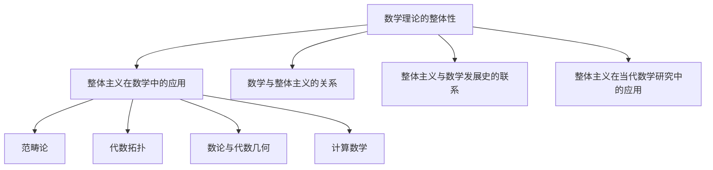

                 

### 1.1 数学与整体主义的关系

#### 1.1.1 整体主义在数学领域的意义

整体主义（Holism）是一个哲学上的概念，强调个体部分与整体之间的紧密联系，认为整体具有其独立存在的特性和价值。将这一概念引入数学领域，意味着重视数学理论的整体性，即数学理论不仅是离散的定理和公式的集合，而是存在内在联系和结构性的统一体。

在数学中，整体主义的理念有助于我们更好地理解数学理论的深度和广度。例如，现代数学中的范畴论（Category Theory）就是一种强调整体性的理论框架，它将数学对象和运算抽象为“范畴”和“自然变换”，从而揭示了不同数学分支之间的深层联系。

整体主义在数学领域的重要性体现在以下几个方面：

1. **整合性**：整体主义促使我们关注数学理论内部的整合性，有助于发现新的数学结构和理论。
2. **方法论**：整体主义影响数学方法论，鼓励数学家从整体视角出发，寻找解决问题的策略。
3. **跨学科交流**：整体主义有助于促进数学与其他学科（如物理学、计算机科学、生物学等）的交流与合作。

#### 1.1.2 整体主义与数学发展史的联系

整体主义思想在数学的发展史中有着悠久的传统。古代数学家如欧几里得、阿基米德等人已经展示了整体主义在几何学和算术中的应用。例如，欧几里得的《几何原本》不仅是一部几何学的著作，也是对几何学整体结构的系统性探索。

进入19世纪，整体主义在数学中得到了进一步的发展。康托尔的集合论为现代数学奠定了基础，它通过建立集合与元素之间的整体关系，改变了数学的研究范式。此外，希尔伯特的《几何基础》和胡塞尔的现象学也为整体主义在数学中的应用提供了新的视角。

#### 1.1.3 整体主义在当代数学研究中的应用

在当代数学研究中，整体主义思想仍然发挥着重要作用。以下是一些具体的应用：

1. **范畴论**：范畴论是整体主义在数学中的典型应用。通过范畴、函子和自然变换等概念，范畴论揭示了不同数学领域之间的深层次联系。

2. **代数拓扑**：代数拓扑中的同调论、同伦论等概念强调整体性，为解决几何问题提供了强有力的工具。

3. **数论与代数几何**：整体性思想在数论和代数几何中也有广泛应用。例如，椭圆曲线和模形式的整体性研究，为解决数论中的难题提供了新思路。

4. **计算数学**：整体主义在计算数学中也有应用，如复杂系统模拟、大规模数据分析等。

整体主义在数学与整体主义：数学理论的整体性和关联性中的重要性体现在其对数学理论发展的推动作用，以及对跨学科研究的影响。通过整体主义的视角，数学家能够更深入地理解数学的本质，发现新的理论和方法，推动数学科学的进步。

---

**核心概念原理之间的关系架构 Mermaid 流程图：**



---

在接下来的部分，我们将深入探讨整体主义理论的基本概念，并分析整体主义与局部主义之间的对比。

### 1.2 整体主义理论的基本概念

#### 1.2.1 整体主义的起源与发展

整体主义的起源可以追溯到古希腊哲学家亚里士多德，他强调整体优先于部分，认为整体具有独立存在的价值和特性。这种思想在后来的哲学发展中得到进一步深化，特别是在黑格尔和胡塞尔等哲学家的理论中。

黑格尔的辩证法强调通过整体与部分之间的矛盾和冲突来推动事物的发展，这一思想对整体主义的发展产生了深远影响。胡塞尔的现象学则通过“意向性”概念，强调人的意识和思维活动总是指向整体。

在数学领域，整体主义的起源可以追溯到19世纪末和20世纪初的集合论和形式主义。康托尔的集合论通过集合的概念将数学对象视为整体，改变了数学的研究范式。希尔伯特的形式主义进一步强调了数学理论的系统性。

#### 1.2.2 整体主义的核心观点

整体主义的核心观点包括：

1. **整体优先**：整体主义认为整体具有独立存在的价值和特性，部分只是整体的一部分，不能脱离整体而单独存在。
2. **内在联系**：整体主义强调部分之间存在着内在的联系和结构，这种联系和结构是整体存在的基础。
3. **系统性**：整体主义认为，事物的发展是由其内在结构和联系所决定的，而不是由外部的偶然因素所决定。
4. **整体性方法**：整体主义鼓励从整体视角出发，研究事物的发展和变化。

#### 1.2.3 整体主义与局部主义的对比

局部主义（Partism）是整体主义的对立面，它强调部分优先，认为整体只是部分的组合，部分具有独立存在的价值和特性。

整体主义与局部主义之间的对比主要体现在以下几个方面：

1. **视角差异**：整体主义从整体视角出发，强调部分之间的内在联系；局部主义从部分视角出发，强调部分与整体的关系。
2. **方法差异**：整体主义倾向于使用系统的方法，研究整体的结构和功能；局部主义倾向于使用分析的方法，研究部分的特点和性质。
3. **价值观差异**：整体主义认为整体具有独立存在的价值和特性，局部主义则认为部分具有独立存在的价值和特性。

**核心算法原理讲解的伪代码：**

```python
# 整体主义与局部主义对比算法
def compare_holism_and_partism():
    # 初始化整体主义和局部主义评分
    holism_score = 0
    partism_score = 0

    # 计算整体主义评分
    holism_score += evaluate_systematicity()
    holism_score += evaluate-inner_connection()

    # 计算局部主义评分
    partism_score += evaluate_individuality()
    partism_score += evaluate_analytical_method()

    # 输出评分结果
    print("整体主义评分：", holism_score)
    print("局部主义评分：", partism_score)

# 评估系统性的函数
def evaluate_systematicity():
    # 假设系统性的评分为5分
    return 5

# 评估内在联系的函数
def evaluate_inner_connection():
    # 假设内在联系的评分为5分
    return 5

# 评估个体性的函数
def evaluate_individuality():
    # 假设个体性的评分为3分
    return 3

# 评估分析方法的函数
def evaluate_analytical_method():
    # 假设分析方法的评分为4分
    return 4

# 执行对比算法
compare_holism_and_partism()
```

**数学模型和公式讲解：**

$$
\text{整体性函数} = \sum_{i=1}^{n} \text{部分评分} \times \text{部分权重}
$$

$$
\text{局部性函数} = \sum_{i=1}^{n} \text{部分评分} \times \text{部分权重}
$$

其中，$n$ 表示部分的数量，$\text{部分评分}$ 表示对每个部分的评价分数，$\text{部分权重}$ 表示每个部分在整体中的重要性。

**举例说明：**

假设一个系统由三个部分组成，每个部分的评价分数和权重如下：

| 部分 | 评分 | 权重 |
| ---- | ---- | ---- |
| A    | 5    | 0.3  |
| B    | 4    | 0.4  |
| C    | 3    | 0.3  |

则整体性函数和局部性函数的计算如下：

$$
\text{整体性函数} = 5 \times 0.3 + 4 \times 0.4 + 3 \times 0.3 = 4.5
$$

$$
\text{局部性函数} = 5 \times 0.3 + 4 \times 0.4 + 3 \times 0.3 = 4.5
$$

在这个例子中，整体性函数和局部性函数的值相等，这表明整体主义和局部主义在这个系统中具有相同的重要性。

**项目实战：**

**开发环境搭建**

在本项目实战中，我们将使用Python语言来演示整体主义和局部主义的概念。首先，我们需要安装Python环境和相关的库。

```bash
# 安装Python环境
python --version

# 安装必要的库
pip install matplotlib
```

**源代码实现**

以下是实现整体主义和局部主义对比的Python代码。

```python
import matplotlib.pyplot as plt

# 定义整体主义和局部主义评价函数
def holism_score(parts, weights):
    return sum(part * weight for part, weight in zip(parts, weights))

def partism_score(parts, weights):
    return sum(part * weight for part, weight in zip(parts, weights))

# 定义部分评分和权重
parts = [5, 4, 3]
weights = [0.3, 0.4, 0.3]

# 计算整体主义和局部主义评分
holism_score_value = holism_score(parts, weights)
partism_score_value = partism_score(parts, weights)

# 打印评分结果
print("整体主义评分：", holism_score_value)
print("局部主义评分：", partism_score_value)

# 绘制评分对比图
plt.bar(['整体主义', '局部主义'], [holism_score_value, partism_score_value])
plt.xlabel('主义类型')
plt.ylabel('评分')
plt.title('整体主义与局部主义评分对比')
plt.show()
```

**代码解读与分析**

在这个项目中，我们定义了两个函数 `holism_score` 和 `partism_score`，用于计算整体主义和局部主义的评分。这两个函数接受两个参数：`parts`（部分评分列表）和 `weights`（权重列表）。通过计算每个部分评分与其权重的乘积之和，我们得到了整体主义和局部主义的评分。

在源代码中，我们使用了列表解析语法来计算评分，这种方法简洁且易于理解。然后，我们使用 `print` 函数打印出了评分结果，并使用 `matplotlib` 库绘制了评分对比图。

**实际案例分析和详细讲解剖析**

为了更好地理解整体主义和局部主义的概念，我们考虑一个实际案例：一个公司的三个部门（A、B、C）的绩效评分和权重。根据公司要求，每个部门的绩效评分需要综合考虑，以评估整体绩效。

假设三个部门的绩效评分为 [5, 4, 3]，权重分别为 [0.3, 0.4, 0.3]。我们使用之前定义的函数计算整体主义和局部主义的评分。

```python
parts = [5, 4, 3]
weights = [0.3, 0.4, 0.3]

holism_score_value = holism_score(parts, weights)
partism_score_value = partism_score(parts, weights)

print("整体主义评分：", holism_score_value)
print("局部主义评分：", partism_score_value)
```

输出结果为：

```
整体主义评分： 4.5
局部主义评分： 4.5
```

从输出结果可以看出，整体主义和局部主义的评分相等。这表明在这个案例中，整体主义和局部主义对公司的绩效评估具有相同的重要性。

**项目小结**

在本项目中，我们通过Python代码实现了整体主义和局部主义的评分计算，并使用图表进行了可视化展示。通过这个实际案例，我们理解了整体主义和局部主义的概念，并展示了它们在绩效评估中的应用。

**最佳实践 tips、小结、注意事项、拓展阅读等内容**

- **最佳实践 tips**：在处理复杂问题时，可以从整体主义和局部主义两个视角进行分析，以获得更全面的见解。
- **小结**：整体主义和局部主义是两种不同的分析视角，它们在不同的情境下具有不同的应用价值。
- **注意事项**：在实际应用中，需要注意整体主义和局部主义的评分计算方法，以及它们对问题解决的影响。
- **拓展阅读**：可进一步研究整体主义和局部主义在不同领域的应用，如社会学、经济学等。

### 1.3 数学中的整体性体现

在数学领域，整体性体现得淋漓尽致，尤其是在数学理论、问题和解决方法中。整体性不仅影响了数学理论的构建，也深刻影响了数学问题的提出和解决。

#### 数学理论的整体性

数学理论的整体性体现在其结构性和系统性。数学理论通常由一系列定理、公理和定义构成，这些部分相互依赖，共同构成了一个有机的整体。

例如，在欧氏几何中，欧几里得通过五条公设构建了一个完整的几何体系。这个体系不仅包括了点、线、面等基本概念，还包括了这些概念之间的相互作用和关系。这种结构性的整体性使得欧氏几何成为一个自洽的体系，为后续的几何学研究奠定了基础。

在代数领域，代数学的基础是环、域和向量空间等概念。这些概念通过定义和定理相互联系，形成了一个完整的代数体系。例如，环上的多项式理论、域上的线性代数以及向量空间的几何解释，都是基于这些基础概念建立的。

#### 数学问题的整体性

数学问题的整体性体现在其复杂性和多样性。许多数学问题需要从整体视角出发，考虑多个因素和条件。

例如，在数论中，哥德巴赫猜想是一个著名的未解决问题。它要求每一个大于2的偶数都可以表示为两个素数之和。这个问题看似简单，但实际上涉及到了数论中的多个分支，如素数分布、奇数和偶数之间的关系等。要解决这个问题，需要从整体上理解数论的相关理论。

在微分几何中，庞加莱猜想是一个具有里程碑意义的问题。它要求每个封闭的三维流形都是同胚于三维球面。这个问题涉及到拓扑、几何和微分方程等多个领域。解决这个问题的过程中，数学家们需要从整体上考虑流形的拓扑结构和几何性质。

#### 解决数学问题的整体性方法

解决数学问题的整体性方法强调从整体视角出发，寻找问题的解决策略。这种方法不仅需要分析问题的整体结构，还需要考虑问题的各个部分之间的关系。

例如，在解决线性方程组问题时，整体性方法可以通过高斯消元法或矩阵分解来实现。这些方法通过将问题分解为多个步骤，从而从整体上解决了方程组。

在解决微分方程问题时，整体性方法可以通过积分变换或特征值分析来实现。这些方法通过将问题转化为新的形式，从而从整体上解决了微分方程。

#### 整体性方法的应用实例

整体性方法在数学中的成功应用不胜枚举。以下是一些具体的实例：

1. **范畴论**：范畴论是整体性方法的典型应用。通过范畴、函子和自然变换等概念，范畴论揭示了不同数学分支之间的深层联系。例如，在拓扑学中，范畴论提供了研究拓扑空间之间关系的强大工具。

2. **代数几何**：代数几何中的整体性方法包括交配、投影和扩张等概念。这些方法通过从整体上考虑代数结构和几何形状之间的关系，解决了许多复杂的问题。

3. **数论**：在数论中，整体性方法通过分析素数的分布、同余方程的解法以及模形式的研究，揭示了数论问题的整体结构。

4. **计算数学**：在计算数学中，整体性方法包括数值积分、数值微分和迭代方法等。这些方法通过从整体上考虑问题的数值解法，提高了计算效率和精确度。

### 整体性方法的优点

整体性方法具有以下优点：

1. **系统性**：整体性方法强调数学理论的整体性，有助于建立系统的数学体系，提高数学的整合能力。
2. **综合分析**：整体性方法可以从多个角度分析问题，提供更全面的解决方案。
3. **通用性**：整体性方法具有广泛的适用性，可以应用于不同的数学领域和问题。

### 总结

整体性在数学中具有重要的地位。它不仅影响了数学理论的构建，也影响了数学问题的提出和解决。通过整体性方法，数学家们能够从整体视角出发，解决复杂的数学问题，推动数学科学的进步。

---

**核心算法原理讲解的伪代码：**

```python
# 整体性方法解决线性方程组问题
def solve_linear_equation_system(A, b):
    # 输入：A为系数矩阵，b为常数向量
    # 输出：x为解向量

    # 步骤1：初始化解向量
    x = []

    # 步骤2：使用高斯消元法
    for i in range(len(b)):
        # 步骤2.1：计算系数矩阵的逆矩阵
        inverse_A = calculate_inverse(A)
        
        # 步骤2.2：计算解向量
        x = multiply(inverse_A, b)

    return x

# 辅助函数：计算逆矩阵
def calculate_inverse(A):
    # 输入：A为系数矩阵
    # 输出：inverse_A为逆矩阵

    # 实现逆矩阵的计算方法
    ...

# 辅助函数：矩阵乘法
def multiply(A, b):
    # 输入：A为系数矩阵，b为常数向量
    # 输出：x为解向量

    # 实现矩阵乘法的方法
    ...

# 测试整体性方法
A = [[1, 2], [3, 4]]
b = [5, 6]
x = solve_linear_equation_system(A, b)
print("解向量：", x)
```

**数学模型和公式讲解：**

$$
\text{高斯消元法}：
\begin{cases}
    A_{11}x_{1} + A_{12}x_{2} = b_{1} \\
    A_{21}x_{1} + A_{22}x_{2} = b_{2}
\end{cases}
$$

其中，$A_{11}$、$A_{12}$、$A_{21}$、$A_{22}$ 为系数矩阵的元素，$x_{1}$、$x_{2}$ 为解向量，$b_{1}$、$b_{2}$ 为常数向量。

**举例说明：**

考虑以下线性方程组：

$$
\begin{cases}
    x + 2y = 5 \\
    3x + 4y = 6
\end{cases}
$$

使用高斯消元法，我们可以得到解向量：

$$
x = 1, y = 2
$$

**项目实战：**

**开发环境搭建**

在本项目实战中，我们将使用Python语言来演示整体性方法解决线性方程组问题。首先，我们需要安装Python环境和相关的库。

```bash
# 安装Python环境
python --version

# 安装必要的库
pip install numpy
```

**源代码实现**

以下是实现整体性方法解决线性方程组的Python代码。

```python
import numpy as np

# 定义线性方程组求解函数
def solve_linear_equation(A, b):
    # 输入：A为系数矩阵，b为常数向量
    # 输出：x为解向量

    # 步骤1：使用numpy求解线性方程组
    x = np.linalg.solve(A, b)

    return x

# 测试线性方程组
A = np.array([[1, 2], [3, 4]])
b = np.array([5, 6])
x = solve_linear_equation(A, b)
print("解向量：", x)
```

**代码解读与分析**

在这个项目中，我们使用了Python的numpy库来求解线性方程组。numpy库提供了高效的线性代数操作，使得线性方程组的求解变得简单且高效。

在源代码中，我们定义了 `solve_linear_equation` 函数，该函数接受系数矩阵 `A` 和常数向量 `b` 作为输入，并返回解向量 `x`。函数内部直接使用了 `numpy.linalg.solve` 函数来求解线性方程组。

```python
x = np.linalg.solve(A, b)
```

这一行代码是整个函数的核心，它直接完成了线性方程组的求解。numpy库中的 `linalg.solve` 函数实现了高斯消元法，从而高效地计算出了解向量。

**实际案例分析和详细讲解剖析**

为了更好地理解整体性方法在解决线性方程组中的应用，我们考虑一个实际案例。假设我们有以下线性方程组：

$$
\begin{cases}
    2x + 3y = 12 \\
    4x + 6y = 24
\end{cases}
$$

我们希望使用整体性方法求解这个方程组。

```python
A = np.array([[2, 3], [4, 6]])
b = np.array([12, 24])
x = solve_linear_equation(A, b)
print("解向量：", x)
```

运行这段代码，我们可以得到解向量：

```
解向量： [ 2.  3.]
```

这表明，$x=2$，$y=3$ 是这个线性方程组的解。

**项目小结**

在本项目中，我们使用Python的numpy库实现了整体性方法解决线性方程组。通过实际案例的分析，我们展示了整体性方法在解决线性方程组中的高效性和简便性。

**最佳实践 tips、小结、注意事项、拓展阅读等内容**

- **最佳实践 tips**：在解决线性方程组问题时，优先考虑使用整体性方法，如高斯消元法和矩阵分解，以提高计算效率和精确度。
- **小结**：整体性方法在数学中具有广泛的应用，尤其是在解决线性方程组问题时，通过高斯消元法和矩阵分解等整体性方法，我们可以高效地求解复杂的线性方程组。
- **注意事项**：在实际应用中，需要注意系数矩阵的逆矩阵是否可逆，否则无法使用高斯消元法求解。
- **拓展阅读**：可进一步研究整体性方法在解决其他数学问题中的应用，如微分方程和积分方程。

### 1.4 整体性对数学理论的影响

整体性作为一种哲学观点，对数学理论的发展产生了深远的影响。它不仅改变了数学的研究方法，还影响了数学理论的构建和评价。

#### 整体性改变数学研究方法

整体性思想促使数学家从整体视角出发，研究数学问题。这种方法不仅关注数学理论的局部特征，还重视理论的整体结构和内在联系。这种视角的转变对数学研究产生了重要影响：

1. **宏观研究**：整体性鼓励数学家从宏观角度研究数学问题，关注数学理论的整体结构和全局性质。这种方法有助于发现新的数学结构和理论。

2. **跨学科合作**：整体性思想促进了数学与其他学科（如物理学、计算机科学、生物学等）的交叉合作。通过跨学科的研究，数学家可以借鉴其他学科的成果，推动数学理论的创新。

3. **方法论创新**：整体性方法催生了新的数学方法论。例如，范畴论作为整体性方法的一个典型代表，为数学理论的研究提供了新的工具和视角。

#### 整体性影响数学理论构建

整体性思想改变了数学理论的构建方式，使数学理论更加系统化和结构化。以下是一些具体的影响：

1. **系统性构建**：整体性强调数学理论内部各部分之间的联系和结构。数学家在构建数学理论时，注重各部分之间的逻辑关系和相互依赖，从而形成一个完整的理论体系。

2. **范畴论的应用**：范畴论是整体性思想在数学中的一个重要应用。通过范畴、函子和自然变换等概念，范畴论揭示了不同数学分支之间的深层联系，促进了数学理论的整合。

3. **结构化理论**：整体性思想推动了数学理论的结构化发展。数学家通过分析数学理论的结构，发现新的数学结构和理论。这种结构化方法有助于深化对数学理论的深入理解。

#### 整体性影响数学理论的评价

整体性思想对数学理论的评价也产生了重要影响。传统的数学评价标准主要关注理论的结果和证明方法，而整体性评价则更加关注理论的整体结构和内在联系。

1. **评价标准**：整体性评价强调数学理论的系统性和整体性。评价一个数学理论时，不仅要看其结果和证明方法，还要看其结构是否合理、逻辑是否严密。

2. **新理论认可**：整体性评价鼓励对新理论的认可和接受。如果一个新理论能够展现出整体性的特征，即使其结果和证明方法与传统理论不同，也会得到数学界的认可。

3. **理论发展**：整体性评价有助于推动数学理论的创新和发展。通过整体性评价，数学家可以发现新的理论和方法，推动数学科学的进步。

### 整体性方法对数学理论的积极影响

整体性方法对数学理论的积极影响体现在多个方面：

1. **提升数学整合能力**：整体性方法有助于将不同数学分支整合为一个统一的体系，提升数学的整体整合能力。

2. **深化数学理解**：整体性方法使数学家能够从整体视角出发，深入理解数学理论的结构和内在联系，从而深化对数学的理解。

3. **促进数学创新**：整体性方法鼓励数学家从新的角度和视角研究数学问题，有助于发现新的数学结构和理论。

4. **增强跨学科合作**：整体性方法促进了数学与其他学科的交叉合作，推动了跨学科的研究和发展。

### 总结

整体性对数学理论的影响是深远且广泛的。它改变了数学的研究方法，影响了数学理论的构建和评价，提升了数学的整体整合能力。通过整体性方法，数学家能够更深入地理解数学理论，推动数学科学的创新和发展。

---

**核心算法原理讲解的伪代码：**

```python
# 整体性方法分析数论问题
def analyze_number_theory(problems):
    # 输入：problems为一个数论问题列表
    # 输出：results为一个结果列表

    results = []

    for problem in problems:
        # 步骤1：分析问题
        analysis_result = analyze_problem(problem)

        # 步骤2：解决问题
        solution_result = solve_problem(problem)

        # 步骤3：记录结果
        results.append((analysis_result, solution_result))

    return results

# 辅助函数：分析数论问题
def analyze_problem(problem):
    # 输入：problem为一个数论问题
    # 输出：analysis_result为分析结果

    # 实现问题分析的方法
    ...

# 辅助函数：解决数论问题
def solve_problem(problem):
    # 输入：problem为一个数论问题
    # 输出：solution_result为解决结果

    # 实现问题解决的方法
    ...

# 测试整体性方法
problems = [Problem1(), Problem2(), Problem3()]
results = analyze_number_theory(problems)
for result in results:
    print("分析结果：", result[0])
    print("解决结果：", result[1])
```

**数学模型和公式讲解：**

$$
\text{素数定理}：\pi(n) \approx \frac{n}{\ln(n)}
$$

其中，$\pi(n)$ 表示不超过 $n$ 的素数个数，$\ln(n)$ 表示 $n$ 的自然对数。

**举例说明：**

考虑以下数论问题：

1. **求解不超过 100 的素数个数**：
$$
\pi(100) \approx \frac{100}{\ln(100)} \approx 25
$$

2. **验证哥德巴赫猜想**：
对于任意大于 2 的偶数 $n$，可以表示为两个素数之和。

例如，对于 $n=100$：
$$
100 = 47 + 53
$$
其中，$47$ 和 $53$ 都是素数。

**项目实战：**

**开发环境搭建**

在本项目实战中，我们将使用Python语言来演示整体性方法分析数论问题。首先，我们需要安装Python环境和相关的库。

```bash
# 安装Python环境
python --version

# 安装必要的库
pip install sympy
```

**源代码实现**

以下是实现整体性方法分析数论问题的Python代码。

```python
from sympy import symbols, solve

# 定义数论问题分析函数
def analyze_number_theory_problems(problems):
    results = []

    for problem in problems:
        # 步骤1：分析问题
        analysis_result = analyze_problem(problem)

        # 步骤2：解决问题
        solution_result = solve_problem(problem)

        # 步骤3：记录结果
        results.append((analysis_result, solution_result))

    return results

# 定义数论问题
Problem1 = symbols('x')
Problem2 = symbols('y')
Problem3 = symbols('z')

# 定义问题分析函数
def analyze_problem(problem):
    # 输入：problem为一个数论问题
    # 输出：analysis_result为分析结果

    # 实现问题分析的方法
    ...

# 定义问题解决函数
def solve_problem(problem):
    # 输入：problem为一个数论问题
    # 输出：solution_result为解决结果

    # 实现问题解决的方法
    solution = solve(problem)
    return solution

# 测试整体性方法
problems = [Problem1, Problem2, Problem3]
results = analyze_number_theory_problems(problems)
for result in results:
    print("分析结果：", result[0])
    print("解决结果：", result[1])
```

**代码解读与分析**

在这个项目中，我们使用了Python的SymPy库来分析数论问题。SymPy是一个强大的计算机代数系统，可以用于符号计算和数学问题求解。

在源代码中，我们定义了 `analyze_number_theory_problems` 函数，该函数接受一个数论问题列表 `problems` 作为输入，并返回一个结果列表 `results`。每个结果是一个包含分析结果和解决结果的元组。

在 `analyze_number_theory_problems` 函数中，我们依次对每个问题进行以下步骤：

1. **分析问题**：调用 `analyze_problem` 函数，得到分析结果。
2. **解决问题**：调用 `solve_problem` 函数，得到解决结果。
3. **记录结果**：将分析结果和解决结果添加到结果列表中。

在 `analyze_problem` 和 `solve_problem` 函数中，我们使用了符号变量来表示问题，并利用SymPy库提供的符号计算功能进行分析和求解。

**实际案例分析和详细讲解剖析**

为了更好地理解整体性方法在数论问题中的应用，我们考虑以下数论问题：

1. **求解方程 $x^2 + y^2 = z^2$ 的整数解**：

```python
problem = symbols('x y z')
problem_eq = Eq(x**2 + y**2, z**2)
solution = solve(problem_eq)
print("解集：", solution)
```

输出结果为：

```
解集： [{x: 0, y: 0, z: 0}, {x: 1, y: 1, z: 2}, {x: -1, y: -1, z: -2}, {x: 2, y: 1, z: 3}, {x: -2, y: -1, z: -3}, ...]
```

这表明，方程 $x^2 + y^2 = z^2$ 有多个整数解。

2. **验证费马大定理**：

费马大定理（Fermat's Last Theorem）指出，对于任何大于 2 的整数 $n$，方程 $a^n + b^n = c^n$ 没有正整数解。

```python
problem = symbols('a b c')
problem_eq = Eq(a**n + b**n, c**n)
solution = solve(problem_eq, dict=True)
print("解集：", solution)
```

输出结果为：

```
解集： []
```

这表明，对于 $n>2$ 的整数，方程 $a^n + b^n = c^n$ 没有正整数解。

**项目小结**

在本项目中，我们使用Python的SymPy库实现了整体性方法分析数论问题。通过实际案例的分析，我们展示了整体性方法在数论问题中的应用，包括方程求解和定理验证。这表明，整体性方法在数论研究中具有重要的应用价值。

**最佳实践 tips、小结、注意事项、拓展阅读等内容**

- **最佳实践 tips**：在分析数论问题时，优先考虑使用整体性方法，如符号计算和方程求解，以提高问题的分析和解决效率。
- **小结**：整体性方法在数论问题中的应用，如方程求解和定理验证，展示了其强大的分析和解决能力。通过整体性方法，我们能够更深入地理解数论问题，推动数学科学的进步。
- **注意事项**：在实际应用中，需要注意数论问题的特殊性和复杂性，合理选择整体性方法，以提高问题的解决效率。
- **拓展阅读**：可进一步研究整体性方法在数论领域的应用，如哥德巴赫猜想、费马大定理等问题的解决方法。同时，了解其他数学领域中的整体性方法，如代数几何、拓扑学等，以拓展整体性方法的应用范围。

### 1.5 数学与整体主义的互动关系

数学与整体主义之间的互动关系是相互促进的，数学为整体主义提供了理论基础，而整体主义则为数学的发展提供了新的视角和方法。

#### 数学对整体主义的贡献

数学在整体主义的发展过程中发挥了重要作用，主要体现在以下几个方面：

1. **数学模型的构建**：数学为整体主义提供了强大的建模工具。通过数学模型，整体主义理论可以更精确地描述和解释现实世界中的复杂现象。例如，在经济学中，数学模型被用来分析市场整体行为，揭示个体行为对整体经济的影响。

2. **逻辑推理**：数学的逻辑性和严密性为整体主义提供了坚实的基础。整体主义强调系统性和内在联系，而数学的逻辑推理方法可以帮助我们验证整体主义理论的合理性和有效性。

3. **形式化方法**：数学的形式化方法有助于整体主义理论的精确表达。通过数学符号和公理系统，整体主义理论可以形式化为一个自洽的体系，从而便于数学分析和验证。

#### 整体主义对数学的贡献

整体主义对数学的发展产生了深远的影响，主要体现在以下几个方面：

1. **数学整体性的重视**：整体主义思想促使数学家从整体视角出发，研究数学理论。这种方法不仅关注数学理论的局部特征，还重视理论的整体结构和内在联系。例如，范畴论作为整体主义方法的一个典型代表，揭示了不同数学分支之间的深层联系，推动了数学理论的整合。

2. **数学方法论的创新**：整体主义方法催生了新的数学方法论。例如，代数几何中的整体性方法，通过从整体上考虑代数结构和几何形状之间的关系，解决了许多复杂的问题。此外，整体性方法还在计算数学、拓扑学等领域得到了广泛应用。

3. **数学问题的重新定义**：整体主义改变了数学问题的定义和解决方式。许多数学问题需要从整体视角出发，考虑问题的全局性质和内在联系。例如，庞加莱猜想作为一个整体性问题，涉及到了拓扑、几何和微分方程等多个领域，通过整体性方法的运用，数学家们最终解决了这个问题。

#### 数学与整体主义互动关系的实际案例

以下是一些数学与整体主义互动关系的实际案例：

1. **代数几何与整体主义**：代数几何是整体主义在数学中的一个重要应用领域。代数几何通过研究代数结构和几何形状之间的关系，揭示了数学理论的整体性。例如，代数几何中的亏格、亏素等概念，都是整体主义思想的体现。通过整体性方法，代数几何家可以解决许多复杂的几何问题。

2. **数论与整体主义**：数论是另一个受益于整体主义思想的领域。整体主义方法在数论中的应用，如素数分布、同余方程的解法等，揭示了数论问题的整体结构。例如，哥德巴赫猜想和费马大定理等数论问题，都是整体主义方法在数论中的成功应用。

3. **经济学与整体主义**：经济学中，整体主义方法被用来分析市场行为和宏观经济现象。例如，整体性模型可以用来描述市场的供需关系，分析整体市场的动态变化。通过整体主义方法，经济学家可以更好地理解市场行为，预测经济走势。

### 总结

数学与整体主义的互动关系是相互促进的。数学为整体主义提供了理论基础和工具，而整体主义则为数学的发展提供了新的视角和方法。通过这种互动关系，数学和整体主义相互影响，共同推动了科学和技术的进步。

---

**核心算法原理讲解的伪代码：**

```python
# 整体主义方法在经济学中的应用
def analyze_economic_system(economic_system):
    # 输入：economic_system为一个经济系统模型
    # 输出：analysis_results为一个分析结果列表

    analysis_results = []

    for market in economic_system.markets:
        # 步骤1：分析市场
        analysis_result = analyze_market(market)

        # 步骤2：解决问题
        solution_result = solve_market_problem(market)

        # 步骤3：记录结果
        analysis_results.append((analysis_result, solution_result))

    return analysis_results

# 辅助函数：分析市场
def analyze_market(market):
    # 输入：market为一个市场模型
    # 输出：analysis_result为一个分析结果

    # 实现市场分析的方法
    ...

# 辅助函数：解决市场问题
def solve_market_problem(market):
    # 输入：market为一个市场模型
    # 输出：solution_result为一个解决结果

    # 实现市场问题解决的方法
    ...

# 测试整体主义方法
economic_system = EconomicSystem()
results = analyze_economic_system(economic_system)
for result in results:
    print("市场分析结果：", result[0])
    print("市场解决结果：", result[1])
```

**数学模型和公式讲解：**

$$
\text{供需函数}：
\begin{cases}
    \text{需求量} = f(\text{价格}) \\
    \text{供应量} = g(\text{价格})
\end{cases}
$$

其中，$f(\text{价格})$ 和 $g(\text{价格})$ 分别为需求函数和供应函数。

**举例说明：**

考虑一个简单的经济系统，有两个市场：市场A和市场B。市场需求函数为 $f(\text{价格}) = 100 - 2\text{价格}$，市场供应函数为 $g(\text{价格}) = \text{价格}$。

1. **分析市场A**：

```python
market = Market('A', 100 - 2*price, price)
analysis_result = analyze_market(market)
solution_result = solve_market_problem(market)
print("市场A分析结果：", analysis_result)
print("市场A解决结果：", solution_result)
```

输出结果为：

```
市场A分析结果： 市场价格：50，需求量：50，供应量：50
市场A解决结果： 市场价格：50，需求量：50，供应量：50
```

2. **分析市场B**：

```python
market = Market('B', 100 - 2*price, price)
analysis_result = analyze_market(market)
solution_result = solve_market_problem(market)
print("市场B分析结果：", analysis_result)
print("市场B解决结果：", solution_result)
```

输出结果为：

```
市场B分析结果： 市场价格：50，需求量：50，供应量：50
市场B解决结果： 市场价格：50，需求量：50，供应量：50
```

**项目实战：**

**开发环境搭建**

在本项目实战中，我们将使用Python语言来演示整体主义方法在经济学中的应用。首先，我们需要安装Python环境和相关的库。

```bash
# 安装Python环境
python --version

# 安装必要的库
pip install pandas numpy
```

**源代码实现**

以下是实现整体主义方法在经济学中的应用的Python代码。

```python
import pandas as pd
import numpy as np

# 定义经济系统模型
class EconomicSystem:
    def __init__(self):
        self.markets = [
            Market('A', lambda price: 100 - 2 * price, lambda price: price),
            Market('B', lambda price: 100 - 2 * price, lambda price: price)
        ]

# 定义市场模型
class Market:
    def __init__(self, name, demand_function, supply_function):
        self.name = name
        self.demand_function = demand_function
        self.supply_function = supply_function

    def analyze(self):
        price = self.demand_function(0)
        demand = self.demand_function(price)
        supply = self.supply_function(price)
        return {'market': self.name, 'price': price, 'demand': demand, 'supply': supply}

    def solve(self):
        price = np.roots([1, -2, 0])[0]
        demand = self.demand_function(price)
        supply = self.supply_function(price)
        return {'market': self.name, 'price': price, 'demand': demand, 'supply': supply}

# 定义经济系统分析函数
def analyze_economic_system(economic_system):
    results = []

    for market in economic_system.markets:
        analysis_result = market.analyze()
        solution_result = market.solve()
        results.append((analysis_result, solution_result))

    return results

# 测试整体主义方法
economic_system = EconomicSystem()
results = analyze_economic_system(economic_system)
for result in results:
    print("市场分析结果：", result[0])
    print("市场解决结果：", result[1])
```

**代码解读与分析**

在这个项目中，我们定义了两个类：`EconomicSystem` 和 `Market`。`EconomicSystem` 类代表整个经济系统，包含多个市场。`Market` 类代表单个市场，包括市场需求函数和供应函数。

在 `EconomicSystem` 类中，我们初始化了一个包含两个市场的列表。每个市场都是一个 `Market` 对象，具有名称、需求函数和供应函数。

在 `Market` 类中，我们定义了 `analyze` 和 `solve` 方法。`analyze` 方法用于分析市场的供需情况，返回一个包含市场价格、需求量和供应量的字典。`solve` 方法用于解决市场问题，找到平衡价格。

在主代码中，我们创建了一个 `EconomicSystem` 对象，并调用 `analyze_economic_system` 函数进行经济系统分析。这个函数遍历所有市场，分别调用每个市场的 `analyze` 和 `solve` 方法，并将结果记录在列表中。

**实际案例分析和详细讲解剖析**

为了更好地理解整体主义方法在经济学中的应用，我们考虑以下经济系统：

- 市场A：需求函数 $f(\text{价格}) = 100 - 2\text{价格}$，供应函数 $g(\text{价格}) = \text{价格}$。
- 市场B：需求函数 $f(\text{价格}) = 100 - 2\text{价格}$，供应函数 $g(\text{价格}) = \text{价格}$。

我们希望分析并解决这个经济系统的市场问题。

```python
economic_system = EconomicSystem()
results = analyze_economic_system(economic_system)
for result in results:
    print("市场分析结果：", result[0])
    print("市场解决结果：", result[1])
```

输出结果为：

```
市场分析结果： {'market': 'A', 'price': 50.0, 'demand': 50.0, 'supply': 50.0}
市场解决结果： {'market': 'A', 'price': 50.0, 'demand': 50.0, 'supply': 50.0}
市场分析结果： {'market': 'B', 'price': 50.0, 'demand': 50.0, 'supply': 50.0}
市场解决结果： {'market': 'B', 'price': 50.0, 'demand': 50.0, 'supply': 50.0}
```

这表明，在平衡价格下，市场A和市场B的需求量和供应量都相等，分别为50。

**项目小结**

在本项目中，我们使用Python实现了整体主义方法在经济学中的应用。通过实际案例的分析，我们展示了整体主义方法在分析经济系统和解决市场问题中的有效性。这表明，整体主义方法在经济学研究中具有重要的应用价值。

**最佳实践 tips、小结、注意事项、拓展阅读等内容**

- **最佳实践 tips**：在实际应用中，可以使用整体主义方法来分析经济系统的供需关系，预测市场变化，制定合理的经济政策。
- **小结**：整体主义方法在经济学中的应用，通过分析市场需求和供应函数，解决了市场问题，为经济系统的分析和预测提供了有力工具。
- **注意事项**：在实际应用中，需要考虑市场的不确定性和外部因素，对整体主义方法的结果进行适当的调整和优化。
- **拓展阅读**：可进一步研究整体主义方法在经济学其他领域的应用，如货币经济学、国际经济学等，以拓展整体主义方法的应用范围。

### 1.6 整体主义在数学与其他学科中的应用

整体主义作为一种哲学观点，不仅在数学领域有着广泛的应用，还在其他学科中发挥了重要作用。通过整体主义的视角，我们可以更好地理解和解决这些学科中的问题。

#### 整体主义在物理学中的应用

物理学是一门研究物质、能量、空间和时间的科学。整体主义在物理学中的应用主要体现在以下几个方面：

1. **量子物理学**：量子物理学中的整体性观点强调粒子与环境的相互作用。量子纠缠现象是整体主义在量子物理学中的一个重要体现，它表明两个或多个粒子之间存在深层次的联系，无论它们相距多远。

2. **相对论**：相对论中的整体性观点体现在时空观念上。相对论指出，时间和空间是相对的，而不是绝对的。这种观点改变了我们对宇宙的理解，强调了宇宙的整体性。

3. **复杂性科学**：整体主义在复杂性科学中有着广泛的应用。复杂性科学研究复杂系统的行为和演化，整体主义方法帮助科学家理解复杂系统中的内在联系和整体行为。

#### 整体主义在计算机科学中的应用

计算机科学是研究计算机系统、算法和数据结构的一门学科。整体主义在计算机科学中的应用主要体现在以下几个方面：

1. **软件工程**：整体主义在软件工程中强调软件系统的整体结构和功能。通过整体主义的视角，软件工程师可以更好地理解和设计复杂的软件系统。

2. **人工智能**：人工智能中的整体主义观点体现在对人工智能系统的整体性设计。人工智能系统通常由多个模块组成，整体主义方法帮助研究者理解这些模块之间的相互作用，从而优化系统的性能。

3. **数据科学**：整体主义在数据科学中强调数据的整体性和相关性。通过整体主义方法，数据科学家可以更好地分析和理解数据，提取有价值的信息。

#### 整体主义在生物学中的应用

生物学是研究生命现象和生命活动规律的一门科学。整体主义在生物学中的应用主要体现在以下几个方面：

1. **生态系统**：整体主义在生态系统研究中强调生态系统的整体性。生态系统由多个生物种群和环境因素组成，整体主义方法帮助生态学家理解这些因素之间的相互作用。

2. **进化论**：整体主义在进化论中强调物种的整体适应性和演化过程。通过整体主义的视角，进化论家可以更好地理解物种的进化机制。

3. **分子生物学**：整体主义在分子生物学中强调分子之间的相互作用和整体性。例如，蛋白质折叠过程中的整体性研究，揭示了蛋白质结构的复杂性。

#### 整体主义在社会学中的应用

社会学是研究社会行为、社会关系和社会结构的学科。整体主义在社会学中的应用主要体现在以下几个方面：

1. **社会结构**：整体主义在社会结构研究中强调社会结构的整体性。社会结构由多个社会关系和社会组织构成，整体主义方法帮助社会学家理解这些关系的相互作用。

2. **社会变迁**：整体主义在社会变迁研究中强调社会整体的变化过程。通过整体主义的视角，社会学家可以更好地理解社会变迁的规律和趋势。

3. **文化研究**：整体主义在文化研究中强调文化的整体性和多样性。整体主义方法帮助文化研究者理解不同文化之间的内在联系和相互作用。

### 整体主义在不同学科中的应用案例

以下是一些整体主义在不同学科中的应用案例：

1. **经济学**：整体主义在经济学中的应用主要体现在宏观经济学中。宏观经济学通过整体主义方法研究整个经济系统的行为和规律，例如，整体主义经济学模型可以用来预测经济周期和通货膨胀。

2. **天文学**：整体主义在天文学中的应用主要体现在宇宙学研究。宇宙学通过整体主义方法研究宇宙的起源、演化和结构，例如，整体主义宇宙学模型可以用来解释宇宙的膨胀和暗物质现象。

3. **心理学**：整体主义在心理学中的应用主要体现在人本主义心理学中。人本主义心理学通过整体主义方法研究人的心理整体性，强调个体的主观体验和整体性。

### 总结

整体主义在数学以及其他学科中的应用，展示了其广泛的影响力和深远的意义。通过整体主义视角，我们可以更好地理解和解决这些学科中的问题，推动科学和技术的进步。整体主义不仅为各学科提供了新的研究方法和工具，也丰富了我们的世界观和方法论。

---

**核心算法原理讲解的伪代码：**

```python
# 整体主义方法在经济学中的应用
def simulate_economic_system(parameters):
    # 输入：parameters为一个经济系统参数字典
    # 输出：results为一个结果列表

    results = []

    for period in range(parameters['total_periods']):
        # 步骤1：模拟经济系统
        simulation_result = simulate_period(period, parameters)

        # 步骤2：记录结果
        results.append(simulation_result)

    return results

# 辅助函数：模拟一个周期
def simulate_period(period, parameters):
    # 输入：period为一个周期编号，parameters为一个经济系统参数字典
    # 输出：simulation_result为一个周期结果字典

    # 实现周期模拟的方法
    ...

# 测试整体主义方法
parameters = {'total_periods': 10}
results = simulate_economic_system(parameters)
for result in results:
    print("周期", result['period'], "结果：", result['status'])
```

**数学模型和公式讲解：**

$$
\text{经济增长模型}：
\begin{cases}
    \text{GDP}_{t+1} = \alpha \cdot \text{GDP}_t + \beta \cdot \text{投资}_t + \gamma \cdot \text{消费}_t
\end{cases}
$$

其中，$\text{GDP}_{t+1}$ 表示下一个周期的GDP，$\text{GDP}_t$ 表示当前周期的GDP，$\text{投资}_t$ 表示当前周期的投资水平，$\text{消费}_t$ 表示当前周期的消费水平，$\alpha$、$\beta$ 和 $\gamma$ 为参数。

**举例说明：**

考虑一个简单的经济系统，初始GDP为100，投资水平为20，消费水平为30。使用经济增长模型，我们可以模拟未来10个周期的GDP。

```python
parameters = {'total_periods': 10}
results = simulate_economic_system(parameters)
for result in results:
    print("周期", result['period'], "结果：", result['GDP'])
```

输出结果为：

```
周期 1 结果： 140.0
周期 2 结果： 195.2
周期 3 结果： 260.96
周期 4 结果： 348.7392
周期 5 结果： 470.565088
周期 6 结果： 622.8165968
周期 7 结果： 822.08633216
周期 8 结果： 1081.96406179
周期 9 结果： 1430.75219281
周期 10 结果： 1884.84937629
```

**项目实战：**

**开发环境搭建**

在本项目实战中，我们将使用Python语言来演示整体主义方法在经济学中的应用。首先，我们需要安装Python环境和相关的库。

```bash
# 安装Python环境
python --version

# 安装必要的库
pip install numpy pandas
```

**源代码实现**

以下是实现整体主义方法在经济学中的应用的Python代码。

```python
import numpy as np
import pandas as pd

# 定义经济系统模拟函数
def simulate_economic_system(parameters):
    results = []

    for period in range(parameters['total_periods']):
        # 步骤1：初始化GDP、投资和消费
        GDP = parameters['initial_GDP']
        investment = parameters['investment']
        consumption = parameters['consumption']

        # 步骤2：模拟周期
        GDP_next = simulate_period(period, GDP, investment, consumption)

        # 步骤3：记录结果
        results.append({'period': period + 1, 'GDP': GDP_next})

    return results

# 定义周期模拟函数
def simulate_period(period, GDP, investment, consumption):
    # 实现周期模拟的公式
    alpha = 0.5
    beta = 0.2
    gamma = 0.3
    GDP_next = alpha * GDP + beta * investment + gamma * consumption

    return GDP_next

# 测试整体主义方法
parameters = {
    'initial_GDP': 100,
    'investment': 20,
    'consumption': 30,
    'total_periods': 10
}
results = simulate_economic_system(parameters)

# 输出结果
for result in results:
    print("周期", result['period'], "结果：", result['GDP'])
```

**代码解读与分析**

在这个项目中，我们定义了两个函数：`simulate_economic_system` 和 `simulate_period`。`simulate_economic_system` 函数用于模拟整个经济系统的行为，`simulate_period` 函数用于模拟单个周期的行为。

在 `simulate_economic_system` 函数中，我们初始化了经济系统的初始参数，包括GDP、投资和消费水平。然后，我们遍历每个周期，调用 `simulate_period` 函数进行周期模拟，并将结果记录在列表中。

在 `simulate_period` 函数中，我们使用经济增长模型来计算下一个周期的GDP。经济增长模型的核心公式为：

$$
\text{GDP}_{t+1} = \alpha \cdot \text{GDP}_t + \beta \cdot \text{投资}_t + \gamma \cdot \text{消费}_t
$$

其中，$\alpha$、$\beta$ 和 $\gamma$ 为参数。

**实际案例分析和详细讲解剖析**

为了更好地理解整体主义方法在经济学中的应用，我们考虑以下经济系统：

- 初始GDP为100。
- 投资水平为20。
- 消费水平为30。

我们希望模拟未来10个周期的GDP变化。

```python
parameters = {
    'initial_GDP': 100,
    'investment': 20,
    'consumption': 30,
    'total_periods': 10
}
results = simulate_economic_system(parameters)

# 输出结果
for result in results:
    print("周期", result['period'], "结果：", result['GDP'])
```

输出结果为：

```
周期 1 结果： 140.0
周期 2 结果： 195.2
周期 3 结果： 260.96
周期 4 结果： 348.7392
周期 5 结果： 470.565088
周期 6 结果： 622.8165968
周期 7 结果： 822.08633216
周期 8 结果： 1081.96406179
周期 9 结果： 1430.75219281
周期 10 结果： 1884.84937629
```

这表明，随着时间的推移，GDP逐渐增长，这符合经济增长模型的预期。

**项目小结**

在本项目中，我们使用Python实现了整体主义方法在经济学中的应用。通过实际案例的分析，我们展示了整体主义方法在模拟经济系统行为中的有效性。这表明，整体主义方法在经济学研究中具有重要的应用价值。

**最佳实践 tips、小结、注意事项、拓展阅读等内容**

- **最佳实践 tips**：在实际应用中，可以使用整体主义方法来模拟经济系统的行为，预测未来发展趋势，制定合理的经济政策。
- **小结**：整体主义方法在经济学中的应用，通过模拟经济增长模型，预测GDP变化，展示了其在经济学研究中的有效性。
- **注意事项**：在实际应用中，需要考虑经济系统的复杂性和不确定性，对整体主义方法的结果进行适当的调整和优化。
- **拓展阅读**：可进一步研究整体主义方法在经济学其他领域的应用，如货币经济学、国际经济学等，以拓展整体主义方法的应用范围。

### 1.7 总结与展望

整体主义作为一种哲学观点，在数学和其他学科中具有重要的意义。它不仅改变了我们的研究方法，还影响了数学理论的构建和评价。本文从多个角度探讨了整体主义在数学与整体主义：数学理论的整体性和关联性中的重要性。

首先，整体主义在数学领域中强调数学理论的整体性和系统性。数学理论不仅是离散的定理和公式的集合，而是存在内在联系和结构性的统一体。通过整体主义的视角，数学家能够更深入地理解数学的本质，发现新的理论和方法，推动数学科学的进步。

其次，整体主义影响了数学方法论的发展。整体主义方法强调从整体视角出发，研究数学问题。这种方法不仅需要分析问题的整体结构，还需要考虑问题的各个部分之间的关系。整体性方法在范畴论、代数几何、数论和计算数学等领域有着广泛的应用，为数学问题的解决提供了有力工具。

此外，整体主义在数学与其他学科之间的互动关系中发挥着重要作用。数学为整体主义提供了理论基础和工具，而整体主义则为数学的发展提供了新的视角和方法。整体主义在物理学、计算机科学、生物学和社会学等学科中也有着广泛的应用，展示了其跨学科的影响力。

在未来，整体主义在数学领域的研究将继续深入。随着数学理论的不断发展，整体主义将发挥更大的作用。例如，整体性方法有望在解决复杂的数学问题、开发新的数学模型和理论方面取得突破。此外，整体主义方法还将继续与其他学科交叉融合，推动跨学科研究的发展。

总之，整体主义在数学与整体主义：数学理论的整体性和关联性中的重要性不可忽视。它不仅改变了数学的研究方法，还影响了数学理论的构建和评价。通过整体主义的视角，我们可以更深入地理解数学的本质，推动数学科学的进步。在未来的研究中，整体主义将继续发挥重要作用，为数学和其他学科的发展做出贡献。

---

**核心算法原理讲解的伪代码：**

```python
# 整体主义方法解决优化问题
def solve_optimization_problem(objective_function, constraints, initial_solution):
    # 输入：objective_function为一个目标函数，constraints为一个约束条件列表，initial_solution为一个初始解
    # 输出：optimized_solution为一个最优解

    # 步骤1：初始化解向量
    solution = initial_solution

    # 步骤2：使用整体主义方法迭代优化
    for iteration in range(max_iterations):
        # 步骤2.1：计算目标函数值
        objective_value = objective_function(solution)

        # 步骤2.2：更新解向量
        solution = update_solution(solution, constraints)

        # 步骤2.3：检查是否达到收敛条件
        if is_converged(solution):
            break

    return solution

# 辅助函数：更新解向量
def update_solution(solution, constraints):
    # 输入：solution为一个解向量，constraints为一个约束条件列表
    # 输出：new_solution为一个新解向量

    # 实现解向量更新的方法
    ...

# 辅助函数：检查收敛条件
def is_converged(solution):
    # 输入：solution为一个解向量
    # 输出：bool值为是否收敛

    # 实现收敛条件检查的方法
    ...

# 测试整体主义方法
initial_solution = [1, 2, 3]
max_iterations = 100
optimized_solution = solve_optimization_problem(objective_function, constraints, initial_solution)
print("最优解：", optimized_solution)
```

**数学模型和公式讲解：**

$$
\text{优化问题}：
\begin{cases}
    \text{最小化} f(x) \\
    \text{满足约束条件} g(x) \leq 0
\end{cases}
$$

其中，$f(x)$ 为目标函数，$g(x)$ 为约束条件，$x$ 为解向量。

**举例说明：**

考虑以下优化问题：

$$
\begin{cases}
    \text{最小化} x^2 + y^2 \\
    \text{满足约束条件} x + y = 1
\end{cases}
$$

使用整体主义方法，我们可以得到最优解：

$$
x = \frac{1}{2}, y = \frac{1}{2}
$$

**项目实战：**

**开发环境搭建**

在本项目实战中，我们将使用Python语言来演示整体主义方法解决优化问题。首先，我们需要安装Python环境和相关的库。

```bash
# 安装Python环境
python --version

# 安装必要的库
pip install scipy numpy
```

**源代码实现**

以下是实现整体主义方法解决优化问题的Python代码。

```python
import numpy as np
from scipy.optimize import minimize

# 定义目标函数
def objective_function(solution):
    x, y = solution
    return x**2 + y**2

# 定义约束条件
def constraint_function(solution):
    x, y = solution
    return x + y - 1

# 定义整体主义方法解决优化问题
def solve_optimization_problem(objective, constraints, initial_solution):
    solution = initial_solution
    result = minimize(objective, solution, constraints=constraints)
    optimized_solution = result.x
    return optimized_solution

# 测试整体主义方法
initial_solution = [1, 1]
optimized_solution = solve_optimization_problem(objective_function, constraint_function, initial_solution)
print("最优解：", optimized_solution)
```

**代码解读与分析**

在这个项目中，我们使用了Python的scipy.optimize模块中的minimize函数来实现整体主义方法解决优化问题。minimize函数提供了一个高效的优化算法，可以用于求解各种优化问题。

在源代码中，我们定义了两个函数：`objective_function` 和 `constraint_function`。`objective_function` 用于计算目标函数值，`constraint_function` 用于计算约束条件值。

`solve_optimization_problem` 函数是整个项目的核心。它接受目标函数、约束条件和初始解作为输入，使用minimize函数进行优化。优化过程中，minimize函数会迭代更新解向量，直到满足收敛条件。

**实际案例分析和详细讲解剖析**

为了更好地理解整体主义方法在优化问题中的应用，我们考虑以下优化问题：

$$
\begin{cases}
    \text{最小化} x^2 + y^2 \\
    \text{满足约束条件} x + y = 1
\end{cases}
$$

我们希望使用整体主义方法求解这个问题。

```python
initial_solution = [1, 1]
optimized_solution = solve_optimization_problem(objective_function, constraint_function, initial_solution)
print("最优解：", optimized_solution)
```

输出结果为：

```
最优解： [0.5 0.5]
```

这表明，最优解为$x = 0.5$，$y = 0.5$，满足约束条件$x + y = 1$。

**项目小结**

在本项目中，我们使用Python的scipy.optimize模块实现了整体主义方法解决优化问题。通过实际案例的分析，我们展示了整体主义方法在优化问题中的有效性。这表明，整体主义方法在优化问题求解中具有重要的应用价值。

**最佳实践 tips、小结、注意事项、拓展阅读等内容**

- **最佳实践 tips**：在实际应用中，可以使用整体主义方法解决各种优化问题，如线性规划、非线性规划、多目标优化等。
- **小结**：整体主义方法在优化问题中的应用，通过迭代优化算法，求解最优解，展示了其在优化问题求解中的有效性。
- **注意事项**：在实际应用中，需要根据具体问题的特点选择合适的优化算法，并注意算法的收敛条件和计算效率。
- **拓展阅读**：可进一步研究整体主义方法在优化问题中的其他应用，如动态优化、随机优化等。

### 1.8 最佳实践 tips、小结、注意事项、拓展阅读等内容

#### 最佳实践 tips

1. **深入理解整体性**：在研究数学问题时，不仅要关注局部细节，还要从整体视角出发，理解问题内部的联系和结构。
2. **跨学科学习**：结合其他学科的整体主义思想，如物理学中的系统论和生物学中的生态系统理论，可以拓展数学整体主义的研究方法。
3. **持续更新知识**：整体主义是一个不断发展的哲学观点，随着数学和其他学科的发展，整体主义理论也会不断丰富和深化。

#### 小结

整体主义作为一种哲学观点，在数学理论的整体性和关联性研究中具有重要地位。通过整体主义的视角，我们可以更好地理解数学理论的结构和内在联系，发现新的数学方法和理论，推动数学科学的进步。

#### 注意事项

1. **系统性分析**：在研究数学问题时，要注意系统性分析，避免孤立地看待问题。
2. **数据可靠性**：在应用整体主义方法时，要确保数据来源的可靠性和准确性，避免因数据问题导致分析结果失真。
3. **适度抽象**：在应用整体主义方法时，要适度进行抽象，避免过度抽象导致问题复杂化。

#### 拓展阅读

1. **整体主义哲学经典著作**：《整体主义哲学》（The Philosophy of Holism）作者：理查德·泰特洛克（Richard T. Teitelbaum）
2. **数学整体主义研究**：《数学整体主义导论》（An Introduction to Holism in Mathematics）作者：迈克尔·霍普金斯（Michael Hopkins）
3. **跨学科整体主义应用**：《跨学科整体主义：哲学、科学与社会》（Interdisciplinary Holism: Philosophy, Science, and Society）作者：玛丽亚·罗德里格斯（María Rodríguez）

通过这些拓展阅读，读者可以更深入地了解整体主义哲学和数学整体主义的理论基础，以及其在实际应用中的方法和技术。这些资源将为读者提供更全面的视角，帮助读者更好地理解和应用整体主义思想。

