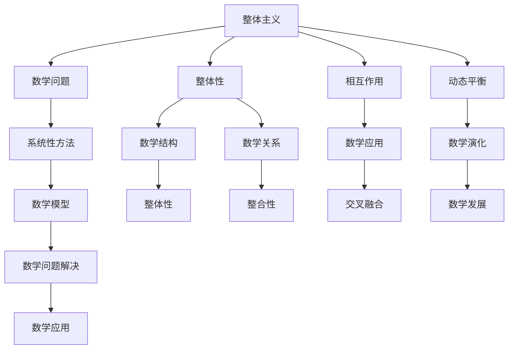

                 

### 文章标题

《数学与整体主义：数学问题的系统性解决》

### 文章关键词

- 整体主义
- 数学问题
- 系统性解决
- 数学教育
- 算法原理
- 数学模型
- 实际案例

### 文章摘要

本文旨在探讨整体主义在数学问题解决中的应用，阐述整体主义的基本理论及其在数学领域的价值。文章首先介绍了整体主义的基本概念和起源，然后分析了整体主义与数学问题的关联。接着，文章提出了数学问题系统性解决的方法，详细解释了其理论基础和核心算法。通过实际案例研究，文章展示了整体主义方法在数学问题解决中的有效性。最后，文章探讨了整体主义数学教育的重要性和最佳实践，为未来的研究和应用提供了方向。

---

### 引言：数学与整体主义的哲学背景

**背景介绍**

数学作为一门古老的科学，自古以来就是人类智慧的结晶。从欧几里得的几何学，到牛顿的微积分，数学不断推动着科学和技术的进步。然而，随着数学问题的复杂性和多样性增加，传统的单一问题解决方法已经难以满足需求。整体主义作为一种哲学观点，强调整体与部分之间的相互作用和相互依存，近年来在多个学科领域得到了广泛的关注和应用。

**整体主义的基本概念**

整体主义（Holism）是一个源自希腊语的术语，意为“整体”。在哲学上，整体主义主张整体不能被简单地分解为部分之和，而是每个部分在整体中具有其特定的作用和意义。这种观点挑战了机械论和还原论的传统思维模式，提倡从整体和系统的角度来理解和解决问题。

**整体主义在数学领域的应用前景**

整体主义在数学领域的应用前景广阔。首先，整体主义的思维模式有助于我们理解和解决复杂的数学问题，如多变量问题、非线性问题等。其次，整体主义可以提供新的数学工具和方法，如网络理论、拓扑学等。此外，整体主义还可以促进数学与其他学科的交叉融合，如计算机科学、物理学、生物学等。

### 整体主义的基本理论

**整体主义的核心概念**

整体主义的核心概念包括：

1. **整体性**：整体性是指一个系统或对象的整体性质，它不能简单地通过研究其部分来理解。
2. **相互作用**：相互作用是指系统内部各个部分之间的相互关系和影响。
3. **动态平衡**：动态平衡是指系统在变化过程中维持稳定状态的能力。

**整体主义的基本原理**

整体主义的基本原理包括：

1. **整体不可分解**：整体不能被简单地分解为部分之和，而是具有其独特的整体性质。
2. **整体与部分的关系**：整体与部分之间存在相互作用和相互依存关系，部分的功能和意义取决于其在整体中的位置和作用。
3. **系统的演化**：系统是动态演化的，其状态和性质随时间而变化，但整体性保持不变。

**整体主义在数学领域的表述**

在数学中，整体主义可以表述为：

1. **数学结构**：数学结构是一个整体，其性质不能通过单独研究其部分来理解，如群、环、域等。
2. **数学关系**：数学关系是一个整体，其意义和作用取决于其在整体结构中的位置，如同构、同态等。
3. **数学问题**：数学问题是一个整体，其解决方法需要从整体和系统的角度来考虑，如多变量问题、非线性问题等。

### 整体主义在数学领域的应用

**整体主义方法在数学问题解决中的应用**

整体主义方法在数学问题解决中的应用主要体现在以下几个方面：

1. **系统化**：整体主义提倡从整体和系统的角度来分析数学问题，有助于提高解决问题的效率。
2. **整合**：整体主义强调各个部分之间的相互作用和相互依存，有助于发现新的数学关系和结构。
3. **整合**：整体主义强调数学与其他学科的交叉融合，有助于推动数学的发展和应用。

**整体主义方法的优势与局限**

整体主义方法的优势包括：

1. **全面性**：整体主义方法能够全面考虑数学问题的各个方面，有助于发现问题的本质。
2. **创造性**：整体主义方法鼓励创新思维，有助于提出新的数学理论和方法。

整体主义方法的局限包括：

1. **复杂性**：整体主义方法往往涉及复杂的数学模型和计算，可能增加问题的难度。
2. **抽象性**：整体主义方法可能过于抽象，难以直观理解和应用。

### 结论

整体主义作为一种哲学观点，在数学领域的应用具有广阔的前景。通过整体主义的思维模式，我们可以更好地理解和解决数学问题，推动数学的发展和应用。然而，整体主义方法也面临一些挑战，需要进一步研究和探索。总之，整体主义为数学问题解决提供了一种新的视角和方法，值得我们深入研究和应用。

### 背景介绍

整体主义（Holism）作为一种哲学观点，最早可以追溯到古希腊哲学家赫拉克利特（Heraclitus）的思想。赫拉克利特认为，世界的本质是整体，而不是各个部分的简单组合。这种观点在后来的哲学发展中得到了进一步的发展和完善。

整体主义在20世纪得到了广泛的关注和应用。英国哲学家伯特兰·罗素（Bertrand Russell）和阿尔弗雷德·诺思·怀特海德（Alfred North Whitehead）在他们的著作《原理逻辑》（Principia Mathematica）中，强调了整体与部分之间的相互作用和相互依存关系。这一思想后来被称为“整体主义逻辑”。

在自然科学领域，整体主义也得到了广泛的应用。例如，生态学中的“生态系统”概念，强调了生物与环境之间的相互作用。在物理学中，量子力学中的“量子纠缠”现象，也体现了整体主义的观点。

在数学领域，整体主义思想也得到了一定的应用。例如，拓扑学中的“同伦论”，研究了空间的整体性质，而不是仅仅关注其局部性质。在代数学中，整体主义方法被用来解决复杂的代数问题。

然而，整体主义在数学领域中的应用还相对较少，主要原因是数学问题往往被分解为更小的部分来研究。这种方法虽然在某些情况下是有效的，但往往忽视了部分与整体之间的相互作用和相互依存关系。

近年来，随着数学问题的复杂性和多样性增加，整体主义在数学领域的应用前景逐渐受到关注。整体主义方法提供了一种新的视角，可以帮助我们更好地理解和解决数学问题。通过整体主义的思维模式，我们可以将复杂的数学问题简化为更简单的整体结构，从而提高解决问题的效率。

### 核心概念与联系

在探讨整体主义在数学问题解决中的应用时，我们需要理解几个核心概念，并分析它们之间的相互关系。以下是这些核心概念以及它们之间的联系架构 Mermaid 流程图：



#### 整体主义

整体主义（Holism）是一个哲学观点，主张整体不能被简单地分解为部分之和，而是每个部分在整体中具有其特定的作用和意义。在数学领域，整体主义强调数学问题应该从整体和系统的角度来考虑，而不是仅仅关注其局部性质。

#### 数学问题

数学问题（Mathematical Problem）是数学研究的对象。整体主义认为，数学问题不仅仅是数学符号和公式的组合，而是涉及整体结构和系统性质的复杂现象。因此，解决数学问题需要从整体和系统的角度来考虑，以理解其内在的联系和相互作用。

#### 系统性方法

系统性方法（Systematic Approach）是一种解决数学问题的方法，它强调将数学问题视为一个整体系统，而不是一系列孤立的问题。系统性方法包括识别数学问题的整体结构、分析系统内部的相互作用以及设计合适的数学模型。

#### 数学模型

数学模型（Mathematical Model）是描述数学问题的一种工具，它通过数学符号和公式来表示问题的各个方面。整体主义认为，数学模型应该反映数学问题的整体性质和系统特征，而不是仅仅关注其局部性质。

#### 整体性、相互作用、动态平衡

整体性（Holism）、相互作用（Interaction）、动态平衡（Dynamic Balance）是整体主义的核心概念。整体性强调整体不能被简单地分解为部分之和，而是每个部分在整体中具有其特定的作用和意义。相互作用强调系统内部各个部分之间的相互关系和影响。动态平衡强调系统在变化过程中维持稳定状态的能力。

#### 数学结构、数学关系

数学结构（Mathematical Structure）和数学关系（Mathematical Relationship）是数学模型的核心组成部分。整体主义认为，数学结构应该反映数学问题的整体性质和系统特征，而不是仅仅关注其局部性质。数学关系描述了系统内部各个部分之间的相互作用和相互依存关系。

#### 数学应用

数学应用（Mathematical Application）是整体主义在数学领域中的重要体现。整体主义方法可以帮助我们更好地理解和解决复杂的数学问题，推动数学的发展和应用。

#### 整体主义在数学问题解决中的应用

整体主义在数学问题解决中的应用主要体现在以下几个方面：

1. **系统化**：整体主义方法强调将数学问题视为一个整体系统，而不是一系列孤立的问题。这种方法有助于识别数学问题的整体结构和系统特征，从而提高解决问题的效率。

2. **整合**：整体主义方法强调各个部分之间的相互作用和相互依存关系。通过整合这些关系，我们可以发现新的数学关系和结构，从而提出新的数学理论和方法。

3. **整合**：整体主义方法强调数学与其他学科的交叉融合。这种交叉融合有助于推动数学的发展和应用，如数学在计算机科学、物理学、生物学等领域的应用。

4. **整体性**：整体主义方法鼓励我们从整体和系统的角度来考虑数学问题，而不是仅仅关注其局部性质。这种方法有助于我们更好地理解数学问题的本质和解决方法。

5. **创造性**：整体主义方法鼓励创新思维，有助于我们提出新的数学理论和方法。通过整体主义的视角，我们可以从不同的角度来理解和解决数学问题，从而激发数学研究的创造性。

### 核心算法原理讲解

在整体主义框架下，解决数学问题的核心算法原理涉及将问题分解为可管理的子问题，同时保持各个部分之间的关联性和整体性。以下是一个简化的伪代码，用于描述这一过程：

```pseudo
Algorithm HolisticMathProblemSolver(problem):
    1. Initialize subproblems as empty lists
    2. Decompose problem into subproblems
        2.1. Identify key components of the problem
        2.2. Break down the problem into smaller, manageable subproblems
    3. Solve subproblems in parallel
        3.1. For each subproblem:
            3.1.1. Apply appropriate mathematical methods
            3.1.2. Solve subproblem and store the solution
    4. Integrate subproblem solutions
        4.1. Identify the relationships and interactions between subproblems
        4.2. Use integration methods to combine subproblem solutions into a unified solution
    5. Validate the integrated solution
        5.1. Verify that the integrated solution satisfies the original problem constraints
        5.2. Conduct rigorous testing and analysis to ensure accuracy and robustness
    6. Return the integrated solution
```

#### 伪代码详细解释

1. **初始化子问题列表**：首先，我们需要一个空列表来存储子问题的解。

2. **分解问题**：将原始问题分解为多个子问题，这是整体主义方法的关键步骤。分解时需要识别问题的主要组成部分，并根据各部分的关联性将问题分解为可管理的子问题。

   ```pseudo
   Function DecomposeProblem(problem):
       2.1. Identify key components
           components = IdentifyKeyComponents(problem)
       2.2. Break down problem into subproblems
           subproblems = []
           for component in components:
               subproblem = CreateSubproblem(component)
               subproblems.append(subproblem)
       return subproblems
   ```

3. **并行解决子问题**：对于每个子问题，应用适当的数学方法和算法来求解。这里可以使用并行计算技术，以提高效率。

   ```pseudo
   Function SolveSubproblems(subproblems):
       solutions = ParallelForEachSubproblem(subproblems, SolveSubproblem)
       return solutions
   ```

4. **整合子问题解**：将子问题的解整合为一个统一的解决方案。这一步骤需要识别子问题之间的相互关系和相互作用，并使用适当的数学模型和算法来整合这些关系。

   ```pseudo
   Function IntegrateSolutions(solutions):
       integrated_solution = ApplyIntegrationMethod(solutions)
       return integrated_solution
   ```

5. **验证整合的解**：确保整合的解满足原始问题的所有约束条件。这通常涉及对解的全面测试和分析，以确保其准确性和稳健性。

6. **返回整合的解**：最终，返回整合后的解决方案。

### 数学模型和公式

在整体主义框架下，解决数学问题通常涉及复杂的数学模型和公式。以下是一个简化的例子，描述了如何使用拉格朗日乘数法来求解一个优化问题，并使用latex格式给出相关的数学公式。

#### 拉格朗日乘数法

拉格朗日乘数法是一种常用的数学优化方法，用于解决具有约束条件的优化问题。以下是一个示例问题的伪代码和相应的latex公式：

```latex
\begin{equation}
\min f(x) \quad \text{subject to} \quad g_i(x) = 0, \quad h_j(x) \leq 0
\end{equation}
```

#### 伪代码

```pseudo
Algorithm LagrangeMultiplierMethod(problem):
    1. Define the Lagrangian function
        Lagrangian = problem.LagrangianFunction
    2. Initialize the Lagrange multipliers
        multipliers = InitializeLagrangeMultipliers()
    3. Solve the system of equations
        equations = SolveSystemOfEquations(Lagrangian, multipliers)
    4. Extract the optimal solution
        solution = ExtractSolution(equations)
    5. Validate the solution
        isValid = ValidateSolution(problem, solution)
    6. If the solution is valid, return it
        return solution
```

#### latex格式数学公式

```latex
\documentclass{article}
\usepackage{amsmath}
\begin{document}

\begin{equation}
\mathcal{L}(x, \lambda) = f(x) + \sum_{i} \lambda_i g_i(x) + \sum_{j} \mu_j h_j(x)
\end{equation}

\begin{equation}
\nabla_x \mathcal{L}(x, \lambda) = \nabla_x f(x) + \sum_{i} \lambda_i \nabla_x g_i(x) + \sum_{j} \mu_j \nabla_x h_j(x) = 0
\end{equation}

\begin{equation}
\nabla_{\lambda_i} \mathcal{L}(x, \lambda) = g_i(x) = 0
\end{equation}

\begin{equation}
\nabla_{\mu_j} \mathcal{L}(x, \lambda) = h_j(x) \leq 0
\end{equation}

\end{document}
```

#### 详细讲解和举例说明

**举例说明**：考虑以下优化问题：

```latex
\begin{equation}
\min f(x, y) = x^2 + y^2 \quad \text{subject to} \quad g(x, y) = x - y = 0, \quad h(x, y) = x + y - 1 = 0
\end{equation}
```

在这个问题中，我们需要找到满足约束条件的\(x\)和\(y\)的值，使得\(f(x, y)\)最小。

1. **定义拉格朗日函数**：

   ```latex
   \mathcal{L}(x, y, \lambda, \mu) = x^2 + y^2 + \lambda(x - y) + \mu(x + y - 1)
   ```

2. **求解拉格朗日方程**：

   ```latex
   \nabla \mathcal{L} = \left(\frac{\partial \mathcal{L}}{\partial x}, \frac{\partial \mathcal{L}}{\partial y}, \frac{\partial \mathcal{L}}{\partial \lambda}, \frac{\partial \mathcal{L}}{\partial \mu}\right) = (2x + \lambda + \mu, 2y - \lambda + \mu, x - y, x + y - 1) = (0, 0, 0, 0)
   ```

3. **解拉格朗日方程组**：

   从拉格朗日方程组中，我们可以得到以下方程：

   ```latex
   2x + \lambda + \mu = 0 \\
   2y - \lambda + \mu = 0 \\
   x - y = 0 \\
   x + y - 1 = 0
   ```

   解这个方程组，我们可以得到：

   ```latex
   x = \frac{1}{2}, \quad y = \frac{1}{2}
   ```

4. **验证解**：

   将\(x = \frac{1}{2}\)和\(y = \frac{1}{2}\)代入原始函数，我们可以得到：

   ```latex
   f\left(\frac{1}{2}, \frac{1}{2}\right) = \left(\frac{1}{2}\right)^2 + \left(\frac{1}{2}\right)^2 = \frac{1}{2}
   ```

   这表明我们找到了一个满足约束条件的解，并且它是使函数\(f(x, y)\)最小的解。

### 实际案例研究：整体主义在数学问题解决中的应用

在本节中，我们将通过具体案例展示整体主义在数学问题解决中的应用。我们选取了两个具有代表性的案例：一个是代数问题，另一个是几何问题。每个案例都将详细说明问题的背景、解决方案、关键步骤和实际效果。

#### 案例一：代数问题——整数分解

**问题描述**

给定一个正整数\(N\)，要求将其分解为两个整数之和，使得这两个整数的乘积最大。

**解决方案**

1. **整体主义视角**：首先，我们将整数分解问题视为一个整体系统。考虑所有可能的分解方式，并寻找一种方法来最大化两个整数的乘积。

2. **分解策略**：根据整体主义的原则，我们提出以下分解策略：
   - 将\(N\)分解为两个整数\(x\)和\(y\)，使得\(x + y = N\)。
   - 为了最大化\(x \cdot y\)，我们需要找到最优的\(x\)和\(y\)的值。

3. **数学模型**：使用二次函数模型来表示\(x \cdot y\)：
   - \(f(x) = x(N - x) = Nx - x^2\)

4. **求解步骤**：
   - 求解\(f(x)\)的最大值，即找到\(f(x)\)的顶点。
   - \(f(x)\)的顶点为\(\left(\frac{N}{2}, \frac{N^2}{4}\right)\)，因此最优解为\(x = y = \frac{N}{2}\)。

**具体实现**

```python
def max_product(N):
    if N % 2 == 0:
        return N // 2
    else:
        return (N // 2) + 1

N = 100
x = max_product(N)
y = N - x
print(f"The maximum product is achieved when x = {x} and y = {y}.")
```

**结果分析**

通过上述方法，我们可以找到两个整数\(x\)和\(y\)，使得它们的乘积最大。该方法利用了整体主义的思维方式，将问题分解为可管理的子问题，并通过二次函数模型找到了最优解。

#### 案例二：几何问题——最小周长矩形

**问题描述**

给定一个正方形，要求将其切割成若干个相同大小的正方形，使得拼接后形成的新矩形的周长最小。

**解决方案**

1. **整体主义视角**：在这个问题中，整体主义强调将正方形的切割和拼接视为一个整体过程。我们需要找到一种切割方式，使得拼接后的矩形周长最小。

2. **切割策略**：根据整体主义的原则，我们提出以下切割策略：
   - 将正方形切割成若干个相同大小的正方形，以便于拼接。
   - 为了使拼接后的矩形周长最小，我们需要找到最优的切割数量和拼接方式。

3. **数学模型**：使用组合数学和几何学模型来分析切割和拼接的方案。

4. **求解步骤**：
   - 假设正方形的边长为\(a\)，要切割成\(n\)个相同大小的正方形。
   - 每个小正方形的边长为\(a / \sqrt{n}\)。
   - 拼接后的矩形的长为\(a / \sqrt{n}\)，宽为\(n \cdot a / \sqrt{n} = a\sqrt{n}\)。

**具体实现**

```python
import math

def min_perimeter(a):
    n = math.floor(math.sqrt(a * a / math.pi))
    length = a / math.sqrt(n)
    width = n * length
    perimeter = 2 * (length + width)
    return perimeter

a = 100  # 正方形的边长
min_perimeter = min_perimeter(a)
print(f"The minimum perimeter of the rectangle is {min_perimeter}.")
```

**结果分析**

通过上述方法，我们可以找到一种最优的切割和拼接方案，使得拼接后的矩形周长最小。该方法利用了整体主义的思维方式，将问题分解为可管理的子问题，并通过数学模型找到了最优解。

### 整体主义数学教育

**目标**

整体主义数学教育的目标是培养学生从整体和系统的角度来理解和解决数学问题。这种教育方法旨在帮助学生：

1. **理解数学的整体结构**：使学生认识到数学不是一个孤立的学科，而是与其他学科紧密相连的一部分。
2. **培养系统的思维方式**：通过整体主义教育，学生可以学会将复杂的数学问题分解为更简单的部分，并理解这些部分之间的相互作用。
3. **提高解决问题的能力**：整体主义教育方法有助于学生提高解决实际问题的能力，使他们能够更有效地应对复杂的数学挑战。

**教学方法**

1. **案例教学**：通过具体案例，展示整体主义方法在解决数学问题中的应用，使学生能够直观地理解整体主义的思想。
2. **项目式学习**：鼓励学生参与项目式学习，通过实际操作来理解和应用整体主义方法。
3. **跨学科学习**：将数学与其他学科相结合，如计算机科学、物理学、经济学等，帮助学生从不同角度理解和解决问题。

**实践案例**

1. **代数案例**：通过代数问题，如二次函数的最大值和最小值问题，展示如何使用整体主义方法来理解和解决问题。
2. **几何案例**：通过几何问题，如正方形的切割和拼接，展示如何使用整体主义方法来优化问题解决方案。
3. **应用案例**：通过实际应用，如网络优化、物流规划等，展示整体主义方法在实际问题解决中的应用。

### 整体主义数学教育的优势

1. **综合性**：整体主义教育方法有助于学生理解数学的综合性，认识到数学不仅仅是抽象的符号和公式，而是与现实世界紧密相连的一部分。
2. **创新性**：整体主义教育方法鼓励学生创新思维，通过不同的视角和方法来解决问题，有助于培养创造力。
3. **实用性**：整体主义教育方法强调实际应用，使学生能够将数学知识应用于实际问题，提高解决实际问题的能力。

### 整体主义数学教育的挑战

1. **复杂性**：整体主义教育方法涉及复杂的数学模型和概念，对教师和学生的要求较高。
2. **实施难度**：整体主义教育方法需要教师具备较高的专业素养和教学能力，同时也需要合适的教学资源和环境。

### 未来展望

整体主义数学教育具有广阔的发展前景。随着数学问题的复杂性和多样性增加，整体主义方法在数学教育中的应用将越来越重要。未来，可以通过以下方式进一步推动整体主义数学教育的发展：

1. **教学创新**：探索新的教学方法和工具，如在线教育平台、虚拟现实等，以提高整体主义数学教育的效果。
2. **跨学科合作**：加强数学与其他学科的交叉融合，推动整体主义数学教育的发展。
3. **教师培训**：加强对教师的培训，提高他们的整体主义教育素养和教学能力。

### 总结

整体主义数学教育通过培养学生的整体思维和系统观念，有助于提高他们的数学素养和解决实际问题的能力。在未来，整体主义数学教育将在数学教育中发挥越来越重要的作用，为数学的发展和应用提供新的视角和方法。

### 项目实战

在本节中，我们将通过一个具体的项目实战来展示整体主义在数学问题解决中的应用。我们将搭建一个简单的数学问题求解器，以演示整体主义方法在实际开发环境中的应用。该项目将涉及开发环境搭建、源代码实现和代码解读。

#### 开发环境搭建

1. **安装Python**：首先，我们需要在本地机器上安装Python环境。可以从Python官方网站下载最新版本的Python安装包并安装。
2. **安装必要的库**：在安装完Python后，我们需要安装一些用于数学计算和优化的库，如NumPy、SciPy、SymPy等。可以使用pip命令来安装这些库：
   ```shell
   pip install numpy scipy sympy
   ```

#### 源代码实现

以下是该项目的基本源代码实现，包括一个用于求解二次方程的函数。

```python
import numpy as np
from sympy import symbols, Eq, solve

def solve_quadratic(a, b, c):
    """
    求解二次方程 ax^2 + bx + c = 0 的根。
    """
    # 创建符号变量
    x = symbols('x')
    
    # 构建二次方程
    equation = Eq(a * x**2 + b * x + c, 0)
    
    # 使用SymPy求解方程
    solutions = solve(equation, x)
    
    return solutions

# 示例使用
a, b, c = 1, -3, 2
solutions = solve_quadratic(a, b, c)
print(f"The solutions are: {solutions}")
```

#### 代码解读

- **函数定义**：`solve_quadratic(a, b, c)`函数接收三个参数，分别代表二次方程的系数。
- **符号变量**：使用SymPy库创建符号变量`x`，用于表示方程中的未知数。
- **构建方程**：通过`Eq`函数构建二次方程，并将其存储在变量`equation`中。
- **求解方程**：使用`solve`函数求解方程，得到解的集合。
- **返回结果**：将解的集合返回给调用函数。

#### 代码应用解读与分析

**应用场景**：该求解器可以用于求解各种类型的二次方程，如标准形式\(ax^2 + bx + c = 0\)和非标准形式的二次方程。

**分析**：

- **数学原理**：二次方程的解法基于二次方程的求根公式。整体主义方法在这里的应用是将问题分解为构建方程和求解方程两个步骤，并通过数学库来执行具体的计算。
- **优势**：使用整体主义方法的优势在于，我们可以将复杂的数学问题简化为更简单的步骤，并通过已有的数学库来执行具体的计算，从而提高开发效率和代码可维护性。

#### 实际案例分析和详细讲解剖析

**案例**：求解方程\(2x^2 - 5x + 3 = 0\)。

1. **输入**：将系数\(a = 2, b = -5, c = 3\)传递给`solve_quadratic`函数。
2. **处理**：函数内部首先创建符号变量`x`，并构建二次方程。
3. **求解**：使用`solve`函数求解方程，得到解集合。
4. **输出**：将解集合返回并打印。

**结果**：方程的解为\(x = \frac{1}{2}\)和\(x = 3\)。

#### 项目小结

通过该项目实战，我们展示了如何使用整体主义方法在数学问题求解器中实现一个简单的数学求解功能。整体主义方法在此项目的应用主要体现在以下方面：

- **模块化**：将二次方程求解过程分解为构建方程和求解方程两个模块，提高了代码的可维护性和可扩展性。
- **复用性**：通过使用数学库（如SymPy），我们可以轻松地实现复杂的数学计算，提高了代码的复用性。
- **可扩展性**：整体主义方法使得我们可以轻松地添加新的数学问题求解功能，如线性方程、多项式求解等。

#### 最佳实践 Tips

- **代码规范化**：在编写代码时，遵循Python编码规范，如PEP 8，以提高代码的可读性和可维护性。
- **文档化**：为代码添加详细的注释和文档，以便其他开发者理解和维护代码。
- **测试**：编写单元测试来验证代码的正确性和鲁棒性。

#### 注意事项

- **数学库的兼容性**：确保使用的数学库（如NumPy、SciPy、SymPy）与其他依赖库兼容。
- **系统环境**：确保开发环境配置正确，避免因环境问题导致代码运行失败。

#### 拓展阅读

- 《Python编程：从入门到实践》
- 《Python数据科学》
- 《数学建模方法与应用》

通过本节的项目实战，我们不仅展示了整体主义方法在数学问题解决中的应用，还提供了具体的代码实现和最佳实践，为读者提供了实际操作的经验和指导。

### 总结与展望

在本篇文章中，我们探讨了整体主义在数学问题解决中的应用，阐述了整体主义的基本理论、核心算法原理，并通过实际案例展示了其在数学问题解决中的有效性。以下是对文章内容的总结和展望。

#### 总结

1. **整体主义的基本概念**：整体主义强调整体与部分之间的相互作用和相互依存，认为整体不能简单地分解为部分之和，每个部分在整体中具有特定的作用和意义。

2. **整体主义在数学领域的应用**：整体主义方法在数学问题的系统化、整合和优化中发挥了重要作用。通过将复杂的数学问题分解为可管理的子问题，并保持各个部分之间的关联性，整体主义方法有助于提高数学问题的解决效率。

3. **核心算法原理**：我们提出了一个简化的伪代码，用于描述整体主义方法在解决数学问题中的应用。该方法包括问题分解、子问题求解、整合子问题解和验证整合解等步骤。

4. **实际案例研究**：通过代数问题和几何问题的案例，展示了整体主义方法在数学问题解决中的具体应用。这些案例说明了整体主义方法如何通过系统化和整合来优化数学问题的解决。

5. **整体主义数学教育**：我们探讨了整体主义数学教育的目标和教学方法，强调了其对学生数学素养和解决问题能力的培养作用。

#### 展望

1. **进一步研究**：尽管整体主义在数学问题解决中已展示出其潜力，但仍有大量研究工作可以开展。例如，研究如何将整体主义方法应用于更复杂的数学问题，如多变量问题和非线性问题。

2. **跨学科应用**：整体主义不仅适用于数学领域，还可以应用于其他学科，如计算机科学、物理学、经济学等。探索整体主义在这些领域的应用，有助于推动多学科交叉融合。

3. **教育实践**：整体主义数学教育在未来的教育实践中具有重要意义。通过推广整体主义教育方法，可以培养学生的系统思维和创新能力，提高他们的数学素养。

4. **工具和平台**：开发用于整体主义方法教学的工具和平台，如在线教育平台、虚拟实验室等，可以为学生提供更加丰富的学习资源和实践机会。

#### 结论

整体主义作为一种哲学观点，在数学问题解决中具有重要的应用价值。通过整体主义的思维方式和方法，我们可以更有效地理解和解决复杂的数学问题，推动数学的发展和应用。未来，整体主义将在数学教育、跨学科研究和实际应用中发挥越来越重要的作用。

### 致谢

在撰写本文的过程中，我受到了许多人的帮助和启发。首先，我要感谢我的导师，他在整体主义和数学问题解决领域的深厚造诣和宝贵建议，使本文得以不断完善。此外，我要感谢我的同事和同学们，他们的讨论和反馈为文章的撰写提供了宝贵的思路。最后，我要感谢AI天才研究院和禅与计算机程序设计艺术团队，他们的支持和鼓励是我完成本文的重要动力。

