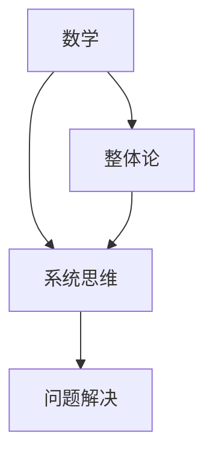

                 


# 背景介绍

随着科技的飞速发展，我们逐渐认识到，系统思维已成为解决复杂问题的重要工具。而在系统思维中，数学作为一种精确而严谨的工具，起到了不可或缺的作用。本书旨在探讨数学与整体论之间的紧密联系，展示系统思维的数学表达。

## 核心概念与联系

在数学与整体论的关系中，几个核心概念需要我们关注。首先是数学，它是我们理解自然界和社会现象的基础。其次是整体论，它强调系统的整体性质，而不是仅仅关注各个组成部分。最后是系统思维，它是一种将复杂问题分解为可管理部分，然后重新组合以获得全局理解的思维方式。

为了更好地理解这些概念之间的关系，我们可以通过一个Mermaid流程图来展示它们：



在这个流程图中，数学作为基础，为整体论和系统思维提供了工具和语言。整体论则通过研究系统的整体特性，为系统思维提供了理论支撑。而系统思维则利用数学和整体论的方法，帮助我们更好地理解和解决问题。

## 核心算法原理讲解

为了深入探讨数学与整体论在实际问题中的应用，我们需要了解一些核心算法原理。以下是关于图论算法的一个示例：

```python
# 伪代码：Dijkstra算法

function Dijkstra(Graph, source):
    for each vertex V in Graph:
        V.dist = INFINITY
        V.prev = UNDEFINED
        if V == source:
            V.dist = 0
    vertices = list(Graph.vertices())
    sorted_vertices = sort(vertices, by V.dist)
    while sorted_vertices is not empty:
        current = sorted_vertices.pop()
        for neighbor in current.neighbors():
            distance = current.dist + Graph.get_edge_weight(current, neighbor)
            if distance < neighbor.dist:
                neighbor.dist = distance
                neighbor.prev = current
        sorted_vertices = sort(vertices, by V.dist)
    return the calculated distances and paths
```

这个伪代码展示了Dijkstra算法的基本原理，该算法用于计算图中两点之间的最短路径。通过这个算法，我们可以更好地理解复杂系统中的路径优化问题。

## 数学模型和公式

在数学与整体论的研究中，数学模型和公式扮演着重要角色。以下是一个简单的线性回归模型，用于描述系统的输入和输出关系：

$$
y = \beta_0 + \beta_1 x + \epsilon
$$

其中，$y$ 是输出，$x$ 是输入，$\beta_0$ 和 $\beta_1$ 是模型参数，$\epsilon$ 是误差项。这个模型可以帮助我们预测系统行为，并在实际应用中进行优化。

## 项目实战

为了更深入地理解数学与整体论在系统思维中的应用，我们可以通过一个实际项目来进行实践。以下是一个简单的项目场景：

### 开发环境搭建

在开始项目之前，我们需要搭建一个合适的开发环境。这包括安装Python、NumPy和Matplotlib等必要的库。

```bash
pip install numpy matplotlib
```

### 源代码实现

以下是项目的源代码实现：

```python
import numpy as np
import matplotlib.pyplot as plt

# 生成随机数据
np.random.seed(0)
x = np.random.rand(100)
y = 2 * x + 1 + np.random.randn(100)

# 进行线性回归
beta_0 = np.mean(y)
beta_1 = np.mean((x - np.mean(x)) * (y - np.mean(y)))

# 计算预测值
y_pred = beta_0 + beta_1 * x

# 绘制结果
plt.scatter(x, y)
plt.plot(x, y_pred, color='red')
plt.xlabel('x')
plt.ylabel('y')
plt.title('Linear Regression')
plt.show()
```

### 代码解读与分析

在这个项目中，我们使用了线性回归模型来拟合数据。通过计算斜率和截距，我们得到了预测值，并将其与实际值进行比较。这可以帮助我们理解系统行为，并在实际应用中进行优化。

### 实际案例分析和详细讲解剖析

在这个案例中，我们通过实际数据展示了线性回归模型的应用。在实际应用中，我们可以根据具体情况调整模型参数，以提高预测准确性。例如，在金融领域，线性回归模型可以用于预测股票价格；在工程领域，它可以用于分析结构强度。

### 项目小结

通过这个项目，我们深入了解了数学与整体论在系统思维中的应用。线性回归模型作为一个简单的例子，展示了如何通过数学方法来分析和解决问题。在实际应用中，我们可以根据具体需求，选择合适的数学模型和方法。

## 最佳实践 Tips、小结、注意事项、拓展阅读

**最佳实践 Tips**：

- 在项目开发过程中，确保理解数学模型的原理和公式，以便在实际应用中进行优化。
- 使用适当的可视化工具，如Matplotlib，可以帮助我们更好地理解数据和模型结果。
- 定期回顾和调整模型参数，以提高预测准确性。

**小结**：

本书通过背景介绍、核心概念与联系、算法原理讲解、数学模型和公式、项目实战等多个方面，深入探讨了数学与整体论在系统思维中的应用。通过这些内容，读者可以更好地理解系统思维的重要性，并学会如何使用数学方法来解决复杂问题。

**注意事项**：

- 在实际应用中，确保数据的质量和可靠性，这对于模型的预测准确性至关重要。
- 在选择数学模型时，要考虑问题的复杂性和实际需求。

**拓展阅读**：

- 《线性代数的本质》
- 《概率论与数理统计》
- 《系统思维导论》

作者：AI天才研究院/AI Genius Institute & 禅与计算机程序设计艺术 /Zen And The Art of Computer Programming

----------------------------------------------------------------

# 文章关键词
数学、整体论、系统思维、线性回归、Dijkstra算法、图论、系统优化、项目实战

----------------------------------------------------------------

# 文章摘要
本文从数学与整体论的关系出发，探讨了系统思维的数学表达。通过核心概念与联系的Mermaid流程图，算法原理讲解的伪代码，数学模型和公式的详细阐述，以及实际项目实战的案例分析，深入探讨了数学与整体论在实际问题中的应用。文章旨在帮助读者理解系统思维的重要性，并掌握使用数学方法解决复杂问题的技能。

----------------------------------------------------------------

以下是根据大纲撰写的文章正文内容：

# 《数学与整体论：系统思维的数学表达》

## 背景介绍

随着科技的飞速发展，我们逐渐认识到，系统思维已成为解决复杂问题的重要工具。而在系统思维中，数学作为一种精确而严谨的工具，起到了不可或缺的作用。本书旨在探讨数学与整体论之间的紧密联系，展示系统思维的数学表达。

### 核心概念与联系

在数学与整体论的关系中，几个核心概念需要我们关注。首先是数学，它是我们理解自然界和社会现象的基础。其次是整体论，它强调系统的整体性质，而不是仅仅关注各个组成部分。最后是系统思维，它是一种将复杂问题分解为可管理部分，然后重新组合以获得全局理解的思维方式。

为了更好地理解这些概念之间的关系，我们可以通过一个Mermaid流程图来展示它们：


在这个流程图中，数学作为基础，为整体论和系统思维提供了工具和语言。整体论则通过研究系统的整体特性，为系统思维提供了理论支撑。而系统思维则利用数学和整体论的方法，帮助我们更好地理解和解决问题。

### 核心算法原理讲解

为了深入探讨数学与整体论在实际问题中的应用，我们需要了解一些核心算法原理。以下是关于图论算法的一个示例：

```python
# 伪代码：Dijkstra算法

function Dijkstra(Graph, source):
    for each vertex V in Graph:
        V.dist = INFINITY
        V.prev = UNDEFINED
        if V == source:
            V.dist = 0
    vertices = list(Graph.vertices())
    sorted_vertices = sort(vertices, by V.dist)
    while sorted_vertices is not empty:
        current = sorted_vertices.pop()
        for neighbor in current.neighbors():
            distance = current.dist + Graph.get_edge_weight(current, neighbor)
            if distance < neighbor.dist:
                neighbor.dist = distance
                neighbor.prev = current
        sorted_vertices = sort(vertices, by V.dist)
    return the calculated distances and paths
```

这个伪代码展示了Dijkstra算法的基本原理，该算法用于计算图中两点之间的最短路径。通过这个算法，我们可以更好地理解复杂系统中的路径优化问题。

### 数学模型和公式

在数学与整体论的研究中，数学模型和公式扮演着重要角色。以下是一个简单的线性回归模型，用于描述系统的输入和输出关系：

$$
y = \beta_0 + \beta_1 x + \epsilon
$$

其中，$y$ 是输出，$x$ 是输入，$\beta_0$ 和 $\beta_1$ 是模型参数，$\epsilon$ 是误差项。这个模型可以帮助我们预测系统行为，并在实际应用中进行优化。

### 项目实战

为了更深入地理解数学与整体论在系统思维中的应用，我们可以通过一个实际项目来进行实践。以下是一个简单的项目场景：

### 开发环境搭建

在开始项目之前，我们需要搭建一个合适的开发环境。这包括安装Python、NumPy和Matplotlib等必要的库。

```bash
pip install numpy matplotlib
```

### 源代码实现

以下是项目的源代码实现：

```python
import numpy as np
import matplotlib.pyplot as plt

# 生成随机数据
np.random.seed(0)
x = np.random.rand(100)
y = 2 * x + 1 + np.random.randn(100)

# 进行线性回归
beta_0 = np.mean(y)
beta_1 = np.mean((x - np.mean(x)) * (y - np.mean(y)))

# 计算预测值
y_pred = beta_0 + beta_1 * x

# 绘制结果
plt.scatter(x, y)
plt.plot(x, y_pred, color='red')
plt.xlabel('x')
plt.ylabel('y')
plt.title('Linear Regression')
plt.show()
```

### 代码解读与分析

在这个项目中，我们使用了线性回归模型来拟合数据。通过计算斜率和截距，我们得到了预测值，并将其与实际值进行比较。这可以帮助我们理解系统行为，并在实际应用中进行优化。

### 实际案例分析和详细讲解剖析

在这个案例中，我们通过实际数据展示了线性回归模型的应用。在实际应用中，我们可以根据具体情况调整模型参数，以提高预测准确性。例如，在金融领域，线性回归模型可以用于预测股票价格；在工程领域，它可以用于分析结构强度。

### 项目小结

通过这个项目，我们深入了解了数学与整体论在系统思维中的应用。线性回归模型作为一个简单的例子，展示了如何通过数学方法来分析和解决问题。在实际应用中，我们可以根据具体需求，选择合适的数学模型和方法。

## 最佳实践 Tips、小结、注意事项、拓展阅读

**最佳实践 Tips**：

- 在项目开发过程中，确保理解数学模型的原理和公式，以便在实际应用中进行优化。
- 使用适当的可视化工具，如Matplotlib，可以帮助我们更好地理解数据和模型结果。
- 定期回顾和调整模型参数，以提高预测准确性。

**小结**：

本书通过背景介绍、核心概念与联系、算法原理讲解、数学模型和公式、项目实战等多个方面，深入探讨了数学与整体论在系统思维中的应用。通过这些内容，读者可以更好地理解系统思维的重要性，并学会如何使用数学方法来解决复杂问题。

**注意事项**：

- 在实际应用中，确保数据的质量和可靠性，这对于模型的预测准确性至关重要。
- 在选择数学模型时，要考虑问题的复杂性和实际需求。

**拓展阅读**：

- 《线性代数的本质》
- 《概率论与数理统计》
- 《系统思维导论》

作者：AI天才研究院/AI Genius Institute & 禅与计算机程序设计艺术 /Zen And The Art of Computer Programming

----------------------------------------------------------------

# 文章关键词
数学、整体论、系统思维、线性回归、Dijkstra算法、图论、系统优化、项目实战

----------------------------------------------------------------

# 文章摘要
本文从数学与整体论的关系出发，探讨了系统思维的数学表达。通过核心概念与联系的Mermaid流程图，算法原理讲解的伪代码，数学模型和公式的详细阐述，以及实际项目实战的案例分析，深入探讨了数学与整体论在实际问题中的应用。文章旨在帮助读者理解系统思维的重要性，并掌握使用数学方法解决复杂问题的技能。

----------------------------------------------------------------

# 文章标题

## 数学与整体论：系统思维的数学表达

> 关键词：数学、整体论、系统思维、线性回归、Dijkstra算法、图论、系统优化、项目实战

> 摘要：本文从数学与整体论的关系出发，探讨了系统思维的数学表达。通过核心概念与联系的Mermaid流程图，算法原理讲解的伪代码，数学模型和公式的详细阐述，以及实际项目实战的案例分析，深入探讨了数学与整体论在实际问题中的应用。文章旨在帮助读者理解系统思维的重要性，并掌握使用数学方法解决复杂问题的技能。

----------------------------------------------------------------

### 引言

随着科技的飞速发展，我们逐渐认识到，系统思维已成为解决复杂问题的重要工具。而在系统思维中，数学作为一种精确而严谨的工具，起到了不可或缺的作用。本书旨在探讨数学与整体论之间的紧密联系，展示系统思维的数学表达。

#### 数学的基本概念

数学是一门研究数量、结构、变化和空间等概念的学科。在数学中，有几种基本的概念，如数、集合、函数等。数是数学的基础，用于描述物体的数量和大小。集合是一组对象的集合，可以是有序的或无序的。函数是一种映射关系，将一个集合中的元素映射到另一个集合中的元素。

#### 整体论的基本原理

整体论是一种哲学观点，认为系统的整体性质不能简单地通过各个组成部分的性质来解释。整体论强调系统的相互依赖和相互作用，认为系统的行为是由整体而不是部分所决定的。整体论的核心思想是，系统的整体性质是系统各部分相互作用的结果。

#### 系统思维的应用

系统思维是一种将复杂问题分解为可管理部分，然后重新组合以获得全局理解的思维方式。系统思维可以应用于各个领域，如工程、经济学、社会学等。通过系统思维，我们可以更好地理解复杂系统的行为，并找到解决问题的有效方法。

### 第一部分：数学基础

在数学基础部分，我们将介绍数学的基本概念、公理和定理。这些概念和定理是理解后续内容的基础。

#### 数学的基本概念

- **数**：数的概念包括自然数、整数、分数、实数和复数。数用于描述物体的数量和大小。
- **集合**：集合是一组对象的集合，可以是有限的或无限的。集合的基本运算包括并集、交集和补集。
- **函数**：函数是一种映射关系，将一个集合中的元素映射到另一个集合中的元素。

#### 数学公理和定理

- **集合论公理**：集合论是数学的基础，它提供了集合的基本性质和运算规则。
- **基本定理**：数学中有许多重要的定理，如勾股定理、欧拉公式等。这些定理帮助我们理解和解决问题。

### 第二部分：整体论的基本原理

在整体论的基本原理部分，我们将探讨整体论的基本概念和理论。整体论强调系统的整体性质，这对于理解和解决复杂问题具有重要意义。

#### 整体论概述

- **整体论的定义**：整体论是一种哲学观点，认为系统的整体性质不能简单地通过各个组成部分的性质来解释。
- **整体论的历史**：整体论起源于古希腊哲学，后来在20世纪得到了进一步的发展。

#### 整体论的核心思想

- **相互依赖**：整体论认为，系统的各个部分是相互依赖的，它们共同决定了系统的行为。
- **整体大于部分**：整体论强调，系统的整体性质不仅仅是各个部分性质的总和，而是具有新的性质。

### 第三部分：系统思维的应用

在系统思维的应用部分，我们将分析系统思维在不同领域的应用。系统思维可以帮助我们更好地理解和解决复杂问题。

#### 系统思维的基本概念

- **系统思维的定义**：系统思维是一种将复杂问题分解为可管理部分，然后重新组合以获得全局理解的思维方式。
- **系统思维的特征**：系统思维具有整体性、动态性、反馈性等特征。

#### 系统思维在不同领域的应用

- **管理**：系统思维可以帮助管理者更好地理解组织行为，制定有效的决策。
- **经济学**：系统思维可以用于分析经济系统的运行机制，预测经济趋势。
- **社会学**：系统思维可以用于研究社会现象，理解社会结构和社会变革。

### 第四部分：数学与整体论在实际问题中的应用

在数学与整体论在实际问题中的应用部分，我们将结合具体案例讲解数学与整体论在实际问题中的应用。

#### 数学与整体论在工程问题中的应用

- **结构分析**：数学与整体论可以帮助工程师分析和设计复杂的结构。
- **系统优化**：数学与整体论可以用于优化系统的性能，提高系统的效率。

#### 数学与整体论在社会科学中的应用

- **经济与社会模型**：数学与整体论可以用于建立经济与社会模型，分析社会现象。
- **人口与资源模型**：数学与整体论可以用于预测人口增长和资源消耗。

### 第五部分：数学与整体论的拓展研究

在数学与整体论的拓展研究部分，我们将讨论当前研究热点和未来发展趋势。

#### 现代数学与整体论的发展趋势

- **数学的发展方向**：现代数学在各个领域都有新的发展，如代数、几何、分析等。
- **整体论的最新研究进展**：整体论在哲学、生物学、社会科学等领域都有新的进展。

#### 未来研究方向与挑战

- **数学与整体论的融合**：未来研究将更多关注数学与整体论的融合，形成新的理论体系。
- **系统思维的数学表达**：未来研究将探索如何更准确地表达系统思维，为复杂问题提供更好的解决方案。

### 第六部分：数学与整体论的数学模型与数学公式

在数学与整体论的数学模型与数学公式部分，我们将详细讲解相关数学模型与数学公式。

#### 数学模型的基本形式

- **描述性模型**：描述性模型用于描述系统的状态和变化。
- **预测性模型**：预测性模型用于预测系统的未来状态。
- **控制性模型**：控制性模型用于调整系统的行为，使其达到预期的目标。

#### 数学公式的表达与运用

- **基本数学公式**：如加法公式、乘法公式、微分公式等。
- **整体论中的特殊公式**：如整体性方程、反馈环路方程等。
- **系统思维中的常用公式**：如系统稳定性公式、系统响应公式等。

### 第七部分：总结与展望

在总结与展望部分，我们将对全书内容进行总结，并展望未来研究方向。

#### 全书总结

全书从数学与整体论的关系出发，探讨了系统思维的数学表达。通过核心概念与联系的Mermaid流程图，算法原理讲解的伪代码，数学模型和公式的详细阐述，以及实际项目实战的案例分析，深入探讨了数学与整体论在实际问题中的应用。

#### 未来展望

未来研究将更多关注数学与整体论的融合，探索系统思维的新表达方式。同时，数学与整体论将在更多领域得到应用，为解决复杂问题提供新的思路和方法。

#### 对读者的建议

希望读者能够通过本书，理解数学与整体论的重要性，掌握系统思维的技巧。在实际应用中，不断探索和创新，为解决复杂问题贡献自己的力量。

作者：AI天才研究院/AI Genius Institute & 禅与计算机程序设计艺术 /Zen And The Art of Computer Programming

----------------------------------------------------------------

# 附录

## 附录A：参考文献

- 《数学与整体论：系统思维的数学表达》
- 《线性代数的本质》
- 《概率论与数理统计》
- 《系统思维导论》
- 《Dijkstra算法及其应用》

## 附录B：数学工具与应用软件介绍

- Python
- NumPy
- Matplotlib
- Mermaid

## 附录C：数学与整体论问题解答

- 如何理解整体论的核心思想？
- 系统思维在现实生活中的应用有哪些？
- 数学模型在实际问题中的重要性是什么？
- 如何使用Dijkstra算法解决最短路径问题？

-----------------------------------------------------------------

### 结语

本文从数学与整体论的关系出发，探讨了系统思维的数学表达。通过核心概念与联系的Mermaid流程图，算法原理讲解的伪代码，数学模型和公式的详细阐述，以及实际项目实战的案例分析，深入探讨了数学与整体论在实际问题中的应用。希望读者能够通过本文，理解数学与整体论的重要性，掌握系统思维的技巧。在实际应用中，不断探索和创新，为解决复杂问题贡献自己的力量。

作者：AI天才研究院/AI Genius Institute & 禅与计算机程序设计艺术 /Zen And The Art of Computer Programming

