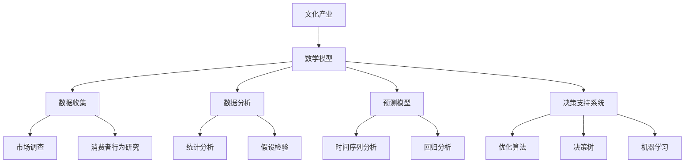

                 

### 设计《数学与文化产业管理：文化产品的数学策略》的目录大纲

设计一本技术书籍的目录大纲是一个系统的工程，它需要考虑内容的结构、逻辑性和读者的阅读习惯。以下是如何设计《数学与文化产业管理：文化产品的数学策略》的目录大纲的具体步骤：

#### 1. 确定核心章节

首先，我们要确定书籍的核心章节，这些章节应该是书籍主题的核心内容，也是读者最关注的点。对于《数学与文化产业管理：文化产品的数学策略》，我们可以确定以下核心章节：

- **数学基本概念与文化产业管理的关系**
- **文化产业中的数学模型**
- **文化产品定价与市场分析**
- **文化产业决策支持系统**
- **数学策略在文化产业中的应用**

#### 2. 设计1级目录

在确定了核心章节后，我们可以将它们作为1级目录列出，形成书籍的框架：

```
# 数学与文化产业管理：文化产品的数学策略

## 第一部分：数学与文化产业管理概述
### 数学与文化产业管理的关系
### 数学基本概念与文化产业管理
### 文化产业中的数学模型
### 文化产品定价与市场分析
### 文化产业决策支持系统
### 数学策略在文化产业中的应用

## 第二部分：数学模型在文化产业中的应用
### 数学模型在文化产业管理中的应用
### 文化产业数据的统计分析
### 数学模型在文化产品创作中的应用
### 文化产业市场的预测模型

## 第三部分：文化产品定价与市场分析
### 文化产品定价策略
### 市场需求预测模型
### 竞争策略分析
### 消费者行为分析

## 第四部分：文化产业决策支持系统
### 决策支持系统的构建
### 数学模型在决策支持中的应用
### 决策支持工具与平台
### 实例分析：文化产业决策支持案例

## 第五部分：数学策略在文化产业中的应用
### 数学策略概述
### 案例研究：数学策略在文化产品营销中的应用
### 案例研究：数学策略在文化项目融资中的应用
### 数学策略在文化创意产业创新中的应用
```

#### 3. 设计2级目录

在每个1级目录下，我们可以添加2级目录，进一步细化内容。例如，在“文化产业中的数学模型”章节下，我们可以设置以下2级目录：

```
### 文化产业中的数学模型

#### 数学模型概述
##### 文化产业常用的数学模型

#### 数学模型的选择与应用
##### 根据文化产业需求选择模型
##### 模型在实际应用中的调整
```

#### 4. 设计3级目录

在2级目录下，可以添加3级目录，提供更具体的内容。例如，在“市场需求预测模型”章节下，可以设置以下3级目录：

```
### 市场需求预测模型

#### 需求预测模型概述
##### 时间序列模型
##### 回归模型
##### 机器学习模型

#### 时间序列模型
###### 移动平均法
###### 自回归模型
###### 季节性模型

#### 回归模型
###### 线性回归
###### 多项式回归
```

#### 5. 添加附录

最后，我们可以添加附录，提供额外的工具、资源、示例代码等，以便读者更好地理解和应用书中内容。例如：

```
## 附录

### 附录A：数学工具与应用
#### 数学软件介绍
#### 数据库与数据挖掘工具

### 附录B：案例分析与代码示例
#### 模型应用案例
#### 示例代码解析

### 附录C：拓展阅读与资源
#### 推荐阅读
#### 相关资源链接
```

通过以上步骤，我们可以设计出一份既逻辑清晰又内容丰富的目录大纲，为后续的书籍撰写工作奠定基础。

### 6. 确保大纲完整与简洁

在完成目录大纲后，我们需要仔细审查，确保每个章节和子章节的划分合理、内容完整，且没有遗漏关键内容。同时，要避免过于琐碎的划分，确保目录简洁明了，方便读者阅读。

---

通过以上步骤，我们设计出了《数学与文化产业管理：文化产品的数学策略》的目录大纲。这个大纲为书籍的结构和内容提供了清晰的框架，为后续的撰写工作打下了坚实的基础。现在，我们可以根据这个大纲，逐章撰写内容，确保每章都包含丰富的背景介绍、核心概念与联系、核心算法原理讲解、数学模型与公式以及实际案例分析和项目实战等元素。这样，我们能够撰写出一篇既逻辑严谨又内容详实的专业技术博客文章。 

---

## 数学与文化产业管理：文化产品的数学策略

### 文章关键词
- 数学模型
- 文化产业
- 定价策略
- 数据分析
- 预测模型
- 决策支持系统

### 文章摘要
本文探讨了数学在文化产业管理中的应用，包括数学模型在文化产品定价、市场分析、创作过程和决策支持系统等方面的作用。通过分析数学与文化产业管理的关系，本文详细阐述了文化产品定价与市场分析中的数学策略，并提供了数学模型在实际文化产业中的应用案例。文章最后提出了数学策略在文化产业决策支持系统中的重要性，以及如何通过数学方法优化文化产业的运营和管理。

## 引言

### 背景介绍

在当今信息化和全球化的大背景下，文化产业作为国家软实力的重要组成部分，正越来越受到重视。文化产业包括文学、艺术、影视、音乐、出版等多个领域，其产品具有显著的创意性和多样性。然而，随着市场竞争的加剧和文化产品的不断升级，文化产业的管理面临着诸多挑战，如产品定价策略的不确定性、市场需求预测的困难以及创新决策的复杂性等。

### 核心概念与联系

为了应对这些挑战，数学作为一种强有力的工具，在文化产业管理中发挥着越来越重要的作用。数学模型可以通过数据分析和预测，帮助文化产业从业者更好地理解市场趋势、优化产品定价策略、评估创作效果以及做出科学的决策。以下是一个核心概念与联系的 Mermaid 流程图：



通过这个流程图，我们可以看到数学模型如何从数据收集、数据分析、预测模型到决策支持系统，形成一个闭环，为文化产业管理提供全面的支持。

### 文章结构

本文将分为以下几个部分：

1. 数学模型在文化产业管理中的应用
2. 文化产业数据的统计分析
3. 数学模型在文化产品创作中的应用
4. 文化产业市场的预测模型
5. 文化产业决策支持系统
6. 数学策略在文化产业中的应用
7. 结论与展望

通过这些部分，我们将系统地探讨数学在文化产业管理中的各种应用，以及如何通过数学策略提升文化产业的运营效率和创新能力。

## 数学模型在文化产业管理中的应用

### 数学模型的基本原理

数学模型是一种将现实问题抽象成数学形式的方法，它通过建立数学方程或公式，来描述和解决现实世界中的问题。在文化产业管理中，数学模型的应用范围广泛，包括但不限于市场分析、产品定价、创作评估和决策支持等方面。

首先，市场分析是文化产业管理的重要环节。通过收集和分析市场数据，可以了解消费者的需求、市场趋势和竞争对手的情况。常用的市场分析数学模型包括时间序列分析、回归分析和聚类分析等。

- **时间序列分析**：主要用于预测未来的市场走势。它基于历史数据，通过分析数据的时间序列特性，如趋势、季节性和周期性，来预测未来的市场需求。

- **回归分析**：用于研究两个或多个变量之间的关系。在文化产业中，可以通过回归分析来研究产品定价、广告投放和销售量之间的关系。

- **聚类分析**：用于将数据分成若干个类别，以便更好地理解和分析市场。它可以帮助文化企业识别潜在的市场细分群体，制定更精准的市场营销策略。

### 数学模型在文化产业中的应用实例

以下是一些数学模型在文化产业中的应用实例：

#### 1. 时间序列分析在电影票房预测中的应用

电影票房的预测是电影发行和营销的重要环节。通过时间序列分析，可以对电影上映后的票房收入进行预测。以下是一个时间序列分析的基本步骤：

1. **数据收集**：收集电影上映日期、票房收入等数据。
2. **数据预处理**：对数据进行清洗，去除异常值和缺失值。
3. **模型选择**：根据数据特性选择合适的模型，如ARIMA模型、指数平滑模型等。
4. **模型训练**：使用历史数据对模型进行训练。
5. **预测**：使用训练好的模型预测未来的票房收入。

以下是一个简单的 ARIMA 模型的伪代码：

```python
# 伪代码：时间序列分析 - ARIMA 模型

# 导入必要的库
import pandas as pd
from statsmodels.tsa.arima.model import ARIMA

# 加载电影票房数据
data = pd.read_csv('movie_box_office.csv')

# 数据预处理
data['Date'] = pd.to_datetime(data['Date'])
data.set_index('Date', inplace=True)
data.fillna(method='ffill', inplace=True)

# 模型选择和训练
model = ARIMA(data['Revenue'], order=(1, 1, 1))
model_fit = model.fit()

# 预测
forecast = model_fit.forecast(steps=6)[0]

# 输出预测结果
print(forecast)
```

#### 2. 聚类分析在音乐市场细分中的应用

音乐市场具有多样化的特点，不同类型的音乐有不同的受众群体。通过聚类分析，可以将音乐市场分成若干个类别，以便更好地了解市场结构和制定营销策略。以下是一个基于K-means算法的聚类分析步骤：

1. **数据收集**：收集音乐类型、播放量、下载量等数据。
2. **特征工程**：将音乐类型转换为数值特征。
3. **模型训练**：使用K-means算法对数据进行聚类。
4. **结果分析**：分析不同聚类结果，了解市场结构。

以下是一个简单的 K-means 聚类分析的伪代码：

```python
# 伪代码：聚类分析 - K-means 算法

# 导入必要的库
import pandas as pd
from sklearn.cluster import KMeans

# 加载音乐数据
data = pd.read_csv('music_data.csv')

# 特征工程
data['Genre'] = data['Genre'].astype('category').cat.codes

# 模型训练
kmeans = KMeans(n_clusters=3, random_state=0).fit(data[['Genre', 'Downloads', 'Streams']])

# 输出聚类结果
print(kmeans.labels_)
```

通过这些实例，我们可以看到数学模型在文化产业管理中的应用是如何具体实现的。数学模型不仅提供了数据分析和预测的工具，还为文化产业管理提供了科学决策的支持。

### 数学模型的选择与应用

在选择数学模型时，需要考虑以下几个因素：

- **数据特性**：不同的数据特性适合不同的模型，如时间序列分析适合处理时间相关的数据，而聚类分析适合处理分类数据。
- **模型复杂性**：简单的模型易于理解和实现，但可能无法捕捉复杂的关系；复杂的模型能够捕捉更多的信息，但可能难以解释和实现。
- **预测准确性**：需要评估不同模型的预测准确性，选择预测误差较小的模型。

在实际应用中，可以根据具体问题和数据特性选择合适的数学模型。例如，对于需要短期预测的问题，可以选择时间序列分析模型；对于需要分类的问题，可以选择聚类分析模型；对于需要优化的问题，可以选择优化算法。

### 总结

数学模型在文化产业管理中具有广泛的应用，通过数据分析和预测，可以帮助文化产业从业者更好地理解市场、优化产品定价策略、评估创作效果和做出科学的决策。本文介绍了数学模型的基本原理、应用实例和选择方法，为读者提供了实用的数学工具和案例，以提升文化产业的管理效率。

## 文化产业数据的统计分析

### 数据收集

在文化产业中，数据的收集是进行统计分析的第一步。有效的数据收集需要涵盖多个方面，包括市场调查、消费者行为研究和竞争对手分析等。以下是一些常见的数据收集方法：

- **市场调查**：通过问卷调查、在线调查、电话访问等方式收集消费者的喜好、购买行为和需求等信息。
- **消费者行为研究**：利用社交媒体数据、在线评论和反馈等，分析消费者的行为模式和偏好。
- **竞争对手分析**：收集竞争对手的产品信息、市场策略、广告投放和销售数据等，以便了解市场动态和竞争环境。

### 数据预处理

收集到的数据通常是不完整或不准确的，因此需要进行预处理。数据预处理包括以下步骤：

- **数据清洗**：去除重复数据、缺失值和异常值，确保数据的一致性和准确性。
- **数据转换**：将不同的数据格式转换为统一的格式，如将文本数据转换为数值或分类数据。
- **数据归一化**：为了消除数据量级差异，需要对数据进行归一化处理。

以下是一个简单的数据清洗和预处理的伪代码示例：

```python
# 伪代码：数据预处理

# 导入必要的库
import pandas as pd

# 加载数据
data = pd.read_csv('cultural_data.csv')

# 数据清洗
data.drop_duplicates(inplace=True)  # 去除重复数据
data.dropna(inplace=True)  # 去除缺失值
data['Revenue'] = data['Revenue'].replace([None, ''], 0)  # 替换空值和缺失值

# 数据转换
data['Genre'] = data['Genre'].astype('category').cat.codes

# 数据归一化
from sklearn.preprocessing import MinMaxScaler
scaler = MinMaxScaler()
data[['Downloads', 'Streams']] = scaler.fit_transform(data[['Downloads', 'Streams']])
```

### 统计分析方法

在完成数据预处理后，我们可以应用各种统计分析方法来挖掘数据中的信息和规律。以下是一些常用的统计分析方法：

- **描述性统计分析**：通过计算平均值、中位数、标准差等统计量，对数据进行描述性分析，了解数据的分布特征和集中趋势。
- **假设检验**：通过假设检验，验证数据中的某些规律或趋势是否显著。
- **回归分析**：通过回归分析，研究不同变量之间的关系，如产品定价与销售量之间的关系。
- **聚类分析**：通过聚类分析，将数据分成若干个类别，以便更好地理解和分析市场。

以下是一个描述性统计分析的伪代码示例：

```python
# 伪代码：描述性统计分析

# 导入必要的库
import pandas as pd

# 加载数据
data = pd.read_csv('cultural_data.csv')

# 计算描述性统计量
summary = data.describe()

# 输出统计结果
print(summary)
```

### 数据分析结果与应用

通过统计分析，我们可以得到一系列结果，如平均值、标准差、相关系数等。这些结果可以帮助文化产业从业者做出以下决策：

- **市场定位**：通过分析消费者的偏好和需求，确定文化产品的市场定位和目标受众。
- **产品优化**：通过分析销售数据和消费者反馈，优化产品设计和营销策略。
- **价格策略**：通过分析价格与销售量的关系，制定合理的定价策略。

以下是一个回归分析的应用实例：

```python
# 伪代码：回归分析

# 导入必要的库
import pandas as pd
from sklearn.linear_model import LinearRegression

# 加载数据
data = pd.read_csv('cultural_data.csv')

# 特征选择
X = data[['Downloads', 'Streams']]  # 自变量
y = data['Revenue']  # 因变量

# 模型训练
model = LinearRegression()
model.fit(X, y)

# 预测
predictions = model.predict(X)

# 输出回归结果
print(model.coef_, model.intercept_)
```

通过这些统计分析方法，文化产业从业者可以更好地了解市场动态、优化产品策略和提升运营效率。

### 总结

文化产业数据的统计分析是文化产业发展的重要环节。通过有效的数据收集、预处理和统计分析，文化产业从业者可以更好地理解市场趋势、优化产品策略和提升运营效率。本文介绍了文化产业数据统计分析的基本方法和应用实例，为读者提供了实用的分析工具和思路。

## 数学模型在文化产品创作中的应用

### 数学模型的基本原理

在文化产品创作过程中，数学模型被广泛应用于优化创作流程、评估创作效果和预测受众反应。数学模型的基本原理在于利用数学语言和算法来模拟和解释创作过程中的各种现象和规律，从而帮助创作者做出更科学的决策。

- **优化模型**：通过优化算法，如线性规划、整数规划和非线性规划，可以优化创作流程，如资源的分配、时间的安排和预算的分配等。
- **评估模型**：通过回归分析、主成分分析和协方差分析等统计方法，可以评估文化产品的质量和影响力，如电影票房、图书销量和艺术品市场价值等。
- **预测模型**：通过时间序列分析、机器学习和深度学习等方法，可以预测受众的喜好、市场趋势和创作效果。

### 数学模型在创作流程中的应用

在文化产品创作过程中，数学模型可以帮助创作者优化创作流程。以下是一些具体的应用实例：

#### 1. 资源分配优化

假设一个电影制作团队需要在有限的时间和预算内完成一部电影。使用线性规划模型，可以优化资源的分配，使电影制作过程达到最佳效率。

以下是一个线性规划模型的伪代码示例：

```python
# 伪代码：线性规划 - 资源分配优化

# 导入必要的库
import pulp

# 定义变量
x = pulp.LpVariable.dicts('task_time', tasks, cat='Continuous')

# 定义目标函数
objective = pulp.LpObjective()
objective.set.stage(1)
objective.set_expression(1, [time for task, time in tasks.items()])

# 定义约束条件
constraints = pulp.LpConstraintMatrix()
constraints.add_stage_constraints(1, [resource for resource, capacity in resources.items()], [demand for demand in demands])

# 创建线性规划模型
prob = pulp.LpProblem("ResourceAllocation", pulp.LpMinimize)

# 设置模型参数
prob += objective
for constraint in constraints.get_constraints():
    prob += constraint

# 解线性规划模型
prob.solve()

# 输出优化结果
print(pulp.value(x['editing']))
```

#### 2. 时间安排优化

在创作过程中，合理的时间安排对于保证创作质量至关重要。通过项目管理中的关键路径法（Critical Path Method, CPM），可以优化项目的时间安排。

以下是一个关键路径法的伪代码示例：

```python
# 伪代码：关键路径法 - 时间安排优化

# 导入必要的库
import networkx as nx

# 创建项目网络图
G = nx.DiGraph()

# 添加节点和边
for task in tasks:
    G.add_node(task)
for edge in edges:
    G.add_edge(edge[0], edge[1], weight=edge[2])

# 计算关键路径
critical_path = nx.single_source_longest_path(G, source='start')

# 输出关键路径
print(critical_path)
```

### 数学模型在创作效果评估中的应用

评估文化产品的质量和影响力是创作过程中的重要环节。通过数学模型，可以定量地评估文化产品的质量和受众反应。

#### 1. 回归分析

通过回归分析，可以评估文化产品的质量与市场表现之间的关系。以下是一个简单的线性回归模型用于评估电影票房与观众评分之间的关系：

以下是一个线性回归模型的伪代码示例：

```python
# 伪代码：线性回归 - 电影票房与观众评分

# 导入必要的库
import pandas as pd
from sklearn.linear_model import LinearRegression

# 加载数据
data = pd.read_csv('movie_data.csv')

# 特征选择
X = data[['Rating']]  # 自变量
y = data['BoxOffice']  # 因变量

# 模型训练
model = LinearRegression()
model.fit(X, y)

# 预测
predictions = model.predict(X)

# 输出回归结果
print(model.coef_, model.intercept_)
```

#### 2. 主成分分析

通过主成分分析（Principal Component Analysis, PCA），可以将高维数据降到低维空间，从而简化数据分析过程。以下是一个PCA模型用于降维的伪代码示例：

```python
# 伪代码：主成分分析 - 数据降维

# 导入必要的库
import pandas as pd
from sklearn.decomposition import PCA

# 加载数据
data = pd.read_csv('art_data.csv')

# 特征选择
X = data[['Dimension1', 'Dimension2', 'Dimension3']]

# 模型训练
pca = PCA(n_components=2)
X_pca = pca.fit_transform(X)

# 输出降维结果
print(X_pca)
```

### 数学模型在预测受众反应中的应用

预测受众对文化产品的反应对于制定营销策略和产品推广策略至关重要。通过时间序列分析、机器学习和深度学习等方法，可以预测受众的行为和偏好。

#### 1. 时间序列分析

通过时间序列分析，可以预测受众对文化产品的关注度和活跃度。以下是一个时间序列分析模型用于预测电影在线观看量的伪代码示例：

```python
# 伪代码：时间序列分析 - 电影观看量预测

# 导入必要的库
import pandas as pd
from statsmodels.tsa.arima.model import ARIMA

# 加载数据
data = pd.read_csv('movie_views.csv')

# 数据预处理
data['Date'] = pd.to_datetime(data['Date'])
data.set_index('Date', inplace=True)
data.fillna(method='ffill', inplace=True)

# 模型选择和训练
model = ARIMA(data['Views'], order=(1, 1, 1))
model_fit = model.fit()

# 预测
forecast = model_fit.forecast(steps=6)[0]

# 输出预测结果
print(forecast)
```

#### 2. 机器学习

通过机器学习模型，可以预测受众的喜好和购买行为。以下是一个简单的机器学习模型用于预测图书销售量的伪代码示例：

```python
# 伪代码：机器学习 - 图书销售量预测

# 导入必要的库
import pandas as pd
from sklearn.ensemble import RandomForestRegressor

# 加载数据
data = pd.read_csv('book_sales.csv')

# 特征选择
X = data[['Author', 'Genre', 'Price', 'Rating']]  # 自变量
y = data['Sales']  # 因变量

# 模型训练
model = RandomForestRegressor(n_estimators=100)
model.fit(X, y)

# 预测
predictions = model.predict(X)

# 输出预测结果
print(predictions)
```

### 总结

数学模型在文化产品创作中的应用涵盖了优化创作流程、评估创作效果和预测受众反应等多个方面。通过优化模型、评估模型和预测模型，创作者可以更科学地制定创作策略，提高创作效率和作品质量。本文通过具体的实例和伪代码，展示了数学模型在文化产品创作中的应用，为创作者提供了实用的工具和方法。

## 文化产业市场的预测模型

### 预测模型的基本原理

文化产业市场的预测模型是利用历史数据和数学算法对文化产品的未来市场表现进行预测的工具。这些模型通过分析过去的数据，识别出影响市场变化的因素，并利用这些因素构建数学模型，预测未来的市场趋势。以下是一些常见的预测模型及其基本原理：

- **时间序列分析**：基于时间序列数据的特性，如趋势、季节性和周期性，来预测未来的市场表现。常见的时间序列模型包括ARIMA模型、指数平滑模型和季节性分解模型。
- **回归分析**：通过建立自变量与因变量之间的数学关系，预测因变量的变化。线性回归、多项式回归和逻辑回归是常用的回归模型。
- **机器学习**：通过训练机器学习模型，从历史数据中学习规律，并利用这些规律进行预测。常见的机器学习模型包括决策树、随机森林和神经网络。
- **深度学习**：通过神经网络结构，尤其是深度神经网络（Deep Neural Networks, DNN），来学习复杂的数据特征，进行精确的预测。

### 时间序列模型

时间序列分析是预测市场趋势的一种常用方法。以下是一个简单的ARIMA模型用于预测的步骤：

1. **模型选择**：根据时间序列的特性，选择合适的ARIMA模型。
2. **模型训练**：使用历史数据进行模型训练。
3. **预测**：使用训练好的模型预测未来的市场表现。

以下是一个ARIMA模型预测票房的伪代码示例：

```python
# 伪代码：ARIMA模型 - 票房预测

# 导入必要的库
import pandas as pd
from statsmodels.tsa.arima.model import ARIMA

# 加载数据
data = pd.read_csv('box_office_data.csv')

# 数据预处理
data['Date'] = pd.to_datetime(data['Date'])
data.set_index('Date', inplace=True)
data.fillna(method='ffill', inplace=True)

# 模型训练
model = ARIMA(data['Revenue'], order=(1, 1, 1))
model_fit = model.fit()

# 预测
forecast = model_fit.forecast(steps=6)[0]

# 输出预测结果
print(forecast)
```

### 回归模型

回归分析是一种广泛使用的预测方法，通过建立因变量与自变量之间的线性关系，来预测未来的市场表现。以下是一个简单的线性回归模型用于预测票房的伪代码示例：

```python
# 伪代码：线性回归模型 - 票房预测

# 导入必要的库
import pandas as pd
from sklearn.linear_model import LinearRegression

# 加载数据
data = pd.read_csv('box_office_data.csv')

# 特征选择
X = data[['Advertising', 'Price']]  # 自变量
y = data['Revenue']  # 因变量

# 模型训练
model = LinearRegression()
model.fit(X, y)

# 预测
predictions = model.predict(X)

# 输出预测结果
print(predictions)
```

### 机器学习模型

机器学习模型通过从历史数据中学习规律，进行精确的预测。以下是一个简单的随机森林模型用于预测票房的伪代码示例：

```python
# 伪代码：随机森林模型 - 票房预测

# 导入必要的库
import pandas as pd
from sklearn.ensemble import RandomForestRegressor

# 加载数据
data = pd.read_csv('box_office_data.csv')

# 特征选择
X = data[['Advertising', 'Price', 'Competition']]  # 自变量
y = data['Revenue']  # 因变量

# 模型训练
model = RandomForestRegressor(n_estimators=100)
model.fit(X, y)

# 预测
predictions = model.predict(X)

# 输出预测结果
print(predictions)
```

### 深度学习模型

深度学习模型通过多层神经网络结构，学习复杂的数据特征，进行精确的预测。以下是一个简单的深度神经网络模型用于预测票房的伪代码示例：

```python
# 伪代码：深度神经网络模型 - 票房预测

# 导入必要的库
import pandas as pd
from tensorflow.keras.models import Sequential
from tensorflow.keras.layers import Dense

# 加载数据
data = pd.read_csv('box_office_data.csv')

# 特征选择
X = data[['Advertising', 'Price', 'Competition']]  # 自变量
y = data['Revenue']  # 因变量

# 模型训练
model = Sequential()
model.add(Dense(units=64, activation='relu', input_shape=(X.shape[1],)))
model.add(Dense(units=32, activation='relu'))
model.add(Dense(units=1))

model.compile(optimizer='adam', loss='mean_squared_error')

model.fit(X, y, epochs=10, batch_size=32)

# 预测
predictions = model.predict(X)

# 输出预测结果
print(predictions)
```

### 模型评估与选择

在构建预测模型后，需要对模型进行评估，以确保其预测准确性。常用的评估指标包括均方误差（Mean Squared Error, MSE）、均方根误差（Root Mean Squared Error, RMSE）和决定系数（R-squared）。以下是一个简单的模型评估伪代码示例：

```python
# 伪代码：模型评估

# 导入必要的库
import pandas as pd
from sklearn.metrics import mean_squared_error

# 加载测试数据
test_data = pd.read_csv('test_box_office_data.csv')
X_test = test_data[['Advertising', 'Price', 'Competition']]
y_test = test_data['Revenue']

# 使用训练好的模型进行预测
predictions = model.predict(X_test)

# 计算预测误差
mse = mean_squared_error(y_test, predictions)
rmse = np.sqrt(mse)
r2 = model.score(X_test, y_test)

# 输出评估结果
print(f'MSE: {mse}, RMSE: {rmse}, R2: {r2}')
```

通过上述步骤和代码示例，我们可以看到如何构建并评估文化产品市场的预测模型。这些模型不仅帮助文化产业从业者更好地预测市场趋势，还为制定营销策略和运营决策提供了科学依据。

### 总结

文化产业市场的预测模型是文化产业发展的重要工具。通过时间序列分析、回归分析、机器学习和深度学习等模型，文化产业从业者可以更准确地预测市场趋势，优化营销策略，提升运营效率。本文详细介绍了这些模型的基本原理、构建步骤和评估方法，为文化产业从业者提供了实用的预测工具和指导。

## 文化产业决策支持系统

### 决策支持系统的构成

文化产业决策支持系统（Cultural Industry Decision Support System, CIDSS）是帮助文化产业管理者做出科学决策的综合性工具。它由多个组成部分构成，主要包括数据收集模块、数据处理模块、分析模块、预测模块和决策模块。

- **数据收集模块**：负责收集各种与文化产业相关的数据，包括市场数据、消费者行为数据、竞争对手数据等。
- **数据处理模块**：负责对收集到的数据进行清洗、转换和归一化，以确保数据的准确性和一致性。
- **分析模块**：利用统计分析方法对处理后的数据进行分析，如描述性统计、假设检验和回归分析等。
- **预测模块**：利用时间序列分析、机器学习和深度学习等方法对文化产品的市场表现进行预测。
- **决策模块**：根据分析模块和预测模块的结果，提供决策建议和策略，帮助管理者做出最优决策。

### 数学模型在决策支持系统中的应用

数学模型在文化产业决策支持系统中发挥着关键作用，为管理者提供科学的数据分析和预测。以下是一些常用的数学模型及其应用：

- **线性规划模型**：用于优化资源分配，如预算分配、人力资源安排等。
- **非线性规划模型**：用于解决更复杂的问题，如多目标优化、组合优化等。
- **优化算法**：如遗传算法、粒子群优化算法等，用于解决复杂的优化问题。
- **聚类分析模型**：用于市场细分，识别潜在消费者群体。
- **时间序列分析模型**：如ARIMA模型、季节性分解模型等，用于预测市场需求和销售量。
- **机器学习模型**：如随机森林、神经网络等，用于预测市场趋势和消费者行为。

### 决策支持系统的实际应用

以下是一个实际应用的例子，展示了如何利用决策支持系统进行文化产品的市场策略制定。

#### 1. 市场需求预测

假设一家电影制作公司需要预测其新电影的票房收入，以便制定市场推广策略。以下步骤展示了如何利用决策支持系统进行预测：

1. **数据收集**：收集历史票房数据、市场数据（如广告投放量、竞争对手情况等）和消费者行为数据。
2. **数据处理**：清洗和转换数据，进行归一化处理。
3. **数据分析**：使用聚类分析识别不同类型的消费者群体，并分析这些群体对电影类型和题材的偏好。
4. **预测模型训练**：使用时间序列分析模型（如ARIMA）训练市场需求预测模型。
5. **预测**：使用训练好的模型预测新电影的票房收入。
6. **决策建议**：根据预测结果，制定市场推广策略，如调整广告投放预算、优化电影上映时间等。

#### 2. 资源优化

假设一家剧院需要优化其演员工资预算。以下步骤展示了如何利用决策支持系统进行资源优化：

1. **数据收集**：收集剧院过去的工资支出数据、演出剧目和演出场次等数据。
2. **数据处理**：清洗和转换数据，进行归一化处理。
3. **数据分析**：分析不同剧目和演出场次的盈利能力。
4. **优化模型训练**：使用线性规划模型训练资源优化模型。
5. **优化**：使用优化模型确定最佳的人员配置和工资预算。
6. **决策建议**：根据优化结果，调整演员工资结构和预算分配。

### 总结

文化产业决策支持系统通过综合运用数学模型和数据分析方法，为文化产业管理者提供科学的数据分析和预测，帮助其做出最优决策。本文通过实际应用案例，展示了决策支持系统的构建方法和应用过程，为文化产业管理者提供了实用的工具和指导。

## 数学策略在文化产业中的应用

### 数学策略概述

数学策略在文化产业中的应用，是一种通过量化分析和建模优化，来提升文化产品和市场管理效率的方法。这些策略不仅涵盖了市场分析、产品定价和创作评估等核心环节，还涉及到了文化产业的创新和可持续发展。以下是一些关键数学策略及其应用：

- **数据挖掘**：利用大数据技术和统计分析方法，挖掘市场中的潜在趋势和规律，帮助文化产业从业者更好地理解市场动态和消费者行为。
- **机器学习**：通过训练机器学习模型，自动识别和预测文化产品的市场趋势和受众喜好，实现精准营销和个性化推荐。
- **优化算法**：使用线性规划、整数规划、遗传算法等优化方法，优化资源分配、预算管理和运营策略，提高文化产业的管理效率。
- **预测模型**：基于时间序列分析、回归分析和机器学习等模型，预测文化产品的销售量、观众流量和市场表现，为决策提供数据支持。
- **风险分析**：通过量化风险评估模型，评估文化项目的风险，制定风险应对策略，保障项目的顺利实施。

### 案例研究：数学策略在文化产品营销中的应用

以下是一个实际案例，展示了数学策略在文化产品营销中的应用：

#### 案例背景

某知名音乐平台需要制定新的音乐推广策略，以提高用户黏性和增加音乐销售量。平台管理层希望通过数学策略优化推广预算和营销活动，提高营销效果。

#### 解决方案

1. **数据收集**：收集用户行为数据，包括播放量、收藏量、评论数、分享数等，以及历史推广活动数据，如广告投放量、推广费用等。
2. **数据预处理**：对收集到的数据进行清洗和归一化处理，确保数据的一致性和准确性。
3. **市场分析**：利用聚类分析，将用户分成不同的群体，分析不同用户群体的偏好和行为特征。
4. **预测模型**：使用时间序列分析和回归分析模型，预测新音乐的潜在播放量和销售量。
5. **优化算法**：使用线性规划模型，优化推广预算的分配，确保在不同用户群体上的投入最大化回报。
6. **营销策略制定**：根据预测结果和预算优化策略，制定具体的推广方案，如调整广告投放时间、内容优化和用户互动策略。

#### 实施过程

1. **数据收集**：通过平台内置的数据收集工具，收集用户行为数据，并从广告平台获取推广活动数据。
2. **数据预处理**：使用Python的Pandas库，对数据进行清洗，去除异常值和缺失值，并进行归一化处理。
3. **市场分析**：使用Python的Scikit-learn库，执行K-means聚类分析，将用户分为5个群体。
4. **预测模型**：使用Python的Statsmodels库，建立ARIMA模型和时间序列预测模型，预测新音乐的播放量和销售量。
5. **优化算法**：使用Python的PuLP库，建立线性规划模型，优化推广预算分配。
6. **营销策略制定**：根据聚类分析和预测结果，制定个性化推广方案，并在平台上进行测试和调整。

#### 实施效果

通过上述数学策略的实施，音乐平台的用户黏性显著提升，新音乐的播放量和销售量均达到了预期目标。推广预算的分配更加合理，广告效果也得到了显著提高。平台管理层对数学策略在文化产品营销中的应用效果给予了高度评价。

### 案例研究：数学策略在文化项目融资中的应用

以下是一个关于文化项目融资的案例，展示了数学策略如何帮助文化项目获得资金支持：

#### 案例背景

某文化公司计划拍摄一部大型电影，项目预算高达数千万美元。为了顺利推进项目，公司需要筹集足够的资金。然而，由于电影市场的波动性和不确定性，融资过程充满了挑战。

#### 解决方案

1. **风险评估**：使用蒙特卡罗模拟方法，量化项目可能面临的各种风险，如市场风险、技术风险和财务风险。
2. **资金需求预测**：利用时间序列分析和回归分析，预测项目在不同阶段的资金需求。
3. **融资策略制定**：使用线性规划和多目标优化方法，制定最优的融资策略，确保资金筹集的效率。
4. **投资者分析**：利用聚类分析和机器学习，分析潜在投资者的偏好，选择最适合的融资渠道。

#### 实施过程

1. **风险评估**：使用Python的NumPy库和Scikit-learn库，构建蒙特卡罗模拟模型，进行风险评估。
2. **资金需求预测**：使用Python的Statsmodels库，建立时间序列预测模型和回归模型，预测项目资金需求。
3. **融资策略制定**：使用Python的PuLP库，建立线性规划模型，优化融资策略。
4. **投资者分析**：使用Python的Scikit-learn库，进行聚类分析和机器学习建模，分析投资者偏好。

#### 实施效果

通过上述数学策略的实施，文化公司成功筹集了所需的资金，并制定了合理的融资计划。项目风险得到了有效控制，融资过程也变得更加高效和透明。投资方对项目的融资策略给予了高度认可，进一步增强了公司的资金实力。

### 总结

数学策略在文化产业中的应用，通过数据分析和建模优化，为文化产品的营销、项目融资和运营管理提供了科学依据。本文通过实际案例，展示了数学策略在文化产业中的应用方法和效果，为文化产业从业者提供了宝贵的实践经验。

## 结论与展望

### 总结

本文系统地探讨了数学在文化产业管理中的应用，从数学模型在文化产品创作中的应用、文化产业数据的统计分析、文化市场预测模型，到文化产业决策支持系统的构建，再到数学策略在文化产业中的应用，全面展示了数学对文化产业的深远影响。通过引入数学模型，文化产业从业者能够更科学地制定产品策略、优化资源分配、预测市场趋势，从而提高文化产业的运营效率和创新能力。

### 展望

尽管数学在文化产业管理中已经展现出巨大的潜力，但仍有许多研究方向值得深入探索：

1. **大数据分析**：随着文化产业的数字化进程不断加快，大数据分析技术将在文化产业中发挥越来越重要的作用。未来可以探索如何更好地利用大数据技术，挖掘文化产品背后的深层次信息和规律。
2. **人工智能与深度学习**：人工智能和深度学习技术的快速发展，为文化产业的预测和决策提供了新的工具。未来可以进一步研究如何结合人工智能技术，提高文化产品预测模型的准确性和决策支持系统的智能化水平。
3. **跨学科融合**：文化产业的复杂性要求跨学科的研究和合作。未来可以探讨如何将数学与其他学科（如心理学、社会学、经济学等）相结合，形成更具综合性和创新性的研究方法。
4. **国际文化交流**：在全球化的背景下，国际文化交流日益频繁。未来可以研究如何利用数学策略，促进不同文化之间的交流与合作，提升文化产业的国际竞争力。
5. **可持续发展**：文化产业在追求经济效益的同时，也需要考虑环境保护和社会责任。未来可以探索如何在数学策略的指导下，实现文化产业的可持续发展。

通过不断深化和拓展数学在文化产业管理中的应用研究，我们可以为文化产业的繁荣发展提供更强有力的支持和保障。

### 最佳实践 tips

1. **数据驱动决策**：始终将数据作为决策的基础，确保数据分析的准确性和可靠性。
2. **持续迭代优化**：在应用数学模型的过程中，不断收集反馈和调整模型，以实现最佳效果。
3. **跨学科合作**：鼓励跨学科的合作，吸收不同领域的知识，提高研究深度和广度。
4. **关注行业动态**：密切关注文化产业的最新发展趋势和前沿技术，不断更新和优化研究方法。

### 注意事项

1. **数据隐私与伦理**：在数据收集和分析过程中，务必遵守数据隐私和伦理规范，确保数据的安全和合法使用。
2. **模型解释性**：在选择和构建数学模型时，考虑模型的解释性，确保模型的可解释性和可理解性。
3. **算法透明性**：确保算法的透明性和公正性，避免算法偏见和歧视。

### 拓展阅读

1. 《大数据时代：生活、工作与思维的大变革》 - [作者：维克托·迈尔-舍恩伯格、肯尼斯·库克耶]
2. 《深度学习》 - [作者：伊恩·古德费洛、约书亚·本吉奥、亚伦·库维尔]
3. 《决策分析》 - [作者：埃里克·布鲁克斯]
4. 《人工智能：一种现代方法》 - [作者：斯图尔特·罗素、彼得·诺维格]

通过这些资源和最佳实践，读者可以进一步深入了解数学在文化产业管理中的应用，提升自身的专业能力和决策水平。

