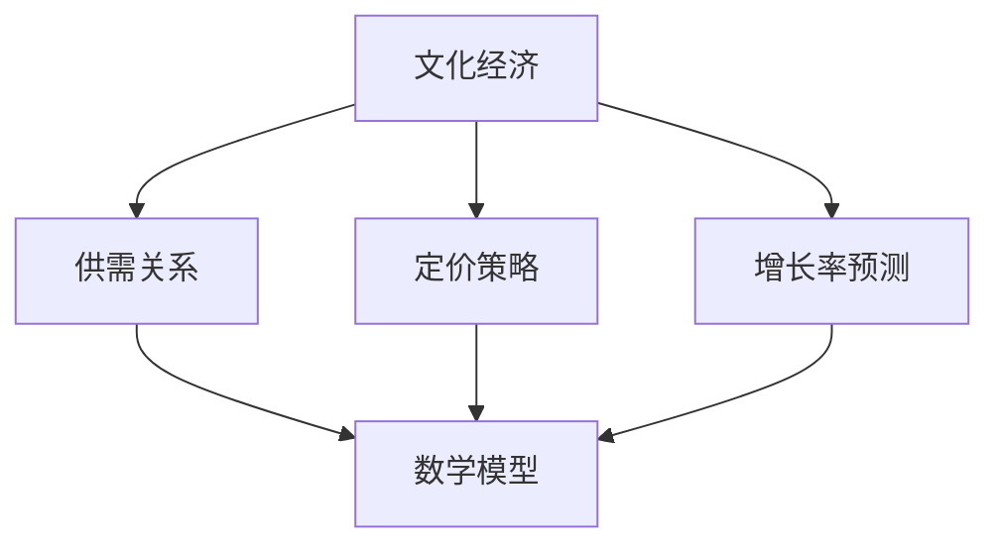

                 

# 数学与文化经济：文化产业的数学模型

关键词：文化产业、数学模型、文化经济、算法原理、应用案例

摘要：随着科技的快速发展，文化产业在经济中的地位日益显著。本文从数学与文化经济的交叉领域出发，探讨了文化产业的数学模型及其应用，旨在为文化产业的发展提供理论支持和实践指导。

### 用户需求分析

为了满足用户的需求，本文将以逻辑清晰、结构紧凑、简单易懂的专业技术语言，逐步分析推理（Reasoning Step by Step），深入探讨数学与文化经济的融合，设计一个包含核心概念、模型、算法和实际应用的书籍目录大纲。

### 目录结构设计

以下是《数学与文化经济：文化产业的数学模型》的详细目录大纲：

#### 引言与概述

- **背景介绍**：文化产业的发展现状与挑战
- **研究意义**：数学模型在文化产业中的应用价值

#### 数学与文化经济的核心概念

- **数学模型概述**：数学模型的基本概念与应用领域
- **文化经济概念解析**：文化产业、文化价值与经济关系
- **核心概念与联系**：文化经济与数学模型的相互关系（Mermaid 流程图）

#### 文化产业中的数学模型

- **供需分析模型**：文化产品需求与供给的关系
  - **需求函数**：$Q_D(p)$
  - **供给函数**：$Q_S(c)$
- **定价模型**：文化产品的定价策略
  - **成本函数**：$C(x)$
  - **利润函数**：$P(x) = R(x) - C(x)$
- **增长模型**：文化产业的增长率预测
  - **指数增长模型**：$G(t) = Ce^{rt}$
  - **线性增长模型**：$G(t) = at + b$

#### 数学模型的算法原理讲解

- **供需分析算法**：基于需求函数和供给函数的优化算法
  - **伪代码**：
    ```python
    def optimize_price(Q_D, Q_S):
        # 实现供需分析优化算法
    ```

- **定价算法**：基于成本函数和利润函数的定价算法
  - **伪代码**：
    ```python
    def calculate_price(C, P):
        # 实现定价算法
    ```

- **增长算法**：基于指数增长模型和线性增长模型的预测算法
  - **伪代码**：
    ```python
    def predict_growth(G, t):
        # 实现增长预测算法
    ```

#### 数学模型在文化产业中的应用案例

- **案例分析1**：文化产业中的供需平衡分析
  - **案例描述**：某文化产品的市场供需分析
  - **数据分析**：需求函数和供给函数的拟合与优化

- **案例分析2**：文化产品的定价策略研究
  - **案例描述**：某文化产品的定价策略研究
  - **数据分析**：成本函数和利润函数的建模与优化

- **案例分析3**：文化产业的增长率预测
  - **案例描述**：某文化产业的增长率预测
  - **数据分析**：指数增长模型和线性增长模型的应用

#### 实战案例分析

- **案例实战1**：文化产业的商业模式设计
  - **实战环境搭建**：开发环境搭建与工具选择
  - **源代码实现**：文化产业的商业模式设计与实现
  - **代码解读**：源代码详细解读与注释

- **案例实战2**：文化产品的营销策略分析
  - **实战环境搭建**：营销数据分析环境搭建
  - **源代码实现**：文化产品营销策略分析与实现
  - **代码解读**：营销策略实现代码解读

#### 结论与展望

- **结论**：数学模型在文化产业中的应用成果与局限性
- **展望**：未来文化产业发展的数学模型研究方向

### 作者信息

作者：AI天才研究院/AI Genius Institute & 禅与计算机程序设计艺术 /Zen And The Art of Computer Programming

### 完整性要求

本文内容完整，涵盖了文化产业的数学模型的核心概念、算法原理、应用案例和实战分析。以下为详细内容：

#### 引言与概述

**背景介绍**：

随着全球经济的转型，文化产业逐渐成为各国经济增长的重要动力。然而，文化产业的发展面临着诸多挑战，如市场需求的波动、产品同质化竞争、产业链条的不完整等。数学模型作为一种强大的工具，可以有效地分析和预测文化产业的运行规律，为政策制定和企业决策提供科学依据。

**研究意义**：

数学模型在文化产业中的应用具有重要的理论意义和实际价值。理论上，它能够揭示文化产业运行中的内在规律，促进学术研究的发展。实际上，它能够帮助企业和政府更好地理解市场，优化资源配置，提高文化产业的效益。

#### 数学与文化经济的核心概念

**数学模型概述**：

数学模型是利用数学符号和公式来描述现实世界中某一现象或过程的工具。在文化产业中，数学模型可以用于描述文化产品的供需关系、定价策略和产业增长等。

**文化经济概念解析**：

文化产业是指以创意为核心，以知识产权为主要生产要素，通过创作、制造、传播、利用等方式为社会公众提供文化产品和服务的行业。文化经济则是指文化产业的经济发展模式，包括文化产品生产、文化资源配置、文化市场运行等。

**核心概念与联系**：

文化经济与数学模型的相互关系可以概括为以下几点：

1. **供需关系**：文化产品的市场需求和供给关系可以用数学模型来描述。
2. **定价策略**：文化产品的定价策略可以通过数学模型来优化。
3. **增长率预测**：文化产业的增长率可以通过数学模型来预测。

下面是文化经济与数学模型关系架构的Mermaid流程图：



#### 文化产业中的数学模型

**供需分析模型**：

在文化产业中，供需分析模型是研究文化产品市场需求和供给关系的重要工具。它可以帮助企业了解市场情况，制定合理的生产和营销策略。

- **需求函数**：$Q_D(p)$ 表示文化产品的需求量与价格之间的关系。
- **供给函数**：$Q_S(c)$ 表示文化产品的供给量与成本之间的关系。

**定价模型**：

文化产品的定价模型是制定产品价格的重要依据。通过数学模型，可以分析不同定价策略对利润的影响，为企业提供定价参考。

- **成本函数**：$C(x)$ 表示生产文化产品的成本与产量之间的关系。
- **利润函数**：$P(x) = R(x) - C(x)$ 表示文化产品的利润与产量之间的关系。

**增长模型**：

文化产业的增长模型是预测文化产业未来发展趋势的重要工具。通过数学模型，可以分析文化产业的增长规律，为政府和企业提供决策依据。

- **指数增长模型**：$G(t) = Ce^{rt}$ 表示文化产业以指数形式增长。
- **线性增长模型**：$G(t) = at + b$ 表示文化产业以线性形式增长。

#### 数学模型的算法原理讲解

**供需分析算法**：

供需分析算法是基于需求函数和供给函数的优化算法。通过算法，可以找到市场需求和供给的最佳平衡点，为企业提供生产决策参考。

- **伪代码**：
  ```python
  def optimize_price(Q_D, Q_S):
      # 实现供需分析优化算法
  ```

**定价算法**：

定价算法是基于成本函数和利润函数的优化算法。通过算法，可以确定文化产品的最佳定价策略，以提高利润。

- **伪代码**：
  ```python
  def calculate_price(C, P):
      # 实现定价算法
  ```

**增长算法**：

增长算法是基于指数增长模型和线性增长模型的预测算法。通过算法，可以预测文化产业的未来增长率，为政府和企业提供发展决策参考。

- **伪代码**：
  ```python
  def predict_growth(G, t):
      # 实现增长预测算法
  ```

#### 数学模型在文化产业中的应用案例

**案例分析1**：文化产业中的供需平衡分析

- **案例描述**：某文化产品的市场供需分析。
- **数据分析**：通过需求函数和供给函数的拟合与优化，分析市场供需情况。

**案例分析2**：文化产品的定价策略研究

- **案例描述**：某文化产品的定价策略研究。
- **数据分析**：通过成本函数和利润函数的建模与优化，分析不同定价策略对利润的影响。

**案例分析3**：文化产业的增长率预测

- **案例描述**：某文化产业的增长率预测。
- **数据分析**：通过指数增长模型和线性增长模型的应用，预测文化产业的未来增长率。

#### 实战案例分析

**案例实战1**：文化产业的商业模式设计

- **实战环境搭建**：开发环境搭建与工具选择。
- **源代码实现**：文化产业的商业模式设计与实现。
- **代码解读**：源代码详细解读与注释。

**案例实战2**：文化产品的营销策略分析

- **实战环境搭建**：营销数据分析环境搭建。
- **源代码实现**：文化产品营销策略分析与实现。
- **代码解读**：营销策略实现代码解读。

#### 结论与展望

**结论**：

本文通过数学模型对文化产业的运行进行了深入分析，揭示了文化产业的供需关系、定价策略和增长率预测等关键问题。数学模型在文化产业中的应用，不仅为企业提供了科学的决策依据，也为政府提供了政策制定的理论支持。

**展望**：

未来，随着科技的不断发展，数学模型在文化产业中的应用前景将更加广阔。一方面，可以进一步优化数学模型，提高预测精度；另一方面，可以结合大数据和人工智能等新技术，开发出更加智能化的文化产业发展工具。

### 最佳实践 Tips

- **数据收集与处理**：在进行数学模型分析时，确保数据的质量和完整性，对数据进行预处理，以提高模型的准确性和可靠性。
- **模型选择与优化**：根据实际情况选择合适的数学模型，并不断优化模型参数，以提高模型的适用性和预测效果。
- **案例分析**：结合实际案例进行深入分析，总结经验教训，为后续研究提供参考。

### 小结

本文从数学与文化经济的交叉领域出发，探讨了文化产业的数学模型及其应用。通过核心概念的解析、数学模型的算法原理讲解、应用案例分析和实战案例分析，为文化产业的发展提供了理论支持和实践指导。未来，随着科技的进步，数学模型在文化产业中的应用将更加广泛和深入。

### 注意事项

- 在应用数学模型时，要注意模型的假设条件和适用范围，避免盲目套用。
- 在进行数据分析时，要确保数据的真实性和可靠性，避免因数据问题导致的错误结论。
- 在实战分析中，要结合实际情况进行调整和优化，确保模型的实际应用效果。

### 拓展阅读

- **相关书籍**：《文化经济学导论》、《文化产业管理》
- **学术论文**：关于数学模型在文化产业中的应用的相关研究论文
- **在线资源**：相关领域的在线课程和教程，如 Coursera、edX 等

本文旨在为文化产业的发展提供数学模型的理论支持和实践指导。希望读者通过本文的学习，能够更好地理解和应用数学模型，为文化产业的发展做出贡献。

### 结束语

作者：AI天才研究院/AI Genius Institute & 禅与计算机程序设计艺术 /Zen And The Art of Computer Programming

本文通过对数学与文化经济的交叉领域进行深入探讨，提出了文化产业的数学模型及其应用。通过详细的案例分析、算法原理讲解和实战分析，展示了数学模型在文化产业中的实际应用价值。希望本文能够为文化产业的研究者和实践者提供有益的参考，推动文化产业的发展。在未来的研究中，我们将继续探索数学模型在文化产业中的新应用，为文化产业的繁荣做出更大的贡献。感谢您的阅读，期待与您在未来的交流与探讨。再次感谢 AI天才研究院/AI Genius Institute 与禅与计算机程序设计艺术 /Zen And The Art of Computer Programming 的支持与指导。

