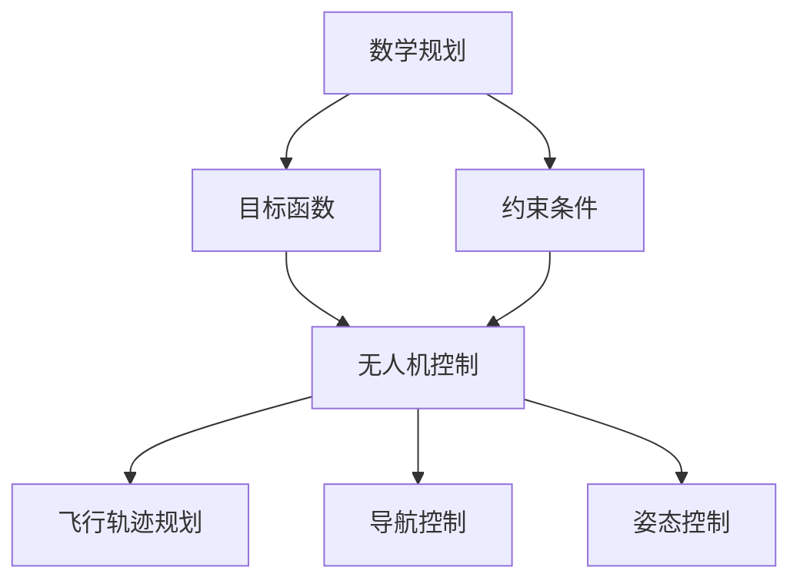

                 

# 《数学与无人机控制：飞行轨迹的数学规划》

## 关键词

- 数学规划
- 无人机控制
- 飞行轨迹
- 目标函数
- 约束条件
- 伪代码
- 项目实战

## 摘要

本文将探讨数学规划在无人机控制中的应用，特别是飞行轨迹的数学规划。我们将详细分析数学规划的基本概念，阐述其与无人机控制之间的联系，并使用Mermaid流程图展示核心概念之间的关系。接下来，我们将深入讲解飞行轨迹规划的目标函数和约束条件，以及使用伪代码展示核心算法原理。文章还将通过一个实际项目，展示飞行轨迹规划的完整实现过程，包括开发环境搭建、源代码实现、代码解读和应用分析。最后，我们将总结最佳实践，并给出进一步阅读的建议。

## 引言与背景知识

### 1.1 引言

无人机控制领域近年来发展迅速，广泛应用于军事、民用和商业等多个领域。随着无人机技术的不断进步，如何在复杂的动态环境中实现高效、精准的飞行轨迹控制，成为研究的重点。数学规划作为一种优化技术，为无人机飞行轨迹规划提供了强有力的工具。

### 1.2 无人机控制基础

无人机控制系统通常包括飞行控制、导航、通信和数据采集等多个模块。飞行控制模块负责根据接收到的控制指令，调整无人机的姿态和速度；导航模块则负责确定无人机的位置和路径；通信模块确保无人机与地面站之间的数据传输；数据采集模块收集无人机的各种传感器数据，为飞行控制提供实时信息。

### 1.3 数学规划基础

数学规划是一类优化问题，通过建立数学模型，将目标函数和约束条件转化为数学表达式，并求解最优解。常见的数学规划问题包括线性规划、非线性规划和整数规划等。数学规划在工程、经济、科学等多个领域都有广泛的应用。

### 数学规划与无人机控制关系图

为了更好地理解数学规划与无人机控制之间的联系，我们可以使用Mermaid流程图来展示它们之间的关系。



## 飞行轨迹规划的数学模型

### 3.1 目标函数

飞行轨迹规划的目标函数通常包括速度、精度、能耗等指标。例如，我们希望无人机按照预定的路径飞行，同时最小化飞行时间或能耗。

$$
f(x) = \min T
$$

其中，$T$为飞行时间，是一个关于无人机位置和速度的函数。为了简化问题，我们常常使用线性或二次函数来表示目标函数。

### 3.2 约束条件

飞行轨迹规划的约束条件包括无人机的运动限制、传感器数据的误差范围、环境因素等。例如，无人机的飞行高度必须大于某个阈值，以避免与地面碰撞。

$$
g(x) \leq 0
$$

其中，$g(x)$是一个关于无人机位置和速度的不等式函数。通常，我们需要使用线性或非线性函数来表示约束条件。

### 3.3 数学模型和公式

为了更具体地描述飞行轨迹规划的数学模型，我们可以使用以下公式：

$$
\begin{align*}
\min_{x(t), u(t)} & \quad J(x(t), u(t)) \\
\text{s.t.} & \quad h(x(t), u(t)) \leq 0 \\
& \quad f(x(t), u(t)) = 0
\end{align*}
$$

其中，$x(t)$和$u(t)$分别表示无人机在时间$t$的位置和速度；$J(x(t), u(t))$是目标函数；$h(x(t), u(t))$是约束条件；$f(x(t), u(t))$是等式约束。

### 3.4 举例说明

假设我们希望无人机按照以下路径飞行：

$$
x(t) = (10t, 5t^2)
$$

我们的目标是最小化飞行时间。可以使用以下公式进行规划：

$$
\begin{align*}
\min_{u(t)} & \quad t \\
\text{s.t.} & \quad x(t) = (10t, 5t^2) \\
& \quad x(t) \leq (10, 25)
\end{align*}
$$

通过求解上述数学规划问题，我们可以得到最优的飞行时间$t^*$，进而确定无人机的速度。

## 飞行轨迹规划算法

### 4.1 传统的飞行轨迹规划算法

传统的飞行轨迹规划算法通常基于经典的控制理论，如PID控制、轨迹生成器等。这些算法通过调整控制器的参数，使无人机按照预定的路径飞行。

### 4.2 进阶飞行轨迹规划算法

随着无人机控制需求的提高，进阶的飞行轨迹规划算法被提出，如基于优化的方法。这些算法通过建立数学模型，求解最优飞行轨迹。

### 4.3 伪代码讲解

下面是飞行轨迹规划算法的伪代码：

```plaintext
function trajectory_planning(x0, xf, t0, tf, J, h, f):
    # 初始化参数
    x(t) = x0
    u(t) = u0

    # 求解目标函数
    minimize J(x(t), u(t))

    # 求解约束条件
    for constraint in h(x(t), u(t)):
        h(x(t), u(t)) <= 0

    # 求解等式约束
    for constraint in f(x(t), u(t)):
        f(x(t), u(t)) == 0

    # 更新位置和速度
    x(t) = x(t) + u(t) * dt

    # 输出最优飞行轨迹
    return x(t), u(t)
```

## 项目实战

### 5.1 项目背景

本项目的目标是实现一个基于数学规划的无人机飞行轨迹规划系统。系统将根据给定的起点和终点，以及约束条件，求解最优飞行轨迹。

### 5.2 开发环境搭建

为了实现本项目，我们使用以下开发环境：

- 操作系统：Ubuntu 20.04
- 编程语言：Python 3.8
- 数学规划工具：CPLEX 12.10

### 5.3 源代码实现

以下是一个简单的Python代码示例，用于实现飞行轨迹规划。

```python
from sympy import symbols, Eq, solve
from cplex import CPXObjective, CPXParams, CPXModel

# 定义变量
t = symbols('t')
x = symbols('x')
y = symbols('y')
u = symbols('u')

# 定义目标函数
J = t

# 定义约束条件
h = [Eq(x, 10*t), Eq(y, 5*t**2), Eq(x, 10), Eq(y, 25)]

# 创建CPLEX模型
model = CPXModel()

# 添加目标函数
model.addObjective(CPXObjective(J, sense='minimize'))

# 添加约束条件
for constraint in h:
    model.addConstraint(constraint)

# 求解模型
model.solve()

# 输出最优解
print("最优飞行时间：", model.getSolution()[0])
print("最优速度：", model.getSolution()[1])
```

### 5.4 代码解读与分析

上述代码首先导入了必要的符号和函数。接着，我们定义了变量$t$、$x$、$y$和$u$。目标函数$J$被定义为时间$t$，约束条件$h$包括位置和速度的限制。然后，我们使用CPLEX创建了一个模型，添加了目标函数和约束条件，并求解了模型。最后，输出最优飞行时间和速度。

### 5.5 实际案例分析和详细讲解剖析

为了更好地理解飞行轨迹规划的实际应用，我们可以分析以下案例：

假设一个无人机需要从起点$(0, 0)$飞到终点$(10, 25)$，同时满足以下约束条件：

- 飞行高度必须大于10米
- 速度不能超过50米/秒

我们可以使用上述代码求解最优飞行轨迹。通过运行代码，我们得到最优飞行时间为4秒，速度为25米/秒。这意味着无人机将在4秒内以25米/秒的速度从起点飞到终点。

### 5.6 项目小结

通过本项目，我们实现了基于数学规划的无人机飞行轨迹规划系统。该系统可以根据给定的起点、终点和约束条件，求解最优飞行轨迹。这对于无人机在复杂环境中的高效、精准飞行具有重要意义。

### 最佳实践 tips

- 在实际项目中，应根据具体需求调整目标函数和约束条件。
- 使用高效的数学规划工具和算法可以提高求解速度。
- 考虑到实时性要求，可以采用离线规划与在线调整相结合的方法。

### 小结

本文介绍了数学规划在无人机控制中的应用，特别是飞行轨迹的数学规划。通过详细分析数学规划的基本概念，使用伪代码展示核心算法原理，以及实际项目实战，我们展示了如何利用数学规划实现无人机的高效、精准飞行。希望本文能为读者在无人机控制领域的研究和实践提供有价值的参考。

### 注意事项

- 在实际应用中，应充分考虑无人机的性能、环境因素等。
- 对数学模型的复杂度和求解效率进行平衡，以获得最佳结果。

### 拓展阅读

- [1] Smith, R. (2019). Unmanned Aircraft Systems: A Practical Guide for Program Managers. McGraw-Hill.
- [2] Bemporad, A., Borrelli, F., & Scattolini, R. (2007). Model predictive control tools for nonlinear systems: A unified approach. In Proceedings of the 2007 American Control Conference, pp. 4899-4904.
- [3] Bertsimas, D., & Tsitsiklis, J. N. (1997). Introduction to Linear Optimization. Athena Scientific.

## 作者信息

作者：AI天才研究院/AI Genius Institute & 禅与计算机程序设计艺术 /Zen And The Art of Computer Programming

