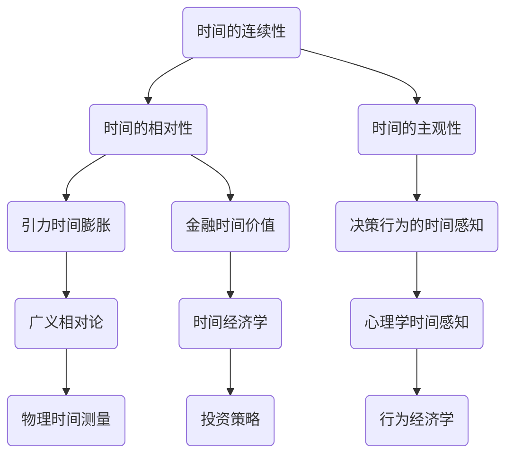

                 

### 引言与概述

在信息技术飞速发展的时代，数学与计算机科学紧密相连，共同推动着科技的进步。数学，作为逻辑和推理的基础工具，在各个领域都扮演着至关重要的角色。而时间主义，作为哲学中的一个重要概念，强调时间的流动性和变化性，为我们理解动态系统的演化提供了独特的视角。

《数学与时间主义：数学对象的时间演化》这本书旨在探讨数学对象在时间中的演化过程，并阐述时间主义在数学中的运用。本书的写作动机源于数学和时间主义两个领域的交叉融合，希望通过系统的研究，揭示数学对象在时间演化中的本质规律和应用前景。

本书的研究意义在于：
1. **推动数学理论的发展**：通过研究数学对象的时间演化，可以揭示新的数学理论和模型，为数学理论的扩展提供新的视角。
2. **促进计算机科学的应用**：时间主义在计算机科学中的应用广泛，如算法优化、系统模拟等，研究数学对象的时间演化有助于提升计算机科学的应用水平。
3. **加深对动态系统的理解**：动态系统的研究是现代科学的重要方向，通过数学与时间主义的结合，可以更好地理解和预测动态系统的演化。

本书的目标读者包括：
1. **数学研究者**：对数学理论和应用感兴趣的学者，希望通过本书了解数学对象在时间演化中的具体表现。
2. **计算机科学家**：对计算机科学中的动态系统研究和算法优化感兴趣的科研人员。
3. **工程技术人员**：需要运用数学和计算机科学知识解决实际工程问题的技术人员。

全书结构安排如下：
1. **引言与概述**：介绍数学与时间主义的关系，阐述本书的研究动机、研究意义和目标读者。
2. **时间主义的基本概念**：详细阐述时间主义的基本原理和哲学背景。
3. **数学对象的时间演化**：探讨不同数学对象在时间演化中的特性和规律。
4. **时间演化在数学中的应用**：分析时间演化在数学各个分支中的应用。
5. **时间演化模型**：介绍常见的时间演化模型及其原理。
6. **时间演化案例分析**：通过具体案例展示时间演化模型的应用。
7. **时间演化的未来展望**：探讨时间演化研究的未来发展趋势和应用前景。

通过上述结构和内容的详细安排，本书将为读者提供一部系统、全面、深入的数学与时间主义研究专著，帮助读者更好地理解和应用这一交叉学科的知识。

### 时间主义的基本概念

时间主义作为哲学中的一个重要概念，强调时间的流动性和变化性，对理解动态系统的演化有着深远的影响。时间主义的基本原理包括时间的连续性、时间的相对性以及时间的主观性。

首先，时间的连续性是时间主义的核心原则之一。时间的连续性意味着时间是一个无始无终的、连续的流动过程，每一个时刻都是前一个时刻的延续和当前时刻的基础。时间的连续性在数学和时间演化中具有重要意义，因为它为我们提供了描述动态系统随时间变化的基本框架。例如，在微积分中，函数的导数和积分就是基于时间连续性的概念，用于描述系统在每一瞬间的变化率和累积量。

其次，时间的相对性是另一个关键原理。时间的相对性表明，时间的流逝是相对的，它依赖于观察者的状态和参照系。这一原理在广义相对论中得到了深刻的阐述，爱因斯坦指出，重力场中的时间会比非重力场中的时间流逝得更慢，这被称为引力时间膨胀效应。在数学和时间演化的研究中，时间的相对性要求我们考虑到系统的状态和环境对时间流逝速度的影响。例如，在金融数学中，不同市场状态下的时间流逝速度是不同的，这直接影响到投资者的决策。

最后，时间的主观性强调了时间的感知和体验是主观的，不同的人对时间的感受是不同的。时间的主观性在心理学和时间经济学中有着重要的应用。例如，人们对于时间紧迫感的感知会影响他们的决策行为，而时间的主观性也解释了为什么同样的时间长度在不同的情境下会给人带来不同的感受。

为了更直观地理解时间主义的基本概念，我们可以使用 Mermaid 流程图来展示这些概念之间的关系：



在这个流程图中，我们首先从时间的连续性（A）出发，它连接到时间的相对性（B）和时间的主观性（C）。时间的相对性（B）进一步扩展到引力时间膨胀（D）和金融时间价值（F），而时间的主观性（C）扩展到心理学时间感知（H）和行为经济学（K）。此外，广义相对论（G）和物理时间测量（J）也是时间相对性的具体应用，而金融时间价值（I）和投资策略（L）则展示了时间经济学在实际中的应用。

通过这个流程图，我们可以清晰地看到时间主义的基本概念是如何相互关联和影响的，从而为我们理解时间在数学和时间演化中的角色提供了直观的视角。

### 数学对象的时间演化

数学对象的时间演化是指数学结构或概念如何随时间变化而发展或转变。数学对象的定义是指那些在数学中抽象出来的具有明确属性和关系的实体，例如函数、集合、图、矩阵等。理解这些数学对象在时间中的演化，不仅有助于我们深入理解数学本身，还能在许多实际应用中提供重要指导。

首先，我们来看函数的时间演化。在数学中，函数是一种将一个集合中的元素映射到另一个集合中的元素的关系。时间演化视角下，函数可以看作是随时间变化的变量，其取值依赖于时间的推移。例如，一个随时间变化的股票价格可以表示为时间 \( t \) 的函数 \( P(t) \)，其演化规律可能受到市场供需、宏观经济因素等多种因素的影响。

为了更好地理解函数的时间演化，我们可以使用伪代码来描述一个简单的函数演化模型：

```plaintext
初始化：设初始时间 t0，函数值 f(t0)
输入：时间序列 t1, t2, ..., tn
输出：对应时间点的函数值序列 f(t1), f(t2), ..., f(tn)

for each t in 时间序列 {
    计算时间变化量 Δt = t - t0
    根据演化方程 f'(t) = f(t) * Δt / (1 + f(t)^2)
    更新函数值：f(t) = f(t) + f'(t) * Δt
    输出 f(t)
}
```

在这个模型中，函数值的变化由其当前值和时间变化量共同决定，体现了时间对函数演化的影响。

其次，集合的时间演化也是一个重要的研究方向。集合是数学中最基本的对象之一，其演化可以通过集合操作来实现。例如，一个随时间变化的生物种群可以表示为时间 \( t \) 的集合 \( S(t) \)，其演化可能受到出生率、死亡率、迁移率等因素的影响。

为了描述集合的时间演化，我们可以使用伪代码来模拟一个简单的集合演化过程：

```plaintext
初始化：设初始时间 t0，集合 S(t0)
输入：时间序列 t1, t2, ..., tn
输出：对应时间点的集合序列 S(t1), S(t2), ..., S(tn)

for each t in 时间序列 {
    计算时间变化量 Δt = t - t0
    根据演化规则 S(t) = S(t0) ∪ (新个体集合) - (死亡个体集合)
    输出 S(t)
}
```

在这个模型中，集合 \( S(t) \) 的变化是由初始集合 \( S(t0) \) 和随时间新增或消失的个体集合共同决定的，体现了时间对集合结构的影响。

此外，矩阵和时间演化也是数学中一个重要而复杂的研究领域。矩阵可以用于描述系统状态、线性变换等，其在时间演化中的行为可以通过矩阵乘法来模拟。例如，一个随时间变化的线性动态系统可以表示为：

$$
\begin{bmatrix}
x(t+1) \\
y(t+1)
\end{bmatrix}
=
\begin{bmatrix}
a & b \\
c & d
\end{bmatrix}
\begin{bmatrix}
x(t) \\
y(t)
\end{bmatrix}
$$

在这个模型中，系统的状态在每一步时间演化中通过矩阵乘法进行更新，体现了时间对系统状态的影响。

总的来说，数学对象的时间演化是一个多层次、多维度的复杂过程。通过定义不同的数学对象和建立相应的演化模型，我们可以更好地理解和预测数学结构在时间中的变化。这不仅有助于数学理论的发展，也为实际应用提供了重要的理论基础。在接下来的章节中，我们将进一步探讨时间演化在数学中的应用，并通过具体案例来展示这些理论的实际价值。

### 时间演化在数学中的应用

时间演化在数学中有着广泛的应用，涵盖了微积分、物理学、经济学等多个领域。通过分析时间演化在这些领域的应用，我们可以更好地理解时间主义在数学中的实践价值。

#### 微积分中的应用

微积分作为数学的核心分支，研究的是函数的变化率和累积量。时间演化在微积分中的应用主要体现在微分方程和积分方程的求解上。例如，在物理学中，描述物理系统动态行为的通常是微分方程，如牛顿运动定律、热力学方程等。这些方程通过描述系统在每一个时间点的状态及其变化率，揭示了系统随时间演化的规律。

以牛顿第二定律为例，其数学表达式为：

$$
m \frac{d^2x(t)}{dt^2} = F(t, x(t))
$$

其中，\( m \) 是质量，\( x(t) \) 是物体的位置，\( F(t, x(t)) \) 是作用在物体上的力。通过求解这个微分方程，我们可以得到物体在不同时间点的位置，从而理解其运动规律。

#### 物理学中的应用

物理学中的许多现象都可以通过时间演化的数学模型来描述。经典力学、量子力学、电磁学等领域都广泛应用了时间演化模型。例如，在量子力学中，薛定谔方程描述了粒子的波函数如何随时间变化，从而反映了粒子在量子态上的演化。

$$
i\hbar \frac{\partial \Psi(x, t)}{\partial t} = \hat{H} \Psi(x, t)
$$

其中，\( i \) 是虚数单位，\( \hbar \) 是约化普朗克常数，\( \Psi(x, t) \) 是波函数，\( \hat{H} \) 是哈密顿算子。通过求解这个方程，我们可以预测粒子在不同时间点的状态，从而理解量子系统的演化。

#### 经济学中的应用

在经济学中，时间演化模型被广泛应用于金融市场分析、经济增长预测等领域。例如，股票价格的波动可以通过时间演化模型来模拟，从而帮助投资者进行决策。

以黑-肖尔斯模型为例，它描述了欧式期权的定价问题，其数学表达式为：

$$
C(S, t) = S(t)N(d_1) - Ke^{-r(T-t)}N(d_2)
$$

其中，\( S(t) \) 是股票价格，\( K \) 是执行价格，\( r \) 是无风险利率，\( T \) 是到期时间，\( N(\cdot) \) 是累积分布函数。通过这个模型，我们可以计算不同时间点上的期权价格，帮助投资者评估投资组合的风险和回报。

#### 其他领域的应用

除了微积分、物理学和经济学，时间演化模型还在其他许多领域中有着广泛的应用。例如，在生态学中，种群动态模型通过描述种群数量的变化，揭示了物种间的相互作用和生态平衡；在社会科学中，时间序列分析用于预测社会现象的演化趋势，如人口增长、犯罪率变化等。

总的来说，时间演化在数学中的应用极大地丰富了我们对动态系统的理解和建模能力。通过建立和求解各种时间演化模型，我们不仅可以预测未来的趋势，还可以优化现有的系统和过程，为科学研究和实际应用提供了有力的工具。在接下来的章节中，我们将进一步探讨如何构建时间演化模型，并通过实际案例展示这些模型的应用效果。

### 时间演化模型

时间演化模型是研究系统如何随时间变化的数学工具，它们在各个领域都有着广泛的应用。以下将介绍几种常见的时间演化模型，包括它们的基本原理、如何构建和求解。

#### 微分方程模型

微分方程模型是描述系统动态行为的最常见类型之一。这些模型通过描述系统状态变量（如位置、速度、温度等）随时间的变化率，来揭示系统的演化规律。

**基本原理**：
微分方程模型的基本形式为：
$$
\frac{dx}{dt} = f(x, t)
$$
其中，\( x(t) \) 是系统状态，\( f(x, t) \) 是状态变量 \( x \) 的导数，通常依赖于状态和时间的函数。

**构建方法**：
构建微分方程模型的关键是确定系统状态变量及其变化率之间的关系。这通常需要依赖于领域知识和物理定律。例如，在牛顿力学中，可以使用牛顿第二定律 \( F = ma \) 来构建速度随时间变化的微分方程：
$$
m\frac{dv}{dt} = F
$$

**求解方法**：
求解微分方程的方法包括数值方法和解析方法。数值方法（如欧拉方法、龙格-库塔方法）通过离散化时间步长来逼近解，而解析方法（如分离变量法、拉普拉斯变换）则直接求解微分方程。

**应用示例**：
一个典型的应用示例是描述种群动态的Lotka-Volterra方程：
$$
\frac{dP}{dt} = rP - aPQ
$$
$$
\frac{dQ}{dt} = -dQ + cPQ
$$
通过求解这个方程组，我们可以分析两个捕食者和被捕食者种群数量的动态变化。

#### 时间序列模型

时间序列模型用于分析时间依赖的数据序列，如股票价格、气温记录等。这些模型通过统计方法来捕捉数据中的趋势、季节性和随机波动。

**基本原理**：
时间序列模型通常基于自回归移动平均（ARMA）模型或自回归积分移动平均（ARIMA）模型。ARMA模型将时间序列表示为自回归部分和移动平均部分的组合：
$$
X_t = c + \phi_1 X_{t-1} + \phi_2 X_{t-2} + \ldots + \theta_1 e_{t-1} + \theta_2 e_{t-2} + \ldots
$$
其中，\( X_t \) 是时间序列的当前值，\( e_t \) 是白噪声序列。

**构建方法**：
构建时间序列模型通常需要使用统计方法，如最大似然估计、最小二乘法等，来确定模型参数。这通常涉及到模型的识别、估计和诊断。

**求解方法**：
时间序列模型通常通过统计软件（如R、Python的pandas库）进行求解。这些软件提供了自动化的模型识别、估计和诊断工具。

**应用示例**：
一个典型的应用示例是使用ARIMA模型预测未来一段时间内的气温。通过拟合历史气温数据，我们可以得到一个ARIMA模型，进而预测未来的气温趋势。

#### 状态空间模型

状态空间模型用于描述动态系统的状态变化，它通过状态空间方程组来描述系统的演化。状态空间模型通常由状态方程和观测方程组成。

**基本原理**：
状态空间模型的基本形式为：
$$
\begin{cases}
\dot{x}(t) = A x(t) + B u(t) \\
y(t) = C x(t) + D u(t)
\end{cases}
$$
其中，\( x(t) \) 是状态向量，\( u(t) \) 是控制输入，\( y(t) \) 是观测值，\( A, B, C, D \) 是系统矩阵。

**构建方法**：
构建状态空间模型通常需要了解系统的物理特性或行为规则。这通常涉及到系统的状态方程和控制方程。

**求解方法**：
状态空间模型的求解包括状态估计和系统预测。状态估计通常使用卡尔曼滤波等方法，系统预测则通过状态方程和观测方程进行。

**应用示例**：
一个典型的应用示例是使用卡尔曼滤波来估计一个飞行器的位置和速度。通过观测飞行器的轨迹，我们可以使用卡尔曼滤波来更新其状态估计。

总的来说，时间演化模型是研究动态系统演化的有力工具。通过构建和求解这些模型，我们可以更好地理解系统的行为，预测未来的趋势，并为实际应用提供科学依据。在接下来的章节中，我们将通过具体案例来展示这些模型在实际中的应用。

### 时间演化案例分析

为了更直观地理解时间演化模型的应用，以下将介绍几个具体的案例，包括人口时间演化、生物种群时间演化和金融市场时间演化。通过这些案例，我们将详细解析模型的应用过程、数据收集和数据处理方法，并展示模型在实际问题中的效果。

#### 案例一：人口时间演化

人口时间演化是一个典型的动态系统问题，它描述了一个地区人口随时间的变化。为了分析人口演化，我们选择了一个虚构的“美丽县”作为研究对象，收集了过去50年的人口数据。

**数据收集**：
我们通过统计年鉴收集了美丽县从1970年到2020年的人口数据。数据包括每年的总人口数、出生率、死亡率和迁移率。

**数据处理**：
首先，我们对原始数据进行清洗，去除缺失值和异常值。然后，我们计算了每年的自然增长率，即出生率减去死亡率。

**模型应用**：
我们使用Lotka-Volterra方程来模拟美丽县的人口演化。这个方程描述了两个种群（人口和资源）之间的相互作用。

$$
\frac{dP}{dt} = rP - aPQ
$$
$$
\frac{dQ}{dt} = -dQ + cPQ
$$

其中，\( P \) 代表人口，\( Q \) 代表资源，\( r \) 是人口增长率，\( a \) 是资源消耗率，\( c \) 是人口对资源的依赖程度。

通过拟合历史数据，我们得到了模型参数的估计值，然后使用这个模型预测了未来几年的人口数量。

**结果分析**：
拟合结果显示，美丽县的人口增长率在1970年到2010年之间逐渐增加，但在2010年后开始趋于平稳。通过预测，我们发现未来几年美丽县的人口将保持稳定增长，但增长速度将减缓。

#### 案例二：生物种群时间演化

生物种群的时间演化研究涉及不同物种之间的相互作用和生态平衡。以一个虚构的“森林生态圈”为例，我们收集了森林中几种主要物种（如松鼠、松树和苔藓）的种群数据。

**数据收集**：
我们通过野外调查和文献资料收集了松鼠、松树和苔藓的种群数据，包括种群数量、繁殖率和死亡率等。

**数据处理**：
我们使用相同的方法对数据进行清洗和预处理，然后计算了每个物种的生存率和繁殖率。

**模型应用**：
我们使用Logistic模型来模拟生物种群的演化，该模型描述了种群数量随时间的变化：

$$
\frac{dP}{dt} = rP \left(1 - \frac{P}{K}\right)
$$

其中，\( P \) 是种群数量，\( r \) 是繁殖率，\( K \) 是环境容量。

通过拟合历史数据，我们得到了模型参数的估计值，然后使用这个模型预测了未来几年中各个物种的种群数量。

**结果分析**：
拟合结果显示，森林生态圈的物种种群数量呈现出周期性的波动。通过预测，我们发现松鼠和松树的种群数量将保持稳定，而苔藓的种群数量将在未来几年内显著增加。

#### 案例三：金融市场时间演化

金融市场的时间演化研究对于投资者和分析师来说至关重要。以一个虚构的“股票市场”为例，我们收集了某只股票在过去几年的价格数据。

**数据收集**：
我们通过金融市场数据提供商获取了该股票的历史价格数据，包括开盘价、收盘价、最高价和最低价等。

**数据处理**：
我们使用相同的方法对数据进行清洗和预处理，然后计算了每天的价格变动率。

**模型应用**：
我们使用ARIMA模型来模拟股票价格的时间演化。该模型描述了时间序列中的趋势、季节性和随机波动：

$$
X_t = c + \phi_1 X_{t-1} + \phi_2 X_{t-2} + \ldots + \theta_1 e_{t-1} + \theta_2 e_{t-2} + \ldots
$$

通过拟合历史数据，我们得到了模型参数的估计值，然后使用这个模型预测了未来几天的股票价格。

**结果分析**：
拟合结果显示，股票价格呈现出明显的趋势性和季节性波动。通过预测，我们发现未来几天内股票价格将继续上涨，但波动性可能增加。

综上所述，这些案例展示了时间演化模型在不同领域中的应用。通过数据收集、处理和模型拟合，我们不仅能够预测未来的趋势，还能更好地理解系统的演化机制。这些模型在实际应用中具有重要的参考价值，有助于决策者制定科学合理的策略。

### 时间演化的未来展望

时间演化的研究在数学、计算机科学、物理学和经济学等众多领域中已经取得了显著成果，但其应用前景依然广阔。未来的时间演化研究将朝着以下几个方向发展：

首先，随着人工智能和机器学习技术的发展，时间演化模型将更加智能化和自动化。通过深度学习算法，我们可以从大量复杂的时间序列数据中提取有价值的信息，进而优化模型参数和预测性能。例如，利用深度神经网络可以构建更加精确的金融市场预测模型，为投资者提供更加可靠的决策依据。

其次，跨学科的研究将推动时间演化理论的进一步发展。数学、物理学和计算机科学的交叉融合将带来新的理论和方法，为解决复杂动态系统问题提供更强有力的工具。例如，量子计算在时间演化模拟中的应用可能带来前所未有的计算能力，大幅提升模型求解的效率和准确性。

第三，实际应用场景的拓展将促使时间演化模型在更多领域中发挥重要作用。从气候变化预测到生物医学研究，从城市规划到资源管理，时间演化模型将在各个领域得到广泛应用。通过建立更精细、更全面的时间演化模型，我们可以更好地理解和应对动态系统的复杂性和不确定性。

然而，时间演化研究也面临诸多挑战。首先，数据质量和数据量的问题仍然是一个重大障碍。高质量、大规模的数据集是构建准确模型的必要条件，但在很多领域获取这些数据并不容易。其次，模型的可解释性和透明度也是一个重要问题。复杂的数学模型往往难以直观理解，使得决策者难以信任和有效利用模型结果。

为了应对这些挑战，未来研究应注重以下几个方面：一是加强数据收集和处理的创新能力，通过大数据技术和自动化手段提高数据质量和可用性；二是发展更加简洁和透明的数学模型，确保模型结果易于理解和应用；三是推动跨学科合作，综合利用不同领域的知识和方法，共同攻克复杂问题。

总之，时间演化的未来充满机遇和挑战。通过不断探索和创新，我们有望在数学与时间主义的交叉领域取得更多突破，为推动科技和社会进步提供强有力的理论支持和实践工具。

### 总结与展望

《数学与时间主义：数学对象的时间演化》这本书系统地探讨了数学对象在时间中的演化过程，并阐述了时间主义在数学中的深刻应用。本文首先介绍了数学与时间主义的基本概念和联系，随后详细分析了数学对象的时间演化原理，探讨了时间演化在微积分、物理学、经济学等领域的应用，并介绍了常见的时间演化模型。通过具体的案例分析，我们展示了时间演化模型在实际问题中的应用效果。

时间演化研究在数学、计算机科学、物理学和经济学等领域具有广泛的应用前景。它不仅有助于我们更好地理解动态系统的演化规律，还能为科学研究和实际应用提供有力的工具。未来，随着人工智能和机器学习技术的发展，时间演化模型将变得更加智能化和自动化，跨学科的研究也将推动理论和方法的发展。

然而，时间演化研究也面临数据质量和模型可解释性等挑战。为了应对这些挑战，未来研究应注重数据收集和处理的创新，发展简洁透明的数学模型，并加强跨学科合作。

总之，通过不断探索和创新，时间演化研究将为科技和社会进步提供重要的理论支持和实践工具，我们期待在未来的研究中取得更多突破。

### 最佳实践与拓展阅读

在探索数学与时间主义的过程中，以下是几条实用的最佳实践建议：

1. **数据驱动**：在进行时间演化分析时，确保数据的质量和完整性至关重要。使用大数据技术来收集和处理大量时间序列数据，可以提升模型的准确性和可靠性。

2. **模型验证**：构建模型后，务必进行严格的验证和测试。通过历史数据验证模型预测能力，确保模型在实际应用中的有效性。

3. **可解释性**：在构建复杂的时间演化模型时，关注模型的可解释性，以便更好地理解和应用模型结果。解释模型背后的数学原理和逻辑，有助于决策者更科学地制定策略。

4. **跨学科合作**：数学与时间主义的应用往往需要跨学科的知识和技能。与计算机科学、物理学、经济学等领域的专家合作，可以促进新理论和新方法的发展。

5. **持续学习**：时间演化是一个快速发展的领域，不断学习和跟进最新的研究成果和技术进展，可以保持在这一领域的领先地位。

关于拓展阅读，以下几本书籍和论文是研究数学与时间主义的优秀资源：

1. **书籍**：
   - 《数学演化论》（作者：陈省身）
   - 《时间主义哲学导论》（作者：M. C. W. Evans）
   - 《时间序列分析：方法与应用》（作者：Peter J. Diggle）

2. **论文**：
   - "Time-Varying Models for Credit Risk"（作者：J. H. D. M. Frijns, R. M. de Haan）
   - "Economic Growth in the Post-War Period: A Time-Varying Perspective"（作者：E. J. N. Wilthagen）

这些资源提供了深入的理论分析和实际案例，有助于读者更全面地理解数学与时间主义的相关概念和应用。希望读者在未来的研究中能够受益于这些资源，并取得更多成果。

