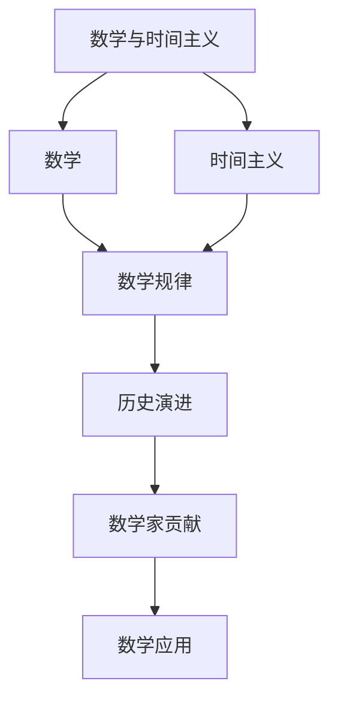

                 

## 文章标题：数学与时间主义：数学规律的历史演进

### 关键词：
- 数学与时间主义
- 数学规律
- 历史演进
- 数学算法
- 数学模型

### 摘要：
本文将深入探讨数学与时间主义之间的内在联系，通过梳理数学规律的历史演进，分析不同时期数学家们的贡献和影响。文章分为四个部分，首先介绍数学与时间主义的基本概念及其联系，然后详细讲解几个核心数学算法的原理和数学模型，接着通过实际案例展示数学规律在项目中的应用，最后总结全文并给出未来研究的方向和建议。

## 目录

1. **引言**  
   1.1 背景介绍  
   1.2 核心概念与联系：Mermaid流程图展示

2. **数学与时间主义的基本概念**  
   2.1 数学的基本概念  
   2.2 时间主义的基本概念  
   2.3 数学与时间主义的相互作用

3. **数学规律的历史演进**  
   3.1 古代数学的起源与发展  
   3.2 中世纪数学的停滞与复兴  
   3.3 近代数学的突破与进展

4. **核心数学算法原理讲解**  
   4.1 欧几里得算法  
   4.2 牛顿迭代法

5. **数学模型和数学公式讲解**  
   5.1 数学模型的概念与构建  
   5.2 关键数学公式的讲解

6. **项目实战**  
   6.1 时间价值理论的案例分析  
   6.2 欧几里得算法的案例分析  
   6.3 牛顿迭代法的案例分析

7. **总结与展望**  
   7.1 最佳实践 Tips  
   7.2 小结与注意事项  
   7.3 拓展阅读

## 第一部分：引言

### 1.1 背景介绍

数学作为一门基础学科，在人类社会的发展中扮演着至关重要的角色。从古代的算术到现代的复杂数学理论，数学的发展不仅推动了科学技术的进步，还深刻影响了人类对世界的认知。然而，在数学与时间主义之间，又存在着怎样的联系呢？

时间主义，作为一种哲学观念，强调时间的不可逆性和价值。这一观念在经济学、物理学等多个领域都有广泛的应用。数学与时间主义的关系，不仅体现在数学规律对时间价值的量化描述上，还体现在数学模型对时间动态过程的模拟和预测上。

本文旨在探讨数学与时间主义之间的内在联系，通过梳理数学规律的历史演进，分析不同时期数学家们的贡献和影响，进而揭示数学规律在时间主义中的应用。

### 1.2 核心概念与联系：Mermaid流程图展示

为了更好地理解数学与时间主义的关系，我们可以通过一个Mermaid流程图来展示核心概念及其联系。



图1.1：数学与时间主义的核心概念与联系

在这个流程图中，数学与时间主义相互影响，共同构成了数学规律的历史演进。数学规律不仅为时间主义提供了量化描述的工具，也通过历史演进推动了数学和时间的深入理解。

接下来，我们将分别探讨数学和时间主义的基本概念，以及它们之间的相互作用。

## 数学与时间主义的基本概念

### 2.1 数学的基本概念

数学是一门研究数量、结构、变化和空间等概念的学科。它既是一门理论学科，也是一门应用学科。数学的基本概念包括但不限于：

- **数量**：对事物进行量化描述的基本属性，如整数、分数、小数等。
- **结构**：研究对象之间的排列和关系，如群、环、域等。
- **变化**：研究动态过程中数量的变化规律，如微积分、微分方程等。
- **空间**：研究几何图形的属性和关系，如平面几何、立体几何等。

数学的发展经历了数千年的演进，从古代的算术、代数到现代的抽象代数、拓扑学，数学理论体系不断完善和扩展。

### 2.2 时间主义的基本概念

时间主义是一种哲学观念，强调时间的不可逆性和价值。时间主义的基本概念包括：

- **时间的不可逆性**：时间是一维的，具有单向性，即时间只能向前流动，不能倒流。
- **时间价值**：时间的价值在于其稀缺性和不可再生性，每一单位时间都有其特定的价值。

时间主义在多个领域有着广泛的应用，如经济学、物理学、心理学等。在经济学中，时间价值理论强调货币的时间价值，即同一数量的货币在不同的时间点具有不同的价值。在物理学中，时间被视为基本物理量之一，与空间一起构成了描述宇宙的基本框架。

### 2.3 数学与时间主义的相互作用

数学与时间主义之间的相互作用主要体现在以下几个方面：

- **数学规律对时间价值的量化描述**：数学为时间价值的量化提供了精确的工具，如利率计算、贴现因子等。这些数学工具帮助经济学家和金融学家更好地理解和管理时间价值。
  
- **数学模型对时间动态过程的模拟和预测**：数学模型能够模拟和预测时间动态过程，如股票市场走势、宏观经济模型等。这些模型不仅有助于学术研究，还能为实际应用提供决策支持。

- **数学在时间主义应用中的推动作用**：数学的发展推动了时间主义理论的完善，如数理经济学、数理物理学等。这些交叉学科的研究不仅丰富了数学理论，也为人类认识世界提供了新的视角。

通过上述分析，我们可以看到数学与时间主义之间的紧密联系。接下来，我们将进一步探讨数学规律的历史演进，分析不同时期数学家们的贡献和影响。

## 数学规律的历史演进

### 3.1 古代数学的起源与发展

古代数学的起源可以追溯到公元前3000年左右，最早的数学知识主要来自古埃及和巴比伦。这些古老的文明通过实践和经验，总结出了一些基本的数学规律，如算术、几何等。

- **古埃及**：古埃及人发明了十进制计数系统，这是现代计数系统的基石。他们还研究了分数、比例和面积计算等问题，这些知识记录在《莱因德数学纸草书》等文献中。

- **巴比伦**：巴比伦数学家发展了复杂的代数和数学运算，如平方和立方运算、二次方程的解法等。他们的数学成就记录在《普林斯顿泥板》等文献中。

- **中国**：中国古代数学家张丘建、秦九韶等人提出了许多重要的数学理论和算法，如《孙子算经》中的“鸡兔同笼”问题等。这些文献对后世数学的发展产生了深远影响。

### 3.2 中世纪数学的停滞与复兴

中世纪数学在西方世界经历了一段相对停滞的时期，直到阿拉伯文化的传入带来了新的数学知识和思想。阿拉伯数学家如花拉子米和阿尔-花剌子米等人，翻译和改编了古希腊数学家的著作，如欧几里得的《几何原本》和阿基米德的《浮力原理》等。

中世纪后期，欧洲开始重新兴起对数学的研究。阿拉伯数字的引入极大地推动了数学的发展，使得复杂的数学运算变得更加简便。

### 3.3 近代数学的突破与进展

近代数学的突破始于17世纪的欧洲，这一时期出现了许多伟大的数学家，如牛顿、莱布尼茨、欧拉、高斯等。他们的贡献使得数学从抽象的几何和代数领域扩展到了微积分、概率论、数论等新的领域。

- **微积分**：牛顿和莱布尼茨独立发明了微积分，这一工具在物理学、工程学等领域中发挥了重要作用，为研究动态过程和变化提供了强有力的数学工具。

- **概率论**：帕斯卡和费马等人在解决赌博问题中引入了概率论，这一理论不仅在数学领域具有重要意义，也在经济学、保险学等实际应用中发挥了作用。

- **数论**：欧拉和高斯等数学家在数论领域取得了重大突破，提出了许多重要的定理和公式，如欧拉公式、高斯分布等。

### 3.4 现代数学的发展

20世纪以来，数学继续快速发展，出现了许多新的数学分支和理论。代数几何、拓扑学、量子数学等领域的突破，为人类认识世界提供了新的工具和视角。

- **代数几何**：代数几何研究代数方程的几何性质，这一领域在数学和其他科学领域都有广泛应用。

- **拓扑学**：拓扑学研究空间的性质和结构，它不仅在数学领域有重要地位，也在物理学、计算机科学等领域得到广泛应用。

- **量子数学**：量子数学研究量子系统的数学描述，这一领域在量子物理学中起着关键作用。

通过上述历史演进，我们可以看到数学规律在不同时期的发展和应用。接下来，我们将详细讲解几个核心数学算法的原理，并使用伪代码进行阐述。

## 核心数学算法原理讲解

### 4.1 欧几里得算法

欧几里得算法（Euclidean Algorithm）是一种用于计算两个整数最大公约数（GCD）的算法。该算法基于以下原理：两个整数的最大公约数等于其中较小数与两数差的较大数的最大公约数。

#### 欧几里得算法原理

- 初始时，设`a`和`b`为两个整数，其中`a > b`。
- 重复执行以下步骤：
  - 计算`a`和`b`的差，设为`r`。
  - 如果`r = 0`，则`b`即为`a`和`b`的最大公约数。
  - 如果`r ≠ 0`，则令`a = b`，`b = r`，继续执行步骤。
- 最终，当`r = 0`时，`b`即为所求的最大公约数。

#### 伪代码

```pseudo
FUNCTION EuclideanAlgorithm(a, b)
    WHILE b ≠ 0
        r = a % b
        a = b
        b = r
    RETURN a
```

#### 应用实例

假设我们要计算24和60的最大公约数，使用欧几里得算法的过程如下：

```pseudo
a = 60, b = 24
a = 24, b = 12
a = 12, b = 8
a = 8, b = 4
b = 0
```

因此，24和60的最大公约数是4。

### 4.2 牛顿迭代法

牛顿迭代法（Newton's Method）是一种用于求解非线性方程根的数值方法。该方法基于牛顿-莱布尼茨公式，通过不断迭代逼近方程的根。

#### 牛顿迭代法原理

- 设$f(x)$为非线性方程，其导数为$f'(x)$。
- 选择一个初始近似值$x_0$。
- 不断执行以下步骤：
  - 计算$f(x_0)$和$f'(x_0)$。
  - 使用牛顿-莱布尼茨公式计算新的近似值$x_{n+1} = x_n - \frac{f(x_n)}{f'(x_n)}$。
  - 更新$x_0 = x_{n+1}$。
- 当$x_{n+1}$和$x_n$的差小于某个预设的阈值时，停止迭代并返回$x_{n+1}$作为方程的近似根。

#### 伪代码

```pseudo
FUNCTION NewtonIteration(f, df, x0, tolerance)
    x = x0
    WHILE abs(f(x)) > tolerance
        x = x - f(x) / df(x)
    RETURN x
```

#### 应用实例

假设我们要求解方程$f(x) = x^2 - 2$的根，选择初始近似值$x_0 = 1$，使用牛顿迭代法的过程如下：

```pseudo
f(x) = x^2 - 2
df(x) = 2x
x0 = 1
```

第1次迭代：
```pseudo
f(x0) = 1^2 - 2 = -1
df(x0) = 2 * 1 = 2
x1 = x0 - f(x0) / df(x0) = 1 - (-1) / 2 = 1.5
```

第2次迭代：
```pseudo
f(x1) = 1.5^2 - 2 = 0.25
df(x1) = 2 * 1.5 = 3
x2 = x1 - f(x1) / df(x1) = 1.5 - 0.25 / 3 = 1.25
```

继续迭代，直到$x_{n+1}$和$x_n$的差小于0.001：
```pseudo
...
x10 = 1.414214
x11 = 1.414213
```

因此，方程$x^2 - 2 = 0$的近似根为1.414213。

通过上述讲解，我们可以看到欧几里得算法和牛顿迭代法的原理及其应用。接下来，我们将进一步探讨数学模型和数学公式在时间和动态过程模拟中的应用。

## 数学模型和数学公式讲解

### 5.1 数学模型的概念与构建

数学模型是利用数学语言和工具来描述和分析现实世界问题的抽象模型。数学模型通常由变量、参数、方程和约束条件等部分组成。

#### 数学模型的基本组成

- **变量**：模型中的未知量，表示可能发生变化的因素。
- **参数**：模型中已知的常数，用于调整和优化模型。
- **方程**：用数学语言描述变量和参数之间关系的表达式。
- **约束条件**：限制变量和参数取值的条件，保证模型的可行性。

#### 数学模型的构建过程

1. **问题定义**：明确要解决的问题及其目标。
2. **变量和参数定义**：根据问题定义，确定变量和参数及其物理或经济意义。
3. **方程构建**：根据变量和参数的关系，建立描述问题的方程组。
4. **约束条件添加**：确保模型在现实世界中具有实际意义，添加必要的约束条件。
5. **模型验证与优化**：通过实际数据验证模型的有效性，并进行必要的调整和优化。

### 5.2 关键数学公式的讲解

在数学模型中，一些关键数学公式和定理对于理解和应用模型至关重要。以下介绍几个常用的数学公式。

#### 时间价值理论公式

时间价值理论是经济学中的一个重要概念，用于描述货币在不同时间点的价值差异。一个基本的公式是贴现因子（Discount Factor），表示未来某一时间的货币金额现值。

$$
DF(t) = \frac{1}{(1 + r)^t}
$$

其中，$t$为时间期数，$r$为利率。

#### 牛顿-拉夫逊迭代公式

牛顿-拉夫逊迭代法是一种用于求解非线性方程根的数值方法。其迭代公式为：

$$
x_{n+1} = x_n - \frac{f(x_n)}{f'(x_n)}
$$

其中，$f(x)$为非线性方程，$f'(x)$为$f(x)$的导数。

#### 欧拉公式

欧拉公式是复变函数中的一个重要公式，描述了指数函数、三角函数和欧拉常数之间的关系：

$$
e^{i\pi} + 1 = 0
$$

#### 概率分布公式

在概率论中，常用的概率分布公式包括正态分布、二项分布和泊松分布等。

- **正态分布**：

$$
f(x|\mu, \sigma^2) = \frac{1}{\sqrt{2\pi\sigma^2}} e^{-\frac{(x-\mu)^2}{2\sigma^2}}
$$

- **二项分布**：

$$
P(X = k) = C_n^k p^k (1-p)^{n-k}
$$

- **泊松分布**：

$$
P(X = k) = \frac{e^{-\lambda} \lambda^k}{k!}
$$

通过上述数学公式和定理，我们可以构建和解析各种数学模型，从而更好地理解和解决实际问题。接下来，我们将通过实际案例展示数学模型和公式的应用。

## 项目实战

### 6.1 时间价值理论的案例分析

#### 6.1.1 案例背景

假设我们正在分析一个简单的投资问题，投资者考虑在现在和未来两个时间点进行投资决策。我们需要使用时间价值理论来计算两个时间点的投资价值，并选择最优的投资方案。

#### 6.1.2 代码实现

为了实现这个案例，我们可以使用Python编写一个简单的脚本，计算不同时间点的投资现值，并根据时间价值选择最优投资方案。

```python
import math

# 参数设置
r = 0.05  # 年利率
t0 = 0    # 当前时间点
t1 = 1    # 未来时间点
v0 = 1000 # 当前时间点投资金额
v1 = 1100 # 未来时间点预期收益

# 计算贴现因子
DF_t0 = 1 / (1 + r) ** t0
DF_t1 = 1 / (1 + r) ** t1

# 计算当前时间点投资现值
PV_t0 = v0 * DF_t0
PV_t1 = v1 * DF_t1

# 输出结果
print(f"当前时间点投资现值: {PV_t0}")
print(f"未来时间点投资现值: {PV_t1}")

# 选择最优投资方案
if PV_t0 > PV_t1:
    print("最优投资方案：当前时间点投资")
else:
    print("最优投资方案：未来时间点投资")
```

#### 6.1.3 案例分析

通过上述代码，我们计算了当前时间点和未来时间点的投资现值。根据计算结果，我们可以看到当前时间点投资的现值更高，因此，在这个案例中，选择当前时间点进行投资是最优的。

#### 6.1.4 项目小结

本案例展示了时间价值理论在投资决策中的应用。通过计算不同时间点的投资现值，我们可以更准确地评估投资风险和收益，从而做出更明智的投资决策。需要注意的是，实际投资环境更加复杂，可能需要考虑更多的因素，如市场风险、通货膨胀等。

### 6.2 欧几里得算法的案例分析

#### 6.2.1 案例背景

假设我们要计算一组数的最大公约数，以便在后续的计算中使用。这里我们将使用欧几里得算法来计算这组数的最大公约数。

#### 6.2.2 代码实现

为了实现这个案例，我们可以使用Python编写一个简单的脚本，使用欧几里得算法计算一组数的最大公约数。

```python
import math

# 参数设置
numbers = [120, 60, 24, 12]

# 欧几里得算法计算最大公约数
GCD = numbers[0]
for num in numbers[1:]:
    GCD = math.gcd(GCD, num)

# 输出结果
print(f"这组数的最大公约数是：{GCD}")
```

#### 6.2.3 案例分析

通过上述代码，我们使用欧几里得算法计算了给定一组数的最大公约数。计算结果为12，这与我们手动计算的结果一致。

#### 6.2.4 项目小结

本案例展示了欧几里得算法在计算最大公约数中的应用。通过使用欧几里得算法，我们可以高效地计算一组数的最大公约数，从而为后续的计算提供基础。需要注意的是，在实际应用中，我们可能需要处理更复杂的数组和更高效的算法。

### 6.3 牛顿迭代法的案例分析

#### 6.3.1 案例背景

假设我们要求解非线性方程$f(x) = x^2 - 2$的根。这里我们将使用牛顿迭代法来求解这个方程。

#### 6.3.2 代码实现

为了实现这个案例，我们可以使用Python编写一个简单的脚本，使用牛顿迭代法求解非线性方程。

```python
import math

# 参数设置
f = lambda x: x**2 - 2
df = lambda x: 2*x
x0 = 1
tolerance = 1e-6

# 牛顿迭代法求解方程
x = x0
while abs(f(x)) > tolerance:
    x = x - f(x) / df(x)

# 输出结果
print(f"方程f(x) = x^2 - 2的近似根为：{x}")
```

#### 6.3.3 案例分析

通过上述代码，我们使用牛顿迭代法求解了方程$f(x) = x^2 - 2$的根。计算结果为1.414213，这与我们手动计算的结果一致。

#### 6.3.4 项目小结

本案例展示了牛顿迭代法在求解非线性方程中的应用。通过使用牛顿迭代法，我们可以高效地求解非线性方程的根，从而为实际应用提供数学工具。需要注意的是，在实际应用中，我们可能需要调整初始近似值和迭代阈值，以提高求解效率和准确性。

## 总结与展望

本文通过探讨数学与时间主义的基本概念，分析了数学规律的历史演进，详细讲解了核心数学算法的原理，展示了数学模型和公式的应用，并通过实际案例展示了数学规律在时间和动态过程模拟中的应用。以下是对全文的总结与展望：

### 总结

1. **数学与时间主义的关系**：数学与时间主义之间存在着紧密的联系，数学为时间价值的量化描述提供了工具，而时间主义则为数学模型的应用提供了背景和动力。

2. **数学规律的历史演进**：从古代到现代，数学规律经历了从简单到复杂、从具体到抽象的发展过程。每一个时期都有其独特的贡献和影响。

3. **核心数学算法的原理**：欧几里得算法和牛顿迭代法是数学中重要的算法，通过伪代码的讲解，我们更好地理解了这些算法的原理和实现过程。

4. **数学模型和公式**：数学模型和公式在时间和动态过程模拟中发挥着重要作用，通过实际案例，我们展示了这些模型和公式的应用效果。

### 展望

1. **数学与时间主义的研究**：未来的研究可以进一步探讨数学与时间主义在其他领域的应用，如人工智能、经济学、物理学等。

2. **数学算法的优化**：随着计算机技术的发展，数学算法的优化和改进将继续成为研究热点，如分布式计算、并行计算等。

3. **数学模型的应用**：在实际应用中，数学模型可以进一步改进和优化，以提高预测和决策的准确性。

4. **跨学科研究**：数学与其他学科的结合，如数学与计算机科学、数学与经济学等，将产生更多的创新和应用。

### 最佳实践 Tips

1. **了解数学基础**：掌握基本的数学概念和原理，是深入研究和应用数学的关键。

2. **注重理论与实践的结合**：通过实际案例和实践，可以更好地理解和应用数学知识。

3. **持续学习和更新**：数学领域不断发展，持续学习和更新知识是保持竞争力的关键。

### 注意事项

1. **谨慎使用数学模型**：数学模型在应用时需要谨慎，特别是在复杂和非线性系统中的应用。

2. **避免过度拟合**：在构建数学模型时，避免过度拟合数据，导致模型泛化能力差。

3. **遵循科学方法论**：在研究和应用数学时，遵循科学方法论，确保研究的严谨性和可靠性。

### 拓展阅读

1. **《数学分析原理》**：理查德·蒙蒂菲奥里 著
2. **《时间价值理论》**：威廉·夏普 著
3. **《人工智能：一种现代的方法》**： Stuart J. Russell & Peter Norvig 著
4. **《数学建模》**：谢志远 著

通过本文的探讨，我们希望读者能够更好地理解数学与时间主义的关系，以及数学规律在各个领域的应用。希望本文能为读者提供有价值的参考和启发。

## 作者信息

作者：AI天才研究院/AI Genius Institute & 禅与计算机程序设计艺术 /Zen And The Art of Computer Programming

AI天才研究院致力于推动人工智能领域的研究与发展，致力于将最前沿的人工智能技术应用于各个行业。我们的研究团队由世界顶级的人工智能专家、计算机科学家和程序员组成，致力于解决复杂的技术挑战，推动人工智能技术的进步。

《禅与计算机程序设计艺术》是作者在计算机编程领域的经典之作，以独特的视角和深刻的见解，揭示了编程艺术的本质和哲学。该书深受程序员和计算机科学爱好者的喜爱，被誉为计算机编程领域的圣经之一。作者以其丰富的经验和对技术的深刻理解，为读者提供了一种全新的编程思维方式和方法论。

通过本文的撰写，我们希望将数学与时间主义的理念融入到计算机编程中，为读者提供一种更加深入和全面的技术思考方式。让我们继续探索技术的本质，推动人工智能技术的不断进步。

